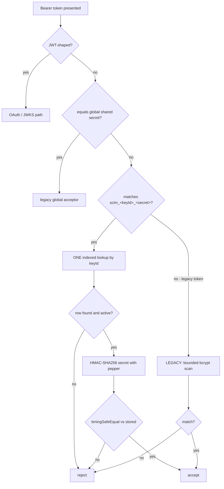
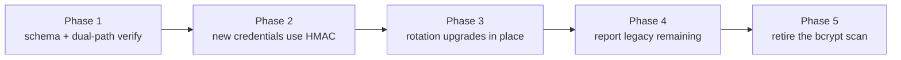

# P1 - Keyed credential lookup (replacing the O(N) x bcrypt scan)

**Status:** DESIGN - not yet implemented
**Severity:** High (re-rated from Medium on measurement, 2026-08-27)
**Last verified:** 2026-08-27
**Owner:** auth workstream
**Register entry:** [REMAINING_WORK_REGISTER.md](REMAINING_WORK_REGISTER.md) - P1

---

## 1. The problem, measured

When a caller presents an **opaque** per-endpoint token, the server cannot tell
which credential it belongs to, because the token carries nothing that
identifies itself. So it compares the presented token against **every active
credential on the endpoint**, one bcrypt at a time, in
[endpoint-credential.authenticator.ts](../../api/src/modules/auth/authenticators/endpoint-credential.authenticator.ts):

```ts
const credentials = await this.credentialRepo.findActiveByEndpoint(endpointId);
for (const cred of credentials) {
  const isMatch = cred.credentialHash ? await compare(token, cred.credentialHash) : false;
  if (isMatch) { /* accept */ }
}
```

Measured on this codebase (bcrypt cost factor 12, `npm run` on the dev machine,
2026-08-27):

| Active credentials | Worst-case auth cost |
|---:|---:|
| 1 | 287 ms |
| 3 | **860 ms** - already past the 800 ms `9z-BQ` latency gate |
| 5 (current default cap) | 1,433 ms |
| 10 | 2,866 ms |
| 25 (current max cap) | **7,165 ms** |

Three properties make this a denial-of-service surface rather than a latency
annoyance:

1. **The loop is reachable by an UNAUTHENTICATED caller.** Anyone who knows an
   endpoint id can send `Authorization: Bearer <any non-JWT string>` and force
   the full scan. Failing costs the server the *maximum*, because a mismatch only
   returns after every credential has been tried.
2. **The estate is small.** Container Apps replicas are 0.5 vCPU, single replica
   per revision. bcrypt is CPU-bound and blocks a worker thread.
3. **There is no HTTP rate limiting.** `@nestjs/throttler` is still on the
   deferred backlog, so nothing bounds request *frequency* either.

### 1.1 What is already mitigated

The X9 work added two short-circuits that skip the loop entirely, and they are
genuinely effective for legitimate traffic:

- **JWT-shaped tokens** skip it (a JWT can never match an opaque secret).
- **The global shared secret** skips it.

The P2 caps (v0.55.15) bound N to 5/5/10 by default, 25 maximum. That reduces the
worst case from unbounded to 7.2 s.

**None of this removes the amplification.** A caller who sends a random non-JWT
string still pays the full N x 287 ms, and N is attacker-visible only in the
sense that it is whatever the operator configured.

---

## 2. Why bcrypt is the wrong primitive *here*

This is the crux, and it is easy to get backwards.

bcrypt is deliberately slow to make **brute-forcing a human-chosen password**
expensive. OWASP's slow-hash guidance exists for that threat model.

A per-endpoint credential is **not a password**. It is minted by the server:

```ts
const plaintext = crypto.randomBytes(32).toString('base64url');
```

That is **256 bits of entropy**. Brute-forcing it is not merely impractical, it
is arithmetically impossible - there is no dictionary, no reuse, no human
pattern. A slow KDF therefore buys **nothing** against the only attack it was
designed to stop, while costing 287 ms on every verification.

This is the same conclusion GitHub, Stripe and AWS reached for API tokens: a
**high-entropy random secret** needs only a fast cryptographic hash plus a
constant-time comparison. The slowness is pure cost with no corresponding
benefit.

> **The one thing bcrypt still gives us** is that its output is salted, so two
> identical secrets produce different hashes. With a random 256-bit secret,
> collisions do not occur, so per-row salt is not load-bearing either. What *is*
> worth keeping is defence against a database-only compromise - addressed by a
> server-side **pepper** in section 3.3.

---

## 3. Proposed design

### 3.1 Token format

Give the token a **public, non-secret lookup key** so the server can find exactly
one candidate row:

```text
scim_<keyId>_<secret>
     |       |
     |       +-- 32 random bytes, base64url (the actual secret, never stored)
     +---------- 12 random bytes, base64url (public identifier, stored + indexed)
```

The `scim_` prefix is deliberate: it makes the credential greppable in secret
scanners (GitHub secret scanning, trufflehog) and instantly recognisable in a
support ticket.

### 3.2 Verification path



Cost of the new path: **one indexed SELECT + one HMAC**. Measured HMAC-SHA256
cost on the same machine: **0.00419 ms**, i.e. roughly **68,000x faster** than a
single bcrypt compare - and it no longer multiplies by N.

### 3.3 Storage

Add to the credential row:

| Column | Purpose |
|---|---|
| `lookupKey` | the public `keyId`, **UNIQUE indexed** - this is what makes it O(1) |
| `secretHash` | `HMAC-SHA256(pepper, secret)`, 32 bytes |
| `hashAlgo` | discriminator: `bcrypt` (legacy) or `hmac-sha256-v1` |

`credentialHash` stays for legacy rows. `hashAlgo` is what lets both formats
coexist without guessing.

**The pepper** is a server-side key (env `CREDENTIAL_HASH_PEPPER`), never stored
in the database. It restores the property bcrypt gave us for free: a dump of the
credentials table alone is not sufficient to verify tokens offline. Rotating it
requires re-issuing credentials, so it should be treated like `JWT_SECRET`.

> **Open question for review:** whether the pepper should live in Key Vault
> rather than an env var. Deferred deliberately - it is the same class of secret
> as `JWT_SECRET` and `OAUTH_CLIENT_SECRET`, and should be solved for all three
> together (see the deferred Managed Identity backlog item), not just this one.

### 3.4 Constant-time comparison

`crypto.timingSafeEqual` on the two 32-byte digests. Compare **digests, not
secrets**, so the lengths are always equal and `timingSafeEqual` cannot throw.

---

## 4. Migration

The hard constraint: **existing credentials must keep working.** They have no
`lookupKey` and their secret is unrecoverable (bcrypt is one-way), so they cannot
be silently upgraded.



| Phase | What happens | Reversible? |
|---|---|---|
| 1 | Add columns; verification handles both `hashAlgo` values. No behaviour change. | yes |
| 2 | Newly created credentials get `scim_<keyId>_<secret>` + HMAC. Legacy rows untouched. | yes |
| 3 | `POST .../rotate` issues the new format, so the existing rotation flow *is* the migration path - no new operator concept. | yes |
| 4 | Surface a per-endpoint count of remaining legacy credentials (extends the `check-credential-cap-impact.ps1` idea) so the tail is visible rather than assumed. | yes |
| 5 | Only once the measured legacy count is zero across all estates: delete the loop and the `bcrypt` dependency. | one-way |

**Phase 5 must be gated on measurement, not on elapsed time.** "It has been three
months, probably fine" is the reasoning that produced the EOL-Node escape.

### 4.1 Bounding the legacy path meanwhile

Until phase 5, the legacy scan still exists. It should:

- run **only** when the token does not parse as `scim_<keyId>_<secret>`, and
- iterate only credentials with `hashAlgo = 'bcrypt'`.

Both narrow the window without changing behaviour for anyone.

---

## 5. What this does NOT solve

Stated explicitly so the doc cannot be read as claiming more than it delivers:

- **It is not rate limiting.** One indexed lookup per request is cheap, but a
  flood is still a flood. `@nestjs/throttler` remains a separate backlog item and
  this design does not replace it.
- **It does not change the P2 caps.** They stay useful: they bound the legacy
  path during migration, and they bound row growth afterwards.
- **It does not address credential storage encryption** (`secretEnvelope` /
  `CredentialSecretVisibility`), which is an orthogonal feature.

---

## 6. Test plan (written before the code, per Stage 0)

| Level | Assertion |
|---|---|
| Unit | a `scim_`-format token verifies via exactly **one** repository call - assert the call count, because "it works" would also pass if it fell through to the scan |
| Unit | a wrong secret with a **valid** keyId rejects, and does *not* fall back to scanning |
| Unit | a legacy token still verifies via bcrypt (`hashAlgo='bcrypt'`) |
| Unit | rotation of a legacy credential yields `hashAlgo='hmac-sha256-v1'` + a `lookupKey` |
| Unit | timing: a mismatched keyId does not perform an HMAC at all |
| E2E | a newly minted credential authenticates a real SCIM request over HTTP |
| E2E | an existing (legacy-format) credential keeps working - **the migration's whole promise** |
| Live | `9z-` section: mint, authenticate, rotate, authenticate again |
| **Perf** | with 25 active credentials, an **unauthenticated** wrong-token request completes in **< 50 ms** (today: ~7,165 ms). This is the assertion that proves the item, and it must be a *measured bound*, not a presence check - see R10. |

The perf assertion needs a **negative control**: the same measurement against a
legacy-only endpoint must still show the slow path, or the test is not proving
that the fast path is what made it fast.

---

## 7. Design/architecture gate

| Question | Answer |
|---|---|
| SRP | Verification strategy moves behind a seam; the authenticator stops knowing *how* a secret is hashed. Net reduction in its responsibilities. |
| Coupling | `hashAlgo` is a discriminator on the row, so the strategy is selected by data rather than by a branch the caller maintains. |
| Pattern consistency | Matches the existing `IAssertionTokenProvider` / repository-seam patterns already in this codebase. |
| Open/Closed | A third algorithm later (e.g. `hmac-sha256-v2` after a pepper rotation) is a new strategy, not an edit to the verifier. |
| Simplicity (YAGNI) | **Two** real implementations exist from day one (legacy bcrypt + HMAC), so the seam is justified rather than speculative. A general "hashing policy DSL" would not be, and is rejected. |
| Disposition | **(b) scheduled** - this document; implementation not yet started. |
