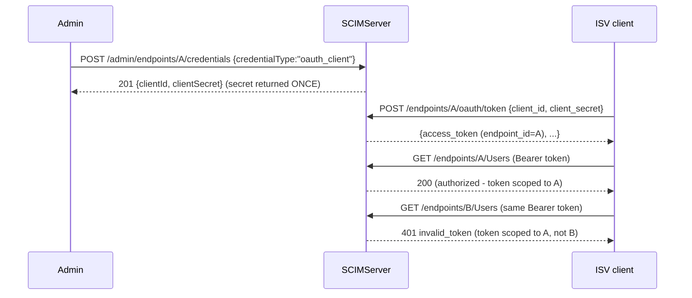

# Per-Endpoint OAuth Client + Per-Endpoint Token Issuer (Q1)

> Step **Q1** of the authentication build ([AUTHENTICATION_ARCHITECTURE.md section 13](AUTHENTICATION_ARCHITECTURE.md#13-step-by-step-execution-plan--estimates--dependencies), tracked in [EXECUTION_LEDGER.md](EXECUTION_LEDGER.md)). Detail: [WIF section 13](WIF_JWT_BEARER_ASSERTION_FOR_SCIM.md). Closes ISV Pattern 5 (Entra Gallery mandate: per-endpoint `client_id`/`client_secret` pairs).

## What changed

SCIMServer had ONE global OAuth client (`OAUTH_CLIENT_ID`/`OAUTH_CLIENT_SECRET`) minting tokens valid for every endpoint. Q1 adds a **per-endpoint** OAuth client: each endpoint can own its own `client_id`/`client_secret`, exchanged at a per-endpoint token endpoint for a token that is scoped to **only that endpoint**.

## The three pieces

### 1. `oauth_client` credential create

`POST /admin/endpoints/:id/credentials` with `credentialType: "oauth_client"` ([admin-credential.controller.ts](../../api/src/modules/scim/controllers/admin-credential.controller.ts)) now returns a **`clientId` + `clientSecret` pair** instead of a bearer `token`:

- `clientId` (public, prefix `epc_`) rides `EndpointCredential.metadata.clientId`.
- `clientSecret` (the one-time plaintext) is bcrypt-hashed into `credentialHash`; the plaintext is returned ONCE and never stored or returned again.
- The list endpoint exposes the public `clientId` for `oauth_client` rows but never the secret (no-secret contract).

### 2. Per-endpoint token issuer

`POST /scim/endpoints/:endpointId/oauth/token` ([endpoint-oauth.controller.ts](../../api/src/modules/scim/controllers/endpoint-oauth.controller.ts)) authenticates the `client_id`/`client_secret` against the endpoint's active `oauth_client` credentials (bcrypt compare) and mints a token via `OAuthService.generateEndpointAccessToken` ([oauth.service.ts](../../api/src/oauth/oauth.service.ts)). The token carries:

- `endpoint_id` - the scoping claim.
- `aud` - a per-endpoint audience (`<global-aud>:<endpointId>`) distinct from the global token audience.
- Signed with the Pre-Q.B asymmetric key (RS256), so the resource guard verifies it via the existing path.

### 3. Resource-guard scoping (the security core)

[shared-secret.guard.ts](../../api/src/modules/auth/shared-secret.guard.ts) now enforces the `endpoint_id` claim. A token carrying `endpoint_id=A`:

- authorizes routes under `/endpoints/A/...`;
- is **rejected** ("mine-but-invalid-stop") on `/endpoints/B/...` or any non-endpoint route, with an enriched `WWW-Authenticate: ... error="invalid_token"`;
- crucially does **not** fall through to the legacy-secret acceptor on mismatch (downgrade-confusion defense). The scoping check is OUTSIDE the validate try/catch so the rejection is never swallowed.

A **global** token (no `endpoint_id`) is unchanged: it still authorizes any endpoint route.

## Cross-backend parity

The `oauth_client` credential rides the existing `EndpointCredential` table + `metadata` JSON column; both the InMemory and Prisma repos round-trip `metadata` identically. Validated on inmemory + Prisma (Docker) + dev Azure.

## Test coverage

| Layer | Test | Covers |
|---|---|---|
| Unit | [oauth-asymmetric.spec.ts](../../api/src/oauth/oauth-asymmetric.spec.ts) "per-endpoint token issuance (Q1)" | `endpoint_id` + per-endpoint `aud` + RS256 + scope handling |
| Unit | [admin-credential.controller.spec.ts](../../api/src/modules/scim/controllers/admin-credential.controller.spec.ts) | `oauth_client` returns clientId+clientSecret; only the hash is stored |
| Unit | [shared-secret.guard.spec.ts](../../api/src/modules/auth/shared-secret.guard.spec.ts) "per-endpoint OAuth token scoping (Q1)" | own-endpoint accept; cross-endpoint reject; non-endpoint reject; no legacy fall-through; global token unaffected |
| E2E | [endpoint-oauth-client.e2e-spec.ts](../../api/test/e2e/endpoint-oauth-client.e2e-spec.ts) | full slice: create -> mint -> authorize own -> reject other -> no-secret list |
| Live | `scripts/live-test.ps1` section **9z-AP** | the full slice across all 3 form factors |

> **Note for A3.** The per-endpoint token endpoint currently rides the SCIM exception filter, which wraps the RFC 6749 5.2 `error` into the SCIM envelope `detail`. The raw OAuth error-response format (top-level `error`/`error_description`) for the token endpoint is formalized in A3's error catalog + the form-urlencoded routing cascade.
