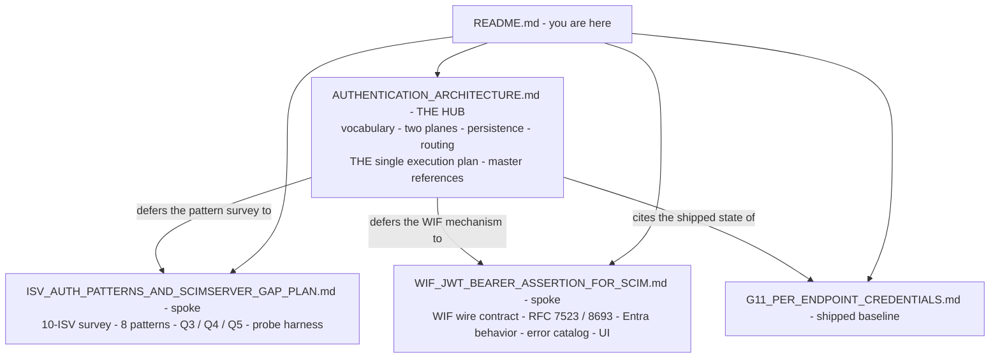

# SCIMServer Authentication - documentation cluster

> **Start here.** This folder holds the complete authentication analysis + design for SCIMServer. The docs are a **hub-and-spoke set**, not four overlapping essays. This README is the navigational index and the single answer to "where is the plan?".

> **Status of the cluster.** Everything past the shipped G11 baseline is **analysis + design only - no code has been implemented** for the `authenticationMethods[]` model, WIF, or the Phase Q sub-phases. The factual shipped baseline (3-tier guard chain, global HS256 OAuth issuer, per-endpoint bcrypt bearer) is described in [AUTHENTICATION_ARCHITECTURE.md section 4](AUTHENTICATION_ARCHITECTURE.md#4-current-scimserver-state-source-grounded) and [G11_PER_ENDPOINT_CREDENTIALS.md](G11_PER_ENDPOINT_CREDENTIALS.md).

---

## The hub and its spokes

| Doc | Role | Read it for | Authoritative for |
|---|---|---|---|
| [AUTHENTICATION_ARCHITECTURE.md](AUTHENTICATION_ARCHITECTURE.md) | **HUB / umbrella** (newest, 2026-06-18) | the overall system: how an endpoint holds several auth methods at once, the vocabulary, the two planes, persistence, the routing cascade, and **the one reconciled execution plan** | overall architecture + vocabulary + the cross-doc plan |
| [WIF_JWT_BEARER_ASSERTION_FOR_SCIM.md](WIF_JWT_BEARER_ASSERTION_FOR_SCIM.md) | spoke (WIF deep-dive) | the WIF mechanism end-to-end: RFC 7523 §2.2 vs RFC 8693 wire shapes, the two shipping bodies (SAP SuccessFactors, Google), how Entra/SyncFabric mints the assertion, the v2-only decision, the error catalog, the reciprocal UI | the WIF wire contract + Entra behavior |
| [ISV_AUTH_PATTERNS_AND_SCIMSERVER_GAP_PLAN.md](ISV_AUTH_PATTERNS_AND_SCIMSERVER_GAP_PLAN.md) | spoke (pattern survey) | the 10-ISV industry matrix, the 8-pattern catalog, and the patterns the hub plan does **not** schedule on the WIF critical path: Q3 (SCIMServer as an OAuth client for probing), Q4 (auth-code), Q5 (mTLS/DPoP), plus the adjacent gaps (429/Retry-After, IP allowlist, expiry telemetry) | the ISV pattern landscape + the probe direction |
| [G11_PER_ENDPOINT_CREDENTIALS.md](G11_PER_ENDPOINT_CREDENTIALS.md) | shipped baseline | the per-endpoint bcrypt-bearer feature that is **already in production** and that everything else extends | the shipped per-endpoint credential model |

---

## Where is the plan?

There is **one** reconciled, cross-cutting execution plan: **[AUTHENTICATION_ARCHITECTURE.md section 13](AUTHENTICATION_ARCHITECTURE.md#13-step-by-step-execution-plan--estimates--dependencies)**.

The two spokes carry **deliverable detail** under the phases that plan names - they do not define competing plans:
- [WIF section 13](WIF_JWT_BEARER_ASSERTION_FOR_SCIM.md#13-step-by-step-implementation-plan) is the detailed per-step file/test/gate recipe for the WIF phases (Pre-Q, Q1, Q2, Q6).
- [ISV section 5](ISV_AUTH_PATTERNS_AND_SCIMSERVER_GAP_PLAN.md#5-phased-implementation-plan-phase-q) is the original phase *schedule* (Q0-Q6) and is the only home for the separable Q3/Q4/Q5 tracks.

### Numbering reconciliation

The three docs were written at different times and used three numbering schemes. They map onto the **unified step id** (hub §13) as follows:

| Unified step (hub §13) | ISV §5 | WIF §13 | Delivers | Track |
|---|---|---|---|---|
| **Pre-Q.A** | §7.2 pre-work | Pre-Q.A | `structured` config flag-type + validator | enabling |
| **Pre-Q.B** | §7.2 pre-work | Pre-Q.B | RS256/ES256 externalized signing key + published JWKS | enabling |
| **Q0** | Q0 | folded into A2 + Q6.1 | enrich `WWW-Authenticate`, add `aud` claim, RFC 8414 metadata | enabling |
| **A0** | - | - | `profile.authentication.methods[]` model (inert) | backbone |
| **Q1** | Q1 | Q1 (prereq) | per-endpoint `oauth-client` credential + per-endpoint issuer | critical path |
| **Q2** | Q2 | Q2 (prereq) | `jose` external JWKS validator | critical path |
| **A1** | - | Q6.2 D5 | admin `/authentication/methods` CRUD + orthogonal create gate | backbone |
| **A2** | §4.3 adjacent | Q6.6 / F3 | computed `authenticationSchemes` + RFC 8414 + JWKS publication | backbone |
| **A3** | - | Q6.1 | form-urlencoded intake + self-describing routing cascade | backbone |
| **Q6** | Q6 | Q6.1-Q6.5 | WIF `wif-7523` provider + `wif-8693` seam + reciprocal UI | critical path |
| **A4** | - | - | `identityModel` / roles / scopes seams (inert) + shadow telemetry | backbone |
| **Q3** | Q3 | - | SCIMServer as an OAuth **client** (probe direction) | separable |
| **Q4** | Q4 | - | Authorization-Code + refresh + PKCE | separable (on demand) |
| **Q5** | Q5 | - | mTLS + DPoP | separable (deferred) |

Critical path: `Pre-Q.B -> {Q1 || Q2} -> A3 -> Q6 -> A4`, with `Pre-Q.A -> A0 -> {A1 || A2}` feeding in. Q3/Q4/Q5 are independent tracks that do not gate WIF.

### Effort (scope-labelled, so the two totals are not read as contradictory)

| Scope | Ideal dev-days | Source |
|---|---|---|
| **WIF-only slice** (Pre-Q + Q1 + Q2 + Q6, skipping the A-series backbone) | ~24-38 | [WIF section 14](WIF_JWT_BEARER_ASSERTION_FOR_SCIM.md#14-effort-estimates) |
| **Full architecture superset** (adds the A0-A4 cross-cutting model) | ~29-44 | [hub section 13.3](AUTHENTICATION_ARCHITECTURE.md#13-step-by-step-execution-plan--estimates--dependencies) |

The ~5-6 day delta buys the generalized `methods[]` backbone that turns 1P / roles / scopes / future auth types into **config instead of rework**. These are ideal engineering-days for one developer fluent in the repo, not calendar dates.

---

## Coverage at a glance

| Pattern | SCIMServer status | Closes in |
|---|---|---|
| 1 - Long-lived global bearer (legacy shared secret) | **SHIPPED** | - |
| 2 - OAuth 2.0 client_credentials (issuer mode, single global pair) | **SHIPPED** | - |
| 3 - Per-endpoint bcrypt bearer (multi-tenant) | **SHIPPED** (G11) | - |
| 5 - Per-endpoint client_id/secret pairs (Entra Gallery mandate) | GAP | Q1 |
| 4 - External JWKS-validated JWT | GAP | Q2 |
| 8 - Workload Identity Federation (RFC 7523 + RFC 8693) | GAP | Q6 |
| 6 - Authorization-Code + refresh | GAP | Q4 (on demand) |
| 7 - mTLS / DPoP | GAP | Q5 (deferred) |
| HTTP Basic (`httpbasic`) | provably absent; deliberately not designed | one-provider add if ever needed |

Full 10-ISV matrix + per-pattern detail: [ISV sections 2-4](ISV_AUTH_PATTERNS_AND_SCIMSERVER_GAP_PLAN.md#2-industry-pattern-matrix-10-isvs).

---

## RFC explainers and authoritative text

Each load-bearing RFC has a plain-language explainer in this folder, and the normative text is mirrored under [rfcs/](rfcs/) so the source travels with the design. The master reference list (RFCs with the exact sections each phase relies on) is **[hub section 14](AUTHENTICATION_ARCHITECTURE.md#14-references-rfcs-with-sections--sources)**.

| RFC | Explainer | What it governs here |
|---|---|---|
| 6749 | [RFC_6749_EXPLAINED.md](rfcs/RFC_6749_EXPLAINED.md) | OAuth 2.0 framework: one token endpoint by `grant_type`, scope §3.3, error catalog §5.2 |
| 6750 | [RFC_6750_EXPLAINED.md](rfcs/RFC_6750_EXPLAINED.md) | Bearer usage + the `WWW-Authenticate` header enrichment (Q0) |
| 7517 | [RFC_7517_EXPLAINED.md](rfcs/RFC_7517_EXPLAINED.md) | JWK / JWKS publication shape |
| 7519 | [RFC_7519_EXPLAINED.md](rfcs/RFC_7519_EXPLAINED.md) | JWT structure + validation |
| 7521 | [RFC_7521_EXPLAINED.md](rfcs/RFC_7521_EXPLAINED.md) | Assertion framework (parent of 7523) |
| 7523 | [RFC_7523_EXPLAINED.md](rfcs/RFC_7523_EXPLAINED.md) | the WIF `jwt-bearer` profile (client authentication §2.2) |
| 7591 | [RFC_7591_EXPLAINED.md](rfcs/RFC_7591_EXPLAINED.md) | `token_endpoint_auth_method` registry values |
| 7636 | [RFC_7636_EXPLAINED.md](rfcs/RFC_7636_EXPLAINED.md) | PKCE (Q4 public clients) |
| 8414 | [RFC_8414_EXPLAINED.md](rfcs/RFC_8414_EXPLAINED.md) | OAuth AS metadata discovery (token URL independence) |
| 8693 | [RFC_8693_EXPLAINED.md](rfcs/RFC_8693_EXPLAINED.md) | the WIF `token-exchange` profile (Google's flow) |
| 8705 | [RFC_8705_EXPLAINED.md](rfcs/RFC_8705_EXPLAINED.md) | mTLS + certificate-bound tokens (Q5) |
| 9449 | [RFC_9449_EXPLAINED.md](rfcs/RFC_9449_EXPLAINED.md) | DPoP sender-constrained tokens (Q5) |
| 9700 | [RFC_9700_EXPLAINED.md](rfcs/RFC_9700_EXPLAINED.md) | OAuth 2.0 Security BCP (OAuth 2.1) |

SCIM core RFCs (7642 / 7643 / 7644) are mirrored under [../rfcs/](../rfcs/), not here - this folder's [rfcs/](rfcs/) holds only the OAuth / WIF assertion RFC text.

---

## Reading orders

- **"I need the system model"** -> [hub](AUTHENTICATION_ARCHITECTURE.md) §0 TL;DR -> §1 vocabulary -> §2 two planes -> §5 placement -> §7 API surfaces -> §8 routing -> §13 plan.
- **"I'm implementing WIF"** -> [hub](AUTHENTICATION_ARCHITECTURE.md) §4 current state -> [WIF](WIF_JWT_BEARER_ASSERTION_FOR_SCIM.md) §2 wire -> §4 claims/validation -> §8 backend -> §13 recipe -> hub §13 for how it fits the backbone.
- **"I'm onboarding a new ISV"** -> [ISV](ISV_AUTH_PATTERNS_AND_SCIMSERVER_GAP_PLAN.md) §2 matrix -> §3 the 8 patterns -> §4 gap ranking.
- **"What ships today?"** -> [G11](G11_PER_ENDPOINT_CREDENTIALS.md) + [hub](AUTHENTICATION_ARCHITECTURE.md) §4.
