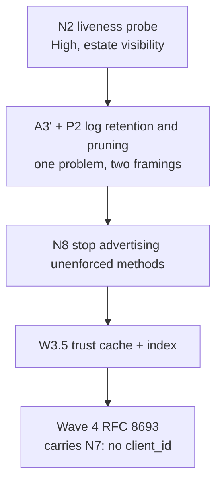

# Auth work register (X16) - what works, what is left

**Last verified:** 2026-08-19 against `feat/wif` (api + web **0.55.9**), SyncFabric `origin/master`
`38c429b511`, canonical WIF guide revision 7 (6,503 lines, mirror byte-identical).

**How to read this.** Section 1 answers *"which authentication methods actually work?"*. Section 2 is
everything remaining, grouped by **what it is for**, with the component it affects. Section 3 is what
shipped. Appendix B records how each status was verified, and the three findings this register got
wrong and retracted - read it before trusting any single row.

---

## 1. At a glance: which authentication methods work today

**Two planes.** The *token endpoint* mints a token; the *resource plane* accepts one on a SCIM call.
A method can be supported on one and not the other, which is where most confusion comes from.

### 1.1 Token endpoint - how a client obtains a token

| Method | Wire shape | Status | Gap |
|---|---|---|---|
| **`client_secret_post`** | `grant_type=client_credentials` + `client_secret` in body | **WORKS** | - |
| **`client_secret_basic`** | same, credentials in `Authorization: Basic` | **WORKS** | - |
| **WIF / RFC 7523 §2.2** (`private_key_jwt`) | `grant_type=client_credentials` + `client_assertion` + jwt-bearer type | **WORKS** - this is the SyncFabric production flow | - |
| **RFC 8693 token exchange** | `grant_type=...:token-exchange` + `subject_token` | **NOT IMPLEMENTED** - returns a clean `400 unsupported_grant_type` | **W4.1** |

### 1.2 Resource plane - how a caller authenticates a SCIM request

| Method | Status | Gap |
|---|---|---|
| **Global shared secret** (bearer) | **WORKS** | - |
| **Per-endpoint bearer credential** | **WORKS** | - |
| **OAuth JWT** (a token SCIMServer minted) | **WORKS** | - |
| **HTTP Basic** | **NOT SUPPORTED.** Basic is accepted at the *token endpoint* only | no item; see F-F |
| **mTLS** | **NOT ENFORCED** - the name is declarable and gets advertised in SCIM discovery, but no authenticator implements it | **N8** |
| **DPoP** | **NOT ENFORCED** - same as mTLS | **N8** |

> **N8 is the row to notice.** `mtls`, `dpop` and `oauth-authcode` can be declared on an endpoint and
> will appear in `ServiceProviderConfig.authenticationSchemes`, but nothing enforces them. The server
> advertises a capability it does not have.

### 1.3 Token profile

| Property | Status |
|---|---|
| `jti` on every issued token | **WORKS** (W3.8) |
| Provenance claims (`auth_method`, `src_*`) | **WORKS** (W3.8) |
| Lifetime capped at the assertion expiry | **WORKS** (W3.6) |
| `typ=at+jwt` (RFC 9068 conformance) | **MISSING** - **W5.3** |
| Introspection / revocation (RFC 7662 / 7009) | **NOT IMPLEMENTED** - **W5.4**, optional track |

---

## 2. What is remaining, by purpose

Every row says what the item is **for** and what it **affects**. `Sev` is severity; `Blocked by` is
empty when the item can start today.

### 2.1 Make more authentication methods work

*Purpose: extend what a client can authenticate with.*

| ID | What it is for | Affects | Sev | Blocked by |
|---|---|---|---|---|
| **W4.1** | Accept SyncFabric's RFC 8693 token-exchange flow | token endpoint | High | W2, W3 (both done) |
| **W4.2** | Advertise token-exchange only once W4.1 is live | RFC 8414 metadata | Low | W4.1 |
| **W4.3** | Prove W4.1 against a real SyncFabric request | empirical gate | Med | W4.1 |
| **W5.3** | `typ=at+jwt` so RFC 9068 conformance is provable | issued token | Med | - |
| **W5.4** | Opaque tokens + introspection + revocation | token lifecycle | Low | W5.3. Optional track, split before starting |
| **W6.2** | `private_key_jwt` / mTLS / DPoP as first-class methods | both planes | Low | - . Future track, on demand |
| **N8** | Stop advertising `mtls` / `dpop` the server cannot enforce | SCIM discovery | Med | - |

**W4.1 is the spine.** It is the only item here that unblocks a flow SyncFabric can already be
configured to use: `configurableConnectorWorkloadIdentityTokenExchangeEnabled` is `Enabled=True`
globally, so a connector set to that type fails against SCIMServer today.

### 2.2 Harden the methods that already work

*Purpose: correctness and security of the live paths, not new capability.*

| ID | What it is for | Affects | Sev | Blocked by |
|---|---|---|---|---|
| ~~**A9**~~ | ~~Optimistic concurrency, so two concurrent profile writes cannot silently clobber~~ **DELIVERED v0.55.12, re-scoped** as B/C/D after measuring which writes can lose data - `settings` and `serviceProviderConfig` merge per key and were never at risk, so no precondition was added there. See [ENDPOINT_WRITE_CONCURRENCY.md](../ENDPOINT_WRITE_CONCURRENCY.md). The blanket "If-Match on profile writes" originally scoped here was **not** built. | endpoint profile writes | ~~High~~ | - |
| **A3'** | Bound RequestLog retention + restrict who can read it | request log | **High** | - |
| **A5** | Replay denylist keyed on Entra's `uti` (not `jti`) | WIF assertion validation | Med | - |
| **A7** | Reject a bare `api://<appId>` in `expectedAudience` as likely misconfiguration | WIF trust config | Med | - |
| **A4** | Residual: `client_id` is still not *required* when the trust pins no `targetClientId` | RFC 7523 path | Med | re-scope, mostly closed by W3.7 |
| **W5.2** | Enforce `oid` / `azp` claims once real shapes are observed | WIF assertion validation | Med | W3 + capture |
| **N12** | Auth-admin events log `credentialId: [REDACTED]`, so the audit trail cannot say *which* credential changed | credential audit | Med | - |

**N6 is the one with a live trigger.** `workloadIdentityFirstPartyApplicationIsDefault` is on for
`slice:A` and `slice:B` and off globally, and the two modes emit `api://<appId>` versus
`api://<appId>/<host>`. A slice rollout would present as an audience-mismatch `401` with **no
SCIMServer change involved**. Needs an operator runbook at minimum.

**N6 is RESOLVED (v0.55.11) - by runbook, not by code.** The slice-dependent `aud` shape is real, but
the remedy already existed: multi-trust iteration means registering **both** audience shapes as two
trusts works, with each still matching exactly. Verified at three levels and documented in
[N6_SLICE_DEPENDENT_AUDIENCE_RUNBOOK.md](N6_SLICE_DEPENDENT_AUDIENCE_RUNBOOK.md). The `wif_audience_mismatch`
remediation text now names the cause, so an operator meets the answer at the error rather than in a
doc. **No audience-matching code was changed** - prefix or wildcard matching was explicitly rejected
as converting an exact check into a pattern check.

**Settled - do not re-raise:** **W0.1** (request-secret capture stays on by design, declined twice)
and **W3.3** (endpoint-UUID audience default, deferred pending operator confirmation; no correctness
hole exists to close unilaterally).

### 2.3 Performance

*Purpose: latency and cost of the auth hot paths.*

| ID | What it is for | Affects | Sev | Blocked by |
|---|---|---|---|---|
| **W3.5** | Trust cache + typed lookup + composite index, so a warm mint skips the DB | token mint warm path | Med | - . `findAllActiveByType` landed with W1.2; the per-endpoint cache and the composite index remain |
| **P1** | Opaque per-endpoint secrets bcrypt-compare against **every** credential on the endpoint | resource plane | Med | - |
| **P2** | Nothing caps or prunes credentials or request-log rows | resource plane + storage | Med | - . Solve **with A3'** |

**P1 and P2 have no wave number** - they were inherited from the X9 latency RCA and never promoted
into the plan, so a plan-driven review could not see them. bcrypt is deliberately slow, which makes
P1 the most expensive O(N) loop in the resource plane.

### 2.4 Structure and configuration

*Purpose: how auth config is modelled, not what it does.*

| ID | What it is for | Affects | Sev | Blocked by |
|---|---|---|---|---|
| **W5.1** | Finite auth-persona catalog, so parser + metadata + UI derive from one definition | cross-cutting | Med | W2-W4. YAGNI risk: presets only, no DSL |
| **N10** | `GlobalAuthPolicy` - the runtime-tunable global ceiling | global policy | Med | - . Designed, **unbuilt**, and has no wave number |
| **W6.1** | Remove legacy fallbacks once telemetry proves zero use | cross-cutting | Low | W3-W5 + telemetry |
| **W2.5 tail** | Retire the `PerEndpointCredentialsEnabled` umbrella | enablement flags | Low | - . Core shipped |
| **W3.1 tail** | Versioned `WifTrustV2` aggregate + migration state machine | trust storage | Low | - . May never be needed |

### 2.5 Operability

*Purpose: knowing the estate is healthy.*

| ID | What it is for | Affects | Sev | Blocked by |
|---|---|---|---|---|
| **N2** | A scheduled liveness probe. All 5 scheduled workflows are static gates | all estates | **High** | - |

Customer-facing prod being down was found by inspection, not by alert. `audit-deployment-doc.ps1
-Live` C4 does catch it, but only runs post-deploy, so a dead estate between deploys is invisible.

**Non-auth, tracked elsewhere:** issues **#144** (8 vulnerable pins in `overrides`) and **#142** (2
stale `.trivyignore` entries); Dependabot **#146, #147, #143, #128**; customer prod reactivates
automatically **2026-08-21**; `registry.npmjs.org` is TLS-blocked locally so lockfile regeneration
must happen in CI.

### 2.6 Documentation and process integrity

*Purpose: keeping the record true. Cheap, and the reason several defects above were found late.*

| ID | What it is for | Sev |
|---|---|---|
| **N4** | Bind the delivery plan's summary table to item status, or delete the duplication | Med |
| **N3** | `[Unreleased]` has absorbed every version since `0.54.0-alpha.12` | Med |
| **N11** | `CONTEXT_INSTRUCTIONS.md` still says `0.54.89`; it is outside the freshness manifest | Low |
| **N5** | Guide action items cite paths that do not exist | Low |
| **A2** | Transport persona axis (folds into W5.1) | Med |
| **A6** | Surface `azpacr` in the decision trace | Med |
| **A15** | Model a fail-closed denial in test-ISV scenarios | Med |
| **A11** | Document the 6 profile merge rules | Low |
| **A14** | Document that the token-endpoint host is config-gated | Low |

### 2.7 Empirical gates still unmet

| Gate | Blocks |
|---|---|
| First-party sovereign application ID | 1P enforcement |
| Real SyncFabric capture, **both** acquisition modes | W3.2 / W5.2 enforcement, and **N6** - a capture from one slice does not characterize the other |
| Real SyncFabric RFC 8693 request capture | W4 |
| Fail-closed denial telemetry from SyncFabric | A15 |

> **Check before deferring again:** the WIF token-mint latency gate has been deferred four times, but
> commit `6504626e` "docs: WIF token-mint latency analysis (X11)" already exists and was never
> consulted. It may already be satisfied.

---

## 3. What is delivered

**Delivery-plan waves: 21 of 33 delivered, 2 settled, 10 open.**

| Wave | State |
|---|---|
| **0** Correctness | **Complete** - W0.2, W0.3 (W0.1 declined) |
| **1** Perf foundation | **Complete** - W1.1, W1.2, W1.3, W1.4, W1.5, W1.6, W1.7a/b/c (W1.2 closed it in v0.55.10) |
| **2** Structural seam | **Complete** - W2.1 .. W2.5 |
| **3** RFC 7523 correctness | W3.2, W3.4, W3.6, W3.7, W3.8, W3.9 + W3.1 partial. W3.5 open, W3.3 deferred |
| **4, 5, 6** | Not started |

**Guide actions: 5 of 15 closed** - A1/A13 (mirror re-synced, byte-identical at 6,503 lines), A4
(largely, via W3.7), A8 (v0.55.8), A10 (v0.55.9), A12 (v0.55.8).

**Whole tracks complete:** WI-1..17 (connection-info), U1..12 (Connect + Logs UX), V1..12 (credential
lifecycle), the durable-logs W1..12 (**a different W-series** from the delivery plan's W0.1-W6.2 -
do not conflate), the Pre-Q / Q / A unified steps (Q3, Q4, Q5 remain deferred tracks), and F1..F6 of
the real-Entra proof findings.

**Performance:** X11 options A, B, C, D, H delivered (C closed by W1.2 in v0.55.10); G effectively
satisfied but never tracked; E and F open. All three X15 findings closed via W1.7b.

---

## 4. Do next, in order

Sequenced by value per unit of effort.



**Why this order.** **N2** is now the only remaining High-severity item (**A9** shipped in v0.55.12).
**A3' and P2 are the same problem**
(unbounded request-log growth) seen from the security and performance sides, so they should be solved
once, not twice. **W3.5** is the last thing gating Wave 4.

**Two constraints to carry into Wave 4:** **N7** - RFC 8693 omits `client_id` by design, so A4's
"require `client_id`" must **not** be generalized to the 8693 handler or the integration breaks
outright. And W4.1 must return HTTP 200 from day one.

---

## Appendix A: SyncFabric to SCIMServer flow comparison

Verified from source on both sides. SyncFabric's *connector configurations* are out of scope by
operator instruction; this compares auth-flow logic only.

SyncFabric's `AuthenticationType` declares six values: `None`, `Basic`, `TokenBasedBearerToken`,
`SyncPolicy`, `WorkloadIdentityClientAuthentication`, `WorkloadIdentityTokenExchange`. The last two
are the WIF flows.

**Flow A - `WorkloadIdentityClientAuthentication`** (the production flow):

```text
grant_type            = client_credentials
client_id             = <targetDirectoryClientIdentifier>   (required)
client_assertion      = <applicationToken>
client_assertion_type = urn:ietf:params:oauth:client-assertion-type:jwt-bearer
```

This is **RFC 7523 section 2.2 client authentication**, not the section 2.1 authorization grant. The
`grant_type` is `client_credentials`, **not** `urn:ietf:params:oauth:grant-type:jwt-bearer`. Building
a handler on the wrong one of those two is the easiest way to be silently incompatible. SCIMServer
accepts exactly this pair and the assertion-type URN matches character for character.

**Flow B - `WorkloadIdentityTokenExchange`** (unimplemented here):

```text
grant_type          = urn:ietf:params:oauth:grant-type:token-exchange
subject_token       = <applicationToken>
subject_token_type  = urn:ietf:params:oauth:token-type:jwt
+ optional: audience / scope / resource / requested_token_type
```

The builder's own comment says it **"deliberately omits `client_id`"** - the basis for N7.

**Findings not already captured as items above:**

- **F-D.** Flow A always sends `client_id`, so SCIMServer's `targetClientId` and SyncFabric's
  `targetDirectoryClientIdentifier` are **one coupled setting configured in two places**. A mismatch
  is a hard `401`.
- **F-F.** SyncFabric can be configured for `Basic` against a SCIM target; SCIMServer accepts Basic
  only at the token endpoint. Noted as an asymmetry, not proposed work.
- **F-G.** Trust selection decodes the assertion `iss` **without verifying it**, purely to *order*
  candidates so the common case does one JWKS verification instead of N. Every candidate is still
  fully verified, so a spoofed `iss` gains nothing, and W1.4/W1.5 bound the fallback. **Lower
  severity than the guide implies.**

---

## Appendix B: how these statuses were verified

**Read this before trusting any single row.** Status in this codebase has been wrong in *both*
directions, repeatedly, and always with confidence.

### B.1 Three findings this register got wrong and retracted

**C3, N1 and N9 are withdrawn.** All three descended from one bad read. The working tree sat on a
branch **3 commits behind `origin/master`**, and one of those commits set `api/package.json` to
`0.55.7`. So `package.json` genuinely read `0.55.6` and `git log -S` genuinely found nothing, because
`-S` searches the *current branch*. Both readings were true about the tree and false about the
product. From them this register concluded v0.55.7 was a phantom, that the canonical guide was wrong
to cite it, and that the Stage 1.12 F1 gate was blind. **The guide was right, the gate was right, and
this register was wrong three times.**

The compounding step is the instructive one: the tree was rebased mid-session, which silently made
the files `0.55.7`, and nothing re-verified the earlier conclusions. A finding survived the very
event that invalidated it.

> **Standing rule.** "X does not exist anywhere in the repo" is only as good as the tree it ran
> against. Confirm the tree is current before recording an absence-based finding, and **re-verify any
> absence-based finding after a rebase, merge or checkout.** Presence is self-evidencing; absence is
> not.

### B.2 Both directions of status error have occurred

| Direction | Where | Cause |
|---|---|---|
| **Under-reported** (claimed open, had shipped) | Delivery plan Section 1 - twice, 2026-08-04 and 2026-08-19 | The summary table duplicates the per-item status lines and nothing binds them. Tracked as **N4** |
| **Over-reported** (claimed open, had shipped) | The `docs/auth/` sweep - U1-U12, V1-V12, Pre-Q.A, DD1, DD3 | A doc-reading pass inferred status from each plan's *item table* instead of its *status header* |

Same root cause both times: **status lives in two places.** Verify against source before believing
either.

### B.3 Corrections still standing

| # | Source | What it claimed | What is true |
|---|---|---|---|
| **C1** | Plan Section 1 | JWKS refresh "still none, 10-min TTL" | W1.4 shipped in v0.55.5: background sweep, 24 h TTL |
| **C2** | Plan Section 1 | `client_secret` mint "inlined in the controller" | W2.3 shipped it as its own provider class |
| **C4** | Guide A8/A9/A12 | paths under `api/src/modules/endpoint/` | Real paths are `.../endpoint/**services**/` and `.../**scim/controllers**/` |
| **C5** | Guide | treats the flow generically as "RFC 7523" | It is specifically **section 2.2 client authentication** |

### B.4 Perf verification method

Every X11 option was probed against source rather than read from a status line, and **two of eight
probes returned false results**: a `prefetch|prewarm` search "found" W1.2 but matched
`X-DNS-Prefetch-Control` in the helmet config, and a `canonicalJwks` search "missed" W1.3 because the
field is named `resolvedUri`. One false positive and one false negative in eight - which is the
argument for recording the method next to the result.

---

## Appendix C: design and architecture gate

| Check | Finding | Disposition |
|---|---|---|
| SRP | This register reports state; item status stays on the item | **Applied** |
| Coupling | C1/C2 exist because one fact is stored in two places | **Scheduled** as N4 |
| Pattern fit | Grouping by purpose rather than by source document | **Applied** (2026-08-19 restructure) |
| YAGNI | No new abstraction proposed; N4 asks to **remove** a duplicated fact | **Applied** |

**R7 self-improvement.** The first version of this document was organized by *provenance* - one
section per source I had consulted - which mirrored the investigation rather than the reader's
question, and made "which auth methods work?" unanswerable without reading all twelve sections. That
is a documentation instance of the same defect the register keeps finding in code: **structure that
records how something was built instead of what it does.** Restructured by purpose on 2026-08-19.
