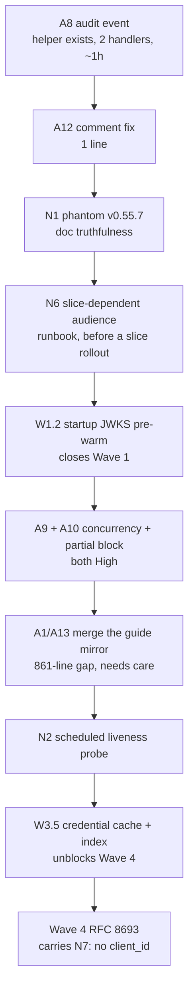

# Auth + WIF + SyncFabric remaining-work register (X16)

**Status:** STOCK-TAKE. Every row below was verified against real sources on **2026-08-19**, not
carried forward from a previous document.

**Last verified:** 2026-08-19

| Source | Snapshot verified | How |
|---|---|---|
| SCIMServer | `origin/master` `09b4b78d`, api + web `package.json` both **0.55.6** | `git rev-parse`, `package.json` read |
| SyncFabric | `origin/master` `38c429b511`, 2026-08-19, **0 commits ahead** of the guide's snapshot | `git fetch --prune` in `C:\one\AD-IAM-Services-SyncFabric` (read-only) |
| Canonical WIF guide | revision 7, **6,503 lines** (OneDrive) | line count |
| In-repo guide mirror | **5,642 lines** | line count |

This register exists because the answer to "what is left?" was spread across the delivery plan,
the canonical guide's action list, GitHub issues, and the deployment estate, and **each of those
four sources disagreed with the others**. Section 1 records what the cross-check corrected, and
**Section 4 is a flow-by-flow comparison of both codebases' authentication logic**.

**Scope exclusion:** SyncFabric's *connector configurations* are out of scope by operator
instruction; they are on an independent plan. Section 4 compares auth-flow logic only.

---

## 1. Corrections this stock-take made to its own sources

These are findings, not restatements. Each one means a document was saying something untrue.

| # | Source that was wrong | What it claimed | What is actually true | Evidence |
|---|---|---|---|---|
| **C1** | Delivery plan Section 1, JWKS row | "JWKS pre-warm / background refresh: **still none** (lazy fetch, 10-min TTL)" | W1.4 shipped in v0.55.5: a background refresh sweep exists (`refreshTimer`, `setInterval`, `unref`ed) and the TTL is 24 h | [external-jwks-validator.service.ts](../../api/src/oauth/external-jwks-validator.service.ts) L126-L174 |
| **C2** | Delivery plan Section 1, mint row | "Mint `client_secret` path: **inlined** in the controller" | W2.3 shipped: the provider is its own class with its own spec | [client-secret-token-provider.ts](../../api/src/modules/scim/controllers/client-secret-token-provider.ts) |
| **C3** | Canonical guide, gap-matrix header | `09b4b78d` is "**v0.55.7**" | **There is no v0.55.7.** No commit ever set `api/package.json` to `0.55.7`; there is no such CHANGELOG heading. The version is **0.55.6** | `git log -S'"version": "0.55.7"' -- api/package.json` returns nothing |
| **C4** | Canonical guide, actions A8 / A9 / A12 | paths under `api/src/modules/endpoint/` | Those paths do not exist. Real paths are `api/src/modules/endpoint/**services**/endpoint.service.ts` and `api/src/modules/**scim/controllers**/admin-authentication-method.controller.ts` | `Get-ChildItem -Recurse` |
| **C5** | Canonical guide, RFC 7523 flow description | treats the flow generically as "RFC 7523" | It is specifically **section 2.2 client authentication** (`grant_type=client_credentials` + `client_assertion`), **not** the section 2.1 `jwt-bearer` authorization grant. A handler built on the wrong one is incompatible | `WorkloadIdentityAuthenticationHelper` + SCIMServer parser, Section 4 |

**C3 and C4 matter beyond their own rows.** The guide is the document that drives this backlog, and
a stale path in an action item means whoever picks that action up starts by failing to find the file.
The guide was never wrong about *what* to do, only about *where*, but a wrong location is what turns
a 20-minute fix into an investigation.

### 1.1 The recurring failure: the plan understates its own progress

C1 and C2 are the **second** occurrence of a documented failure mode. The plan's own v0.55.2
change-log entry says:

> "Section 1's state table had gone stale in the understating direction: Waves 1 and 2 shipped
> without it being updated, so the plan described work as outstanding that was already delivered."

It has now happened again, to different rows, for the same reason: an item's **status line** is
updated when the item ships, but the **summary table at the top** is not, because nothing binds them.
Two sightings of one pattern is this repo's own promotion threshold.

**Disposition: scheduled** as item **N4** in Section 5. The structural fix is to stop maintaining
the same fact twice: Section 1 should state the *question* each row answers and defer the answer to
the item's status line, or a gate should assert that no Section 1 row says "none"/"inlined"/"still"
while the owning item says DELIVERED. A third manual correction is not a fix.

---

## 2. Delivery-plan work items still open

From [AUTH_CONSOLIDATED_DELIVERY_PLAN.md](AUTH_CONSOLIDATED_DELIVERY_PLAN.md). **11 open**, 2 settled
(not open), 2 partially delivered.

| ID | Item | Wave | Est | Blocked by | Notes |
|---|---|---|---|---|---|
| **W1.2** | Startup JWKS pre-warm | 1 | S | nothing (W1.4 landed) | **Last Wave 1 item.** DB-pool half already done. Now unblocked |
| **W3.5** | Credential/trust cache + typed lookup + composite index | 3 | M | W3.1 | Needs a Prisma migration + in-memory parity |
| **W4.1** | RFC 8693 provider strategy | 4 | L | W2, W3 | Wave 4 spine |
| **W4.2** | Advertise 8693 only when active | 4 | S | W4.1 | Closes the W0.3 truth |
| **W4.3** | Real-SyncFabric 8693 validation | 4 | M | W4.1 | Empirical gate |
| **W5.1** | Finite auth-persona catalog | 5 | L | W2-W4 | YAGNI risk: presets only, no DSL |
| **W5.2** | Claim strengthening + lifetime cap | 5 | M | W3 + capture | Shadow before enforce |
| **W5.3** | `typ=at+jwt` | 5 | M | W2 | `jti` already shipped in W3.8; only the type header is left |
| **W5.4** | Opaque tokens + introspection + revocation | 5 | XL | W5.3 | Optional track, split before starting |
| **W6.1** | Remove legacy fallbacks | 6 | M | W3-W5 + telemetry | Gated on zero-use telemetry |
| **W6.2** | `private_key_jwt` / mTLS / DPoP | 6 | XL | W2 | Future track, on demand |

**Settled, not open (do not re-raise):**

- **W0.1** token-route secret redaction: **DECLINED** twice by the operator. `PERSIST_REQUEST_SECRETS`
  defaults `true` **by design**; `logging-redaction.spec.ts:80-87` asserting that default is correct.
  Still in scope separately: retention and log-read access (see A3' / item S1).
- **W3.3** endpoint-UUID audience default: **DEFERRED** pending operator confirmation. There is no
  correctness hole to close unilaterally, since `buildTrust` already requires a non-empty
  `expectedAudience` at mint time.

**Partial:** W3.1 (per-variation profile routing shipped; the versioned aggregate and 7-state
migration are deferred and may never be needed) and W2.5 (value-preserving core shipped; the
legacy-umbrella retirement and enforcement flip are still scheduled).

---

## 3. Canonical guide action list (A1-A15)

Re-checked against source. Path corrections from C4 applied.

| ID | Action | Sev | Verified state on 2026-08-19 |
|---|---|---|---|
| **A1/A13** | Re-sync the in-repo guide mirror with the canonical copy | Blocking | **OPEN and widening.** Canonical 6,503 lines vs mirror 5,642, a **861-line** gap. Neither is a superset: the mirror holds the authoritative section 0.1 decision record, the canonical holds revisions 6-7. A blind copy in either direction **destroys information** - this needs a merge, not an overwrite |
| **A8** | Structured `auth_methods_changed` audit event | High | **CONFIRMED OPEN, and cheap.** `admin-authentication-method.controller.ts` has **2 mutating handlers** (`add` L81 `@Post()`, `remove` L124 `@Delete(':methodId')`) and **0** `emitAuthAdminEvent` calls, while `admin-credential.controller.ts`, `admin-jwks-host.controller.ts` and `endpoint.service.ts` all emit. The helper already exists in [auth-admin-event.ts](../../api/src/oauth/auth-admin-event.ts). This is the **highest value-per-effort item in the register** |
| **A9** | Optimistic concurrency on profile writes | High | OPEN. No `ifMatch` / `rowVersion` guard in [endpoint.service.ts](../../api/src/modules/endpoint/services/endpoint.service.ts) |
| **A10** | Reject a partial `authentication` block | High | OPEN |
| **A4** | Require `client_id` for RFC 7523 | High | Largely closed by **W3.7** (v0.54.78), which rejects a mismatch with `wif_client_id_mismatch`. Residual: `client_id` is still not *required* when the trust pins no `targetClientId`. Re-scope rather than re-implement |
| **A3'** | Bound RequestLog retention + restrict read access | High | OPEN. This is the part of the W0.1 area that was **never** declined. The declined half was redaction; retention and access control remain in scope |
| **A2** | Transport persona axis | Med | OPEN, folds into W5.1 |
| **A5** | Key-replay denylist on `uti` not `jti` | Med | OPEN |
| **A6** | Surface `azpacr` in the decision trace | Med | OPEN |
| **A7** | Reject `api://<appId>` in `expectedAudience` | Med | OPEN |
| **A11** | Document the 6 merge rules | Low | OPEN |
| **A12** | Fix the `// Deep-merge settings (additive)` comment | Low | OPEN. Confirmed at [endpoint.service.ts](../../api/src/modules/endpoint/services/endpoint.service.ts) **L799** - line number right, directory wrong in the guide |
| **A14** | Document that the token-endpoint host is config-gated | Low | OPEN |
| **A15** | Model fail-closed denial in test-ISV scenarios | Med | OPEN |

### 3.1 Empirical gates still unmet

1. First-party sovereign application ID.
2. Real SyncFabric to SCIMServer end-to-end capture, both modes. **Section 4 raises the priority of
   this**: the two acquisition modes emit different `aud` shapes and the selecting flag is on for
   `slice:A` and `slice:B` only, so a capture from one slice does not characterize the other.
3. **WIF token-mint latency measurement.** The guide has deferred this four times, but SCIMServer
   commit `6504626e` "docs: WIF token-mint latency analysis (X11)" already exists and was never
   consulted. **This gate may already be satisfied** - check before scheduling a fifth deferral.
4. Fail-closed denial telemetry from SyncFabric.

---

## 4. Auth-flow comparison: SyncFabric vs SCIMServer

**Scope note.** SyncFabric's *connector configurations* are excluded by operator instruction: they
are on an independent plan. This section compares only the **authentication flow logic** on both
sides, from source at SyncFabric `38c429b511` and SCIMServer `09b4b78d`.

### 4.1 SyncFabric's authentication types

`src/dev/Controller/RunProfile/AuthenticationType.cs` declares six: `None`, `Basic`,
`TokenBasedBearerToken`, `SyncPolicy`, `WorkloadIdentityClientAuthentication`,
`WorkloadIdentityTokenExchange`. The last two are the WIF flows, each implemented as an
`IWorkloadIdentityTargetTokenStrategy`.

### 4.2 The exact wire contracts SCIMServer receives

Built by `WorkloadIdentityAuthenticationHelper`. These are the literal form bodies.

**Flow A, `WorkloadIdentityClientAuthentication`** (`ClientAuthenticationTargetTokenStrategy`):

```text
grant_type            = client_credentials
client_id             = <targetDirectoryClientIdentifier>   (required; RejectIfNullOrEmpty)
client_assertion      = <applicationToken>
client_assertion_type = urn:ietf:params:oauth:client-assertion-type:jwt-bearer
+ connector-supplied supplemental fields (audience / scope / resource)
```

This is **RFC 7523 section 2.2 client authentication**, not the section 2.1 authorization grant. The
`grant_type` is `client_credentials`, **not** `urn:ietf:params:oauth:grant-type:jwt-bearer`. Getting
this backwards is the single easiest way to build an incompatible handler.

**Flow B, `WorkloadIdentityTokenExchange`** (`TokenExchangeTargetTokenStrategy`):

```text
grant_type          = urn:ietf:params:oauth:grant-type:token-exchange
subject_token       = <applicationToken>
subject_token_type  = urn:ietf:params:oauth:token-type:jwt
+ optional: audience / scope / resource / requested_token_type
            (requested_token_type value = urn:ietf:params:oauth:token-type:access_token)
```

The builder's own doc comment says it **"deliberately omits `client_id`"**.

Supplemental fields are merged by `MergeSupplementalRequestData`, which **cannot override a
protocol-required base field**: a duplicate key is skipped and a warning emitted.

### 4.3 Flow-by-flow matrix

| SyncFabric flow | What it sends | SCIMServer today | Verdict |
|---|---|---|---|
| `WorkloadIdentityClientAuthentication` | `client_credentials` + `client_assertion` + jwt-bearer assertion type | Parser requires exactly `grant_type === 'client_credentials'` and `client_assertion_type === JWT_BEARER_ASSERTION_TYPE`, whose value is byte-identical | **MATCH** |
| `WorkloadIdentityTokenExchange` | `grant-type:token-exchange` + `subject_token` | Parser rejects any non-`client_credentials` grant with `unsupported_grant_type` / `grant_type_unsupported` | **GAP, fails cleanly** (W4.1) |
| `Basic` | HTTP Basic to the SCIM resource | **No Basic on the resource plane.** Basic is accepted only at the *token* endpoint (`client_secret_basic`, RFC 6749 2.3.1) | **GAP** |
| `TokenBasedBearerToken` | long-lived bearer | endpoint-credential authenticator | **MATCH** |
| `None` / `SyncPolicy` | n/a to SCIMServer | n/a | n/a |
| `resource` form param | `OptionalParameterResource` | W3.4 `resourceMode` (`ignore` / `optionalExact` / `requiredExact`) | **MATCH** |
| `scope` form param | `OptionalParameterScope` | parsed on both variants | **MATCH** |

### 4.4 Findings

**F-A. Flow A is a genuine match, including the subtle part.** SCIMServer accepts precisely the
grant/assertion-type pair SyncFabric emits, and the assertion-type URN matches character for
character. No action.

**F-B. Flow B is unimplemented but fails safely.** A SyncFabric token-exchange request gets a clean
`400 unsupported_grant_type`, not a confusing partial acceptance. This is W4.1, and it is now
*motivated*: `[configurableConnectorWorkloadIdentityTokenExchangeEnabled] Enabled=True` globally, so
any configurable connector set to that auth type against SCIMServer fails today.

**F-C. The assertion audience is slice-dependent, and SCIMServer matches one exact string. HIGH.**
The two acquisition modes compose different scopes, so Entra mints different `aud` values:

| Mode | Composed scope | Resulting `aud` |
|---|---|---|
| `CustomerApplication` (legacy) | `api://<resourceAppId>/.default` | `api://<resourceAppId>` |
| `FirstPartyApplication` (new) | `api://<resourceAppId>/<normalizedDnsHost>/.default` | `api://<resourceAppId>/<host>` |

`[workloadIdentityFirstPartyApplicationIsDefault]` is `Enabled=True` on **`slice:A` and `slice:B`**
and `Enabled=False` globally. So **the audience shape SCIMServer receives depends on which slice
serves the job**, and a single trust carrying one `expectedAudience` string cannot satisfy both. A
slice rollout would surface as an audience-mismatch rejection with no SCIMServer change involved.
This is the concrete, verified form of the guide's A7. It also explains why the first-party
host-qualified registration is still an unmet empirical gate.

**F-D. `client_id` is always sent, so the trust must be configured to agree.** Flow A treats
`targetDirectoryClientIdentifier` as required. SCIMServer's W3.7 binding rejects with
`wif_client_id_mismatch` only when the trust has a `targetClientId` **and** the request sends a
different one. Since SyncFabric always sends one, an operator who sets `targetClientId` to anything
other than SyncFabric's configured value gets a hard 401. Worth stating explicitly in the setup doc:
these two values are one coupled setting, not two independent ones.

**F-E. A4 must not be generalized to Flow B.** The guide's A4 ("require `client_id` for RFC 7523") is
safe for Flow A because SyncFabric always sends it. Applying the same rule to the future RFC 8693
handler would break the integration outright, because Flow B omits `client_id` **by design**. Recorded
here so W4.1 does not inherit the requirement by analogy.

**F-F. Basic is a resource-plane gap, if anyone needs it.** SyncFabric can be configured for
`Basic` against a SCIM target; SCIMServer accepts Basic only at the token endpoint. Whether this
matters depends on whether any SCIMServer-targeting profile uses `Basic`, which is deployment state.
Not proposing work: noting the asymmetry so it is not discovered during an incident.

**F-G. Trust selection is ordered, not unbounded-by-accident.** SCIMServer decodes the assertion
`iss` **without verifying it** purely to *order* candidate trusts (WI-17), so the common multi-IdP
case does one JWKS verification instead of N. Every candidate is still fully verified, so a spoofed
`iss` gains nothing. The residual cost is the fallback path when `iss` matches nothing, which still
walks all N trusts. W1.4/W1.5 bound the damage (cache caps, rate-limited unknown-`kid`, total
deadline), so this is bounded rather than open, and lower severity than the guide implies.


---

## 5. Newly identified items (found by this stock-take)

| ID | Item | Sev | Why it matters |
|---|---|---|---|
| **N1** | **Resolve the phantom v0.55.7.** Docs state "as of v0.55.7 it is base behavior of `StrictSchemaValidation`", but no such version exists in `package.json` or the CHANGELOG | Med | A doc that cites a version that was never cut is unfalsifiable. Either cut 0.55.7 or reword to the version that actually carries the behavior |
| **N2** | **No scheduled liveness probe on any estate.** All 5 scheduled workflows are static gates. `audit-deployment-doc.ps1 -Live` C4 *does* catch a dead estate (verified: exit 1) but only runs post-deploy | High | This is why customer-facing prod being down was found by inspection rather than by alert. A dead estate between deploys is currently invisible |
| **N3** | **`[Unreleased]` has absorbed everything since `0.54.0-alpha.12`** | Med | The CHANGELOG has one heading covering many shipped versions, so it can no longer answer "what changed in 0.55.5?" without reading prose |
| **N4** | **Bind the delivery plan's Section 1 table to item status** (see 1.1) | Med | Second occurrence of the same drift. Manual correction has now failed twice |
| **N5** | **Guide action items cite paths that do not exist** (C4) | Low | Cheap to fix while re-syncing the mirror under A1/A13 |
| **N6** | **Assertion `aud` is slice-dependent and `expectedAudience` is a single exact string** (Section 4, F-C) | High | `workloadIdentityFirstPartyApplicationIsDefault` is on for `slice:A` and `slice:B` and off globally, and the two acquisition modes emit `api://<appId>` vs `api://<appId>/<host>`. One trust cannot satisfy both, so a slice rollout presents as an audience-mismatch 401 with no SCIMServer change involved. Needs, at minimum, a documented operator runbook; possibly a trust that accepts a declared set of audiences |
| **N7** | **Do not generalize A4 to RFC 8693** (Section 4, F-E) | Med | Flow B omits `client_id` by design. A W4.1 handler that inherits "require `client_id`" by analogy from A4 would break the integration outright |

---

## 6. Non-auth open items

| Item | Detail |
|---|---|
| **Issue #144** (security) | 8 pins in `api/package.json` `overrides` are now themselves vulnerable, e.g. `@hono/node-server@1.19.10` should move to 2.0.5 |
| **Issue #142** (security) | 2 stale `.trivyignore` entries, 14 days overdue, e.g. CVE-2026-4800 (lodash) |
| **Dependabot #146, #147** | 18-package bumps |
| **Dependabot #143, #128** | Older, still open |
| **Customer-facing prod** | Subscription disabled on spending limit; **reactivates automatically 2026-08-21**. Canary prod carries all 58 endpoints meanwhile, so impact is bounded |
| **npm registry TLS block** | `registry.npmjs.org` unreachable machine-wide, so `npm ci` cannot run locally and lockfile regeneration must happen in CI |

---

## 7. What to do next, in order

Sequenced by value per unit of effort, not by wave order.



**Rationale for the ordering.** A8 is first because the helper, the pattern, and three worked
examples already exist, so it is close to pure gain on the most security-sensitive mutation surface
in the product. A12 and N1 are near-free truthfulness fixes. W1.2 is the single item that closes a
whole wave. A1/A13 sits mid-list rather than first despite being marked "blocking", because the
861-line bidirectional divergence means it needs a careful merge, and doing it hastily would lose the
section 0.1 decision record that stopped a declined proposal from being regenerated five times.

**Explicitly not scheduled:** W0.1 and W3.3 are settled decisions, and W5.4 and W6.2 are on-demand
tracks. Scheduling any of them without a new operator decision would be re-litigating a closed
question.

---

## 8. Design and architecture gate disposition

| Check | Finding | Disposition |
|---|---|---|
| SRP | This register reports; it does not own status. Item status stays on the item | **Applied** |
| Coupling | C1/C2 exist because one fact is stored in two places | **Scheduled** as N4 |
| Pattern fit | A8 extends an existing emitter used by three siblings; no new pattern | **Applied** |
| Open/Closed | Section 4's exposure is a config-gated strategy, extended not edited | **Accepted** (SyncFabric-side) |
| YAGNI | No new abstraction proposed. N4 asks to **remove** a duplicated fact, not add a framework | **Applied** |

**R7 self-improvement.** This run revealed that the rule set has no gate binding a summary table to
the detail it summarizes, which is exactly how C1 and C2 recurred after being fixed once. Closed as
**scheduled** (N4) rather than applied, because the right fix is either deleting the duplicated
column or asserting it in CI, and choosing between those needs the operator's view on whether the
summary table earns its keep at all.
