# SCIMServer - SyncFabric Workload Identity Federation

## Architecture, protocol contracts, implementation design, environments, and validation guide

**Status:** Proposed design for review and implementation  
**Prepared from:** current SyncFabric and SCIMServer sources, repository history, Microsoft guidance, and the relevant OAuth/JWT RFCs  
**SyncFabric source snapshot:** `origin/master` at `f8fa96f4eefb92a077a5ddffd105b77a1b1ae03d`  
**Latest WIF-specific SyncFabric commit found:** `b0395434354198f90db61f494428417353ddfd65`  
**SCIMServer source snapshot:** `feat/wif` and `origin/feat/wif` at `17b541a46f7ee312e177623592de98af10155c16`  
**Refresh baseline:** previous guide snapshots were SyncFabric `f8fa96f4eefb92a077a5ddffd105b77a1b1ae03d` and SCIMServer `25e0a98af6a8370b939cafdf07d813e1808d25fc`  
**Working-tree note:** SCIMServer was clean. SyncFabric had three pre-existing unrelated local modifications; all SyncFabric conclusions use committed `origin/master`, not the working tree.  
**Research date:** 2026-07-23

> This is a portable design artifact. It does not change either repository. Copy it into the SCIMServer repository only after review.

---

## Contents

- [Executive summary](#1-executive-summary)
- [Scope, sources, terminology, and identifiers](#2-scope-and-non-goals)
- [Latest-source refresh result](#34-latest-source-refresh-result)
- [SyncFabric WIF commit history](#5-syncfabric-wif-change-history)
- [Current SyncFabric runtime and wire contracts](#6-current-syncfabric-runtime-architecture)
- [Entra assertion structure and decoding](#8-entra-assertion-structure-and-safe-decoding)
- [Current SCIMServer implementation and gap matrix](#9-current-scimserver-implementation)
- [Target architecture and trust model](#11-target-architecture)
- [Endpoint persona and auth-emulation model](#116-endpoint-persona-and-auth-emulation-model)
- [Protocol, errors, admin API, connection info, and metadata](#13-protocol-handler-design)
- [UI and data transformations](#18-ui-and-operator-workflow)
- [Security, diagnostics, and environments](#20-security-and-threat-analysis)
- [Performance and scalability](#208-current-token-hot-path-and-performance-model)
- [Testing and migration](#23-test-strategy)
- [File-by-file implementation and acceptance](#25-file-by-file-implementation-plan)
- [Decisions, risks, next steps, and sources](#28-decision-table)

---

## 1. Executive summary

SyncFabric now supports a common Workload Identity Federation (WIF) framework that can acquire an Entra-issued application token and present it to an ISV token endpoint in either of two forms:

1. **RFC 7523-style client assertion authentication**
   - `grant_type=client_credentials`
   - `client_id=<ISV-issued client identifier>`
   - `client_assertion=<Entra application token>`
   - `client_assertion_type=urn:ietf:params:oauth:client-assertion-type:jwt-bearer`

2. **RFC 8693 token exchange**
   - `grant_type=urn:ietf:params:oauth:grant-type:token-exchange`
   - `subject_token=<Entra application token>`
   - `subject_token_type=urn:ietf:params:oauth:token-type:jwt`
   - connector-supplied `audience`, `scope`, and `requested_token_type`
   - intentionally no `client_id` in the current SyncFabric implementation

SyncFabric can obtain the Entra application token in two modes:

- **Customer-application mode:** a managed identity token is transformed through subidentity and application-impersonation steps.
- **First-party mode:** SyncFabric directly requests a token as its dedicated first-party WIF application. The requested scope includes the normalized target SCIM host.

SCIMServer's `feat/wif` branch already contains substantial WIF infrastructure:

- multiple active WIF trusts per endpoint;
- remote JWKS validation with allowlisting, rotation handling, caching, retries, redirect checks, and fail-closed behavior;
- exact issuer, subject, tenant, and audience validation;
- optional role enforcement;
- endpoint-bound access-token issuance;
- detailed decision traces and stable reason codes;
- admin trust verification and assertion debugging;
- WIF management UI and E2E tests.

However, the current branch is not yet a complete or accurate SyncFabric counterpart:

- it accepts only the RFC 7523-shaped request;
- it ignores the request `client_id`;
- it conflates the assertion `sub` with the ISV-issued OAuth client identifier;
- it defaults the expected assertion audience to an endpoint UUID;
- it persists several profile fields that do not affect runtime behavior;
- it advertises RFC 8693 despite rejecting it;
- its OAuth metadata describes conventional `private_key_jwt` semantics that do not fully match the current SyncFabric application profile;
- it returns HTTP 201 from the token endpoint in current E2E tests rather than the OAuth-standard HTTP 200;
- it has no real Entra/SyncFabric end-to-end test.

The recommended change is not a second authentication system. It is an additive refactoring around the existing WIF trust:

- one versioned WIF trust aggregate in the existing `EndpointCredential.metadata`;
- one discriminated token-request parser;
- one trust selector;
- one shared assertion verifier;
- one RFC 7523 handler;
- one RFC 8693 handler;
- one endpoint-token issuer;
- capability-derived metadata and connection information.

The central design rule is:

> Keep the OAuth request client, Entra assertion identity, assertion resource audience, token-exchange target, SCIM endpoint, and SCIMServer-issued token audience as separate values with separate validation rules.

Two release gates must remain explicit:

1. **Capture and inspect real SyncFabric assertions for both customer-application and first-party modes.**
2. **Verify the exact first-party host-qualified resource configuration and resulting `aud`, `sub`, `oid`, `azp`/`appid`, `roles`, and token-version claims.**

Public guidance is not sufficiently consistent to replace those tests.

The 2026-07-23 source refresh changes four design priorities:

1. SyncFabric `origin/master` is byte-for-byte the same revision used by the previous guide, so its WIF, 1P, rollout, and wire-contract findings remain current.
2. SCIMServer advanced by one commit, `17b541a46f7ee312e177623592de98af10155c16`. It standardizes a visible **More** overflow menu in credential and WIF-trust cards but changes no auth runtime blob or wire contract.
3. Current SCIMServer persists complete token-endpoint requests and responses, including `client_assertion` and `access_token`, by default when `PERSIST_REQUEST_SECRETS` is unset. WIF and OAuth token routes require unconditional route-level redaction before persistence; an endpoint troubleshooting flag must not override this.
4. The target model needs a separate finite **endpoint auth persona** layer. A persona selects implemented request/response behavior and vendor-compatible quirks; it must not duplicate or weaken the cryptographic trust stored in WIF credentials.

The current WIF hot path is efficient only in the common case. It performs one active-credential query, normally one signature verification, and no network call on a warm known-key cache hit. Its worst case remains unbounded by a token-specific budget: an unknown issuer can walk every trust, each trust can trigger bounded-but-long JWKS retry/redirect work, stale cached keys have no hard maximum age, and JWKS responses have no explicit byte/key-count cap. Section 20.8 turns those facts into measurable implementation requirements.

---

## 2. Scope and non-goals

### 2.1 In scope

- SyncFabric's connector WIF history and current runtime behavior.
- SCIMServer as the ISV token endpoint and SCIM resource server.
- RFC 7523 client-assertion interoperability.
- RFC 8693 token-exchange interoperability.
- SuccessFactors-specific `resource` handling.
- The first RFC 8693 leg used by the Google Workspace flow.
- Customer-application and SyncFabric first-party acquisition modes.
- Trust persistence, admin APIs, UI, connection information, metadata, diagnostics, telemetry, sovereign clouds, tests, migration, rollout, and rollback.
- Synthetic, real-Entra, and real-SyncFabric test environments.
- A finite endpoint-persona model that lets one SCIMServer deployment emulate distinct target IdP/ISV token contracts per endpoint without becoming a generic policy engine.
- Current and proposed token-path query, cache, network, cryptographic, logging, memory, and concurrency costs.
- Conventional client secret and `private_key_jwt`, mTLS, opaque-token, introspection, revocation, and DPoP boundaries needed to add future auth methods safely.

### 2.2 Non-goals

- Reimplementing Entra token issuance in SCIMServer.
- Making SCIMServer a general-purpose security token service.
- A generalized policy language or plugin framework.
- Persisting signing keys or private client credentials in WIF trust metadata.
- Emulating Google's `generateAccessToken` service unless a dedicated Google emulator is later required.
- Adding opaque access tokens, RFC 7662 introspection, or RFC 7009 revocation in the initial SyncFabric-interoperability work. They remain a separate future token-format decision.
- Treating every external IdP token as interchangeable with a SyncFabric assertion.
- Silently accepting unknown issuers, audiences, target clients, resources, or scopes.
- Guessing claim values that must be observed from real tokens.
- Changing SCIM resource semantics unrelated to authentication.

---

## 3. Source hierarchy and confidence

### 3.1 Source priority

When sources disagree, use this order:

1. **Current SyncFabric source code and tests** - the actual client contract.
2. **Current SCIMServer source code and tests** - the current server behavior and repository conventions.
3. **Commit history** - intent and compatibility evolution.
4. **Microsoft product guidance** - deployment and claim guidance.
5. **RFCs** - protocol requirements and terminology.
6. **Older project documents** - historical context only when consistent with current code.

### 3.2 Confidence labels used in this guide

| Label | Meaning |
|---|---|
| **Confirmed** | Directly shown by current source or current tests. |
| **Strong inference** | Follows from current source plus a normative standard. |
| **Empirical gate** | Must be verified with a real token or real environment before enforcement. |
| **Proposal** | Recommended SCIMServer design; not present in current source. |
| **Superseded** | Was true of an earlier snapshot or experiment but is not current behavior. |

### 3.3 Important source differences

The latest sources describe related but not identical clients:

- the AzureAD SCIMReferenceCode Logic App setup, added in commit `c651f0315998ad7987ec04056de925f623346e4e` on 2026-06-23, obtains its assertion through a test app and client secret;
- current SyncFabric source obtains assertions through managed identity/subidentity or its dedicated first-party application;
- the Logic App guide maps `sub` to the managed application's Object ID and `aud` to the Application ID;
- Microsoft Learn's SAP SuccessFactors WIF article also describes `sub` as a workload-identity application object ID, `aud` as the workload-identity application client ID, and `iss` with `/v2.0`;
- Microsoft's general v2 access-token claims reference says `aud` is the target API's client ID, `sub` is pairwise for the target application, and `oid` is the stable tenant-local requestor object ID;
- current SyncFabric first-party code requests a host-qualified scope ending in `/.default`, but a requested scope string is not automatically the emitted token `aud`;
- the Logic App guide currently shows an issuer without `/v2.0` while its JWKS path is v2, so its exact values must be validated against the token version it actually receives.

Earlier revisions and project documents also used Application ID URI/scope-shaped audience examples. They must not override current source or an observed token.

Therefore SCIMServer must:

- store an explicit expected assertion audience;
- validate an observed token before enabling enforcement;
- not derive assertion `aud` from the requested `scope` string;
- not assume that `/.default` appears in the token's `aud` claim.

### 3.4 Latest-source refresh result

The source refresh was performed without merging, rebasing, checking out, resetting, stashing, or cleaning either repository.

| Repository | Previous snapshot | Current remote reference | Ancestry | Material delta |
|---|---|---|---|---|
| SyncFabric | `f8fa96f4eefb92a077a5ddffd105b77a1b1ae03d` | `origin/master` at the same SHA | identical | None. All WIF/1P runtime, rollout, application-ID, and target-form conclusions remain current. |
| SCIMServer | `25e0a98af6a8370b939cafdf07d813e1808d25fc` | `origin/feat/wif` at `17b541a46f7ee312e177623592de98af10155c16` | previous is an ancestor | One UI/accessibility commit; no auth runtime change. |

The SCIMServer delta is:

| Commit | Author | Classification | Effect |
|---|---|---|---|
| `17b541a46f7ee312e177623592de98af10155c16` | Prashant Rane (ALLYIS INC) | UI/tests only | Adds the reusable `OverflowMenu`, replaces two hand-rolled credential menus, adds three component tests, and asserts the visible `More` label in WIF Playwright coverage. Version moves from 0.54.56 to 0.54.57. |

Blob comparison between the two SCIMServer snapshots confirmed no change in:

- `endpoint-oauth.controller.ts`;
- `wif-assertion-token.provider.ts`;
- `wif-assertion-validator.service.ts`;
- `external-jwks-validator.service.ts`;
- `admin-credential.controller.ts`;
- `endpoint-oauth-metadata.controller.ts`;
- `connection-info.service.ts`;
- `oauth.service.ts`;
- `shared-secret.guard.ts`;
- `ConnectionPanel.tsx`.

Only `CredentialsTab.tsx` changed among the reviewed auth/UI surfaces, and its change is a behavior-preserving menu composition refactor. The current WIF request parser, trust selection, assertion validation, token issuance, metadata gaps, and resource guard are therefore unchanged from the previous analysis.

External-source freshness was also rechecked:

- the Microsoft Learn SuccessFactors WIF article reports source commit `d2b1d2db3c2666465f000b2eab8c11bae1830820` and an update date of 2026-06-15;
- the Microsoft Entra access-token claims reference reports source commit `ef25d88ad9774b6fa60bd0190609701ea600bb04` and an update date of 2026-06-25;
- the current AzureAD SCIMReferenceCode WIF setup still distinguishes RFC 7523 as the default ISV profile and RFC 8693 as the Google-oriented profile;
- RFC 6749, RFC 7523, RFC 8414, RFC 8693, RFC 9068, and RFC 9700 remain the applicable standards set.

---

## 4. Terminology and identifier taxonomy

WIF failures are easy to create when different identifiers happen to be GUIDs and are treated as aliases. They are not aliases.

| Name | Location | Owner | Meaning | Must not be confused with |
|---|---|---|---|---|
| OAuth request `client_id` | RFC 7523 form body | SCIMServer/ISV | Public identifier issued by the target token service for this integration | JWT `sub`, JWT `oid`, Entra app client ID unless explicitly configured so |
| JWT `sub` | Entra assertion | Entra | Subject identifier in the target application's token context; can be pairwise | OAuth request `client_id`, `oid` |
| JWT `oid` | Entra assertion | Entra tenant | Stable object ID of the requesting principal in that tenant | app registration client ID, `sub` |
| JWT `azp` | v2 Entra assertion | Entra | Authorized party/client application ID | target API audience |
| JWT `appid` | v1 Entra assertion | Entra | Client application ID, analogous to v2 `azp` | target API audience |
| JWT `aud` | Entra assertion | Entra resource API | Resource API for which the assertion was issued | RFC 8693 `audience`, requested scope, endpoint UUID |
| JWT `tid` | Entra assertion | Entra | Tenant ID that issued the token | SCIM endpoint ID |
| JWT `iss` | Entra assertion | Entra cloud/tenant | Token issuer URI | JWKS URI |
| JWT `roles` | Entra assertion | Entra resource API | Application permissions/app roles granted to the caller | OAuth scopes requested from SCIMServer |
| Entra application identifier | SyncFabric credential | customer/ISV deployment | Resource application ID used to request the assertion | Entra application object ID |
| Entra application object identifier | SyncFabric credential | customer | Object ID used in customer-application subidentity/impersonation mode | application/client ID |
| Target host | SyncFabric runtime | SCIMServer deployment | DNS host normalized into first-party token scope selection | full URL or token audience |
| RFC 8693 `audience` | form body | SCIMServer policy | Logical target audience requested from the token-exchange service | assertion `aud` |
| RFC 8693 `scope` | form body | SCIMServer policy | Requested permissions for the issued token | assertion resource scope |
| SuccessFactors `resource` | RFC 7523 form body | target service | Connector-specific target resource identifier | assertion `aud` |
| SCIM endpoint ID | URL and issued token | SCIMServer | Tenant/resource partition inside SCIMServer | Entra tenant or app ID |
| Issued token `aud` | SCIMServer access token | SCIMServer | Resource audience enforced by the SCIM resource guard | incoming assertion `aud` |

### 4.1 The RFC 7523 subject nuance

RFC 7523 section 3 states that, for JWT client authentication, JWT `sub` must identify the OAuth client and must be the `client_id`.

The current SyncFabric integration profile sends:

- `client_id` as the ISV-issued OAuth client identifier; and
- an Entra application token whose `sub` identifies an Entra workload principal.

Those values are not guaranteed to be equal. SCIMServer should not hide this divergence. It should implement an explicit **SyncFabric WIF client-assertion profile** with two independent bindings:

```text
targetClientBinding.clientId  <- OAuth form client_id
assertionBinding.subjectRule  <- verified JWT sub/oid/azp claims
```

If SCIMServer later supports conventional registered-client `private_key_jwt`, that should be a distinct profile that enforces `sub == client_id`.

---

## 5. SyncFabric WIF change history

The following sequence captures the main WIF evolution authored by Ramsey Ali and the directly related follow-up commits found in current history.

| Commit | Date | State | Change and significance |
|---|---:|---|---|
| `dd04b2e00a` | 2026-03-31 | Shipped | Initial SuccessFactors authentication using an Entra-generated token. Established the original connector-specific chain. |
| `94e839533c` | 2026-04-07 | Shipped precursor | Added the new application identifiers to connectivity parameters, credential extensions, and the provisioning schema so later WIF flows could receive them. |
| `5bfe24225d` | 2026-05-05 | Shipped | Renamed/generalized the feature as Workload Identity; incorporated feedback, error handling, telemetry, logging, and URL handling. |
| `b9888f8631` | 2026-05-12 | Shipped | SafeFly feedback and compatibility hardening. |
| `8d8378199f` | 2026-05-13 | Shipped | Enabled WIF for all SuccessFactors jobs under the then-current rollout model. |
| `464be9bfd7` | 2026-05-22 | Shipped | Added configurable connector support using the RFC 7523 client-assertion form. |
| `ac8829ca62` | 2026-06-03 | Reverted | Attempted to remove the customer application object-ID requirement. |
| `df3743d255` | 2026-06-18 | Shipped revert | Fully reverted the object-ID-removal experiment. Current customer mode still uses the object ID. |
| `03a94b0a77` | 2026-06-24 | Shipped | Introduced the common WIF framework, RFC 8693 token exchange, and Google Workspace flow. |
| `2a4cdaace5` | 2026-07-16 | Shipped | Added direct acquisition through a dedicated SyncFabric first-party WIF application. |
| `43c7fd49e9` | 2026-07-22 | Shipped | Added first-party service-principal provisioning during synchronization-template reads and runtime recovery. |
| `b039543435` | 2026-07-23 | Shipped/latest found | Added host-qualified scopes, compatibility mode switching, telemetry/tests, Google repairs, and a separate Graph client. |

### 5.1 Change-by-change impact

#### `dd04b2e00a` - initial SuccessFactors chain

- added a SuccessFactors-specific Entra-token authorization implementation alongside Basic authentication;
- introduced the initial application-token acquisition and token-exchange helpers;
- wired feature configuration, known secret values, proxy adapter/client behavior, and bearer-header creation;
- extended OAuth token models and Microsoft authentication adapters;
- added integration and helper tests;
- kept the feature connector-specific rather than a reusable configurable-connector capability.

#### `94e839533c` - connectivity plumbing precursor

- exposed the new application identifiers through `ConnectivityParameter`;
- taught manager credential extensions about them;
- added them to the production provisioning CSDL;
- did not itself change an HTTP token request, but made later WIF configuration transportable.

#### `5bfe24225d` - private-preview generalization

- renamed Entra-generated-token classes to the common Workload Identity terminology;
- split SuccessFactors Basic and WIF authorization behind a shared interface;
- improved endpoint/hostname normalization and added broad hostname regression tests;
- improved stage-specific errors, logging, transport authentication-method reporting, and telemetry;
- updated TME setup scripts and integration tests;
- established the reusable naming and failure model used by later commits.

#### `b9888f8631` - SafeFly compatibility

- limited SuccessFactors endpoint normalization to the feature-enabled WIF path;
- preserved the legacy raw `BaseAddress` behavior when WIF was disabled;
- added regression tests so the security change did not alter Basic-auth jobs.

#### `8d8378199f` - SuccessFactors rollout

- collapsed the prior slice-specific feature list into global enablement for the existing SuccessFactors WIF path;
- did not add a new protocol.

#### `464be9bfd7` - configurable connector RFC 7523

- added WIF authorization to both configurable SCIM connector generations;
- introduced `IWorkloadIdentityAuthenticationFactory` and its implementation;
- used `Oauth2ClientId`, `Oauth2TokenExchangeUri`, and Entra application identifiers;
- wired connector configuration/metadata and feature configuration;
- added proxy-adapter tests for selecting and constructing the new authorization path;
- established the target-side form SCIMServer must accept for generic ISVs.

#### `ac8829ca62` and `df3743d255` - obsolete object-ID experiment

- the first commit tried to source WIF identity from connected-directory state and remove the explicit application object-ID requirement;
- it added a feature flag, connected-directory surface, error resources, and SuccessFactors tests;
- the second commit reverted that complete design;
- no SCIMServer design should assume this removed requirement survived;
- the later dedicated first-party mode solved the no-object-ID scenario differently.

#### `03a94b0a77` - common framework and new target strategies

- refactored one WIF class into shared authorization, authentication, credential, token, factory, and target-strategy abstractions;
- retained RFC 7523 in `ClientAuthenticationTargetTokenStrategy`;
- added RFC 8693 in `TokenExchangeTargetTokenStrategy`;
- added the Google federation exchange, Google IAM Credentials client, and service-account token conversion;
- added `Oauth2Audience`, `Oauth2Scope`, `TargetDirectoryEmail`, and related connectivity schema values;
- added connector feature flags and extensive unit/integration coverage;
- made the final target exchange independent from how the Entra application token was acquired.

#### `2a4cdaace5` - dedicated first-party acquisition

- added customer versus first-party mode enum/resolution;
- added production and TME first-party application identifiers to service configuration;
- added direct application-token acquisition without the subidentity hop;
- threaded the mode through configurable, SuccessFactors, RFC 7523, RFC 8693, and Google paths;
- added mode-specific factories, telemetry, deployment settings, and broad tests;
- preserved customer mode as the existing default/compatibility path.

#### `43c7fd49e9` - service-principal provisioning and recovery

- extracted `WorkloadIdentityTokenAcquirer` behind an interface;
- added a dedicated provisioner that queries/creates the WIF first-party service principal;
- invoked provisioning from application and service-principal template GET routes when a WIF-capable template is present;
- handled concurrent create conflicts by confirming the service principal;
- added runtime missing-service-principal recovery, stage metrics, and error mapping;
- added manager, core, run-profile, and provisioner tests.

#### `b039543435` - latest internal feedback

- changed first-party application-token scope composition to include the normalized target DNS host;
- validated that target endpoint as an absolute DNS URI and removed a leading `www.`;
- added the application-object-ID compatibility override that downgrades a feature-requested first-party mode to customer mode for existing jobs;
- emitted requested/effective mode and downgrade telemetry;
- separated the Graph client used for first-party service-principal provisioning;
- improved provisioning factory boundaries and tests;
- added explicit per-stage Google federation/impersonation outcome metrics and repaired Google test coverage;
- consolidated configurable-connector WIF test helpers and significantly expanded mode/strategy tests.

### 5.2 Architectural progression

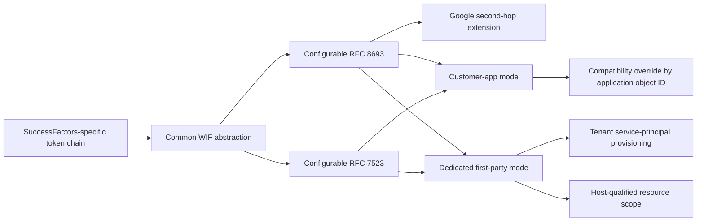

### 5.3 Adjacent identity work that is not the ISV wire contract

History searches also find enabling or operational identity work by other authors. It is important context but does not change the RFC 7523/RFC 8693 form contracts:

| Commit | Area | Relationship |
|---|---|---|
| `64150d0ac2` | SyncFabric Graph MSI + FIC | Earlier managed-identity/FIC foundation used by service-to-service Graph authentication. |
| `21109f3fec` | Global MSI enablement with certificate fallback gate | Deployment/authentication hardening, not target ISV exchange. |
| `e17ccffef7` | Notification email MSI + FIC migration | Another workload identity consumer; unrelated token endpoint. |
| `938bfe974d` | New TSE tenant constants | Test-environment maintenance that can affect application/tenant test values. |
| `0b25c45eea`, `1362f12e4b`, `1424149215` | ISVOnboarding tenant allowlists | Controls which tenants/apps can use onboarding surfaces; not assertion verification. |
| `a944447d94` | Remove redundant ISVOnboarding authentication metadata | Reinforces that gallery/UAG application metadata, not connector JSON duplication, owns some setup data. |

Treat these as environment prerequisites or neighboring migrations. Do not reproduce their behavior in SCIMServer's token endpoint.

### 5.4 Current rollout posture

At the source snapshot:

- configurable RFC 7523 WIF is globally enabled;
- configurable RFC 8693 token exchange is globally enabled;
- configurable Google Workspace WIF is globally enabled;
- first-party mode remains staged, with slices A/B enabled and global default false;
- SuccessFactors first-party mode is enabled for HYBRID1 and globally false;
- first-party service-principal provisioning and missing-service-principal recovery are enabled for A/B/HYBRID1 and globally false.

Rollout flags must not be interpreted as a permanent protocol guarantee. SCIMServer should support both acquisition modes because the token endpoint sees their resulting assertions, not the internal SyncFabric flag decision.

---

## 6. Current SyncFabric runtime architecture

### 6.1 Principal implementation files

| File | Responsibility |
|---|---|
| `src/dev/Controller/RunProfile/SCIM/WorkloadIdentity/WorkloadIdentityAuthentication.cs` | Orchestrates token acquisition, application-token caching, target-token caching, final exchange, recovery, quarantine, and metrics. |
| `src/dev/Controller/RunProfile/SCIM/WorkloadIdentity/WorkloadIdentityAuthenticationHelper.cs` | Builds the exact RFC 7523 and RFC 8693 form bodies and merges connector supplemental fields without allowing them to overwrite required fields. |
| `src/dev/Controller/RunProfile/SCIM/WorkloadIdentity/WorkloadIdentityTokenAcquirer.cs` | Acquires managed identity, subidentity, impersonated customer-application, and direct first-party application tokens. |
| `src/dev/Controller/RunProfile/SCIM/WorkloadIdentity/WorkloadIdentityTokenAcquisitionModeResolver.cs` | Resolves customer versus first-party mode using feature flags and the application-object-ID compatibility override. |
| `src/dev/Manager/SyncFabricManager/GraphProvisioning/Controllers/SynchronizationTemplates2_0Controller.cs` | Triggers first-party service-principal provisioning when WIF-enabled synchronization templates are read. |
| `src/dev/NetCore/SyncFabricCore/FirstPartyApplication/FirstPartyApplicationServicePrincipalProvisioner.cs` | Looks up or creates the target first-party service principal and handles concurrent-creation conflict recovery. |
| `src/dev/NetCore/SyncFabricCore/AzureActiveDirectory/MicrosoftOnlineDirectoryServiceConfigurationSection.cs` | Supplies production and test first-party application IDs. |
| `src/deployment/data/service_configurations/features.ini` | Controls protocol and first-party rollout. |

### 6.2 Customer-application acquisition mode

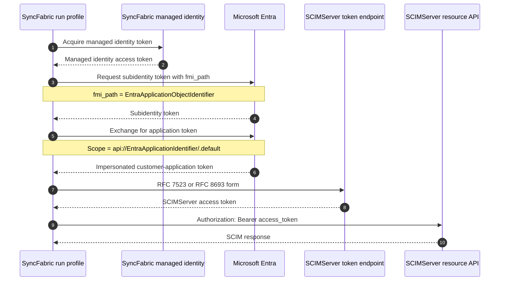

**Compatibility rule:** even when feature flags request first-party mode, the presence of `EntraApplicationObjectIdentifier` forces customer-application mode. Existing jobs retain their historical behavior. Removing that value is the opt-in mechanism for first-party mode where rollout flags allow it.

### 6.3 First-party acquisition mode

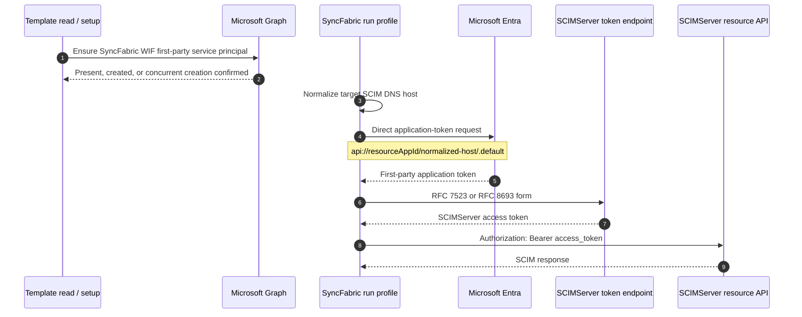

The first-party application IDs visible in current source are:

| Environment | Application ID |
|---|---|
| Production | `cb1d50fe-8ed0-4944-9e7d-5981aad3bc4b` |
| TME/test | `80060f08-85c7-418a-a486-6b36ce053eab` |

These are public identifiers, not secrets. Cloud-specific values must be read from the deployed SyncFabric configuration rather than copied from commercial cloud.

### 6.4 Target-host normalization

Current first-party code derives the host segment from the full target directory endpoint:

```text
Input:  https://www.Scim.Example.test:8443/scim/v2?region=us#fragment
Host:   www.scim.example.test
Output: scim.example.test
```

It removes:

- scheme;
- path;
- query;
- fragment;
- port;
- a leading `www.` label.

It retains the DNS host and uses it in:

```text
api://<EntraApplicationIdentifier>/<normalized-target-host>/.default
```

This creates an important deployment invariant:

> The externally configured SCIM base address and the Entra resource registration must agree on the exact normalized DNS host.

Aliases, temporary hosts, front-door migrations, and `www` changes must be planned as identity changes, not merely DNS changes.

### 6.5 Token caching and recovery

Current SyncFabric behavior includes:

- application-token caching;
- target-directory-token caching;
- reuse of unexpired cached tokens;
- retry/recovery paths for missing first-party service principals;
- quarantine/error handling and metrics;
- safe handling of duplicate supplemental form keys so connector-specific data cannot replace required OAuth fields.

SCIMServer must tolerate normal retries and token reuse. A strict one-time assertion replay cache could break legitimate behavior and must not be enabled without observing real retry patterns.

---

## 7. Exact SyncFabric-to-ISV wire contracts

All requests use:

```http
POST /scim/endpoints/{endpointId}/oauth/token HTTP/1.1
Host: <scimserver-host>
Content-Type: application/x-www-form-urlencoded
Accept: application/json
```

The request body must be parsed as form data, not JSON.

### 7.1 RFC 7523 client-assertion profile

**Confirmed current form fields:**

```text
grant_type=client_credentials
client_id=<ISV-issued target client identifier>
client_assertion=<Entra application token>
client_assertion_type=urn:ietf:params:oauth:client-assertion-type:jwt-bearer
```

Illustrative decoded form:

```http
POST /scim/endpoints/2e5c6f9a-7f87-42e9-b23d-c1b5508af1e1/oauth/token HTTP/1.1
Host: wif-test.example.net
Content-Type: application/x-www-form-urlencoded
Accept: application/json

grant_type=client_credentials&
client_id=scim-wif-client-a83b7537&
client_assertion=eyJhbGciOiJSUzI1NiIsImtpZCI6Ii4uLiJ9.eyJpc3MiOiIuLi4ifQ.signature&
client_assertion_type=urn%3Aietf%3Aparams%3Aoauth%3Aclient-assertion-type%3Ajwt-bearer
```

The line breaks above are for readability only. The actual body is a single URL-encoded byte sequence.

#### SuccessFactors supplemental field

SuccessFactors adds:

```text
resource=<ResourceId>
```

Its token endpoint URL is composed by the SuccessFactors connector from the configured base token-exchange address. SCIMServer should model `resource` as an explicit profile policy:

```text
resourceMode = ignore | optionalExact | requiredExact
expectedResource = <configured value>
```

For new configurations, `requiredExact` is recommended when `ResourceId` is supplied to SyncFabric.

#### Proposed RFC 7523 success response

```http
HTTP/1.1 200 OK
Content-Type: application/json
Cache-Control: no-store
Pragma: no-cache

{
  "access_token": "<opaque-in-transit SCIMServer JWT>",
  "token_type": "Bearer",
  "expires_in": 3600,
  "scope": "scim.read scim.write"
}
```

Current SCIMServer E2E tests expect HTTP 201 because the NestJS POST handler has no explicit `@HttpCode(200)`. The implementation must change this to 200 and test it.

### 7.2 RFC 8693 token-exchange profile

**Confirmed current form fields:**

```text
grant_type=urn:ietf:params:oauth:grant-type:token-exchange
subject_token=<Entra application token>
subject_token_type=urn:ietf:params:oauth:token-type:jwt
audience=<Oauth2Audience>
scope=<Oauth2Scope>
requested_token_type=urn:ietf:params:oauth:token-type:access_token
```

Current SyncFabric deliberately omits `client_id`.

Illustrative request:

```http
POST /scim/endpoints/2e5c6f9a-7f87-42e9-b23d-c1b5508af1e1/oauth/token HTTP/1.1
Host: wif-test.example.net
Content-Type: application/x-www-form-urlencoded
Accept: application/json

grant_type=urn%3Aietf%3Aparams%3Aoauth%3Agrant-type%3Atoken-exchange&
subject_token=eyJhbGciOiJSUzI1NiIsImtpZCI6Ii4uLiJ9.eyJpc3MiOiIuLi4ifQ.signature&
subject_token_type=urn%3Aietf%3Aparams%3Aoauth%3Atoken-type%3Ajwt&
audience=https%3A%2F%2Fwif-test.example.net%2Fscim&
scope=scim.read%20scim.write&
requested_token_type=urn%3Aietf%3Aparams%3Aoauth%3Atoken-type%3Aaccess_token
```

#### Proposed RFC 8693 success response

```http
HTTP/1.1 200 OK
Content-Type: application/json
Cache-Control: no-store
Pragma: no-cache

{
  "access_token": "<opaque-in-transit SCIMServer JWT>",
  "issued_token_type": "urn:ietf:params:oauth:token-type:access_token",
  "token_type": "Bearer",
  "expires_in": 3600,
  "scope": "scim.read scim.write"
}
```

The server must not infer `audience` or `scope` from the incoming assertion. They are target-token request values with their own policy.

### 7.3 Google Workspace extension

The current SyncFabric Google flow is:

1. acquire the Entra application token;
2. perform the RFC 8693 exchange using `audience`, `scope`, and `requested_token_type`;
3. call Google IAM Credentials `generateAccessToken` for `TargetDirectoryEmail`;
4. use the Google access token for directory calls.

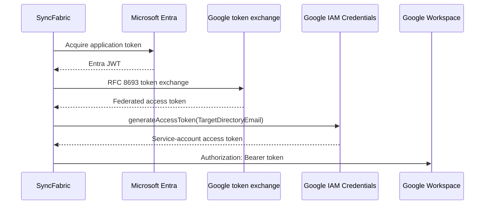

SCIMServer only needs the first exchange behavior to test its own RFC 8693 endpoint. A Google second-hop emulator should be a separate explicit feature if ever required.

### 7.4 SyncFabric configuration-to-wire mapping

| SyncFabric field | RFC 7523 | RFC 8693 | Meaning at SCIMServer |
|---|---:|---:|---|
| `BaseAddress` | Required | Required | SCIM resource base URL; also contributes the target host in first-party mode. |
| `EntraApplicationIdentifier` | Required | Required | Entra resource application identifier used when acquiring the assertion. |
| `EntraApplicationObjectIdentifier` | Customer mode | Customer mode | Presence forces customer-application mode. Not sent to SCIMServer. |
| `Oauth2TokenExchangeUri` | Required | Required | SCIMServer token endpoint URL. |
| `Oauth2ClientId` | Required | Not sent | ISV-issued public target-client ID; must be validated separately from assertion claims. |
| `Oauth2Audience` | Not sent | Required | RFC 8693 target audience parameter. |
| `Oauth2Scope` | Not sent | Required | RFC 8693 requested target scope. |
| `TargetDirectoryEmail` | No | Google only | Google service-account target for the second hop. |
| `ResourceId` | SuccessFactors | No | SuccessFactors-specific `resource` form value. |

### 7.5 AzureAD SCIMReferenceCode Logic App harness

The public reference harness is useful for validating an ISV endpoint, but it is not the same assertion-acquisition path as current SyncFabric. It uses an internal test app and client secret to acquire AT1.

| Logic App harness field | Closest SyncFabric field | SCIMServer meaning |
|---|---|---|
| `federatedClientId` | `Oauth2ClientId` for RFC 7523 | Public target-client identifier sent to the token endpoint. Confirm the harness request rather than relying only on its description. |
| `federatedTokenEndpoint` | `Oauth2TokenExchangeUri` | SCIMServer token URL. |
| `federatedBaseAddress` | `BaseAddress` | SCIM API base URL. |
| `federatedApplicationId` | Entra acquisition-side app ID | Used by the harness to obtain AT1; not a SCIMServer secret. |
| `federatedApplicationClientSecret` | No SyncFabric equivalent in the current managed-identity chain | Harness-only acquisition secret; never send to or store in SCIMServer. |
| `federatedAudience` | `Oauth2Audience` | RFC 8693 target audience, currently documented for Google-oriented harness tests. |

Use the harness for:

- basic RFC 7523 form interoperability;
- real Entra signing/JWKS validation;
- SCIM operation tests.

Do not use it as proof of:

- SyncFabric managed-identity/subidentity behavior;
- dedicated first-party application claims;
- compatibility-mode switching;
- host-qualified first-party scope behavior;
- the exact current SyncFabric RFC 8693 form without request capture.

---

## 8. Entra assertion structure and safe decoding

### 8.1 Illustrative header

```json
{
  "alg": "RS256",
  "kid": "<entra-signing-key-id>",
  "typ": "JWT"
}
```

### 8.2 Illustrative customer-application payload

This is a semantic example, not a claim-value contract:

```json
{
  "aud": "<observed-resource-api-audience>",
  "iss": "https://login.microsoftonline.com/<tenant-id>/v2.0",
  "iat": 1785150000,
  "nbf": 1785150000,
  "exp": 1785153600,
  "azp": "<observed-calling-application-client-id>",
  "oid": "<customer-application-service-principal-object-id>",
  "sub": "<observed-subject-for-this-resource>",
  "tid": "<customer-tenant-id>",
  "ver": "2.0",
  "roles": [
    "<optional-resource-app-role>"
  ]
}
```

### 8.3 Illustrative first-party payload

```json
{
  "aud": "<observed-resource-api-audience>",
  "iss": "https://login.microsoftonline.com/<tenant-id>/v2.0",
  "iat": 1785150000,
  "nbf": 1785150000,
  "exp": 1785153600,
  "azp": "cb1d50fe-8ed0-4944-9e7d-5981aad3bc4b",
  "oid": "<syncfabric-first-party-service-principal-object-id>",
  "sub": "<observed-subject-for-this-resource>",
  "tid": "<customer-tenant-id>",
  "ver": "2.0",
  "roles": [
    "<optional-resource-app-role>"
  ]
}
```

For TME, the expected calling application ID is currently `80060f08-85c7-418a-a486-6b36ce053eab`. For other clouds, use the actual deployed value.

### 8.4 Claim-validation rule

Do not choose one "identity claim" and ignore the rest. Validate independent axes:

```text
Signature and algorithm
AND exact issuer
AND exact tenant
AND expected resource audience
AND configured subject/object/authorized-party binding
AND temporal claims
AND optional app role
AND request target binding
```

### 8.5 Decode is not validation

A JWT payload can be decoded without any key. This is useful for diagnostics but proves nothing.

Safe PowerShell decoder for local inspection:

```powershell
param([Parameter(Mandatory = $true)][string]$Token)

$parts = $Token.Split('.')
if ($parts.Count -ne 3) {
    throw 'Expected a compact JWT with three segments.'
}

function ConvertFrom-Base64Url([string]$Value) {
    $padded = $Value.Replace('-', '+').Replace('_', '/')
    switch ($padded.Length % 4) {
        2 { $padded += '==' }
        3 { $padded += '=' }
        1 { throw 'Invalid base64url length.' }
    }
    [Text.Encoding]::UTF8.GetString([Convert]::FromBase64String($padded))
}

ConvertFrom-Base64Url $parts[0] | ConvertFrom-Json
ConvertFrom-Base64Url $parts[1] | ConvertFrom-Json
```

Never:

- log the raw token;
- paste it into a third-party decoder;
- treat decoded values as verified;
- store it in source control, CI artifacts, shell history, or issue comments.

---

## 9. Current SCIMServer implementation

### 9.1 Current token endpoint

```text
POST /scim/endpoints/{endpointId}/oauth/token
```

Current routing behavior:

1. require `grant_type=client_credentials`;
2. if `client_assertion` is present, route to the WIF provider;
3. otherwise resolve client secret from HTTP Basic or form data;
4. reject simultaneous assertion and secret;
5. validate the JWT-bearer assertion type;
6. issue an endpoint-scoped access token after successful authentication.

It does not currently accept RFC 8693.

### 9.2 Current WIF trust persistence

WIF trust is stored in the existing `EndpointCredential` table:

```text
credentialType = "wif"
credentialHash = ""
metadata       = public trust JSON
```

This is a sound persistence choice because the trust contains public verification material and binding policy, not a reusable shared secret.

Current required values:

- `expectedIssuer`;
- `expectedSubject`;
- `expectedAudience`;
- `jwksUri`;
- `allowedTenantId`.

Current aliases include:

- `iss`;
- `sub`;
- `aud`;
- `tid`;
- `roles`;
- `expectedTenantId`.

Multiple active trusts can be configured for one endpoint.

### 9.3 Current assertion validation

The current `WifAssertionValidatorService` and `ExternalJwksValidatorService` provide:

- remote JWKS signature validation;
- RS256 and ES256 only;
- `exp` and `nbf` enforcement through `jose`;
- exact issuer, subject, tenant, and configured audience validation;
- string or array audience support;
- optional role enforcement;
- exact JWKS host allowlisting;
- commercial, US Government, China, and Google seed hosts;
- environment and persisted allowlist layers;
- redirect-target revalidation;
- timeout, retry, backoff, jitter, caching, single-flight, and unknown-`kid` refresh;
- fail-closed behavior;
- limited stale-key use only when a matching cached key remains.

The unverified `iss` claim is used only to order trust candidates. It never authorizes a token.

### 9.4 Current issued token

Current WIF issuance uses:

```text
issued sub       = incoming assertion sub
issued client_id = incoming assertion sub
issued aud       = <OAUTH_TOKEN_AUDIENCE>:<endpointId>
```

It also includes:

- `endpoint_id`;
- `scope`;
- `token_type`;
- optional `src_iss`.

The TTL is clamped to 1-6 hours. The SCIM resource guard enforces endpoint binding and rejects cross-endpoint replay.

### 9.5 Current observability

SCIMServer already has:

- structured authentication decision traces;
- a stable reason-code catalog;
- per-trust WIF subtraces;
- an admin assertion debugger;
- issuer/JWKS configuration verification;
- recent per-method health in connection information.

These should be extended, not replaced.

### 9.6 Current UI

The current WIF UI:

- creates and displays WIF trust credentials;
- supports issuer/JWKS discovery and verification;
- exposes subject, audience, tenant, roles, profile, and identity-model values;
- displays a WIF client identifier derived from the assertion subject;
- hardcodes `assertionProfile='jwt-bearer'`;
- at SCIMServer 0.54.57, uses the shared visible-label `OverflowMenu` for secondary/destructive WIF trust and credential actions.

The principal defect is conceptual: assertion subject and target OAuth client are presented as one value.

### 9.7 Latest SCIMServer auth-standards research

During preparation of this guide, `feat/wif` advanced from `0f37e3c7fd056c1b65402db5dc8112cfa1af27f7` to `25e0a98af6a8370b939cafdf07d813e1808d25fc`.

The two new commits added:

- `docs/auth/AUTH_METHODS_STANDARDS_COMPARISON.md`; and
- unrelated resizable-table UI work.

Blob comparison confirmed that all reviewed WIF runtime, admin, metadata, connection-info, UI credential, and WIF E2E files were unchanged. The runtime findings in this guide therefore remain current.

The new research document correctly emphasizes that:

- exchanging an external assertion for a SCIMServer-issued short-lived bearer token is a standard and useful architecture;
- JWT access tokens are a reasonable stateless default;
- opaque reference tokens are a possible future choice when immediate server-side revocation justifies a token store, introspection, and revocation endpoints.

Two claims in that research document need precision before implementation:

1. Current SyncFabric's RFC 7523-shaped request is not automatically a fully conventional `private_key_jwt` profile because its target `client_id` and Entra assertion `sub` can differ. The independent bindings in this guide resolve that explicitly.
2. Current SCIMServer tokens are JWT bearer access tokens, but formal RFC 9068 conformance should not be claimed yet. The current payload has issuer configuration, `sub`, `client_id`, `aud`, `iat`, and `exp`, but current source does not explicitly add required `jti` or set the required `typ` media type to `at+jwt`.

---

## 10. Compatibility and security gap matrix

| Area | Current SCIMServer | SyncFabric/current requirement | Risk | Required action |
|---|---|---|---|---|
| RFC 7523 request | Accepted | Supported | Partial compatibility | Keep, but parse into an explicit profile handler. |
| Request `client_id` | Ignored | Always sent for RFC 7523 | Any valid assertion can use any public client ID | Add target-client binding. |
| Assertion `sub` | Used as issued `client_id` | Entra workload subject | Identity conflation and incorrect connection info | Preserve as source subject; issue/use target client separately. |
| RFC 8693 | Rejected | Supported and globally enabled in SyncFabric | Integration failure | Implement explicit token-exchange handler. |
| OAuth metadata | Advertises token exchange | Runtime rejects it | Misleading clients and tests | Derive metadata from active implemented capabilities. |
| Auth method metadata | Advertises `private_key_jwt` | SyncFabric profile may not satisfy `sub == client_id` | Standards ambiguity | Document custom profile; advertise standard method only with precise compatibility disclosure. |
| Assertion audience default | Endpoint UUID | Entra resource API audience | All real tokens likely fail or admins weaken validation | Remove derived default; require explicit observed value. |
| `assertionProfile` | Persisted, ignored | Needed to distinguish protocols | False sense of control | Make it a discriminant or remove it from inputs. |
| `subjectTokenType` | Persisted, ignored | RFC 8693 requires exact type | Policy bypass/ambiguity | Enforce in the RFC 8693 handler. |
| `expectedResource` | Persisted, ignored | SuccessFactors sends `resource` | Target confusion | Add explicit resource policy. |
| `identityModel` | Mostly telemetry | Different acquisition provenance | Misleading enforcement expectation | Use only as expected-claim policy after empirical validation. |
| Token endpoint status | HTTP 201 in E2E | OAuth token response should be 200 | Client interoperability | Add `@HttpCode(200)`. |
| Cache headers | Not explicit in reviewed handler | OAuth response must not be cached | Token disclosure | Set `Cache-Control: no-store` and `Pragma: no-cache`. |
| Persisted request logs | Complete request/response, secrets included, is the server default | Assertions and issued tokens are bearer credentials | Credential disclosure through DB, log API, exports, or backups | Unconditionally redact auth token routes before persistence; store only fingerprints and approved verified claim summaries. |
| Token request size | Generic form parser accepts up to 1 MB; no assertion-specific cap | Normal JWT assertions are far smaller | Memory/CPU and multi-trust amplification | Add a token-route and assertion byte cap before decode or trust lookup. |
| Multi-trust fallback | Unverified issuer orders candidates, but no match tries every trust sequentially | Exact issuer is already configured on every trust | One request can amplify crypto and JWKS network work by trust count | Index exact issuer and reject no-match without remote work after compatibility migration; cap active trusts. |
| JWKS stale fallback | Any cached key set can be reused after refresh exhaustion, regardless of age | Availability should not become indefinite trust extension | Revoked/rotated keys can remain accepted during a long outage | Add a separate hard stale-if-error limit and expose stale age. |
| JWKS response/cache bounds | Cache and in-flight maps are URI-keyed; response size, key count, and URI cardinality are not explicitly capped | Token endpoints are attacker reachable | Memory/CPU denial and policy coupling | Bound document bytes, key count, cache entries, and total fetch budget; include effective policy in single-flight semantics. |
| Issued JWT profile | Endpoint-scoped JWT without explicit `jti` or `typ=at+jwt` | Valid private bearer format, but not yet proven RFC 9068-conformant | Documentation overclaim and weaker token-instance correlation | Either document it as a private JWT format or complete and test RFC 9068 conformance. |
| E2E assertions | Locally signed, no `client_id` | SyncFabric sends real Entra tokens and client ID | Tests miss main contract | Add realistic request and real-Entra tiers. |
| First-party host scope | Not represented | Current SyncFabric scope includes normalized host | Setup drift | Add setup guidance and a host consistency check. |
| Endpoint auth persona | SCIM schema preset and auth flags are independent, but no finite token-contract preset exists | A test ISV must emulate several target auth contracts per endpoint | Operators can persist incompatible combinations and metadata | Add a versioned persona that composes implemented protocol, response, token, and resource behavior without containing trust secrets. |
| Public docs | Older assumptions | Latest code uses JWT subject token and two modes | Operator mistakes | Replace with one canonical versioned guide. |

---

## 11. Target architecture

### 11.1 Context

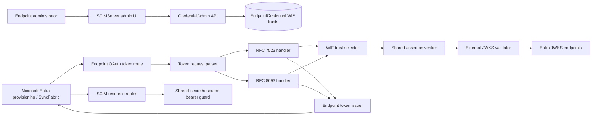

### 11.2 Design principles

1. Parse protocol shape once.
2. Never choose authorization by trial-and-error.
3. Verify cryptography in one shared service.
4. Bind request target values after assertion verification and before issuance.
5. Keep trust selection fail-closed across multiple active trusts.
6. Return generic OAuth errors to callers and rich reason codes to authorized diagnostics.
7. Derive public metadata and connection information from implemented capabilities.
8. Preserve endpoint isolation at every stage.
9. Make every persisted field operational or remove it.
10. Version metadata and migrate additively.

### 11.3 Parsed request union

```typescript
type ParsedEndpointTokenRequest =
  | {
      kind: 'client-secret';
      grantType: 'client_credentials';
      clientId: string;
      clientSecret: string;
      requestedScope?: string;
    }
  | {
      kind: 'syncfabric-rfc7523';
      grantType: 'client_credentials';
      clientId: string;
      clientAssertion: string;
      clientAssertionType:
        'urn:ietf:params:oauth:client-assertion-type:jwt-bearer';
      resource?: string;
      requestedScope?: string;
    }
  | {
      kind: 'syncfabric-rfc8693';
      grantType:
        'urn:ietf:params:oauth:grant-type:token-exchange';
      subjectToken: string;
      subjectTokenType: 'urn:ietf:params:oauth:token-type:jwt';
      audience: string;
      scope: string;
      requestedTokenType:
        'urn:ietf:params:oauth:token-type:access_token';
    };
```

The parser must reject:

- fields from multiple authentication methods;
- duplicate singleton fields;
- missing required fields;
- unsupported grant or token types;
- oversized bodies or tokens;
- empty strings after normalization;
- Basic credentials plus a JWT-based profile;
- `client_secret` plus `client_assertion`;
- ambiguous request shapes.

### 11.4 Provider contract

Preserve SCIMServer's three-outcome authentication-provider convention:

```typescript
type ProviderResult<T> =
  | { outcome: 'not-applicable' }
  | { outcome: 'authenticated'; value: T; trace: AuthDecisionTrace }
  | { outcome: 'rejected'; reasonCode: string; trace: AuthDecisionTrace };
```

Once the parser identifies a self-describing WIF profile, that handler owns the request. A rejected WIF request must never fall through to client-secret authentication.

### 11.5 Internal request flow

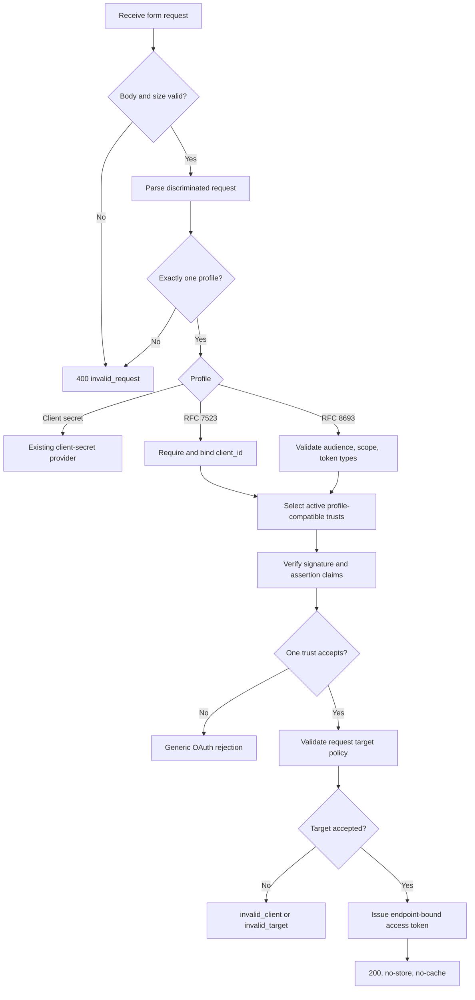

### 11.6 Endpoint persona and auth-emulation model

SCIMServer already has SCIM schema/profile presets such as `entra-id`, `rfc-standard`, and `minimal`. Those presets describe resource schemas and SCIM behavior. They should not be overloaded to imply a token endpoint contract.

Add a separate, finite **auth-emulation persona**:

```text
SCIM schema preset
  -> what SCIM resources and attributes the endpoint exposes

Auth-emulation persona
  -> what token/resource authentication contracts the endpoint implements

Endpoint credentials and WIF trusts
  -> which concrete clients, issuers, keys, claims, secrets, and targets are authorized
```

A persona is configuration and compatibility behavior, not authorization by itself. Selecting `syncfabric-rfc7523-v1` must not create an open trust, infer an assertion audience from the endpoint ID, or accept an arbitrary target `client_id`.

### 11.7 Composition boundaries

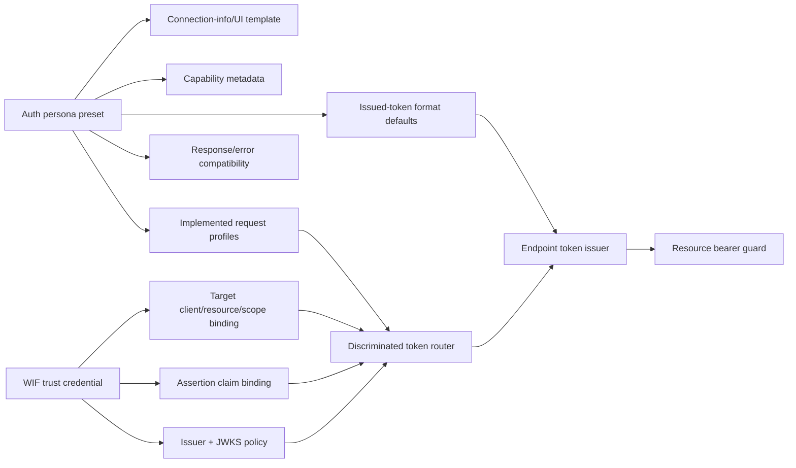

The separation prevents a common test-server failure: a convenient preset silently becoming a broad security policy.

### 11.8 Proposed endpoint configuration

Store only non-secret behavior selection in the endpoint profile:

```json
{
  "authEmulation": {
    "schemaVersion": 1,
    "presetId": "syncfabric-rfc7523-v1",
    "tokenEndpoint": {
      "acceptedProfiles": [
        "syncfabric-rfc7523"
      ],
      "successHttpStatus": 200,
      "errorMode": "oauth-standard",
      "responseCachePolicy": "no-store"
    },
    "issuedToken": {
      "format": "private-jwt",
      "audienceMode": "endpoint-bound",
      "defaultLifetimeSec": 3600
    },
    "resourceAuthentication": {
      "acceptedMethods": [
        "issued-endpoint-jwt"
      ]
    },
    "vendorExtensions": {
      "successFactorsResource": false,
      "googleServiceAccountSecondLeg": false
    },
    "faultInjection": {
      "enabled": false
    }
  }
}
```

Security-sensitive values remain in credentials:

- client secret hash/envelope in `oauth_client`;
- issuer/JWKS/claim rules in `WifTrustV2.issuerTrust` and `assertionBinding`;
- target `client_id`, resource, audience, and scope rules in `targetClientBinding`, `rfc7523Policy`, or `rfc8693Policy`;
- issued scope/lifetime overrides in `issuedTokenPolicy`.

The API must validate the entire persona-plus-credential aggregate. It must reject a profile enabled without its required credential/trust, a trust whose profile is disabled, and mutually incompatible response/token settings.

### 11.9 Persona catalog and current support

| Proposed persona/profile | Intended emulation | Current source support | Required work |
|---|---|---|---|
| `static-bearer-v1` | Legacy ISV with a pre-issued per-endpoint bearer secret | Implemented | Project current flags and secret state into the persona model; preserve timing-safe comparison. |
| `oauth-client-secret-v1` | Standard client credentials with `client_secret_basic` or `client_secret_post` | Implemented | Return explicit HTTP 200/no-store headers and derive metadata from enablement. |
| `syncfabric-rfc7523-v1` | Current configurable connector client-assertion form | Partial | Bind request `client_id`, separate assertion principal, remove endpoint-derived assertion audience, and make profile fields executable. |
| `syncfabric-successfactors-v1` | RFC 7523 plus SAP/SuccessFactors `resource` | Partial/inert | Enforce exact resource policy and test the SAP-style response/resource mapping. |
| `syncfabric-rfc8693-v1` | Current configurable connector token exchange | Not implemented | Add a separate parser/handler and exact audience/scope/token-type policy. |
| `syncfabric-google-sts-v1` | First Google STS exchange leg | Not implemented | Implement the RFC 8693 request profile; keep Google service-account impersonation as an optional second emulator, not generic core behavior. |
| `oauth-private-key-jwt-v1` | Conventional RFC 7523 JWT client authentication | Advertised, not implemented | Add registered-client key material and enforce `iss`/`sub` as the OAuth client plus token-endpoint audience. Do not reuse the SyncFabric profile. |
| `oauth-jwt-bearer-grant-v1` | RFC 7523 JWT authorization grant | Not implemented | Add only when a real target/client requires `grant_type=urn:ietf:params:oauth:grant-type:jwt-bearer`. |
| `oauth-mtls-v1` | RFC 8705 certificate client authentication and/or sender-constrained token | Not implemented | Requires TLS termination identity propagation, certificate binding, metadata, and resource validation design. |
| `opaque-token-v1` | Reference token with RFC 7662/RFC 7009 lifecycle | Not implemented | Requires durable token storage, hashing, introspection, revocation, cleanup, and availability design. |
| `dpop-v1` | RFC 9449 proof-of-possession access token | Not implemented | Requires proof validation, nonce/replay state, `cnf` binding, metadata, and client support. |

This catalog deliberately does not create an `okta`, `auth0`, or `ping` preset merely because those products can issue JWTs. Current SCIMServer can trust any explicitly configured issuer/JWKS pair, but a vendor persona is justified only by a captured target request/response or documented compatibility difference that affects executable behavior.

### 11.10 Customer application versus SyncFabric 1P

Customer-application and dedicated first-party acquisition are not separate OAuth wire protocols at SCIMServer. They are assertion-provenance variants under the same target request profile.

| Dimension | Customer application | SyncFabric 1P | SCIMServer representation |
|---|---|---|---|
| Source application | Customer-controlled application | Dedicated SyncFabric application | `assertionBinding` rules after real-token observation |
| Mode trigger | `EntraApplicationObjectIdentifier` present | Eligible rollout and object identifier absent | Diagnostic `expectedAcquisitionModel`; never a substitute for claims |
| Requested source scope | `api://<customer-resource-app>/.default` | `api://<resource-app>/<normalized-host>/.default` | Setup/host consistency data, not target `scope` |
| Service principal | Customer setup path | SyncFabric provisioning/recovery | Environment workflow; not created by SCIMServer token route |
| Target form | RFC 7523 or RFC 8693 | RFC 7523 or RFC 8693 | Same protocol handler |
| Target client/resource | ISV-issued values | ISV-issued values | Independent target binding |

Do not fork protocol handlers into "customer" and "1P" copies. One verified assertion should normalize to:

```typescript
interface VerifiedExternalIdentity {
  issuer: string;
  subject: string;
  tenantId?: string;
  objectId?: string;
  authorizedParty?: string;
  tokenVersion?: string;
  audience: string[];
  roles: string[];
  sourceTrustId: string;
}
```

Policy can then allow one or both observed identity variants.

### 11.11 Configuration ownership and precedence

| Layer | Owns | Must not own |
|---|---|---|
| Server deployment | Signing keys, hard ceilings, global egress allowlists, route privacy floor | Per-customer target client or assertion subject |
| Endpoint auth persona | Enabled finite profiles, response/error compatibility, issued-token default, UI/metadata projection | Secrets, private keys, permissive issuer wildcards |
| Endpoint credential/trust | Concrete client, secret hash, issuer/JWKS, claims, target policy, issuance override | Arbitrary executable code |
| Environment manifest | Public host, authority cloud, app IDs, workflow references | Raw assertions/tokens/secrets |
| Test-only fault profile | Bounded latency/error/rotation scenarios | Production enablement |

Precedence:

```text
server hard security ceiling
  > endpoint persona invariant
  > endpoint trust/credential rule
  > request value
```

An endpoint setting may be stricter than a server default but must not exceed a hard timeout, body, retry, stale-key, trust-count, or logging-privacy ceiling.

### 11.12 Adding another authentication method

An auth method is complete only when all these surfaces agree:

1. discriminated request type and parser;
2. profile-specific authenticator/exchange handler;
3. credential/trust persistence and migration;
4. admin DTO validation;
5. issued-token policy;
6. resource guard;
7. OAuth metadata;
8. connection information;
9. Credentials/Connect UI;
10. reason codes and redaction;
11. unit, API E2E, UI, and live tests;
12. environment bootstrap and rotation workflow;
13. performance and abuse tests;
14. documentation and preset version.

The preferred architecture remains finite profiles plus versioned presets. A generic policy DSL is rejected until at least two independently implemented profiles demonstrate a requirement that finite typed rules cannot express.

---

## 12. Versioned WIF trust model

### 12.1 Recommended aggregate

Continue using one `EndpointCredential` row per independent trust:

```text
EndpointCredential
  endpointId
  credentialType = "wif"
  credentialHash = ""
  metadata = WifTrustV2
```

Recommended logical shape:

```text
WifTrustV2
|-- schemaVersion
|-- displayName
|-- enabledProfiles
|-- issuerTrust
|   |-- issuer
|   |-- jwksUri
|   |-- tenantId
|   `-- allowedAlgorithms
|-- assertionBinding
|   |-- expectedAudience
|   |-- subjectRule
|   |-- objectIdRule
|   |-- authorizedPartyRule
|   `-- roleRule
|-- targetClientBinding
|   `-- acceptedClientIds
|-- rfc7523Policy
|   |-- resourceMode
|   |-- expectedResource
|   `-- allowedRequestedScopes
|-- rfc8693Policy
|   |-- expectedAudienceParameter
|   |-- expectedSubjectTokenType
|   |-- expectedRequestedTokenType
|   `-- allowedRequestedScopes
`-- issuedTokenPolicy
    |-- grantedScopes
    `-- ttlSeconds
```

### 12.2 Exact JSON example - RFC 7523 first-party trust

All values below are illustrative except the published commercial first-party app ID:

```json
{
  "schemaVersion": 2,
  "displayName": "SyncFabric commercial first-party",
  "enabledProfiles": [
    "syncfabric-rfc7523"
  ],
  "issuerTrust": {
    "issuer": "https://login.microsoftonline.com/<tenant-id>/v2.0",
    "jwksUri": "https://login.microsoftonline.com/<tenant-id>/discovery/v2.0/keys",
    "tenantId": "<tenant-id>",
    "allowedAlgorithms": [
      "RS256"
    ]
  },
  "assertionBinding": {
    "expectedAudience": "<observed-resource-api-audience>",
    "subjectRule": {
      "mode": "exact",
      "values": [
        "<observed-first-party-subject>"
      ]
    },
    "objectIdRule": {
      "mode": "exact",
      "values": [
        "<syncfabric-service-principal-object-id-in-tenant>"
      ]
    },
    "authorizedPartyRule": {
      "mode": "exact",
      "values": [
        "cb1d50fe-8ed0-4944-9e7d-5981aad3bc4b"
      ]
    },
    "roleRule": {
      "mode": "advisory",
      "values": [
        "<optional-app-role>"
      ]
    }
  },
  "targetClientBinding": {
    "acceptedClientIds": [
      "scim-wif-client-a83b7537"
    ]
  },
  "rfc7523Policy": {
    "resourceMode": "ignore",
    "allowedRequestedScopes": []
  },
  "issuedTokenPolicy": {
    "grantedScopes": [
      "scim.read",
      "scim.write"
    ],
    "ttlSeconds": 3600
  }
}
```

### 12.3 Exact JSON example - RFC 7523 customer-application trust

```json
{
  "schemaVersion": 2,
  "displayName": "Contoso customer application",
  "enabledProfiles": [
    "syncfabric-rfc7523"
  ],
  "issuerTrust": {
    "issuer": "https://login.microsoftonline.com/<tenant-id>/v2.0",
    "jwksUri": "https://login.microsoftonline.com/<tenant-id>/discovery/v2.0/keys",
    "tenantId": "<tenant-id>",
    "allowedAlgorithms": [
      "RS256"
    ]
  },
  "assertionBinding": {
    "expectedAudience": "<observed-resource-api-audience>",
    "subjectRule": {
      "mode": "exact",
      "values": [
        "<observed-customer-application-subject>"
      ]
    },
    "objectIdRule": {
      "mode": "exact",
      "values": [
        "<customer-service-principal-object-id>"
      ]
    },
    "authorizedPartyRule": {
      "mode": "exact",
      "values": [
        "<observed-calling-application-client-id>"
      ]
    },
    "roleRule": {
      "mode": "disabled",
      "values": []
    }
  },
  "targetClientBinding": {
    "acceptedClientIds": [
      "scim-wif-client-e99f438c"
    ]
  },
  "rfc7523Policy": {
    "resourceMode": "optionalExact",
    "expectedResource": "scimserver-test-resource",
    "allowedRequestedScopes": []
  },
  "issuedTokenPolicy": {
    "grantedScopes": [
      "scim.read",
      "scim.write"
    ],
    "ttlSeconds": 3600
  }
}
```

### 12.4 Exact JSON example - RFC 8693 trust

```json
{
  "schemaVersion": 2,
  "displayName": "SyncFabric RFC 8693 exchange",
  "enabledProfiles": [
    "syncfabric-rfc8693"
  ],
  "issuerTrust": {
    "issuer": "https://login.microsoftonline.com/<tenant-id>/v2.0",
    "jwksUri": "https://login.microsoftonline.com/<tenant-id>/discovery/v2.0/keys",
    "tenantId": "<tenant-id>",
    "allowedAlgorithms": [
      "RS256"
    ]
  },
  "assertionBinding": {
    "expectedAudience": "<observed-resource-api-audience>",
    "subjectRule": {
      "mode": "exact",
      "values": [
        "<observed-subject>"
      ]
    },
    "objectIdRule": {
      "mode": "exact",
      "values": [
        "<observed-principal-object-id>"
      ]
    },
    "authorizedPartyRule": {
      "mode": "exact",
      "values": [
        "<observed-calling-application-id>"
      ]
    },
    "roleRule": {
      "mode": "advisory",
      "values": []
    }
  },
  "targetClientBinding": {
    "acceptedClientIds": []
  },
  "rfc8693Policy": {
    "expectedAudienceParameter": "https://wif-test.example.net/scim",
    "expectedSubjectTokenType": "urn:ietf:params:oauth:token-type:jwt",
    "expectedRequestedTokenType": "urn:ietf:params:oauth:token-type:access_token",
    "allowedRequestedScopes": [
      "scim.read",
      "scim.write"
    ]
  },
  "issuedTokenPolicy": {
    "grantedScopes": [
      "scim.read",
      "scim.write"
    ],
    "ttlSeconds": 3600
  }
}
```

### 12.5 Rule semantics

Use a small finite rule set, not an expression language:

```typescript
type ClaimRule =
  | { mode: 'disabled'; values: [] }
  | { mode: 'advisory'; values: string[] }
  | { mode: 'exact'; values: string[] };
```

Semantics:

- `disabled`: claim is not required and not used for authorization;
- `advisory`: record match/mismatch in diagnostics but do not reject;
- `exact`: require the claim and at least one exact ordinal match.

No regex, scripts, nested boolean policy, or dynamic claim expressions are needed.

### 12.6 Which claims should be enforced

| Claim | Default for new trust | Reason |
|---|---|---|
| Signature / `alg` / `kid` | Enforce | Cryptographic authenticity. |
| `iss` | Enforce | Tenant and cloud authority binding. |
| `tid` | Enforce | Prevent issuer-template or cross-tenant confusion. |
| `aud` | Enforce after real-token validation | Resource binding. |
| `exp`, `nbf` | Enforce | Token lifetime. |
| `sub` | Enforce after observation | Subject binding, but semantics can be resource-specific. |
| `oid` | Enforce when present and stable | Strong tenant-local principal binding. |
| `azp`/`appid` | Enforce when present and validated | Calling application binding; especially useful for first-party mode. |
| `roles` | Advisory until resource app role emission is confirmed | Avoid accidental outage due to app-role setup drift. |
| `jti`/`uti` | Telemetry only initially | Replay behavior and SyncFabric retries must be observed first. |

If both `azp` and `appid` are accepted for token-version compatibility, normalize them into one internal `authorizedParty` field but retain which source claim was used in diagnostics.

### 12.7 Normalized verified identity

```typescript
interface VerifiedWorkloadIdentity {
  trustId: string;
  tenantId: string;
  issuer: string;
  subject: string;
  objectId?: string;
  authorizedParty?: string;
  authorizedPartyClaim?: 'azp' | 'appid';
  assertionAudience: string[];
  roles: string[];
  tokenIdHash?: string;
  assertionExpiresAt: Date;
}
```

Only verified claims may populate this object.

---

## 13. Protocol-handler design

### 13.1 RFC 7523 handler

Responsibilities:

1. require `grant_type=client_credentials`;
2. require exactly one non-empty `client_id`;
3. require exactly one `client_assertion`;
4. require the fixed JWT-bearer `client_assertion_type`;
5. reject any client-secret material;
6. select only active trusts with `syncfabric-rfc7523`;
7. verify the assertion against each candidate trust;
8. bind the form `client_id` against `targetClientBinding.acceptedClientIds`;
9. enforce configured `resource` policy;
10. calculate granted endpoint scopes;
11. issue an endpoint-bound token;
12. return HTTP 200 and no-cache headers.

Suggested method shape:

```typescript
interface Rfc7523Handler {
  exchange(
    endpointId: string,
    request: Extract<
      ParsedEndpointTokenRequest,
      { kind: 'syncfabric-rfc7523' }
    >,
    context: AuthRequestContext,
  ): Promise<EndpointTokenExchangeResult>;
}
```

#### Binding order

Prefer:

```text
cheap structural validation
-> candidate profile filter
-> assertion signature and claim validation
-> target client/resource binding
-> issuance
```

Do not let an unverified `client_id`, `iss`, `sub`, or `kid` directly choose an authorizing trust. These values can optimize candidate order only.

#### `client_id` generation

For new RFC 7523 trusts, SCIMServer should generate a stable public identifier:

```text
scim-wif-client-<random identifier>
```

Properties:

- endpoint-scoped;
- random and unguessability-neutral because it is not a secret;
- immutable unless rotated;
- stored in WIF trust metadata;
- shown as `Oauth2ClientId` in connection information;
- never derived from `sub`, `oid`, endpoint ID, tenant ID, or audience.

Support multiple accepted IDs during rotation:

```json
{
  "acceptedClientIds": [
    "scim-wif-client-new",
    "scim-wif-client-old"
  ]
}
```

After the SyncFabric configuration is updated and telemetry confirms the old value is unused, remove it.

### 13.2 RFC 8693 handler

Responsibilities:

1. require the exact token-exchange grant type;
2. require exactly one `subject_token`;
3. require `subject_token_type=urn:ietf:params:oauth:token-type:jwt`;
4. require the configured `audience`;
5. parse and normalize the requested `scope`;
6. require or default `requested_token_type` according to an explicit policy; for SyncFabric require the exact access-token value it currently sends;
7. reject client-secret or client-assertion fields;
8. select active trusts with `syncfabric-rfc8693`;
9. verify the subject token using the shared assertion verifier;
10. bind target `audience`, `scope`, and requested token type;
11. issue the endpoint token;
12. include `issued_token_type` in the response.

The current SyncFabric request has no OAuth client authentication separate from the subject token. That is a deliberate client contract, not a parser omission. Security relies on:

- the signed Entra subject token;
- exact issuer/tenant/resource/principal binding;
- exact RFC 8693 target policy;
- endpoint isolation;
- short lifetimes and rate limits.

#### Scope normalization

Use the existing OAuth scope convention:

- split only on ASCII space;
- remove empty elements;
- reject invalid characters;
- deduplicate;
- compare as a set for authorization;
- return a deterministic space-delimited order.

Do not treat comma-separated values as OAuth scopes.

Example:

```text
Request: "scim.write scim.read scim.read"
Parsed:  {"scim.read", "scim.write"}
Issued:  "scim.read scim.write"
```

Policy:

```text
requestedScopes subset-of allowedRequestedScopes
AND issuedScopes = requestedScopes intersect grantedScopes
```

Never grant a scope that was neither requested nor configured.

### 13.3 SuccessFactors resource policy

The current SyncFabric SuccessFactors handler supplies:

```text
resource=<KnownSecretType.ResourceId>
```

Recommended policy modes:

| Mode | Missing | Match | Mismatch |
|---|---|---|---|
| `ignore` | Accept | Accept | Accept, but do not use value |
| `optionalExact` | Accept | Accept | Reject |
| `requiredExact` | Reject | Accept | Reject |

Migration starts legacy trusts at `ignore` to preserve behavior, emits shadow diagnostics, and moves new/validated deployments to `requiredExact`.

### 13.4 Issued access-token identity

The incoming assertion identity and target OAuth client should remain visible but distinct:

```json
{
  "iss": "<SCIMServer issuer>",
  "aud": "<OAUTH_TOKEN_AUDIENCE>:<endpointId>",
  "sub": "wif:<trust-id>:<stable-source-principal-hash-or-id>",
  "client_id": "scim-wif-client-a83b7537",
  "endpoint_id": "<endpointId>",
  "scope": "scim.read scim.write",
  "token_type": "access_token",
  "auth_method": "syncfabric-rfc7523",
  "source_tid": "<tenant-id>",
  "source_oid": "<object-id>",
  "source_azp": "<authorized-party>",
  "src_iss": "<source-issuer>",
  "iat": 1785150000,
  "exp": 1785153600
}
```

For RFC 8693, there is no request `client_id`. Use:

```text
client_id = wif-exchange:<trust-id>
auth_method = syncfabric-rfc8693
```

or omit `client_id` if the resource guard and telemetry can handle that safely. Do not populate it with the assertion `sub`.

Source claim inclusion must follow the project's privacy model. A hashed/internal principal reference is preferred if raw tenant-local IDs are not required by resource authorization.

### 13.5 Lifetime

Use:

```text
issued expiry =
  min(
    now + configured issuedTokenPolicy.ttlSeconds,
    incoming assertion exp,
    server maximum TTL
  )
```

Never issue a token that outlives the verified assertion that authorized it.

Current SCIMServer clamps OAuth token TTL to 1-6 hours. The WIF path should additionally cap it at the assertion's remaining lifetime. If the assertion has too little remaining lifetime to be usable, reject with a stable internal reason rather than issuing a near-expired token.

### 13.6 Issued token format

OAuth bearer-token use does not require the access token to be a JWT. The client must treat AT2 as opaque regardless of its representation.

| Format | Benefits | Costs | Recommendation |
|---|---|---|---|
| Current self-contained JWT | Stateless resource validation, existing endpoint isolation, no token-store lookup | Cannot be individually revoked before expiry without a denylist; claims are visible to the holder | Keep as the WIF default |
| RFC 9068-profile JWT | Standardized JWT access-token type and required claim set | Requires explicit `typ=at+jwt`, `jti`, and a complete conformance audit | Good hardening follow-up |
| Opaque reference token | Immediate revocation and no visible claims | Requires high-availability token storage and lookup; RFC 7662 if introspection is exposed; RFC 7009 for revocation | Separate opt-in future feature |

For formal RFC 9068 conformance, verify at least:

```text
JOSE header typ = at+jwt
payload has iss, exp, aud, sub, client_id, iat, and jti
resource server rejects JWTs of the wrong token type
algorithm and key policy remain explicit
```

The current WIF work should:

- keep JWT AT2;
- add a unique `jti`;
- consider `typ=at+jwt` only with matching resource-guard validation and compatibility tests;
- avoid claims that are not needed by the SCIM resource server;
- never make SyncFabric inspect AT2 claims.

An opaque-token option is not a small field addition. It requires a token model/store, hashing, expiry cleanup, resource lookup, introspection authorization, revocation semantics, cache design, rate limits, and operational capacity. Keep it outside the WIF interoperability waves unless separately approved.

---

## 14. OAuth error contract

### 14.1 External response

Return minimal OAuth errors:

```http
HTTP/1.1 400 Bad Request
Content-Type: application/json
Cache-Control: no-store
Pragma: no-cache

{
  "error": "invalid_request",
  "error_description": "The token request is invalid."
}
```

Do not return:

- which trust almost matched;
- expected issuer, tenant, subject, client ID, audience, role, resource, or scope;
- JWKS network details;
- decoded assertion claims;
- internal exception text.

### 14.2 Recommended mapping

| Failure class | HTTP | OAuth error | Internal examples |
|---|---:|---|---|
| malformed/ambiguous form | 400 | `invalid_request` | duplicate field, assertion plus secret, missing subject token |
| unsupported grant | 400 | `unsupported_grant_type` | unknown grant |
| unsupported requested scope | 400 | `invalid_scope` | requested scope outside policy |
| RFC 7523 authentication failure | 401 or current compatibility status | `invalid_client` | client ID mismatch, assertion rejected |
| invalid assertion in RFC 8693 | 400 | `invalid_grant` | signature, lifetime, issuer, tenant, principal mismatch |
| invalid RFC 8693 target | 400 | `invalid_target` | audience or target combination rejected |
| transient JWKS failure | 503 | `temporarily_unavailable` | all safe cache/fetch paths exhausted |
| server failure | 500 | `server_error` | unexpected internal failure |

The final HTTP status for RFC 7523 `invalid_client` should be validated against actual SyncFabric behavior. Existing SCIMServer uses 401. Preserve it unless client compatibility and standards review support changing it.

### 14.3 Internal reason-code additions

Extend `api/src/oauth/auth-reason-catalog.ts` with stable codes such as:

```text
wif_request_ambiguous
wif_request_too_large
wif_profile_disabled
wif_client_id_missing
wif_client_id_mismatch
wif_resource_missing
wif_resource_mismatch
wif_subject_token_missing
wif_subject_token_type_unsupported
wif_requested_token_type_unsupported
wif_exchange_audience_missing
wif_exchange_audience_mismatch
wif_exchange_scope_invalid
wif_exchange_scope_denied
wif_assertion_authorized_party_mismatch
wif_assertion_object_id_mismatch
wif_assertion_lifetime_insufficient
wif_no_compatible_trust
```

Codes are API-like contracts. Add; do not casually rename or repurpose existing codes.

---

## 15. Admin API design

### 15.1 Preserve the current credential resource

Keep WIF CRUD under the current admin credential API and use a versioned DTO. Do not create a second WIF table or a general authentication-policy service.

Suggested create body:

```json
{
  "credentialType": "wif",
  "displayName": "SyncFabric commercial first-party",
  "metadata": {
    "schemaVersion": 2,
    "enabledProfiles": [
      "syncfabric-rfc7523"
    ],
    "issuerTrust": {
      "issuer": "https://login.microsoftonline.com/<tenant-id>/v2.0",
      "jwksUri": "https://login.microsoftonline.com/<tenant-id>/discovery/v2.0/keys",
      "tenantId": "<tenant-id>",
      "allowedAlgorithms": [
        "RS256"
      ]
    },
    "assertionBinding": {
      "expectedAudience": "<observed-audience>",
      "subjectRule": {
        "mode": "exact",
        "values": [
          "<observed-subject>"
        ]
      },
      "objectIdRule": {
        "mode": "exact",
        "values": [
          "<observed-object-id>"
        ]
      },
      "authorizedPartyRule": {
        "mode": "exact",
        "values": [
          "<observed-app-id>"
        ]
      },
      "roleRule": {
        "mode": "advisory",
        "values": []
      }
    },
    "targetClientBinding": {
      "generateClientId": true
    },
    "rfc7523Policy": {
      "resourceMode": "ignore",
      "allowedRequestedScopes": []
    },
    "issuedTokenPolicy": {
      "grantedScopes": [
        "scim.read",
        "scim.write"
      ],
      "ttlSeconds": 3600
    }
  }
}
```

The create response can replace `generateClientId` with the persisted generated `acceptedClientIds`.

### 15.2 DTO validation

At configuration time:

- require `schemaVersion=2`;
- require at least one enabled profile;
- use exact URI parsing, not string prefix checks;
- require HTTPS JWKS URIs outside explicit local-test mode;
- require issuer/JWKS cloud consistency or an explicit override;
- require exact tenant GUID format for Entra profiles;
- constrain algorithms to server-supported values;
- limit rule value counts and lengths;
- prohibit empty exact rules;
- require target client IDs for RFC 7523;
- prohibit target client IDs for RFC 8693-only trusts unless reserved for future use;
- require RFC 8693 audience and non-empty scope allowlist;
- require resource value when mode is `optionalExact` or `requiredExact`;
- cap TTL within global limits;
- reject unknown fields under the versioned model.

### 15.3 Discovery and verification

Retain current discovery/verification behavior, but separate three actions:

1. **Discover metadata**
   - issuer metadata and JWKS URL;
   - no trust creation.
2. **Verify network trust**
   - allowlist, HTTPS, redirect, JWKS document, key usability;
   - no assertion authorization.
3. **Evaluate assertion**
   - decode for candidate ordering;
   - verify signature and claims;
   - show redacted per-rule result to an authorized admin.

Network verification cannot prove that an assertion audience or subject is correct.

### 15.4 Assertion observation response

For an authorized administrator, return:

```json
{
  "verified": true,
  "matchedTrustId": "<credential-id>",
  "tokenFingerprint": "sha256:<truncated-hash>",
  "header": {
    "alg": "RS256",
    "kid": "<kid>"
  },
  "verifiedClaims": {
    "issuer": "https://login.microsoftonline.com/<tenant-id>/v2.0",
    "tenantId": "<tenant-id>",
    "audiences": [
      "<aud>"
    ],
    "subject": "<sub>",
    "objectId": "<oid>",
    "authorizedParty": "<azp>",
    "authorizedPartyClaim": "azp",
    "roles": [
      "<role>"
    ],
    "expiresAt": "2026-07-22T12:00:00Z"
  },
  "rules": [
    {
      "name": "assertionAudience",
      "outcome": "matched"
    },
    {
      "name": "authorizedParty",
      "outcome": "advisory-mismatch"
    }
  ]
}
```

Do not echo the compact JWT.

---

## 16. Connection information contract

### 16.1 Problem in the current projection

Current `ConnectionInfoService` maps the WIF `clientIdentifier` to the expected assertion subject and can fall back to the endpoint ID as expected audience. Both mappings are wrong for SyncFabric:

- `Oauth2ClientId` is an ISV-issued target client identifier;
- assertion `sub` is an Entra workload identity;
- assertion `aud` is an Entra resource audience;
- endpoint ID belongs to the SCIM resource partition.

### 16.2 Proposed normalized projection

```typescript
interface WifConnectionProfile {
  credentialId: string;
  displayName: string;
  protocol: 'syncfabric-rfc7523' | 'syncfabric-rfc8693';
  tokenEndpoint: string;
  scimBaseUrl: string;
  syncFabricFields: {
    BaseAddress: string;
    Oauth2TokenExchangeUri: string;
    Oauth2ClientId?: string;
    Oauth2Audience?: string;
    Oauth2Scope?: string;
    ResourceId?: string;
  };
  entraRequirements: {
    expectedIssuer: string;
    expectedTenantId: string;
    expectedAssertionAudience: string;
    expectedAuthorizedParties: string[];
    expectedObjectIds: string[];
    expectedSubjects: string[];
  };
  health?: {
    lastSuccessAt?: string;
    lastFailureAt?: string;
    lastReasonCode?: string;
  };
}
```

### 16.3 RFC 7523 connection example

```json
{
  "credentialId": "<credential-id>",
  "displayName": "SyncFabric first-party RFC 7523",
  "protocol": "syncfabric-rfc7523",
  "tokenEndpoint": "https://wif-test.example.net/scim/endpoints/<endpoint-id>/oauth/token",
  "scimBaseUrl": "https://wif-test.example.net/scim/endpoints/<endpoint-id>",
  "syncFabricFields": {
    "BaseAddress": "https://wif-test.example.net/scim/endpoints/<endpoint-id>",
    "Oauth2TokenExchangeUri": "https://wif-test.example.net/scim/endpoints/<endpoint-id>/oauth/token",
    "Oauth2ClientId": "scim-wif-client-a83b7537"
  },
  "entraRequirements": {
    "expectedIssuer": "https://login.microsoftonline.com/<tenant-id>/v2.0",
    "expectedTenantId": "<tenant-id>",
    "expectedAssertionAudience": "<observed-aud>",
    "expectedAuthorizedParties": [
      "cb1d50fe-8ed0-4944-9e7d-5981aad3bc4b"
    ],
    "expectedObjectIds": [
      "<first-party-service-principal-object-id>"
    ],
    "expectedSubjects": [
      "<observed-sub>"
    ]
  }
}
```

`EntraApplicationIdentifier` and customer-mode `EntraApplicationObjectIdentifier` come from the Entra setup. They must be shown in a separate setup section, not fabricated by SCIMServer.

### 16.4 RFC 8693 connection example

```json
{
  "credentialId": "<credential-id>",
  "displayName": "SyncFabric RFC 8693",
  "protocol": "syncfabric-rfc8693",
  "tokenEndpoint": "https://wif-test.example.net/scim/endpoints/<endpoint-id>/oauth/token",
  "scimBaseUrl": "https://wif-test.example.net/scim/endpoints/<endpoint-id>",
  "syncFabricFields": {
    "BaseAddress": "https://wif-test.example.net/scim/endpoints/<endpoint-id>",
    "Oauth2TokenExchangeUri": "https://wif-test.example.net/scim/endpoints/<endpoint-id>/oauth/token",
    "Oauth2Audience": "https://wif-test.example.net/scim",
    "Oauth2Scope": "scim.read scim.write"
  },
  "entraRequirements": {
    "expectedIssuer": "https://login.microsoftonline.com/<tenant-id>/v2.0",
    "expectedTenantId": "<tenant-id>",
    "expectedAssertionAudience": "<observed-aud>",
    "expectedAuthorizedParties": [
      "<observed-app-id>"
    ],
    "expectedObjectIds": [
      "<observed-object-id>"
    ],
    "expectedSubjects": [
      "<observed-sub>"
    ]
  }
}
```

There is intentionally no `Oauth2ClientId` for the current SyncFabric RFC 8693 profile.

---

## 17. Capability-derived OAuth metadata

### 17.1 Current defect

`endpoint-oauth-metadata.controller.ts` currently advertises:

- token exchange; and
- `private_key_jwt`;

even though the runtime token controller rejects token exchange and implements a SyncFabric-specific client-assertion profile.

### 17.2 Derivation model

Build metadata from:

```text
compiled handler capabilities
AND deployment feature flags
AND endpoint active credential/profile configuration
```

Suggested internal capability:

```typescript
interface EndpointOAuthCapabilities {
  clientSecret: boolean;
  syncFabricRfc7523: boolean;
  syncFabricRfc8693: boolean;
}
```

### 17.3 Proposed metadata example

For an endpoint with secret auth, RFC 7523, and RFC 8693:

```http
GET /scim/endpoints/<endpointId>/.well-known/oauth-authorization-server HTTP/1.1
Host: wif-test.example.net
```

```json
{
  "issuer": "https://wif-test.example.net/scim/endpoints/<endpoint-id>",
  "token_endpoint": "https://wif-test.example.net/scim/endpoints/<endpoint-id>/oauth/token",
  "grant_types_supported": [
    "client_credentials",
    "urn:ietf:params:oauth:grant-type:token-exchange"
  ],
  "token_endpoint_auth_methods_supported": [
    "client_secret_basic",
    "client_secret_post",
    "private_key_jwt",
    "none"
  ],
  "token_endpoint_auth_signing_alg_values_supported": [
    "RS256",
    "ES256"
  ],
  "scopes_supported": [
    "scim.read",
    "scim.write"
  ],
  "x_scimserver_wif_profiles": [
    {
      "name": "syncfabric-rfc7523",
      "client_id_binding": "target-client-id",
      "assertion_subject_binding": "independent",
      "resource_parameter_supported": true
    },
    {
      "name": "syncfabric-rfc8693",
      "subject_token_types_supported": [
        "urn:ietf:params:oauth:token-type:jwt"
      ],
      "requested_token_types_supported": [
        "urn:ietf:params:oauth:token-type:access_token"
      ],
      "client_authentication": "none"
    }
  ]
}
```

### 17.4 Standards disclosure

`private_key_jwt` is the nearest registered token-endpoint authentication method for the RFC 7523-shaped request, but SyncFabric's subject binding can differ from conventional `sub == client_id`.

Before retaining that metadata value, decide one of:

1. **Compatibility disclosure:** advertise `private_key_jwt` and use the collision-resistant extension above to document independent binding.
2. **Strict standards mode:** advertise `private_key_jwt` only for a future conventional profile, and expose the SyncFabric method only through the extension.

Recommended for the test ISV: option 1, because SyncFabric clients and administrators recognize the JWT client-assertion shape, provided the extension and project documentation clearly state the binding rule.

`none` applies only to the RFC 8693 profile. The handler must still require and authenticate the signed subject token.

### 17.5 Metadata tests

Tests must prove:

- no token-exchange grant before the handler is enabled;
- no RFC 7523 method without an active compatible trust;
- RFC 8693 adds the grant and `none`;
- active secret credentials add secret methods;
- disabled or revoked trusts are not projected;
- URLs are endpoint-specific and use the configured public origin;
- no metadata claim is based only on inert DTO fields.

---

## 18. UI and operator workflow

### 18.1 Information architecture

Replace the single hardcoded WIF form with a profile-first flow:

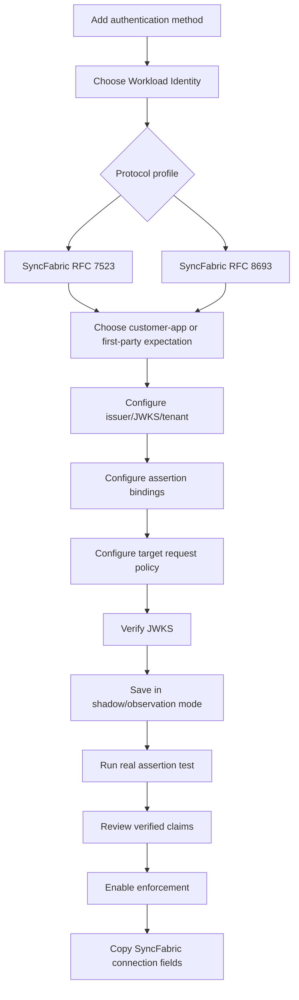

### 18.2 Pages/steps

#### Step 1 - Protocol

- SyncFabric client assertion (RFC 7523-shaped).
- SyncFabric token exchange (RFC 8693).
- Explain that Google Workspace uses RFC 8693 plus a separate Google step.

#### Step 2 - Acquisition expectation

- Customer application.
- SyncFabric first-party application.
- Unknown/observe first.

This choice pre-populates guidance, not unverified authorization values.

#### Step 3 - Entra trust

- cloud;
- tenant ID;
- issuer;
- JWKS URI;
- allowed algorithms.

#### Step 4 - Assertion bindings

- assertion audience;
- subject;
- object ID;
- authorized party/application ID;
- roles;
- enforcement state for each.

#### Step 5 - Target request

RFC 7523:

- generated target client ID;
- SuccessFactors resource mode/value;
- issued scopes.

RFC 8693:

- required audience parameter;
- allowed requested scopes;
- subject/requested token types.

#### Step 6 - Verify

- metadata/JWKS reachability;
- key count and algorithms;
- safe issuer consistency;
- optional real assertion evaluation.

#### Step 7 - Connection panel

Show copy buttons with exact SyncFabric labels:

```text
BaseAddress
Oauth2TokenExchangeUri
Oauth2ClientId        (RFC 7523 only)
Oauth2Audience        (RFC 8693 only)
Oauth2Scope           (RFC 8693 only)
ResourceId            (when enabled)
```

Never label assertion `sub` as "Client ID."

### 18.3 Safety states

Use explicit status badges:

```text
Draft
JWKS verified
Awaiting real assertion
Shadow evaluation
Enforced
Degraded - JWKS fetch
Rejected recently
Disabled
```

Avoid a generic green "WIF enabled" badge that hides whether target and assertion bindings are enforced.

### 18.4 UI files

Primary changes:

- `web/src/pages/CredentialsTab.tsx`
  - versioned profile form;
  - separate target-client and assertion-identity fields;
  - assertion observation workflow;
  - active-field summaries.
- `web/src/components/primitives/ConnectionPanel.tsx`
  - exact SyncFabric field labels;
  - no `sub`-as-client-ID wording;
  - protocol-specific copy blocks.
- shared connection-info types
  - discriminated WIF profile projection.

---

## 19. Data transformations end to end

### 19.1 RFC 7523

```mermaid
flowchart LR
    Cfg["SyncFabric credentials"] --> Scope["Build Entra scope"]
    Scope --> AT1["Entra application token AT1"]
    AT1 --> Form["URL-encoded RFC 7523 form"]
    Form --> Parse["Parsed request"]
    Parse --> Verify["Verified workload identity"]
    Verify --> Bind["Target client/resource binding"]
    Bind --> AT2["SCIMServer endpoint token AT2"]
    AT2 --> Guard["Endpoint resource guard"]
    Guard --> SCIM["SCIM operation"]
```

| Stage | Input | Transformation | Output |
|---|---|---|---|
| scope | resource app ID, mode, target host | customer or host-qualified composition | Entra scope string |
| AT1 | Entra token response | signed JWT | workload assertion |
| form | AT1, target client ID, optional resource | URL encode | token request bytes |
| parse | form bytes | strict singleton parsing | RFC 7523 request object |
| verify | assertion + trust | JWKS and claim rules | verified identity |
| bind | request + trust | client/resource comparison | authorized exchange |
| AT2 | verified context | endpoint issuance policy | SCIMServer bearer token |
| resource | AT2 + URL endpoint ID | signature/audience/endpoint checks | authorized SCIM principal |

### 19.2 RFC 8693

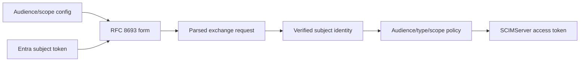

The two audiences remain distinct:

```text
AT1.aud                        = Entra assertion resource
request.audience               = token-exchange target
AT2.aud                        = SCIMServer endpoint resource
```

### 19.3 Example matrix

| Value | Example | Validated by |
|---|---|---|
| AT1 `aud` | `<resource-api-client-id>` | `assertionBinding.expectedAudience` |
| AT1 `azp` | SyncFabric/customer app ID | `authorizedPartyRule` |
| AT1 `oid` | tenant-local SP object ID | `objectIdRule` |
| form `client_id` | `scim-wif-client-a83b7537` | `targetClientBinding` |
| form `resource` | `scimserver-test-resource` | `rfc7523Policy` |
| form `audience` | `https://wif-test.example.net/scim` | `rfc8693Policy` |
| form `scope` | `scim.read scim.write` | allowed/granted scope policy |
| AT2 `aud` | `<server-audience>:<endpoint-id>` | resource bearer guard |
| URL endpoint ID | `<endpoint-id>` | controller and guard |

---

## 20. Security and threat analysis

### 20.1 Threat model

| Threat | Example | Control |
|---|---|---|
| Forged assertion | Attacker signs a JWT with its own key | Exact issuer/JWKS trust plus signature validation |
| Cross-tenant token | Valid Entra token from another tenant | Exact issuer and `tid` |
| Wrong-resource token | Graph or unrelated API token reused | Exact assertion `aud` |
| Wrong principal | Another service principal in same tenant | Exact `sub`, `oid`, and/or `azp`/`appid` rules |
| Target-client substitution | Valid assertion sent with another `client_id` | Exact target-client binding |
| Token-exchange target escalation | Attacker requests broader audience/scope | Exact audience and scope subset policy |
| SuccessFactors resource confusion | Valid assertion requests another resource | Resource policy |
| Cross-endpoint replay | AT2 used against another endpoint | Endpoint-specific `aud` and `endpoint_id` guard |
| JWKS SSRF | Admin or issuer points to internal host | HTTPS, exact host allowlist, redirect revalidation, egress policy |
| DNS rebinding | Allowlisted host resolves privately | Network egress controls and optional IP-range validation |
| Key rotation outage | New `kid` appears | Unknown-`kid` refresh, single-flight, bounded retry |
| Stale-key abuse | Removed key remains cached | Stale use only for matching cached key and bounded cache policy |
| Algorithm confusion | `none`, HS256, unexpected curve | Explicit RS256/ES256 allowlist and JOSE key compatibility |
| Oversized token/body | Memory/CPU denial | request and JWT byte limits before decode |
| Multi-trust amplification | Many active trusts cause network work | trust count cap, issuer/kid ordering, single-flight JWKS cache |
| Credential downgrade | Invalid WIF falls through to secret | self-describing route ownership; rejected means stop |
| Diagnostic leakage | Raw assertion or expected claims logged | token fingerprint only, allowlisted verified fields |
| Token response caching | Browser/proxy caches access token | `no-store`, `no-cache` |
| Replay | Captured valid assertion exchanged repeatedly | TLS, short lifetimes, rate limits, token fingerprint telemetry; replay policy only after compatibility study |

### 20.2 Trust boundaries

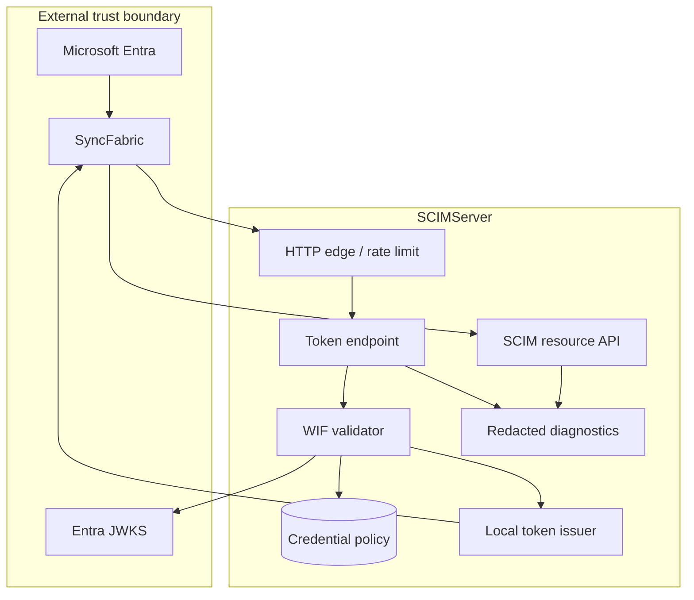

### 20.3 JWKS controls

Keep current mature behavior and add explicit operational limits:

- absolute HTTPS URI;
- no embedded credentials;
- exact host allowlist after IDNA/lowercase normalization;
- validate every redirect target before following;
- cap redirects;
- connect and overall timeout;
- response-size cap;
- JSON/JWK count cap;
- supported key type/algorithm/use only;
- cache-control-aware but bounded TTL;
- unknown-`kid` refresh once per single-flight window;
- bounded stale-key use;
- no signature-bypass fallback;
- egress firewall/DNS policy in production.

Do not automatically persist arbitrary discovery hosts into the allowlist.

### 20.4 Multi-trust selection

Algorithm:

```text
candidate trusts =
  active endpoint WIF trusts
  filtered by parsed protocol
  ordered by unverified issuer/kid hints
  capped by endpoint policy

for each candidate:
  perform full signature and claim verification
  perform request target binding

accept only if exactly one compatible trust succeeds
```

If multiple trusts accept:

- reject as ambiguous;
- emit a high-severity configuration diagnostic;
- do not choose first by row order.

This is stricter than the current "first accepting candidate" behavior and prevents overlapping trust configurations from creating nondeterministic source identity.

### 20.5 Replay handling

Do not initially require unique `jti`/`uti` or single-use assertions. SyncFabric caches and may retry token operations.

Phase in:

1. hash token bytes with SHA-256;
2. record bounded in-memory/repository telemetry keyed by hash;
3. observe same-token retry timing and frequency;
4. rate-limit abusive exchanges;
5. consider idempotent replay semantics only after evidence.

Never store the raw token.

### 20.6 Secrets and public values

Public configuration:

- issuer;
- JWKS URI;
- tenant ID;
- audience;
- subject/object/application IDs;
- OAuth target client ID;
- resource/audience/scope policy.

Sensitive values:

- compact incoming assertion;
- issued SCIMServer access token;
- any client secret from other auth methods;
- private signing keys;
- raw authorization headers.

WIF metadata must continue to use empty `credentialHash`; do not hash a public client ID as though it were a secret.

### 20.7 Current RequestLog disclosure and required privacy floor

**Confirmed current behavior:** `api/src/security/redact-sensitive.ts` and `api/src/modules/logging/logging.service.ts` state that persisted `RequestLog` rows keep complete headers and bodies, secrets included, by default. The server default is:

```text
PERSIST_REQUEST_SECRETS unset -> true
```

The redactor correctly recognizes `authorization`, `client_secret`, `client_assertion`, `assertion`, `jwt`, `token`, and related key names, but it runs only when the effective flag is false. Consequently, a default deployment can persist:

- incoming Entra assertions;
- RFC 8693 subject tokens after that profile is added;
- SCIMServer-issued access tokens;
- OAuth client secrets;
- Authorization headers;
- admin assertion-debugger inputs.

That contradicts the WIF security requirement even if the project is primarily a test ISV. A live SyncFabric assertion is a bearer credential until expiration; an issued SCIMServer access token is also a bearer credential. Database readers, log API users, exported diagnostics, backups, and retained test artifacts all become credential exposure paths.

Required design:

1. add a route-aware privacy classifier before `LoggingService.recordRequest`;
2. classify every token, introspection, revocation, assertion-debug, secret-reveal, and future DPoP/mTLS credential route as `auth-secret`;
3. unconditionally deep-redact request headers/body and response headers/body for that class before persistence;
4. ignore endpoint `PersistRequestSecrets=true` for those routes;
5. store only a one-way token fingerprint, byte length, safe JOSE metadata, selected allowlisted verified claims, decision reason, and correlation ID;
6. default `PERSIST_REQUEST_SECRETS=false` for production-like deployments even for ordinary SCIM payloads;
7. provide an explicit bounded local-only troubleshooting mode for non-auth SCIM bodies, never for token material.

Migration and incident handling:

- inventory existing RequestLog rows for token/auth routes without displaying their values;
- purge or irreversibly redact sensitive request/response fields in active storage;
- apply the same retention decision to exports and backups where feasible;
- rotate client secrets and SCIMServer signing material if exposure cannot be bounded;
- treat still-valid external assertions as expired by time, not as safe merely because they were test tokens;
- add regression tests with persistence enabled to prove the raw sentinel never reaches the repository, API, UI, download, or structured logs.

### 20.8 Current token hot path and performance model

No WIF benchmark or production latency distribution was found in the current SCIMServer source. The following is source-derived operation counting, not measured p50/p95/p99 data.

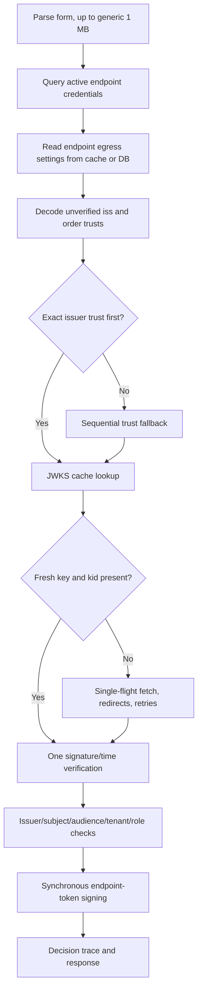

| Stage | Current operation count | Good property | Scaling/failure concern |
|---|---|---|---|
| Form parse | One Express URL-encoded parse, generic 1 MB limit | Bounded at framework level | Limit is much larger than a normal assertion; no profile-specific pre-decode cap. |
| Credential load | One `findActiveByEndpoint` query | Prisma has `(endpointId, active)` index | Loads every active credential type, then filters WIF in memory; no `credentialType` query/index component or active-WIF count cap. |
| Endpoint settings | Usually one in-process cache lookup | Endpoint service caches by ID/name | Cold malformed/non-UUID lookup can attempt ID then name; provider suppresses lookup errors and silently uses server egress defaults. |
| Candidate ordering | One bounded JWT payload decode plus O(T) issuer scan | Matching issuer is tried first | Unknown/unparseable issuer falls back to all T trusts; unverified payload size is not independently bounded. |
| Warm JWKS | O(1) map lookup by URI | No network on fresh known key | URI map has no explicit cardinality/eviction bound. |
| JWKS miss/rotation | One in-flight promise per URI | Same-URI requests are coalesced | First request's egress policy governs joiners; policy is not part of the in-flight key. |
| JWKS fetch | Redirects rechecked; timeout/retry/backoff bounded per setting | SSRF host allowlist and fail-closed behavior | No response-byte/key-count cap, no total deadline, and exponential backoff has no per-delay/total cap. |
| Stale fallback | Cached keys used after fetch exhaustion | Improves short outage availability | Any cached age is accepted; no hard stale-if-error ceiling. |
| Signature/claims | One asymmetric verification in common case | RS256/ES256 pinned; exact claims checked | Worst case is one verification/fetch sequence per trust, sequentially. |
| Issuance | One synchronous `JwtService.sign` | Small endpoint-bound token | Synchronous signing consumes event-loop CPU; cost depends on configured signing algorithm/key. |
| Decision diagnostics | One bounded in-memory record plus logs | Store defaults to 500 records/30 minutes | Multi-trust reject includes subtraces; persisted request log can duplicate sensitive and large bodies unless fixed. |
| Resource request | Endpoint config cache lookup, JWT-shape shortcut, one local JWT verify | Avoids O(credentials) bcrypt for issued JWTs | Resource JWT verify/sign throughput and event-loop delay are unmeasured. |

`T` is the number of active WIF trusts for one endpoint.

Common warm-case target:

```text
1 credential query
+ 1 endpoint cache lookup
+ O(T) cheap issuer scan
+ 0 network calls
+ 1 external JWT verification
+ 1 local token signature
+ 1 bounded decision record
```

Worst-case current target:

```text
1 credential query
+ up to T sequential external verification attempts
+ up to T JWKS fetch/retry sequences
+ T detailed reject traces
```

### 20.9 JWKS time-budget calculation

Current defaults:

```text
timeout per HTTP fetch = 5,000 ms
retries = 2, therefore attempts = 3
redirect limit = 3, therefore at most 4 HTTP fetches per attempt
base backoff = 200 ms with exponential growth plus jitter
```

An upper-bound model for one URI is:

```text
(retries + 1) * (redirects + 1) * timeout
+ sum(exponential backoff + jitter)
```

With default values, a deliberately slow redirect chain can approach:

```text
3 * 4 * 5,000 ms + less than 1,000 ms
= less than 61 seconds for one trust
```

A no-redirect outage is closer to 16 seconds under the same model. These are derived ceilings, not measurements.

The configured maximums are not a safe total budget. `retries=10`, `timeoutMs=60000`, and `retryBackoffMs=10000` allow exponential backoff and fetch time far beyond the 120-second HTTP server timeout. Closing the client socket does not by itself prove that all internal work is cancelled.

Required change:

- define one token-request deadline;
- pass its `AbortSignal` through trust selection and every fetch;
- cap per-delay exponential backoff;
- cap total backoff;
- stop before the deadline rather than starting another trust/fetch;
- ensure client disconnect cancels pending work;
- make endpoint values stricter only; server hard ceilings always win.

### 20.10 Performance and resilience changes

Priority order:

1. **Bound input before work**
   - token-route body limit below the generic SCIM limit;
   - compact-token byte limit;
   - exact three-segment JWT shape where required;
   - decoded header/payload byte and JSON-depth limits.
2. **Select before crypto/network**
   - compile an immutable endpoint trust index keyed by exact issuer and profile;
   - reject an unconfigured issuer without trying unrelated JWKS endpoints;
   - use legacy try-all only behind a measured migration flag;
   - reject ambiguous duplicate issuer/profile bindings at configuration time.
3. **Query only required credentials**
   - repository method `findActiveByEndpointAndType(endpointId, 'wif')`;
   - composite database index including endpoint, active state, and credential type;
   - cache compiled public trust policy with CRUD invalidation;
   - cap active trusts per endpoint.
4. **Harden JWKS cache/fetch**
   - maximum JWKS bytes, key count, key size, and accepted key types;
   - bounded LRU/TTL entries;
   - separate `freshMaxAgeMs` and `staleIfErrorMaxAgeMs`;
   - include effective fetch policy in single-flight compatibility or always apply server hard policy;
   - one total deadline across redirects and retries;
   - expose hit/miss/refresh/stale age without raw URI/tenant cardinality.
5. **Protect event-loop capacity**
   - measure verify and sign CPU for configured algorithms;
   - apply token-route concurrency/rate limits;
   - avoid serial crypto across unrelated trusts;
   - do not parallelize all candidate trusts because that turns one request into a network fan-out.
6. **Keep diagnostics bounded**
   - cap subtraces retained per request;
   - summarize omitted candidates;
   - redact before persistence;
   - emit approved low-cardinality stage durations.

### 20.11 Benchmark and telemetry plan

Add a repository-owned benchmark that uses the real parser, repository adapter, validator, cache, issuer, and guard. Record:

| Axis | Required cases |
|---|---|
| Trust count | 1, 4, 16, configured maximum |
| Selection | first issuer, last issuer, unknown issuer, malformed token |
| JWKS | warm hit, expired cache, unknown `kid`, rotation, outage, stale within limit, stale beyond limit |
| URI topology | same URI across trusts, distinct URIs, redirect, disallowed redirect |
| Signing | deployed algorithm/key size |
| Persistence | in-memory and Prisma/PostgreSQL |
| Concurrency | 1, 10, 50 simultaneous exchanges; same and different JWKS URI |
| Resource plane | issued JWT validation, wrong endpoint, expired token |

Capture:

- p50, p95, p99, max, and throughput;
- database query count;
- JWKS fetch count;
- cache hit/miss/refresh/stale count;
- crypto verify/sign duration;
- event-loop delay;
- heap/cache growth;
- active/pending request count;
- cancellation completion after client disconnect.

Do not set absolute SLOs from this document. First establish an isolated baseline, then choose targets from the intended test-environment concurrency and SyncFabric client timeout/retry behavior.

### 20.12 Performance acceptance invariants

These are measurable without inventing a latency number:

- a warm valid assertion with an exact issuer performs zero network calls;
- it performs exactly one external signature verification;
- an unknown issuer performs zero JWKS fetches and zero signature verifications after migration;
- concurrent unknown-`kid` requests perform at most one compatible fetch sequence per URI;
- token request work ends within the configured total deadline;
- cache cardinality and active trust count remain within configured hard limits;
- stale keys beyond the hard stale limit are rejected;
- oversized JWKS and assertions are rejected before expensive parsing/crypto;
- cancellation leaves no orphaned retry/backoff work;
- no raw assertion, subject token, access token, secret, or Authorization header reaches persistent logs.

---

## 21. Diagnostics, telemetry, and runbooks

### 21.1 Decision trace

Extend the existing trace rather than creating WIF-specific logs:

```json
{
  "requestId": "<correlation-id>",
  "endpointId": "<endpoint-id>",
  "provider": "wif",
  "profile": "syncfabric-rfc7523",
  "outcome": "rejected",
  "reasonCode": "wif_client_id_mismatch",
  "tokenFingerprint": "sha256:<truncated-hash>",
  "candidateTrusts": [
    {
      "trustId": "<credential-id>",
      "issuerHintMatched": true,
      "signature": "verified",
      "issuer": "matched",
      "tenant": "matched",
      "assertionAudience": "matched",
      "subject": "matched",
      "objectId": "matched",
      "authorizedParty": "matched",
      "targetClientId": "mismatched",
      "outcome": "rejected",
      "reasonCode": "wif_client_id_mismatch"
    }
  ]
}
```

Redact values from operational logs. Full expected/actual values should be available only in an authenticated admin diagnostic response and should still omit raw tokens.

### 21.2 Metrics

Recommended dimensions:

- protocol profile;
- acquisition expectation: customer, first-party, unknown;
- cloud;
- trust ID or non-sensitive stable hash;
- outcome;
- reason code;
- JWKS cache result;
- key refresh reason;
- selected algorithm;
- request target binding outcome;
- issued scope set identifier;
- latency stage.

Recommended measures:

- request count;
- success/rejection/error count;
- assertion verification latency;
- JWKS fetch/cache latency;
- token issuance latency;
- candidate trust count;
- unknown-`kid` refreshes;
- stale-key use;
- target-client mismatch count;
- target audience/scope mismatch count;
- remaining assertion lifetime at exchange;
- repeated token fingerprint count.

Do not use raw tenant IDs, subjects, object IDs, app IDs, scopes, tokens, or URLs as high-cardinality metric dimensions. Use approved hashes/buckets where correlation is necessary.

### 21.3 Health projection

Per trust/profile:

```json
{
  "status": "healthy",
  "lastSuccessAt": "2026-07-22T10:01:02Z",
  "lastFailureAt": null,
  "lastReasonCode": null,
  "jwks": {
    "status": "cached",
    "lastRefreshAt": "2026-07-22T09:30:00Z",
    "lastSuccessfulKid": "<redacted-or-hashed>"
  },
  "traffic": {
    "profile": "syncfabric-rfc7523",
    "lastSeenAcquisitionModel": "first-party"
  }
}
```

### 21.4 Runbook - `invalid_client`

1. correlate request ID;
2. confirm request parsed as RFC 7523;
3. confirm the form contains the configured `Oauth2ClientId`;
4. compare it to `targetClientBinding`;
5. verify assertion signature/claims in admin diagnostics;
6. check whether customer/first-party mode changed;
7. check token expiration and clock skew;
8. check JWKS refresh/unknown `kid`;
9. do not disable issuer/audience validation as a shortcut.

### 21.5 Runbook - `invalid_grant` in RFC 8693

1. confirm subject token type is exactly `urn:ietf:params:oauth:token-type:jwt`;
2. verify compact JWT structure and size;
3. inspect signature and temporal result;
4. confirm issuer, tenant, assertion audience, and principal bindings;
5. check real-token claim-shape release gate;
6. distinguish this from `invalid_target`.

### 21.6 Runbook - `invalid_target`

1. compare `Oauth2Audience` with `expectedAudienceParameter`;
2. parse `Oauth2Scope` as an OAuth scope set;
3. compare requested and allowed scopes;
4. confirm requested token type;
5. confirm the endpoint/trust profile selected;
6. do not compare this audience to JWT `aud`.

### 21.7 Runbook - JWKS outage or rotation

1. check exact host allowlist and cloud;
2. check DNS/TLS/egress;
3. check redirect diagnostics;
4. check cache and last successful refresh;
5. check whether the requested `kid` exists in safe cache;
6. force one bounded refresh through the existing admin operation;
7. do not bypass signature verification;
8. if outage persists, use rollback to a still-valid trust only when its issuer/key policy genuinely authorizes the token.

---

## 22. Environment architecture

### 22.1 Required tiers

| Tier | Issuer/signing | SyncFabric | SCIMServer | Purpose |
|---|---|---|---|---|
| Local unit | local generated keys | no | local process | deterministic parser, policy, validator, and error tests |
| Local E2E | local JWKS HTTP server | no | API + DB | complete token and SCIM resource flow |
| CI synthetic | ephemeral generated keys/JWKS | no | CI services | repeatable pull-request gate |
| Real Entra smoke | real Entra test app | optional | test deployment | real issuer, JWKS, signature, rotation, and claim parsing |
| SyncFabric TME E2E | actual TME first-party/customer flow | yes | stable test deployment | authoritative client contract |
| Production-like commercial | isolated commercial tenant | yes | production-like deployment | rollout and operational validation |
| Fairfax / US Government | actual US Gov authority/apps | yes | matching sovereign deployment | `FFPROD_AD2AAD` authority, app, Graph, JWKS, and egress validation |
| USNat | actual USNat authority/apps | yes | matching sovereign deployment | `USNAT_AD2AAD` and HR variant validation |
| USSec | actual USSec authority/apps | yes | matching sovereign deployment | `USSEC_AD2AAD` and HR variant validation |
| Mooncake / China | actual China authority/apps | yes | matching sovereign deployment | `MCPROD_AD2AAD` authority, app, JWKS, and egress validation |
| Bleu | actual Bleu authority/apps | yes | matching sovereign deployment | `BLPROD_AD2AAD` authority, app, JWKS, and egress validation |
| Other dedicated environment | actual deployment-specific authority/apps | yes | matching deployment | no commercial-cloud assumption; discover from current deployment source |

PPE is not an active target unless an explicit legacy test is requested.

### 22.2 Stable host requirement

First-party token scope composition includes the normalized target host. Real environments need:

- a stable externally reachable HTTPS hostname;
- no ephemeral PR-hostname dependency for the authoritative flow;
- certificate and DNS ownership;
- exact hostname agreement across `BaseAddress`, Entra resource configuration, ingress, and connection info.

Use stable names such as:

```text
wif-tme.<owned-domain>
wif-prodlike.<owned-domain>
wif-usgov.<owned-domain>
wif-china.<owned-domain>
```

These are naming examples, not reserved values.

### 22.3 Environment configuration matrix

Store public environment metadata separately from secrets:

```json
{
  "name": "commercial-tme",
  "publicOrigin": "https://wif-tme.example.net",
  "entra": {
    "cloud": "commercial",
    "tenantId": "<tenant-id>",
    "issuer": "https://login.microsoftonline.com/<tenant-id>/v2.0",
    "jwksUri": "https://login.microsoftonline.com/<tenant-id>/discovery/v2.0/keys",
    "syncFabricFirstPartyApplicationId": "80060f08-85c7-418a-a486-6b36ce053eab",
    "resourceApplicationId": "<resource-app-id>",
    "observedAssertionAudience": "<observed-aud>"
  },
  "scim": {
    "endpointId": "<endpoint-id>",
    "rfc7523ClientId": "scim-wif-client-<id>",
    "rfc8693Audience": "https://wif-tme.example.net/scim",
    "rfc8693Scope": "scim.read scim.write"
  }
}
```

Do not commit:

- assertions;
- issued access tokens;
- client secrets;
- signing private keys;
- administrative bearer tokens.

### 22.4 Commercial Entra/SyncFabric setup workflow

The exact portal/UI operations can evolve, but the ownership flow is:

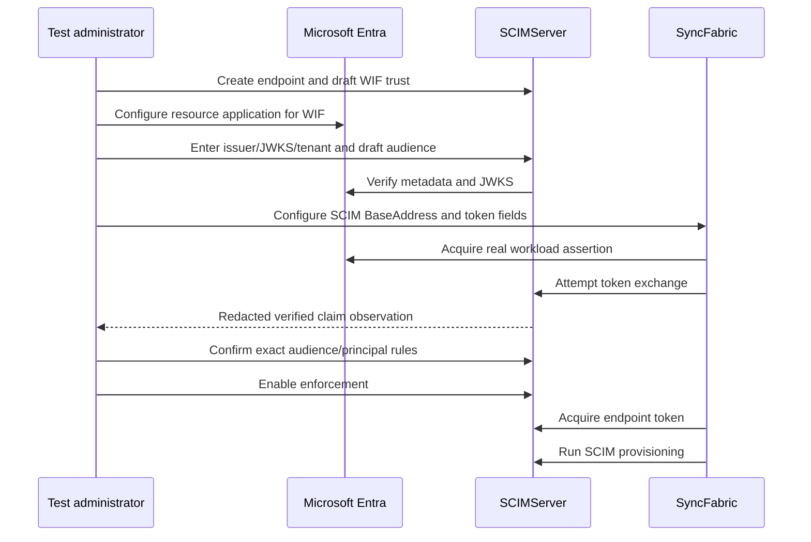

### 22.5 First-party setup specifics

1. use the actual SyncFabric first-party application ID for the environment;
2. ensure its service principal exists in the test tenant;
3. configure the Entra resource side for the exact host-qualified scope that current SyncFabric requests;
4. set `BaseAddress` to the stable host;
5. do not set `EntraApplicationObjectIdentifier` when testing first-party mode;
6. capture only redacted, verified claim values;
7. bind `azp`/`appid`, `oid`, `sub`, and `aud` after observation;
8. run a SCIM operation after token acquisition.

The exact app-registration representation of the host-qualified resource and the resulting token `aud` are **empirical release gates**. Verify them through a real token request rather than relying on textual interpretation.

### 22.6 Customer-application setup specifics

1. create/use the customer resource and workload applications required by the SyncFabric flow;
2. record both application/client IDs and object IDs with clear labels;
3. configure `EntraApplicationIdentifier`;
4. configure `EntraApplicationObjectIdentifier`; its presence forces customer mode;
5. configure SCIMServer's target OAuth client ID independently;
6. observe the real assertion's `sub`, `oid`, `azp`/`appid`, and `aud`;
7. enable exact rules only after verification;
8. remove the object identifier only in a deliberate first-party migration test.

### 22.7 Sovereign clouds

For every sovereign environment:

- use its authority and JWKS hosts;
- use its actual SyncFabric first-party application ID;
- use its Graph and manager environment;
- maintain a cloud-specific exact-host allowlist;
- do not rewrite commercial issuer templates;
- validate TLS and outbound routing in that cloud;
- keep trust rows separate by cloud and tenant;
- run an actual signed-token test.

The existing seed support for commercial, US Government, China, and Google hosts is useful but does not prove a deployment's app IDs or issuer formats.

### 22.8 Source-derived environment readiness

Current committed SyncFabric source contains these environment selectors in `src/deployment/data/service_configurations/features.ini`:

```text
FFPROD_AD2AAD
USNAT_AD2AAD
USNAT_HR
USSEC_AD2AAD
USSEC_HR
MCPROD_AD2AAD
BLPROD_AD2AAD
```

It contains two explicit WIF first-party application identifiers in the searched deployment/configuration source:

| Configuration | Application ID | Evidence |
|---|---|---|
| Default/production | `cb1d50fe-8ed0-4944-9e7d-5981aad3bc4b` | `workloadIdentityFederationApplicationPrincipalId` default |
| `AADSF_DEV_US_ALL` / TME | `80060f08-85c7-418a-a486-6b36ce053eab` | deployment override and configuration constant |

No explicit per-sovereign WIF application-ID override was found in the committed setting search. This does **not** prove that sovereign deployments use the commercial ID; values can be supplied through environment-specific deployment systems outside the reviewed setting. It proves only that the guide cannot safely publish those IDs from this repository snapshot.

Readiness matrix:

| Environment family | Authority/JWKS | WIF 1P app ID in reviewed committed source | SyncFabric rollout evidence | SCIMServer requirement | Status |
|---|---|---|---|---|---|
| Local synthetic | Local HTTPS JWKS | generated test ID | not applicable | deterministic persona and generated keys | Designable now |
| Commercial TME | Commercial Entra test tenant | `80060f08-85c7-418a-a486-6b36ce053eab` | DEV setting plus current 1P slice flags | stable public host, real assertion capture | First live gate |
| Commercial production-like | Commercial Entra | `cb1d50fe-8ed0-4944-9e7d-5981aad3bc4b` | 1P staged by slice; target profiles globally enabled | isolated tenant, host resource, no production data | After TME |
| Fairfax / US Government | Government authority | not established here | active selectors exist | exact authority, JWKS allowlist, Graph endpoint, app ID, host scope | Blocked on environment facts |
| USNat | USNat authority | not established here | AD2AAD and HR selectors exist | same plus deployment routing | Blocked on environment facts |
| USSec | USSec authority | not established here | AD2AAD and HR selectors exist | same plus deployment routing | Blocked on environment facts |
| Mooncake / China | China authority | not established here | `MCPROD_AD2AAD` exists | China authority/JWKS/Graph/host/app validation | Blocked on environment facts |
| Bleu | Bleu authority | not established here | `BLPROD_AD2AAD` exists | Bleu authority/JWKS/Graph/host/app validation | Blocked on environment facts |
| Delos or another dedicated environment | deployment-specific | not established here | no `DELOS` selector found in reviewed `features.ini` | discover from current deployment owner/source before design | Discovery gate |

Current WIF rollout facts remain:

- configurable RFC 7523, RFC 8693, and Google WIF target strategies are globally enabled;
- default 1P acquisition is enabled only for slices A and B;
- SuccessFactors 1P is enabled for HYBRID1;
- 1P service-principal provisioning and missing-SP recovery are enabled for A, B, and HYBRID1.

These slice flags are not substitutes for cloud support. Each environment requires its own complete manifest:

```json
{
  "environmentId": "commercial-tme",
  "authPersonaPreset": "syncfabric-rfc7523-v1",
  "publicOrigin": "https://<stable-owned-host>",
  "entra": {
    "cloud": "commercial",
    "authorityHost": "https://login.microsoftonline.com",
    "tenantId": "<tenant-id>",
    "issuer": "<observed-and-verified-issuer>",
    "jwksUri": "<verified-jwks-uri>",
    "syncFabricFirstPartyApplicationId": "80060f08-85c7-418a-a486-6b36ce053eab",
    "resourceApplicationId": "<resource-app-id>",
    "observedAssertionAudience": "<observed-aud>"
  },
  "releaseGates": {
    "customerAssertionCaptured": false,
    "firstPartyAssertionCaptured": false,
    "tokenExchangePassed": false,
    "scimOperationPassed": false,
    "keyRotationPassed": false
  }
}
```

The manifest is public configuration. Store references to protected setup jobs or secret stores, not their secret values.

---

## 23. Test strategy

### 23.1 Test pyramid

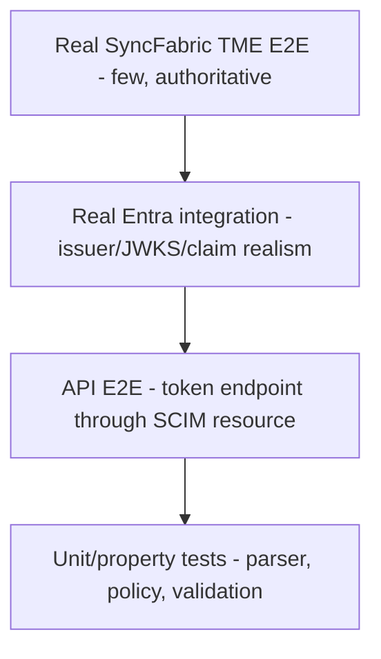

### 23.2 Unit tests - request parser

| Case | Expected |
|---|---|
| valid Basic client secret | `client-secret` |
| valid form client secret | `client-secret` |
| valid RFC 7523 body | `syncfabric-rfc7523` |
| valid RFC 8693 body | `syncfabric-rfc8693` |
| missing grant | `invalid_request` |
| unknown grant | `unsupported_grant_type` |
| assertion and secret | reject, no fallback |
| Basic plus assertion | reject |
| RFC 8693 plus client assertion | reject |
| duplicate singleton field | reject |
| empty normalized field | reject |
| wrong assertion type | reject |
| wrong subject token type | reject |
| oversized token/body | reject before JOSE |
| comma-separated scope | treated as one invalid scope or rejected |

### 23.3 Unit tests - trust and policy

- exact `client_id` match and mismatch;
- client ID rotation with two accepted IDs;
- protocol filtering;
- exact issuer and tenant;
- assertion audience string and array;
- subject exact/advisory/disabled;
- object ID exact/advisory/disabled;
- v2 `azp` and v1 `appid` normalization;
- roles exact/advisory/disabled;
- resource ignore/optional/required;
- RFC 8693 target audience;
- scope subset and deterministic output;
- requested token type;
- assertion remaining lifetime cap;
- zero, one, and multiple accepting trusts;
- disabled/revoked trust;
- malformed versioned metadata;
- legacy metadata compatibility projection.

### 23.4 Cryptographic/JWKS tests

Retain current coverage and add:

- RS256 and ES256 success;
- unsupported algorithm;
- `none` and symmetric algorithm rejection;
- key `use` and `alg` mismatch;
- unknown `kid` one-time refresh;
- concurrent unknown-`kid` single-flight;
- rotation from old to new key;
- malicious redirect;
- allowlisted initial host to non-allowlisted redirect;
- oversized JWKS;
- excessive key count;
- stale cached matching key;
- stale cache without matching key;
- timeout and bounded retry;
- no signature-bypass path.

### 23.5 API E2E - RFC 7523

Update `api/test/e2e/wif-assertion.e2e-spec.ts`:

1. include the exact SyncFabric `client_id`;
2. expect HTTP 200;
3. assert `Cache-Control: no-store`;
4. assert `Pragma: no-cache`;
5. decode AT2 and assert source identity and target client remain distinct;
6. call a SCIM resource with AT2;
7. reject cross-endpoint replay;
8. reject missing/mismatched `client_id`;
9. reject secret plus assertion;
10. test SuccessFactors `resource` modes;
11. test customer and first-party claim sets;
12. test no fallthrough after a WIF rejection.

### 23.6 API E2E - RFC 8693

Add a separate describe block/file:

- exact SyncFabric form succeeds;
- `client_id` is not required;
- response includes `issued_token_type`;
- success is HTTP 200 with no-cache headers;
- subject token type mismatch fails;
- missing audience/scope fails;
- target audience mismatch returns `invalid_target`;
- invalid scope returns `invalid_scope`;
- wrong requested token type fails;
- invalid assertion returns `invalid_grant`;
- AT2 authorizes SCIM for only its endpoint;
- metadata advertises token exchange only while this handler is enabled.

### 23.7 UI tests

- profile selection controls visible fields;
- RFC 7523 shows generated target client ID;
- RFC 8693 omits target client ID;
- assertion subject is never labeled client ID;
- copied field labels exactly match SyncFabric credential names;
- draft/shadow/enforced states render correctly;
- role modes and resource modes round-trip;
- observation response never displays a raw token after submission;
- legacy trust renders with migration warnings.

### 23.8 Real Entra smoke

Purpose:

- validate real JWKS and signatures;
- validate v1/v2 claim normalization;
- validate issuer/audience handling;
- exercise key rotation behavior.

This can use a dedicated test workload application, but it is not proof of SyncFabric provenance. Label its result accordingly.

### 23.9 Real SyncFabric TME E2E

This is the authoritative release test:

| Scenario | Required |
|---|---:|
| Customer mode + RFC 7523 | Yes |
| First-party mode + RFC 7523 | Yes |
| Customer mode + RFC 8693 | Yes when available in the target connector |
| First-party mode + RFC 8693 | Yes when available |
| SuccessFactors resource | Yes for SuccessFactors compatibility |
| Existing job with object ID remains customer mode | Yes |
| Remove object ID and transition to first-party | Yes |
| Host alias mismatch fails predictably | Yes |
| New signing `kid` refresh | Yes when safely simulatable |
| Token acquisition followed by SCIM create/update/read | Yes |

Record:

- source commit/build;
- environment and endpoint;
- protocol and mode;
- redacted header/claim summary;
- target request parameters excluding tokens;
- outcome and reason code;
- AT2 endpoint-bound claims;
- SCIM operation result.

Never archive raw assertions or AT2 values.

### 23.10 CI and workflow additions

Keep `.github/workflows/build-test.yml` as the synthetic required gate:

- API lint/unit/E2E;
- web tests/build;
- existing image and scan behavior.

Add a protected optional workflow, for example `.github/workflows/wif-live.yml`, only if repository norms support it:

- `workflow_dispatch` and/or scheduled;
- protected environment;
- OIDC-based access where possible;
- no long-lived assertion secret;
- deploy/test stable environment;
- run a real-Entra smoke;
- trigger or coordinate the separate SyncFabric TME job;
- collect redacted diagnostics;
- delete ephemeral endpoint/trust data;
- do not delete shared app registrations automatically.

Full SyncFabric E2E may require an external orchestration step because GitHub Actions cannot manufacture a genuine SyncFabric assertion.

### 23.11 Existing live-test integration

Extend `scripts/live-test.ps1` with profile-specific parameters:

```powershell
-AuthProfile ClientSecret
-AuthProfile SyncFabricRfc7523
-AuthProfile SyncFabricRfc8693
```

The script should consume an acquired access token or invoke a protected environment coordinator. It must not accept a raw assertion as a normal command-line value because process listings and shell history can expose it.

### 23.12 Privacy regression tests

Use high-entropy sentinels for every credential location:

- `Authorization` request header;
- `client_secret`;
- `client_assertion`;
- RFC 8693 `subject_token`;
- admin assertion-debugger `token`;
- issued `access_token`;
- token response cookie/header if ever added.

Run with `PERSIST_REQUEST_SECRETS=true` and false:

1. exercise every auth-secret route;
2. query persisted RequestLog rows through the repository;
3. retrieve the same rows through the admin API and UI/export projection;
4. capture structured console/file test output;
5. recursively scan all returned objects and strings for every sentinel;
6. assert that only approved fingerprints and safe metadata remain.

Add an idempotent migration test over a fixture containing historical raw token-route logs. The migration must remove or irreversibly redact the raw values.

### 23.13 Persona contract and performance tests

For every finite `authPersonaPreset`, generate one contract suite from the catalog:

| Surface | Assertion |
|---|---|
| Parser | accepts exactly the profile's required/optional fields and rejects forbidden/duplicate fields |
| Validator | enforces the profile's algorithm, issuer, audience, subject, tenant, and role rules |
| Handler | uses the correct RFC 7523, RFC 8693, client-secret, or static path |
| Metadata | advertises only grants and parameters accepted by the parser |
| Connection information | returns the matching auth mode and public values |
| UI | renders the same profile, required fields, warnings, and effective configuration |
| Export/import | round-trips preset/version and public config without secrets |
| Resource guard | accepts the issued token type and rejects wrong endpoint/profile bindings |

Automated performance/resilience cases:

- 1, 4, 16, and configured-maximum trusts;
- known first/last issuer and unknown/malformed issuer;
- warm JWKS, unknown `kid`, rotation, timeout, redirect, disallowed redirect, and oversized response;
- same-URI concurrent misses proving compatible single-flight;
- hard-stale cache rejection;
- request deadline and client-disconnect cancellation;
- cache/trust cardinality caps;
- event-loop delay and heap-growth guardrails;
- zero-network unknown issuer after indexed-selection migration;
- exact database and cryptographic-operation counts for the warm valid case.

---

## 24. Migration design

### 24.1 Goals

- preserve all current valid WIF trusts;
- do not silently reinterpret existing fields;
- remove incorrect defaults without an outage;
- gather evidence before stricter claim and target binding;
- keep rollback straightforward.

### 24.2 Legacy projection

Project current metadata into an internal v2 view:

| Legacy field | V2 projection |
|---|---|
| `expectedIssuer` | `issuerTrust.issuer` |
| `jwksUri` | `issuerTrust.jwksUri` |
| `allowedTenantId` / alias | `issuerTrust.tenantId` |
| `expectedAudience` | `assertionBinding.expectedAudience` |
| `expectedSubject` | `assertionBinding.subjectRule.exact` |
| `expectedRoles` | `assertionBinding.roleRule` |
| `roleEnforcement` | exact or advisory role mode |
| `assertionProfile=jwt-bearer` | `enabledProfiles=['syncfabric-rfc7523']` |
| `subjectTokenType` | projection diagnostic only until RFC 8693 selected |
| `expectedResource` | `rfc7523Policy.expectedResource`, initially `ignore` |
| `identityModel` | setup hint/telemetry, not automatic authorization |

Critical migration rules:

- do **not** project `expectedSubject` into target `client_id`;
- do **not** generate and enforce a new target client ID without updating SyncFabric;
- do **not** replace an endpoint-ID audience automatically;
- flag endpoint-ID-like assertion audiences as likely misconfiguration;
- keep a reversible original metadata copy or version history using existing repository conventions.

### 24.3 Migration phases

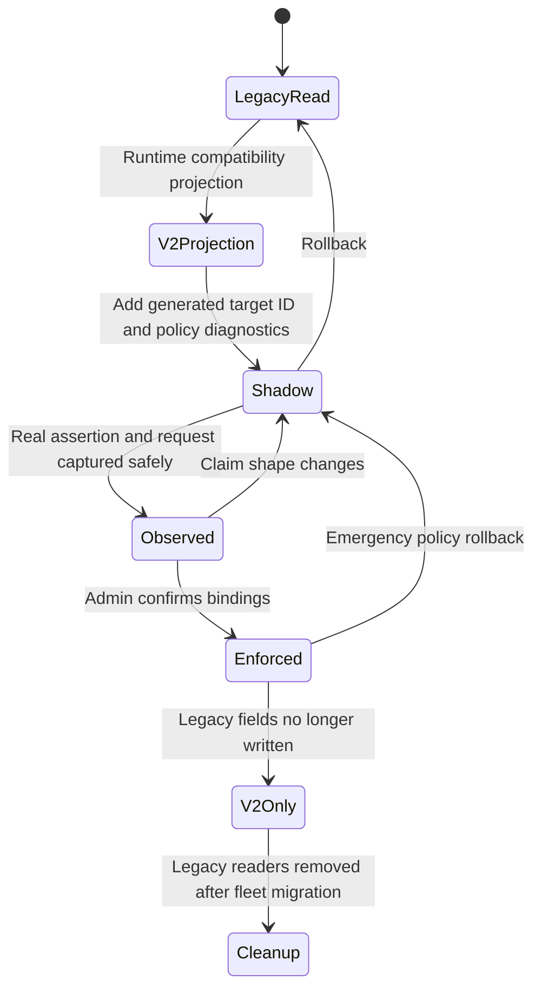

#### Phase -1 - secrecy hotfix

- unconditionally redact auth-secret routes before RequestLog persistence;
- default `PERSIST_REQUEST_SECRETS=false`;
- add end-to-end sentinel tests;
- inventory and purge/irreversibly redact historical credential-bearing fields;
- review exports/backups and rotate affected credentials when exposure cannot be bounded.

#### Phase 0 - tests and metrics

- freeze current behavior in E2E;
- add token status/cache-header tests;
- add telemetry for request `client_id`, `resource`, and grant shape using only hashes/enums.
- establish warm/cold JWKS, trust-count, crypto, event-loop, and memory baselines.

#### Phase 1 - parser and v2 compatibility model

- add request union;
- add v2 types/DTOs;
- read legacy and v2 metadata;
- keep current RFC 7523 behavior through a legacy compatibility policy;
- stop advertising RFC 8693 until its runtime exists.
- add the finite versioned endpoint auth-persona catalog;
- generate parser, metadata, connection information, and UI capabilities from the same persona definition.

#### Phase 2 - RFC 7523 target binding in shadow

- generate target client IDs for new trusts;
- allow legacy trusts to remain unbound with a warning;
- evaluate whether request `client_id` would match;
- expose exact connection fields;
- update SyncFabric test configuration.

#### Phase 3 - RFC 7523 enforcement

- enforce target client for migrated/new trusts;
- enforce resource policy where configured;
- correct AT2 identity projection;
- retain legacy compatibility only for explicitly flagged rows.

#### Phase 4 - RFC 8693

- add handler, policy, response, tests;
- advertise metadata only after the handler is active;
- validate with real SyncFabric.

#### Phase 5 - claim strengthening

- observe both acquisition modes;
- enable exact `oid` and `azp`/`appid` where stable;
- promote roles from advisory only when app-role emission is proven;
- cap AT2 lifetime at AT1 expiry.

#### Phase 6 - cleanup

- stop writing legacy metadata;
- migrate all rows to `schemaVersion=2`;
- remove endpoint-derived audience fallback;
- remove inert UI fields and readers;
- remove legacy unbound client compatibility after measured zero use.
- remove legacy unknown-issuer try-all after indexed issuer selection has measured zero compatibility use.

### 24.4 Rollback

Rollback controls should be explicit:

- handler feature flag per profile;
- trust status `shadow` versus `enforced`;
- keep prior accepted client ID during rotation;
- preserve legacy projection reader until migration completes;
- metadata immediately removes disabled capability;
- no database rollback required for a handler disable;
- never roll back by bypassing signature, issuer, tenant, or audience verification.

---

## 25. File-by-file implementation plan

### 25.1 Backend foundation

#### `api/src/modules/logging/logging.service.ts`

- classify auth-secret routes before persistence;
- always deep-redact their request/response headers and bodies regardless of `PERSIST_REQUEST_SECRETS`;
- default general request-secret persistence off;
- retain only approved fingerprint, length, reason, timing, and correlation fields;
- add tests proving the persistence repository receives redacted values.

#### `api/src/security/redact-sensitive.ts`

- keep recursive key redaction;
- add a route-policy entry point so privacy does not depend only on field spelling;
- cover RFC 8693 `subject_token`, DPoP proofs, assertion debugger inputs, and issued token responses;
- add sentinel/property tests for nested arrays, form bodies, JSON, headers, and mixed casing.

#### New: `api/src/oauth/auth-persona.catalog.ts`

- finite immutable `AuthPersonaDefinition` catalog;
- stable ID and version;
- accepted request shapes and profile handler;
- metadata, connection-info, and UI capability descriptors;
- no executable expression language and no trust records.

#### `api/src/modules/scim/controllers/endpoint-oauth.controller.ts`

- add `@HttpCode(200)`;
- add no-store/no-cache response headers;
- delegate strict form parsing to a parser/service;
- apply token-route-specific body/assertion limits;
- route the discriminated union;
- remove controller-level grant/auth guessing;
- preserve no-fallback semantics;
- map internal results to OAuth responses.

#### New: `api/src/oauth/endpoint-token-request.types.ts`

- discriminated request union;
- fixed URI constants;
- normalized scope type;
- protocol capability types.

#### New: `api/src/oauth/endpoint-token-request-parser.service.ts`

- strict singleton form parsing;
- ambiguity checks;
- size and presence validation;
- Basic/form secret normalization;
- no cryptographic logic.

#### New: `api/src/oauth/syncfabric-rfc7523-token.provider.ts`

- profile eligibility;
- target client/resource binding;
- calls shared trust selector/verifier;
- endpoint issuance.

#### New: `api/src/oauth/syncfabric-rfc8693-token.provider.ts`

- token type, audience, scope, and requested-token-type policy;
- calls shared trust selector/verifier;
- RFC 8693 response projection.

Names can be adjusted to match the existing module directory convention; avoid duplicate controller/provider classes.

### 25.2 WIF trust and validation

#### `api/src/modules/scim/controllers/wif-assertion-token.provider.ts`

- extract reusable trust selection and verified-identity creation;
- accept parsed protocol context rather than raw form;
- stop assigning assertion `sub` to target `client_id`;
- compile and cache exact issuer/profile selection with credential-change invalidation;
- reject unknown issuers without fetching unrelated JWKS;
- impose a hard active-trust count;
- reject ambiguous multiple-accepting trusts;
- keep bounded detailed subtraces.

It may be renamed to a shared WIF trust service once callers are migrated, but do not combine parsing, cryptography, and issuance into it.

#### `api/src/oauth/wif-assertion-validator.service.ts`

- support versioned claim rules;
- add `oid` and `azp`/`appid` validation;
- return normalized verified identity;
- keep issuer, audience, subject, tenant, roles, temporal checks;
- cap issue lifetime with assertion expiry;
- never authorize from unverified decoded claims.

#### `api/src/oauth/external-jwks-validator.service.ts`

- retain current algorithm pinning, redirect checks, and same-URI single-flight;
- add response-byte, key-count, key-size, key-type, and cache-entry limits;
- separate fresh age from hard stale-if-error age;
- enforce a total request deadline and cancellation through redirects, retries, and backoff;
- make single-flight policy compatibility explicit;
- expose safe cache/refresh telemetry;
- preserve strict redirect validation and fail-closed behavior.

#### `api/src/oauth/jwks-host-allowlist.service.ts`

- retain layered exact-host policy;
- add environment-specific tests;
- do not auto-enroll discovery hosts.

#### `api/src/oauth/auth-reason-catalog.ts`

- add stable request, target-binding, claim, and token-exchange reason codes;
- map them to safe T1 messages and richer admin diagnostics.

### 25.3 Persistence and admin

#### `api/prisma/schema.prisma`

No new WIF trust table is required. Continue using versioned `EndpointCredential.metadata`.

Add a composite index that supports active WIF lookup by endpoint, active state, and credential type. A migration is therefore expected for the index even if no new data column/table is added. Add a persona column only if existing endpoint configuration cannot persist a versioned preset without duplicating behavior; otherwise keep it in the canonical endpoint configuration aggregate.

Add an idempotent data migration or bounded administrative job to purge/irreversibly redact historical auth-secret RequestLog payload fields. Do not print candidate values during inventory or migration.

#### `api/src/modules/scim/controllers/admin-credential.controller.ts`

- add `WifTrustV2` DTO and validation;
- preserve legacy aliases only in the compatibility reader;
- generate RFC 7523 target client ID;
- make profile/resource/token-type fields active;
- split JWKS verification from assertion evaluation;
- return redacted normalized claim observations;
- add explicit shadow/enforced state.

Consider extracting DTO validation/mapping into a service if the controller remains overly coupled after this change.

#### Endpoint repository/service used by the current token provider

- add `findActiveByEndpointAndType(endpointId, credentialType)`;
- avoid loading static bearer, OAuth secret, and unrelated active credentials for WIF;
- invalidate compiled trust/persona caches on create, update, activate/deactivate, revoke, import, and delete.

### 25.4 Issuance and resource plane

#### `api/src/oauth/oauth.service.ts`

- accept normalized workload identity and target-client context;
- preserve endpoint-specific `aud`;
- set `auth_method`;
- stop setting `client_id` from assertion `sub`;
- cap expiration at incoming assertion expiry;
- add a unique `jti`;
- if formal RFC 9068 is selected, set `typ=at+jwt` and update resource validation/tests as one change;
- retain global TTL bounds.

#### `api/src/modules/auth/shared-secret.guard.ts`

- preserve endpoint/audience isolation;
- accept the normalized WIF-issued principal;
- add tests for both WIF profiles;
- no external-JWKS logic should move into this guard.

### 25.5 Metadata and connection information

#### `api/src/modules/scim/controllers/endpoint-oauth-metadata.controller.ts`

- derive metadata from the endpoint's effective persona capabilities;
- remove unsupported token exchange until implemented;
- add WIF profile extension;
- test per-endpoint active configuration.

#### `api/src/modules/scim/services/connection-info.service.ts`

- remove endpoint-ID audience fallback;
- stop mapping WIF client identifier from assertion subject;
- emit protocol-discriminated SyncFabric field mappings;
- consume the same effective persona/capability projection as metadata and UI;
- surface migration/health state.

#### `api/src/shared/types/connection-info.types.ts`

- add `WifConnectionProfile` union;
- distinguish `Oauth2ClientId`, assertion subject, assertion audience, RFC 8693 audience, and SCIM endpoint.

### 25.6 Web

#### `web/src/pages/CredentialsTab.tsx`

- profile-first WIF wizard;
- endpoint auth-persona selection with finite documented presets;
- versioned model;
- separate target and assertion sections;
- real assertion observation;
- resource and scope policy;
- migration warning for legacy rows.

#### `web/src/components/primitives/ConnectionPanel.tsx`

- exact field names and copy actions;
- protocol-specific sections;
- remove client-ID/subject conflation.

#### `web/src/components/primitives/OverflowMenu.tsx`

- reuse the current shared visible-label menu for persona/profile actions where an overflow menu is appropriate;
- keep primary persona selection and security warnings outside overflow-only discovery;
- preserve menu accessibility tests and do not duplicate its keyboard behavior.

### 25.7 Tests and workflows

#### `api/test/e2e/wif-assertion.e2e-spec.ts`

- exact RFC 7523 client contract;
- status/cache headers;
- target binding;
- AT2 identity distinctions;
- AT2 `jti` and, if selected, RFC 9068 `typ`/claim validation;
- customer/first-party claims.

#### Existing logging and redaction test suites

- prove auth-secret route redaction with `PERSIST_REQUEST_SECRETS` enabled and disabled;
- inspect persisted, API-projected, exported, and structured-log values for sentinel absence;
- test historical RequestLog cleanup idempotence.

#### New: `api/test/e2e/wif-token-exchange.e2e-spec.ts`

- full RFC 8693 flow and failures.

#### New: token-path benchmark/resilience suite

- benchmark the matrix in Section 20.11 using real parser/repository/validator/issuer components;
- assert operation-count and deadline/cardinality invariants from Section 20.12;
- emit benchmark artifacts without assertions, tokens, secrets, raw tenant IDs, or unbounded URI labels.

#### `.github/workflows/build-test.yml`

- run new synthetic tests with existing API/web gates;
- do not add real cloud credentials.

#### Optional new `.github/workflows/wif-live.yml`

- protected real-Entra smoke and SyncFabric coordination.

#### `scripts/live-test.ps1`

- profile-specific live validation without raw assertion command-line arguments.

### 25.8 Documentation

Reconcile rather than add another contradictory layer:

- `docs/auth/AUTHENTICATION_ARCHITECTURE.md`
  - add profile-driven token endpoint and identity distinctions.
- `docs/auth/WIF_JWT_BEARER_ASSERTION_FOR_SCIM.md`
  - replace stale assumptions with this source-backed contract.
- `docs/auth/CONNECTION_INFO_AND_ENTRA_SETUP.md`
  - exact SyncFabric field mapping and both modes.
- `docs/auth/AUTH_ERROR_DIAGNOSTICS_AND_OBSERVABILITY.md`
  - new reason codes and redaction.
- `docs/auth/TOKEN_ENDPOINT_ROUTING_CASCADE.md`
- `docs/auth/AUTH_METHODS_STANDARDS_COMPARISON.md`
  - request union and no-fallback ownership.

Use one canonical WIF document and link to it; avoid repeating claim tables in several files.

---

## 26. Implementation waves and acceptance criteria

### Wave 0 - Close credential persistence exposure

Deliver:

- unconditional auth-secret route redaction before RequestLog persistence;
- `PERSIST_REQUEST_SECRETS=false` default;
- historical RequestLog inventory and purge/irreversible redaction;
- sentinel tests across persistence, API, UI/export, and structured logs.

Acceptance:

- assertions, subject tokens, access tokens, client secrets, and Authorization headers never persist regardless of endpoint flags;
- inventory/migration output never displays a candidate secret;
- cleanup is idempotent;
- exposure review covers active storage, exports, and backup retention;
- affected credentials are rotated when prior exposure cannot be bounded.

### Wave 1 - Make current RFC 7523 truthful

Deliver:

- HTTP 200 and cache headers;
- parsed request union;
- finite versioned endpoint auth-persona catalog;
- exact `client_id` in tests;
- persona/capability-derived metadata with token exchange removed;
- corrected connection-info terminology.

Acceptance:

- all existing auth methods still pass;
- RFC 7523 current behavior passes with a realistic request;
- invalid WIF never falls through;
- metadata describes only implemented behavior;
- parser, metadata, connection information, UI, and export agree for every persona;
- no repository secret or token appears in logs/tests.

### Wave 2 - Version trust and bind target client

Deliver:

- WIF trust v2;
- legacy projection;
- generated target client IDs;
- shadow target binding;
- separate source identity in AT2;
- indexed WIF-only credential lookup and compiled exact-issuer selection;
- JWKS/input/cache/trust limits and one cancellable total request deadline.

Acceptance:

- legacy rows still authenticate under explicit compatibility state;
- new rows require the generated target client;
- `sub`, `oid`, `azp`, `aud`, target client ID, and endpoint ID are distinct in code/types/tests;
- ambiguous overlapping trusts fail closed;
- warm exact-issuer requests meet Section 20.12 operation-count invariants;
- unknown issuer causes no JWKS fetch after migration;
- stale, oversized, over-cardinality, and over-deadline work fails closed.

### Wave 3 - RFC 8693

Deliver:

- handler;
- audience/scope/token-type policy;
- RFC 8693 response;
- metadata capability;
- E2E and UI.

Acceptance:

- exact current SyncFabric request succeeds;
- missing or mismatched target values fail with correct OAuth classes;
- no `client_id` is required;
- no client-secret fallback;
- token authorizes only its endpoint and scopes.

### Wave 4 - Real identity evidence

Deliver:

- commercial TME environment;
- customer and first-party assertion observation;
- confirmed claim bindings;
- first-party host-qualified setup;
- real SyncFabric SCIM operation.

Acceptance:

- evidence records exact redacted claims and source build;
- expected `aud`, `sub`, `oid`, `azp`/`appid`, roles, issuer, and token version are confirmed;
- both modes pass or a documented product limitation blocks one;
- no enforcement depends on guessed claims.

### Wave 5 - Sovereign and operational readiness

Deliver:

- environment-specific authorities and app IDs;
- JWKS/egress validation;
- alerts, dashboards, and runbooks;
- rollout/rollback.

Acceptance:

- one real signed test per supported cloud;
- no commercial URL/app assumption in sovereign configuration;
- metrics and diagnostics are redacted;
- rollback disables a profile without weakening signature/claim checks.

### Wave 6 - Cleanup

Deliver:

- all metadata v2;
- no endpoint-audience fallback;
- no legacy unbound target clients;
- stale docs and inert fields removed.

Acceptance:

- migration inventory is empty;
- legacy readers have zero measured use before removal;
- full API/web/CI suite passes;
- source docs and metadata agree with runtime.

---

## 27. Detailed acceptance checklist

### Protocol

- [ ] RFC 7523 exact SyncFabric form is accepted.
- [ ] RFC 8693 exact SyncFabric form is accepted.
- [ ] SuccessFactors `resource` is policy-controlled.
- [ ] Google first exchange is representable as RFC 8693.
- [ ] Duplicate and mixed authentication fields are rejected.
- [ ] Token success returns HTTP 200.
- [ ] Token responses have `no-store` and `no-cache`.
- [ ] RFC 8693 response includes `issued_token_type`.

### Identity and trust

- [ ] OAuth request `client_id` is separate from assertion `sub`.
- [ ] `sub`, `oid`, `azp`/`appid`, and `aud` are independently modeled.
- [ ] Assertion audience is explicit, never endpoint-derived.
- [ ] RFC 8693 audience is not compared to assertion `aud`.
- [ ] Exactly one trust must accept.
- [ ] No unverified claim authorizes a request.
- [ ] AT2 cannot outlive AT1.
- [ ] Cross-endpoint AT2 replay fails.
- [ ] Issued JWTs have unique `jti`; any RFC 9068 claim is backed by `typ=at+jwt` and resource-side tests.

### Operations

- [ ] Auth-secret routes are redacted before persistence even when secret persistence is enabled.
- [ ] Existing token-route RequestLogs are inventoried and purged/irreversibly redacted.
- [ ] No raw assertion, subject token, access token, client secret, or Authorization header is logged or exported.
- [ ] JWKS redirect targets are revalidated.
- [ ] Unknown `kid` performs bounded single-flight refresh.
- [ ] JWKS input, key, response, stale age, and cache cardinality have hard limits.
- [ ] One total deadline and client cancellation bound fetch/retry/backoff work.
- [ ] Warm exact-issuer and unknown-issuer operation-count invariants pass.
- [ ] Reason codes are stable and safe.
- [ ] Metadata is persona/capability-derived.
- [ ] Connection info uses exact SyncFabric field names.
- [ ] First-party host normalization is shown and validated.

### Testing

- [ ] Synthetic unit and E2E tests pass.
- [ ] Real Entra smoke passes.
- [ ] Customer-mode SyncFabric test passes.
- [ ] First-party SyncFabric test passes.
- [ ] Claim shapes are recorded as redacted verified evidence.
- [ ] Sovereign cloud tests use actual cloud authorities and app IDs.
- [ ] Every persona passes parser/handler/metadata/connection-info/UI/export/resource-guard contract tests.
- [ ] Warm/cold JWKS, trust-count, outage, cancellation, event-loop, and memory benchmarks are recorded.

---

## 28. Decision table

| Decision | Choice | Rationale |
|---|---|---|
| Persistence | Version existing WIF `EndpointCredential.metadata` | Reuses repository model and avoids a second trust store. |
| Request-log privacy | Always redact auth-secret routes before persistence | Endpoint/debug flags must never turn bearer credentials into stored diagnostics. |
| Endpoint emulation | Finite versioned auth-persona catalog | Supports realistic IdP/ISV behavior without an unsafe policy/plugin language. |
| Protocol parsing | One discriminated request union | Makes routing deterministic and prevents downgrade/fallthrough. |
| Cryptography | Reuse shared assertion and JWKS validators | Current implementation is mature and fail-closed. |
| Profile handlers | Separate RFC 7523 and RFC 8693 handlers | Small, testable, truthful capabilities. |
| Target client | Generated public identifier bound independently | SyncFabric sends it; assertion `sub` is not its replacement. |
| Assertion audience | Explicit observed value | Entra resource tokens do not target endpoint UUIDs. |
| Claim rules | Disabled/advisory/exact only | Enough for safe rollout without a policy language. |
| First-party/customer | Setup hint plus explicit claim rules | Do not infer provenance from one claim before observation. |
| Metadata | Runtime/flag/active-profile derived | Prevents advertised-but-rejected protocols. |
| Connection info | Protocol-discriminated SyncFabric labels | Reduces configuration translation errors. |
| Real testing | TME SyncFabric as release gate | Synthetic tokens cannot prove product claim shape. |
| Google | Optional second-hop extension | Generic RFC 8693 core remains clean. |
| Replay | Observe and rate-limit first | Strict one-time use may break legitimate retries/caching. |
| Performance bounds | Exact issuer index plus one total cancellable deadline | Prevents unknown issuers and retry maxima from multiplying network work. |
| JWKS availability | Fresh cache plus bounded stale-if-error | Preserves outage tolerance without accepting indefinitely stale keys. |
| Sovereign | Separate concrete environment data | Commercial identifiers/authorities are not portable. |

---

## 29. Complexity budget and simplification delta

### 29.1 Complexity budget

Allow:

- one request union;
- one parser;
- one finite versioned auth-persona catalog;
- one versioned trust aggregate;
- one trust selector;
- one shared assertion verifier;
- two protocol handlers;
- one capability projection;
- one connection-info projection;
- one public environment-manifest shape.

Do not add:

- profile-specific database tables;
- a generalized OAuth plugin framework;
- an expression/policy DSL;
- separate JWKS implementations;
- controller-level protocol trial loops;
- a second endpoint-token issuer;
- a Google emulator inside the core WIF handler;
- claim defaults derived from endpoint identifiers.
- endpoint-auth behavior as scripts, expressions, or arbitrary plugins;
- separate customer-mode and first-party target protocol handlers;
- unbounded cache, trust, subtrace, response, or retry state.

### 29.2 Simplification delta

The target design replaces:

- controller-level request guessing;
- ignored `client_id`;
- inert persisted fields;
- misleading metadata;
- duplicated identity meanings;
- hardcoded UI profile behavior;
- credential persistence controlled only by a general debug flag;
- sequential unknown-issuer network probing;

with:

- deterministic parsing;
- explicit request/identity/target bindings;
- operational versioned metadata;
- capability-derived projections;
- reusable validation;
- profile-specific tests;
- route-enforced privacy;
- indexed trust selection and bounded work.

Although it adds RFC 8693 functionality, it reduces the number of implicit behaviors.

---

## 30. Risks and open questions

### 30.1 Release-gating questions

1. What exact claims are emitted for customer-application mode in the intended test tenant?
2. What exact claims are emitted for first-party mode?
3. Does first-party `sub` equal a service-principal object ID, a pairwise subject, or another stable value for this resource?
4. Does the token use v1 `appid` or v2 `azp`?
5. What exact assertion `aud` results from the host-qualified scope?
6. How is the host-qualified resource represented in the Entra app registration?
7. Are application roles emitted, and which role is stable across modes/clouds?
8. What first-party application IDs apply in US Government, China, and other sovereign environments?
9. Does every target configurable connector expose RFC 8693 configuration in the intended SyncFabric UI/workflow?
10. Does SyncFabric accept HTTP 401 for all RFC 7523 `invalid_client` cases, or should selected failures use 400?
11. What are the intended token-request timeout and concurrency budgets for TME and CI?
12. What previously persisted token-route data, exports, and backups exist, and which credentials require rotation?

### 30.2 Engineering risks

| Risk | Mitigation |
|---|---|
| Real token differs from public docs | Observation/shadow gate before exact enforcement |
| Existing trust uses endpoint ID as audience | Detect and guide migration; no silent replacement |
| New client binding breaks old jobs | Shadow mode and dual accepted IDs |
| Multiple trusts overlap | Reject ambiguity and surface configuration error |
| First-party host changes | Treat hostname as identity configuration; dual-host transition plan |
| Metadata consumers depend on current claims | Version extension and test consumers |
| Admin debugger leaks tokens | fingerprint-only storage and authorized redacted response |
| Default RequestLog persistence stores bearer credentials | P0 route-level redaction, historical cleanup, exposure review, and rotation |
| Unknown issuer tries every trust | exact issuer/profile index; bounded legacy migration flag only |
| Retry/backoff exceeds HTTP timeout | total deadline, abort propagation, and capped delays |
| Indefinitely stale/unbounded JWKS cache | hard stale limit, response/key/cache limits, LRU/TTL |
| Persona behavior drifts across parser/UI/metadata | one finite catalog and generated cross-surface contract tests |
| Strict replay breaks retries | telemetry first |
| Sovereign setup copied from commercial | cloud-specific environment manifests and real test |

---

## 31. Recommended immediate next steps

1. **Close the RequestLog credential-disclosure path before live-token testing**
   - unconditional auth-secret route redaction;
   - default secret persistence off;
   - sentinel regression tests;
   - historical cleanup and credential-rotation decision.

2. **Fix truthfulness before adding capability**
   - HTTP 200;
   - cache headers;
   - metadata stops advertising unsupported RFC 8693;
   - connection info stops labeling `sub` as client ID.

3. **Add the request union, finite persona catalog, and realistic RFC 7523 tests**
   - exact SyncFabric `client_id`;
   - no-fallback errors;
   - parser/metadata/connection/UI contract generation;
   - target binding in shadow.

4. **Add WIF trust schema version 2 and bound the hot path**
   - no new Prisma trust table; add the WIF lookup index;
   - legacy compatibility projection;
   - generated target client ID;
   - separate claim and target rules;
   - exact issuer index, hard limits, total deadline, and benchmark baseline.

5. **Build RFC 8693 as a separate handler**
   - exact subject/requested token types;
   - target audience;
   - scope set;
   - response `issued_token_type`.

6. **Stand up a stable commercial TME environment**
   - real Entra assertion;
   - real SyncFabric customer and first-party tests;
   - redacted evidence.

7. **Only then tighten claim enforcement**
   - `aud`, `sub`, `oid`, `azp`/`appid`;
   - roles after confirmation.

8. **Add sovereign environments and operational rollout**
   - actual authorities/app IDs;
   - dashboards, runbooks, rollback.

---

## 32. Source map

### 32.1 SyncFabric source

- `src/dev/Controller/RunProfile/SCIM/WorkloadIdentity/WorkloadIdentityAuthentication.cs`
- `src/dev/Controller/RunProfile/SCIM/WorkloadIdentity/WorkloadIdentityAuthenticationHelper.cs`
- `src/dev/Controller/RunProfile/SCIM/WorkloadIdentity/WorkloadIdentityTokenAcquirer.cs`
- `src/dev/Controller/RunProfile/SCIM/WorkloadIdentity/WorkloadIdentityTokenAcquisitionModeResolver.cs`
- `src/dev/Controller/RunProfile/SCIM/WorkloadIdentity/WorkloadIdentityAuthorizationBase.cs`
- `src/dev/Controller/RunProfile/ConfigurableSCIM20Connector/ConfigurableSCIM20ConnectorWorkloadIdentityClientAuthenticationAuthorization.cs`
- `src/dev/Controller/RunProfile/ConfigurableSCIM20Connector/ConfigurableSCIM20ConnectorWorkloadIdentityTokenExchangeAuthorization.cs`
- `src/dev/Controller/RunProfile/ConfigurableSCIM20Connector/ConfigurableSCIM20ConnectorWorkloadIdentityGoogleWorkspaceAuthorization.cs`
- `src/dev/Controller/Connectors/SuccessFactors/SuccessFactorsWorkloadIdentityClientAuthenticationAuthorization.cs`
- `src/dev/Manager/SyncFabricManager/GraphProvisioning/Controllers/SynchronizationTemplates2_0Controller.cs`
- `src/dev/NetCore/SyncFabricCore/FirstPartyApplication/FirstPartyApplicationServicePrincipalProvisioner.cs`
- `src/dev/NetCore/SyncFabricCore/AzureActiveDirectory/MicrosoftOnlineDirectoryServiceConfigurationSection.cs`
- `src/deployment/data/service_configurations/features.ini`
- `src/deployment/SyncFabricManager.Packaging.ExpressV2/DeploymentSettings.xml`

### 32.2 SCIMServer source

- `api/src/modules/scim/controllers/endpoint-oauth.controller.ts`
- `api/src/modules/scim/controllers/wif-assertion-token.provider.ts`
- `api/src/oauth/wif-assertion-validator.service.ts`
- `api/src/oauth/external-jwks-validator.service.ts`
- `api/src/oauth/egress-policy.ts`
- `api/src/oauth/jwks-host-allowlist.service.ts`
- `api/src/modules/logging/logging.service.ts`
- `api/src/security/redact-sensitive.ts`
- `api/src/modules/scim/controllers/admin-credential.controller.ts`
- `api/src/modules/scim/controllers/endpoint-oauth-metadata.controller.ts`
- `api/src/modules/scim/services/connection-info.service.ts`
- `api/src/shared/types/connection-info.types.ts`
- `api/src/oauth/oauth.service.ts`
- `api/src/modules/auth/shared-secret.guard.ts`
- `api/src/oauth/auth-reason-catalog.ts`
- `api/prisma/schema.prisma`
- `web/src/pages/CredentialsTab.tsx`
- `web/src/components/primitives/ConnectionPanel.tsx`
- `web/src/components/primitives/OverflowMenu.tsx`
- `api/test/e2e/wif-assertion.e2e-spec.ts`
- `.github/workflows/build-test.yml`
- `scripts/live-test.ps1`

### 32.3 SCIMServer architecture documents

- `docs/auth/AUTHENTICATION_ARCHITECTURE.md`
- `docs/auth/WIF_JWT_BEARER_ASSERTION_FOR_SCIM.md`
- `docs/auth/CONNECTION_INFO_AND_ENTRA_SETUP.md`
- `docs/auth/AUTH_ERROR_DIAGNOSTICS_AND_OBSERVABILITY.md`
- `docs/auth/TOKEN_ENDPOINT_ROUTING_CASCADE.md`

### 32.4 Standards and public guidance

- RFC 6749, OAuth 2.0:  
  <https://www.rfc-editor.org/rfc/rfc6749.html>
- RFC 7523, JWT Profile for OAuth 2.0 Client Authentication and Authorization Grants:  
  <https://www.rfc-editor.org/rfc/rfc7523.html>
- RFC 8693, OAuth 2.0 Token Exchange:  
  <https://www.rfc-editor.org/rfc/rfc8693.html>
- RFC 8414, OAuth 2.0 Authorization Server Metadata:  
  <https://www.rfc-editor.org/rfc/rfc8414.html>
- RFC 7519, JSON Web Token:  
  <https://www.rfc-editor.org/rfc/rfc7519.html>
- RFC 9068, JWT Profile for OAuth 2.0 Access Tokens:  
  <https://www.rfc-editor.org/rfc/rfc9068.html>
- RFC 9700, Best Current Practice for OAuth 2.0 Security:  
  <https://www.rfc-editor.org/rfc/rfc9700.html>
- RFC 7662, OAuth 2.0 Token Introspection:  
  <https://www.rfc-editor.org/rfc/rfc7662.html>
- RFC 7009, OAuth 2.0 Token Revocation:  
  <https://www.rfc-editor.org/rfc/rfc7009.html>
- Microsoft identity platform access-token claims reference, source commit `ef25d88a...`, updated 2026-06-25 and rechecked 2026-07-23:  
  <https://learn.microsoft.com/en-us/entra/identity-platform/access-token-claims-reference>
- Microsoft Learn, configure workload identity-based authentication for SAP SuccessFactors provisioning, source commit `d2b1d2db...`, updated 2026-06-15 and rechecked 2026-07-23:  
  <https://learn.microsoft.com/en-us/entra/identity/app-provisioning/configure-workload-identity-sap-successfactors-provisioning>
- AzureAD SCIM reference-code Logic App WIF setup, commit `c651f0315998ad7987ec04056de925f623346e4e`:  
  <https://github.com/AzureAD/SCIMReferenceCode/blob/master/Microsoft.SCIM.LogicAppValidationTemplate/StandardLogicApp/SCIMTests_WorkloadIdentityFederation_Setup.md>

---

## 33. Final recommendation

SCIMServer should implement SyncFabric WIF as a tightly scoped extension of its existing two-plane authentication architecture:

```text
Entra assertion trust
  + SyncFabric request-profile policy
  + endpoint target binding
  + existing SCIMServer token issuance
  + existing endpoint resource guard
```

The project already has most difficult security primitives. The highest-value work is to correct the model around them:

- prevent bearer assertions, issued access tokens, and secrets from ever reaching persisted request logs;
- make `client_id` real;
- keep identities and audiences separate;
- make profile fields executable;
- make finite endpoint personas the shared source for parser, metadata, UI, and connection information;
- bound issuer selection, JWKS caching/fetching, retries, and synchronous crypto work;
- add RFC 8693 honestly;
- derive metadata and connection guidance from runtime;
- validate the result with genuine SyncFabric tokens before enforcing inferred claims.

That design lets each endpoint emulate a supported SyncFabric target/ISV authentication contract while preserving migration safety and repository conventions. It also avoids turning a test ISV into an unnecessary general-purpose STS, arbitrary policy engine, or credential archive.
