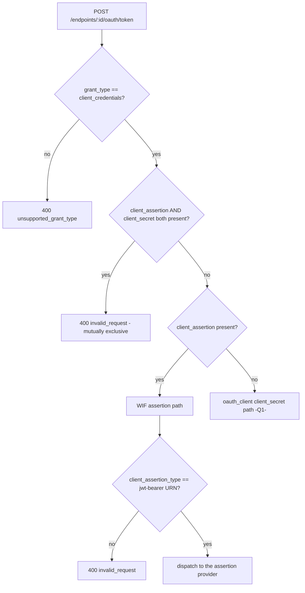

# Token-Endpoint Form Intake + Self-Describing Routing Cascade (A3)

> Step **A3** of the authentication build ([AUTHENTICATION_ARCHITECTURE.md section 13](AUTHENTICATION_ARCHITECTURE.md#13-step-by-step-execution-plan--estimates--dependencies), tracked in [EXECUTION_LEDGER.md](EXECUTION_LEDGER.md)). Detail: [WIF section 13.4 (Q6.1)](WIF_JWT_BEARER_ASSERTION_FOR_SCIM.md#134-q61---form-urlencoded-assertion-intake). Makes the per-endpoint token endpoint accept form-urlencoded bodies and self-route by request shape, with the three-outcome acceptor contract. This is the seam Q6 plugs the WIF validator into.

## What changed

The per-endpoint token endpoint (`POST /scim/endpoints/:id/oauth/token`, from Q1) previously only handled `client_id` + `client_secret`. A3 makes it:

1. accept `application/x-www-form-urlencoded` bodies (RFC 6749 section 3.2), and
2. **self-describe** the credential by request shape (no prior `client_id -> provider` binding), and
3. honor the **three-outcome acceptor** contract.

## 1. Form-urlencoded intake

An explicit `express.urlencoded({ extended: true })` parser is registered in [main.ts](../../api/src/main.ts) (and mirrored in the E2E [app.helper.ts](../../api/test/e2e/helpers/app.helper.ts)), so the token-endpoint contract does not depend on the framework default parser. The SCIM content-type middleware ([scim-content-type-validation.middleware.ts](../../api/src/modules/scim/middleware/scim-content-type-validation.middleware.ts)) exempts `*/oauth/token` from the `application/scim+json` rule - it is an OAuth endpoint, not a SCIM resource endpoint.

## 2. Self-describing routing cascade

[endpoint-oauth.controller.ts](../../api/src/modules/scim/controllers/endpoint-oauth.controller.ts) routes by request shape:

- `client_assertion` present -> the **WIF assertion path** (NOT the secret path).
- `client_assertion` AND `client_secret` together -> `invalid_request` (ambiguous, RFC 6749).
- `client_assertion_type` must be the `urn:ietf:params:oauth:client-assertion-type:jwt-bearer` URN (RFC 7523).

## 3. Three-outcome acceptor contract

The WIF assertion path consults an injected `IAssertionTokenProvider` ([assertion-token-provider.ts](../../api/src/modules/scim/controllers/assertion-token-provider.ts)) and maps its three outcomes (architecture section 2.2):

| Provider result | Meaning | Outcome |
|---|---|---|
| returns `{ token }` | accept: assertion is mine + valid | mint + return the token |
| returns `null` | not-mine-continue: no WIF trust configured | `invalid_client` (no other route here) |
| throws | mine-but-invalid-stop: assertion is for me but failed | `invalid_client` (never silently fall through) |
| no provider wired | A3 default until Q6 binds the validator | `invalid_client` |

The provider is bound (`ASSERTION_TOKEN_PROVIDER` DI token) by **Q6**; until then any `client_assertion` is correctly routed to the WIF path and rejected `invalid_client` (proving the routing works without the validator).

## Test coverage

| Layer | Test | Covers |
|---|---|---|
| Unit | [endpoint-oauth.controller.spec.ts](../../api/src/modules/scim/controllers/endpoint-oauth.controller.spec.ts) | dispatch to provider not secret-path; both-present -> invalid_request; wrong assertion_type -> invalid_request; no-provider -> invalid_client; provider-throws -> invalid_client; provider-null -> invalid_client; secret path still works |
| E2E | [endpoint-oauth-client.e2e-spec.ts](../../api/test/e2e/endpoint-oauth-client.e2e-spec.ts) "A3" | form-urlencoded request; both-present -> invalid_request; wrong type -> invalid_request; assertion routed to WIF path (invalid_client) |
| Live | `scripts/live-test.ps1` section **9z-AS** | form intake + cascade across all 3 form factors |

> **Error format note.** The per-endpoint token endpoint currently rides the SCIM exception filter, which wraps the RFC 6749 5.2 `error` into the SCIM envelope `detail`. A future pass may emit the raw OAuth top-level `error`/`error_description` on the token endpoint; A3's tests assert the wrapped `detail` value to match current behavior.
