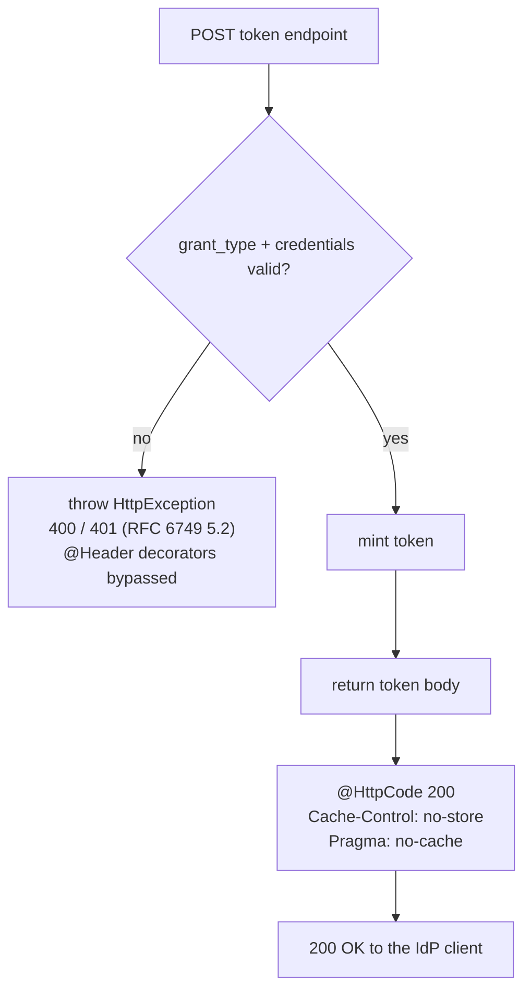

# W0.2 - Token endpoint returns HTTP 200 + no-store

> **What this is.** The feature doc for delivery-plan item **W0.2** ([AUTH_CONSOLIDATED_DELIVERY_PLAN.md](AUTH_CONSOLIDATED_DELIVERY_PLAN.md) Wave 0). It moves every SCIMServer token-mint **success** response from HTTP 201 to the RFC 6749 section 5.1-mandated **200** and adds the two mandatory cache headers `Cache-Control: no-store` + `Pragma: no-cache`. It also carries the IdP-behavior analysis that justified doing it, the options considered, and the measured test coverage.

## 1. Summary

| | Before | After (W0.2) |
|---|---|---|
| Global `POST /scim/oauth/token` success | 201, no cache headers | **200**, `Cache-Control: no-store`, `Pragma: no-cache` |
| Per-endpoint `POST /scim/endpoints/{id}/oauth/token` success (client_secret) | 201, no cache headers | **200** + no-store + no-cache |
| Per-endpoint token success (WIF `client_assertion`, RFC 7523) | 201, no cache headers | **200** + no-store + no-cache |
| Token **error** responses (bad grant, bad client) | 400 / 401 | **unchanged** 400 / 401 (RFC 6749 section 5.2) |

The change is a conformance + hardening fix, not a fix for a confirmed outage: 201 was almost certainly working with real IdPs because standard OAuth clients accept any 2xx. See the analysis below.

## 2. RFC basis

- **RFC 6749 section 5.1** (successful response): the token response MUST be `200 OK`, `application/json`, and MUST carry `Cache-Control: no-store` and `Pragma: no-cache` because it contains a bearer credential that must never be cached. See [RFC_6749_EXPLAINED.md](rfcs/RFC_6749_EXPLAINED.md) section 5.
- **RFC 6749 section 5.2** (error response): 400, or 401 for `invalid_client`. SCIMServer already emits those explicitly, so they are unaffected.
- **RFC 8693 section 2.2.1** (the future Wave 4 token-exchange path): same `200` + `no-store`, plus `issued_token_type`. The handler added in W4 must return 200 from day one.

So 201 was a literal (if minor) violation of section 5.1, and the absent `no-store` was a second, independent section 5.1 violation.

## 3. Analysis - how IdPs actually handle the token response

### 3.1 The token endpoint is only exercised on some auth models

Microsoft Entra offers three ISV-side auth models for SCIM provisioning ([CONNECTION_INFO_AND_ENTRA_SETUP.md](CONNECTION_INFO_AND_ENTRA_SETUP.md)):

1. **Long-lived "Secret Token"** (a static bearer pasted into the portal). Entra **never** calls `/oauth/token`; 200-vs-201 is **moot** for these tenants. This is still the most common real-world Entra SCIM setup.
2. **OAuth 2.0 client-credentials grant** (Token Endpoint + Client ID + Secret in the portal). Entra's provisioning service **does** POST to the ISV token endpoint and parse the JSON. This is the path W0.2 affects, and the one gallery apps are now required to support.
3. **SyncFabric WIF / token-exchange** (the newer engine). Same shared token URL, RFC 7523 assertion or RFC 8693 exchange. Also affected.

### 3.2 What Entra requires - documented vs observed

- Microsoft's SCIM provisioning tutorial is explicit about status codes for **SCIM resource** operations (POST `/Users` = 201, GET = 200, DELETE = 204) but says **nothing** prescribing a status code for the ISV **token endpoint**. There is no published "must be exactly 200" requirement. Source: [Use SCIM to provision users and groups](https://learn.microsoft.com/en-us/entra/identity/app-provisioning/use-scim-to-provision-users-and-groups).
- Microsoft's own authorization server returns `200` with `{ "token_type": "Bearer", "expires_in": ..., "access_token": ... }`. Aligning to 200 removes an untested divergence from the exact shape the client is built against. Source: [OAuth 2.0 client credentials flow](https://learn.microsoft.com/en-us/entra/identity-platform/v2-oauth2-client-creds-grant-flow).
- The provisioning service is a closed-source .NET OAuth client. The overwhelmingly common .NET pattern (`IsSuccessStatusCode` / `EnsureSuccessStatusCode`) accepts the whole **200-299** range and then deserializes the body. There is **no public evidence Entra rejects a 201** on a token endpoint, and none in SCIMServer's own logs.
- SCIMServer's in-repo SyncFabric-grounded guide ([SCIMSERVER_SYNCFABRIC_WIF_ARCHITECTURE_AND_IMPLEMENTATION_GUIDE (1).md](SCIMSERVER_SYNCFABRIC_WIF_ARCHITECTURE_AND_IMPLEMENTATION_GUIDE%20(1).md) section 10) classifies the 201 as a **"Client interoperability"** risk and the missing cache headers as a **"Token disclosure"** risk - correctness/hardening gaps, not a reproduced break.

### 3.3 Other IdPs

Okta, Ping, SailPoint, OneLogin, and Workday all act as OAuth clients on the client-credentials path, are built and tested against their own `200` token responses, do not publicly mandate rejecting 201, and follow general 2xx tolerance. Same conclusion as Entra.

### 3.4 Where 201 realistically could bite (the downside of doing nothing)

- A **strict RFC-validating client** or an **OAuth / gallery conformance test suite** that asserts `status == 200` (gallery onboarding runs a validator; a customer security review may run one too).
- A misbehaving **intermediary / proxy / WAF** that treats 201 oddly, or that caches a POST response because `no-store` is absent (low probability - RFC 7234 makes an un-freshness-marked POST non-cacheable by default, and Azure Container Apps ingress does not cache POST - but `no-store` is the belt-and-suspenders the RFC asks for).
- The failure, if it ever happens, surfaces at the **worst moment**: a new customer's first "Test Connection," not in steady state.

## 4. Options considered

| Option | What | Verdict |
|---|---|---|
| A | 200 + no-store + Pragma on "the token POST", flip E2E | Good but under-scoped (misses WIF + global + future 8693) |
| B | Do nothing (keep 201) | Rejected - leaves two section 5.1 violations; latent interop risk |
| C | 200 only, skip cache headers | Rejected - still not section 5.1-conformant for no saving |
| **D (chosen)** | Option A on **all** token success paths **+ real-wire measurement** (status + header assertion in E2E and live-test) | **Chosen** - full conformance, proven not assumed (repo R10: "presence is not correctness / measure the outcome") |

## 5. Implementation

Both handlers set the success status + headers via static NestJS decorators. Because the values are static and apply only to the returned (success) path, a thrown `HttpException` keeps its own 400/401 status and bypasses the `@Header` decorators - exactly the desired behavior for error responses.

- Global: [oauth.controller.ts](../../api/src/oauth/oauth.controller.ts) `getToken` - `@HttpCode(200)` + `@Header('Cache-Control', 'no-store')` + `@Header('Pragma', 'no-cache')`.
- Per-endpoint (covers **both** the `client_secret` and the `client_assertion`/WIF sub-routes, which return through the one handler): [endpoint-oauth.controller.ts](../../api/src/modules/scim/controllers/endpoint-oauth.controller.ts) `getToken` - same three decorators.

### 5.1 Success response on the wire

```http
POST /scim/oauth/token HTTP/1.1
Host: localhost:8080
Content-Type: application/x-www-form-urlencoded

grant_type=client_credentials&client_id=scimserver-client&client_secret=changeme-oauth
```

```http
HTTP/1.1 200 OK
Content-Type: application/json; charset=utf-8
Cache-Control: no-store
Pragma: no-cache

{
  "access_token": "<RS256 JWT>",
  "token_type": "Bearer",
  "expires_in": 3600,
  "scope": "scim.read scim.write scim.manage"
}
```

### 5.2 Decision flow



## 6. Test coverage

| Layer | Where | What it locks |
|---|---|---|
| E2E - global | [authentication.e2e-spec.ts](../../api/test/e2e/authentication.e2e-spec.ts) | success is 200 **and** carries `Cache-Control: no-store` + `Pragma: no-cache` |
| E2E - global (adjacent) | [api-response-contracts-2.e2e-spec.ts](../../api/test/e2e/api-response-contracts-2.e2e-spec.ts), [oauth-discovery.e2e-spec.ts](../../api/test/e2e/oauth-discovery.e2e-spec.ts), [oauth-jwks.e2e-spec.ts](../../api/test/e2e/oauth-jwks.e2e-spec.ts), [helpers/auth.helper.ts](../../api/test/e2e/helpers/auth.helper.ts) | every global token mint now asserts 200 |
| E2E - per-endpoint secret | [endpoint-oauth-client.e2e-spec.ts](../../api/test/e2e/endpoint-oauth-client.e2e-spec.ts) | mint is 200 + header assertion on the representative test; form + Basic variants 200 |
| E2E - per-endpoint WIF | [wif-assertion.e2e-spec.ts](../../api/test/e2e/wif-assertion.e2e-spec.ts) | accept mint is 200 + header assertion; multi-trust / alias / role variants 200; rejects stay 401 |
| Live (on the wire) | [live-test.ps1](../../scripts/live-test.ps1) section **9z-BU** | `Invoke-WebRequest` asserts real `StatusCode == 200` + `no-store` + `no-cache` on the global and per-endpoint routes, and that a bad grant_type still returns **400** (error path unaffected) |

Unit controller specs call the handler methods directly and assert the returned object, so they are unaffected by the HTTP decorators; the measured E2E + live assertions are the lock (repo rules R1 / R10 - measure the outcome, not the decorator metadata).

## 7. Notes

- Adjacent observation (not changed by W0.2): the success bodies return `token_type: "Bearer"` (capital B, matching Microsoft), while [COMPLETE_API_REFERENCE.md](../COMPLETE_API_REFERENCE.md) shows lowercase `"bearer"` in one example - a harmless doc inconsistency (RFC 6749 section 7.1 treats the type as case-insensitive) to reconcile separately.
- The delivery-plan risk note was corrected from "Entra tolerates 200" to "201 is currently tolerated but non-conformant; 200 is the tested contract."
