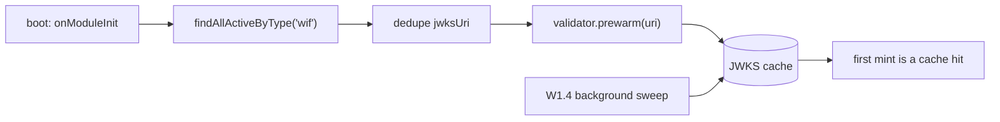

# W1.2 - startup JWKS prewarm

**Status:** DELIVERED - api v0.55.10. **Last verified:** 2026-08-19. **This closes Wave 1.**

W1.4 made the JWKS cache stay warm once it held an entry. Nothing put the first entry there, so the
**first WIF token mint after every deploy** paid a synchronous outbound fetch to the IdP on a real
user's request. This closes that window.

## 1. Where it sits

| Item | Owns |
|---|---|
| **W1.1** | the `jose` module is loaded before first use |
| **W1.3** | the redirect hop is paid once, not per cold fetch |
| **W1.4** | the cache stays warm once populated |
| **W1.2** (this) | **the cache is populated before the first request** |
| W1.5 | the fetch is bounded when it does happen |

## 2. Design decisions

**A separate service, not more work in the validator.** `ExternalJwksValidatorService` has no
business knowing that trusts are stored as endpoint credentials. The validator warms *a URI*; the
prewarm service decides *which URIs exist*. That split is why the validator did not need a new
dependency on the credential repository.

**`prewarm()` reuses `fetchJwks`.** It is a thin wrapper, not a parallel fetch path, so it inherits
single-flight coalescing and the atomic cache swap. A prewarm racing a real mint at startup cannot
produce two outbound fetches or let a reader observe a half-updated key set.

**Boot cannot be broken by it.** A database that is not ready and an IdP that is unreachable are both
logged and skipped. `Promise.allSettled` is used rather than `Promise.all` **deliberately**:
`prewarm` already promises never to reject, but a boot path must not depend on a collaborator keeping
that promise. The unit test `W1.2-T5` pins that by making the mock reject.

## 3. The failure mode this feature was most likely to have

The service takes the credential repository as an `@Optional() @Inject(...)` token. If `OAuthModule`
did not provide it, the token would resolve to `undefined`, the prewarm would return `0` immediately,
and **the feature would ship completely inert with every unit test still green** - because the unit
tests supply the repository themselves.

That is the same class of defect as N8 (methods advertised but never enforced) and the standing
optional-DI-token rule in the RCA ledger. Two things close it:

1. `OAuthModule` now imports `RepositoryModule.register()`, so the token genuinely resolves.
2. **The completion line is logged unconditionally, even when nothing was warmed.** A boot-time
   action leaves no other trace, so without an unconditional line there is no way to distinguish
   "ran and found no trusts" from "never ran". E2E `W1.2-E1` asserts that line exists, which makes it
   the wiring test for the optional token rather than a mere log assertion.

## 4. Coverage

| Layer | Where | Count |
|---|---|---|
| Unit | [jwks-prewarm.service.spec.ts](../../api/src/oauth/jwks-prewarm.service.spec.ts) | 6 |
| Unit | [inmemory-endpoint-credential.repository.spec.ts](../../api/src/infrastructure/repositories/inmemory/inmemory-endpoint-credential.repository.spec.ts) - first spec for this repository | 5 |
| E2E | [jwks-prewarm.e2e-spec.ts](../../api/test/e2e/jwks-prewarm.e2e-spec.ts) | 2 |

**Cross-backend parity.** `findAllActiveByType` is the first cross-endpoint query on
`IEndpointCredentialRepository`. The **Prisma** implementation is exercised on *every E2E boot*,
because the prewarm calls it during `onModuleInit` - a broken query would fail 88 suites at startup,
not one. The **in-memory** implementation has its own unit spec covering the type, active and expiry
filters plus the cross-endpoint case.

**No live-test section, deliberately.** The boot log line rolls out of the ring buffer on a
long-running node, so a live assertion would be a flake generator rather than a gate. This follows
the precedent set by W1.6, whose cold-start latency check was placed in
[wif-e2e-proof.ps1](../../scripts/wif-e2e-proof.ps1) rather than `live-test.ps1` for the same reason:
*a gate that depends on ambient state is not a gate.* The E2E proves the wiring on a fresh boot,
which is the condition that actually matters.

## 5. Design and architecture gate

| Check | Finding | Disposition |
|---|---|---|
| SRP | The validator warms a URI; the new service decides which URIs exist | **Applied** |
| Coupling | The validator gained no dependency on the credential repository | **Applied** |
| Pattern fit | `prewarm` mirrors `refreshCachedJwksNow`, including its never-reject discipline | **Applied** |
| Open/Closed | A future non-WIF trust type is a new argument to `findAllActiveByType`, not a new code path | **Applied** |
| YAGNI | Rejected a configurable prewarm concurrency limit and a retry schedule. The set is one URI per distinct IdP - single digits in every measured estate - and W1.5 already bounds each fetch | **Applied** |
| Disposition | **Applied** in this commit chain | **Applied** |

**R7 self-improvement.** The unconditional completion log is the transferable part. Three items in a
row have now turned on the same question - *can you tell, from outside, that this actually ran?* A8's
audit event was emitted but redacted into uselessness, N8 advertises methods nothing enforces, and
this feature would have been silently inert had one module import been missing. **Standing check for
any boot-time or fire-and-forget work: emit one unconditional observation of the fact that it ran,
including the no-op case, and assert that observation in a test that would fail if the wiring were
absent.** Coverage of the logic is not coverage of the wiring.
