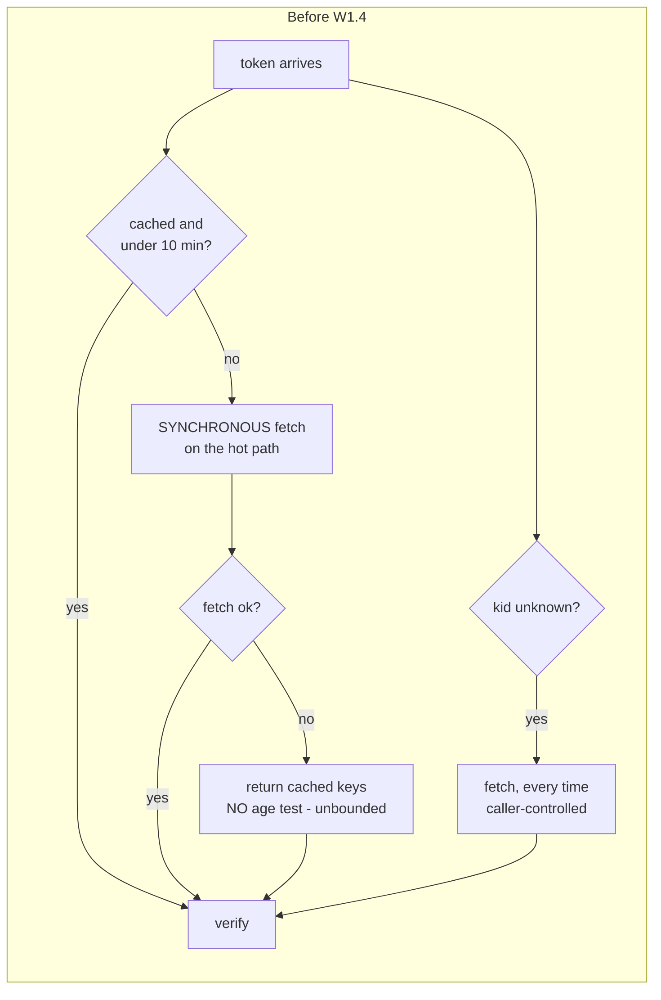
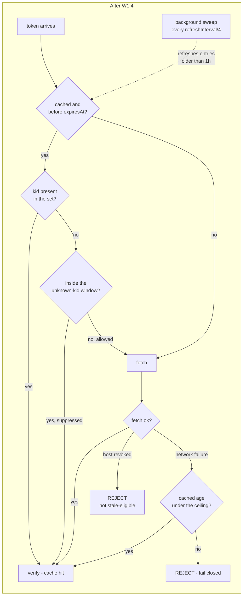
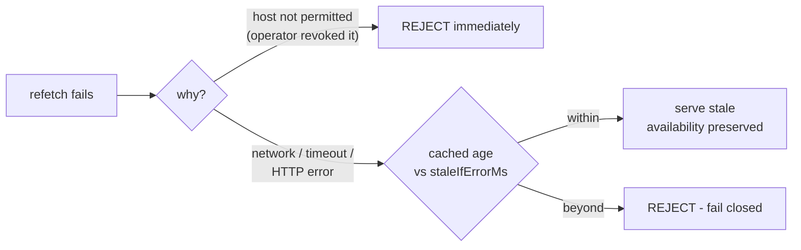

# W1.4 - JWKS cache cadence: 24h TTL, background refresh, rate-limited unknown-kid, hard stale ceiling

> **Status:** Delivered - **Version:** 0.55.5 - **Last verified:** 2026-08-05 - **Item:** W1.4 (`X11 A` + guide 25.2 + `X15-F1`)

## 1. What this item is

Before W1.4 the external-JWKS cache was a 10-minute time-to-live keyed by `jwksUri`, refreshed lazily on the hot path, with an unbounded fail-to-stale fallback and no rate limit on the unknown-`kid` refetch. Four consequences followed from that shape:

1. **Every TTL expiry landed on a user.** The first token mint after 10 minutes paid a synchronous outbound fetch to the IdP. There was no steady state in which the hot path was reliably a cache hit.
2. **The stale fallback had no ceiling.** When a refetch failed, the cache was returned with **no age test at all** - so a rotated-out or revoked key stayed acceptable for exactly as long as the IdP stayed unreachable. Unbounded.
3. **An unknown `kid` forced an outbound fetch, every time.** That path is fully caller-controlled: anyone who can present a token with an unrecognised `kid` could drive our outbound request rate to the IdP at no cost to themselves.
4. **`Cache-Control` was ignored**, so an IdP asking for a shorter cache lifetime was overruled.

W1.4 replaces the cadence with [Microsoft's own published algorithm for its signing keys](https://learn.microsoft.com/en-us/entra/identity-platform/signing-key-rollover): **24-hour TTL, ~1-hour background refresh, prefetch, and a rate-limited synchronous refresh on an unknown `kid`** - plus the two safety properties the raise makes mandatory.

### The hard constraint, and why it exists

The delivery plan attaches an unusual precondition to this item:

> **Hard constraint:** the 10-min -> 24 h TTL raise MUST ship in the same commit as the background refresher, the rate-limited unknown-`kid` path, and an overlap-window rotation test - raising the TTL alone multiplies the key-rotation blast radius by 144x.

$$\frac{24\ \text{h}}{10\ \text{min}} = \frac{1440\ \text{min}}{10\ \text{min}} = 144$$

A longer TTL is only safe when something else guarantees freshness. Shipping the TTL raise on its own would take the worst-case window during which this server trusts a key the IdP has already retired from 10 minutes to a full day. Every other part of this item exists to pay for the raise.

## 2. Today vs target





The single most important structural difference: the background sweep (dotted) moves the fetch **off** the path a user is waiting on. In steady state `A2` is always a hit.

## 3. Configuration

Three new knobs, each settable at the server level (env) and per endpoint (endpoint setting), following the same pattern as the W1.5 safety envelope.

| Setting | Env | Default | Bounds | What it controls |
|---|---|---|---|---|
| `JwksCacheMaxAgeMs` | `JWKS_CACHE_MAX_AGE_MS` | **86,400,000** (24 h, **raised** from 600,000) | 0 - 86,400,000 | How long a cached key set stays fresh |
| `JwksRefreshIntervalMs` | `JWKS_REFRESH_INTERVAL_MS` | 3,600,000 (1 h) | 60,000 - 86,400,000 | Age at which the background sweep refreshes an entry |
| `JwksUnknownKidMinIntervalMs` | `JWKS_UNKNOWN_KID_MIN_INTERVAL_MS` | 300,000 (5 min) | 0 - 3,600,000 | Floor between synchronous refetches caused by an unknown `kid` |
| `JwksStaleIfErrorMs` | `JWKS_STALE_IF_ERROR_MS` | 172,800,000 (48 h) | 0 - 604,800,000 | Hard ceiling on the age of cached keys served after a failed refetch |

Two of the bounds are deliberately permissive at zero:

- `JwksUnknownKidMinIntervalMs: 0` disables the rate limit, restoring pre-W1.4 behaviour. Occasionally wanted in a lab where key rotation is being exercised deliberately.
- `JwksStaleIfErrorMs: 0` disables fail-to-stale entirely. This is the **strictest** posture: any failed refetch fails closed, trading availability for freshness.

`JwksRefreshIntervalMs` has a floor of 60 s so a misconfiguration cannot turn the background sweep into a hot loop against the IdP.

### Why 48 hours for the stale ceiling

The ceiling is the 24 h TTL plus another day of outage tolerance. It has to exceed the TTL - a ceiling below the TTL would make the fallback unreachable and turn every IdP blip into an auth outage. A full extra day means a weekend-long IdP incident does not become an authentication incident, while a key the IdP retired does not stay acceptable indefinitely.

## 4. Behaviour details

### 4.1 Cache-Control is honored downward only

$$\text{expiresAt} = \text{now} + \min(\text{JwksCacheMaxAgeMs},\ \text{Cache-Control max-age})$$

An IdP may ask us to cache for **less** than our configured TTL, and we comply. It may not ask us to cache for **more**: an IdP must not be able to pin keys in our cache beyond the lifetime we chose to trust them for. `no-store` and `no-cache` collapse to 0, so the entry is re-validated on next use.

### 4.2 An allowlist rejection is not stale-eligible

This resolves the open question recorded in [EXECUTION_ISSUES_AND_RCA.md](EXECUTION_ISSUES_AND_RCA.md) section 10.2.

Fail-to-stale exists so a real IdP outage does not become an auth outage. That reasoning does **not** transfer to a host the operator has deliberately revoked from `JWKS_HOST_ALLOWLIST` - serving cached keys there turns a security action into a no-op for the whole cache lifetime, which the TTL raise would have widened by 144x.

The implementation distinguishes the two by error type. `JwksHostNotPermittedError` propagates immediately and is never stale-eligible; a network failure still is. Nothing is purged, so this costs no availability for real outages - it only closes the revocation window.



### 4.3 The unknown-kid rate limit still allows prompt rotation

The limit is per `jwksUri` and starts at the **allowed** fetch, not at the suppressed one. A genuine rotation is therefore picked up on the first unknown-`kid` request, and at most one fetch per 5 minutes thereafter. Combined with the 1-hour background refresh, a rotated key is normally already present before any token bearing it arrives.

### 4.4 The cache entry

```ts
interface JwksCacheEntry {
  keys: unknown;        // raw key set, handed to jose.createLocalJWKSet
  fetchedAt: number;    // for the refresh sweep and the stale ceiling
  kids: Set<string>;    // kid-addressable index, built once per fetch
  expiresAt: number;    // TTL folded with Cache-Control
}
```

`kids` makes the unknown-`kid` check a set lookup instead of a scan of the key array on every verify. The entry is replaced **wholesale** on refresh, so a concurrent reader sees either the entire old set or the entire new one - never a half-updated one.

## 5. Test coverage

| Layer | File | What it locks |
|---|---|---|
| Unit | [external-jwks-cache.w14.spec.ts](../../api/src/oauth/external-jwks-cache.w14.spec.ts) | 12 tests - defaults, overlap-window rotation, rate limit, stale ceiling, Cache-Control both directions, SSRF non-stale-eligibility, refresh sweep, timer lifecycle |
| Unit | [egress-policy.spec.ts](../../api/src/oauth/egress-policy.spec.ts) | env reads, clamping, merge for the three new fields |
| E2E | [config-flags.e2e-spec.ts](../../api/test/e2e/config-flags.e2e-spec.ts) | 8 tests - round-trip, 6 bounds rejections, unregistered-key control |
| Live | [live-test.ps1](../../scripts/live-test.ps1) section `9z-CE` | 14 assertions across local / Docker / Azure dev |

### The mandated overlap-window test

`W1.4-T3` is the test the delivery plan makes a precondition of the TTL raise. It walks a real rotation:

1. The IdP publishes only `kid-old`; a token signed with it verifies.
2. The IdP enters the overlap window and publishes **both** keys.
3. A token with `kid-new` is not in the cached set, so it triggers a refetch and verifies.
4. **A token with `kid-old` must still verify, from cache, with no further fetch.**

Step 4 is the assertion that matters. A cache that replaced rather than merged, or that tracked only the newest `kid`, passes steps 1-3 and fails step 4 - and would break every in-flight token issued before a rotation.

### Non-vacuous pairing

Two tests exist purely to stop their partners passing for the wrong reason:

- `W1.4-T10` asserts the refresh sweep **skips** entries younger than the interval. Without it, `T9` would pass against a sweep that refetched unconditionally.
- The live `9z-CE.T8/T9` controls assert that an **unregistered** settings key round-trips and has **no** bounds. Without them, `T1`-`T4` look like proof the feature shipped when they are only proof the settings store works (see [RCA I-30](EXECUTION_ISSUES_AND_RCA.md)).

### Measured negative control

Before deploying, the `9z-CE` assertions were run against the then-current dev build (0.55.3, no W1.4):

| Assertion | Result against a build WITHOUT W1.4 | Verdict |
|---|---|---|
| T1-T3 round-trip | **PASS** | not testing W1.4 - the settings store provides this |
| T5 bounds rejections | **FAIL** (0 of 6 rejected) | **load-bearing** |
| T7 24h ceiling accepted | **PASS** | regression guard only - the ceiling predates W1.4 |
| T8 unregistered round-trip | **PASS** | control, as designed |

T7 is labelled in the suite as a regression guard rather than left to look like feature evidence. That labelling is the whole point of running the control.

## 6. What W1.4 deliberately did NOT do

- **It does not prefetch at startup.** That is W1.2 (`Startup JWKS + DB pool pre-warm`), which depends on this cache and enumerates registered trusts at boot. W1.4 provides the cache and the refresh machinery; W1.2 fills it early.
- **It does not purge cached keys on allowlist revocation.** Section 4.2 explains why the narrower fix - making the SSRF rejection non-stale-eligible - closes the same window without the availability cost of a purge.
- **It does not make the cache per-`kid` in the storage sense.** Keys are indexed by `kid` for lookup, but a key set is still stored and replaced as a unit, because `jose.createLocalJWKSet` consumes a whole set and because atomic replacement is what makes rotation safe.
- **It does not add a UI surface.** The three knobs are endpoint settings and appear in the generic settings editor like every other numeric flag.

## 7. Operational notes

- The background sweep runs at `max(60s, refreshIntervalMs / 4)`, so an entry is refreshed promptly after crossing the threshold rather than up to a full interval later. The sweep only fetches entries that are actually due.
- The timer is `unref()`ed - it never holds the event loop open, so it cannot delay a shutdown or keep a test worker alive.
- A failed background refresh is logged at `warn` and **never rejects**. An unhandled rejection from a timer callback can take a process down; a failed refresh simply leaves the existing valid entry to be retried next sweep.
- The sweep uses the **server-level** policy. Per-endpoint overrides still apply on the verify path; they do not each get their own timer.

## 8. References

- [Microsoft - Signing key rollover in the Microsoft identity platform](https://learn.microsoft.com/en-us/entra/identity-platform/signing-key-rollover)
- [RFC 9111 - HTTP Caching](https://www.rfc-editor.org/rfc/rfc9111) (`Cache-Control: max-age`)
- [RFC 7517 - JSON Web Key](https://www.rfc-editor.org/rfc/rfc7517)
- [AUTH_CONSOLIDATED_DELIVERY_PLAN.md](AUTH_CONSOLIDATED_DELIVERY_PLAN.md) - W1.4 scope and the hard constraint
- [EXTERNAL_JWKS_VALIDATOR.md](EXTERNAL_JWKS_VALIDATOR.md) - the Q2 validator this extends
- [W1_5_JWKS_SAFETY_ENVELOPE.md](W1_5_JWKS_SAFETY_ENVELOPE.md) - the deadline and size caps W1.4 builds on
- [EXECUTION_ISSUES_AND_RCA.md](EXECUTION_ISSUES_AND_RCA.md) - section 10.2 (resolved here), I-30 (the control technique)
