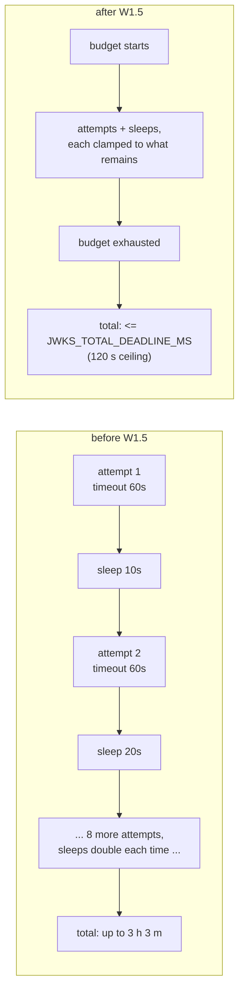
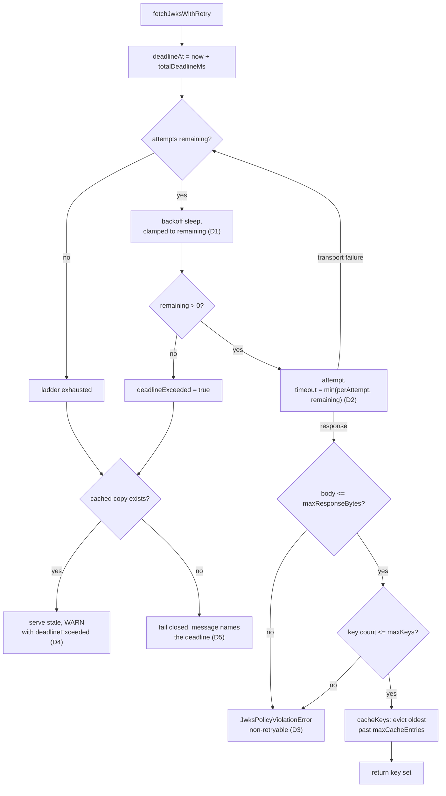

# W1.5 - The JWKS safety envelope: a total deadline and response caps

> **What this is.** The feature doc for delivery-plan item **W1.5** ([AUTH_CONSOLIDATED_DELIVERY_PLAN.md](AUTH_CONSOLIDATED_DELIVERY_PLAN.md) Wave 1). It bounds how long a WIF token mint can spend fetching a JWKS, and bounds what a single JWKS response is allowed to cost. It also carries the derivation of the worst case it removes, the design decisions, the measured test coverage, and the issues hit while building it.
>
> **Shipped:** api v0.55.3, 2026-08-04. **Runtime:** [external-jwks-validator.service.ts](../../api/src/oauth/external-jwks-validator.service.ts), [egress-policy.ts](../../api/src/oauth/egress-policy.ts).

## 1. Summary

| | Before W1.5 | After W1.5 |
|---|---|---|
| Bound on a whole JWKS fetch | **none** - only a per-attempt timeout | `JWKS_TOTAL_DEADLINE_MS`, default **10 s**, clamp ceiling 120 s |
| Backoff sleep | unbounded by anything but the retry count | **clamped to the remaining budget** |
| Per-attempt timeout | fixed `timeoutMs` | `min(timeoutMs, remaining budget)` |
| Response body size | **unbounded** | `JWKS_MAX_RESPONSE_BYTES`, default 1 MiB |
| Key-set size | **unbounded** | `JWKS_MAX_KEYS`, default 100 |
| JWKS cache cardinality | **unbounded** `Map` keyed by a caller-influenced URI | `JWKS_MAX_CACHE_ENTRIES`, default 50, oldest evicted |
| Cap breach behaviour | n/a | non-retryable, reports its own cause |
| Fail-to-stale | on retry exhaustion | unchanged, **also** on deadline expiry |

W1.5 is the **safety envelope** that W1.4 (the Entra cache redesign) will run inside. The plan deliberately sequences it first: build the bounds before making the riskier caching change.

## 2. The problem - a per-attempt timeout is not a bound

`JwksFetchTimeoutMs` bounds **one attempt**. Nothing bounded the operation. The retry ladder is exponential:

```text
sleep(attempt) = retryBackoffMs * 2^(attempt-1) + jitter[0 .. retryBackoffMs)
total tries    = retries + 1, each bounded by timeoutMs
```

Derived from that formula (see [Section 9](#9-reproducing-the-worst-case-derivation) to reproduce):

| Configuration | Sleep | Max jitter | Fetch | **Worst case** |
|---|---:|---:|---:|---:|
| Shipped defaults (`retries: 2`, 200 ms, 5 s) | 600 ms | 400 ms | 15,000 ms | **16.0 s** |
| The ladder cited in the plan (`retries: 5`) | 6,200 ms | 1,000 ms | 30,000 ms | **37.2 s** |
| **Every knob at its documented maximum** (`retries: 10`, 10 s backoff, 60 s timeout) | 10,230,000 ms | 100,000 ms | 660,000 ms | **10,990,000 ms = 3 h 3 m** |

That last row is the finding that justifies the item. Every value in it is **inside the documented, validator-accepted bounds** - an operator could configure a three-hour token mint without violating a single constraint, and the only symptom would be provisioning appearing to hang.



## 3. What shipped

### 3.1 Four knobs, configurable from birth

The plan required these ship configurable rather than as hardcoded literals to be retrofitted. Each is a server env default with a per-endpoint override that wins and is clamped to the same bounds - the precedence already used by the four pre-existing egress knobs:

```text
effective = endpoint setting  ??  server env  ??  hardcoded default
```

| Server env | Endpoint override | Default | Bounds | Bounds what |
|---|---|---:|---|---|
| `JWKS_TOTAL_DEADLINE_MS` | `JwksTotalDeadlineMs` | 10,000 | 100 - 120,000 | the whole fetch: attempts + sleeps + redirect hops |
| `JWKS_MAX_RESPONSE_BYTES` | `JwksMaxResponseBytes` | 1,048,576 | 1,024 - 10,485,760 | response body size, checked **before parsing** |
| `JWKS_MAX_KEYS` | `JwksMaxKeys` | 100 | 1 - 1,000 | keys in a key set |
| `JWKS_MAX_CACHE_ENTRIES` | `JwksMaxCacheEntries` | 50 | 1 - 1,000 | retained key sets; oldest evicted |

### 3.2 A fourth cap the plan did not ask for

The plan specified three caps. A fourth was added because reading the code surfaced an unbounded structure the plan had not named: `this.cache` is a `Map` keyed by `jwksUri`, and a `jwksUri` comes from endpoint trust configuration. A large - or hostile - trust set therefore grew process memory without limit, and nothing evicted. `JWKS_MAX_CACHE_ENTRIES` closes it by evicting the oldest entry once the cap is reached.

### 3.3 Why `maxKeys` defaults to 100, not 10

A tight cap looks safer and is wrong here. Microsoft states a signing-key cache should hold **10 to 1,000 keys across issuers** ([signing key rollover](https://learn.microsoft.com/en-us/entra/identity-platform/signing-key-rollover)), so a cap of 10 would reject a legitimate multi-issuer key set and manufacture an outage. The default is 100 and the ceiling is 1,000, which the live test pins explicitly so a future "tightening" cannot quietly break real IdPs.

## 4. Design decisions

| # | Decision | Why | Rejected alternative |
|---|---|---|---|
| D1 | The **backoff sleep is clamped** to the remaining budget | An unbounded sleep is the single largest contributor to the worst case - 10,230,000 of the 10,990,000 ms above is sleeping, not fetching | Checking the deadline only *between* attempts, which would still let one sleep overshoot it by hours |
| D2 | The per-attempt timeout becomes `min(timeoutMs, remaining)` | Otherwise a final attempt started just inside the budget could run 60 s past it | Leaving the attempt timeout alone and accepting overshoot |
| D3 | A cap breach is **non-retryable** (`JwksPolicyViolationError`) | An oversized body is deterministic: the same IdP returns it on every attempt. Retrying burns the whole deadline and then reports the generic "JWKS unavailable", hiding the actual cause | Treating a cap breach like a transient failure - which is what the first implementation did, and it is how the `maxKeys` test first failed |
| D4 | **Fail-to-stale still applies** when the budget expires | Exceeding the deadline is an availability event, not a trust event. Refusing to serve a cached key because the IdP is slow converts a slow IdP into an outage | Failing closed on deadline expiry |
| D5 | The deadline error **names the deadline** | "JWKS unavailable; failing closed" gives an operator nothing to act on; "exceeded the 10000 ms total deadline" points straight at the knob | Reusing the generic message |

## 5. The fetch path



## 6. Implementation

| File | Change |
|---|---|
| [egress-policy.ts](../../api/src/oauth/egress-policy.ts) | 4 fields on `EgressPolicy`; defaults in `EGRESS_POLICY_DEFAULTS`; bounds in `EGRESS_POLICY_BOUNDS`; env reads in `resolveServerEgressDefaults`; override merge in `mergeEgressPolicy` |
| [external-jwks-validator.service.ts](../../api/src/oauth/external-jwks-validator.service.ts) | `JwksPolicyViolationError`; deadline logic in `fetchJwksWithRetry`; new `cacheKeys` (cardinality + eviction); new `readKeySet` (byte + key caps); `fetchJwksOnce` accepts an attempt timeout |
| [endpoint-config.interface.ts](../../api/src/modules/endpoint/endpoint-config.interface.ts) | 4 flag keys, 4 registry entries with bounds + descriptions, 4 new reads in `resolveEndpointEgressOverrides` |

`readKeySet` prefers `res.text()` so the body can be **measured before it is parsed**, and falls back to `res.json()` when a response object has no `text()`. That fallback is deliberate: several existing unit-test doubles provide only `json()`, and the alternative was rewriting unrelated tests to satisfy a new internal detail.

## 7. Test coverage

| Layer | Where | What it pins |
|---|---|---|
| Unit (policy) | [egress-policy.spec.ts](../../api/src/oauth/egress-policy.spec.ts) | defaults for all 4 caps; the generous `maxKeys` default; env reads; clamping at both ends; non-numeric fallback; fractional truncation; endpoint-override precedence |
| Unit (behaviour) | [external-jwks-validator.service.spec.ts](../../api/src/oauth/external-jwks-validator.service.spec.ts) | the ladder is cut short by the deadline; the deadline is *named* in the error; oversized body rejected; in-range body accepted; too many keys rejected; **exactly `maxKeys` accepted** (off-by-one guard); cache evicts oldest and retains the newest |
| Live | `scripts/live-test.ps1` section **`9z-CD`** | all 4 caps round-trip via PATCH + GET; 6 bounds cases rejected with 400; a non-vacuous guard asserting all 6 cases actually ran; the documented 1,000-key maximum is accepted; **plus two controls (T8, T9)** proving that an unregistered key round-trips *and* has no bounds - which is why the bounds rejections, not the round-trips, are the assertions that discriminate the feature (see I-30) |

**Measured:** API unit **158 suites / 4,720**; API E2E **87 / 1,440 on both backends** (parity held); live **1,385 / 1,385**; ESLint **0 errors / 510 warnings**, exactly the master baseline.

## 8. Issues hit while building this

Each of these is also recorded in the standing ledger, [EXECUTION_ISSUES_AND_RCA.md](EXECUTION_ISSUES_AND_RCA.md) section **10A** (addendum II), as **I-25 through I-29** with the full symptom / root-cause / fix / why-it-works / prevention treatment and an escape-analysis table. This section is the narrative summary; the ledger is the canonical record.

| Ledger ID | Issue | Type | Severity |
|---|---|---|---|
| I-25 | A `maxKeys` test passed **before the cap existed** | T3 test-correctness | **High** |
| I-26 | The live suite ran against a **4-day-old binary** | T4 environment drift | **High** |
| I-27 | Lint ratchet assumed rather than measured | T3 | Low |
| I-28 | Two documentation gates blocked the push, correctly | T7 process | Low |
| I-29 | A fresh worktree could not be provisioned | T7 process | Low |
| I-30 | **4 of 12 live assertions could not fail** - an unregistered settings key round-trips unvalidated | T3 test-correctness | **High** |

All three High-severity entries are **false signals rather than product defects**, and none would have been visible in a summary-level reading. I-30 is the sharpest: `9z-CD` was authored, reviewed, run green locally **and** run green on dev before anyone asked what it would do if the feature were absent. Running the assertions against the previous build answered that in one command - four of them passed there too.

### 8.1 A test that passed before the feature existed (T3, High)

**Symptom.** On the RED run, "rejects a key set with more keys than `maxKeys`" **passed** - before any cap existed.

**Root cause.** The fixture reused one key three times: `{ keys: [k, k, k] }`. `jose.createLocalJWKSet` rejects a set with duplicate `kid`, and that rejection message matched the assertion's `/keys/i` pattern. The test was green for a reason entirely unrelated to the behaviour under test.

**Fix.** Three **distinct** keys (`kid-1`, `kid-2`, `kid-3`) so the set is valid and `kid-1` resolves, meaning only the cap can reject it; a tightened pattern (`/too many keys|maxKeys|key count/i`); and a companion test asserting a set of **exactly** `maxKeys` is accepted.

**Why it works.** The positive control and the negative control now differ by one key, so the assertion can only be satisfied by the cap.

**Prevention.** A loose `/keyword/i` assertion is a false-green generator whenever the code under test shares vocabulary with its dependencies. This is the same class as ledger entry I-05 (a loose `token` regex matching `issuedTokenTtlSec`). The standing rule already exists - it fired here because the RED run was actually inspected per test rather than by suite total.

### 8.2 A live suite that ran against a 4-day-old server (T4, High)

**Symptom.** The first full live run reported 7 failures in sections unrelated to W1.5.

**Root cause.** The server under test failed to start with `EADDRINUSE` - port 6000 was held by a **node process from 07/31 still serving 0.55.0**. The suite ran against that. The readiness probe *printed* `ready: 0.55.0` and proceeded; it never compared the served version to `package.json`.

**Fix.** The runner now reads the expected version from `api/package.json`, asserts the served version equals it, and **aborts** rather than run. Stale listeners are identified and terminated first.

**Why it works.** A suite that cannot confirm what it is testing produces a signal about nothing. Asserting identity converts a silent false signal into a loud refusal.

**Prevention.** Exactly the defect class fixed earlier in this branch's history for the deploy pipeline (Stage 4.6b asserts the reported version before trusting a live-test result). The lesson generalizes: **printing a value is not checking it.**

### 8.3 Lint ceiling measured, not assumed (T3, Low)

**Symptom.** Post-implementation lint reported 511 warnings against a remembered baseline of 504.

**Root cause.** Two independent things: the baseline had legitimately moved to 510 on master since that number was memorized, **and** this change genuinely added one (`res: any`).

**Fix.** Measured the baseline on clean master rather than trusting recall, then typed the parameter structurally instead of raising the ceiling. Final: 510, the baseline exactly.

**Prevention.** When a ratchet appears breached, measure the ratchet before assuming the change broke it. A remembered baseline is not a baseline.

### 8.4 Two documentation gates blocked the push, correctly (T7, Low)

**Symptom.** `git push` was refused twice after all code gates passed.

**Root cause.** Both were true findings. The version bump to 0.55.3 left 22 user-facing docs advertising 0.55.2 (F1 version coupling). Then the four new settings made three documented counts wrong (`INDEX.md` "28 settings / 4 numerics", the flags reference "4 numeric") and left the four settings undocumented in the operator guide (C3/C5).

**Fix.** `audit-doc-freshness.ps1 -Fix` stamped the version set; the counts were corrected to 32/8 and the four settings documented.

**Why this is worth recording.** These gates are the direct product of an earlier escape where 12 docs advertised a two-minor-old version. They caught a real drift the same day a feature landed, which is the behaviour they were built for.

### 8.5 An unusable worktree (T7, Low)

**Symptom.** A fresh `git worktree` for the feature could not run tests.

**Root cause.** `node_modules` is not shared between worktrees, and this machine cannot reach `registry.npmjs.org` (a machine-wide TLS block, already documented). So a new worktree cannot be provisioned at all.

**Fix.** Moved the branch into an already-provisioned worktree and removed the empty one.

**Prevention.** On this machine, create feature branches **inside an existing provisioned worktree**. A new worktree is only viable while the registry block persists if `node_modules` is copied.

## 9. Reproducing the worst-case derivation

```powershell
# sleep(attempt) = retryBackoffMs * 2^(attempt-1); total tries = retries + 1
$retries = 10; $backoffMs = 10000; $timeoutMs = 60000
$sleep = 0
for ($a = 1; $a -le $retries; $a++) { $sleep += $backoffMs * [math]::Pow(2, $a - 1) }
$total = $sleep + ($retries * $backoffMs) + (($retries + 1) * $timeoutMs)
"{0} ms = {1}" -f $total, (New-TimeSpan -Seconds ($total / 1000))
# 10990000 ms = 03:03:10
```

## 10. What W1.5 deliberately did NOT do

| Not done | Owner | Why not here |
|---|---|---|
| **A maximum stale age.** The fail-to-stale path still serves a cached key set of *any* age, so a revoked key stays acceptable for as long as the IdP is unreachable | **W1.4** | It is a *cache-lifetime* decision, inseparable from the TTL raise and the background refresher. Shipping a stale ceiling without the refresher would convert a slow IdP into an outage |
| Per-`kid` caching, 24 h TTL, 1 h background refresh, rate-limited unknown-`kid` refetch | **W1.4** | The whole point of sequencing W1.5 first was to build the envelope before the cache redesign runs inside it |
| A deadline spanning **trust selection** across multiple trusts | W3 trust-model work | This deadline covers one `jwksUri` fetch. Multi-trust selection lives in the WIF provider; the seam for a shared deadline exists but the caller does not use it yet |

## 11. Conclusions

1. **The bound that mattered was never the one being configured.** Four knobs were already tunable and documented, and their *combination* was unbounded. Reviewing settings individually would never have surfaced a three-hour worst case; only composing them did.
2. **A cap is a correctness feature, not just a safety feature.** Making cap breaches non-retryable turned a generic "JWKS unavailable" into a message that names the actual cause - the difference between an operator guessing and an operator fixing.
3. **Availability and trust decisions must be separated.** Deadline expiry is availability (serve stale), key revocation is trust (do not). Conflating them is how a stale ceiling becomes an outage, which is exactly why it is W1.4's to ship alongside the refresher.
4. **The generous default is the safe default here.** `maxKeys: 100` is the choice that avoids manufacturing an outage; the instinct toward a tight cap would have been actively harmful.
5. **Both High-severity issues in Section 8 were false signals, not defects** - a test that passed for the wrong reason, and a suite that ran against the wrong binary. Neither would have been caught by looking at a suite total. Both were caught by checking *which* assertions ran and *what* they ran against.

## 12. References

- [AUTH_CONSOLIDATED_DELIVERY_PLAN.md](AUTH_CONSOLIDATED_DELIVERY_PLAN.md) - W1.5 work item and Wave 1 sequencing
- [EXTERNAL_JWKS_VALIDATOR.md](EXTERNAL_JWKS_VALIDATOR.md) - the validator's five guarantees and the egress hardening table
- [../perf/RUNTIME_TUNING_AND_CONFIGURATION_REFERENCE.md](../perf/RUNTIME_TUNING_AND_CONFIGURATION_REFERENCE.md) - X15 tiers, per-environment values, finding X15-F1
- [../perf/WIF_TOKEN_MINT_LATENCY_ANALYSIS.md](../perf/WIF_TOKEN_MINT_LATENCY_ANALYSIS.md) - X11, the measured cold-mint cost
- [../ENDPOINT_CONFIG_FLAGS_REFERENCE.md](../ENDPOINT_CONFIG_FLAGS_REFERENCE.md) - all four flags in the runtime-egress table
- [../ENDPOINT_SETTINGS_OPERATOR_GUIDE.md](../ENDPOINT_SETTINGS_OPERATOR_GUIDE.md) - operator-facing ranges and defaults
- [Microsoft: signing key rollover](https://learn.microsoft.com/en-us/entra/identity-platform/signing-key-rollover) - the 10-1,000 key guidance behind `maxKeys`
