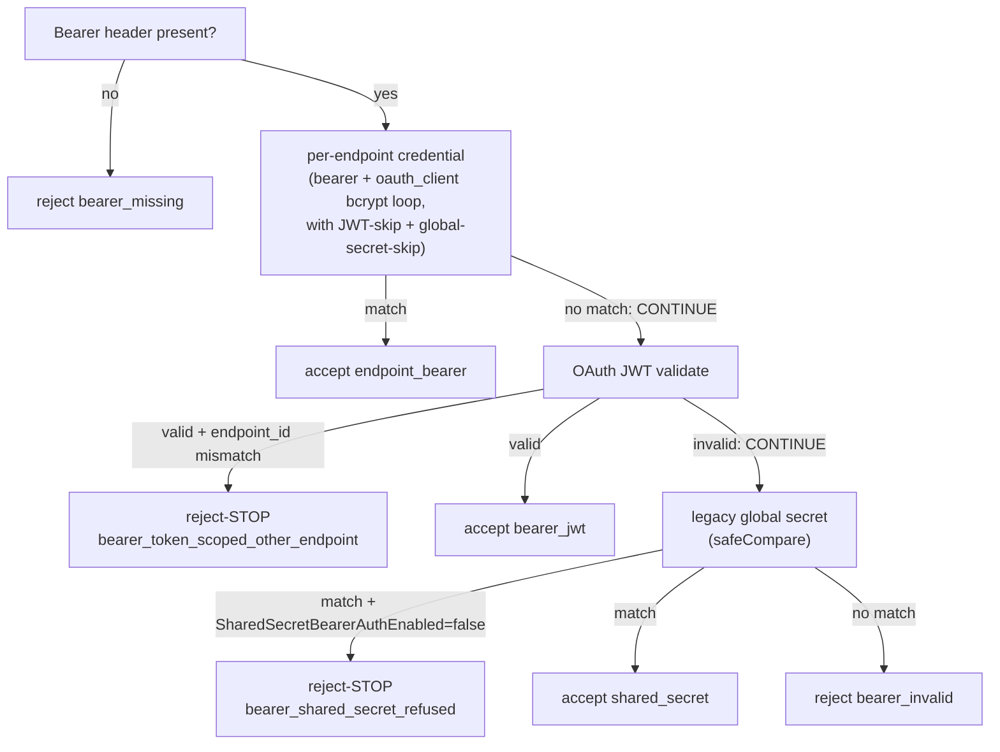
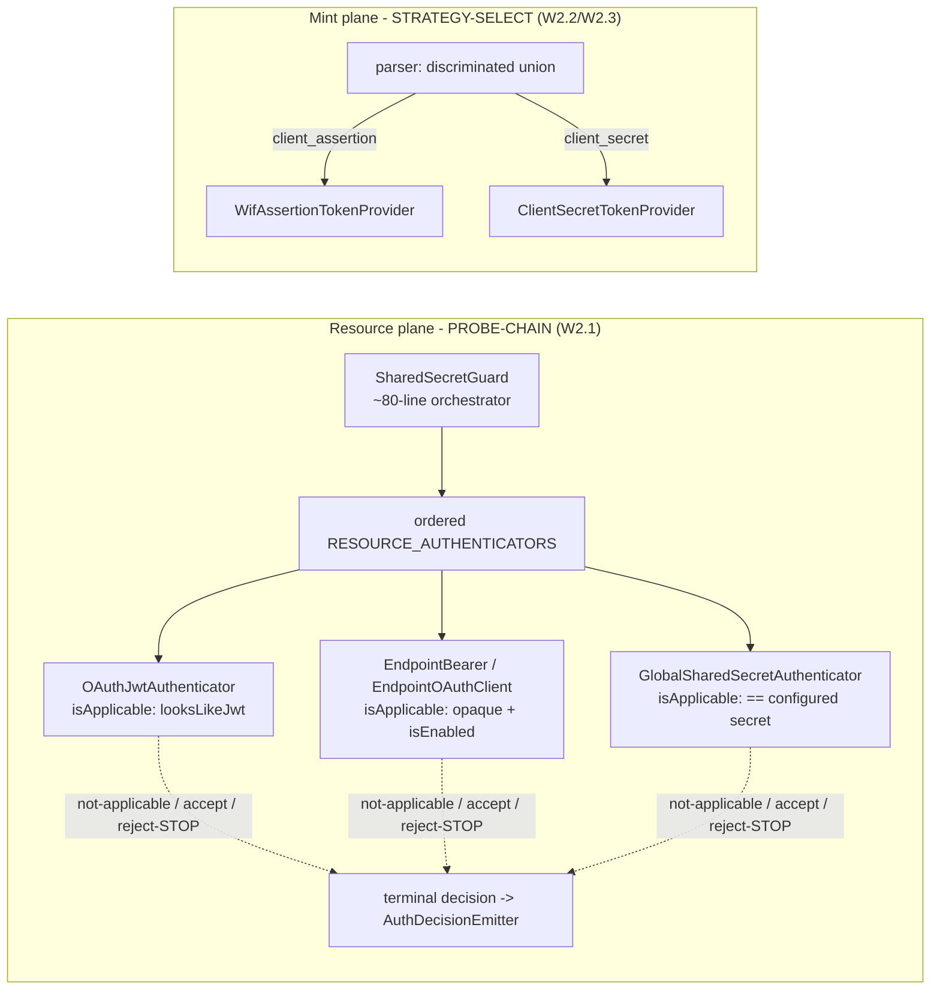

# Wave 2 design analysis - the auth strategy seam + enablement consolidation (deep dive)

Status: DESIGN ANALYSIS (source at `feat/wif`, api v0.54.65). Answers the operator's
Wave 2 questions: pros/cons/benefits/pitfalls of the seam refactor (W2.1-W2.4),
whether it is good design or there are better ways (researched across frameworks
and patterns), and for W2.5 how settings/configurability work after consolidation,
the gaps/pitfalls, and the options. Grounds recommendations for every Wave 2 item.
Companion to [AUTH_SOURCE_REFACTORING_ANALYSIS.md](AUTH_SOURCE_REFACTORING_ANALYSIS.md) (X12)
and [AUTH_CONSOLIDATED_DELIVERY_PLAN.md](AUTH_CONSOLIDATED_DELIVERY_PLAN.md) (X13, Wave 2).

## 0. Verdict (TL;DR)

Wave 2 is **good design and low risk**, with two refinements the research surfaced:

1. **The resource-plane seam (W2.1) is not a new model - it formalizes what the
   491-line `SharedSecretGuard` already does implicitly.** The current cascade is
   already a chain-of-responsibility with three outcomes (accept / reject-and-stop /
   fall-through). This is byte-for-byte the **Spring Security `ProviderManager` +
   `AuthenticationProvider`** model, where each provider indicates "authentication
   should be successful, fail, or indicate it cannot make a decision and allow a
   downstream provider to decide"
   ([Spring Security architecture](https://docs.spring.io/spring-security/reference/servlet/authentication/architecture.html)).
   Extracting it into explicit strategies is the industry-standard shape, not an
   invention - which de-risks it substantially.

2. **Resource plane and mint plane want DIFFERENT patterns, and that is correct.**
   The resource plane MUST **probe** (a single `Authorization: Bearer <token>` could
   be a per-endpoint secret, an OAuth JWT, or the global secret - the server cannot
   know which without trying), so the **probe-chain** (Spring ProviderManager) fits.
   The mint plane can **select** by request shape (`client_assertion` -> WIF,
   `client_secret` -> oauth_client), so a **keyed Strategy registry** fits - which is
   exactly what the existing `IAssertionTokenProvider` seam already does. Wave 2 =
   probe-chain on the resource plane + strategy-select on the mint plane, each matched
   to whether the method self-identifies.

The **one pitfall that must not be missed**: the three-outcome contract MUST
distinguish "**not mine, continue**" from "**mine but invalid, stop**" (Spring's
"cannot decide" vs "fail"). A naive "return not-applicable on any failure" would
delete the current reject-stop cases (an endpoint-scoped token presented to the
wrong endpoint; a refused global secret) and **reintroduce downgrade-confusion**.
Section 4.1 makes this the load-bearing invariant.

W2.5 (enablement consolidation) is sound and should land WITH W2.1, because "which
methods are enabled" is exactly what each authenticator's `isEnabled()` needs - but
it carries a real semantic decision (does a per-method enable gate BOTH planes?) and
a migration that must be value-preserving. Section 7 works it fully.

## 1. What Wave 2 is (recap) + the current cascade

| Item | Change |
|---|---|
| W2.1 | Resource-plane `ResourceAuthenticator` strategy chain; `SharedSecretGuard` -> thin orchestrator |
| W2.2 | Strict token-request parser + discriminated union (mint plane) |
| W2.3 | Extract the inlined `client_secret` mint path into `ClientSecretTokenProvider` |
| W2.4 | Centralize `AuthDecisionEmitter`; relocate mint providers |
| W2.5 | Consolidate the overlapping enablement flags + co-locate enablement with each method |

The current resource-plane cascade in [shared-secret.guard.ts](../../api/src/modules/auth/shared-secret.guard.ts)
`canActivate` (lines 84-353), read precisely:



Note the three distinct edge types already present: **accept** (return true),
**reject-STOP** (a `this.reject(...)` that must NOT fall through - the two red
"STOP" nodes), and **continue** (fall through to the next stage). That is the
three-outcome contract, today hand-coded and interleaved with decision-trace
accumulation, config-flag lookups, and logging in one 491-line method.

## 2. Industry pattern landscape (researched)

The "authenticate a request that could carry one of several credential types"
problem is solved the same way everywhere: a set of single-purpose authenticators
behind one orchestrator. The axis that differs is **probe vs select**.

| Framework / pattern | Selection model | Outcome contract | Dynamic per-tenant config | Maps to SCIMServer |
|---|---|---|---|---|
| **Spring Security `ProviderManager` + `AuthenticationProvider`** ([ref](https://docs.spring.io/spring-security/reference/servlet/authentication/architecture.html)) | **probe-chain** (each provider tried in order) | **success / fail / cannot-decide** (delegate downstream) | via provider + parent manager | **Direct analog of W2.1** - the resource-plane seam |
| **ASP.NET Core schemes + handlers** ([ref](https://learn.microsoft.com/en-us/aspnet/core/security/authentication/)) | **named selection** ("no automatic probing of schemes") | `AuthenticateResult` = success / none / fail | per-scheme options; policy schemes to combine | Contrast - needs a scheme NAME the SCIM client cannot supply |
| **GoF Chain of Responsibility** ([ref](https://refactoring.guru/design-patterns/chain-of-responsibility)) | probe-chain, first-capable stops | handler decides process/pass | runtime-composable | The underlying pattern; pros = order control + SRP + Open/Closed; con = "some requests may end up unhandled" |
| **GoF Strategy (keyed registry)** | key-based selection | n/a (one strategy runs) | keyed | **The mint plane** - request shape is the key (`IAssertionTokenProvider`) |
| **NestJS Guards + Passport strategies** | guard probes; Passport strategy per name | strategy `validate` throws/returns | Passport config is static per strategy | Passport's static per-name model fights per-endpoint dynamic trust config |
| **API-gateway authenticators (Ory Oathkeeper, Envoy ext_authz)** | pipeline of authenticators, first match | authenticator match/skip | yes | Same probe-chain, gateway scale |

Two takeaways:

- **The probe-chain with a three-outcome contract is the canonical solution for the
  resource plane** (Spring's ProviderManager is literally this). SCIMServer already
  implements it implicitly; W2.1 makes it explicit.
- **ASP.NET's "no probing, name the scheme" model is the interesting contrast**: it
  avoids ambiguity by requiring the caller to name the scheme. SCIMServer cannot do
  that on the resource plane (one opaque Bearer header), but it CAN cheaply
  disambiguate by **token shape** - which is exactly what the X9 `looksLikeJwt` +
  global-secret short-circuits already do. So the recommended hybrid is a
  probe-chain whose ordering + `isApplicable(token)` fast-path uses shape to skip
  inapplicable authenticators cheaply (Section 6).

## 3. Benefits of the proposed seam (why it is good design)

1. **SRP + de-god-classing.** 491-line guard -> a ~80-line orchestrator + N small
   single-purpose authenticators, each owning one method's lookup + validation +
   enablement + trace. This is the GoF-stated CoR benefit ("decouple classes that
   invoke operations from classes that perform operations").
2. **Open/Closed for the roadmap.** RFC 8693, `private_key_jwt`, mTLS become a new
   class + one registration line, not an edit to a god-file (the recurring cost the
   DA-gate exists to catch). GoF + Spring both cite this as the primary win.
3. **Pattern symmetry with what already works.** The mint plane's
   `IAssertionTokenProvider` seam proves the three-outcome contract works in this
   codebase; W2.1 applies the same shape to the resource plane.
4. **Testability.** Each authenticator gets focused unit tests (its own accept /
   reject-stop / continue matrix); the chain gets a thin ordering + terminal-decision
   test. Today the only test surface is the whole 491-line guard.
5. **Capability truthfulness for free.** Once each authenticator owns `isEnabled()`,
   OAuth metadata (W0.3) and connection-info derive from the SAME predicate, so
   "advertised" and "enforced" cannot drift.
6. **Telemetry cohesion.** W2.4's single `AuthDecisionEmitter` removes the three
   hand-rolled `emit + record` sites (guard, controller, WIF provider).

## 4. Pitfalls (the deep part) and how to neutralize each

### 4.1 The load-bearing invariant: "not mine" vs "mine but invalid"

This is the one that can ship a security regression. The chain has THREE outcomes,
not two:

```jsonc
// The seam contract (mirrors Spring's success / fail / cannot-decide)
type AuthAttempt =
  | { outcome: 'not-applicable' }   // "cannot decide" -> CONTINUE to next authenticator
  | { outcome: 'accept'; ... }      // "success" -> STOP, allow
  | { outcome: 'reject'; reason };  // "fail" (mine but invalid) -> STOP, deny (NO fall-through)
```

Current reject-STOP cases that MUST remain reject-STOP (not become fall-through):
- an OAuth JWT that validates but carries an `endpoint_id` for a DIFFERENT endpoint
  (`bearer_token_scoped_other_endpoint`) - downgrade-confusion defense;
- the global secret presented to an endpoint with `SharedSecretBearerAuthEnabled=false`
  (`bearer_shared_secret_refused`).

If a strategy collapsed these into "not-applicable", the request would fall through
to a later acceptor and could be **wrongly allowed**. **Mitigation:** the contract
above is mandatory; every authenticator's spec MUST include a reject-STOP test
proving it does not fall through; a chain-level test MUST prove a reject short-circuits
the remaining authenticators. This is the same "downgrade-confusion" the guard
comments already call out - the refactor must preserve it under test, not just in prose.

### 4.2 Ordering encodes security policy

The order (per-endpoint credential -> endpoint-scoped OAuth -> global secret) is not
cosmetic; it is the precedence policy (specific-before-general; the X9 short-circuits
route JWTs/global-secret past the expensive bcrypt loop). **Mitigation:** make
`order` an explicit, tested property of each authenticator (Spring registers an
ordered `List<AuthenticationProvider>`; GoF calls order a first-class concern).
A test MUST assert the resolved chain order. Never rely on DI registration accident.

### 4.3 Probe cost (the X9 lesson, generalized)

A probe-chain runs authenticators until one accepts; a mis-ordered or non-short-
circuiting chain re-pays cost per request (X9 was exactly this - a bcrypt loop that
ran for tokens that could never match). **Mitigation:** every authenticator gets a
cheap `isApplicable(token)` / `isEnabled(endpoint)` gate evaluated BEFORE any
expensive work (bcrypt, JWKS, DB). The X9 `looksLikeJwt` + global-secret short-
circuits become the opaque-secret authenticators' `isApplicable` returning
not-applicable. Add the token-mint + resource-plane latency gates (Wave 1's `9z-BW`
sibling) so a regression trips.

### 4.4 Telemetry threading across strategies

Today the `checks[]` array accumulates across all cascade stages and is recorded
once at the terminal decision (with "record accepts only for endpoint-scoped routes"
noise control). Split into strategies, each must contribute its sub-checks to a
shared trace without each re-implementing emission. **Mitigation:** pass a trace
accumulator into each `tryAuthenticate`; the orchestrator owns the single terminal
`AuthDecisionEmitter.record()` (W2.4). Do NOT let each strategy emit its own decision
event (that would multiply the canonical AUTH events - the exact duplication W2.4
removes).

### 4.5 DI / registration complexity in NestJS

NestJS has no built-in ordered multi-provider "chain" like Spring's `ProviderManager`.
**Mitigation:** register the authenticators as a `RESOURCE_AUTHENTICATORS` array
provider (a factory that returns them sorted by `order`); the guard injects the
array. Keep it explicit and unit-tested; do not over-engineer a discovery mechanism.

### 4.6 Over-abstraction risk (YAGNI)

Four resource methods + a roadmap of ~3 more do NOT justify a plugin framework, a
policy DSL, or per-authenticator sub-collaborators. **Mitigation (DA-gate guardrail):**
finite typed strategies + one ordered registry. Reject anything that adds a second
indirection layer without a second concrete implementation demanding it. (Spring
itself is just `List<AuthenticationProvider>` - no DSL.)

### 4.7 Global (non-endpoint) routes

Enablement is per-endpoint, but admin/global routes have no endpoint segment. The
global-secret + global-OAuth paths must still work when `endpointId` is null.
**Mitigation:** each authenticator's `isEnabled(endpointId | null)` must define its
null-endpoint behavior (global secret: allowed; per-endpoint bearer: not-applicable).
Covered by the existing "not an endpoint-scoped route" skip check - preserve it.

## 5. Alternatives evaluated (the "better ways" question)

| Alternative | What it is | Verdict |
|---|---|---|
| **A. Extract to private helpers only** | Keep one guard; move each method to a private method | Cheapest, but keeps the god-class + no Open/Closed; a new method still edits the guard. **Insufficient** for the roadmap. |
| **B. NestJS Passport strategies** | One Passport strategy per method | Framework-native, BUT Passport binds config statically per strategy; SCIMServer's trust/enablement is DYNAMIC per endpoint (DB-backed). Fighting Passport's static model adds coupling. **Rejected.** |
| **C. ASP.NET-style named scheme registry** | Caller names the scheme; no probing | Eliminates probe ambiguity - but the SCIM resource client sends ONE opaque Bearer header and cannot name a scheme. **Not applicable to the resource plane** (viable only where the route pre-declares the method). |
| **D. Probe-chain + 3-outcome (Spring ProviderManager shape)** | The proposed W2.1 | **Recommended.** Matches the existing implicit design + the industry standard; preserves reject-STOP; Open/Closed; testable. |
| **E. Hybrid: shape-select fast-path + probe fallback** | D, plus `isApplicable(token)` using token shape (X9 short-circuits) to skip inapplicable authenticators | **Recommended refinement of D.** Gets ASP.NET's "don't probe what can't match" efficiency without needing a client-supplied scheme name. |

**Recommendation: D + E.** The probe-chain is correct for the resource plane; add the
shape-based `isApplicable` fast-path (already proven by X9) so it does not probe
what cannot match. The mint plane stays a keyed Strategy registry (select by request
shape) - it already is one.

## 6. The recommended shape (concrete)



- `ResourceAuthenticator { order; isEnabled(endpointId); tryAuthenticate(ctx): AuthAttempt }`.
- Orchestrator: resolve config once -> walk ordered chain -> first `accept` wins,
  first `reject` STOPS, `not-applicable` continues -> terminal `AuthDecisionEmitter.record`.
- The `isApplicable` fast-path (shape) is checked before expensive work.

## 7. W2.5 deep dive - configurability after consolidation

### 7.1 Today (the ambiguity, precisely)

[getEffectiveAuthEnablement](../../api/src/modules/endpoint/endpoint-config.interface.ts#L833) resolves:

| Effective flag | Source (first wins) | Default |
|---|---|---|
| `secretTokenBearer` | `SecretTokenBearerAuthEnabled` -> legacy `PerEndpointCredentialsEnabled` | false |
| `oauthClientCredentials` | `OAuthClientCredentialsAuthEnabled` -> legacy `PerEndpointCredentialsEnabled` | false |
| `sharedSecretBearer` | `SharedSecretBearerAuthEnabled` | **true** (back-compat) |

Plus: **WIF has no enablement flag at all** - a WIF trust is "active" iff an active
`wif` credential exists. And a subtle asymmetry: the **resource-plane guard consults
these flags, but the token-MINT controller does NOT** (the mint `handleClientSecret`
accepts an `oauth_client` regardless of `oauthClientCredentials`). So "enabled" today
means different things on the two planes.

### 7.2 The clean model after W2.5

Two orthogonal facts per method, kept DISTINCT (this is the core of the design):

```text
ENABLED    = the operator has turned this method ON for this endpoint (policy)
HAS_CRED   = an active credential/trust of this method's type exists (capability)
ACTIVE     = ENABLED AND HAS_CRED   (the method actually works)
```

| ENABLED | HAS_CRED | State | Meaning |
|---:|---:|---|---|
| false | false | inactive | off, nothing configured |
| false | true | **disabled-with-credential** | explicitly OFF even though a credential exists (MUST be honored) |
| true | false | **enabled-but-unconfigured** | on but no credential yet (advertise nothing; cannot authenticate) |
| true | true | active | works; advertised; enforced |

- **One source of truth**: a per-method `enabled` boolean co-located on the endpoint's
  `AuthenticationMethod` entry (the currently-inert `profile.authentication` A0 model),
  NOT a growing flat list of top-level booleans.
- **Both planes consult it** (fixes 7.1's asymmetry): the resource-plane authenticator's
  `isEnabled()` AND the mint-plane provider's eligibility read the SAME per-method
  `enabled` + `HAS_CRED`. Metadata (W0.3) reads it too. Advertised == enforced == minted.
- **Retire `PerEndpointCredentialsEnabled`** after a value-preserving migration that
  materializes each endpoint's effective per-method value.

### 7.3 How settings/configurability work for the operator after

- The Connect UI shows **one toggle per method** (Global shared secret, Per-endpoint
  bearer, OAuth2 client-credentials, WIF), each writing that method's `enabled`.
- A method needs BOTH the toggle ON and a credential to become active; the UI shows
  the state (e.g. "Enabled, no credential yet") so the four states in 7.2 are legible.
- Adding a new method (RFC 8693, mTLS) adds its own toggle + `enabled` - no central
  flags enum to edit (Open/Closed at the config layer too).

### 7.4 Gaps + pitfalls (and the decision for each)

| Gap / pitfall | Decision |
|---|---|
| **Mint vs resource asymmetry** (7.1) | Unify: both planes read the same `enabled`. This is a behavior CHANGE for the mint plane (an `oauth_client` on a disabled method would stop minting) - ship it shadow-first + call it out in CHANGELOG. |
| **Back-compat defaults** | `sharedSecretBearer` must stay default-true; per-method must reproduce the legacy-fallback exactly. Migration is value-preserving + parity-tested (both backends). |
| **disabled-with-credential** | MUST be honored (a method can be OFF with a credential present). Do not infer enablement from credential presence alone. |
| **Global (null-endpoint) routes** | Global secret enablement is a server-level concern, not per-endpoint; the global path stays enabled for admin routes. |
| **Home for `enabled`: which structure?** | See options below. |
| **WIF gets an explicit enable** | Today WIF has none (credential-presence only). Giving it an explicit `enabled` is more consistent but is a NEW gate - default it to true-when-a-trust-exists to preserve today's behavior. |

### 7.5 Options for WHERE enablement lives

| Option | Model | Pros | Cons | Rec |
|---|---|---|---|---|
| **A. Explicit `enabled` per `AuthenticationMethod`** | each method entry carries `enabled: bool` | explicit; supports disabled-with-credential; clean 4-state | one more field to migrate | **Recommended** |
| **B. Presence-in-list = enabled** | a method is enabled iff it appears in `profile.authentication[]` | elegant; the list IS the policy | cannot express "configured but disabled"; deleting the entry loses config | Rejected (loses a real state) |
| **C. Keep flat top-level flags, just consolidate** | retire legacy umbrella, keep per-method top-level booleans | smallest change | not co-located with the method; every new method edits a central enum (the Open/Closed smell) | Fallback only |

**Recommendation: Option A** - an explicit `enabled` on each `AuthenticationMethod`,
migrated value-preservingly from the flat flags, with the legacy umbrella retired.
It is the only option that expresses all four states AND co-locates enablement with
the method (so the authenticator, the mint provider, and the metadata all read one
field). It reuses the existing A0 backbone rather than inventing a structure (YAGNI).

## 8. Recommendations per Wave 2 item

| Item | Recommendation |
|---|---|
| **W2.1** | **Proceed** as a probe-chain (Spring ProviderManager shape) + the shape-based `isApplicable` fast-path (Section 6). Mandatory: the 3-outcome contract with reject-STOP preserved (4.1), explicit tested `order` (4.2), cheap-gate-before-expensive (4.3). Behavior-preserving; existing guard specs + `9z-*` are the net. |
| **W2.2** | **Proceed.** The mint plane is a keyed Strategy-select (not a probe-chain) - the parser produces the discriminated union that selects the provider. Keep parsing free of crypto/DB. |
| **W2.3** | **Proceed.** Symmetric extraction of the inlined `client_secret` path; controller becomes route + response only. |
| **W2.4** | **Proceed.** One `AuthDecisionEmitter`; each strategy contributes sub-checks to a shared trace, orchestrator emits once (4.4). |
| **W2.5** | **Proceed with Option A** (explicit per-method `enabled` on `AuthenticationMethod`), unifying mint + resource + metadata on one source of truth, value-preserving migration, retire the legacy umbrella. Ship the mint-plane enablement change shadow-first (7.4). Land it WITH W2.1 so `isEnabled()` has a real home. |

Sequencing within Wave 2: **W2.1 + W2.5 together** (the seam needs the enablement
source; the enablement source needs somewhere to be read) -> **W2.2 -> W2.3**
(mint plane) -> **W2.4** (telemetry cohesion, after the sites exist).

## 9. Decision log + DA-gate disposition

| ID | Decision | Alternatives | Why |
|---|---|---|---|
| DA | Resource plane = probe-chain (3-outcome) | named-scheme registry; helpers-only | Client sends one opaque Bearer header; must probe; matches Spring ProviderManager + the existing implicit design |
| DB | Mint plane = keyed Strategy-select | probe-chain | Request shape self-identifies the method; already the `IAssertionTokenProvider` model |
| DC | `isApplicable` shape fast-path | pure probe | Avoids the X9 wasted-work class without a client scheme name |
| DD | W2.5 Option A (explicit per-method `enabled`) | presence=enabled; flat flags | Only option expressing all 4 states + co-located + reuses A0 |
| DE | Both planes read one enablement source | keep mint-plane flag-free | Removes the advertised/enforced/minted drift |
| DF | No policy DSL / no Passport | generic engine; Passport | Finite typed strategies suffice; Passport's static config fights per-endpoint dynamism (YAGNI) |

DA-gate for this analysis: **SRP/coupling/pattern/Open-Closed** all satisfied by the
probe-chain + strategy-select recommendation; **YAGNI** held (no DSL, finite
strategies, reuse A0). Disposition: **Applied** (the recommendations are the design);
the implementation is **Scheduled** (Wave 2, sequencing above).

## 10. References

- Spring Security auth architecture (ProviderManager + AuthenticationProvider, the success/fail/cannot-decide contract): https://docs.spring.io/spring-security/reference/servlet/authentication/architecture.html
- ASP.NET Core authentication (schemes + handlers, "no automatic probing", policy schemes): https://learn.microsoft.com/en-us/aspnet/core/security/authentication/
- GoF Chain of Responsibility (pros: order control, SRP, Open/Closed; con: some requests unhandled): https://refactoring.guru/design-patterns/chain-of-responsibility
- Current source: [shared-secret.guard.ts](../../api/src/modules/auth/shared-secret.guard.ts), [endpoint-oauth.controller.ts](../../api/src/modules/scim/controllers/endpoint-oauth.controller.ts), [assertion-token-provider.ts](../../api/src/modules/scim/controllers/assertion-token-provider.ts), [endpoint-config.interface.ts](../../api/src/modules/endpoint/endpoint-config.interface.ts)
- X12 refactor analysis: [AUTH_SOURCE_REFACTORING_ANALYSIS.md](AUTH_SOURCE_REFACTORING_ANALYSIS.md); X13 plan: [AUTH_CONSOLIDATED_DELIVERY_PLAN.md](AUTH_CONSOLIDATED_DELIVERY_PLAN.md)

## 11. Change log

| Version | Change |
|---|---|
| 0.54.65 | This Wave 2 design analysis (deep dive): grounds the seam refactor in the Spring Security ProviderManager probe-chain (the direct analog of the existing implicit cascade) + the ASP.NET named-scheme contrast + GoF CoR/Strategy; establishes the load-bearing "not-mine vs mine-but-invalid" three-outcome invariant (downgrade-confusion defense); recommends probe-chain + shape fast-path on the resource plane and keyed Strategy-select on the mint plane; works W2.5 fully (the enabled/has-cred/active 4-state model, both-planes-one-source-of-truth, Option A explicit per-method `enabled`, gaps + migration); per-item recommendations + sequencing (W2.1+W2.5 together). Analysis only - no runtime change. |
