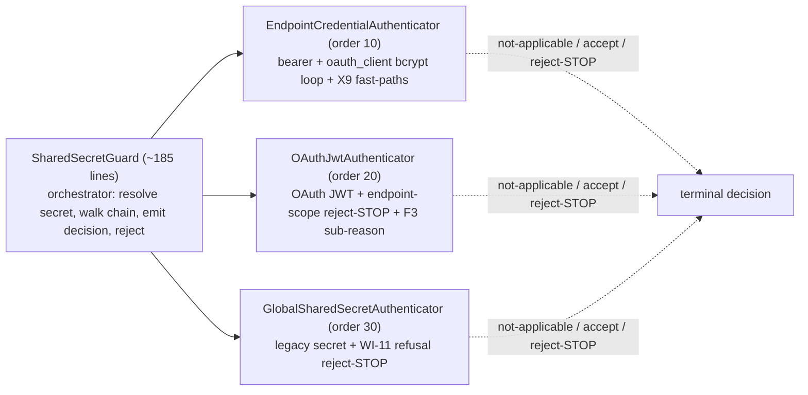

# W2.1 implementation report - the resource-plane ResourceAuthenticator probe-chain

Status: DELIVERED (api v0.54.67, `feat/wif`). Implements Wave 2 item **W2.1** from
[AUTH_CONSOLIDATED_DELIVERY_PLAN.md](AUTH_CONSOLIDATED_DELIVERY_PLAN.md), per the
design recommended in [WAVE2_DESIGN_ANALYSIS.md](WAVE2_DESIGN_ANALYSIS.md) (probe-chain,
three-outcome contract, reject-STOP preserved).

## 1. What shipped

The 491-line god-guard `SharedSecretGuard` is now a **thin orchestrator (~185 lines)**
over an ordered **`ResourceAuthenticator` probe-chain** - the exact Spring Security
`ProviderManager` + `AuthenticationProvider` shape. Each resource-plane auth method is
now its own single-purpose strategy that returns a three-outcome `AuthAttempt`
(accept / reject-STOP / not-applicable-continue); the guard walks the chain and owns
only the cross-cutting concerns (shared-secret resolution, decision-trace accumulation
+ terminal emission, the RFC 6750 reject response).

**Behavior-preserving.** This is a pure structural refactor: every reject-STOP
(`bearer_token_scoped_other_endpoint`, `bearer_shared_secret_refused`), the F3
fall-through sub-reason (`bearer_oauth_expired` / `_signature_invalid`), the X9
short-circuits, the decision-trace `checks[]`, the accept noise-control, and the
request enrichment are reproduced exactly.

### Key design decisions
- **Guard constructor signature is UNCHANGED** - it composes the chain internally from
  its existing deps (the GoF "client composes the chain" form). This kept the
  comprehensive 39-test security spec passing with zero construction churn and is the
  lowest-risk extraction path. Full DI-token injection of the chain is a later refinement.
- **`isEnabled` reads today's flags** (`getEffectiveAuthEnablement`) - no enablement
  migration in W2.1; that is W2.5.
- **Order is explicit** (`order` 10/20/30, sorted in the constructor) - it encodes the
  precedence policy, not DI-registration accident.

## 2. Files

| File | Change |
|---|---|
| [authenticators/resource-authenticator.ts](../../api/src/modules/auth/authenticators/resource-authenticator.ts) | NEW - the seam (`ResourceAuthenticator`, `AuthAttempt`, `AuthContext`, `AuthenticatedRequest`) |
| [authenticators/endpoint-credential.authenticator.ts](../../api/src/modules/auth/authenticators/endpoint-credential.authenticator.ts) | NEW - the per-endpoint bearer + oauth_client method (+ X9 fast-paths) |
| [authenticators/oauth-jwt.authenticator.ts](../../api/src/modules/auth/authenticators/oauth-jwt.authenticator.ts) | NEW - the OAuth JWT method (+ endpoint-scope reject-STOP; owns `mapBearerJwtErrorToReason`) |
| [authenticators/global-shared-secret.authenticator.ts](../../api/src/modules/auth/authenticators/global-shared-secret.authenticator.ts) | NEW - the legacy global-secret method (+ WI-11 refusal reject-STOP) |
| [shared-secret.guard.ts](../../api/src/modules/auth/shared-secret.guard.ts) | Rewritten to a thin orchestrator; re-exports `mapBearerJwtErrorToReason` for compat |
| 3 new `*.authenticator.spec.ts` | NEW - per-strategy accept / reject-STOP / not-applicable coverage (20 tests) |

## 3. Validation matrix

| Gate | Result |
|---|---|
| API TypeScript build | PASS (0 errors) |
| ESLint (auth module) | PASS (0 errors, 0 new warnings) |
| `shared-secret.guard.spec` (regression net) | PASS 39/39 |
| New per-authenticator specs | PASS 20/20 |
| Full API unit suite | PASS 143 suites / 4479 tests (was 4459 + 20) |
| Auth E2E (authentication + wif-assertion + endpoint-oauth-client + oauth-discovery, inmemory) | PASS 7 suites / 80 tests |
| Cross-backend parity | Preserved (no new `isInMemoryBackend` branch; authenticators use the injected repo/service; inmemory E2E green) |

The 39-test guard spec + 80 auth E2E passing unchanged is the behavior-preservation
proof; the 20 new specs add each strategy's own reject-STOP / not-applicable coverage.

## 4. Execution issues + RCA

Two low-severity issues, both caught by a gate and fixed in the same commit chain.

| # | Type | Severity | Symptom | Root cause | Fix | Prevention |
|---|---|---|---|---|---|---|
| W2.1-01 | Test correctness | Low | The `endpoint-credential` spec's "JWT fast-path" test failed - `findActiveByEndpoint` WAS called | The test token `aaa.bbb.ccc` is not a real JWT; `looksLikeJwt` requires 3 base64url segments with a decodable JSON header/payload, so the fast-path did not fire | Build a genuine JWT-shaped token via `Buffer.from(JSON.stringify(...)).toString('base64url')` | Assert the OUTCOME (repo not called), which surfaced the wrong test fixture immediately (R10) |
| W2.1-02 | Tooling friction | Low | ESLint warning: unused `eslint-disable` directive on the bcrypt dynamic import | The directive was copied from the guard, but `await import('bcrypt')` is a dynamic import, not a `require`, so `no-require-imports` never fires | Remove the stale directive | Lint gate (Stage 1.3) flags unused directives; do not copy suppressions blindly |

Detection escape: both were caught at the earliest possible gate (Stage 0 test run /
Stage 1 lint) - zero escape.

## 5. Design & Architecture gate disposition

| Check | Finding | Disposition |
|---|---|---|
| SRP | Guard 491 -> ~185 lines; each method is a single-purpose ~90-line strategy | **Applied** (god-guard removed) |
| Coupling | Guard depends on the `ResourceAuthenticator` abstraction for the loop; concrete classes composed only at the constructor (composition root) | **Applied** |
| Pattern fit | Mirrors Spring `ProviderManager` + the existing mint-plane `IAssertionTokenProvider` 3-outcome seam | **Applied** |
| Open/Closed | Adding RFC 8693 / private_key_jwt / mTLS = a new authenticator class + one constructor entry, not a guard edit | **Applied** (the Wave 4 enabler) |
| Simplicity (YAGNI) | No DSL, no Passport, no discovery mechanism; a plain ordered array + a 3-outcome union | **Applied** |
| Load-bearing invariant | reject-STOP preserved (2 cases) + tested per-strategy AND end-to-end | **Applied** |

## 6. Learnings

- **A behavior-preserving refactor of a security-critical guard is safe when the
  existing spec is comprehensive AND the extraction keeps the constructor signature
  identical.** Keeping the 39-test spec's construction unchanged (chain composed
  internally) meant the spec itself was the regression net, not something to rewrite.
- **The reject-STOP vs not-applicable distinction is the whole ballgame.** Encoding it
  in the `AuthAttempt` union (not a boolean) makes it impossible to accidentally turn a
  reject into a fall-through - the compiler + the per-strategy reject-STOP tests enforce it.
- **`apply` closures** let a strategy carry its "stamp the request" side effect to the
  orchestrator without the guard knowing each method's request-mutation details.

## 7. What is NOT in W2.1 (next)

- **W2.5** (enablement consolidation) - `isEnabled` still reads the legacy flags; the
  per-method `enabled` co-location + legacy-umbrella retirement is next.
- **W2.2 / W2.3** (mint-plane parser + `ClientSecretTokenProvider`) - W2.3 MUST preserve
  the W0.2 `@HttpCode(200)` + no-store `@Header` decorators on the controller handler.
- **W2.4** - centralize `AuthDecisionEmitter` (the guard's `recordDecision` + the two
  mint sites) once W2.3 lands.
- **Full DI-token chain injection** - optional refinement over the current internal composition.

## 8. Change log

| Version | Change |
|---|---|
| 0.54.67 | W2.1: extract the resource-plane cascade into an ordered `ResourceAuthenticator` probe-chain (3 strategies) behind a thin `SharedSecretGuard`; behavior-preserving (guard spec 39/39 + auth E2E 80/80 unchanged); +20 per-strategy unit tests; DA-gate + RCA. `isEnabled` still reads today's flags (W2.5 migrates it). |
