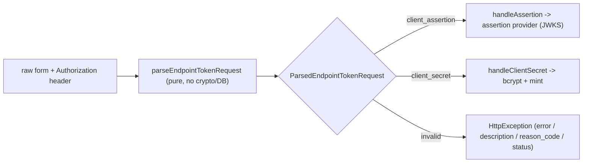

# W2.2 implementation report - strict token-request parser + discriminated union

Status: DELIVERED (api v0.54.69, `feat/wif`). Implements Wave 2 item **W2.2** from
[AUTH_CONSOLIDATED_DELIVERY_PLAN.md](AUTH_CONSOLIDATED_DELIVERY_PLAN.md). Per
[WAVE2_DESIGN_ANALYSIS.md](WAVE2_DESIGN_ANALYSIS.md) section 8: the mint plane is a KEYED
STRATEGY-SELECT (not a probe-chain) - the parser produces the discriminated union that
selects the provider; parsing stays free of crypto/DB.

## 1. What shipped

The per-endpoint token endpoint (`POST /scim/endpoints/:id/oauth/token`) no longer
re-derives the credential method inline. A pure parser turns the raw RFC 6749 form + the
`Authorization` header into exactly one variant of a discriminated union, and the controller
only ROUTES the well-formed variants + shapes the error response.

- **[endpoint-token-request.types.ts](../../api/src/modules/scim/controllers/endpoint-token-request.types.ts)** (NEW) - the `ParsedEndpointTokenRequest` union (`client_assertion` / `client_secret` / `invalid`) + `CredentialLocation` + `RawEndpointTokenRequest`.
- **[endpoint-token-request-parser.ts](../../api/src/modules/scim/controllers/endpoint-token-request-parser.ts)** (NEW) - the pure parser: RFC 6749 section 2.3.1 credential-location normalization (Basic vs body, body wins), grant-type enforcement, mutual-exclusion of assertion + secret, assertion-type validation, missing-credential rejection.
- **[endpoint-oauth.controller.ts](../../api/src/modules/scim/controllers/endpoint-oauth.controller.ts)** - `getToken` calls the parser then routes; `handleAssertion` + `handleClientSecret` take the typed union member (not the raw body). The W0.2 `@HttpCode(200)` + `@Header('Cache-Control','no-store')` + `@Header('Pragma','no-cache')` decorators are UNCHANGED. The W2.5 mint-shadow read is UNCHANGED.

**Behavior-preserving.** Every `error` / `error_description` / `reason_code` / HTTP status
(`grant_type_unsupported`, `mutually_exclusive_credentials`, `unsupported_assertion_type`,
`missing_credentials`) is reproduced exactly; the auth-decision `checks[]` trace shape
(`credential_location`, `client_id_present`, `client_found`, `secret_match`, `token_ttl`,
`method_enabled_shadow`) is preserved.

## 2. Validation matrix

| Gate | Result |
|---|---|
| API TypeScript build | PASS (0 errors) |
| ESLint | PASS (0 errors) |
| `endpoint-token-request-parser.spec` (NEW) | PASS 10/10 (all variants + every error shape) |
| `endpoint-oauth.controller.spec` | PASS 12/12 (routing + W2.5 shadow unchanged) |
| Token-mint E2E (`endpoint-oauth-client` + `wif-assertion` + `authentication`, inmemory) | PASS 6 suites / 74 |
| Full API unit suite | PASS 144 suites / 4498 (was 4488 + 10) |

## 3. Execution issues + RCA

| # | Type | Severity | Symptom | Root cause | Fix | Prevention |
|---|---|---|---|---|---|---|
| W2.2-01 | Type narrowing | Low | Build error `TS2367`: `credentialLocation === 'none'` has no overlap | The `client_secret` variant types `credentialLocation` as `Exclude<CredentialLocation,'none'>`, so the old dead 'none' branch in the trace check is unreachable by the type system | Set the `credential_location` check status to `'pass'` (it was always pass for a valid client_secret request) | The stricter union type surfaced dead code the loose `string` type had hidden - a benefit of the discriminated union |
| W2.2-02 | Edit mechanics | Low | Two orphaned code fragments after replacing `getToken` + `handleAssertion` bodies | The replacement boundaries clipped the following method header | Re-read + repaired the fragments; build confirmed clean | Insert/replace whole method bodies bounded by their own braces; build immediately |

## 4. Design & Architecture gate disposition

| Check | Finding | Disposition |
|---|---|---|
| SRP | Parsing (shape + normalization) split out of the controller into a pure function | **Applied** |
| Coupling | Parser depends only on the location helper + the assertion-type constant; no crypto/DB | **Applied** |
| Pattern fit | Keyed Strategy-select via the discriminated union (design DB) | **Applied** |
| Open/Closed | A new credential shape (e.g. `private_key_jwt`, mTLS) adds a union variant + a parser branch, not controller surgery | **Applied** |
| Simplicity (YAGNI) | No size-limit / duplicate-param checks added (the body is already parsed to an object; the HTTP body-size limit already bounds it) - kept the extraction behavior-preserving | **Applied** |

## 5. Dev deployment + measured validation (v0.54.71, 2026-07-24)

W2.2 was deployed to dev as part of the mint-refactor cluster (W2.2 + W2.3 + W2.4, all
behavior-preserving) on image `2b57289a` / v0.54.71. Dev confirmed serving `0.54.71`
(revision `v2b57289a`) before any live assertion ran.

| Measured gate (vs dev) | Result |
|---|---|
| Live SCIM suite | 1305 PASS / 10 FAIL / 1315 (the 10 are the pre-existing flush-backlog flake) |
| - `9z-BG.T1` (bad grant_type -> 400 `grant_type_unsupported`) | PASS (W2.2 parser on the wire) |
| - `9z-BG.T2` / `9z-AZ.T7` (bad creds -> 401 `oauth_client_auth_failed`) | PASS |
| Playwright E2E (full suite) | 194 passed / 5 skipped / 0 failed |

## 6. Change log

| Version | Change |
|---|---|
| 0.54.69 | W2.2: extract the per-endpoint token-request parsing into a pure `parseEndpointTokenRequest` producing a `ParsedEndpointTokenRequest` discriminated union (`client_assertion` / `client_secret` / `invalid`); the controller routes the union + shapes responses only (no inline method-derivation). Behavior-preserving (every error shape + trace preserved; W0.2 200/no-store + W2.5 shadow unchanged). +10 parser unit; controller 12/12; token E2E 74; full unit 4498. |
