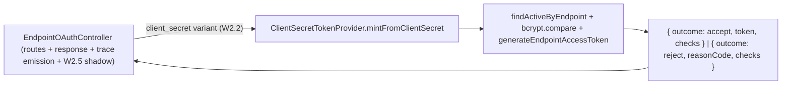

# W2.3 implementation report - `client_secret` mint extracted to a provider

Status: DELIVERED (api v0.54.70, `feat/wif`). Implements Wave 2 item **W2.3** from
[AUTH_CONSOLIDATED_DELIVERY_PLAN.md](AUTH_CONSOLIDATED_DELIVERY_PLAN.md). Symmetric with the
WIF assertion provider: the inlined `client_secret` mint path moves out of the controller
into a dedicated provider, so the controller has no bcrypt / repository logic.

## 1. What shipped

`EndpointOAuthController.handleClientSecret` used to do the credential lookup, the bcrypt
verification, and the mint inline. That logic now lives in
**[ClientSecretTokenProvider](../../api/src/modules/scim/controllers/client-secret-token-provider.ts)**
(a plain `@Injectable` - one implementation, so no speculative interface + DI token per the
YAGNI gate). The controller injects it and delegates.

- The provider owns the credential repo + `OAuthService` + bcrypt, and builds the per-check
  trace THROUGH `secret_match`. It returns a three-outcome result (`accept` with the token +
  checks / `reject` with the reason code + checks) and never throws for an auth failure.
- The controller keeps only the cross-cutting concerns: the W2.5 mint-shadow read (appends
  `method_enabled_shadow`), the `token_ttl` check, the decision-event emission
  (`emitOauthClientDecision`), the RFC 6749 error shaping (`invalidClient`), and the HTTP
  response. The controller no longer imports `bcrypt`, `OAuthService`, or the credential
  repository.

**Behavior-preserving.** The auth-decision `checks[]` order is preserved exactly
(`grant_type`, `credential_location`, `client_id_present`, `client_found`, `secret_match`,
then the controller appends `method_enabled_shadow` + `token_ttl`); the reject reason
(`oauth_client_auth_failed`), the accept response, and the W0.2 `@HttpCode(200)` + no-store
headers are unchanged.

## 2. Files

| File | Change |
|---|---|
| [client-secret-token-provider.ts](../../api/src/modules/scim/controllers/client-secret-token-provider.ts) | NEW - the provider (`ClientSecretMintRequest`, `ClientSecretMintOutcome`, `mintFromClientSecret`) |
| [endpoint-oauth.controller.ts](../../api/src/modules/scim/controllers/endpoint-oauth.controller.ts) | `handleClientSecret` delegates to the provider; constructor drops `OAuthService` + credential repo; imports trimmed |
| [scim.module.ts](../../api/src/modules/scim/scim.module.ts) | Registers `ClientSecretTokenProvider` |
| 2 spec files | NEW provider spec (3); controller spec `makeController` builds the real provider with mocks (12 unchanged) |

## 3. Validation matrix

| Gate | Result |
|---|---|
| API TypeScript build | PASS (0 errors) |
| ESLint | PASS (0 errors) |
| `client-secret-token-provider.spec` (NEW) | PASS 3/3 (accept + 2 reject shapes; no secret echoed) |
| `endpoint-oauth.controller.spec` | PASS 12/12 (delegation transparent) |
| Token-mint + connection-info E2E (inmemory) | PASS 7 suites / 82 |
| Full API unit suite | PASS 145 suites / 4501 (was 4498 + 3) |

## 4. Design & Architecture gate disposition

| Check | Finding | Disposition |
|---|---|---|
| SRP | Credential verify + mint is its own unit; the controller is route + response + trace | **Applied** |
| Coupling | Controller no longer depends on bcrypt / the credential repo; it depends on the provider | **Applied** |
| Pattern fit | Symmetric with `IAssertionTokenProvider` (the mint plane is a set of providers keyed by request shape) | **Applied** |
| Open/Closed | A new secret-based method reuses the pattern (its own provider) | **Applied** |
| Simplicity (YAGNI) | Plain `@Injectable`, NOT an interface + DI token - there is exactly one client_secret impl; extract the seam only when a second appears | **Applied** |

## 5. Dev deployment + measured validation (v0.54.71, 2026-07-24)

W2.3 was deployed to dev as part of the mint-refactor cluster (W2.2 + W2.3 + W2.4) on image
`2b57289a` / v0.54.71 (dev confirmed on `0.54.71` / revision `v2b57289a` first).

| Measured gate (vs dev) | Result |
|---|---|
| Live SCIM suite | 1305 PASS / 10 FAIL / 1315 (the 10 are the pre-existing flush-backlog flake) |
| - `9z-AZ.T7` (wrong oauth_client secret -> `oauth_client_auth_failed` on the wire) | PASS (provider reject) |
| - `9z-AZ.T9b` (reject records per-check `secret_match=mismatch`, no secret) | PASS (provider trace) |
| Playwright E2E (full suite) | 194 passed / 5 skipped / 0 failed |

## 6. Change log

| Version | Change |
|---|---|
| 0.54.70 | W2.3: extract the inlined `client_secret` credential lookup + bcrypt verification + mint into `ClientSecretTokenProvider`; the controller delegates and keeps only routing, the W2.5 shadow read, decision emission, and response shaping (no bcrypt / repo logic). Behavior-preserving (check order + reject reason + response + W0.2 headers unchanged). +3 provider unit; controller 12/12; token+connection-info E2E 82; full unit 4501. |
