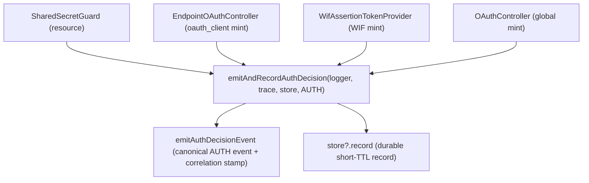

# W2.4 implementation report - centralized auth-decision emit + record

Status: DELIVERED (api v0.54.71, `feat/wif`). Implements Wave 2 item **W2.4** from
[AUTH_CONSOLIDATED_DELIVERY_PLAN.md](AUTH_CONSOLIDATED_DELIVERY_PLAN.md). Closes the
[AUTH_SOURCE_REFACTORING_ANALYSIS.md](AUTH_SOURCE_REFACTORING_ANALYSIS.md) finding #3
("Decision-trace emission duplicated 3x").

## 1. What shipped

The `emitAuthDecisionEvent(logger, trace, AUTH) + decisionStore.record(trace)` pair was
hand-rolled in **four** places: the resource guard, the per-endpoint mint controller, the
WIF assertion provider, and the global token controller. That duplication risks drift -
emit-without-record, record-without-emit, or a second canonical AUTH event. W2.4 gives the
sequence ONE definition.

- **[auth-decision-trace.ts](../../api/src/oauth/auth-decision-trace.ts)** - NEW `emitAndRecordAuthDecision(logger, trace, store, logCategoryAuth)` + the minimal `AuthDecisionRecorder` shape (so the function does not import the store class). It calls `emitAuthDecisionEvent` then `store?.record(trace)`.
- The four sites replace their local `emit + record` pair with a single call. Each keeps its OWN pre-conditions: the guard's no-store early-return + accept-noise-control, and the WIF provider's per-trust aggregation are untouched - the choke point only unifies the final emit+record step.

### Why a function, not an injected `AuthDecisionEmitter` service

The design floated an injectable `AuthDecisionEmitter`. The four call sites live in four
different modules (auth / scim x2 / oauth) and already `@Optional`-inject the decision store,
so a shared service would require cross-module DI wiring (or a global provider) for zero
behavior benefit. A pure function alongside the existing `emitAuthDecisionEvent` eliminates
the exact duplication (the emit+record sequence) with no DI risk - the YAGNI-correct choice.
If a future caller needs injected policy, the seam can be promoted to a service then.

**Behavior-preserving.** Every site emits the same event + records the same trace as before;
the guard's conditional emit (skip when no store, skip accept-on-global) is preserved because
those guards run before the call.

## 2. Files

| File | Change |
|---|---|
| [oauth/auth-decision-trace.ts](../../api/src/oauth/auth-decision-trace.ts) | NEW `emitAndRecordAuthDecision` + `AuthDecisionRecorder` |
| [auth/shared-secret.guard.ts](../../api/src/modules/auth/shared-secret.guard.ts) | resource-plane emit+record -> choke point |
| [scim/controllers/endpoint-oauth.controller.ts](../../api/src/modules/scim/controllers/endpoint-oauth.controller.ts) | oauth_client mint emit+record -> choke point |
| [scim/controllers/wif-assertion-token.provider.ts](../../api/src/modules/scim/controllers/wif-assertion-token.provider.ts) | WIF mint `recordAndEmit` -> choke point |
| [oauth/oauth.controller.ts](../../api/src/oauth/oauth.controller.ts) | global mint emit+record -> choke point |
| [oauth/auth-decision-trace.spec.ts](../../api/src/oauth/auth-decision-trace.spec.ts) | +3 unit tests (emit+record; null store; accept) |

## 3. Validation matrix

| Gate | Result |
|---|---|
| API TypeScript build | PASS (0 errors) |
| ESLint | PASS (0 errors) |
| `auth-decision-trace.spec` (+3 for the choke point) | PASS |
| Guard + mint controller + WIF provider + global controller specs | PASS 129 across 6 suites |
| Auth/token E2E (inmemory) | PASS 6 suites / 74 |
| Full API unit suite | PASS 145 suites / 4504 (was 4501 + 3) |

## 4. Design & Architecture gate disposition

| Check | Finding | Disposition |
|---|---|---|
| DRY | The 4x-duplicated emit+record sequence now has one definition | **Applied** |
| SRP | The choke point owns "emit the canonical event AND persist" | **Applied** |
| Coupling | Function takes a structural `AuthDecisionRecorder`, no store-class import (no cycle) | **Applied** |
| Simplicity (YAGNI) | Function over injectable service - avoids cross-module DI for no benefit; promote to a service only if injected policy is ever needed | **Applied** |
| Provider relocation to `oauth/token-mint/` | Deferred - pure file movement with import-churn risk and no behavior benefit; do it when the mint providers next grow | **Accepted** (deferred, noted) |

## 5. Change log

| Version | Change |
|---|---|
| 0.54.71 | W2.4: centralize the `emitAuthDecisionEvent + decisionStore.record` pair into one `emitAndRecordAuthDecision` choke point; the resource guard, the per-endpoint + global mint controllers, and the WIF provider all call it (4 hand-rolled duplications removed). Behavior-preserving (each site keeps its own pre-conditions; the guard's conditional emit unchanged). Chose a function over an injectable service (YAGNI - avoids cross-module DI). +3 unit; 6 emit-site suites 129; auth E2E 74; full unit 4504. |
