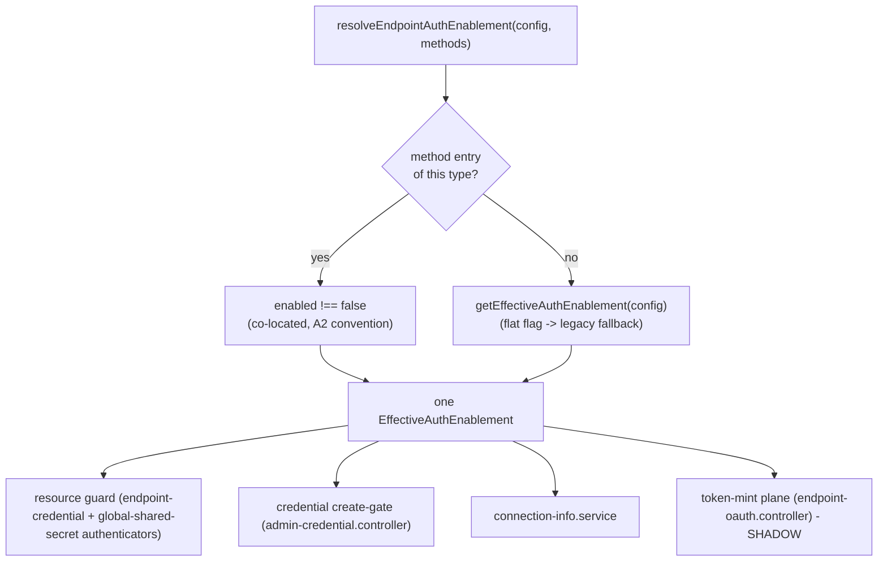

# W2.5 implementation report - per-method auth-enablement consolidation

Status: DELIVERED (api v0.54.68, `feat/wif`). Implements Wave 2 item **W2.5** from
[AUTH_CONSOLIDATED_DELIVERY_PLAN.md](AUTH_CONSOLIDATED_DELIVERY_PLAN.md), per the design
recommended in [WAVE2_DESIGN_ANALYSIS.md](WAVE2_DESIGN_ANALYSIS.md) section 7 (Option A -
explicit `enabled` per `AuthenticationMethod`, both planes read one source, value-preserving).

## 1. The problem (design 7.1)

Auth enablement was resolved from a family of overlapping flat flags
(`getEffectiveAuthEnablement`: `SecretTokenBearerAuthEnabled` /
`OAuthClientCredentialsAuthEnabled` / `SharedSecretBearerAuthEnabled`, each falling back to
the legacy umbrella `PerEndpointCredentialsEnabled`), while the discovery layer (A2) read a
DIFFERENT source - the co-located `profile.authentication.methods[]` A0 model. Two sources
for one fact means "advertised" and "enforced" can drift. Worse, the token-**mint** plane
consulted NEITHER: any endpoint with an `oauth_client` credential minted regardless of
enablement, so "enabled" meant different things on the resource plane vs the mint plane.

## 2. What shipped

A single resolver, [`resolveEndpointAuthEnablement`](../../api/src/modules/endpoint/endpoint-config.interface.ts),
is now the ONE per-method enablement source every plane consults. For each facet it prefers
an explicit `profile.authentication.methods[]` entry of the corresponding `type`
(`bearer` -> `secretTokenBearer`, `oauth-client` -> `oauthClientCredentials`,
`shared-secret` -> `sharedSecretBearer`) using the A2 convention (`enabled !== false`), and
falls back to the flat-flag `getEffectiveAuthEnablement` when no such entry exists.

**Value-preserving.** `profile.authentication.methods[]` is NEVER auto-seeded
(`expandAuthentication` only runs on an operator-supplied `authentication` block), so every
endpoint that has not been managed through the A1 authentication-method API has no method
entries and resolves to the EXACT flat-flag values it does today. Co-location takes effect
only for endpoints an operator explicitly configured through the A1 model - that model's
stated purpose.

### 2.1 Mint plane - shadow-first (design 7.4)

Fixing the mint-vs-resource asymmetry is a behavior change (an `oauth_client` on a disabled
method would stop minting). Per design 7.4 it ships **shadow-first**: the mint plane now
CONSULTS the same resolver and, when the method is disabled (the disabled-with-credential
state), records a `method_enabled_shadow` fail check on the decision trace + logs a `W2.5
shadow` warning - but STILL mints. This gathers real-traffic evidence so the future
enforcement flip can be validated before it blocks. The shadow read fails OPEN (any endpoint
lookup error is swallowed and never blocks a mint).

## 3. Files

| File | Change |
|---|---|
| [endpoint-config.interface.ts](../../api/src/modules/endpoint/endpoint-config.interface.ts) | NEW `resolveEndpointAuthEnablement` + `AuthMethodEnablementEntry` + facet->type map |
| [authenticators/endpoint-credential.authenticator.ts](../../api/src/modules/auth/authenticators/endpoint-credential.authenticator.ts) | Reads the resolver (per-method bearer/oauth_client gate) |
| [authenticators/global-shared-secret.authenticator.ts](../../api/src/modules/auth/authenticators/global-shared-secret.authenticator.ts) | Reads the resolver (`sharedSecretBearer`) |
| [controllers/admin-credential.controller.ts](../../api/src/modules/scim/controllers/admin-credential.controller.ts) | Create-gate reads the resolver |
| [services/connection-info.service.ts](../../api/src/modules/scim/services/connection-info.service.ts) | Assembler reads the resolver; input widened to carry `authentication.methods` |
| [controllers/endpoint-oauth.controller.ts](../../api/src/modules/scim/controllers/endpoint-oauth.controller.ts) | Mint plane SHADOW read (optional `EndpointService`) |
| 4 spec files | +12 unit tests (resolver 7, mint shadow 2, plus consumer regressions) + 3 E2E co-location tests |

## 4. Validation matrix

| Gate | Result |
|---|---|
| API TypeScript build | PASS (0 errors) |
| ESLint | PASS (0 errors) |
| `endpoint-config.interface.spec` (resolver) | PASS 351/351 (+7 resolver) |
| `endpoint-oauth.controller.spec` (mint shadow) | PASS 12/12 (+2 shadow) |
| Resource-guard + authenticators + create-gate + connection-info specs | PASS 160/160 |
| Full API unit suite | PASS 143 suites / 4488 tests (4479 + 9) |
| Auth E2E (inmemory) | PASS 7 suites / 82 |
| `per-endpoint-credentials` E2E (co-location) | PASS 27/27 (+3 co-location) |
| Live-test | +section `9z-BV` (co-location on the wire) |

The E2E co-location test is the end-to-end proof: an endpoint with the flat flag ON
authenticates a per-endpoint bearer, then an explicit `{ type: 'bearer', enabled: false }`
added via the A1 API refuses the SAME bearer (disabled-with-credential honored), while an
endpoint with no method entries still authenticates via the flat flag (value-preserving).

## 5. Execution issues + RCA

| # | Type | Severity | Symptom | Root cause | Fix | Prevention |
|---|---|---|---|---|---|---|
| W2.5-01 | Test edit | Low | `endpoint-oauth.controller.spec` failed to compile (`TS1128`) after inserting the shadow tests | The insertion consumed the following `it(...)` header, leaving its body dangling | Restored the dropped `it('WI-D4: ...')` header | Prefer inserting a whole `it` block bounded by its own braces; re-run the suite immediately after an insert |

## 6. Design & Architecture gate disposition

| Check | Finding | Disposition |
|---|---|---|
| SRP | One small pure resolver owns enablement resolution; consumers just call it | **Applied** |
| Coupling | Resolver takes a structural `AuthMethodEnablementEntry[]` (no `endpoint-profile` import), avoiding a module cycle | **Applied** |
| Pattern fit | Co-locates enablement on the A0 `AuthenticationMethod` (Option A), reuses the existing backbone (no new DSL) | **Applied** |
| Open/Closed | A new method's enablement is a new `type` in the facet map + a method entry, not scattered flag edits | **Applied** |
| Simplicity (YAGNI) | 3 facets only; NO `wif` facet added (WIF stays credential-presence-based); NO enforcement flip; NO flag deletion | **Applied** (scope held to value-preserving core) |
| Mint behavior change | Shipped SHADOW (non-blocking) per design 7.4 | **Applied** (shadow) + **scheduled** (flip) |
| Legacy flag retirement | `PerEndpointCredentialsEnabled` reduced to a single read site (inside `getEffectiveAuthEnablement`, the resolver's fallback); not deleted | **Scheduled** (see 7) |

## 7. Scheduled follow-up (DA-gate disposition (b))

The genuinely destructive / behavior-changing remainder of the design is deferred as ONE
cohesive follow-up so it can be shadow-verified first:

- **Materialize + retire `PerEndpointCredentialsEnabled`** - a value-preserving data
  migration that writes each endpoint's effective per-method value into explicit method
  entries, then removes the legacy umbrella read entirely. Requires a Prisma migration +
  InMemory parity + shadow verification against prod data.
- **Flip the mint plane from shadow to enforce** - after the `method_enabled_shadow` trace
  data confirms no legitimate mint would be blocked.
- **Gate OAuth metadata (W0.3) on enablement** - advertise only `ACTIVE` (enabled AND
  has-cred) methods, flipping together with the mint enforcement so advertised == enforced
  == minted end-to-end.
- **WIF explicit enable** - give WIF an `enabled` (default true-when-a-trust-exists) so all
  methods share the model.

## 8. Change log

| Version | Change |
|---|---|
| 0.54.68 | W2.5: single `resolveEndpointAuthEnablement` co-locating per-method enablement on `profile.authentication.methods[]` (value-preserving fallback to the flat flags); resource guard + create-gate + connection-info unified on it; mint plane consults it in SHADOW (non-blocking, design 7.4). +7 resolver unit + 2 mint-shadow unit + 3 co-location E2E + live-test `9z-BV`. Legacy-flag retirement + mint enforcement flip + metadata gating scheduled as a value-preserving follow-up. |
