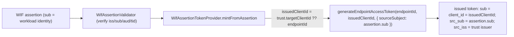

# W3.2 implementation report - issued-token identity separation (fix AT2 conflation)

Status: DELIVERED (api v0.54.76, `feat/wif`). Implements Wave 3 item **W3.2** from
[AUTH_CONSOLIDATED_DELIVERY_PLAN.md](AUTH_CONSOLIDATED_DELIVERY_PLAN.md). Stops assigning the
federated assertion subject to the issued token's `client_id`, keeping the OAuth client
identity and the RFC 7523 assertion principal as separate values.

## 1. The bug

When an endpoint minted its token from a WIF (RFC 7523 `jwt-bearer`) assertion, the provider
passed the assertion's `sub` (the Entra workload identity's object id) straight into
`generateEndpointAccessToken` as the `clientId`, which the OAuth service then stamped as BOTH
the issued token's `sub` AND `client_id`:

```text
assertion.sub (federated workload identity)  ->  issued token.sub == issued token.client_id
```

This conflates two identities RFC 6749 + RFC 7523 keep distinct:

- The **OAuth client** the token represents (`client_id`) - in SCIMServer's model, the
  endpoint's own client identity.
- The **federated assertion principal** (`sub`) presented once at the token endpoint to
  authenticate, which never rides the SCIM calls.

It also made the per-endpoint OAuth AS metadata **untruthful**: the discovery document already
advertised `x_scimserver_wif_profiles[0].client_id_binding: 'target-client-id'` +
`assertion_subject_binding: 'independent'`, but the runtime did the opposite.

## 2. The fix (additive, non-breaking)



- **New optional trust field `targetClientId`** (all public, additive on the `wif`
  `EndpointCredential.metadata`). When set, it is the OAuth client id the issued token is
  minted as. When absent, the mint falls back to the **endpointId** - the same stable
  per-endpoint identity that is already the default `oauth_client` `client_id`.
- **The issued token never carries the assertion subject as `client_id`/`sub`.** The
  federated subject is preserved as a distinct `src_sub` claim (sibling of the existing
  `src_iss`) for attribution only.
- Existing trusts (no `targetClientId`) keep working - their issued client identity moves
  from the (leaked) assertion subject to the stable endpointId, which is the correct value.

**Why it is safe.** On the resource-access path the issued token is authorized by its
`endpoint_id` claim ([oauth-jwt.authenticator.ts](../../api/src/modules/auth/authenticators/oauth-jwt.authenticator.ts) lines 76-79);
the `client_id`/`sub` claims are used only for log enrichment (`authClientId`, lines 117-119),
not for any authorization decision. Changing the issued client identity therefore cannot
change what a token is allowed to do.

## 3. Files

| File | Change |
|---|---|
| [oauth.service.ts](../../api/src/oauth/oauth.service.ts) | `generateEndpointAccessToken` gains a `sourceSubject?` option; stamps a distinct `src_sub` claim when present. `sub`/`client_id` remain the passed `clientId`. |
| [wif-assertion-validator.service.ts](../../api/src/oauth/wif-assertion-validator.service.ts) | `WifTrust` gains optional `targetClientId`. |
| [wif-assertion-token.provider.ts](../../api/src/modules/scim/controllers/wif-assertion-token.provider.ts) | `mintFromAssertion` issues `trust.targetClientId ?? endpointId` as the client id (was `String(claims.sub)`) and passes `sourceSubject: String(claims.sub)`. `buildTrust` reads `targetClientId`. |
| [admin-credential.controller.ts](../../api/src/modules/scim/controllers/admin-credential.controller.ts) | `WifTrustInput` + `WIF_TRUST_KEYS` accept the public `targetClientId`. |

## 4. Tests

| Layer | Coverage |
|---|---|
| Unit | `oauth.service.spec` +2 (stamps `src_sub` distinct from `sub`/`client_id`; omits it without `sourceSubject`); `wif-assertion-token.provider.spec` +1 (explicit `targetClientId` is the issued client id) + 2 existing tests corrected to assert the endpoint's own identity, never the assertion sub. |
| E2E | `wif-assertion.e2e-spec` mint test strengthened (issued `sub`/`client_id` == endpointId, `!= SUBJECT`, `src_sub == SUBJECT`) + 1 new (explicit `targetClientId` -> issued client id == it). |
| Live | `scripts/live-test.ps1` new section **9z-BX** (WIF trust with explicit `targetClientId` persists with no secret leak; per-endpoint metadata truthfully advertises `client_id_binding: target-client-id` + `assertion_subject_binding: independent`). The accept-path mint needs a real IdP-signed assertion (E2E-only via a mocked JWKS). |

Full API unit 145 suites / 4514; API E2E 84 / 1407; ESLint 0 errors.

## 5. Design & Architecture gate disposition

- **SRP / coupling:** no new class; one additive field + one additive option threaded through
  the existing validator -> provider -> oauth-service seam. No god-class growth.
- **Pattern consistency:** follows the existing `wif` metadata + `WifTrust` build pattern and
  the existing `src_iss` source-attribution claim (adds the sibling `src_sub`).
- **Open/Closed + YAGNI:** did NOT introduce the full `WifTrustV2` versioned aggregate or the
  7-state reversible migration state machine (W3.1). Those are **scheduled** (disposition b) -
  no production trust data needs a reversible migration yet (WIF trusts are freshly-created
  flexible JSON; no auto-seeded data per W2.5). The single additive field `targetClientId` is
  the minimal change that fixes the conflation. The `WifTrustV2` model is warranted only when a
  second consumer (RFC 8693, W4) needs the richer shape.
- **Disposition:** (a) applied in this commit chain (the fix) + (b) scheduled (the full
  `WifTrustV2` migration machine, W3.1).

## 6. Related items (Wave 3 scope decision, operator-absent)

- **W3.3 (remove endpoint-UUID audience default): DEFERRED.** The endpointId audience default
  is a documented operator decision ([CONNECTION_INFO_AND_ENTRA_SETUP.md](CONNECTION_INFO_AND_ENTRA_SETUP.md):
  "Audience = endpointId (operator decision)... blocks cross-endpoint token replay"). Reversing
  it requires operator confirmation; not done here.
- **W3.4 (SuccessFactors `resource` policy): separate commit.**
