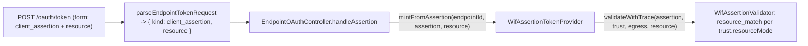

# W3.4 implementation report - RFC 8707 `resource` policy (SAP SuccessFactors)

Status: DELIVERED (api v0.54.77, `feat/wif`). Implements Wave 3 item **W3.4** from
[AUTH_CONSOLIDATED_DELIVERY_PLAN.md](AUTH_CONSOLIDATED_DELIVERY_PLAN.md). Makes a WIF trust able
to enforce the RFC 8707 `resource` request indicator (which SAP SuccessFactors sends), while
keeping the legacy accept-anything behavior the default.

## 1. What shipped

A new per-trust `resourceMode` (all public, additive on the `wif` `EndpointCredential.metadata`)
governs how the RFC 8707 `resource` form parameter is checked against the trust's existing
`expectedResource`:

| `resourceMode` | resource absent | resource present + match | resource present + mismatch |
|---|---|---|---|
| `ignore` (default, legacy) | accept | accept | accept + advisory shadow log |
| `optionalExact` | accept | accept | **reject** `wif_resource_mismatch` |
| `requiredExact` | **reject** `wif_resource_required` | accept | **reject** `wif_resource_mismatch` |

The `resource` is a REQUEST parameter (not an assertion claim), so it is threaded from the token
request through to the validator and checked there right after the tenant check, producing a
`resource_match` entry in the same decision trace as the other claim checks.

## 2. Files

| File | Change |
|---|---|
| [wif-assertion-validator.service.ts](../../api/src/oauth/wif-assertion-validator.service.ts) | `WifTrust` gains `resourceMode`; `validate`/`validateWithTrace`/`runChecks` take an optional `requestResource`; new `resource_match` check enforces the policy + advisory shadow log under `ignore`. |
| [wif-assertion-token.provider.ts](../../api/src/modules/scim/controllers/wif-assertion-token.provider.ts) | `mintFromAssertion` takes an optional `requestResource` and threads it to the validator; `buildTrust` reads `resourceMode` (default `ignore`). |
| [assertion-token-provider.ts](../../api/src/modules/scim/controllers/assertion-token-provider.ts) | `IAssertionTokenProvider.mintFromAssertion` gains the optional `requestResource`. |
| [endpoint-token-request.types.ts](../../api/src/modules/scim/controllers/endpoint-token-request.types.ts) | `resource` added to `RawEndpointTokenRequest` + the `client_assertion` variant. |
| [endpoint-token-request-parser.ts](../../api/src/modules/scim/controllers/endpoint-token-request-parser.ts) | Captures the `resource` form field on the `client_assertion` variant. |
| [endpoint-oauth.controller.ts](../../api/src/modules/scim/controllers/endpoint-oauth.controller.ts) | `EndpointTokenRequest` gains `resource`; `handleAssertion` passes `parsed.resource` to the provider. |
| [admin-credential.controller.ts](../../api/src/modules/scim/controllers/admin-credential.controller.ts) | `WifTrustInput` + `WIF_TRUST_KEYS` accept the public `resourceMode`. |

## 3. Tests

| Layer | Coverage |
|---|---|
| Unit | `wif-assertion-validator.service.spec` +6 (ignore accepts a mismatch; requiredExact rejects missing + rejects mismatch + accepts exact; optionalExact accepts missing + rejects mismatch); `endpoint-token-request-parser.spec` +1 (captures `resource`); `wif-assertion-token.provider.spec` +1 (threads `resource` to the validator); `endpoint-oauth.controller.spec` +1 (threads `resource` to the provider) + 1 arity fix. |
| E2E | `wif-assertion.e2e-spec` +2 (`requiredExact`: 401 missing -> 401 wrong -> 200 exact; `ignore` accepts a mismatched resource). |
| Live | `scripts/live-test.ps1` new section **9z-BY** (a trust with `resourceMode: requiredExact` + `expectedResource` persists on the wire, no secret leak). The accept/reject enforcement runs after signature + claim validation, so it needs a real IdP-signed assertion (E2E-only via a mocked JWKS). |

Full API unit 145 suites / 4523; API E2E 84 / 1409; ESLint 0 errors.

## 4. Design & Architecture gate disposition

- **SRP / coupling:** no new class; one additive field + one optional param threaded through the
  existing parser -> controller -> provider -> validator seam; the `resource_match` check sits in
  the existing ordered decision trace next to `audience_match`/`tenant_match`.
- **Pattern consistency:** mirrors the existing advisory/enforced posture of the `required_roles`
  check (advisory-by-default with an opt-in strict mode), and reuses the existing `expectedResource`
  field rather than inventing a new structure.
- **Open/Closed + YAGNI:** three finite typed modes, not a policy DSL. Default `ignore` preserves
  every existing trust's behavior byte-for-byte. Did not build the `WifTrustV2` aggregate (W3.1,
  scheduled).
- **Disposition:** (a) applied in this commit chain.

## 5. Dev validation (v0.54.77, revision `vba599280`)

Deployed to `scimserver-dev` (ACR-import-from-GHCR -> containerapp update). Live-test vs dev
**1,327/1,327 PASS** (0 fail) including the new **9z-BY** section 4/4 on the wire (a `requiredExact`
trust persists `resourceMode` + `expectedResource` with no secret leak). Playwright vs dev
**194 passed / 5 skipped / 0 failed** (no web change this wave). The accept/reject enforcement is
covered by the E2E (mocked JWKS) since it needs a real IdP-signed assertion.
