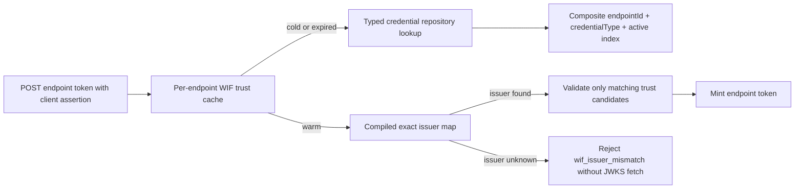

# W3.5 implementation report - WIF trust cache, typed lookup, and index

Status: LOCAL IMPLEMENTATION COMPLETE. Implements Wave 3 item **W3.5** from
[AUTH_CONSOLIDATED_DELIVERY_PLAN.md](AUTH_CONSOLIDATED_DELIVERY_PLAN.md).

## 1. What shipped

WIF token minting no longer loads every active bearer, OAuth client, and WIF
credential for an endpoint. The provider now reads a bounded per-endpoint cache
backed by `findActiveByEndpointAndType(endpointId, 'wif')`.

### Repository and database

- `IEndpointCredentialRepository` now exposes
  `findActiveByEndpointAndType(endpointId, credentialType)`.
- Prisma and InMemory implementations share endpoint, type, active, and expiry
  semantics.
- Migration `20260916035422_add_endpoint_credential_type_active_index` adds
  `EndpointCredential(endpointId, credentialType, active)`.
- The migration is strictly additive. A fresh PostgreSQL 17 replay applied all
  20 migrations and retained the existing `CredentialDek_active_idx` and
  `RequestLog_authOutcome_idx` indexes.

### Cache behavior

- Cold reads compile active WIF rows into an exact `expectedIssuer` map.
- Warm reads do not call the repository.
- Concurrent cold reads for one endpoint share one pending load.
- A generation token prevents an in-flight stale read from repopulating the
  cache after invalidation.
- Entries refresh at the earlier of the configured TTL or the earliest
  credential `expiresAt`.
- The cache is LRU-bounded so arbitrary endpoint IDs cannot grow process memory
  without limit.
- Successful WIF create, metadata edit, label edit, deactivate, reactivate, and
  saved-trust verification writes invalidate the endpoint entry. Endpoint
  deletion invalidates through the existing committed event.

### Runtime settings

| Environment key | Default | Bounds | Purpose |
|---|---:|---:|---|
| `WIF_TRUST_CACHE_TTL_MS` | `30000` | `1000` - `300000` | Bounds cache age and the cross-replica stale window. |
| `WIF_TRUST_CACHE_MAX_ENDPOINTS` | `256` | `16` - `10000` | Bounds per-process endpoint entries. |

Both values appear in `GET /scim/admin/runtime-config` with effective value,
source, bounds, and clamp status through the existing runtime-config registry.

## 2. Issuer selection contract

A decoded JWT issuer is an unverified routing hint, never an authorization
result. It selects only cached credentials whose `expectedIssuer` is exactly
identical and whose profile enables RFC 7523. Every selected candidate still
performs signature, algorithm, issuer, subject, audience, tenant, role, and
resource validation.

An issuer absent from the compiled map returns `wif_issuer_mismatch` before the
validator runs. This prevents an assertion from making the server fetch JWKS
for unrelated configured identity providers. Assertions whose issuer cannot be
decoded retain the existing fail-closed iteration so malformed-token diagnostics
remain precise. Multiple trusts with the same issuer remain supported for the
slice-dependent audience runbook.

## 3. Test coverage

| Layer | Coverage |
|---|---|
| Unit | Typed Prisma query shape; InMemory filter parity; warm read; explicit invalidation; in-flight invalidation race; credential expiry; LRU bound; endpoint deletion; exact issuer routing; zero-validator unknown issuer; all controller invalidation paths; schema index guards. |
| API E2E | Full 37-test WIF assertion spec, including zero mocked-JWKS calls for unknown issuer and create/revoke/reactivate/edit cache lifecycle through HTTP. |
| Live | Existing `9z-AT.T5` now requires `401 wif_issuer_mismatch` for a decodable unknown issuer, proving the deployed early-rejection contract. |
| Migration | Full 20-migration replay against disposable PostgreSQL 17 plus physical verification of all three relevant indexes. |
| Playwright | N/A. W3.5 changes token-mint persistence and caching only; no browser-visible behavior or `web/` file changed. |

Final local validation:

- API unit: **4,922/4,922** across **173 suites**.
- API E2E: **1,521/1,521** across **96 suites**; six-mode matrix passes on
  InMemory and Prisma.
- Full WIF HTTP E2E: **37/37 passed**.
- Local live integration: **1,484/1,484 passed**, including `9z-AT.T5`,
  `9z-BZ.T6`, `9z-BZ.T13`, and `9z-BZ.T14`.
- Web Vitest **1,302/1,302** and coverage gate pass unchanged.
- API TypeScript build and ESLint: zero errors; no warnings in changed files.
- Prisma validate/generate: pass; migration linter: **20/20 passed**.
- Documentation: freshness/content pass; **702/702** Mermaid blocks render in
  light and dark themes.

## 4. Design and architecture disposition

- **SRP:** applied. Cache loading, compilation, expiry, capacity, and invalidation
  live in one small service; the provider remains the protocol orchestrator.
- **Coupling:** applied. The endpoint module publishes its existing deletion
  event; it does not import SCIM cache internals. Credential controllers call
  one invalidation method only after persistence succeeds.
- **Pattern consistency:** applied. Runtime values use the existing bounded,
  provenance-aware registry. Persistence uses the existing repository token.
- **Open/Closed:** applied. A future RFC 8693 provider can consume the same
  cached trust set and select its own profile without changing repository code.
- **YAGNI:** accepted. No distributed cache or invalidation bus was added while
  every current estate runs one replica. The TTL bounds staleness if replica
  count changes; a distributed invalidation mechanism becomes justified only
  with a real multi-replica deployment.

## 5. Self-improvement disposition

- **Applied:** required-schema constraints now protect the two historical indexes
  that were present in migrations but absent from `schema.prisma`. This prevents
  a future generated migration from silently dropping them.
- **Applied:** the cache race, capacity, and expiry tests cover failure classes
  that a happy-path warm-read test would miss.
- **Applied:** fresh-database migration replay checks physical indexes rather
  than trusting migration status alone.

## 6. Consolidation boundary and continuation

W3.5 is the complete rollback/review unit. RFC 8693, gate deduplication, global
instruction splitting, CI concurrency, and immutable-digest workflow redesign
must not enter this release diff. The adopted process and exact fresh-session
prompt remain separate process-policy work.

Consolidation continues on the existing `feat/wif` branch per operator choice.
The next session reviews and stages the complete W3.5 worktree, commits, pushes
under Validate pre-push, and opens a new PR to `master`. Deployment begins only
after merge and uses the merged-master exact-SHA pipeline.
