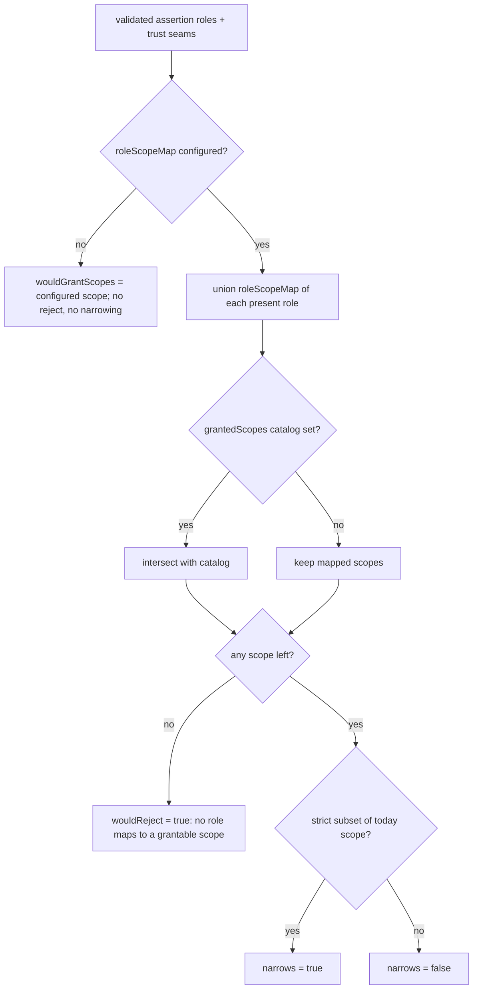

# A4 - identity / role / scope seams (inert) + shadow authorization telemetry

> Step 11 (final build step) of the reconciled authentication build (`docs/auth/AUTHENTICATION_ARCHITECTURE.md` section 13). Wires the per-endpoint authorization seams (`identityModel`, `roleScopeMap`, `grantedScopes`, `roleEnforcement`) with enforcement deliberately OFF, plus the "would-have-rejected" shadow telemetry that lets an operator see the impact of turning enforcement on BEFORE flipping it.

## 1. What A4 adds (and deliberately does not)

A4 is INERT by design - like A0, it stores and computes but does not yet enforce. It adds the data + observability foundation for a future role -> scope authorization layer on the WIF flow, without changing what any request is granted today.

| Adds | Enforces? |
|---|---|
| `identityModel` (`per-app` \| `first-party`) seam on the WIF trust | No - telemetry attribution only |
| `roleScopeMap` (role -> scopes) seam | No - computed in shadow, never applied |
| `grantedScopes` (catalog subset) seam | No - computed in shadow, never applied |
| `roleEnforcement` (`off` \| `shadow` \| `enforce`) seam | No - A4 ships `off`; the other modes are seams |
| "Would-have-rejected" shadow telemetry | Computed + logged, never enforced |

The minted token is exactly what Q6 mints: the configured `scope`, the configured ttl. A4 only adds a log line recording what a future enforcement flip would have done.

## 2. The shadow decision (pure + inert)

[wif-shadow-telemetry.ts](../../api/src/oauth/wif-shadow-telemetry.ts) exports `computeShadowDecision(input)` - a pure function whose `enforced` field is hard-coded `false` so a reader can never mistake the shadow result for an applied decision:



| Field | Meaning |
|---|---|
| `wouldReject` | Whether the future role -> scope gate WOULD have rejected (no present role maps to a grantable scope). |
| `wouldGrantScopes` | The scopes the future gate WOULD grant (`roleScopeMap` ∩ `grantedScopes`). |
| `narrows` | Whether the future grant is a strict subset of today's blanket scope. |
| `identityModel` | Recorded for telemetry attribution (`per-app` default). |
| `enforced` | ALWAYS `false` in A4. |

## 3. Where the shadow runs

[WifAssertionTokenProvider.mintFromAssertion](../../api/src/modules/scim/controllers/wif-assertion-token.provider.ts) computes and logs the shadow decision AFTER the token is already minted, so it can never affect issuance:

```
validate assertion (Q6.3)
  -> mint endpoint token with configured scope/ttl (Q6.4)   <- the authoritative grant
  -> computeShadowDecision(...) + log "WIF shadow authorization decision (not enforced)"   <- A4, inert
  -> return the minted token
```

The shadow log line carries `wouldReject`, `reason`, `wouldGrantScopes`, `narrows`, `identityModel`, `roleEnforcement`, and `enforced:false` (`LogCategory.AUTH`). This is the safe-rollout signal: an operator watches it to learn whether flipping `roleEnforcement` on would break a live customer.

## 4. Persistence

The four seams ride the existing `wif` `EndpointCredential.metadata` (no new column, no secret). They are added to the `WIF_TRUST_KEYS` allowlist in [admin-credential.controller.ts](../../api/src/modules/scim/controllers/admin-credential.controller.ts) so they persist and round-trip, and read back defensively in the provider's `buildTrust`. The `roleScopeMap` write path is guarded against prototype pollution via `isUnsafeObjectKey` (CWE-1321).

## 5. Test coverage

| Layer | File | Count |
|---|---|---|
| Unit - shadow | [wif-shadow-telemetry.spec.ts](../../api/src/oauth/wif-shadow-telemetry.spec.ts) | 9 |
| Unit - provider (inert emit) | [wif-assertion-token.provider.spec.ts](../../api/src/modules/scim/controllers/wif-assertion-token.provider.spec.ts) | 1 added |
| Live | `scripts/live-test.ps1` section 9z-AU | 5 |

The headline A4 assertion (in both the shadow spec and the provider spec): the shadow gate is COMPUTED but the token is STILL minted when it would reject - `enforced` is always `false`.

## 6. Architecture references

- `docs/auth/AUTHENTICATION_ARCHITECTURE.md` section 11 (Observability) - "Would-have-rejected shadow counter" + counters keyed by `(type, version, identityModel, outcome)`.
- `docs/auth/AUTHENTICATION_ARCHITECTURE.md` section 3.1 - the per-app vs first-party identity-model axis.
- A4 is the inert sibling of A0 (the authentication-methods model): both store + compute without enforcing, leaving a future step to flip enforcement on behind the seam.
