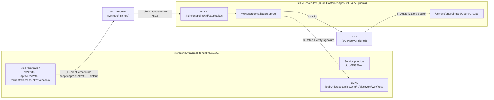
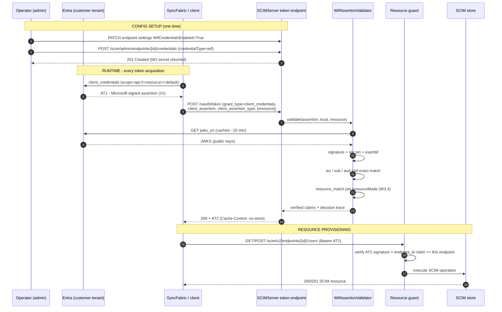
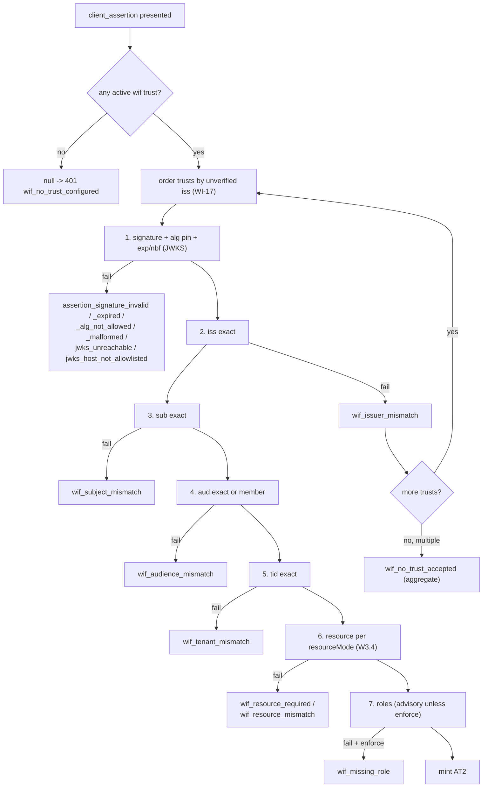
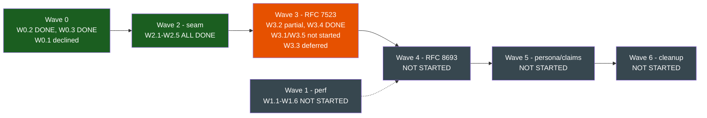
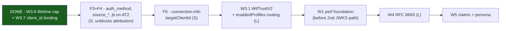

# WIF end-to-end proof + auth-method reference (real Entra evidence)

> **Status:** Proven against **api v0.54.77** on the Azure dev deployment, 2026-07-27, using a
> **real Microsoft Entra application registration** in tenant `f08e6aff-ca0f-4f11-81fa-1ffd43323373`.
> Every request, response, header and decoded token in this document is a **verbatim capture** from
> that run - nothing here is illustrative or hand-written. Harness:
> [scripts/wif-e2e-proof.ps1](../../scripts/wif-e2e-proof.ps1). Raw log: `test-results/wif-proof-dev.log`.
>
> **Result: 39/39 assertions passed, 8 gap findings recorded.** WIF works end to end today -
> config setup, trust establishment, token mint, and real SCIM resource provisioning - and the
> Wave 3 (W3.2 + W3.4) changes are confirmed correct on the wire against a genuine
> Microsoft-signed assertion. The 8 findings are the remaining delta to the SyncFabric guide.
>
> **Two of those findings were HIGH severity and are now FIXED in v0.54.78:**
> [F1](#f1-at2-outlives-the-assertion-that-authorized-it-high---fixed-in-v05478-w36) (a minted token
> could outlive its authorizing assertion by ~5 hours) shipped as **W3.6**, and
> [F2](#f2-the-form-client_id-is-not-bound-to-the-trust-high---fixed-in-v05478-w37) (an advertised
> but unenforced `client_id` binding) shipped as **W3.7**. The harness now gates both.

---

## 1. What was actually proven

The question this document answers is: *with the Wave 3 changes, does WIF work at all levels -
config setup, trust establishment, and resource provisioning?* The answer is **yes**, and it was
demonstrated with no mocks in the identity path.

| Level | Proven? | Evidence |
|---|---|---|
| **Assertion acquisition** (Entra issues a real workload token) | YES | [Section 6.1](#61-stage-1-acquire-the-real-entra-assertion-at1) - a real `client_credentials` grant against `login.microsoftonline.com` returned an RS256 v2.0 token |
| **Config setup** (endpoint + per-method enablement) | YES | [Section 6.2](#62-stage-2-config-setup--trust-establishment) - `WifCredentialsEnabled=True` gate, then trust create |
| **Trust establishment** (the handshake values) | YES | [Section 6.2](#62-stage-2-config-setup--trust-establishment) - trust persisted from the real assertion's own claims, no secret material in the response |
| **Signature verification against the real IdP** | YES | The mint below only succeeds because SCIMServer fetched Microsoft's live JWKS and verified the signature |
| **Token mint (RFC 7523)** | YES | [Section 6.3](#63-stage-3-the-token-mint-rfc-7523-wire-contract) - HTTP 200 + `Cache-Control: no-store` |
| **Issued-token identity separation (W3.2)** | YES | [Section 6.4](#64-stage-4-the-minted-token-at2-decoded) - `client_id` is the target client, `src_sub` carries the federated subject |
| **Resource provisioning with the minted token** | YES | [Section 6.5](#65-stage-5-real-resource-provisioning-with-at2) - User CREATE/READ/PATCH/FILTER/DELETE + Group CREATE with members |
| **Endpoint scoping (no cross-endpoint replay)** | YES | [Section 6.5](#65-stage-5-real-resource-provisioning-with-at2) - the same token is refused (401) on a different endpoint |
| **Resource policy (W3.4)** | YES | [Section 7.3](#73-rfc-8707-resource-policy-w34) - `requiredExact` rejects missing + mismatched, accepts exact |
| **Negative paths fail closed** | YES | [Section 8](#8-validation-axes--reason-codes) - malformed assertion and wrong audience both rejected with precise reason codes |
| **RFC 8693 token exchange** | NOT IMPLEMENTED (by design, Wave 4) | Cleanly refused with `400 unsupported_grant_type` - not half-open |

---

## 2. The evidence rig



The identity provider is **not mocked**. The only thing the harness controls is the SCIMServer
trust configuration, which is exactly what a real operator controls.

**Reproducing the rig** (the app registration was deleted after the run because it holds a live
client secret):

```powershell
# 1. Create the workload identity (app + SP + identifier URI + v2 tokens)
az ad app create --display-name scimserver-wif-test --sign-in-audience AzureADMyOrg
az ad app update --id <appId> --identifier-uris "api://<appId>"
az rest --method PATCH --uri "https://graph.microsoft.com/v1.0/applications/<objectId>" `
        --headers "Content-Type=application/json" --body '{\"api\":{\"requestedAccessTokenVersion\":2}}'
az ad sp create --id <appId>

# 2. Mint a secret into the shell only (never echo it)
$c = az ad app credential reset --id <appId> --append --display-name wifproof --years 1 --only-show-errors 2>$null | ConvertFrom-Json
$env:WIF_TEST_SECRET = $c.password
$env:WIF_TEST_APPID  = "<appId>"
$env:WIF_TEST_TENANT = $c.tenant

# 3. Run the proof
pwsh -File scripts/wif-e2e-proof.ps1

# 4. Tear down the live credential
az ad app delete --id <appId>
```

---

## 3. The auth-method catalogue - every method as an Entra choice

Microsoft Entra's provisioning blade asks the operator to pick **one authentication method** and
then fill a small set of named fields. This table maps every SCIMServer method to that choice, the
exact Entra field names, the enablement flag that gates it, and its implementation status.

| # | SCIMServer method | Entra auth-method choice | Entra fields the operator fills | Enablement flag | Status |
|---|---|---|---|---|---|
| 1 | **Global shared secret** (bearer) | *Secret Token* | **Tenant URL**, **Secret Token** (= `SCIM_SHARED_SECRET`) | `SharedSecretBearerAuthEnabled` | Shipped |
| 2 | **Per-endpoint bearer** (secret token) | *Secret Token* | **Tenant URL**, **Secret Token** (the one-time `token`) | `SecretTokenBearerAuthEnabled` | Shipped |
| 3 | **Per-endpoint OAuth2 client credentials** | *OAuth2 client credentials grant* | **Tenant URL**, **Token Endpoint**, **Client Identifier**, **Client Secret** | `OAuthClientCredentialsAuthEnabled` | Shipped ([Section 7.5](#75-the-sibling-method-oauth2-client-credentials)) |
| 4 | **WIF / RFC 7523 `jwt-bearer`** | *Workload Identity based authentication* | **Tenant URL**, **Token Endpoint**, **Client identifier** (see [F5](#f5-connection-info-projects-the-assertion-subject-as-the-entra-client-identifier-medium)) | `WifCredentialsEnabled` | **Shipped + proven here** |
| 5 | **WIF / RFC 8693 token exchange** | (SyncFabric-internal; no `client_id` sent) | n/a - SyncFabric config, not an Entra blade field | `WifCredentialsEnabled` | **Wave 4 - not implemented** |
| 6 | `private_key_jwt` / mTLS / DPoP | n/a | n/a | n/a | Wave 6.2 - future track |

**The load-bearing distinction** between methods 3 and 4: with **OAuth2 client credentials** the
ISV issues the customer a `client_secret` that the customer stores. With **WIF** there is **no
shared secret at all** - the customer's Entra tenant signs an assertion, SCIMServer verifies it
against Microsoft's published keys, and SCIMServer mints its own short-lived token. That is why
the WIF trust-create response contains **no secret** (proven in [Section 6.2](#62-stage-2-config-setup--trust-establishment))
and why `clientSecretState` is `"none"` in connection-info.

---

## 4. WIF variation matrix

The guide defines several WIF variations. They differ **on the wire**, so they are genuinely
separate auth-method choices rather than settings of one method.

| Variation | `grant_type` | Assertion field | Sends form `client_id`? | Extra fields | SCIMServer status |
|---|---|---|---|---|---|
| **RFC 7523 `jwt-bearer`** (`syncfabric-rfc7523`) | `client_credentials` | `client_assertion` + `client_assertion_type` | **Yes** (guide 7.1) | `scope` (optional) | **Implemented + proven** |
| **RFC 7523 + SuccessFactors `resource`** | `client_credentials` | `client_assertion` + `client_assertion_type` | Yes | **`resource`** (RFC 8707) | **Implemented (W3.4)** |
| **RFC 8693 token exchange** (`syncfabric-rfc8693`) | `urn:ietf:params:oauth:grant-type:token-exchange` | `subject_token` + `subject_token_type` | **No** (deliberately omitted, guide 7.2) | `audience`, `scope`, `requested_token_type` | **Not implemented (Wave 4)** |
| **Google Workspace second hop** | n/a - a downstream Google IAM call after the 8693 exchange | n/a | n/a | n/a | Out of scope (guide 7.3) |
| **Customer-application identity model** | (orthogonal) | `azp` = the customer's calling app | - | - | Supported by config; claim binding is `sub`-only today |
| **First-party identity model** | (orthogonal) | `azp` = the fixed 1P app id | - | - | Supported by config; `azp`/`oid` not yet enforced (Wave 5.2) |

**The variation-routing gap:** the trust already stores an `assertionProfile` field with values
`jwt-bearer` or `token-exchange`, but nothing routes on it - see
[F6](#f6-assertionprofile-is-stored-but-never-routed-on-medium).

---

## 5. The complete flow



---

## 6. Stage-by-stage wire evidence

### 6.1 Stage 1 - acquire the real Entra assertion (AT1)

```http
POST /f08e6aff-ca0f-4f11-81fa-1ffd43323373/oauth2/v2.0/token HTTP/1.1
Host: login.microsoftonline.com
Content-Type: application/x-www-form-urlencoded

grant_type=client_credentials&client_id=c8242cf6-29d0-4fc4-90cc-bad7449545ad&client_secret=<elided>&scope=api%3A%2F%2Fc8242cf6-29d0-4fc4-90cc-bad7449545ad%2F.default
```

The **real** JOSE header Entra returned:

```json
{
  "typ": "JWT",
  "alg": "RS256",
  "kid": "aFkmKVFc-4WV6sXCBvNZkXI505Y"
}
```

The **real** decoded AT1 claim set (diagnostics only; decoding proves nothing - guide 8.5):

```json
{
  "aud": "c8242cf6-29d0-4fc4-90cc-bad7449545ad",
  "iss": "https://login.microsoftonline.com/f08e6aff-ca0f-4f11-81fa-1ffd43323373/v2.0",
  "iat": 1785194550,
  "nbf": 1785194550,
  "exp": 1785198450,
  "aio": "k2FgYPBzP/FMtMDofqbO8Qtz878cO64h+F6e+W1EhU91+Kmj58MA",
  "azp": "c8242cf6-29d0-4fc4-90cc-bad7449545ad",
  "azpacr": "1",
  "oid": "d085870e-ffe1-45c1-bc6d-4f793f1fd09f",
  "rh": "1.AW8B_2qO8A_KEU-B-h_9QzIzc_YsJMjQKcRPkMy610SVRa0AAABvAQ.",
  "sub": "d085870e-ffe1-45c1-bc6d-4f793f1fd09f",
  "tid": "f08e6aff-ca0f-4f11-81fa-1ffd43323373",
  "uti": "cco-NSNLc0Gud0TtH_kiAA",
  "ver": "2.0",
  "xms_ftd": "fpjG4nDnktcLbCQ6WJDO6Dwp1E0GQVpg-aTpUMEyEwABdXN3ZXN0My1kc21z"
}
```

**This is the empirical claim-shape evidence the delivery plan lists as a blocking gate.** Key
observations against the guide's predicted shape:

| Claim | Present? | Note |
|---|---|---|
| `iss` | Yes | `.../v2.0` form, so the v2.0 JWKS path applies |
| `sub` | Yes | Equals `oid` for an app-only token (no user context) |
| `oid` | Yes | The service principal object id in the tenant |
| `azp` | Yes | The calling application id (the first-party/customer discriminator) |
| `azpacr` | Yes | `"1"` = the client authenticated with a shared secret |
| `tid` | Yes | Tenant isolation axis |
| `aud` | Yes | The resource app id (a bare GUID here, not the `api://` URI) |
| `ver` | Yes | `"2.0"` |
| `roles` | **No** | No app role was assigned - confirms the guide's "roles advisory until emission is proven" position |
| `jti` | **No** | Entra uses `uti` instead - relevant to any future replay-denylist design |

Note `aud` is the **bare app id GUID**, not `api://<appId>`, even though the scope requested was
`api://<appId>/.default`. An operator who copies the `api://` URI into `expectedAudience` will get
`wif_audience_mismatch`. This is exactly why the guide insists the audience is **observed from a
real token**, not guessed.

### 6.2 Stage 2 - config setup + trust establishment

WIF must first be enabled for the endpoint (the WI-11 per-method enablement gate; a trust create is
refused with 403 otherwise):

```http
PATCH /scim/admin/endpoints/c0b19d83-76e3-4de9-842a-067d636da990 HTTP/1.1
Authorization: Bearer <admin-token>
Content-Type: application/json

{
  "profile": {
    "settings": {
      "WifCredentialsEnabled": "True"
    }
  }
}
```

Then the trust itself. **Every value below is a public, non-secret handshake value taken from the
real assertion:**

```http
POST /scim/admin/endpoints/c0b19d83-76e3-4de9-842a-067d636da990/credentials HTTP/1.1
Authorization: Bearer <admin-token>
Content-Type: application/json
```

```json
{
  "credentialType": "wif",
  "label": "Entra WIF proof",
  "wif": {
    "assertionProfile": "jwt-bearer",
    "expectedIssuer": "https://login.microsoftonline.com/f08e6aff-ca0f-4f11-81fa-1ffd43323373/v2.0",
    "expectedSubject": "d085870e-ffe1-45c1-bc6d-4f793f1fd09f",
    "expectedAudience": "c8242cf6-29d0-4fc4-90cc-bad7449545ad",
    "jwksUri": "https://login.microsoftonline.com/f08e6aff-ca0f-4f11-81fa-1ffd43323373/discovery/v2.0/keys",
    "allowedTenantId": "f08e6aff-ca0f-4f11-81fa-1ffd43323373",
    "scope": "scim.read scim.write",
    "issuedTokenTtlSec": 3600,
    "targetClientId": "scim-wif-client-proof"
  }
}
```

The **real** response (note: `201`, and **no secret material anywhere**):

```json
{
  "id": "2c008ff5-bb19-4695-b69f-0aa7402df84f",
  "endpointId": "c0b19d83-76e3-4de9-842a-067d636da990",
  "credentialType": "wif",
  "label": "Entra WIF proof",
  "active": true,
  "createdAt": "2026-07-27T23:28:03.307Z",
  "expiresAt": null,
  "wif": {
    "assertionProfile": "jwt-bearer",
    "expectedIssuer": "https://login.microsoftonline.com/f08e6aff-ca0f-4f11-81fa-1ffd43323373/v2.0",
    "expectedSubject": "d085870e-ffe1-45c1-bc6d-4f793f1fd09f",
    "expectedAudience": "c8242cf6-29d0-4fc4-90cc-bad7449545ad",
    "jwksUri": "https://login.microsoftonline.com/f08e6aff-ca0f-4f11-81fa-1ffd43323373/discovery/v2.0/keys",
    "allowedTenantId": "f08e6aff-ca0f-4f11-81fa-1ffd43323373",
    "targetClientId": "scim-wif-client-proof",
    "scope": "scim.read scim.write",
    "issuedTokenTtlSec": 3600
  },
  "description": null
}
```

**Field reference for the trust** (all public):

| Field | Meaning | Validation | Required |
|---|---|---|---|
| `expectedIssuer` | The `iss` the assertion must carry | Exact string match | Yes |
| `expectedSubject` | The `sub` the assertion must carry | Exact string match | Yes |
| `expectedAudience` | The `aud` the assertion must carry | Exact, or membership if `aud` is an array | Yes |
| `jwksUri` | Where the signing keys are fetched | Host must be on `JWKS_HOST_ALLOWLIST` (anti-SSRF); https only | Yes |
| `allowedTenantId` | The `tid` the assertion must carry | Exact string match | Yes |
| `requiredRoles` | App roles expected in `roles` | **Advisory** unless `roleEnforcement: "enforce"` | No |
| `scope` | The scope SCIMServer grants in AT2 | Admin-trusted, used verbatim | No |
| `issuedTokenTtlSec` | Requested AT2 lifetime | Clamped to 3600-21600 (see [F1](#f1-at2-outlives-the-assertion-that-authorized-it-high)) | No |
| `targetClientId` | **(W3.2)** the OAuth `client_id` AT2 is minted as | Not validated against the request (see [F2](#f2-the-form-client_id-is-not-bound-to-the-trust-high)) | No - defaults to the endpointId |
| `resourceMode` | **(W3.4)** `ignore` / `optionalExact` / `requiredExact` | Governs the RFC 8707 `resource` check | No - defaults to `ignore` |
| `expectedResource` | The `resource` value required when mode is not `ignore` | Exact string match | Only when `resourceMode != ignore` |
| `roleEnforcement` | `off` / `shadow` / `enforce` | Controls whether `requiredRoles` blocks | No |
| `identityModel` | `per-app` / `first-party` | Telemetry attribution only (inert) | No |

### 6.3 Stage 3 - the token mint (RFC 7523 wire contract)

```http
POST /scim/endpoints/c0b19d83-76e3-4de9-842a-067d636da990/oauth/token HTTP/1.1
Host: scimserver-dev.proudbush-ae90986e.eastus.azurecontainerapps.io
Content-Type: application/x-www-form-urlencoded

grant_type=client_credentials&client_id=scim-wif-client-proof&client_assertion=eyJ0eXAiOiJKV1QiLCJhbGciOiJSUzI1NiIsImtpZCI6ImFGa21LVkZjLTRXVjZzWENCdk5aa1hJNTA1WSJ9.<elided>&client_assertion_type=urn%3Aietf%3Aparams%3Aoauth%3Aclient-assertion-type%3Ajwt-bearer
```

The **real** response status line and headers:

```http
HTTP/1.1 200 OK
Content-Type: application/json; charset=utf-8
Cache-Control: no-store
Pragma: no-cache
```

The **real** response body (`access_token` elided; it was 1046 characters):

```json
{
  "access_token": "<elided - 1046 chars>",
  "token_type": "Bearer",
  "expires_in": 3600,
  "scope": "scim.read scim.write"
}
```

This confirms **W0.2** (HTTP 200 + both cache headers) on the WIF path with a real assertion.

### 6.4 Stage 4 - the minted token (AT2) decoded

The **real** AT2 claim set:

```json
{
  "sub": "scim-wif-client-proof",
  "client_id": "scim-wif-client-proof",
  "aud": "scimserver-scim-api:6c2ac9c5-faac-4965-838d-fb284c88c712",
  "endpoint_id": "6c2ac9c5-faac-4965-838d-fb284c88c712",
  "scope": "scim.read scim.write",
  "token_type": "access_token",
  "src_iss": "https://login.microsoftonline.com/f08e6aff-ca0f-4f11-81fa-1ffd43323373/v2.0",
  "src_sub": "d085870e-ffe1-45c1-bc6d-4f793f1fd09f",
  "iat": 1785194883,
  "exp": 1785198483,
  "iss": "scimserver-oauth-server"
}
```

**This is the W3.2 fix, proven on the wire with a real Entra assertion:**

| Identity | Value | Was (pre-W3.2) |
|---|---|---|
| OAuth client the token represents (`client_id`, `sub`) | `scim-wif-client-proof` | the assertion `sub` (`d085870e-...`) - the conflation bug |
| Federated principal (`src_sub`) | `d085870e-ffe1-45c1-bc6d-4f793f1fd09f` | not present as a distinct claim |
| Source issuer (`src_iss`) | `https://login.microsoftonline.com/f08e6aff-.../v2.0` | present (WI-17) |
| Endpoint scope (`endpoint_id`) | `6c2ac9c5-...` | unchanged |

Claims the guide (section 13.4) specifies that AT2 does **not** yet carry:
`auth_method`, `source_tid`, `source_oid`, `source_azp`, `jti` - see
[F3](#f3-at2-omits-the-guide-134-provenance-claims-medium) and
[F4](#f4-at2-has-no-jti-medium).

### 6.5 Stage 5 - real resource provisioning with AT2

```http
POST /scim/v2/endpoints/6c2ac9c5-faac-4965-838d-fb284c88c712/Users HTTP/1.1
Authorization: Bearer <AT2>
Content-Type: application/scim+json

{
  "schemas": [
    "urn:ietf:params:scim:schemas:core:2.0:User"
  ],
  "userName": "wif.proof.1234567@example.com",
  "name": {
    "givenName": "Wif",
    "familyName": "Proof"
  },
  "active": true,
  "emails": [
    {
      "value": "wif.proof.1234567@example.com",
      "primary": true,
      "type": "work"
    }
  ]
}
```

All of the following executed successfully with the WIF-minted token:

| Operation | Result |
|---|---|
| `POST /Users` (create) | 201 |
| `GET /Users/{id}` (read back) | 200, `userName` matched |
| `PATCH /Users/{id}` (`replace active=false`) | 200, `active` became `false` |
| `GET /Users?filter=userName eq "..."` | 200, `totalResults >= 1` |
| `POST /Groups` (with a member) | 201 |
| `DELETE /Users/{id}` | 204 |
| Same AT2 against a **different** endpoint | **401** - endpoint scoping holds |

The last row is the load-bearing security property: AT2 carries `endpoint_id`, and the resource
guard refuses it anywhere else. Cross-endpoint replay is impossible.

### 6.6 Stage 6 - the discovery document

```http
GET /scim/endpoints/c0b19d83-76e3-4de9-842a-067d636da990/.well-known/oauth-authorization-server HTTP/1.1
```

The **real** RFC 8414 metadata (public, no bearer required):

```json
{
  "issuer": "https://scimserver-dev.proudbush-ae90986e.eastus.azurecontainerapps.io/scim/endpoints/c0b19d83-76e3-4de9-842a-067d636da990",
  "token_endpoint": "https://scimserver-dev.proudbush-ae90986e.eastus.azurecontainerapps.io/scim/endpoints/c0b19d83-76e3-4de9-842a-067d636da990/oauth/token",
  "jwks_uri": "https://scimserver-dev.proudbush-ae90986e.eastus.azurecontainerapps.io/scim/oauth/jwks",
  "grant_types_supported": [
    "client_credentials"
  ],
  "token_endpoint_auth_methods_supported": [
    "private_key_jwt"
  ],
  "scopes_supported": [
    "scim.read",
    "scim.write",
    "scim.manage"
  ],
  "token_endpoint_auth_signing_alg_values_supported": [
    "RS256",
    "ES256"
  ],
  "x_scimserver_wif_profiles": [
    {
      "name": "syncfabric-rfc7523",
      "client_id_binding": "target-client-id",
      "assertion_subject_binding": "independent",
      "resource_parameter_supported": true
    }
  ]
}
```

Two W0.3 truthfulness properties confirmed: `token-exchange` is **absent** (no handler yet), and
`private_key_jwt` appears **only because** this endpoint has an active WIF trust. The
`x_scimserver_wif_profiles` disclosure now tells the truth about the W3.2 binding.

### 6.7 Stage 7 - what the operator sees (connection-info)

```json
{
  "method": "wif",
  "label": "Workload Identity Federation",
  "entraAuthenticationMethod": "Workload Identity based authentication",
  "entraFields": {
    "tenantUrl": "https://scimserver-dev.proudbush-ae90986e.eastus.azurecontainerapps.io/scim/v2/endpoints/c0b19d83-76e3-4de9-842a-067d636da990",
    "tokenEndpoint": "https://scimserver-dev.proudbush-ae90986e.eastus.azurecontainerapps.io/scim/endpoints/c0b19d83-76e3-4de9-842a-067d636da990/oauth/token",
    "clientIdentifier": "d085870e-ffe1-45c1-bc6d-4f793f1fd09f"
  },
  "clientSecretState": "none",
  "expectedAudience": "c8242cf6-29d0-4fc4-90cc-bad7449545ad",
  "credentialId": "e9530cc9-bf3a-456e-b30f-c3aa526a9039",
  "authHealth": {
    "lastOutcome": "accept",
    "lastAttemptAt": "2026-07-27T23:29:27.899Z",
    "lastCorrelationId": "777dc27d-5dfd-45e6-8661-27e3d7974e3c"
  },
  "lastVerifiedAt": null,
  "lastUsedAt": "2026-07-27T23:29:27.899Z",
  "validity": "ok"
}
```

`authHealth.lastOutcome: "accept"` is the live proof that the real assertion authenticated.
`clientIdentifier` is the assertion subject, which is [F5](#f5-connection-info-projects-the-assertion-subject-as-the-entra-client-identifier-medium).

---

## 7. Variation-by-variation results

### 7.1 RFC 7523 `jwt-bearer` (the shipped path)

Proven end to end in [Section 6](#6-stage-by-stage-wire-evidence). Works.

### 7.2 RFC 8693 token exchange (Wave 4)

```http
POST /scim/endpoints/{id}/oauth/token HTTP/1.1
Content-Type: application/x-www-form-urlencoded

grant_type=urn%3Aietf%3Aparams%3Aoauth%3Agrant-type%3Atoken-exchange&subject_token=<real Entra token>&subject_token_type=urn%3Aietf%3Aparams%3Aoauth%3Atoken-type%3Ajwt&audience=https%3A%2F%2F...%2Fscim&scope=scim.read+scim.write&requested_token_type=urn%3Aietf%3Aparams%3Aoauth%3Atoken-type%3Aaccess_token
```

Result: **`400 unsupported_grant_type`**. This is the correct behavior for an unimplemented
profile - it fails cleanly at the parser rather than being partially handled, and the metadata does
not advertise it. Wave 4 is the work to implement it.

### 7.3 RFC 8707 `resource` policy (W3.4)

With `resourceMode: "requiredExact"` and `expectedResource: "https://api.successfactors.com"`,
using the **same real assertion** each time:

| Request | Result | Reason code |
|---|---|---|
| no `resource` field | 401 | `wif_resource_required` |
| `resource=https://api.other.com` | 401 | `wif_resource_mismatch` |
| `resource=https://api.successfactors.com` | **200 + token** | - |

With the default `resourceMode: "ignore"`, a mismatched `resource` is accepted (legacy behavior
preserved) and only an advisory log is emitted.

### 7.4 Identity models (first-party vs customer application)

Both are **configurable but not distinguishable at enforcement time today**: SCIMServer binds only
`sub` (plus `iss`/`aud`/`tid`). The `azp` claim - which the guide names as the discriminator
between the first-party app (`cb1d50fe-8ed0-4944-9e7d-5981aad3bc4b`) and a customer application -
is **present in the real token but not validated**. That is Wave 5.2 work
([F7](#f7-azp-and-oid-are-present-but-not-enforced-medium)).

### 7.5 The sibling method: OAuth2 client credentials

For contrast, the same endpoint family with `credentialType: "oauth_client"`:

```http
POST /scim/endpoints/60ff2cd9-21b9-4619-ba1d-c0430169f56c/oauth/token HTTP/1.1
Content-Type: application/x-www-form-urlencoded

grant_type=client_credentials&client_id=client-id-60ff2cd9-21b9-4619-ba1d-c0430169f56c&client_secret=<elided>
```

The **real** AT2 it mints:

```json
{
  "sub": "client-id-60ff2cd9-21b9-4619-ba1d-c0430169f56c",
  "client_id": "client-id-60ff2cd9-21b9-4619-ba1d-c0430169f56c",
  "aud": "scimserver-scim-api:60ff2cd9-21b9-4619-ba1d-c0430169f56c",
  "endpoint_id": "60ff2cd9-21b9-4619-ba1d-c0430169f56c",
  "scope": "scim.read scim.write scim.manage",
  "token_type": "access_token",
  "iat": 1785194970,
  "exp": 1785198570,
  "iss": "scimserver-oauth-server"
}
```

**The discriminator:** a client-credentials AT2 carries **no `src_iss` / `src_sub`**, because there
is no federated source. A WIF AT2 always carries both. Downstream consumers and the request log can
therefore tell exactly which auth method produced any token. Note also the scope difference: the
WIF token got the trust's admin-configured `scim.read scim.write`, while the client-credentials
token got the default full set including `scim.manage`.

---

## 8. Validation axes + reason codes

Every check runs in a fixed order and each one contributes an entry to the auth decision trace, so
a rejection always names the exact failing axis.



| Reason code | Axis | Observed in this run |
|---|---|---|
| `assertion_malformed` | Structure | Yes - `client_assertion=a.b.c` |
| `assertion_signature_invalid` | Signature | - |
| `assertion_expired` | `exp` / `nbf` | - |
| `assertion_alg_not_allowed` | Algorithm pin | - |
| `jwks_host_not_allowlisted` | Anti-SSRF | - |
| `jwks_unreachable` | IdP availability | - |
| `wif_issuer_mismatch` | `iss` | - |
| `wif_subject_mismatch` | `sub` | - |
| `wif_audience_mismatch` | `aud` | **Yes** - real assertion vs wrong `expectedAudience` |
| `wif_tenant_mismatch` | `tid` | - |
| `wif_resource_required` | RFC 8707 (W3.4) | **Yes** |
| `wif_resource_mismatch` | RFC 8707 (W3.4) | **Yes** |
| `wif_missing_role` | `roles` (opt-in) | - |
| `wif_no_trust_configured` | Config | - |
| `wif_no_trust_accepted` | Multi-trust aggregate | - |
| `wif_client_id_mismatch` | Target client binding | **Never fires** - see [F2](#f2-the-form-client_id-is-not-bound-to-the-trust-high) |

**Fail-closed is proven:** an invalid assertion never falls through to another auth method. It is
always `401 invalid_client` with a precise `reason_code`.

---

## 9. Gap analysis - what remains

Eight gaps were found by measuring actual behavior against the guide. Ranked by severity.

### F1. AT2 outlives the assertion that authorized it (HIGH) - **FIXED in v0.54.78 (W3.6)**

**Measured:** with `issuedTokenTtlSec: 21600` (the documented 6h ceiling) against a 1h Entra
assertion, the minted AT2's `exp` exceeded the assertion's `exp` by **18,002 seconds (~5 hours)**.

```text
AT1 exp = 1785198566
AT2 exp = 1785216568
overrun = 18002s
```

**Why it matters:** guide section 13.5 is explicit - *"Never issue a token that outlives the
verified assertion that authorized it."* The TTL was clamped only to the static 3600-21600 window
([oauth.service.ts](../../api/src/oauth/oauth.service.ts)); the assertion's own `exp` was not an
input. If the customer disabled the workload identity or the assertion was revoked, a
SCIMServer-issued token could keep provisioning for up to 6 hours.

**Fix (shipped v0.54.78):** `expiresIn = min(clamped ttl, assertionExp - now)`, applied **after**
the static clamp so the 1h floor can never raise the lifetime back above the assertion. An
assertion with 2 minutes left now yields a 2-minute token. Non-federated `oauth_client` mints are
unaffected. This was **promoted out of W5.2** because it is a live security defect, not future
hardening.

### F2. The form `client_id` is not bound to the trust (HIGH) - **FIXED in v0.54.78 (W3.7)**

**Measured:** presenting the valid real assertion with `client_id=totally-wrong-client-id` still
returned **200 and a token**.

**Why it matters:** the metadata advertises `client_id_binding: "target-client-id"`, and guide 13.1
requires rejecting a mismatch with `wif_client_id_mismatch`. The W3.2 report deferred this half
with the rationale *"the SyncFabric RFC 7523 flow does not currently send a form `client_id`"* -
**that rationale was incorrect**. Guide section 7.1 lists `client_id=<ISV-issued target client
identifier>` as a *confirmed current* RFC 7523 form field, and section 7.4 maps SyncFabric's
`Oauth2ClientId` as **Required** for RFC 7523 (it is only omitted for RFC 8693). So the binding was
needed **now**, not at Wave 4.

**Fix (shipped v0.54.78):** the parser captures the form `client_id` on the `client_assertion`
variant and the provider rejects a mismatch with `wif_client_id_mismatch` plus a
`target_client_id_match` trace check. Backward compatible in both directions - a trust with no
`targetClientId` has nothing to bind against, and a request that sends no `client_id` is
unaffected.

**Process lesson:** a deferral rationale that asserts a fact about an external system must cite the
source. This one was inferred rather than read, and the wrong inference kept an advertised-but-
unenforced binding in production for two versions.

### F3. AT2 omits the guide-13.4 provenance claims (MEDIUM)

**Measured:** AT2 carries `src_iss` + `src_sub` but not `auth_method`, `source_tid`, `source_oid`,
or `source_azp`. Without `auth_method` a downstream consumer cannot tell an RFC 7523 token from a
future RFC 8693 token, and without `source_tid` a multi-tenant trust cannot attribute the tenant.

### F4. AT2 has no `jti` (MEDIUM)

**Measured:** no `jti` claim. There is therefore no per-token identifier for a replay denylist or
for correlating a specific token across logs. Parked in **W5.3**. Note the real Entra assertion
uses `uti`, not `jti` - any future replay design must handle that.

### F5. connection-info projects the assertion subject as the Entra "Client identifier" (MEDIUM)

**Measured:** `entraFields.clientIdentifier` returned `d085870e-...` (the assertion `sub`) even
though the trust defines `targetClientId: "scim-wif-client-proof"`. Guide 16.2 requires the
ISV-issued target client id to be surfaced here. Now that W3.2 makes `targetClientId` real, the
projection is inconsistent with what the token actually contains.

### F6. `assertionProfile` is stored but never routed on (MEDIUM)

**Measured:** a trust saved with `assertionProfile: "token-exchange"` is accepted **and still mints
via the `jwt-bearer` path**. The field is inert. This is the concrete reason the
`WifTrustV2.enabledProfiles[]` model (W3.1) becomes load-bearing at Wave 4: without per-variation
routing, two variations cannot coexist on one endpoint.

### F7. `azp` and `oid` are present but not enforced (MEDIUM)

**Measured:** the real assertion carries both. SCIMServer binds only `sub`. Guide 12.6 wants `oid`
enforced when stable and `azp`/`appid` enforced when validated - this is the first-party vs
customer-application discriminator. Parked in **W5.2**; the empirical gate it was waiting on is now
partially satisfied by the capture in [Section 6.1](#61-stage-1-acquire-the-real-entra-assertion-at1).

### F8. `expectedAudience` is easy to misconfigure (LOW, documentation)

**Measured:** requesting scope `api://<appId>/.default` yields `aud` = the **bare app-id GUID**, not
the `api://` URI. An operator will very reasonably paste the `api://` form and get
`wif_audience_mismatch`. The assertion debugger already diagnoses this, but the setup docs should
state it explicitly. This is also independent evidence that W3.3's "require an explicitly observed
audience" instinct is right, even though reversing the endpointId default remains an operator call.

---

## 10. Sequencing recheck

### 10.1 Two different wave numbering schemes are in play

This is a real trap for anyone reading both documents. They are **offset**:

| Concern | SyncFabric guide (section 26) | Delivery plan |
|---|---|---|
| Secret exposure | Wave 0 | W0.1 (declined by operator) |
| Make RFC 7523 truthful (200, parser, metadata) | Wave 1 | W0.2 + W0.3 + W2.2 |
| Trust versioning + target client binding + index | **Wave 2** | **W3.1 + W3.2 + W3.5** |
| RFC 8693 | **Wave 3** | **Wave 4** |
| Real identity evidence | Wave 4 | empirical gate (cross-cutting) |
| Sovereign + operational readiness | Wave 5 | W5.x |
| Cleanup | Wave 6 | W6.1 |

Always qualify which document a "Wave N" refers to.

### 10.2 Status after this session



### 10.3 Recommended resequencing (evidence-driven)

The proof run changes the priority order in four concrete ways:

| # | Change | From | To | Why (evidence) |
|---|---|---|---|---|
| **R1** | **AT2 lifetime cap** | W5.2 (late) | **DONE - shipped as W3.6 in v0.54.78** | [F1](#f1-at2-outlives-the-assertion-that-authorized-it-high---fixed-in-v05478-w36): measured 5h overrun. Security defect, small contained fix, no dependencies - it should not have waited two waves. |
| **R2** | **Form `client_id` binding** | Deferred to W4 | **DONE - shipped as W3.7 in v0.54.78** | [F2](#f2-the-form-client_id-is-not-bound-to-the-trust-high---fixed-in-v05478-w37): the deferral rationale was factually wrong (guide 7.1 + 7.4 confirm RFC 7523 *does* send `client_id`). We advertised a binding we did not enforce. |
| **R3** | **W3.1 `WifTrustV2`** | "Wave 3 core, before W3.2" | **Immediately before W4.1** | [F6](#f6-assertionprofile-is-stored-but-never-routed-on-medium): its real value is `enabledProfiles[]` per-variation routing, which only becomes load-bearing when a second variation (RFC 8693) exists. W3.2, W3.4, W3.6 and W3.7 all shipped *without* it, so the stated `W3.2 -> deps: W3.1` edge is not real. |
| **R4** | **Empirical gate "real assertion capture"** | Blocking W3.2/W3.3/W5.2 | **Partially satisfied now** | [Section 6.1](#61-stage-1-acquire-the-real-entra-assertion-at1) captures a real customer-mode v2.0 assertion. Still outstanding: a **first-party** (`azp = cb1d50fe-...`) capture and a **real SyncFabric RFC 8693 request**. |

**Recommended order from here:**



Rationale for putting **W1 (perf) before W4**: RFC 8693 adds a *second* external-JWKS code path.
The plan already says the perf foundation should land before the JWKS surface multiplies, and this
run confirms the JWKS fetch is on the hot path today.

### 10.4 What is genuinely remaining

| Item | Status | Blocking? |
|---|---|---|
| AT2 lifetime cap (F1) | **DONE v0.54.78 (W3.6)** | - |
| Form `client_id` binding (F2) | **DONE v0.54.78 (W3.7)** | - |
| AT2 provenance claims + `jti` (F3, F4) | Not started | No, but blocks per-method attribution |
| connection-info `targetClientId` (F5) | Not started | No |
| `WifTrustV2` + profile routing (W3.1, F6) | Not started | **Yes for Wave 4** |
| Trust cache + composite index (W3.5) | Not started | No (perf) |
| Wave 1 perf foundation (W1.1-W1.6) | Not started | Recommended before Wave 4 |
| RFC 8693 handler (W4.1-W4.3) | Not started | Yes for SyncFabric parity |
| `azp` / `oid` enforcement (W5.2, F7) | Not started | Gated on 1P capture |
| Persona catalog (W5.1) | Not started | No |
| W2.5 follow-ups (legacy flag retirement, mint enforce-flip) | Scheduled | No |
| First-party assertion capture | **Still outstanding** | Yes for W5.2 |
| Real SyncFabric RFC 8693 capture | **Still outstanding** | Yes for W4.3 |

---

## 11. Reproducing this proof

```powershell
# after creating the Entra app per section 2
pwsh -File scripts/wif-e2e-proof.ps1                                   # dev (default)
pwsh -File scripts/wif-e2e-proof.ps1 -BaseUrl http://localhost:6000     # local node
pwsh -File scripts/wif-e2e-proof.ps1 -KeepArtifacts                     # leave the endpoint for inspection
```

The harness is self-cleaning (it deletes every endpoint it creates), never prints a raw token or
the client secret, and exits non-zero on any failed assertion so it can be used as a gate.

---

## 12. Reference

- Harness: [scripts/wif-e2e-proof.ps1](../../scripts/wif-e2e-proof.ps1)
- Delivery plan: [AUTH_CONSOLIDATED_DELIVERY_PLAN.md](AUTH_CONSOLIDATED_DELIVERY_PLAN.md)
- SyncFabric guide: `SCIMSERVER_SYNCFABRIC_WIF_ARCHITECTURE_AND_IMPLEMENTATION_GUIDE (1).md`
- Entra setup + connection recipe: [CONNECTION_INFO_AND_ENTRA_SETUP.md](CONNECTION_INFO_AND_ENTRA_SETUP.md)
- Wave 3 reports: [W3.2](WAVE3_W3_2_IMPLEMENTATION_REPORT.md), [W3.4](WAVE3_W3_4_IMPLEMENTATION_REPORT.md)
- Validator: [wif-assertion-validator.service.ts](../../api/src/oauth/wif-assertion-validator.service.ts)
- Mint provider: [wif-assertion-token.provider.ts](../../api/src/modules/scim/controllers/wif-assertion-token.provider.ts)
