# Workload Identity Federation (WIF) for SCIM - JWT Bearer Assertion Token Exchange

> **Premise:** Microsoft Entra is rolling out **Workload Identity Federation (WIF)** as the credential-free way for its Provisioning Service to authenticate to ISV SCIM endpoints. Instead of the admin copying a long-lived secret from the ISV into Entra, Entra presents a **signed JWT assertion** at the ISV's token endpoint; the ISV validates that assertion against Microsoft's public JWKS plus claims plus app-roles, and then issues its **own** short-lived access token, which Entra uses as a `Bearer` token on the SCIM calls. This document is the deep analysis of that flow and the design for adding it to SCIMServer as **Phase Q6**. It is analysis plus design only - no code has been implemented.

> **Status:** Analysis + design. Dated 2026-06-03. Closes the Pattern 8 gap tracked in [ISV_AUTH_PATTERNS_AND_SCIMSERVER_GAP_PLAN.md](ISV_AUTH_PATTERNS_AND_SCIMSERVER_GAP_PLAN.md).

## Source documents

| Source | Type | Status |
|---|---|---|
| **"Workload Identity Federation between Entra Provisioning (SyncFabric) and SaaS ISVs"** (high-level design) | Microsoft-internal (`.docx`) | ACCESSED + TEXT-EXTRACTED 2026-06-15. **V1-era original** (issuer `sts.windows.net`, example token `"ver": "1.0"`); predates the June v2 switch. Owner: `raali@microsoft.com` (Ramsey Ali) |
| **"Workload Identity Federation One-Pager"** ("Design Review 1-Pager - Credential Free Authentication") | Microsoft-internal (`.docx`) | ACCESSED + TEXT-EXTRACTED 2026-06-15. Dated **03/13/2026**, owner `raali@microsoft.com`. Describes the **Entra-side** backend (MSI -> sub-identity token -> impersonated-app token -> exchange); see [section 2.3](#23-how-entra-mints-the-assertion-the-syncfabric-backend) |
| [AzureAD/SCIMReferenceCode/ WIF for SCIM Provisioning](https://github.com/AzureAD/SCIMReferenceCode/blob/master/Workload-Identity-Federation-for-SCIM-Provisioning.md) | Public Microsoft reference | Public mirror of the same trust model; **updated 2026-06-09 to the v2 token shape** |
| [Microsoft Learn - SCIM provisioning tutorial](https://learn.microsoft.com/en-us/entra/identity/app-provisioning/use-scim-to-provision-users-and-groups) | Public | Authentication section |

> **Provenance note (2026-06-15).** The two internal `.docx` files above are the **V1-era source design** (both owned by Ramsey Ali, the same owner who ran the 2026-06-12 review that switched the contract to v2). They are the original basis for this analysis; the contract has since moved to **v2-only** ([section 4.1](#41-decided---entra-v2-token-format-only-issuer-and-audience)). Treat the v1 `iss`/`aud`/`ver` values in those files as **historical**, not current. Their lasting value is the **Entra-side** detail the public reference omits (the SyncFabric token-minting chain in [section 2.3](#23-how-entra-mints-the-assertion-the-syncfabric-backend) and the customer-identification guidance in [section 15](#15-faq)).

> **Reconciliation note.** Where the internal doc and the public reference differ, the internal doc is treated as authoritative for **Entra's** behavior (issuer, audience format, role enforcement, deprecation timeline) and the public reference is treated as authoritative for the **wire format** an ISV must implement. They agree on the core: this is RFC 7523 client authentication, not RFC 7523 grant-type usage.

> **Stakeholder decisions folded in (2026-06-12).** Design review settled these points that update this doc: (1) **Entra v2 tokens are the only supported format** - the issuer/audience values throughout were switched to the v2 shape and section 4.1 is now a decided, not an open question. (2) **RFC 8693 assertion profile is coming (OAuth Token Exchange)** alongside today's RFC 7523 (JWT bearer assertion); see [section 1.4](#14-two-assertion-profiles-rfc-7523-jwt-bearer-and-rfc-8693-token-exchange). (3) **App-role enforcement is forward-looking** - roles are not currently passed or validated in the assertion; see the upcoming-changes note in [section 4](#4-the-assertion-claims-validation-jwks).

## Table of contents

- [0. TL;DR](#0-tldr)
- [1. What WIF is](#1-what-wif-is)
- [2. The wire format](#2-the-wire-format)
- [3. The three-step admin setup](#3-the-three-step-admin-setup)
- [4. The assertion: claims, validation, JWKS](#4-the-assertion-claims-validation-jwks)
- [5. Current SCIMServer state](#5-current-scimserver-state)
- [6. Gap analysis](#6-gap-analysis)
- [7. Phase Q6 recommendation](#7-phase-q6-recommendation)
- [8. Backend design](#8-backend-design)
- [9. UI design](#9-ui-design)
- [10. Security analysis](#10-security-analysis)
- [11. Quality gates and test matrix](#11-quality-gates-and-test-matrix)
- [12. Error responses and RFC 6749 conformance](#12-error-responses-and-rfc-6749-conformance)
- [13. Step-by-step implementation plan](#13-step-by-step-implementation-plan)
- [14. Effort estimates](#14-effort-estimates)
- [15. FAQ](#15-faq)
- [16. References](#16-references)

---

## 0. TL;DR

WIF lets Entra authenticate to an ISV SCIM endpoint **without any shared secret**. Entra signs a JWT with its own key; the ISV trusts Microsoft's published JWKS; the ISV swaps that assertion for its own short-lived token at the token endpoint.

**One-sentence gap:** SCIMServer's token endpoint only accepts a plain `client_credentials` grant with a JSON body and one global symmetric secret - it has no `client_assertion` path, no external-JWKS validation, and no per-endpoint federated-trust config, so it cannot be a WIF relying party today.

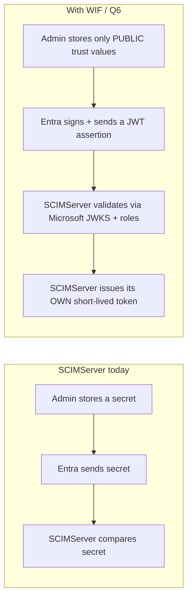

---

## 1. What WIF is

### 1.0 What is new from the internal doc

| Aspect | Public reference says | Internal doc adds |
|---|---|---|
| Codename | (n/a) | The Entra Provisioning Service is "SyncFabric" internally |
| Deprecation context | (n/a) | Username-password, long-lived bearer, and OAuth Auth Code Grant are being **deprecated**; Client Credentials is currently the **only** method offered to new ISVs; WIF is its credential-free replacement |
| ISV demand | (n/a) | Google, Zoom, and SAP have asked for credential-free onboarding |
| Audience format | `api://<appid>` | `api://{WorkloadIdentity_appid}/.default` |
| Authorization | "validate the token" | The ISV **must** enforce **app roles / permissions** carried in the assertion, not just signature (**see the upcoming-changes note in [section 4](#4-the-assertion-claims-validation-jwks): roles are not passed/validated today; this is forward-looking**) |
| Scope | (optional) | The ISV **defines** the scope string it expects (e.g. `zoom-scim-access`) and returns a token scoped to it |

### 1.1 The problem WIF solves

Secret-based auth (Pattern 5 in the gap plan) means a long-lived `client_secret` lives in two places (Entra and the ISV), must be rotated on a schedule, and is a breach target. WIF removes the secret entirely: trust is established once by exchanging only **public** values, and the cryptographic proof on every token request is a freshly-signed, short-lived JWT.

### 1.2 The federated-trust model

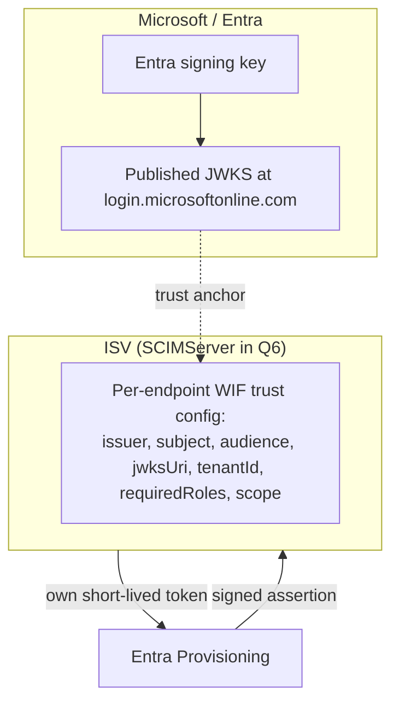

### 1.3 Token exchange vs direct JWT (the key distinction)

WIF is a **token exchange**, not direct JWT bearer usage on the resource.

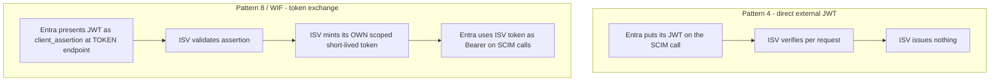

The Microsoft-signed JWT is a **client-authentication assertion** (RFC 7523 section 2.2). It never rides the SCIM calls. The token that rides the SCIM calls is the ISV's own.

### 1.4 Two assertion profiles: RFC 7523 (jwt-bearer) and RFC 8693 (token-exchange)

WIF is not a single wire shape. Entra is rolling out **two OAuth profiles** for presenting its signed JWT at the ISV token endpoint, and an ISV declares which one it supports at onboarding (recorded in app metadata; a marker in the connectivity config tells Entra which profile to use, so Entra auto-selects the matching request shape). They are **different grant types with different request bodies** - not two versions of one call.

| Aspect | **`jwt-bearer`** (RFC 7523 section 2.2) | **`token-exchange`** (RFC 8693) |
|---|---|---|
| Status | **Shipped today** (SAP SuccessFactors is the first ISV) | **Coming** (Google is the example ISV) |
| `grant_type` | `client_credentials` | `urn:ietf:params:oauth:grant-type:token-exchange` |
| Entra's JWT is carried as | `client_assertion` (+ `client_assertion_type=urn:ietf:params:oauth:client-assertion-type:jwt-bearer`) | `subject_token` (+ `subject_token_type`; **consumer-defined** - Google uses `urn:ietf:params:oauth:token-type:id_token`) |
| Role of the JWT | **Client authentication** - proves who the caller is | **The subject being exchanged** - the token traded for a new one |
| Other params | `client_id`, `scope`, and (SuccessFactors) a custom `resource` borrowed from RFC 8693 | `requested_token_type`, `audience`, `scope`; optional `resource` / `actor_token`. `subject_token_type` is REQUIRED |
| Response adds | standard OAuth token response | also `issued_token_type` (REQUIRED) |
| Semantics | client-auth then mint the ISV token | STS-style exchange; supports impersonation (subject only) vs delegation (subject + actor, composite token carries an `act` claim) |

> **Proposed config naming.** The per-endpoint `wif` trust record (section 8) gains an `assertionProfile` discriminator with exactly these two values - **`jwt-bearer`** and **`token-exchange`** - chosen to be the literal URN tails so the config value self-documents and matches the wire. Display names: **"JWT Bearer Assertion (RFC 7523)"** and **"OAuth Token Exchange (RFC 8693)"**. Simultaneous support of both profiles on one endpoint is technically possible but rare in practice; the common case is one profile per endpoint, fixed at onboarding.

> **The two RFCs compose, they do not compete.** RFC 7523 is a *client-authentication method*; RFC 8693 is a *grant type for exchanging tokens*. RFC 8693 even names RFC 7523 as one way a client may authenticate during a token exchange. Both flows still end identically for the SCIM endpoint: a short-lived ISV-issued bearer token rides the SCIM calls.

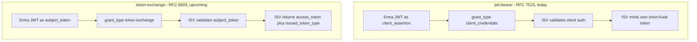

### 1.5 Design review with Ramsey Ali (2026-06-12) - what was confirmed

This subsection records the points settled in the design review with Ramsey Ali (Entra provisioning owner). The notes below were AI-generated from the meeting and then **checked against this doc and against RFC 7523 / RFC 8693**; two phrasings in the raw notes were inaccurate and are corrected here (flagged inline).

| # | Topic | What was confirmed | Reconciled with |
|---|---|---|---|
| 1 | **Pattern 8 is the only supported pattern** | Entra presents its signed JWT as a client assertion (or, upcoming, a subject token), the ISV validates it via the JWKS URI + configured trust values, and then the **ISV** mints its own short-lived token for the SCIM calls. This is the current implementation and the only one to be supported. | [section 1.3](#13-token-exchange-vs-direct-jwt-the-key-distinction), [section 2](#2-the-wire-format) |
| 2 | **Pattern 4 is not supported and unlikely to be needed** | Pattern 4 = a self-signed token presented **directly** to the SCIM API (no token endpoint), validated per request against a public key from a URL. No customer has asked for it; guidelines follow current customer need, so only Pattern 8 is in scope. | [section 1.3](#13-token-exchange-vs-direct-jwt-the-key-distinction) (the "Pattern 4 - direct external JWT" branch), [section 15 FAQ](#15-faq) |
| 3 | **Only one config-time validation; provisioning uses the ISV token** | The trust values (issuer, audience, subject, JWKS URL) are stored once at onboarding. The assertion is validated at the token endpoint; subsequent SCIM provisioning calls carry the ISV-issued bearer token, which the SCIM endpoint validates as a normal bearer token. | [section 2](#2-the-wire-format), [section 8 guard fall-through note](#8-backend-design) |
| 4 | **RFC 7523 today, RFC 8693 in development (Google example)** | Only RFC 7523 is implemented for ISV onboarding now; RFC 8693 support is being built, with Google as the example ISV. The supported RFC is recorded in the **app metadata at onboarding**; a marker in the connectivity config payload tells Entra which RFC-compliant request shape to send, so the customer never specifies it manually. | [section 1.4](#14-two-assertion-profiles-rfc-7523-jwt-bearer-and-rfc-8693-token-exchange) |
| 5 | **Both RFCs on one endpoint: possible but rare** | An ISV endpoint could advertise both RFCs (e.g. for different environments). Technically supportable by Entra, but not currently observed among customers. The common case is one profile per endpoint, fixed at onboarding. | [section 1.4](#14-two-assertion-profiles-rfc-7523-jwt-bearer-and-rfc-8693-token-exchange) `assertionProfile` note |
| 6 | **Token endpoint and SCIM endpoint may be hosted separately** | They can live in different environments or even different parts of a company (SuccessFactors is the example: distinct token host and SCIM host). The SCIM endpoint accepts a valid bearer token regardless of where it was minted; **token validation against the SCIM endpoint is the ISV's responsibility**, and Entra assumes the token from the token endpoint will be accepted. | [section 2 separable-endpoints note](#2-the-wire-format) |
| 7 | **V2 token format only; exact string comparison** | The team switched from V1 to V2 tokens (different `iss` and `aud`); only V2 is generated and supported. Runtime version detection is unnecessary because the version is fixed by configuration. The issuer is stored and compared by **precise exact-string match** - ISVs may reject a token if the issuer string does not match byte-for-byte. | [section 4.1 DECIDED](#41-decided---entra-v2-token-format-only-issuer-and-audience) |
| 8 | **The ISV needs only the literal issuer string, not the tenant ID** | The ISV does not have to handle the tenant ID as a separate concept - it stores and matches the literal issuer string (which **contains** the tenant ID). The app is deployed in a specific tenant; storing the issuer URL is sufficient for validation. | [section 4 claims table](#4-the-assertion-claims-validation-jwks) (`iss` / `tid`) - see the reconciliation note below |
| 9 | **JWKS validation is a generic REST call; no special encryption** | Pulling the signing keys is a generic REST request (no special library required); the JWKS confirms the token is genuinely Microsoft-signed, and validation then checks `iss` / `aud` / `sub` against the trusted configured values. No encryption is required on the incoming body beyond standard TLS. | [section 4](#4-the-assertion-claims-validation-jwks) |
| 10 | **Roles are not validated today; may matter soon** | Roles are not currently passed in the assertion or validated. This may change with the planned **"1P app method"** (tentatively a few weeks out), which could require role information in the token. Ramsey will give a heads-up if roles become necessary. | [section 4 upcoming-changes note](#4-the-assertion-claims-validation-jwks) |

> **Accuracy correction 1 (who mints the token).** The raw AI notes said in one place that "Entra mints its own short-lived token." That is backwards: Entra **presents** the signed assertion; the **ISV** validates it and mints **its own** short-lived token, which Entra then uses as the `Bearer` on the SCIM calls. The corrected phrasing is used in row 1 above and matches [section 0](#0-tldr) and [section 1.3](#13-token-exchange-vs-direct-jwt-the-key-distinction).

> **Accuracy correction 2 (the JWKS "/keys" remark).** The raw notes said the "JWKS URL format changed to include `/keys`" in the V1->V2 switch. More precisely: both V1 and V2 keys URLs end in `/keys`; what differs is the path segment - the V1 keys URI is `https://login.microsoftonline.com/<TenantID>/discovery/keys` while the **V2** keys URI is `https://login.microsoftonline.com/<TenantID>/discovery/v2.0/keys` (the `/v2.0/` segment is the real delta). The authoritative value for WIF is the V2 form; obtain it from the tenant's V2 OIDC discovery document (`/v2.0/.well-known/openid-configuration` -> `jwks_uri`) rather than hard-coding it. The v1/v2 row in [section 4.1](#41-decided---entra-v2-token-format-only-issuer-and-audience) has been corrected accordingly.
>
> **Basis (verified 2026-06-15 against the live Entra discovery documents).** This is confirmed by fetching the two metadata documents directly: the **v1** document [`/common/.well-known/openid-configuration`](https://login.microsoftonline.com/common/.well-known/openid-configuration) returns `"jwks_uri": "https://login.microsoftonline.com/common/discovery/keys"` and `"issuer": "https://sts.windows.net/{tenantid}/"`; the **v2** document [`/common/v2.0/.well-known/openid-configuration`](https://login.microsoftonline.com/common/v2.0/.well-known/openid-configuration) returns `"jwks_uri": "https://login.microsoftonline.com/common/discovery/v2.0/keys"` and `"issuer": "https://login.microsoftonline.com/{tenantid}/v2.0"`. (The `/common/` host segment shown is the placeholder authority; a tenant-pinned request returns `/<TenantID>/discovery[/v2.0]/keys`.) Both documents also list `private_key_jwt` in `token_endpoint_auth_methods_supported` - the RFC 7523 client-assertion method WIF's `jwt-bearer` profile relies on ([section 4.2](#42-rfc-7523-in-depth-the-jwt-bearer-profile)).

> **Reconciliation (row 8 - issuer vs `tid`).** Ramsey's framing ("the ISV only needs the literal issuer string") and this doc's `tid` check are **compatible, not contradictory**: because the V2 issuer string embeds the tenant GUID and is matched exactly, tenant binding is already enforced by the `iss` comparison. The separate `tid`-claim check in the [section 4 claims table](#4-the-assertion-claims-validation-jwks) is **defense in depth**, not a second piece of configuration the operator must supply - it is derived from the same issuer the admin already stored. An implementation may enforce `tid` explicitly or rely on the exact-match issuer; both satisfy the trust requirement.
>
> **Basis (verified 2026-06-15).** The live v2 discovery document ([`/common/v2.0/.well-known/openid-configuration`](https://login.microsoftonline.com/common/v2.0/.well-known/openid-configuration)) publishes `"issuer": "https://login.microsoftonline.com/{tenantid}/v2.0"` - the `{tenantid}` placeholder is substituted with the real tenant GUID in an issued token, so the issuer string literally contains the tenant id. `tid` also appears in that document's `claims_supported`. Hence an exact-match on the (tenant-substituted) issuer is sufficient for tenant binding, and the explicit `tid` check is a redundant-by-design second gate, not a separate operator input.

**Follow-ups Ramsey owns (from the review):** (a) send RFC 8693 implementation details + examples; (b) provide concrete V2 token strings / request bodies - **partly delivered**, the SuccessFactors + Google bodies in [section 2.2](#22-the-two-shipping-implementations-concrete-request-bodies) are from this; (c) share Microsoft-JWKS validation guidance; (d) confirm any upcoming role-handling change with the 1P app method.

---

## 2. The wire format

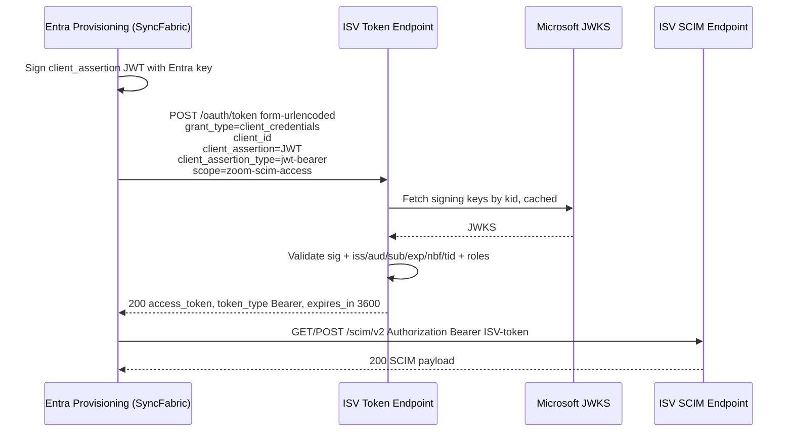

**Token request (note `application/x-www-form-urlencoded`, not JSON):**

```http
POST /endpoints/{id}/oauth/token HTTP/1.1
Host: isv.example.com
Content-Type: application/x-www-form-urlencoded

grant_type=client_credentials
&client_id=927cf057-74f6-4400-b22b-94f88b041914
&client_assertion=eyJhbGciOiJSUzI1NiIsImtpZCI6Ii4uLiJ9.eyJhdWQiOiJhcGk6...
&client_assertion_type=urn%3Aietf%3Aparams%3Aoauth%3Aclient-assertion-type%3Ajwt-bearer
&resource=urn%3Asap%3Aidentity%3Aapplication%3Aprovider%3Aname%3A%7BResource+Name%7D
&scope=scimserver-scim-access
```

**Token response:**

```http
HTTP/1.1 200 OK
Content-Type: application/json

{ "access_token": "<ISV-issued JWT>", "token_type": "Bearer", "expires_in": 3600 }
```

**Subsequent SCIM call:**

```http
GET /endpoints/{id}/scim/v2/Users HTTP/1.1
Authorization: Bearer <ISV-issued JWT>
```

> **Precision note.** Entra sends the assertion as form fields, URL-encoded. The `client_assertion_type` value is the literal `urn:ietf:params:oauth:client-assertion-type:jwt-bearer`. An endpoint that reads only JSON bodies (SCIMServer today) will silently see empty fields.

> **Separable token and SCIM endpoints.** The token endpoint and the SCIM endpoint do **not** have to share a host (or even an operator). The public AzureAD reference's SAP SuccessFactors example posts the assertion to `auth.successfactors.example.com` and then calls SCIM at `scim.successfactors.example.com` - two different hosts. The SCIM endpoint simply validates the incoming `Bearer` token regardless of where it was minted; token-issuance and resource-serving are independent responsibilities. SCIMServer's own per-endpoint token URL and SCIM URL (section 3, Step 3) are co-located by default, but the trust model does not require it - an ISV may front the token exchange in one environment and the SCIM resource in another.

### 2.1 The `token-exchange` variant (RFC 8693, upcoming)

The request above is the **`jwt-bearer`** profile ([section 1.4](#14-two-assertion-profiles-rfc-7523-jwt-bearer-and-rfc-8693-token-exchange)). The upcoming **`token-exchange`** profile carries the same Microsoft-signed JWT, but as the `subject_token` of an RFC 8693 token exchange rather than as a `client_assertion`:

```http
POST /endpoints/{id}/oauth/token HTTP/1.1
Host: isv.example.com
Content-Type: application/x-www-form-urlencoded

grant_type=urn%3Aietf%3Aparams%3Aoauth%3Agrant-type%3Atoken-exchange
&subject_token=eyJhbGciOiJSUzI1NiIsImtpZCI6Ii4uLiJ9.eyJhdWQiOiJhcGk6...
&subject_token_type=urn%3Aietf%3Aparams%3Aoauth%3Atoken-type%3Aid_token
&scope=scimserver-scim-access
```

> **The `subject_token_type` is consumer-defined.** The real Google flow sets it to `urn:ietf:params:oauth:token-type:id_token` (the value shown above), not the generic `...:jwt`. A validator must read the configured expected type rather than hard-coding one - see the concrete bodies in [section 2.2](#22-the-two-shipping-implementations-concrete-request-bodies).

The response is a normal OAuth token response **plus** the RFC 8693-required `issued_token_type`:

```http
HTTP/1.1 200 OK
Content-Type: application/json

{
  "access_token": "<ISV-issued JWT>",
  "issued_token_type": "urn:ietf:params:oauth:token-type:access_token",
  "token_type": "Bearer",
  "expires_in": 3600
}
```

> **What stays identical.** The JWKS-based signature + `iss`/`aud`/`sub`/`tid`/time-window validation of the Microsoft JWT (section 4) is **the same** for both profiles - only the field name carrying the JWT (`client_assertion` vs `subject_token`) and the `grant_type` differ. The SCIM call that follows is byte-for-byte identical: a `Bearer` token the ISV minted. RFC 8693 also defines `resource`, `audience`, `requested_token_type`, and delegation via `actor_token` (producing a composite token with an `act` claim); none are required for the basic WIF exchange, so they are out of scope until a concrete integration needs them.

### 2.2 The two shipping implementations (concrete request bodies)

These are the two real WIF implementations SCIMServer must interoperate with. Both carry the same kind of Entra-signed JWT (an "impersonated application token") but differ in grant type, the field that carries the token, and several consumer-specific parameters. The bodies below are shown as parameter sets; on the wire they are `application/x-www-form-urlencoded`.

**SAP SuccessFactors - `jwt-bearer` (RFC 7523):**

```json
{
  "grant_type": "client_credentials",
  "client_assertion": "{impersonated application token}",
  "client_assertion_type": "urn:ietf:params:oauth:client-assertion-type:jwt-bearer",
  "client_id": "927cf057-74f6-4400-b22b-94f88b041914",
  "resource": "urn:sap:identity:application:provider:name:{Resource Name}"
}
```

- `client_id` is sent alongside the assertion.
- `resource` is a **custom SuccessFactors parameter** (`urn:sap:identity:application:provider:name:{Resource Name}`). It is **not** part of RFC 7523 - it is borrowed from RFC 8693, which defines `resource` as the target the issued token is for. This is a concrete case of the two RFCs bleeding together: a `jwt-bearer` request carrying an RFC 8693 parameter. A SCIMServer validator for this profile must tolerate (and may use or ignore) a `resource` form field.

**Google Cloud Platform - `token-exchange` (RFC 8693):**

```json
{
  "grant_type": "urn:ietf:params:oauth:grant-type:token-exchange",
  "requested_token_type": "urn:ietf:params:oauth:token-type:access_token",
  "subject_token": "{impersonated application token}",
  "subject_token_type": "urn:ietf:params:oauth:token-type:id_token",
  "audience": "//iam.googleapis.com/projects/{Project ID}/locations/global/workloadIdentityPools/{Pool ID}/providers/{Provider ID}",
  "scope": "https://www.googleapis.com/auth/cloud-platform"
}
```

- `subject_token_type` is **`urn:ietf:params:oauth:token-type:id_token`** - Google treats the Entra token as an **id_token**, not the generic `...:jwt` type. The expected `subject_token_type` is **consumer-defined**; do not hard-code `:jwt`.
- `requested_token_type` is **`...:access_token`** - the caller states the desired **output** type (RFC 8693 lets the requester ask for a specific issued-token type).
- `audience` is the **Google workload-identity-pool provider resource name** (`//iam.googleapis.com/projects/.../providers/...`), the RFC 8693 `audience` parameter naming the logical target.
- `scope` is the GCP platform scope the issued token should carry.

> **Design takeaway for SCIMServer.** The `assertionProfile` discriminator selects the grant type and the field carrying the token, but the **per-profile parameter set is consumer-specific**: SuccessFactors adds `resource`; Google sets `subject_token_type=id_token`, `requested_token_type`, and a pool-URI `audience`. The validator should read the token from `client_assertion` (jwt-bearer) or `subject_token` (token-exchange), validate it against the configured JWKS + claims **identically** for both, and treat `resource` / `audience` / `requested_token_type` / `scope` as profile-specific routing and issuance hints rather than part of the core signature-plus-claims check. The configured `subject_token_type` (and any expected `resource`/`audience`) belongs in the per-endpoint `wif` trust record, not hard-coded.

### 2.3 How Entra mints the assertion (the SyncFabric backend)

Everything above is the **ISV-facing** half. The internal one-pager ([source documents](#source-documents)) describes the **Entra-side** half - how the Provisioning Service (SyncFabric) obtains the signed JWT it presents as `client_assertion` / `subject_token`. SCIMServer never implements this side, but understanding it explains the claim values the ISV validates.

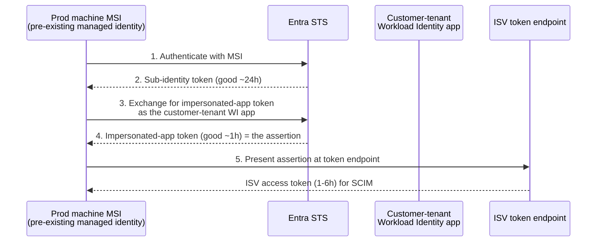

| Aspect | What the one-pager states |
|---|---|
| Starting credential | A **pre-existing MSI** already on SyncFabric's production machines - no new long-lived secret is introduced |
| New app per customer | The provisioning blade **creates a new application in the customer's tenant** during auth setup; this Workload Identity app is what the ISV establishes trust with (its `appid`/`oid` become the assertion's `aud`/`sub`) and what SyncFabric impersonates |
| Token chain | MSI auth -> **sub-identity token (~24h)** -> **impersonated-application token (~1h)** = the assertion presented to the ISV |
| Lifetimes | The impersonated-app token and the ISV access token both expire at **~1h**, so steps 3-5 repeat roughly hourly across a provisioning cycle; the sub-identity token lasts ~24h |
| Proposed Entra code | A stateless `EntraGeneratedTokenAuthenticationHelperFactory` performs the exchanges; an `EntraGeneratedTokenAuthentication` instance (per ISV connector) caches the current access token and renews it on expiry. It is initialized with the machine MSI id plus the target tenant's application id + object id |

> **Why this matters to the ISV (SCIMServer).** It explains *why* the `sub` is a workload-identity **object id** and the `aud`/`appid` is that same app's **app id**: they identify the per-customer app Entra created and impersonates. It also sets the cadence expectation - a fresh assertion (and so a fresh ISV token request) roughly **every hour**, not per SCIM call. The ISV side is unchanged regardless of how the assertion was minted; this section is context only.

---

## 3. The three-step admin setup

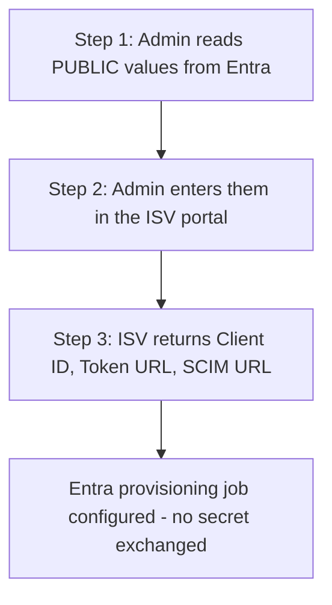

**Step 1 - values copied OUT of Entra (all public):**

| Value | Example |
|---|---|
| Issuer | `https://login.microsoftonline.com/<TenantID>/v2.0` |
| Subject | `{WorkloadIdentity_object_id}` |
| Audience | `api://{WorkloadIdentity_appid}/.default` |
| JWKS URL | `https://login.microsoftonline.com/<TenantID>/discovery/v2.0/keys` |

> **v2 issuer/audience (decided - see [section 4.1](#41-decided---entra-v2-token-format-only-issuer-and-audience)).** The **Issuer** is the Entra **v2.0** value (`login.microsoftonline.com/<TenantID>/v2.0`), validated by **exact string match**. The **Audience** shown here is the admin-facing value the operator copies (the App ID URI plus the `/.default` scope suffix); note that the **`aud` claim in the actual token is the bare `appid` GUID** (e.g. `b5ba7a93-...`) - **not** the `api://{appid}` App ID URI form and **not** the `/.default` scope form (the `/.default` is the requested scope, not the token audience). The ISV validates the token `aud` against the bare `{appid}` GUID.

**Step 2 - the ISV stores those four values as a per-endpoint trust record. No secret is created.**

**Step 3 - values returned BY the ISV:**

| Value | Example |
|---|---|
| Client ID | `00000000-0000-0000-0000-000000000000` |
| Token URL | `https://isv.example.com/endpoints/{id}/oauth/token` |
| SCIM URL | `https://isv.example.com/endpoints/{id}/scim/v2` |

---

## 4. The assertion: claims, validation, JWKS

| Claim | Meaning | ISV check |
|---|---|---|
| `aud` | bare `{appid}` GUID (**not** `api://{appid}`, **not** `/.default`) | Must equal the configured audience |
| `iss` | `https://login.microsoftonline.com/<TenantID>/v2.0` | Must equal the configured issuer (**exact string match**) |
| `sub` | Workload identity object id | Must equal the configured subject |
| `tid` | Tenant id | Must equal the allowed tenant (isolation) |
| `oid` | Object id of the calling principal | Logged; used for audit |
| `appid` / `azp` | App id of the caller (`appid` historically; `azp` is the v2 authorized-party claim) | Cross-checked against `client_id` |
| `roles` | App roles granted to the workload identity | Must contain every required role (**not passed/validated today - see the upcoming-changes note below**) |
| `ver` | Token version | Is `2.0`; v1 tokens are not supported |
| `iat` / `nbf` / `exp` | Validity window | Reject outside window (with small clock skew) |

**Example assertion payload (v2; shape from the public AzureAD reference, with the `aud` corrected to the bare `appid` GUID per the 2026-06-12 reviewer note below):**

```json
{
  "aud": "b5ba7a93-4452-4522-aeb4-a2b5da870c16",
  "iss": "https://login.microsoftonline.com/ce5f061f-abe6-4e40-9615-301f87bcb7f0/v2.0",
  "iat": 1772175916,
  "nbf": 1772175916,
  "exp": 1772179816,
  "appid": "b5ba7a93-4452-4522-aeb4-a2b5da870c16",
  "appidacr": "2",
  "idp": "https://login.microsoftonline.com/ce5f061f-abe6-4e40-9615-301f87bcb7f0/v2.0",
  "oid": "d2f8ee76-c549-45b8-a143-f5b640669704",
  "sub": "<Sync Fabric Workload Identity 1P app object ID>",
  "tid": "ce5f061f-abe6-4e40-9615-301f87bcb7f0",
  "ver": "2.0"
}
```

> **Note the `aud` shape (reviewer-corrected 2026-06-12).** The actual v2 token `aud` is the **bare `appid` GUID** (`b5ba7a93-...`) - **not** the `api://{appid}` App ID URI form and **not** the `/.default` scope form. The Entra provisioning owner confirmed the emitted token carries the bare `{appid}` GUID; an earlier reading of the public AzureAD reference rendered it as the `api://{appid}` App ID URI form, which is now superseded by the reviewer's authoritative statement (the internal/owner source is authoritative for Entra's actual token shape). The `/.default` the admin copied in Step 1 is the requested scope, not the token audience. There is also no `roles` claim in the documented example, consistent with the upcoming-changes note below.

**Five things the ISV must do:**

1. Resolve the signing key by `kid` from the configured JWKS URL (cache by `kid`).
2. Verify the RS256/ES256 signature - **never** accept `alg: none` or an HMAC alg.
3. Validate `iss`, `aud`, `sub`, `tid`, and the time window.
4. Enforce that `roles` contains every required role.
5. Issue its own short-lived token (1-6 h) scoped to the configured `scope`.

> **Upcoming-changes note - app roles (2026-06-12 stakeholder review).** Step 4 above is **forward-looking, not current behavior.** Per the Entra provisioning owner, **roles are not currently passed in the assertion and are not validated** during provisioning; the documented v2 example token above carries no `roles` claim. Role enforcement is expected to arrive with a planned "1P app method" change (tentatively a few weeks out). Until that lands and is confirmed with a real role-bearing sample token, treat step 4 as **aspirational**: design the validator so role enforcement can be switched on per endpoint, but do not hard-require a `roles` claim that Entra does not yet send. The signature + `iss`/`aud`/`sub`/`tid` + time-window checks (steps 1-3, 5) are the authoritative current contract.

**JWKS rotation and outage rules:**

- Cache keys by `kid` with a bounded max-age; refetch on an unknown `kid`.
- On a JWKS fetch failure with no cached key, **fail closed** (reject the assertion). Never fall back to "no signature check".
- Use the tenant-scoped OIDC discovery (`/.well-known/openid-configuration` -> `jwks_uri`) rather than hard-coding the keys URL when possible.

**Validation lifecycle (every branch except the final issuance ends at `invalid_client`):**

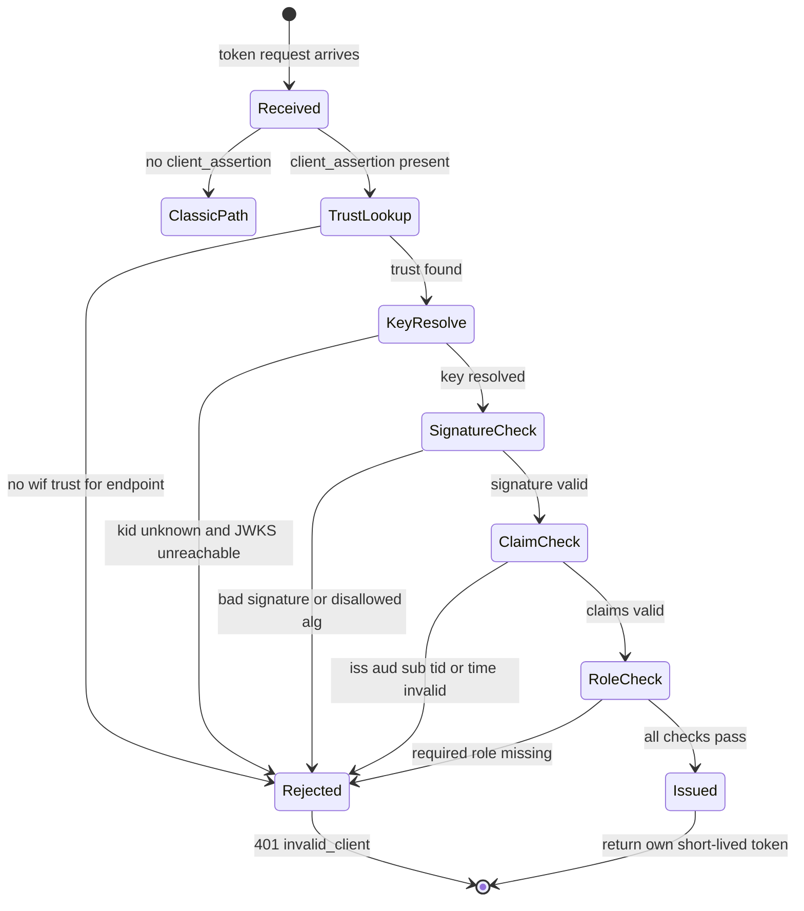

### 4.1 DECIDED - Entra v2 token format only (issuer and audience)

> **Status: DECIDED (2026-06-12 stakeholder review). Entra v2.0 tokens are the only supported format.** Earlier drafts of this doc carried the Entra **v1.0** (`sts.windows.net`) issuer/audience from the internal design doc. The public AzureAD reference was updated 2026-06-09 (commit "Update WIF SCIM article for Entra v2 tokens") to the **v2.0** format, and the Entra provisioning owner confirmed that **v2 is the only format the provisioning service now emits for WIF**. Sections 3 and 4 above have been switched to the v2 values accordingly. Runtime token-version detection is **unnecessary**: the version is fixed by configuration (the resource app's `requestedAccessTokenVersion` / `accessTokenAcceptedVersion` manifest setting), so the ISV does not sniff `ver` per request - it validates against the one configured v2 issuer/audience. The issuer is compared by **exact string match** (an ISV that does a substring or normalized compare can wrongly accept or reject; Entra's own guidance and OIDC require exact-match on `iss`).

**What changed from the retired v1 shape:**

| Claim | v1.0 (retired) | v2.0 (authoritative) | Note |
|---|---|---|---|
| `iss` | `https://sts.windows.net/<TenantID>/` | `https://login.microsoftonline.com/<TenantID>/v2.0` | Different host **and** a `/v2.0` suffix; validated by **exact string match** |
| `aud` | `api://{appid}/.default` | bare `{appid}` GUID | The v2 `aud` claim is the **bare `appid` GUID** - **not** the `api://{appid}` App ID URI form and **not** the `/.default` scope suffix (that suffix is the requested *scope*, not the token audience). Reviewer-corrected 2026-06-12 (Entra provisioning owner): the emitted v2 token carries the bare `{appid}` GUID. |
| `ver` | `1.0` | `2.0` | Present in the token but used for audit, not branching - version is fixed by config |
| caller app id | `appid` | `appid` and/or `azp` | v2 tokens may carry the caller app id in `azp` (authorized party); the validator should accept either for the caller-app cross-check |
| JWKS URL | `https://login.microsoftonline.com/<TenantID>/discovery/keys` | `https://login.microsoftonline.com/<TenantID>/discovery/v2.0/keys` | The v2 keys URI adds the `/v2.0/` path segment (both still end in `/keys`). Prefer resolving it from the tenant's v2 OIDC discovery document (`/v2.0/.well-known/openid-configuration` -> `jwks_uri`) rather than hard-coding. Surfaced by the 2026-06-12 design review (corrected from an earlier "unchanged" note). |

> **Accuracy correction (reviewer-corrected 2026-06-12).** An earlier revision of this doc claimed the v2 `aud` was the `api://{appid}` App ID URI form (reading it off the public AzureAD reference example). The Entra provisioning owner corrected this in the design review: the **actual emitted v2 token `aud` is the bare `appid` GUID** (e.g. `b5ba7a93-...`), not the App ID URI form. The validator must compare the token `aud` against the bare `{appid}` GUID - derive it from the Step-1 admin value by stripping both the `api://` prefix and the `/.default` scope suffix (or store the bare GUID directly).

> **Provenance of the `aud` confusion (2026-06-15).** The newly-extracted V1-era internal source ([source documents](#source-documents)) is **internally inconsistent on `aud`**, which is exactly why an explicit reviewer correction was needed. The same one-pager renders it three different ways: the Step-1 admin display shows `Aud = WorkloadIdentity_appid` (**bare GUID**); the token-flow prose shows `Aud = api://{appid}/.default`; and the worked example token shows `"aud": "api://b5ba7a93-..."` (`api://` + GUID, no `/.default`). The bare-GUID Step-1 display corroborates the reviewer's v2 conclusion; the `api://` forms in the same file are the source of the earlier misreading. Net: store/compare the **bare `{appid}` GUID**.

**Implementation impact:** the per-endpoint WIF trust config (section 8) stores a **single** expected issuer and audience (the v2 strings), not an allowlist - there is no v1/v2 dual-accept to maintain. This keeps the validator (section 4, step 3) a straight exact-string comparison. The earlier multi-format option is dropped.

**Sources:**

- [AzureAD/SCIMReferenceCode - Workload Identity Federation for SCIM Provisioning](https://github.com/AzureAD/SCIMReferenceCode/blob/master/Workload-Identity-Federation-for-SCIM-Provisioning.md) - the public reference, **updated 2026-06-09** ("Update WIF SCIM article for Entra v2 tokens"); documents the v2.0 issuer/audience. Its example token renders `aud` as the `api://{appid}` App ID URI form, but the 2026-06-12 reviewer (Entra provisioning owner) corrected the actual emitted v2 `aud` to the bare `{appid}` GUID - see [section 4.1](#41-decided---entra-v2-token-format-only-issuer-and-audience).
- [Microsoft Learn - Access tokens in the Microsoft identity platform](https://learn.microsoft.com/en-us/entra/identity-platform/access-tokens) - `iss` v1.0 `https://sts.windows.net/{tenantid}/` vs v2.0 `https://login.microsoftonline.com/{tenantid}/v2.0`; the `ver` discriminator; the exact-match `iss` requirement.
- [Microsoft Learn - Access token claims reference](https://learn.microsoft.com/en-us/entra/identity-platform/access-token-claims-reference) - claim-by-claim reference (`aud`, `iss`, `ver`, `appid`/`azp`).
- [Microsoft Learn - Microsoft identity platform and the OAuth 2.0 client credentials flow](https://learn.microsoft.com/en-us/entra/identity-platform/v2-oauth2-client-creds-grant-flow) - the v2.0 client-credentials request shape (including the federated-credential case that mirrors WIF in the opposite direction).

---

### 4.2 RFC 7523 in depth (the `jwt-bearer` profile)

**[RFC 7523](https://www.rfc-editor.org/rfc/rfc7523)** - "JSON Web Token (JWT) Profile for OAuth 2.0 Client Authentication and Authorization Grants", Proposed Standard, May 2015 (Jones / Campbell / Mortimore). It is a concrete profile of the assertion framework in [RFC 7521](https://www.rfc-editor.org/rfc/rfc7521).

**Two orthogonal, separable uses - WIF uses only the second:**

| RFC 7523 use | URN | Carried in | Combined with |
|---|---|---|---|
| Authorization **grant** (section 2.1) | `urn:ietf:params:oauth:grant-type:jwt-bearer` | the `assertion` form field, as the `grant_type` itself | nothing - it **is** the grant |
| **Client authentication** (section 2.2) - **this is WIF** | `urn:ietf:params:oauth:client-assertion-type:jwt-bearer` | the `client_assertion` field (+ `client_assertion_type`); MUST NOT carry more than one JWT | some other `grant_type` (for WIF: `client_credentials`) |

The spec is explicit that client authentication via JWT is "orthogonal to and separable from" using a JWT as an authorization grant. **WIF's `jwt-bearer` profile is the section-2.2 client-authentication form**: the Entra-signed JWT proves *who the caller is*, and a separate `grant_type=client_credentials` asks for the token. It is **not** the section-2.1 grant-type form.

**The section-3 JWT processing rules (what the ISV/AS must enforce):**

| # | Rule | WIF mapping |
|---|---|---|
| 1 | MUST contain `iss` (issuer). Absent an application profile, compare by **Simple String Comparison** (RFC 3986 section 6.2.1). | `iss` == configured v2 issuer, exact-match ([section 4.1](#41-decided---entra-v2-token-format-only-issuer-and-audience)) |
| 2 | MUST contain `sub`. **For client authentication the `sub` MUST be the `client_id`** of the OAuth client. | Entra's `sub` is the workload-identity object id; the ISV validates it against the configured expected subject |
| 3 | MUST contain `aud` identifying the authorization server; the token-endpoint URL MAY be used. The AS MUST reject any JWT whose audience is not itself. Simple String Comparison. | `aud` == the bare `{appid}` GUID (reviewer-corrected; [section 4.1](#41-decided---entra-v2-token-format-only-issuer-and-audience)) |
| 4 | MUST contain `exp`; reject if expired (small clock skew allowed). MAY reject an `exp` unreasonably far in the future. | time-window check |
| 5 | MAY contain `nbf`. | enforced if present |
| 6 | MAY contain `iat`. | logged |
| 7 | MAY contain `jti`; the AS MAY reject replays by tracking used `jti` values for the `exp` window. | optional replay defense |
| 8 | MAY contain other claims. | `tid`, `oid`, `appid`/`azp`, `ver` |
| 9 | MUST be digitally signed or MAC'd; reject an invalid signature/MAC. | RS256 over the Microsoft JWKS; **never** `alg:none`/HMAC |
| 10 | MUST reject a JWT that is invalid in any other respect per RFC 7519. | standard JWT validity |

**Error codes (section 3.1 / 3.2):** a bad **grant** JWT returns `invalid_grant`; a bad **client-authentication** JWT returns **`invalid_client`**. Because WIF is the client-authentication form, **`invalid_client`** is the correct failure code (matching [section 12](#12-error-responses-and-rfc-6749-conformance) and the validation lifecycle in [section 4](#4-the-assertion-claims-validation-jwks)).

**Interoperability (section 5):** **RS256 is mandatory-to-implement**, which is exactly the algorithm Entra signs with. The spec lists the values that MUST be agreed out of band - issuer and audience identifiers, the token-endpoint location, the signing key, any one-time-use (`jti`) restriction, and the maximum JWT lifetime - and these are precisely the fields the WIF trust record stores ([section 8](#8-backend-design)). Replay protection (section 6) is **optional**, not mandated.

### 4.3 RFC 8693 in depth (the `token-exchange` profile)

**[RFC 8693](https://www.rfc-editor.org/rfc/rfc8693)** - "OAuth 2.0 Token Exchange", Proposed Standard, January 2020 (Jones & Nadalin of **Microsoft**, Campbell ed. of Ping, Bradley of Yubico, Mortimore of Visa). It defines a lightweight Security Token Service (STS) over OAuth: a client trades one token for another. WIF's upcoming `token-exchange` profile is this grant.

**Request parameters (section 2.1; an extension grant under RFC 6749 section 4.5, `application/x-www-form-urlencoded`):**

| Parameter | Presence | Meaning | WIF / Google use |
|---|---|---|---|
| `grant_type` | **REQUIRED** | `urn:ietf:params:oauth:grant-type:token-exchange` | fixed |
| `subject_token` | **REQUIRED** | the token representing the identity on whose behalf the request is made | **the Entra-signed JWT** |
| `subject_token_type` | **REQUIRED** | type identifier of `subject_token` | **consumer-defined** - Google sets `...:id_token` |
| `resource` | OPTIONAL | absolute URI of the target service (no fragment; query allowed); repeatable | unused by Google |
| `audience` | OPTIONAL | logical name of the target service; repeatable; may combine with `resource` | Google: the workload-identity-pool provider URI |
| `scope` | OPTIONAL | space-delimited requested scopes | Google: the GCP platform scope |
| `requested_token_type` | OPTIONAL | the desired **issued** token type | Google: `...:access_token` |
| `actor_token` | OPTIONAL | the identity of the **acting** party (delegation) | not used by basic WIF |
| `actor_token_type` | REQUIRED **iff** `actor_token` present, else MUST NOT appear | type of `actor_token` | not used by basic WIF |

Client authentication for the exchange uses the normal OAuth mechanisms, and the spec **explicitly names RFC 7523 `jwt-bearer` as one allowed client-auth method** - this is the formal point at which the two RFCs compose (see [section 4.4](#44-juxtaposition-how-the-two-rfcs-map-onto-wif)). Omitting client authentication lets a compromised `subject_token` be leveraged into other tokens, so client auth lets the AS apply additional authorization checks.

**Response parameters (section 2.2.1; HTTP 200 `application/json`):**

| Member | Presence | Note |
|---|---|---|
| `access_token` | **REQUIRED** | carries the issued token; the name is kept "for historical reasons" - the issued token need not actually be an access token |
| `issued_token_type` | **REQUIRED** | the token-type identifier of what was returned (this is the member WIF's `token-exchange` response adds over a plain OAuth response) |
| `token_type` | **REQUIRED** | e.g. `Bearer`, or `N_A` when the issued token is not usable as an access token |
| `expires_in` | RECOMMENDED | lifetime in seconds |
| `scope` | OPTIONAL if identical to requested, else REQUIRED | granted scope |
| `refresh_token` | OPTIONAL | typically **not** issued in an exchange |

**Token Type Identifiers (section 3):**

| URI | Meaning |
|---|---|
| `urn:ietf:params:oauth:token-type:access_token` | an OAuth access token (format opaque to the client) |
| `urn:ietf:params:oauth:token-type:refresh_token` | an OAuth refresh token |
| `urn:ietf:params:oauth:token-type:id_token` | an OpenID Connect ID Token |
| `urn:ietf:params:oauth:token-type:saml1` / `:saml2` | SAML assertions |
| `urn:ietf:params:oauth:token-type:jwt` | specifically a JWT (from RFC 7519 section 9) |

The spec calls the `access_token` vs `jwt` distinction "subtle": `access_token` denotes a **delegated authorization decision** (opaque to the client), whereas `jwt` denotes a **format** (a JWT, e.g. for cross-domain use as in RFC 7523). Google's choice of `id_token` for the Entra `subject_token` is therefore a consumer labeling decision, not a format requirement - which is why the validator must read the configured expected `subject_token_type` rather than assume `...:jwt`.

**Impersonation vs delegation (section 1.1) and claims (section 4):** with only a `subject_token`, the exchange is **impersonation** (the issued token's subject *is* the subject; A becomes B). With `subject_token` **plus** `actor_token` it is **delegation** - a composite token whose `act` claim names the acting party, so A retains its own identity while acting for B. The `act` claim may nest for delegation chains, but a consumer MUST base access decisions only on the top-level claims plus the current (outermost) actor; nested `act` entries are informational. The related `may_act` claim states that a party is authorized to act for the subject. **Basic WIF uses impersonation only** - subject token in, ISV token out, no `actor_token` - so delegation/`act`/`may_act` are out of scope until a concrete integration needs them.

**Error codes (section 2.2.2):** an invalid request (or invalid `subject_token`/`actor_token`) returns `invalid_request`; an unsupported or too-broad target returns `invalid_target`. (Note this differs from RFC 7523's `invalid_client`/`invalid_grant`.) The relationship between `resource`, `audience`, and `scope` (section 2.1.1) is a Cartesian product of the requested rights at the named targets; asking for more than a target allows yields `invalid_target`.

### 4.4 Juxtaposition: how the two RFCs map onto WIF

The two RFCs are frequently conflated because both end with the ISV issuing a bearer token. They are different mechanisms doing different jobs, and WIF uses **one specific slice of each**.

| Dimension | RFC 7523 (`jwt-bearer`) - **today** | RFC 8693 (`token-exchange`) - **upcoming** |
|---|---|---|
| What the RFC defines | a **client-authentication method** (and, separately, a grant) | a **grant type** for exchanging one token for another |
| WIF uses | section 2.2 **client authentication** | the **token-exchange grant** |
| `grant_type` on the wire | `client_credentials` | `urn:ietf:params:oauth:grant-type:token-exchange` |
| Entra's JWT is carried as | `client_assertion` (+ `client_assertion_type`) | `subject_token` (+ `subject_token_type`) |
| Role of Entra's JWT | proves **who the caller is** | **the subject being exchanged** for a new token |
| Token-type declared | `client_assertion_type` = `...:client-assertion-type:jwt-bearer` (fixed) | `subject_token_type` = **consumer-defined** (Google: `...:id_token`) |
| Required extra response member | none (plain OAuth token response) | **`issued_token_type`** (REQUIRED) |
| Failure code | **`invalid_client`** (section 3.2) | **`invalid_request`** / **`invalid_target`** (section 2.2.2) |
| Mandatory signing alg | **RS256** (section 5) | inherits the surrounding OAuth/JWT requirements |
| Example ISV | **SAP SuccessFactors** | **Google Cloud** |

**The composition point (they cooperate, not compete).** RFC 8693 section 2.1 lists RFC 7523 `jwt-bearer` as a valid way for a client to authenticate **during** a token exchange. So in principle a single request could be an RFC 8693 exchange (`subject_token`) whose **client authentication** is an RFC 7523 `client_assertion`. WIF does not need that combination today, but it explains why the two specs share so much vocabulary.

**The vocabulary that bleeds across (a real interop hazard).** The SuccessFactors `jwt-bearer` body ([section 2.2](#22-the-two-shipping-implementations-concrete-request-bodies)) carries a `resource` parameter - which is **defined by RFC 8693, not RFC 7523**. A `jwt-bearer` request therefore legitimately carries an RFC 8693 parameter. A SCIMServer validator must tolerate `resource` (and `audience`, `requested_token_type`) on either profile and treat them as **issuance/routing hints**, applying the identical JWKS-plus-claims signature check from [section 4](#4-the-assertion-claims-validation-jwks) regardless of which profile presented the JWT.

**What is identical for the SCIM endpoint.** Both profiles end byte-for-byte the same on the SCIM calls: a short-lived ISV-issued `Bearer` token. Only the **token-endpoint** request differs (the field carrying Entra's JWT and the `grant_type`). The signature + `iss`/`aud`/`sub`/`tid`/time-window validation of Entra's JWT is the same for both - which is why the `assertionProfile` discriminator ([section 1.4](#14-two-assertion-profiles-rfc-7523-jwt-bearer-and-rfc-8693-token-exchange)) only selects the wire shape, not a second validator.

---

## 5. Current SCIMServer state

| Layer | Today | WIF needs |
|---|---|---|
| Auth fallback | [shared-secret.guard.ts](../../api/src/modules/auth/shared-secret.guard.ts): per-endpoint bcrypt bearer -> OAuth JWT -> legacy `SCIM_SHARED_SECRET` | A new branch that accepts an ISV-issued token minted by the WIF flow |
| OAuth issuer | [oauth.service.ts](../../api/src/oauth/oauth.service.ts): HS256, one global client, process-lifetime random key, 1 h TTL | Per-endpoint issuance after assertion validation; configurable 1-6 h TTL |
| Token endpoint | [oauth.controller.ts](../../api/src/oauth/oauth.controller.ts): rejects non-`client_credentials`; reads JSON body via `@Body()` | Accept `client_assertion` + `client_assertion_type`; parse `application/x-www-form-urlencoded` |
| Per-endpoint credential model | [schema.prisma](../../api/prisma/schema.prisma) `EndpointCredential` has `credentialType` + `metadata` JSON | A new `wif` `credentialType` storing trust config; **no secret column populated** |
| Config flags | [endpoint-config.interface.ts](../../api/src/modules/endpoint/endpoint-config.interface.ts): `boolean | string` only | A `'structured'` flag-type (Pre-Q.A) for the WIF trust object |

> **Verified greenfield note (2026-06-11 source check).** Every prerequisite below the WIF layer is genuinely unbuilt - none is partially present:
> - **No JWKS / `jose`.** [api/package.json](../../api/package.json) declares no `jose`, `jwks-rsa`, or equivalent; there is no `createRemoteJWKSet` or JWKS code anywhere in `api/src`. Q2 starts from zero.
> - **No form-urlencoded parsing.** The [api/src/main.ts](../../api/src/main.ts) bootstrap registers no `urlencoded`/`useBodyParser`, so the token endpoint cannot read the WIF form body today (Q6.1).
> - **No `client_assertion` path.** Zero matches for `client_assertion` in `api/src`.
> - **Issuer is HS256-only.** No RS256/ES256 anywhere, so Pre-Q.B is a from-scratch asymmetric-key change.
> - **`oauth_client` is reserved, not implemented.** [admin-credential.controller.ts](../../api/src/modules/scim/controllers/admin-credential.controller.ts) accepts `oauth_client` in its allowlist, but the create path always mints a bcrypt **bearer** token and the DTO carries only `label`/`credentialType`/`expiresAt` (no trust/client config). Q1 is therefore real new work, not a flag flip.

---

## 6. Gap analysis

| # | Capability | Status | Closes in |
|---|---|---|---|
| 1 | Accept `client_assertion` at the token endpoint | MISSING | Q6 |
| 2 | Parse `application/x-www-form-urlencoded` token requests | MISSING | Q6 |
| 3 | Validate an external JWT against a remote JWKS | MISSING (Q2 builds the validator) | Q2 -> Q6 |
| 4 | Per-endpoint federated-trust config (no secret) | MISSING | Q6 (needs Pre-Q.A structured flag) |
| 5 | Enforce app `roles` from the assertion | MISSING | Q6 |
| 6 | Issue a per-endpoint short-lived token | PARTIAL (global issuer exists) | Q1 -> Q6 |
| 7 | Tenant isolation via `tid` | MISSING | Q6 |
| 8 | Reciprocal ISV-portal UI (enter 4 values, return 3) | MISSING | Q6 |
| 9 | Advertise the WIF scheme in per-endpoint `/ServiceProviderConfig` (RFC 7644 section 4) | MISSING (one `oauthbearertoken` scheme today) | Q6 |
| 10 | Support Entra v1 and v2 issuer/audience formats | **RESOLVED - v2-only** (see [section 4.1](#41-decided---entra-v2-token-format-only-issuer-and-audience)) | Q6 |
| 11 | Support the `token-exchange` (RFC 8693) profile in addition to `jwt-bearer` (RFC 7523), selected by an `assertionProfile` discriminator on the trust record | Not yet built; design captured in [section 1.4](#14-two-assertion-profiles-rfc-7523-jwt-bearer-and-rfc-8693-token-exchange) and [section 2.1](#21-the-token-exchange-variant-rfc-8693-upcoming) | Q6 |

---

## 7. Phase Q6 recommendation

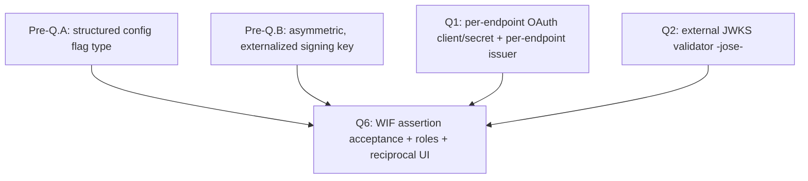

| Sub-step | Deliverable |
|---|---|
| Q6.1 | Token endpoint accepts `client_assertion` (form-urlencoded) and routes to the WIF validator |
| Q6.2 | `wif` `credentialType` + structured trust config persisted (no secret) |
| Q6.3 | `WifAssertionValidatorService` (reuses Q2 `jose` JWKS client): signature + claims + roles + tenant isolation |
| Q6.4 | Per-endpoint issuance of a 1-6 h token scoped to the configured `scope` |
| Q6.5 | Reciprocal CredentialsTab UI: "Federated Identity (WIF)" section + Test Connection |
| Q6.6 | Advertise the WIF scheme in the endpoint's `/ServiceProviderConfig` when `WifCredentialsEnabled` is on |

---

## 8. Backend design

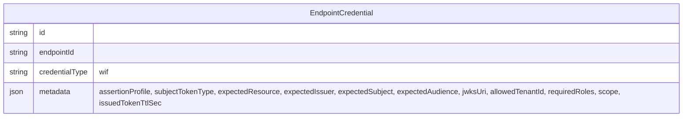

**Admin API - register WIF trust (no secret):**

```http
POST /api/endpoints/{id}/credentials
Content-Type: application/json

{
  "credentialType": "wif",
  "wif": {
    "assertionProfile": "jwt-bearer",
    "subjectTokenType": null,
    "expectedResource": "urn:sap:identity:application:provider:name:{Resource Name}",
    "expectedIssuer": "https://login.microsoftonline.com/<TenantID>/v2.0",
    "expectedSubject": "{WorkloadIdentity_object_id}",
    "expectedAudience": "{WorkloadIdentity_appid}",
    "jwksUri": "https://login.microsoftonline.com/<TenantID>/discovery/v2.0/keys",
    "allowedTenantId": "<TenantID>",
    "requiredRoles": [],
    "scope": "scimserver-scim-access",
    "issuedTokenTtlSec": 3600
  }
}
```

> **Field notes.** `assertionProfile` selects the wire shape (`jwt-bearer` for RFC 7523 today, `token-exchange` for RFC 8693 upcoming - [section 1.4](#14-two-assertion-profiles-rfc-7523-jwt-bearer-and-rfc-8693-token-exchange)). `subjectTokenType` is the expected `subject_token_type` for the `token-exchange` profile (consumer-defined - Google uses `urn:ietf:params:oauth:token-type:id_token`; `null`/unused for `jwt-bearer`). `expectedResource` holds the consumer-specific `resource` parameter when one is required (SuccessFactors `urn:sap:identity:application:provider:name:{Resource Name}`); leave it null when unused. `expectedAudience` is the **bare `appid` GUID** (what the token's `aud` claim actually contains, reviewer-corrected 2026-06-12 - [section 4.1](#41-decided---entra-v2-token-format-only-issuer-and-audience)), **not** the `api://{appid}` App ID URI form and **not** the `/.default` scope value the admin reads in Step 1. `requiredRoles` defaults to **empty** because roles are not passed/validated today (the upcoming-changes note in [section 4](#4-the-assertion-claims-validation-jwks)); leave it empty until the planned 1P-app-method change lands a role-bearing sample token.

**Token endpoint pseudocode:**

```text
if grant_type == "client_credentials" and client_assertion present:
    trust = loadWifTrust(endpointId)
    if not trust: 401 invalid_client
    assertion = verifyJwt(client_assertion, jwks(trust.jwksUri))   # fail closed on JWKS failure
    require assertion.iss == trust.expectedIssuer
    require assertion.aud == trust.expectedAudience
    require assertion.sub == trust.expectedSubject
    require assertion.tid == trust.allowedTenantId
    require trust.requiredRoles subset of assertion.roles
    return issueOwnToken(endpointId, ttl=trust.issuedTokenTtlSec, scope=trust.scope)
```

**Validation flow:**

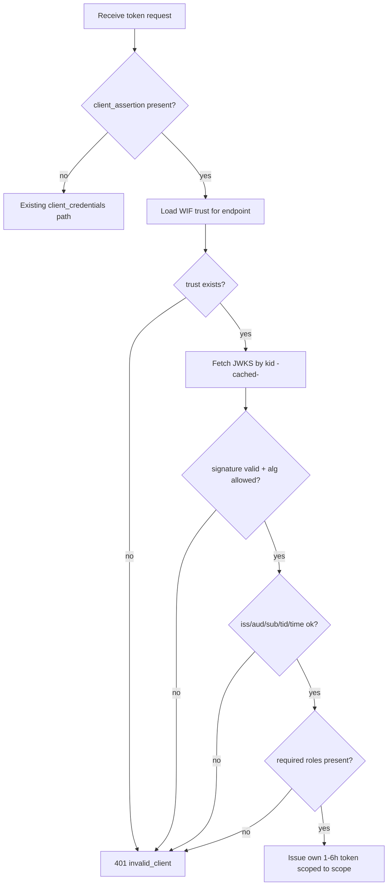

> **Guard fall-through note.** The token issued here is the ISV's own JWT, so the existing OAuth-JWT branch in [shared-secret.guard.ts](../../api/src/modules/auth/shared-secret.guard.ts) validates it on SCIM calls with no new code, provided the issuer/audience match what the guard expects per endpoint.

### 8.6 Per-endpoint enablement and auth coexistence

WIF is **one settings-enabled auth feature among several**, configured **per endpoint** exactly like every other SCIMServer capability. It is **not** a global mode and it does **not** replace the existing auth patterns - an operator turns it on for a specific endpoint by setting the `WifCredentialsEnabled` flag in that endpoint's profile settings (the same `endpoint.profile.settings` config object that holds `PerEndpointCredentialsEnabled`, `StrictSchemaValidation`, and the rest) and attaching a `wif` credential. Endpoints that do not enable it are completely unaffected, and an endpoint may keep its bearer / OAuth / legacy auth working alongside WIF during a migration.

**Each auth pattern keeps its own per-endpoint enabling mechanism:**

| Pattern | Per-endpoint enabling mechanism | Still works when WIF is on? |
|---|---|---|
| Per-endpoint bcrypt bearer (G11) | `PerEndpointCredentialsEnabled` flag + a `bearer` credential | Yes - unchanged |
| OAuth 2.0 JWT (issuer-mode) | The issued token is validated by the OAuth-JWT guard branch | Yes - WIF reuses this branch for its issued token |
| Legacy global bearer | `SCIM_SHARED_SECRET` (deployment-wide fallback) | Yes - unchanged |
| **WIF (Pattern 8)** | **`WifCredentialsEnabled` flag + a `wif` credential** | **n/a - this is the feature** |

**The guard's per-endpoint resolution order is additive (no branch is removed):**

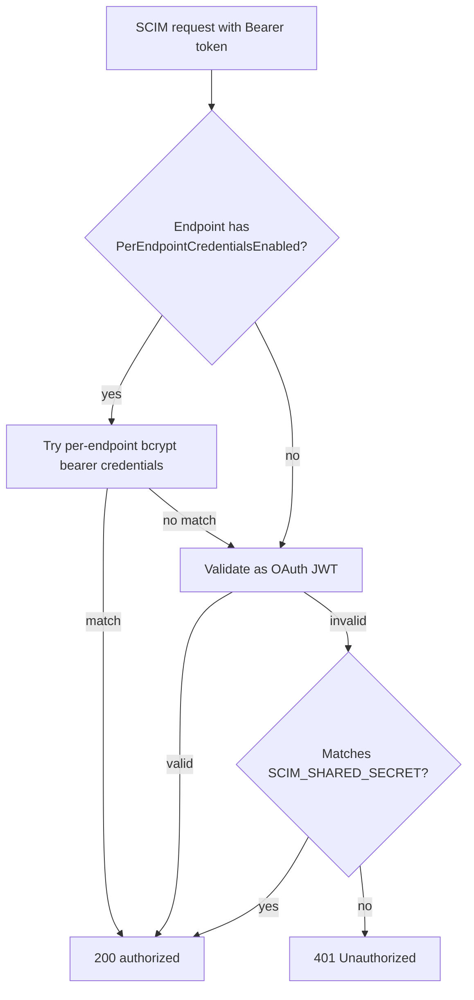

> **Where WIF plugs in.** WIF does not add a new SCIM-call branch. It adds a path at the **token endpoint** (gated by `WifCredentialsEnabled` + a `wif` credential) that mints the ISV's own JWT; that JWT is then accepted by the **existing** OAuth-JWT branch above. So enabling WIF on one endpoint changes only how that endpoint obtains a token, never how any other endpoint authenticates.

> **Config-flag discipline.** `WifCredentialsEnabled` is a normal endpoint config flag and MUST satisfy the 10-cell completeness matrix (`endpointConfigFlagAudit`): registry + default (`false`) + validator + enforcement + unit test + E2E test + live test + doc + UI Switch + UI test. Its default is `false`, so existing endpoints are untouched until an operator opts in.

### 8.7 Fitting WIF into the endpoint-creation model

SCIMServer endpoints are created from a **preset** (`profilePreset`, e.g. `entra-id`) or an **inline profile** ([create-endpoint.dto.ts](../../api/src/modules/endpoint/dto/create-endpoint.dto.ts)), and every behavioral flag lives in the typed `profile.settings` object ([ProfileSettings in endpoint-profile.types.ts](../../api/src/modules/scim/endpoint-profile/endpoint-profile.types.ts)). WIF must slot into that same model so the API and UI work exactly like every other feature - no special case.

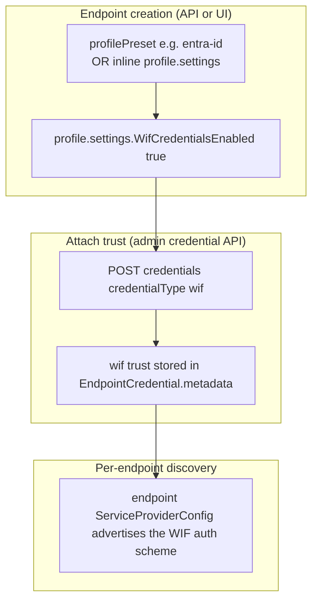

**Three source-grounded integration points:**

1. **Flag home is the typed profile settings.** Add `WifCredentialsEnabled?: boolean | string` to [ProfileSettings](../../api/src/modules/scim/endpoint-profile/endpoint-profile.types.ts) alongside `PerEndpointCredentialsEnabled`, and to the flag registry in [endpoint-config.interface.ts](../../api/src/modules/endpoint/endpoint-config.interface.ts). A preset (for example a future `entra-id-wif`) can pre-enable it; an inline profile can set it at create time. This is the same mechanism as the existing 13 flags, so the create/update endpoint API needs no new shape. The `wif` credential's stored trust record (`EndpointCredential.metadata`) carries an **`assertionProfile`** discriminator - `jwt-bearer` (RFC 7523) or `token-exchange` (RFC 8693), per [section 1.4](#14-two-assertion-profiles-rfc-7523-jwt-bearer-and-rfc-8693-token-exchange) - that selects which token-endpoint request shape the endpoint accepts. It defaults to `jwt-bearer` (today's shipped profile).

2. **The credential-create gate must become orthogonal.** Today [admin-credential.controller.ts](../../api/src/modules/scim/controllers/admin-credential.controller.ts) blocks **all** credential creation unless `PerEndpointCredentialsEnabled` is true. A `wif` credential is a different feature, so the gate must read: allow a `bearer` credential when `PerEndpointCredentialsEnabled` is on, **and** allow a `wif` credential when `WifCredentialsEnabled` is on - independently. The two flags are separate concerns (single-responsibility): an endpoint can run WIF without per-endpoint bearer tokens, or both at once during a migration.

| Requested `credentialType` | Required per-endpoint flag |
|---|---|
| `bearer` | `PerEndpointCredentialsEnabled` |
| `wif` | `WifCredentialsEnabled` |

3. **Enablement must surface in per-endpoint discovery (RFC 7644 section 4).** Every endpoint today advertises exactly one `oauthbearertoken` scheme (from `SCIM_SERVICE_PROVIDER_CONFIG` via [scim-discovery.service.ts](../../api/src/modules/scim/discovery/scim-discovery.service.ts)). When `WifCredentialsEnabled` is on, that endpoint's `/ServiceProviderConfig` SHOULD advertise an additional `SpcAuthenticationScheme` describing the WIF token-exchange, so a client can discover it. The profile already supports per-endpoint `authenticationSchemes` ([ServiceProviderConfig in endpoint-profile.types.ts](../../api/src/modules/scim/endpoint-profile/endpoint-profile.types.ts)), so this is a populate-on-enable, not a schema change.

```json
{
  "type": "oauth2",
  "name": "Workload Identity Federation (JWT Bearer Assertion)",
  "description": "RFC 7523 section 2.2 client authentication: present a signed JWT assertion at the token endpoint to receive a short-lived bearer token.",
  "specUri": "https://www.rfc-editor.org/rfc/rfc7523",
  "primary": false
}
```

When the endpoint's `assertionProfile` is `token-exchange`, the advertised scheme instead references RFC 8693:

```json
{
  "type": "oauth2",
  "name": "Workload Identity Federation (OAuth Token Exchange)",
  "description": "RFC 8693 token exchange: present a signed JWT as subject_token at the token endpoint to receive a short-lived bearer token.",
  "specUri": "https://www.rfc-editor.org/rfc/rfc8693",
  "primary": false
}
```

> **Design principle.** WIF adds capability without removing or mutating any existing behavior: a new optional flag in the existing settings object, a new branch in the existing credential-create gate, and an extra entry in the existing discovery list. Endpoints that do not opt in are byte-for-byte unchanged at every layer - config, auth, and discovery.

---

## 9. UI design

The CredentialsTab gains a "Federated Identity (WIF)" section, gated behind a config flag, that mirrors the three-step setup:

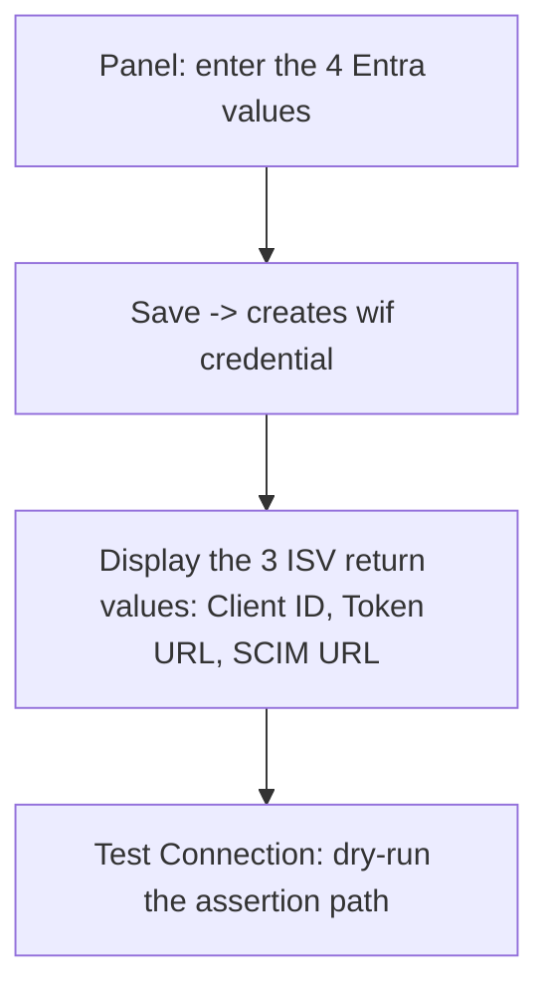

**R9 primitive mapping:**

| Field | Primitive |
|---|---|
| Issuer / Subject / Audience / JWKS URL (editable) | `EditableField` |
| Required roles / scope (editable) | `EditableField` |
| Client ID / Token URL / SCIM URL (read-only, copyable) | `CopyableField` |
| Full trust record (copy as JSON) | `CopyJsonButton` |

- **Gating flag:** a `WifCredentialsEnabled` boolean in the config registry, set **per endpoint** in that endpoint's profile settings (default `false`). The "Federated Identity (WIF)" section renders only when the endpoint has opted in; endpoints without it see no change. 10-cell completeness per `endpointConfigFlagAudit`.
- **Test Connection UX:** posts a synthetic assertion (or asks the operator to trigger one) and reports each validation step's pass/fail with the specific failing claim.
- **Coverage:** Playwright spec under `web/e2e/` exercising the WIF panel end-to-end; vitest for the panel's rendered structure and primitive presence by `data-testid`.

---

## 10. Security analysis

| Threat | Mitigation |
|---|---|
| Algorithm confusion (`alg: none` / HMAC with public key) | Pin allowed algs to RS256/ES256; reject everything else |
| JWKS SSRF (attacker-controlled `jwksUri`) | Allowlist hosts (Microsoft login domains); validate URL scheme/host before fetch |
| JWKS cache poisoning | Cache by `kid` from a verified response only; bounded max-age; refetch on unknown `kid` |
| Replay of an assertion | Short `exp`; optional `jti` single-use cache; assertions are client-auth only, not resource tokens |
| Token leakage | Issued token is short-lived (1-6 h); never log the assertion or the issued token |
| Cross-tenant access | Enforce `tid` equals the configured `allowedTenantId` |
| Privilege escalation | Enforce `requiredRoles` subset of `roles`; missing role -> 401 |
| Secret leak via response | `wif` credential has no secret; contract test asserts no secret/hash key appears on the response |
| JWKS outage | Fail closed - never skip signature verification |

---

## 11. Quality gates and test matrix

| Layer | WIF additions |
|---|---|
| Pre-Q.A | Structured config flag-type tests (10-cell matrix) |
| Pre-Q.B | Asymmetric, externalized signing key tests |
| Unit (`.service.spec.ts` + `.controller.spec.ts`) | Validator: good assertion, bad sig, wrong iss/aud/sub/tid, expired, missing role, `alg:none` rejected, unknown `kid` refetch, JWKS-down fail-closed |
| E2E (`test/e2e/*.e2e-spec.ts`) | Register `wif` credential -> POST assertion -> receive own token -> use token on SCIM call |
| Live (`scripts/live-test.ps1`) | New section: form-urlencoded assertion exchange across local/Docker/Azure |
| Contract | `expect(ALLOWED_KEYS).toContain(key)` asserts no secret/hash key on the `wif` response |
| OAuth error conformance | RFC 6749 section 5.2: `invalid_client` on bad assertion; `invalid_request` on malformed form body |
| RFC audit | RFC 7521 + RFC 7523 section 2.2 + RFC 7519 + RFC 7517 + RFC 6749 section 5.2 |

---

## 12. Error responses and RFC 6749 conformance

Every WIF rejection maps to an RFC 6749 section 5.2 error object so Entra (SyncFabric) receives a standards-compliant `{ "error": ..., "error_description": ... }`. The validator MUST stay tight-lipped: the same generic `invalid_client` is returned for a bad signature, a wrong `iss`, or a missing role, while the specific failing claim is logged server-side only. This denies an attacker a claim-by-claim oracle.

| Condition | HTTP | `error` (RFC 6749 5.2) | `error_description` (client-facing, generic) | Server-side log (detailed) |
|---|---|---|---|---|
| Wrong `Content-Type`, missing or empty form fields | 400 | `invalid_request` | "Malformed token request" | which field was absent |
| `client_assertion_type` not the `jwt-bearer` URN | 400 | `invalid_request` | "Unsupported client_assertion_type" | the value received |
| `grant_type` not `client_credentials` | 400 | `unsupported_grant_type` | "Only client_credentials is supported" | the grant received |
| Requested `scope` not the configured WIF scope | 400 | `invalid_scope` | "Requested scope is not permitted" | requested vs configured |
| No `wif` trust configured for the endpoint | 401 | `invalid_client` | "Client authentication failed" | endpoint id, no wif trust |
| Signature invalid, disallowed alg, or `alg: none` | 401 | `invalid_client` | "Client authentication failed" | alg seen, kid, reason |
| `iss` / `aud` / `sub` / `tid` mismatch | 401 | `invalid_client` | "Client authentication failed" | which claim, expected vs got |
| Outside `iat` / `nbf` / `exp` window | 401 | `invalid_client` | "Client authentication failed" | now, nbf, exp, skew applied |
| Required role missing from `roles` | 401 | `invalid_client` | "Client authentication failed" | required set, granted set |
| JWKS fetch failed and no cached key (fail closed) | 401 | `invalid_client` | "Client authentication failed" | jwksUri, fetch error |

> **Why `invalid_client` for authorization failures too.** At the token endpoint the only principal is the client itself, so an unmet role is a client-authorization failure, not a resource-scope failure. RFC 6749 section 5.2 has no `forbidden` code for this hop, so `invalid_client` (401) is the conformant choice and the missing role is logged for the operator. The resource-level role checks (on the SCIM calls) are a separate concern handled by the guard.

---

## 13. Step-by-step implementation plan

> This plan is **TDD-first** (Stage 0 of the standing quality gates): write the failing test, make it green with the smallest change, refactor green. Each step names the files it touches, the **RED test** to write first, and the **gate** that must pass before the step is done. Nothing here is implemented yet; this is the ordered recipe.

### 13.1 Build order at a glance

```mermaid
gantt
    title Phase Q6 WIF build order (relative units, not calendar dates)
    dateFormat X
    axisFormat %s
    section Prerequisites
    Pre-Q.A structured flag type         :prea, 0, 2
    Pre-Q.B asymmetric externalized key  :preb, 0, 3
    section Q1 Q2 primitives
    Q1 per-endpoint OAuth client          :q1, after preb, 3
    Q2 external JWKS validator            :q2, after preb, 3
    section Q6 WIF
    Q6.1 form-urlencoded assertion intake :q61, after q1, 2
    Q6.2 wif credentialType persistence   :q62, after prea, 2
    Q6.3 WifAssertionValidatorService     :q63, after q2, 3
    Q6.4 own-token issuance scoped        :q64, after q63, 1
    Q6.5 reciprocal CredentialsTab UI     :q65, after q64, 3
```

### 13.2 Pre-Q.A - structured config flag type

The flag registry today is `boolean | string` only. WIF needs a flag whose value is a structured object (the trust record), so the registry must learn a `structured` flag-type with its own validator. Honor the 10-cell completeness matrix (`endpointConfigFlagAudit`): registry + default + validator + enforcement + unit test + E2E test + live test + doc + UI Switch + UI test.

| Step | Action | Files | RED test first | Gate |
|---|---|---|---|---|
| A1 | Add a `structured` value-kind to the flag-type union and metadata | [endpoint-config.interface.ts](../../api/src/modules/endpoint/endpoint-config.interface.ts) | unit: a structured flag round-trips through `validateEndpointConfig` | 1.2 build, 2.1 unit |
| A2 | Add `validateStructuredFlag()` (shape check + reject unknown keys) | [endpoint-config.interface.ts](../../api/src/modules/endpoint/endpoint-config.interface.ts) | unit: malformed structured value -> validation error | 2.1 unit |
| A3 | Document the new flag-type | [ENDPOINT_CONFIG_FLAGS_REFERENCE.md](../ENDPOINT_CONFIG_FLAGS_REFERENCE.md) | n/a (doc) | 3c.2 docs audit |

### 13.3 Pre-Q.B - asymmetric, externalized signing key

Today [oauth.service.ts](../../api/src/oauth/oauth.service.ts) signs with HS256 using a process-lifetime random secret. For the ISV to publish a JWKS that any client can verify, issuance must move to an **asymmetric** key (RS256/ES256) loaded from configuration, and the public half must be published.

| Step | Action | Files | RED test first | Gate |
|---|---|---|---|---|
| B1 | Load an RS256/ES256 private key + `kid` from config; fall back to a generated dev key | [oauth.service.ts](../../api/src/oauth/oauth.service.ts) | unit: signed token header carries `alg: RS256` and a `kid` | 2.1 unit |
| B2 | Publish the public JWKS at a stable path | new `api/src/oauth/jwks.controller.ts` | E2E: fetching the JWKS returns the active `kid` | 2.2 E2E |
| B3 | Verify issued tokens with the public key in the guard's OAuth branch | [shared-secret.guard.ts](../../api/src/modules/auth/shared-secret.guard.ts) | unit: a token signed by B1 validates; an HS256 token does not | 2.1 unit, 2.5 parity |

### 13.4 Q6.1 - form-urlencoded assertion intake

The token endpoint must parse `application/x-www-form-urlencoded` and accept the `client_assertion` + `client_assertion_type` fields. Today it reads JSON via `@Body()` and requires `client_secret`.

| Step | Action | Files | RED test first | Gate |
|---|---|---|---|---|
| C1 | Enable the urlencoded body parser | [api/src/main.ts](../../api/src/main.ts) | E2E: a form-urlencoded POST reaches the controller with populated fields | 2.2 E2E |
| C2 | Extend `TokenRequest` with `client_assertion` + `client_assertion_type`; route assertion requests to the WIF path | [oauth.controller.ts](../../api/src/oauth/oauth.controller.ts) | unit: a request with `client_assertion` is dispatched to the validator, not the secret path | 2.1 unit |
| C3 | Emit RFC 6749 5.2 errors per the section 12 catalog | [oauth.controller.ts](../../api/src/oauth/oauth.controller.ts) | unit: malformed body -> `invalid_request`; unknown assertion type -> `invalid_request` | 2.1 unit, 3a.3 error-handling |

### 13.5 Q6.2 - `wif` credentialType persistence (no secret)

Reuse the existing `EndpointCredential.credentialType` + `metadata` JSON columns - no new column, no secret stored. Both the Prisma and InMemory backends must behave identically (`crossBackendParityAudit`).

| Step | Action | Files | RED test first | Gate |
|---|---|---|---|---|
| D1 | Accept `credentialType: 'wif'` with a validated trust `metadata` shape | endpoint-credential service + DTO | unit: a `wif` credential persists trust values, no secret/hash field | 2.1 unit |
| D2 | Mirror behavior in the InMemory repository | [api/src/infrastructure/repositories/inmemory](../../api/src/infrastructure/repositories/inmemory) | unit: InMemory create matches Prisma create | 2.5 + 2.6 parity |
| D3 | Add the Prisma migration if any enum/constraint changes | [api/prisma](../../api/prisma) | n/a | 1.9 prismaMigrationAudit |
| D4 | Contract test: the `wif` response carries no secret/hash key | E2E + live | E2E: `expect(ALLOWED_KEYS).toContain(key)` over the response | 3a.2 apiContractVerification |
| D5 | Make the create gate orthogonal: add `'wif'` to the allowlist and permit it when `WifCredentialsEnabled` is on (independent of `PerEndpointCredentialsEnabled`) | [admin-credential.controller.ts](../../api/src/modules/scim/controllers/admin-credential.controller.ts) | unit: `wif` create allowed when only `WifCredentialsEnabled` is on; `bearer` still requires `PerEndpointCredentialsEnabled` | 2.1 unit, 3b.4 security |

### 13.6 Q6.3 - `WifAssertionValidatorService`

A new service that reuses the Q2 `jose` JWKS client to run the full validation lifecycle (the section 4 state diagram): signature + alg-pinning + `iss`/`aud`/`sub`/`tid` + time window + required roles, failing closed on JWKS outage.

| Step | Action | Files | RED test first | Gate |
|---|---|---|---|---|
| E1 | Validate signature against the configured JWKS; pin RS256/ES256 | new `api/src/oauth/wif-assertion-validator.service.ts` | unit: good sig passes; `alg: none` + HMAC rejected | 2.1 unit, 3b.4 security |
| E2 | Validate `iss`/`aud`/`sub`/`tid` + time window | same | unit: each wrong claim -> rejection | 2.1 unit |
| E3 | Enforce `requiredRoles` subset of `roles` | same | unit: missing role -> rejection | 2.1 unit |
| E4 | Cache JWKS by `kid`; refetch on unknown `kid`; fail closed on outage | same | unit: unknown `kid` triggers refetch; outage with no cache -> reject | 2.1 unit, 3b.4 security |

### 13.7 Q6.4 - own-token issuance scoped to the configured scope

On a valid assertion, mint the ISV's own short-lived (1-6 h) token scoped to the configured `scope`, using the Pre-Q.B asymmetric key.

| Step | Action | Files | RED test first | Gate |
|---|---|---|---|---|
| F1 | Issue a per-endpoint token with `issuedTokenTtlSec` + `scope` | [oauth.service.ts](../../api/src/oauth/oauth.service.ts) | unit: issued token carries the configured scope + ttl | 2.1 unit |
| F2 | Wire validator -> issuer in the controller | [oauth.controller.ts](../../api/src/oauth/oauth.controller.ts) | E2E: assertion in -> own token out -> token authorizes a SCIM call | 2.2 E2E, 4.x live |
| F3 | Q6.6: advertise the WIF `SpcAuthenticationScheme` in the endpoint's `/ServiceProviderConfig` when `WifCredentialsEnabled` is on | [scim-discovery.service.ts](../../api/src/modules/scim/discovery/scim-discovery.service.ts) | E2E: enabled endpoint advertises both `oauthbearertoken` and the WIF scheme; disabled endpoint advertises only `oauthbearertoken` | 2.2 E2E, 3b.2 auditAgainstRFC |

### 13.8 Q6.5 - reciprocal CredentialsTab UI

A "Federated Identity (WIF)" section in the CredentialsTab, gated by a `WifCredentialsEnabled` flag, mirroring the three-step setup: enter the 4 Entra values, display the 3 ISV return values, run a Test Connection dry-run. All fields go through R9 primitives.

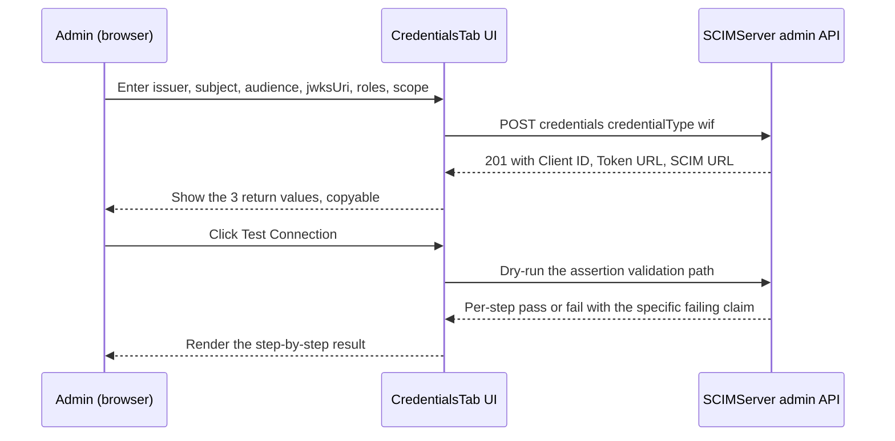

| Step | Action | Files | RED test first | Gate |
|---|---|---|---|---|
| G1 | Add the gated "Federated Identity (WIF)" section | [CredentialsTab.tsx](../../web/src/pages/CredentialsTab.tsx) | vitest: section renders the 4 `EditableField`s + 3 `CopyableField`s by `data-testid` | 2.3 vitest |
| G2 | Wire Save -> `wif` credential create; show the 3 return values | [CredentialsTab.tsx](../../web/src/pages/CredentialsTab.tsx) | vitest: save calls the API; return values render | 2.3 vitest |
| G3 | Test Connection dry-run with per-step result | [CredentialsTab.tsx](../../web/src/pages/CredentialsTab.tsx) | Playwright: full panel flow end-to-end | 5.3 Playwright |
| G4 | Add the `WifCredentialsEnabled` flag (10-cell matrix) | flag registry + UI Switch | unit + vitest per the matrix | 3b.3 endpointConfigFlagAudit |

### 13.9 Migration and rollout (secret-based endpoint to WIF)

WIF can be adopted without downtime by running both auth modes during a cutover window, then removing the legacy secret.

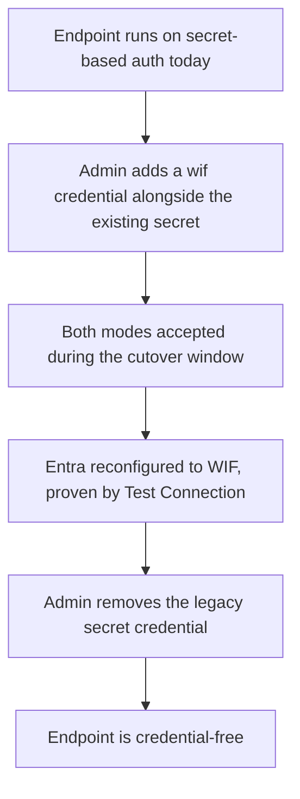

### 13.10 Definition of done

A WIF commit is complete only when the standing **Feature / Bug-Fix Commit Checklist** is satisfied for the steps it lands: unit + E2E + live tests, a Playwright spec for any `web/` change, the feature doc updated, [INDEX.md](../INDEX.md) + [CHANGELOG.md](../../CHANGELOG.md) + Session and context files updated, the version bumped, and the response-contract test proving no secret leaks on the `wif` credential.

---

## 14. Effort estimates

> **What this is.** A bottom-up effort estimate in **ideal engineering-days for one developer already fluent in this codebase**, working TDD-first and reusing the existing G11 / OAuth / dual-backend patterns. "Ideal day" = focused build + test time, excluding meetings, context-switching, and review latency. These are effort sizes, not calendar dates; see the calendar note below.

> **Basis (2026-06-11 source check).** The §5 verified-greenfield note governs this estimate: `jose`/JWKS, form-urlencoded parsing, `client_assertion`, asymmetric issuance, and a real per-endpoint OAuth client are all absent today, so Q6 must build its full prerequisite stack. Nothing below is discounted as "already done."

| Phase | Low (days) | High (days) | Primary effort driver |
|---|---|---|---|
| Pre-Q.A structured flag type | 1 | 2 | registry + validator + 10-cell flag matrix |
| Pre-Q.B asymmetric key + JWKS publish | 2 | 3 | key load, `kid`, new JWKS controller, guard verify |
| Q1 per-endpoint OAuth client | 3 | 4 | model + issuance + dual-backend parity |
| Q2 external JWKS validator (`jose`) | 3 | 4 | new dep, alg-pinning, cache, fail-closed, SSRF allowlist |
| Q6.1 form-urlencoded intake | 1 | 2 | body parser + routing + error catalog (section 12) |
| Q6.2 `wif` persistence (no secret) | 2 | 2 | DTO + parity + no-secret contract test |
| Q6.3 `WifAssertionValidatorService` | 3 | 4 | security core; heaviest test surface |
| Q6.4 own-token issuance | 1 | 1 | wiring validator -> issuer |
| Q6.5 reciprocal CredentialsTab UI | 3 | 4 | UI + vitest + Playwright + flag matrix |
| **Subtotal (build + unit/E2E)** | **19** | **29** | |
| Quality-gate overhead (~25%) | 5 | 9 | live-test.ps1 (local/Docker/Azure), Playwright-vs-dev, full pipeline, CHANGELOG/Session/docs, Stage X audits |
| **Total ideal dev-days** | **~24** | **~38** | roughly 5 to 8 ideal engineering-weeks |

**Critical path and parallelism:**

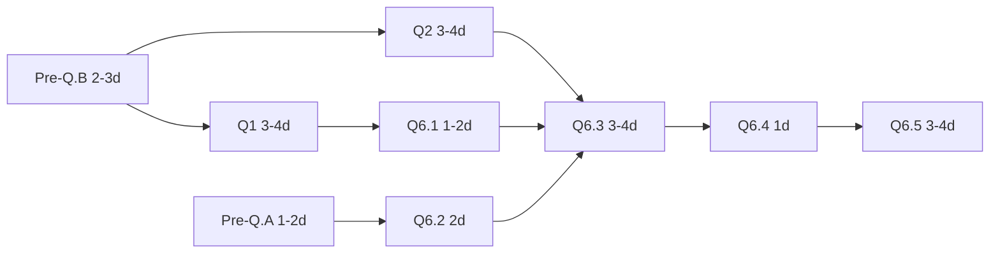

- Pre-Q.A and Pre-Q.B have no dependency on each other; Q1 and Q2 can run in parallel once Pre-Q.B lands. With two developers the calendar compresses toward roughly 3 to 4 weeks while total effort is unchanged.
- **Q6.3 is the long pole by risk, not size.** Its code is modest, but the security tests (algorithm confusion, fail-closed on JWKS outage, tenant isolation, JWKS rotation by `kid`) are where estimates slip.

**Confidence and what moves the number:**

| Factor | Effect |
|---|---|
| Developer new to the repo | roughly doubles the total |
| Q4 (Auth-Code) or Q5 (mTLS/DPoP) pulled in | out of scope here; each is its own multi-day effort |
| Review cycles + CI queue + serialized shared `scimserver-dev` Azure target | extends **calendar** time beyond ideal-days; not sizable from the repo alone |
| Reusing `jose` defaults rather than hand-rolling JWKS caching | trims Q2 toward the low end |

> **Calendar caveat.** Ideal dev-days are not wall-clock days. The standing multi-stage gate suite (Stages 0-6 plus Stage X audits), the single shared dev Azure environment that must be serialized across concurrent work, and human review latency all stretch calendar delivery. Treat ~24-38 ideal dev-days as the **effort floor**, then apply your team's historical ideal-to-calendar ratio.

---

## 15. FAQ

**Is this RFC 7523 grant-type usage?** No. It is RFC 7523 **section 2.2** (JWT used for **client authentication**), with `grant_type=client_credentials`. The assertion authenticates the client; it is not the grant.

**Does Entra's JWT ride the SCIM calls?** No. It is presented once at the token endpoint. The ISV's own issued token rides the SCIM calls.

**Do we store any secret?** No. WIF stores only public trust values. The contract tests assert no secret leaks on the response.

**How is this different from Pattern 4 (direct external JWT)?** Pattern 4 verifies Entra's JWT on every SCIM request and issues nothing. WIF adds a token-exchange hop and mints the ISV's own token.

**What is the issued token's lifetime?** 1-6 hours per the Entra spec; configurable per endpoint via `issuedTokenTtlSec`.

**What are the "two profiles" and which do we build first?** `jwt-bearer` (RFC 7523, Entra's JWT as `client_assertion`, `grant_type=client_credentials`) is shipped today and is the SAP SuccessFactors flow - build it first. `token-exchange` (RFC 8693, Entra's JWT as `subject_token`, `grant_type=token-exchange`) is upcoming (Google's flow). They are selected per endpoint by the `assertionProfile` discriminator; the JWKS validation of Entra's JWT is identical for both. See [section 1.4](#14-two-assertion-profiles-rfc-7523-jwt-bearer-and-rfc-8693-token-exchange).

**Are app roles validated today?** No. Roles are not currently passed in the assertion or validated; the role-enforcement requirement is forward-looking and tied to a planned "1P app method" change. Design the validator to switch role enforcement on per endpoint, but do not hard-require a `roles` claim Entra does not yet send. See the upcoming-changes note in [section 4](#4-the-assertion-claims-validation-jwks).

**Which claim identifies the customer who set up the provisioning job?** Per the internal one-pager, the ISV maps an incoming exchange to a customer account by **either** the tenant segment in the token-endpoint URL (`https://isv.com/{tenant}/token-endpoint`) **or** the `client_id` in the request body. SCIMServer already does the former: the per-endpoint path `/endpoints/{id}/oauth/token` carries the endpoint (customer) identity, so the `{id}` segment selects the right `wif` trust record. The `client_id` cross-check ([section 4](#4-the-assertion-claims-validation-jwks)) is the second, body-based signal.

**How does Entra get the assertion in the first place?** A pre-existing MSI on SyncFabric's prod machines acquires a sub-identity token (~24h), exchanges it for an impersonated-application token (~1h) as a per-customer Workload Identity app, and presents that as the assertion. The ISV side is unaffected by this; see [section 2.3](#23-how-entra-mints-the-assertion-the-syncfabric-backend).

---

## 16. References

### Primary (internal + reconciled)

- Internal Entra design doc - "Workload Identity Federation between Entra Provisioning (SyncFabric) and SaaS ISVs"

### Microsoft Learn

- [Tutorial: Develop and plan provisioning for a SCIM endpoint](https://learn.microsoft.com/en-us/entra/identity/app-provisioning/use-scim-to-provision-users-and-groups)
- [Tutorial: Develop a sample SCIM endpoint](https://learn.microsoft.com/en-us/entra/identity/app-provisioning/use-scim-to-build-users-and-groups-endpoints)
- [AzureAD/SCIMReferenceCode](https://github.com/AzureAD/SCIMReferenceCode)

### v2 token-format finding (2026-06-09; see section 4.1 DECIDED)

- [AzureAD/SCIMReferenceCode - Workload Identity Federation for SCIM Provisioning](https://github.com/AzureAD/SCIMReferenceCode/blob/master/Workload-Identity-Federation-for-SCIM-Provisioning.md) - public reference updated 2026-06-09 ("Update WIF SCIM article for Entra v2 tokens"); documents the v2.0 issuer/audience now adopted in sections 3, 4, and 4.1. Its example renders `aud` as `api://{appid}`, but the 2026-06-12 reviewer (Entra provisioning owner) corrected the actual emitted v2 `aud` to the bare `{appid}` GUID
- [Microsoft Learn - Access tokens in the Microsoft identity platform](https://learn.microsoft.com/en-us/entra/identity-platform/access-tokens) - `iss` v1.0 `sts.windows.net/{tenantid}/` vs v2.0 `login.microsoftonline.com/{tenantid}/v2.0`; `ver` discriminator
- [Microsoft Learn - Access token claims reference](https://learn.microsoft.com/en-us/entra/identity-platform/access-token-claims-reference) - claim-by-claim reference for v1.0 and v2.0 (`aud`, `iss`, `ver`, `appid`/`azp`)
- [Microsoft Learn - Microsoft identity platform and the OAuth 2.0 client credentials flow](https://learn.microsoft.com/en-us/entra/identity-platform/v2-oauth2-client-creds-grant-flow) - the v2.0 client-credentials request shape

### Entra OIDC discovery documents (fetched directly 2026-06-15; the authoritative basis for the JWKS-path and issuer reconciliation notes in section 1.5)

- [v1.0 metadata - `/common/.well-known/openid-configuration`](https://login.microsoftonline.com/common/.well-known/openid-configuration) - returns `jwks_uri = https://login.microsoftonline.com/common/discovery/keys`, `issuer = https://sts.windows.net/{tenantid}/`, and lists `private_key_jwt` in `token_endpoint_auth_methods_supported`
- [v2.0 metadata - `/common/v2.0/.well-known/openid-configuration`](https://login.microsoftonline.com/common/v2.0/.well-known/openid-configuration) - returns `jwks_uri = https://login.microsoftonline.com/common/discovery/v2.0/keys`, `issuer = https://login.microsoftonline.com/{tenantid}/v2.0`, and also lists `private_key_jwt`. Confirms (a) the `/v2.0/` keys-path delta and (b) that the v2 issuer template embeds `{tenantid}`

### IETF

> **Local copies.** The authoritative RFC text is mirrored in-repo under [rfcs/](rfcs/) so the normative source travels with the design, and each load-bearing RFC has a companion plain-language explainer in this repo. Online links point at rfc-editor.org (datatracker.ietf.org returns HTTP 403 to automated fetch).

- **RFC 7521** - Assertion Framework for OAuth 2.0 Client Authentication and Authorization Grants. Local copy: [rfcs/rfc7521.txt](rfcs/rfc7521.txt). The umbrella framework RFC 7523 profiles.
- **[RFC 7523](https://www.rfc-editor.org/rfc/rfc7523)** - JWT Profile for OAuth 2.0 Client Authentication and Authorization Grants (May 2015). WIF uses **section 2.2 client authentication** - the `jwt-bearer` profile. Local copy: [rfcs/rfc7523.txt](rfcs/rfc7523.txt); explainer: [RFC_7523_EXPLAINED.md](RFC_7523_EXPLAINED.md). Key normative facts (deep-dive in [section 4.2](#42-rfc-7523-in-depth-the-jwt-bearer-profile)): `client_assertion` MUST carry exactly one JWT; `sub` MUST equal the `client_id`; `iss`/`aud` compared by Simple String Comparison; `exp` mandatory; failure code `invalid_client`; RS256 mandatory-to-implement.
- **[RFC 8693](https://www.rfc-editor.org/rfc/rfc8693)** - OAuth 2.0 Token Exchange (January 2020) - the `token-exchange` profile; authored by Microsoft (Mike Jones, Tony Nadalin) with Ping/Yubico/Visa. Local copy: [rfcs/rfc8693.txt](rfcs/rfc8693.txt); explainer: [RFC_8693_EXPLAINED.md](RFC_8693_EXPLAINED.md). Key normative facts (deep-dive in [section 4.3](#43-rfc-8693-in-depth-the-token-exchange-profile)): `grant_type=urn:ietf:params:oauth:grant-type:token-exchange`; REQUIRED `subject_token`/`subject_token_type`; REQUIRED `issued_token_type` response member; optional `resource`/`audience`/`scope`/`requested_token_type`/`actor_token`; impersonation vs delegation (`act`, `may_act`); failure codes `invalid_request`/`invalid_target`; RFC 8693 names RFC 7523 as an allowed client-auth method (the composition point).
- **RFC 7519** - JSON Web Token (JWT)
- **RFC 7517** - JSON Web Key (JWK)
- **RFC 6749** - The OAuth 2.0 Authorization Framework (section 5.2 error responses)
- **RFC 7644** - SCIM Protocol (section 2 Authentication and Authorization)

### In-repo

- [ISV_AUTH_PATTERNS_AND_SCIMSERVER_GAP_PLAN.md](ISV_AUTH_PATTERNS_AND_SCIMSERVER_GAP_PLAN.md) - the Phase Q plan that schedules Q6
- [G11_PER_ENDPOINT_CREDENTIALS.md](G11_PER_ENDPOINT_CREDENTIALS.md) - the per-endpoint-bearer architecture WIF extends
- [api/src/oauth/oauth.controller.ts](../../api/src/oauth/oauth.controller.ts) - the token endpoint to extend
- [api/src/oauth/oauth.service.ts](../../api/src/oauth/oauth.service.ts) - the issuer to make per-endpoint
- [api/src/modules/auth/shared-secret.guard.ts](../../api/src/modules/auth/shared-secret.guard.ts) - the auth fallback chain
- [api/src/modules/endpoint/endpoint-config.interface.ts](../../api/src/modules/endpoint/endpoint-config.interface.ts) - the flag registry (needs `structured` type)
- [web/src/pages/CredentialsTab.tsx](../../web/src/pages/CredentialsTab.tsx) - the UI surface for the reciprocal portal

---

This document is analysis + design only; no code has been implemented.
