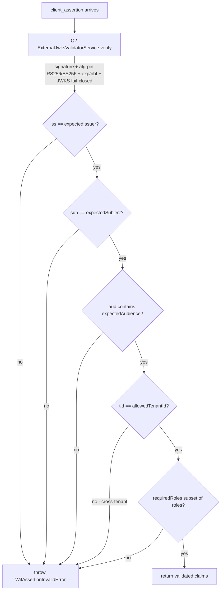

# Q6 - WIF assertion validation, issuance, and reciprocal UI

> Step 10 of the reconciled authentication build (`docs/auth/AUTHENTICATION_ARCHITECTURE.md` section 13). This is the WIF-critical milestone: it binds the A3 token-endpoint seam to a real federated-identity validator + issuer and ships the reciprocal admin UI.

## 1. What Q6 adds

Q6 makes the per-endpoint token endpoint accept a signed identity-provider assertion (RFC 7523 `jwt-bearer`), validate it against a per-endpoint trust, and mint the ISV's own short-lived access token. It also surfaces the whole flow in the admin UI.

| Sub-step | Deliverable | Files |
|---|---|---|
| Q6.3 | `WifAssertionValidatorService` - the WIF security core (claims on top of the Q2 JWKS primitive) | [api/src/oauth/wif-assertion-validator.service.ts](../../api/src/oauth/wif-assertion-validator.service.ts) |
| Q6.4 | Own-token issuance scoped to the configured scope + ttl, wired through the A3 provider seam | [api/src/oauth/oauth.service.ts](../../api/src/oauth/oauth.service.ts) + [api/src/modules/scim/controllers/wif-assertion-token.provider.ts](../../api/src/modules/scim/controllers/wif-assertion-token.provider.ts) |
| Q6.6 | Advertise the WIF scheme in `/ServiceProviderConfig` when `WifCredentialsEnabled` is on | [api/src/modules/scim/discovery/authentication-schemes.ts](../../api/src/modules/scim/discovery/authentication-schemes.ts) |
| Q6.5 | Reciprocal "Federated Identity (WIF)" section on the CredentialsTab + the `WifCredentialsEnabled` Switch | [web/src/pages/CredentialsTab.tsx](../../web/src/pages/CredentialsTab.tsx) + [web/src/pages/SettingsTab.tsx](../../web/src/pages/SettingsTab.tsx) |

Q6.1 (form-urlencoded intake) and Q6.2 (`wif` credential persistence) shipped earlier in A3 and A1 respectively; Q6 consumes them.

## 2. Validation lifecycle (Q6.3)

The `WifAssertionValidatorService.validate(assertion, trust)` runs the full state machine and either returns the validated claims or throws `WifAssertionInvalidError`:

Layering on Q2 means the algorithm-confusion defense (no `alg:none`, no HMAC), the SSRF JWKS-host allowlist, the cache-by-`kid` + refetch-on-rotation, and the fail-closed-on-outage guarantees are all inherited - Q6 only adds the WIF claim checks.

## 3. The three-outcome acceptor (Q6.4)

`WifAssertionTokenProvider` implements the A3 `IAssertionTokenProvider` seam and is bound to the `ASSERTION_TOKEN_PROVIDER` token in [scim.module.ts](../../api/src/modules/scim/scim.module.ts). It maps the architecture section 2.2 contract:

| Endpoint state | Provider returns | Token-endpoint result |
|---|---|---|
| No `wif` credential on the endpoint | `null` (not-mine-continue) | `invalid_client` |
| `wif` credential present, assertion valid | `{ accessToken, expiresIn, scope }` (accept) | `201` with the minted token |
| `wif` credential present, assertion invalid | throws (mine-but-invalid-stop) | `invalid_client` |
| `wif` credential metadata missing a required field | throws (fail closed) | `invalid_client` |

The minted token is the ISV's OWN token (the Entra assertion is presented once at the token endpoint and never rides the SCIM calls). It carries the `endpoint_id` claim, so the resource guard authorizes it only for that endpoint. The scope is the admin-configured `scope` from the trust (used verbatim, not caller-requested), and the lifetime is the configured `issuedTokenTtlSec` clamped to the Entra 1-6h window.

## 4. Discovery advertisement (Q6.6)

`computeAuthenticationSchemes(baseline, authentication, { wifCredentialsEnabled })` appends a `Workload Identity Federation` scheme (type `oauth2`, specUri RFC 7523) when the endpoint's `WifCredentialsEnabled` flag is on AND no enabled `wif-*` method already advertises one. [scim-discovery.service.ts](../../api/src/modules/scim/discovery/scim-discovery.service.ts) reads the flag from `profile.settings`.

## 5. Reciprocal UI (Q6.5)

The CredentialsTab gains a gated "Federated Identity (WIF)" section that mirrors the three-step setup:

1. Enter the Entra trust values (issuer, subject, audience, JWKS URI, tenant + optional required roles and scope) through `EditableField` (copy / undo / redo / reset).
2. Save -> creates a `wif` credential (all public values, no secret) and renders the 3 ISV return values (Client ID, Token URL, SCIM URL) through `CopyableField`.
3. Test Connection -> a client-side readiness dry-run with a per-step pass/fail result. The authoritative validation runs server-side when a real assertion is presented at the token endpoint.

The whole trust payload is grabbable via `CopyJsonButton`. The section is gated by the `WifCredentialsEnabled` Switch added to the SettingsTab (the 10-cell flag matrix's UI cells).

## 6. No-secret guarantee

WIF stores only public trust values. The `wif` credential rides `EndpointCredential.metadata` with an empty `credentialHash`, and the response/list contract carries no `token` / `clientSecret` / `credentialHash` key. This is asserted at the E2E and live layers.

## 7. Test coverage

| Layer | File | Count |
|---|---|---|
| Unit - validator | [wif-assertion-validator.service.spec.ts](../../api/src/oauth/wif-assertion-validator.service.spec.ts) | 11 |
| Unit - issuance | [oauth.service.spec.ts](../../api/src/oauth/oauth.service.spec.ts) (generateEndpointAccessToken describe) | 6 |
| Unit - provider | [wif-assertion-token.provider.spec.ts](../../api/src/modules/scim/controllers/wif-assertion-token.provider.spec.ts) | 4 |
| Unit - discovery | [authentication-schemes.spec.ts](../../api/src/modules/scim/discovery/authentication-schemes.spec.ts) (Q6.6 describe) | 3 |
| E2E | [wif-assertion.e2e-spec.ts](../../api/test/e2e/wif-assertion.e2e-spec.ts) | 8 |
| Live | `scripts/live-test.ps1` section 9z-AT | 6 |
| Web vitest | [CredentialsTab.test.tsx](../../web/src/pages/CredentialsTab.test.tsx) (WIF describe) + [SettingsTab.test.tsx](../../web/src/pages/SettingsTab.test.tsx) | 5 + 1 |
| Playwright | [web/e2e/wif-credentials.spec.ts](../../web/e2e/wif-credentials.spec.ts) | 3 |

## 8. RFC references

- RFC 7523 section 2.2 - JWT used for client authentication (the WIF `jwt-bearer` profile; `grant_type=client_credentials`).
- RFC 6749 section 5.2 - token-endpoint error responses (`invalid_client`, `invalid_request`).
- RFC 7643 section 5 - `authenticationSchemes` discovery vocabulary.
- RFC 7517 / 7638 - JWKS + key thumbprint (inherited from Q2 / Pre-Q.B).
