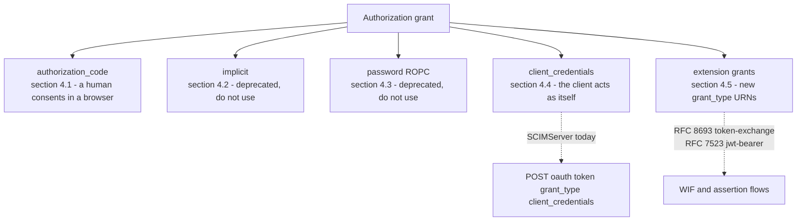

# RFC 6749 Explained - The OAuth 2.0 Authorization Framework

> **What this is.** A plain-language, implementation-focused walkthrough of [RFC 6749](https://www.rfc-editor.org/rfc/rfc6749) (Proposed Standard, October 2012; Hardt, Ed.). The authoritative text is mirrored in-repo at [rfc6749.txt](rfc6749.txt). This is the **foundational** OAuth spec that every other auth doc in this folder builds on.

> **Status:** Reference / explainer. Dated 2026-06-18. Grounds the token-endpoint, grant-type, scope, and error-response model used across [AUTHENTICATION_ARCHITECTURE.md](../AUTHENTICATION_ARCHITECTURE.md) and [WIF_JWT_BEARER_ASSERTION_FOR_SCIM.md](../WIF_JWT_BEARER_ASSERTION_FOR_SCIM.md). No code; analysis only.

> **One-line takeaway.** OAuth 2.0 defines **one token endpoint** that issues access tokens in exchange for an **authorization grant**, discriminated by a `grant_type` form field. SCIMServer is the **authorization server (AS)** in the `client_credentials` (today) and WIF (proposed) flows, and the **resource server (RS)** on the SCIM calls.

---

## Table of contents

- [1. Why RFC 6749 exists](#1-why-rfc-6749-exists)
- [2. The four roles](#2-the-four-roles)
- [3. The grant types](#3-the-grant-types)
- [4. The token endpoint (section 3.2)](#4-the-token-endpoint-section-32)
- [5. Client authentication (section 2.3)](#5-client-authentication-section-23)
- [6. Scope (section 3.3)](#6-scope-section-33)
- [7. The token response (section 5.1)](#7-the-token-response-section-51)
- [8. The error response (section 5.2) - the catalog SCIMServer uses](#8-the-error-response-section-52---the-catalog-scimserver-uses)
- [9. How SCIMServer maps to RFC 6749](#9-how-scimserver-maps-to-rfc-6749)
- [10. Common misreadings and pitfalls](#10-common-misreadings-and-pitfalls)
- [11. Related specs](#11-related-specs)

---

## 1. Why RFC 6749 exists

Before OAuth, an application that needed to act on a user's data at another service typically asked for that user's password - which gave it total, unrevocable, over-broad access. OAuth 2.0 replaces the password with a **scoped, revocable, expiring access token** issued by an **authorization server** that the resource owner trusts. The client never sees the owner's credentials. RFC 6749 is the framework that defines how a client obtains and uses that token.

For SCIMServer the relevant slice is narrow: there is **no human resource owner** in machine-to-machine provisioning. The `client_credentials` grant (the client is acting as itself) and the assertion-based flows (WIF) are the only ones in scope. But the **token endpoint, client authentication, scope, and error model** are all defined here.

---

## 2. The four roles

| Role | RFC 6749 term | In SCIMServer |
|---|---|---|
| The party that owns the data | resource owner | n/a in M2M provisioning (no human) |
| The app requesting access | client | Microsoft Entra (the IdP provisioning service) |
| The server that issues tokens | authorization server (AS) | SCIMServer's token endpoint |
| The server that holds the data | resource server (RS) | SCIMServer's SCIM endpoint |

> **Key SCIMServer observation.** SCIMServer is **both** the AS and the RS. In the WIF flow the AS validates Entra's assertion and mints a token; the RS later validates that same token on the SCIM calls. They can even be hosted separately (see [WIF section 2](../WIF_JWT_BEARER_ASSERTION_FOR_SCIM.md#2-the-wire-format)).

---

## 3. The grant types

RFC 6749 defines four grant types, plus an extensibility point.



| Grant | `grant_type` | Human present? | SCIMServer relevance |
|---|---|---|---|
| Authorization Code | `authorization_code` | yes | Q4 only (legacy gallery), build on demand |
| Implicit | (token in fragment) | yes | **never** - removed in OAuth 2.1, RFC 9700 forbids it |
| Resource Owner Password | `password` | yes | **never** - RFC 9700 forbids it |
| Client Credentials | `client_credentials` | **no** | **shipped today** + the WIF carrier |
| Extension grants | a URN (section 4.5) | varies | RFC 8693 `token-exchange` is one of these |

> **Why this matters to WIF.** RFC 8693 token-exchange is an **extension grant** (section 4.5); RFC 7523 jwt-bearer client authentication rides on top of `client_credentials`. Both are reached at the **same token endpoint**, discriminated by `grant_type`. See [routing in the architecture doc](../AUTHENTICATION_ARCHITECTURE.md#82-runtime-routing-the-self-describing-cascade-no-prior-binding).

---

## 4. The token endpoint (section 3.2)

The single most load-bearing fact for SCIMServer's routing design:

> The token endpoint is **one URL**. The request is `POST` with `Content-Type: application/x-www-form-urlencoded`. The `grant_type` parameter selects the flow. The endpoint MUST ignore unrecognized parameters and MUST NOT accept the same parameter twice.

```http
POST /oauth/token HTTP/1.1
Host: as.example.com
Content-Type: application/x-www-form-urlencoded

grant_type=client_credentials&client_id=...&client_secret=...&scope=...
```

This is why SCIMServer's WIF design uses **one shared per-endpoint token URL** discriminated by the body, never a per-mechanism URL ([architecture section 8.1](../AUTHENTICATION_ARCHITECTURE.md#81-token-mint-url-options)).

---

## 5. Client authentication (section 2.3)

A confidential client authenticates to the token endpoint. RFC 6749 defines two built-in methods; later RFCs add more (registered in [RFC 7591](RFC_7591_EXPLAINED.md) / advertised via [RFC 8414](RFC_8414_EXPLAINED.md)).

| Method | How | `token_endpoint_auth_method` value |
|---|---|---|
| HTTP Basic | `Authorization: Basic base64(client_id:client_secret)` | `client_secret_basic` |
| Form body | `client_id` + `client_secret` form fields | `client_secret_post` |
| (RFC 7523) JWT assertion | `client_assertion` + `client_assertion_type` | `private_key_jwt` (the WIF jwt-bearer method) |

> The spec RECOMMENDS HTTP Basic and supports form-body as an alternative. SCIMServer today uses form/JSON-body `client_secret`; the WIF design adds the `private_key_jwt` assertion path.

---

## 6. Scope (section 3.3)

`scope` is a **space-delimited, case-sensitive** list of capability strings the client requests. Critical rule:

> If the granted scope **differs** from the requested scope (typically because the AS narrowed it), the AS **MUST** include a `scope` parameter in the token response describing the granted scope. If it is identical, `scope` is optional.

This is the RFC basis for SCIMServer's **scope down-scoping** model (granted = the intersection of requested, role-allowed, endpoint-ceiling, and global-max) in [architecture section 3.5](../AUTHENTICATION_ARCHITECTURE.md#35-the-authorization-overlay-roles-and-scopes).

---

## 7. The token response (section 5.1)

A successful response is `200 OK`, `application/json`, with these members - and **two mandatory cache headers**:

```http
HTTP/1.1 200 OK
Content-Type: application/json
Cache-Control: no-store
Pragma: no-cache

{
  "access_token": "...",
  "token_type": "Bearer",
  "expires_in": 3600,
  "scope": "scim.read scim.write"
}
```

| Member | Presence | Note |
|---|---|---|
| `access_token` | REQUIRED | the issued token |
| `token_type` | REQUIRED | almost always `Bearer` (see [RFC 6750](RFC_6750_EXPLAINED.md)) |
| `expires_in` | RECOMMENDED | lifetime in seconds |
| `refresh_token` | OPTIONAL | **not** issued for `client_credentials` (section 4.4.3) |
| `scope` | OPTIONAL or REQUIRED | REQUIRED when granted differs from requested |

> **`Cache-Control: no-store` is mandatory.** SCIMServer's current global token endpoint does not set it; the WIF token endpoint design adds it ([architecture section 7.1](../AUTHENTICATION_ARCHITECTURE.md#71-a-token-endpoint-token-plane-runtime---shared-body-discriminated)).

---

## 8. The error response (section 5.2) - the catalog SCIMServer uses

A failed token request returns `400 Bad Request` (or `401` for `invalid_client`) with a JSON body:

```http
HTTP/1.1 400 Bad Request
Content-Type: application/json
Cache-Control: no-store

{ "error": "invalid_scope", "error_description": "Requested scope is not permitted" }
```

| `error` code | When | HTTP |
|---|---|---|
| `invalid_request` | missing/duplicated/malformed parameter | 400 |
| `invalid_client` | client authentication failed | 401 (+ `WWW-Authenticate` if Basic was used) |
| `invalid_grant` | the grant (code/assertion/refresh) is invalid or expired | 400 |
| `unauthorized_client` | this client may not use this grant type | 400 |
| `unsupported_grant_type` | the AS does not support this `grant_type` | 400 |
| `invalid_scope` | requested scope is invalid or exceeds what is allowed | 400 |

Optional `error_description` (human-readable) and `error_uri` (a docs link) may accompany the code.

> **This catalog IS the WIF error contract.** Every WIF rejection maps to a code here - a bad assertion is `invalid_client`, a malformed body is `invalid_request`, an unknown grant is `unsupported_grant_type`. See the full mapping in [WIF section 12](../WIF_JWT_BEARER_ASSERTION_FOR_SCIM.md#12-error-responses-and-rfc-6749-conformance). The validator MUST stay tight-lipped: return a generic `invalid_client` for all assertion-validation failures and log the specific failing claim server-side only (deny a claim-by-claim oracle).

---

## 9. How SCIMServer maps to RFC 6749

| RFC 6749 concept | SCIMServer | Source |
|---|---|---|
| token endpoint (section 3.2) | `POST /oauth/token` (global) + proposed per-endpoint `POST /endpoints/{id}/oauth/token` | [oauth.controller.ts](../../../api/src/oauth/oauth.controller.ts) |
| `client_credentials` grant (section 4.4) | the only grant accepted today | same |
| client authentication (section 2.3) | `client_id` + `client_secret`, timing-safe compared | [oauth.service.ts](../../../api/src/oauth/oauth.service.ts) |
| token response (section 5.1) | HS256 JWT, 1 h TTL (proposed: RS256 + `Cache-Control: no-store`) | same |
| error response (section 5.2) | `unsupported_grant_type` / `invalid_request` / `invalid_client` already emitted | [oauth.controller.ts](../../../api/src/oauth/oauth.controller.ts) |
| scope (section 3.3) | requested scopes filtered against the client's allowed set | [oauth.service.ts](../../../api/src/oauth/oauth.service.ts) |
| extension grants (section 4.5) | RFC 8693 token-exchange (proposed WIF) | [WIF section 1.4](../WIF_JWT_BEARER_ASSERTION_FOR_SCIM.md#14-two-assertion-profiles-rfc-7523-jwt-bearer-and-rfc-8693-token-exchange) |

---

## 10. Common misreadings and pitfalls

| Pitfall | Reality |
|---|---|
| "Each grant type gets its own URL." | No - **one** token endpoint, discriminated by `grant_type` (section 3.2). |
| "The token endpoint reads JSON." | No - it reads `application/x-www-form-urlencoded` (section 3.2). SCIMServer's current JSON-only reader is the WIF gap. |
| "`client_credentials` can return a refresh token." | No - section 4.4.3 says a refresh token SHOULD NOT be included. |
| "Implicit and password grants are fine for service apps." | No - both are deprecated and forbidden by [RFC 9700](RFC_9700_EXPLAINED.md). |
| "`invalid_client` is a 400." | It is a **401** (and adds `WWW-Authenticate` if HTTP Basic client auth was attempted). |
| "Cache headers are optional." | `Cache-Control: no-store` is **mandatory** on the token response (section 5.1). |

---

## 11. Related specs

- [RFC 6750](RFC_6750_EXPLAINED.md) - how the issued bearer token is presented on resource calls.
- [RFC 7521](RFC_7521_EXPLAINED.md) / [RFC 7523](RFC_7523_EXPLAINED.md) / [RFC 8693](RFC_8693_EXPLAINED.md) - the assertion + token-exchange grants WIF uses.
- [RFC 8414](RFC_8414_EXPLAINED.md) - how a client discovers the `token_endpoint` rather than guessing it.
- [RFC 7591](RFC_7591_EXPLAINED.md) - the `token_endpoint_auth_method` registry (`client_secret_post`, `private_key_jwt`, ...).
- [RFC 9700](RFC_9700_EXPLAINED.md) - the current security best-practice baseline (OAuth 2.1) that tightens 6749.
- Mirror: [rfc6749.txt](rfc6749.txt). Architecture: [AUTHENTICATION_ARCHITECTURE.md](../AUTHENTICATION_ARCHITECTURE.md).
