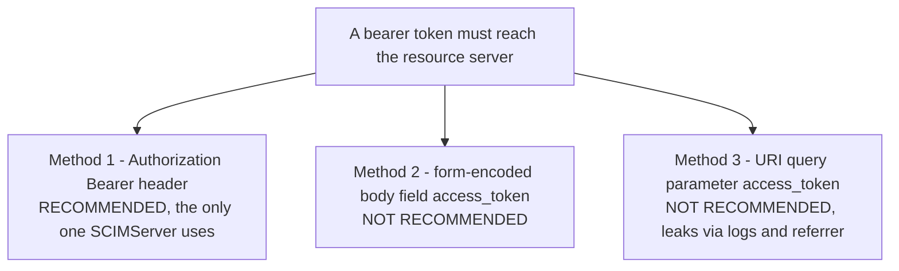
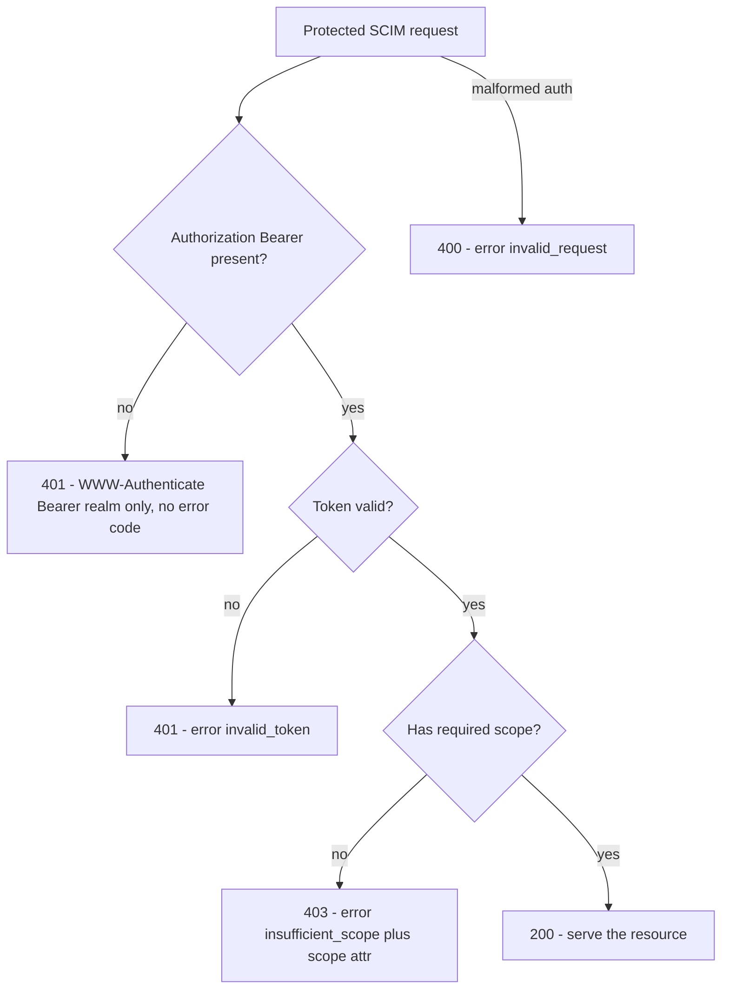

# RFC 6750 Explained - OAuth 2.0 Bearer Token Usage

> **What this is.** A plain-language, implementation-focused walkthrough of [RFC 6750](https://www.rfc-editor.org/rfc/rfc6750) (Proposed Standard, October 2012; Jones, Hardt). The authoritative text is mirrored in-repo at [rfc6750.txt](rfc6750.txt). It defines how a bearer token is **presented** on a protected request and how the resource server **challenges** a failed one.

> **Status:** Reference / explainer. Dated 2026-06-18. Grounds the `Authorization: Bearer` wire format and the `WWW-Authenticate` challenge across [AUTHENTICATION_ARCHITECTURE.md](../AUTHENTICATION_ARCHITECTURE.md) and the SCIM guard. No code; analysis only.

> **One-line takeaway.** A bearer token is presented in `Authorization: Bearer <token>`; a failed call gets a `WWW-Authenticate: Bearer ...` challenge carrying one of three error codes (`invalid_request` / `invalid_token` / `insufficient_scope`) at HTTP 400 / 401 / 403.

---

## Table of contents

- [1. Why RFC 6750 exists](#1-why-rfc-6750-exists)
- [2. The three ways to send a bearer token](#2-the-three-ways-to-send-a-bearer-token)
- [3. The WWW-Authenticate challenge (section 3)](#3-the-www-authenticate-challenge-section-3)
- [4. The three error codes and their HTTP statuses](#4-the-three-error-codes-and-their-http-statuses)
- [5. Security model (section 5)](#5-security-model-section-5)
- [6. How SCIMServer maps to RFC 6750](#6-how-scimserver-maps-to-rfc-6750)
- [7. Common misreadings and pitfalls](#7-common-misreadings-and-pitfalls)
- [8. Related specs](#8-related-specs)

---

## 1. Why RFC 6750 exists

[RFC 6749](RFC_6749_EXPLAINED.md) issues an access token but does not say how to **use** it. A "bearer" token is one where mere possession is sufficient to use it - no extra proof of possession (contrast [RFC 9449 DPoP](RFC_9449_EXPLAINED.md) and [RFC 8705 mTLS](RFC_8705_EXPLAINED.md), which add binding). RFC 6750 standardizes how the bearer token rides the protected request and how the resource server signals failure. For SCIMServer this is the contract on **every SCIM call**.

---

## 2. The three ways to send a bearer token



| Method | Form | SCIMServer |
|---|---|---|
| Authorization header | `Authorization: Bearer mF_9.B5f-4.1JqM` | **the only accepted method** |
| Request body | `access_token=...` form field | not accepted |
| URI query | `?access_token=...` | not accepted (leaks into logs, history, Referer) |

> **The header is the only safe one.** RFC 6750 marks the body and query methods as "NOT RECOMMENDED". SCIMServer accepts only `Authorization: Bearer`, matching the SCIM convention ([RFC 7644 section 2](https://www.rfc-editor.org/rfc/rfc7644)).

---

## 3. The WWW-Authenticate challenge (section 3)

When a protected request fails authentication, the resource server replies with a `WWW-Authenticate` header whose first token is the `Bearer` scheme followed by space-delimited `key="value"` attributes:

```http
HTTP/1.1 401 Unauthorized
WWW-Authenticate: Bearer realm="endpoint:42", error="invalid_token", error_description="The access token expired"
```

| Attribute | Meaning |
|---|---|
| `realm` | a protection-space label (optional, advisory) |
| `error` | one of the three codes below |
| `error_description` | human-readable detail (ASCII; advisory) |
| `error_uri` | a docs link |
| `scope` | (on `insufficient_scope`) the scope required to access the resource |

> **A bare challenge on a no-credentials request.** If the request carries **no** `Authorization` header at all, the server returns `401` with `WWW-Authenticate: Bearer realm="..."` and **MUST NOT** include an `error` code (there is no failing token to describe).

---

## 4. The three error codes and their HTTP statuses

| `error` | Meaning | HTTP status |
|---|---|---|
| `invalid_request` | the request is malformed (e.g. duplicate `Authorization`, both header and body token) | **400** |
| `invalid_token` | the token is expired, revoked, malformed, or otherwise invalid | **401** |
| `insufficient_scope` | the token is valid but lacks the scope this resource needs | **403** (add `scope="..."`) |



---

## 5. Security model (section 5)

- **TLS is mandatory.** A bearer token in cleartext is a credential anyone who sees it can replay; section 5.3 and SCIM ([RFC 7644 section 2](https://www.rfc-editor.org/rfc/rfc7644)) both require TLS.
- **Short lifetimes + minimal scope.** Because possession equals access, tokens should be short-lived and narrowly scoped - exactly the WIF model (1-6 h issued tokens, scope down-scoped).
- **Do not log tokens.** Never put a token in a URL, log line, or error body. SCIMServer's logging redacts tokens.
- **Cache-Control.** Responses carrying token-derived data should not be cached by shared caches.

---

## 6. How SCIMServer maps to RFC 6750

| RFC 6750 concept | SCIMServer | Source |
|---|---|---|
| `Authorization: Bearer` (the only accepted method) | the guard reads exactly this header | [shared-secret.guard.ts](../../../api/src/modules/auth/shared-secret.guard.ts) |
| `WWW-Authenticate: Bearer realm="SCIM"` on 401 | **already emitted** today | `reject()` in the same file |
| `error="invalid_token"` + `error_description` params | **not yet added** - the Q0 enrichment task | [gap plan Q0](../ISV_AUTH_PATTERNS_AND_SCIMSERVER_GAP_PLAN.md#51-phase-q-sub-phases) |
| `insufficient_scope` (403) on resource calls | **proposed** with the scope overlay | [architecture section 3.5](../AUTHENTICATION_ARCHITECTURE.md#35-the-authorization-overlay-roles-and-scopes) |
| SCIM error envelope in the body | `{schemas, detail, status, scimType:"invalidToken"}` alongside the header | `reject()` |

> **Reconciliation note.** SCIMServer returns **both** the RFC 6750 `WWW-Authenticate` header **and** a SCIM error envelope in the body. That is correct - the header is for OAuth-aware clients, the body for SCIM-aware ones. The Q0 task only enriches the header with the `error`/`error_description` parameters it currently omits.

---

## 7. Common misreadings and pitfalls

| Pitfall | Reality |
|---|---|
| "Put `error=invalid_token` on every 401." | No - a request with **no** credentials gets a bare challenge with **no** `error` code (section 3). |
| "Insufficient scope is a 401." | It is a **403** with `error="insufficient_scope"` and a `scope` attribute. |
| "Sending the token in the query string is fine over TLS." | Still NOT RECOMMENDED - it leaks into logs, browser history, and the `Referer` header. |
| "Bearer means the token is bound to the client." | No - "bearer" literally means *unbound*; anyone holding it can use it. Binding requires DPoP or mTLS. |

---

## 8. Related specs

- [RFC 6749](RFC_6749_EXPLAINED.md) - how the bearer token is issued.
- [RFC 9449](RFC_9449_EXPLAINED.md) / [RFC 8705](RFC_8705_EXPLAINED.md) - sender-constrained (non-bearer) alternatives that add proof-of-possession.
- [RFC 7519](RFC_7519_EXPLAINED.md) - the JWT format most bearer tokens use internally.
- Mirror: [rfc6750.txt](rfc6750.txt). Architecture: [AUTHENTICATION_ARCHITECTURE.md](../AUTHENTICATION_ARCHITECTURE.md).
