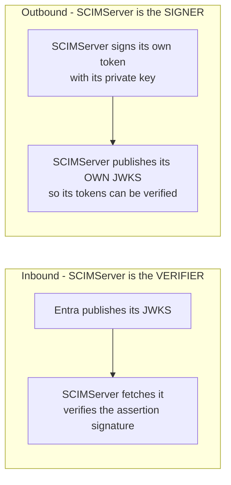

# RFC 7517 Explained - JSON Web Key (JWK)

> **What this is.** A plain-language, implementation-focused walkthrough of [RFC 7517](https://www.rfc-editor.org/rfc/rfc7517) (Proposed Standard, May 2015; Jones). The authoritative text is mirrored in-repo at [rfc7517.txt](rfc7517.txt). It defines the **JWK** (one key as JSON) and the **JWK Set / JWKS** (a published list of keys) that both Entra and SCIMServer expose.

> **Status:** Reference / explainer. Dated 2026-06-18. Grounds the JWKS-validation and JWKS-publication design in [WIF section 4](../WIF_JWT_BEARER_ASSERTION_FOR_SCIM.md#4-the-assertion-claims-validation-jwks) and [AUTHENTICATION_ARCHITECTURE.md](../AUTHENTICATION_ARCHITECTURE.md). No code; analysis only.

> **One-line takeaway.** A JWKS is a JSON document with a `keys` array of public keys, each tagged by `kid`; a JWT verifier fetches the issuer's JWKS, picks the key whose `kid` matches the token header, and verifies the signature against it.

---

## Table of contents

- [1. Why RFC 7517 exists](#1-why-rfc-7517-exists)
- [2. A JWK - one key as JSON](#2-a-jwk---one-key-as-json)
- [3. A JWK Set - the JWKS document](#3-a-jwk-set---the-jwks-document)
- [4. The two directions in WIF](#4-the-two-directions-in-wif)
- [5. JWKS fetch, cache, and rotation rules](#5-jwks-fetch-cache-and-rotation-rules)
- [6. JWKS SSRF - the operator-supplied-URL hazard](#6-jwks-ssrf---the-operator-supplied-url-hazard)
- [7. How SCIMServer maps to RFC 7517](#7-how-scimserver-maps-to-rfc-7517)
- [8. Common misreadings and pitfalls](#8-common-misreadings-and-pitfalls)
- [9. Related specs](#9-related-specs)

---

## 1. Why RFC 7517 exists

To verify a signed [JWT](RFC_7519_EXPLAINED.md), a recipient needs the signer's **public key**. RFC 7517 standardizes representing that key as JSON (a JWK) and publishing a rotating set of them (a JWKS) at a URL, so verifiers can fetch keys over HTTPS instead of having them hand-configured. This is the mechanism behind "the ISV trusts Microsoft's published JWKS" in WIF.

---

## 2. A JWK - one key as JSON

| Member | Meaning | Example |
|---|---|---|
| `kty` | key type | `RSA`, `EC`, `oct` |
| `use` | intended use | `sig` (signature) or `enc` |
| `key_ops` | allowed operations | `["verify"]` |
| `alg` | the algorithm this key is for | `RS256`, `ES256` |
| `kid` | key id - the lookup handle | `22` |
| `x5c` / `x5t` | optional X.509 cert chain / thumbprint | ... |

RSA public keys add `n` (modulus) and `e` (exponent); EC keys add `crv`, `x`, `y`. A **public** JWK contains only public parameters - a JWKS never publishes private key material.

```json
{ "kty": "RSA", "use": "sig", "kid": "22", "alg": "RS256", "n": "0vx7agoebGc...", "e": "AQAB" }
```

---

## 3. A JWK Set - the JWKS document

A JWKS is a JSON object with a single REQUIRED member `keys`, an array of JWKs:

```json
{
  "keys": [
    { "kty": "RSA", "use": "sig", "kid": "22", "alg": "RS256", "n": "0vx7...", "e": "AQAB" },
    { "kty": "RSA", "use": "sig", "kid": "23", "alg": "RS256", "n": "qDM2...", "e": "AQAB" }
  ]
}
```

Multiple keys coexist so an issuer can **rotate**: it starts signing with a new `kid` while the old one is still published, so in-flight tokens keep verifying.

---

## 4. The two directions in WIF

WIF uses JWKS in **both** directions, and they must not be confused:



| Direction | Whose JWKS | SCIMServer role | Endpoint |
|---|---|---|---|
| Inbound (validate Entra's assertion) | Microsoft's | verifier | `https://login.microsoftonline.com/<tid>/discovery/v2.0/keys` |
| Outbound (publish own signing keys) | SCIMServer's | signer/publisher | proposed `/.well-known/jwks.json` ([architecture section 7.4](../AUTHENTICATION_ARCHITECTURE.md#74-d-discovery--key-publication)) |

> **Today SCIMServer signs with HS256 (a symmetric secret), so it has no JWKS to publish.** Publishing a meaningful JWKS requires moving to an asymmetric key (RS256/ES256) - the Pre-Q.B prerequisite ([gap plan section 7.2](../ISV_AUTH_PATTERNS_AND_SCIMSERVER_GAP_PLAN.md#72-q-specific-architectural-pre-work)).

---

## 5. JWKS fetch, cache, and rotation rules

A robust verifier follows these rules (the basis for the WIF JWKS client):

- **Cache by `kid`** with a bounded max-age. Most calls hit the cache.
- **Refetch on an unknown `kid`** - a token signed by a freshly-rotated key whose `kid` is not cached triggers one JWKS refetch.
- **Fail closed on outage.** If the JWKS cannot be fetched and the `kid` is not cached, **reject** the token. Never fall back to "skip signature verification".
- **Prefer OIDC discovery.** Resolve `jwks_uri` from the issuer's `/.well-known/openid-configuration` rather than hard-coding the keys URL (the v1 vs v2 keys path differs - see [WIF section 4.1](../WIF_JWT_BEARER_ASSERTION_FOR_SCIM.md#41-decided---entra-v2-token-format-only-issuer-and-audience)).

---

## 6. JWKS SSRF - the operator-supplied-URL hazard

The `jwksUri` is operator-supplied configuration. If an endpoint author can set it to **any** URL, a malicious or compromised author points it at a cloud metadata service (`http://169.254.169.254/...`) or an internal host (`10.x`) and turns SCIMServer into an **SSRF proxy**.

> **A per-endpoint-editable allowlist is not an allowlist.** The JWKS **host allowlist** must live in the compiled/env security floor, enforced both at config-write time and at fetch time, and per-endpoint config may only pick within it. This is the single most important reason a thin global security floor still exists. See [architecture section 10](../AUTHENTICATION_ARCHITECTURE.md#10-security-analysis).

---

## 7. How SCIMServer maps to RFC 7517

| RFC 7517 concept | SCIMServer today | SCIMServer proposed |
|---|---|---|
| consuming a remote JWKS | none (no `jose`, no JWKS client) | a `jose` `createRemoteJWKSet` client with cache + fail-closed (Q2) |
| `kid`-based key selection | n/a | resolve the assertion's `kid` against Microsoft's JWKS |
| publishing own JWKS | none (HS256 symmetric) | `/.well-known/jwks.json` after the RS256 move (Pre-Q.B) |
| JWKS host allowlist | n/a | the security-floor SSRF guard |

---

## 8. Common misreadings and pitfalls

| Pitfall | Reality |
|---|---|
| "Try every key in the JWKS until one verifies." | No - select by `kid`; trying all keys weakens the alg/kid binding and invites confusion. |
| "Cache the JWKS forever." | No - bounded max-age + refetch on unknown `kid`, so key rotation works. |
| "On a JWKS fetch failure, accept the token anyway." | **Never** - fail closed; skipping signature verification accepts forgeries. |
| "A JWKS can include the private key." | No - a published JWKS holds **public** parameters only. |
| "The operator can set any `jwksUri`." | No - it must be constrained by a deployment-level host allowlist (SSRF). |

---

## 9. Related specs

- [RFC 7519](RFC_7519_EXPLAINED.md) - the JWT whose `kid` selects the JWK to verify against.
- [RFC 8414](RFC_8414_EXPLAINED.md) - the metadata document that advertises `jwks_uri`.
- [RFC 7523](RFC_7523_EXPLAINED.md) - the WIF profile that validates Entra's assertion against Microsoft's JWKS.
- Mirror: [rfc7517.txt](rfc7517.txt). Architecture: [AUTHENTICATION_ARCHITECTURE.md](../AUTHENTICATION_ARCHITECTURE.md).
