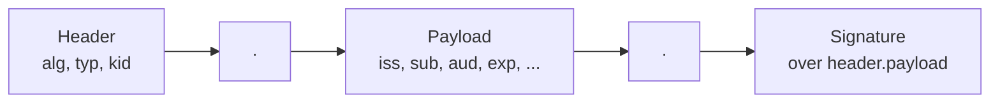
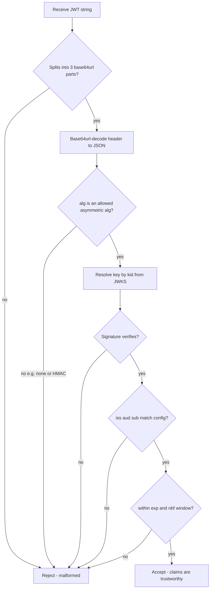

# RFC 7519 Explained - JSON Web Token (JWT)

> **What this is.** A plain-language, implementation-focused walkthrough of [RFC 7519](https://www.rfc-editor.org/rfc/rfc7519) (Proposed Standard, May 2015; Jones, Bradley, Sakimura). The authoritative text is mirrored in-repo at [rfc7519.txt](rfc7519.txt). It defines the **token format** that Entra signs, that SCIMServer validates, and that SCIMServer issues.

> **Status:** Reference / explainer. Dated 2026-06-18. Grounds the claim-validation contract in [WIF section 4](../WIF_JWT_BEARER_ASSERTION_FOR_SCIM.md#4-the-assertion-claims-validation-jwks) and the crypto core in [AUTHENTICATION_ARCHITECTURE.md](../AUTHENTICATION_ARCHITECTURE.md). No code; analysis only.

> **One-line takeaway.** A JWT is three base64url segments - `header.payload.signature` - carrying JSON **claims**; SCIMServer validates `iss`/`aud`/`sub`/`exp`/`nbf` plus the signature, and **never** trusts a JWT whose `alg` is `none`.

---

## Table of contents

- [1. Why RFC 7519 exists](#1-why-rfc-7519-exists)
- [2. Anatomy of a JWT](#2-anatomy-of-a-jwt)
- [3. The JOSE header](#3-the-jose-header)
- [4. Registered claims (section 4.1)](#4-registered-claims-section-41)
- [5. The validation algorithm (section 7.2)](#5-the-validation-algorithm-section-72)
- [6. The alg:none trap](#6-the-algnone-trap)
- [7. How SCIMServer maps to RFC 7519](#7-how-scimserver-maps-to-rfc-7519)
- [8. Common misreadings and pitfalls](#8-common-misreadings-and-pitfalls)
- [9. Related specs](#9-related-specs)

---

## 1. Why RFC 7519 exists

OAuth tokens, OIDC ID tokens, and assertion-based client auth all need a **compact, URL-safe, self-describing, signed** container for a set of claims. RFC 7519 is that container. It builds on JOSE - [JWS](https://www.rfc-editor.org/rfc/rfc7515) (signing) and [JWE](https://www.rfc-editor.org/rfc/rfc7516) (encryption). In WIF, every JWT in play is a **JWS** (signed, not encrypted): Entra's assertion is a signed JWT, and SCIMServer's issued token is a signed JWT.

---

## 2. Anatomy of a JWT

A JWS-form JWT is three base64url segments joined by dots:



```
eyJhbGciOiJSUzI1NiIsImtpZCI6IjIyIn0   header  (base64url JSON)
.eyJpc3MiOiJodHRwczovLy4uLiJ9         payload (base64url JSON, the claims)
.<binary signature, base64url>        signature
```

The signature is computed over the **exact ASCII** `base64url(header) + "." + base64url(payload)`. Re-encoding the JSON changes the bytes and breaks the signature, which is why claim comparison uses **Simple String Comparison**, not semantic JSON equality.

---

## 3. The JOSE header

| Header param | Meaning | WIF use |
|---|---|---|
| `alg` | the signing algorithm (e.g. `RS256`, `ES256`) | MUST be a pinned asymmetric alg; **never** `none`, never HMAC over a public key |
| `typ` | media type, usually `JWT` (or `at+jwt`, `dpop+jwt`) | informational |
| `kid` | key id - which JWKS key signed this | **the routing handle** to pick the verification key |

> **`kid` is how you pick the right key.** Entra rotates signing keys; the `kid` in the assertion header selects which JWKS key to verify against. A validator caches keys by `kid` and refetches the JWKS on an unknown `kid` - see [RFC 7517](RFC_7517_EXPLAINED.md).

---

## 4. Registered claims (section 4.1)

All registered claims are OPTIONAL in the base spec; a **profile** (like RFC 7523 for WIF) makes specific ones mandatory.

| Claim | Name | WIF validation |
|---|---|---|
| `iss` | issuer | exact-match the configured Entra v2 issuer |
| `sub` | subject | match the configured workload-identity object id |
| `aud` | audience | match the bare `{appid}` GUID (SCIMServer is the audience) |
| `exp` | expiration time | reject if `now >= exp` (small clock skew allowed) |
| `nbf` | not before | reject if `now < nbf` |
| `iat` | issued at | logged; may reject if implausibly old/future |
| `jti` | JWT id | optional replay-defense key (track used `jti` for the `exp` window) |

All time claims are **NumericDate** - seconds since 1970-01-01 UTC, as a JSON number.

---

## 5. The validation algorithm (section 7.2)

RFC 7519 section 7.2 specifies the order a recipient validates a JWT. Mapped to a SCIMServer validator:



> **Signature first, claims second.** Never read a claim as trustworthy before the signature verifies. The one exception in SCIMServer's router is decoding `iss` **unverified** purely to *select which key set to verify against* - it selects a verifier, it never authorizes ([architecture section 8.2](../AUTHENTICATION_ARCHITECTURE.md#82-runtime-routing-the-self-describing-cascade-no-prior-binding)).

---

## 6. The alg:none trap

RFC 7519 inherits JWS's "Unsecured JWS" where `alg` is `none` and there is no signature. **Accepting `alg:none` means accepting forged tokens.** A related trap is **algorithm confusion**: an attacker takes a server's RSA *public* key and signs a token with `alg:HS256`, treating the public key as an HMAC secret; a naive verifier that picks the algorithm from the header will validate it.

> **The fix is non-negotiable and lives in the security floor.** Pin the accepted `alg` set to specific asymmetric algorithms (RS256/ES256) chosen by **configuration**, not by the token header. Reject `none` and reject any HMAC alg when an asymmetric key is expected. See [architecture section 10](../AUTHENTICATION_ARCHITECTURE.md#10-security-analysis).

---

## 7. How SCIMServer maps to RFC 7519

| RFC 7519 concept | SCIMServer today | SCIMServer proposed |
|---|---|---|
| issued token format | HS256 JWT, 1 h TTL ([oauth.service.ts](../../../api/src/oauth/oauth.service.ts)) | RS256 asymmetric so a JWKS can be published |
| claim validation | `jwtService.verify` on the self-signed token | full `iss`/`aud`/`sub`/`tid`/time validation of the **external** Entra assertion |
| `aud` claim | absent on issued tokens today | added (the WIF gap; [architecture section 4.4](../AUTHENTICATION_ARCHITECTURE.md#44-verified-greenfield-gaps-what-is-genuinely-absent)) |
| `alg` pinning | n/a (HS256 self-signed) | RS256/ES256 allowlist in the security floor |

---

## 8. Common misreadings and pitfalls

| Pitfall | Reality |
|---|---|
| "Decode the JWT and trust the claims." | Trust nothing until the **signature** verifies (section 7.2). |
| "Pick the algorithm from the header." | No - pick it from **config**; trusting the header enables alg-confusion. |
| "`exp` is in milliseconds." | No - NumericDate is **seconds** since the Unix epoch. |
| "Comparing `iss` can normalize the URL." | No - use **Simple String Comparison** (exact bytes); normalization can wrongly accept or reject. |
| "A JWT is encrypted." | A JWS JWT is **signed, not encrypted** - the payload is readable base64url. Use JWE only if confidentiality is needed (WIF does not). |

---

## 9. Related specs

- [RFC 7517](RFC_7517_EXPLAINED.md) - the JWK / JWKS that supplies the verification key by `kid`.
- [RFC 7523](RFC_7523_EXPLAINED.md) - the profile that makes specific JWT claims mandatory for WIF client auth.
- [RFC 6750](RFC_6750_EXPLAINED.md) - how a JWT access token is presented on resource calls.
- [RFC 7515 (JWS)](https://www.rfc-editor.org/rfc/rfc7515) / [RFC 7518 (JWA)](https://www.rfc-editor.org/rfc/rfc7518) - the signing mechanics and algorithm identifiers (`RS256`, `ES256`).
- Mirror: [rfc7519.txt](rfc7519.txt). Architecture: [AUTHENTICATION_ARCHITECTURE.md](../AUTHENTICATION_ARCHITECTURE.md).
