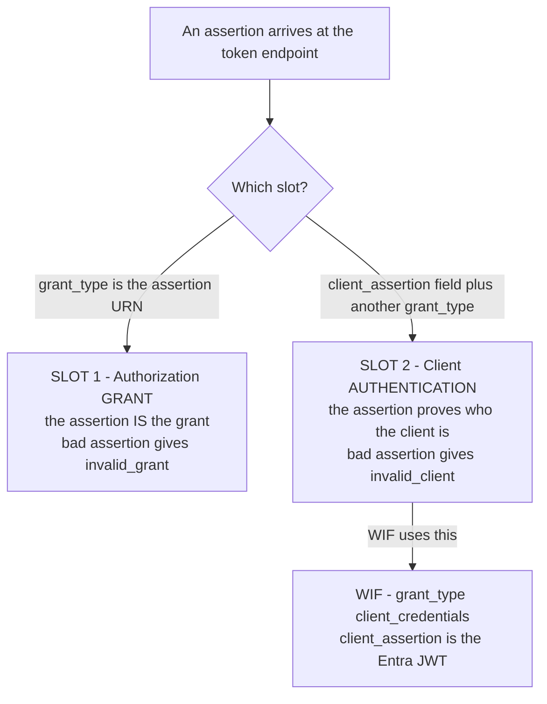

# RFC 7521 Explained - Assertion Framework for OAuth 2.0 Client Authentication and Authorization Grants

> **What this is.** A plain-language, implementation-focused walkthrough of [RFC 7521](https://www.rfc-editor.org/rfc/rfc7521) (Proposed Standard, May 2015; Campbell, Mortimore, Jones, Goland). The authoritative text is mirrored in-repo at [rfc7521.txt](rfc7521.txt). It is the **abstract umbrella** that [RFC 7523 (JWT)](RFC_7523_EXPLAINED.md) and RFC 7522 (SAML) profile.

> **Status:** Reference / explainer. Dated 2026-06-18. Completes the assertion-framework trio (7521 umbrella, 7523 JWT profile, 8693 token-exchange) referenced throughout [WIF_JWT_BEARER_ASSERTION_FOR_SCIM.md](../WIF_JWT_BEARER_ASSERTION_FOR_SCIM.md). No code; analysis only.

> **One-line takeaway.** RFC 7521 says a generic "assertion" (a security token) can fill **two separate slots** at the token endpoint - an **authorization grant** or a **client-authentication credential** - and defines the form parameters and processing rules common to both. WIF uses the **client-authentication** slot.

---

## Table of contents

- [1. Why RFC 7521 exists](#1-why-rfc-7521-exists)
- [2. The two slots (the orthogonality principle)](#2-the-two-slots-the-orthogonality-principle)
- [3. The form parameters](#3-the-form-parameters)
- [4. Common assertion processing rules (section 5.2)](#4-common-assertion-processing-rules-section-52)
- [5. Error codes](#5-error-codes)
- [6. How the profiles fill the slots](#6-how-the-profiles-fill-the-slots)
- [7. How SCIMServer maps to RFC 7521](#7-how-scimserver-maps-to-rfc-7521)
- [8. Common misreadings and pitfalls](#8-common-misreadings-and-pitfalls)
- [9. Related specs](#9-related-specs)

---

## 1. Why RFC 7521 exists

OAuth 2.0 has two extensibility points at the token endpoint: the **authorization grant** (how the client proves it is allowed to get a token) and **client authentication** (how the client proves who it is). Both can be satisfied by presenting a **security token** issued by a trusted party - an "assertion". Rather than redefine that machinery for every token format, RFC 7521 defines it **once, abstractly**, and lets concrete profiles (JWT in 7523, SAML in 7522) plug in. WIF is a JWT assertion used in the client-authentication slot.

---

## 2. The two slots (the orthogonality principle)

The defining sentence of the whole framework:

> "The use of an assertion for client authentication is orthogonal to and separable from using an assertion as an authorization grant. They can be used either in combination or separately."

This is the exact distinction WIF depends on: the Microsoft JWT authenticates the **client**; a separate `grant_type=client_credentials` requests the token. So WIF is **not** "assertion grant-type usage" even though it carries an assertion.

---

## 3. The form parameters

| Slot | Parameter | Value |
|---|---|---|
| **Grant** (slot 1) | `grant_type` | the assertion URN, e.g. `urn:ietf:params:oauth:grant-type:jwt-bearer` |
| | `assertion` | the single assertion (the JWT/SAML) |
| **Client auth** (slot 2) | `client_assertion_type` | the assertion-type URN, e.g. `urn:ietf:params:oauth:client-assertion-type:jwt-bearer` |
| | `client_assertion` | the single assertion |
| | (plus a normal `grant_type`) | e.g. `client_credentials` (what WIF sends) |

Both slots: the request is `application/x-www-form-urlencoded`, and the assertion field carries **exactly one** assertion.

---

## 4. Common assertion processing rules (section 5.2)

RFC 7521 section 5.2 lists the validation steps every profile inherits. RFC 7523 makes them concrete for JWTs; the umbrella requires:

| Rule | Meaning |
|---|---|
| Issuer | the assertion identifies an issuer the AS trusts for this purpose |
| Subject | the assertion identifies the principal (for client auth, the client) |
| Audience | the assertion's audience identifies **this** AS; reject otherwise |
| Validity window | honor `exp` / `nbf` (or the format's equivalent) |
| Integrity | the assertion is signed/MAC'd by the trusted issuer; verify it |
| One-time use | the AS MAY enforce single-use to prevent replay |

> These are the abstract version of the rules the [RFC 7523 explainer section 4](RFC_7523_EXPLAINED.md#4-the-section-3-processing-rules-the-validator-contract) makes JWT-concrete and the [WIF validator](../WIF_JWT_BEARER_ASSERTION_FOR_SCIM.md#4-the-assertion-claims-validation-jwks) implements.

---

## 5. Error codes

| Bad assertion used as... | `error` code (RFC 6749 section 5.2) |
|---|---|
| Authorization **grant** (slot 1) | `invalid_grant` |
| Client **authentication** (slot 2) | **`invalid_client`** |

Because WIF uses slot 2, the correct failure code for a bad WIF assertion is **`invalid_client`**, returned generically (the specific failing claim is logged server-side only, to deny an attacker a claim-by-claim oracle).

---

## 6. How the profiles fill the slots

| Profile | Format | RFC | WIF use |
|---|---|---|---|
| `jwt-bearer` | JWT | [RFC 7523](RFC_7523_EXPLAINED.md) | **the shipped WIF profile** (slot 2 client auth) |
| (SAML profile) | SAML 2.0 | RFC 7522 | not used by WIF |
| token-exchange | JWT subject token | [RFC 8693](RFC_8693_EXPLAINED.md) | the upcoming WIF profile (a grant type that can use 7521 client auth) |

---

## 7. How SCIMServer maps to RFC 7521

| RFC 7521 concept | SCIMServer (proposed) |
|---|---|
| client-authentication slot | the WIF `client_assertion` intake at the token endpoint |
| `invalid_client` on a bad client-auth assertion | the WIF error mapping ([WIF section 12](../WIF_JWT_BEARER_ASSERTION_FOR_SCIM.md#12-error-responses-and-rfc-6749-conformance)) |
| common processing rules (section 5.2) | the `WifAssertionValidator` claim + signature checks |
| "orthogonal and separable" | why the WIF doc insists this is client auth, not grant usage |

---

## 8. Common misreadings and pitfalls

| Pitfall | Reality |
|---|---|
| "An assertion is always the grant." | No - it can be **either** the grant or the client-authentication credential; WIF uses the latter. |
| "The two slots can't be combined." | They can - RFC 8693 token-exchange (a grant) can authenticate the client with an RFC 7523 assertion (slot 2). |
| "A bad client-auth assertion is `invalid_grant`." | No - it is `invalid_client` (slot 2). |
| "Multiple assertions can be sent in one field." | No - the assertion field carries exactly one. |

---

## 9. Related specs

- [RFC 7523](RFC_7523_EXPLAINED.md) - the concrete JWT profile of this framework (today's WIF).
- [RFC 8693](RFC_8693_EXPLAINED.md) - token-exchange, which composes with 7521 client auth (upcoming WIF).
- [RFC 6749](RFC_6749_EXPLAINED.md) - the grant/client-auth extensibility points this framework plugs into.
- Mirror: [rfc7521.txt](rfc7521.txt). Architecture: [AUTHENTICATION_ARCHITECTURE.md](../AUTHENTICATION_ARCHITECTURE.md).
