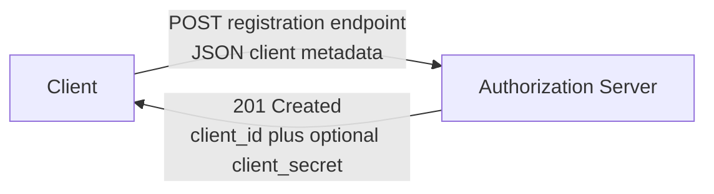

# RFC 7591 Explained - OAuth 2.0 Dynamic Client Registration

> **What this is.** A plain-language, implementation-focused walkthrough of [RFC 7591](https://www.rfc-editor.org/rfc/rfc7591) (Proposed Standard, July 2015; Richer, Ed., Jones, Bradley, Machulak, Hunt). The authoritative text is mirrored in-repo at [rfc7591.txt](rfc7591.txt). It defines how a client **registers** with an authorization server to obtain a `client_id`, and - critically for SCIMServer - it is the **registry for `token_endpoint_auth_method` values**.

> **Status:** Reference / explainer. Dated 2026-06-18. SCIMServer relevance is primarily the **client-metadata vocabulary** (especially `token_endpoint_auth_method`) that the authentication-method model reuses; full dynamic registration is **not** planned. No code; analysis only.

> **One-line takeaway.** RFC 7591 lets a client POST its metadata to a registration endpoint and get back a `client_id` (and maybe a `client_secret`); the metadata field **`token_endpoint_auth_method`** (`none` / `client_secret_post` / `client_secret_basic` / `private_key_jwt` / `client_secret_jwt`) is the canonical name for "how this client authenticates at the token endpoint", which SCIMServer's provider `type` registry maps onto.

---

## Table of contents

- [1. Why RFC 7591 exists](#1-why-rfc-7591-exists)
- [2. The registration request and response](#2-the-registration-request-and-response)
- [3. The client-metadata fields](#3-the-client-metadata-fields)
- [4. The token_endpoint_auth_method registry - the part SCIMServer reuses](#4-the-token_endpoint_auth_method-registry---the-part-scimserver-reuses)
- [5. How SCIMServer maps to RFC 7591](#5-how-scimserver-maps-to-rfc-7591)
- [6. Common misreadings and pitfalls](#6-common-misreadings-and-pitfalls)
- [7. Related specs](#7-related-specs)

---

## 1. Why RFC 7591 exists

Classic OAuth assumes a human developer registers an application in a portal and copies a `client_id`/`client_secret`. RFC 7591 automates that: software registers itself programmatically. SCIMServer does **not** need open dynamic registration (clients are provisioned by the operator via the admin API), but the **vocabulary** RFC 7591 standardizes - especially the names for client-authentication methods - is exactly what the authentication-method model needs to be standards-aligned.

---

## 2. The registration request and response



```http
POST /register HTTP/1.1
Content-Type: application/json

{
  "client_name": "Contoso provisioning",
  "grant_types": ["client_credentials"],
  "token_endpoint_auth_method": "private_key_jwt",
  "jwks_uri": "https://login.microsoftonline.com/<tid>/discovery/v2.0/keys"
}
```

```http
HTTP/1.1 201 Created
Content-Type: application/json

{ "client_id": "b8d3...", "client_id_issued_at": 1716076800, "token_endpoint_auth_method": "private_key_jwt" }
```

---

## 3. The client-metadata fields

| Field | Meaning | SCIMServer analogue |
|---|---|---|
| `redirect_uris` | for authorization-code flows | Q4 only |
| `token_endpoint_auth_method` | how the client authenticates at the token endpoint | **the method `type`** |
| `grant_types` | which grants the client uses | `client_credentials`, `token-exchange` |
| `response_types` | for browser flows | Q4 only |
| `client_name` | human label | the method `displayName` |
| `jwks` / `jwks_uri` | the client's public keys (for `private_key_jwt`) | the WIF trust profile's `jwksUri` |
| `scope` | requested scopes | the endpoint's granted scopes |

---

## 4. The token_endpoint_auth_method registry - the part SCIMServer reuses

This is the single field SCIMServer's design leans on. The registered values:

| `token_endpoint_auth_method` | Meaning | SCIMServer provider `type` |
|---|---|---|
| `none` | public client, no client auth | n/a |
| `client_secret_post` | `client_id` + `client_secret` in the body | `oauth-client` |
| `client_secret_basic` | client credentials via HTTP Basic | `oauth-client` (alt) |
| `private_key_jwt` | a JWT signed by the client's private key (verified via its JWKS) | **`wif-7523`** |
| `client_secret_jwt` | a JWT signed with the client secret (HMAC) | not used |

> **`private_key_jwt` IS WIF's jwt-bearer profile.** Entra's own v2 discovery document lists `private_key_jwt` in `token_endpoint_auth_methods_supported`. So SCIMServer's `wif-7523` provider maps one-to-one onto this registered value, and that value is what it advertises in its own [RFC 8414](RFC_8414_EXPLAINED.md) metadata. This is the standards anchor for the provider-`type` registry in [architecture section 1.3](../AUTHENTICATION_ARCHITECTURE.md#13-every-method-carries-a-type-a-displayname-and-a-description).

---

## 5. How SCIMServer maps to RFC 7591

| RFC 7591 concept | SCIMServer |
|---|---|
| dynamic registration endpoint | **not planned** - clients are provisioned by the operator admin API |
| `token_endpoint_auth_method` vocabulary | **reused** as the canonical name for each token-plane method `type` |
| `client_id` issuance | the per-endpoint `oauth-client` credential (Q1) returns a `clientId` |
| `jwks_uri` client metadata | the WIF trust profile's `jwksUri` (validating Entra's assertion) |

---

## 6. Common misreadings and pitfalls

| Pitfall | Reality |
|---|---|
| "Implementing WIF means implementing dynamic registration." | No - SCIMServer reuses only the **metadata vocabulary**, not the open self-registration endpoint. |
| "`private_key_jwt` and `client_secret_jwt` are the same." | No - `private_key_jwt` is asymmetric (verified via JWKS, what WIF uses); `client_secret_jwt` is HMAC over the shared secret. |
| "An open registration endpoint is required for OAuth." | No - it is optional; operator-provisioned clients are fully conformant. |

---

## 7. Related specs

- [RFC 8414](RFC_8414_EXPLAINED.md) - advertises `token_endpoint_auth_methods_supported` using these values.
- [RFC 7523](RFC_7523_EXPLAINED.md) - the `private_key_jwt` method in depth (WIF jwt-bearer).
- [RFC 6749](RFC_6749_EXPLAINED.md) - the client-authentication concept these methods implement.
- Mirror: [rfc7591.txt](rfc7591.txt). Architecture: [AUTHENTICATION_ARCHITECTURE.md](../AUTHENTICATION_ARCHITECTURE.md).
