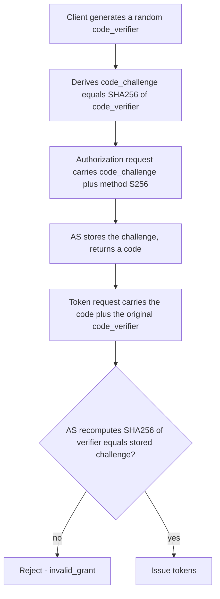

# RFC 7636 Explained - Proof Key for Code Exchange (PKCE)

> **What this is.** A plain-language, implementation-focused walkthrough of [RFC 7636](https://www.rfc-editor.org/rfc/rfc7636) (Proposed Standard, September 2015; Sakimura, Ed., Bradley, Agarwal). The authoritative text is mirrored in-repo at [rfc7636.txt](rfc7636.txt). It protects the **authorization-code** grant against code interception.

> **Status:** Reference / explainer. Dated 2026-06-18. SCIMServer relevance is **Phase Q4 only** (the deferred authorization-code grant for legacy gallery connectors). It is not needed for the `client_credentials` or WIF flows, which have no authorization code. No code; analysis only.

> **One-line takeaway.** PKCE binds an authorization code to a one-time secret (`code_verifier`) that only the legitimate client knows, so a stolen code is useless without it - mandatory for public clients and recommended for all (per [RFC 9700](RFC_9700_EXPLAINED.md)).

---

## Table of contents

- [1. Why RFC 7636 exists](#1-why-rfc-7636-exists)
- [2. The flow](#2-the-flow)
- [3. The parameters](#3-the-parameters)
- [4. S256 vs plain](#4-s256-vs-plain)
- [5. Why SCIMServer mostly does not need it](#5-why-scimserver-mostly-does-not-need-it)
- [6. Common misreadings and pitfalls](#6-common-misreadings-and-pitfalls)
- [7. Related specs](#7-related-specs)

---

## 1. Why RFC 7636 exists

In the authorization-code grant, the code travels back to the client through a browser redirect, where it can be intercepted (a malicious app registered for the same custom URI scheme, a leaky referrer, etc.). Before PKCE, whoever stole the code could redeem it. PKCE adds a per-request secret so only the client that **started** the flow can finish it.

---

## 2. The flow

A stolen **code** alone fails at step F because the thief does not have the matching `code_verifier`.

---

## 3. The parameters

| Phase | Parameter | Value |
|---|---|---|
| Authorization request | `code_challenge` | base64url(SHA256(`code_verifier`)) for S256 |
| | `code_challenge_method` | `S256` (or `plain`) |
| Token request | `code_verifier` | the original high-entropy random string (43-128 chars) |

---

## 4. S256 vs plain

| Method | `code_challenge` | Security |
|---|---|---|
| `S256` | `base64url(SHA256(verifier))` | **required where supported**; the challenge reveals nothing about the verifier |
| `plain` | the verifier itself | only for clients that truly cannot SHA256; weaker (challenge equals secret) |

> Always use `S256`. RFC 9700 effectively mandates it for any new authorization-code client.

---

## 5. Why SCIMServer mostly does not need it

PKCE protects the **authorization code**. The flows SCIMServer cares about have **no authorization code**:

| Flow | Has an auth code? | PKCE relevant? |
|---|---|---|
| `client_credentials` (shipped) | no | no |
| WIF `jwt-bearer` (Q6) | no | no |
| WIF `token-exchange` (Q6) | no | no |
| Authorization Code (Q4, deferred) | **yes** | **yes - mandatory** |

> **PKCE only enters the picture if Q4 ships.** If SCIMServer ever needs to mock a legacy gallery connector that uses the authorization-code grant, the code endpoint MUST enforce PKCE with `S256`. Until then it is out of scope. See [gap plan Q4](../ISV_AUTH_PATTERNS_AND_SCIMSERVER_GAP_PLAN.md#51-phase-q-sub-phases).

---

## 6. Common misreadings and pitfalls

| Pitfall | Reality |
|---|---|
| "PKCE secures client_credentials." | No - there is no authorization code in `client_credentials`; PKCE has nothing to bind. |
| "`plain` is fine." | Use `S256`; `plain` exposes the verifier in the authorization request. |
| "PKCE replaces client authentication." | No - it protects the **code**, orthogonal to how the client authenticates at the token endpoint. |
| "Only public clients need PKCE." | RFC 9700 recommends it for **all** authorization-code clients, confidential included. |

---

## 7. Related specs

- [RFC 6749](RFC_6749_EXPLAINED.md) - the authorization-code grant PKCE protects.
- [RFC 9700](RFC_9700_EXPLAINED.md) - the current best practice that makes PKCE near-mandatory.
- Mirror: [rfc7636.txt](rfc7636.txt). Architecture: [AUTHENTICATION_ARCHITECTURE.md](../AUTHENTICATION_ARCHITECTURE.md).
