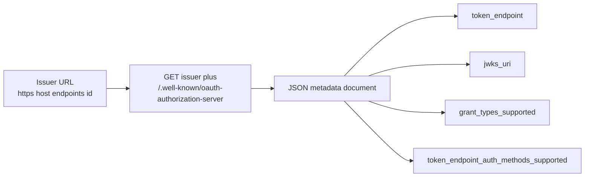

# RFC 8414 Explained - OAuth 2.0 Authorization Server Metadata

> **What this is.** A plain-language, implementation-focused walkthrough of [RFC 8414](https://www.rfc-editor.org/rfc/rfc8414) (Proposed Standard, June 2018; Jones, Sakimura, Bradley). The authoritative text is mirrored in-repo at [rfc8414.txt](rfc8414.txt). It defines the `.well-known` document that lets a client **discover** an authorization server's endpoints and capabilities instead of hard-coding them.

> **Status:** Reference / explainer. Dated 2026-06-18. Grounds the discovery surface in [AUTHENTICATION_ARCHITECTURE.md section 7.4](../AUTHENTICATION_ARCHITECTURE.md#74-d-discovery--key-publication) and the "the token URL path does not matter" argument in [section 8.1](../AUTHENTICATION_ARCHITECTURE.md#81-token-mint-url-options). No code; analysis only.

> **One-line takeaway.** An AS publishes a JSON metadata document at `/.well-known/oauth-authorization-server` advertising `issuer`, `token_endpoint`, `jwks_uri`, `grant_types_supported`, and `token_endpoint_auth_methods_supported` - so the literal endpoint **paths** become discoverable, not guessed.

---

## Table of contents

- [1. Why RFC 8414 exists](#1-why-rfc-8414-exists)
- [2. Where the document lives](#2-where-the-document-lives)
- [3. The metadata fields that matter for SCIMServer](#3-the-metadata-fields-that-matter-for-scimserver)
- [4. Why this makes the token-URL path irrelevant](#4-why-this-makes-the-token-url-path-irrelevant)
- [5. RFC 8414 vs OIDC discovery](#5-rfc-8414-vs-oidc-discovery)
- [6. How SCIMServer maps to RFC 8414](#6-how-scimserver-maps-to-rfc-8414)
- [7. Common misreadings and pitfalls](#7-common-misreadings-and-pitfalls)
- [8. Related specs](#8-related-specs)

---

## 1. Why RFC 8414 exists

Without metadata, a client must be told - out of band - the exact URL of the token endpoint, the JWKS, the supported grants, and the supported client-authentication methods. RFC 8414 standardizes publishing all of that as one signed-by-TLS JSON document, so a client configures only the **issuer** and discovers the rest. This is the OAuth analogue of OIDC's `/.well-known/openid-configuration`.

For SCIMServer, RFC 8414 is what lets the **token endpoint path be an implementation detail**: real ISVs use wildly different paths (Workday `/ccx/oauth2/{tenant}/token`, ServiceNow `/oauth_token.do`, Google a separate STS host), and the right answer is to **advertise** the path, not standardize it.

---

## 2. Where the document lives



The well-known suffix is inserted **between the host and the issuer path component** (e.g. issuer `https://host/endpoints/42` resolves to `https://host/.well-known/oauth-authorization-server/endpoints/42`), though many deployments also serve the simpler host-root form. The response is `application/json`, fetched over TLS.

---

## 3. The metadata fields that matter for SCIMServer

| Field | Meaning | SCIMServer value (proposed) |
|---|---|---|
| `issuer` | the AS identifier; MUST match the `iss` of tokens it issues | `https://host/endpoints/{id}` |
| `token_endpoint` | where to POST a token request | `https://host/endpoints/{id}/oauth/token` |
| `jwks_uri` | where the AS publishes its signing public keys | `https://host/endpoints/{id}/.well-known/jwks.json` |
| `grant_types_supported` | which grants the AS accepts | `client_credentials`, `urn:ietf:params:oauth:grant-type:token-exchange` |
| `token_endpoint_auth_methods_supported` | how clients authenticate at the token endpoint | `private_key_jwt`, `client_secret_post` |
| `scopes_supported` | advertised scopes | the endpoint's granted-scope set |
| `response_types_supported` | for authorization-code flows | (Q4 only) |

```json
{
  "issuer": "https://host/endpoints/42",
  "token_endpoint": "https://host/endpoints/42/oauth/token",
  "jwks_uri": "https://host/endpoints/42/.well-known/jwks.json",
  "grant_types_supported": ["client_credentials", "urn:ietf:params:oauth:grant-type:token-exchange"],
  "token_endpoint_auth_methods_supported": ["private_key_jwt", "client_secret_post"]
}
```

---

## 4. Why this makes the token-URL path irrelevant

> RFC 6749 says there is **one** token endpoint; RFC 8414 says **publish its URL** rather than mandate a path. Together they justify SCIMServer's design: **one shared per-endpoint token URL, discriminated by `grant_type`, advertised via metadata.** Nothing a client does should depend on the literal string `/oauth/token`.

This is the standards anchor for [architecture section 8.1](../AUTHENTICATION_ARCHITECTURE.md#81-token-mint-url-options) option D ("discovery-published URL - always, orthogonal").

The `token_endpoint_auth_methods_supported` list is also where each **token-plane authentication method** is advertised by its IANA `token_endpoint_auth_method` value - which is exactly the field SCIMServer's provider `type` registry maps onto (`private_key_jwt` = WIF jwt-bearer, `client_secret_post` = plain client credentials). See [architecture section 1.3](../AUTHENTICATION_ARCHITECTURE.md#13-every-method-carries-a-type-a-displayname-and-a-description).

---

## 5. RFC 8414 vs OIDC discovery

| | RFC 8414 | OIDC Discovery |
|---|---|---|
| Path | `/.well-known/oauth-authorization-server` | `/.well-known/openid-configuration` |
| Scope | OAuth AS metadata | adds OIDC-specific fields (`userinfo_endpoint`, `id_token_signing_alg_values_supported`, ...) |
| Used by | OAuth resource/clients | OIDC relying parties |

Entra publishes the OIDC form; SCIMServer (a pure OAuth AS, not an OIDC provider) publishes the RFC 8414 form. They overlap on `issuer`, `token_endpoint`, `jwks_uri`, and `grant_types_supported`.

---

## 6. How SCIMServer maps to RFC 8414

| RFC 8414 concept | SCIMServer today | SCIMServer proposed |
|---|---|---|
| `.well-known/oauth-authorization-server` | none | added in Q0 ([gap plan Q0](../ISV_AUTH_PATTERNS_AND_SCIMSERVER_GAP_PLAN.md#51-phase-q-sub-phases)) |
| `jwks_uri` advertisement | none (HS256, no JWKS) | after the RS256 move (Pre-Q.B) |
| `token_endpoint_auth_methods_supported` | n/a | computed from the endpoint's enabled token-plane methods |
| consuming Entra's metadata | none | resolve `jwks_uri` from Entra's v2 discovery doc rather than hard-coding |

---

## 7. Common misreadings and pitfalls

| Pitfall | Reality |
|---|---|
| "The token endpoint must be at `/oauth/token`." | No - any path; advertise it via `token_endpoint`. |
| "`issuer` can differ from the token `iss`." | No - the metadata `issuer` MUST equal the `iss` of tokens the AS issues, and MUST match the well-known URL base. |
| "Metadata replaces TLS as the integrity mechanism." | No - the document's integrity rests on TLS; serve it only over HTTPS. |
| "RFC 8414 and OIDC discovery are interchangeable paths." | They are different well-known paths; advertise whichever your AS type warrants. |

---

## 8. Related specs

- [RFC 6749](RFC_6749_EXPLAINED.md) - the endpoints this document advertises.
- [RFC 7517](RFC_7517_EXPLAINED.md) - the JWKS that `jwks_uri` points at.
- [RFC 7591](RFC_7591_EXPLAINED.md) - the `token_endpoint_auth_method` registry whose values appear in `token_endpoint_auth_methods_supported`.
- Mirror: [rfc8414.txt](rfc8414.txt). Architecture: [AUTHENTICATION_ARCHITECTURE.md](../AUTHENTICATION_ARCHITECTURE.md).
