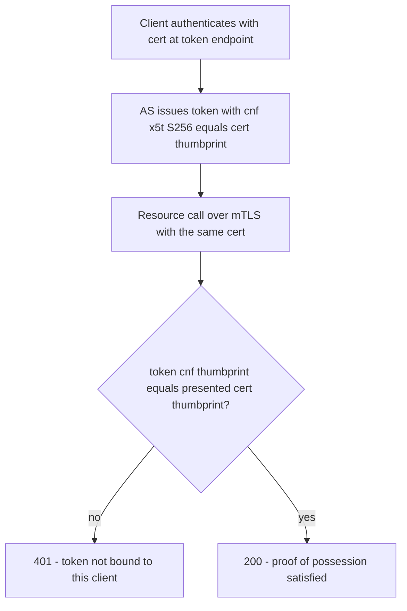

# RFC 8705 Explained - OAuth 2.0 Mutual-TLS Client Authentication and Certificate-Bound Access Tokens

> **What this is.** A plain-language, implementation-focused walkthrough of [RFC 8705](https://www.rfc-editor.org/rfc/rfc8705) (Proposed Standard, February 2020; Campbell, Bradley, Sakimura, Lodderstedt). The authoritative text is mirrored in-repo at [rfc8705.txt](rfc8705.txt). It defines two related things: **mTLS client authentication** and **certificate-bound (sender-constrained) access tokens**.

> **Status:** Reference / explainer. Dated 2026-06-18. SCIMServer relevance is **Phase Q5 (deferred)** - a high-security profile (FAPI 2.0, govcloud) with no current customer ask. No code; analysis only.

> **One-line takeaway.** mTLS lets a client authenticate with an X.509 client certificate at the TLS layer, and lets the AS **bind** the issued token to that certificate (via a `cnf`/`x5t#S256` thumbprint) so a stolen token cannot be replayed by anyone lacking the matching private key.

---

## Table of contents

- [1. Why RFC 8705 exists](#1-why-rfc-8705-exists)
- [2. Part 1 - mTLS client authentication](#2-part-1---mtls-client-authentication)
- [3. Part 2 - certificate-bound access tokens](#3-part-2---certificate-bound-access-tokens)
- [4. Where the certificate reaches SCIMServer (the reverse-proxy reality)](#4-where-the-certificate-reaches-scimserver-the-reverse-proxy-reality)
- [5. mTLS vs DPoP - choosing a binding](#5-mtls-vs-dpop---choosing-a-binding)
- [6. How SCIMServer maps to RFC 8705](#6-how-scimserver-maps-to-rfc-8705)
- [7. Common misreadings and pitfalls](#7-common-misreadings-and-pitfalls)
- [8. Related specs](#8-related-specs)

---

## 1. Why RFC 8705 exists

Bearer tokens ([RFC 6750](RFC_6750_EXPLAINED.md)) have one weakness: possession equals access, so a leaked token is fully usable by the thief. High-assurance profiles want **sender-constrained** tokens - tokens cryptographically bound to a key the legitimate client holds. RFC 8705 provides this binding using the **TLS client certificate** the client already presents, and as a bonus uses that certificate for **client authentication** at the token endpoint.

---

## 2. Part 1 - mTLS client authentication

Two methods register as `token_endpoint_auth_method` values ([RFC 7591](RFC_7591_EXPLAINED.md)):

| Method | How the AS trusts the cert |
|---|---|
| `tls_client_auth` | the cert is issued by a CA the AS trusts; a configured subject (DN or SAN) identifies the client |
| `self_signed_tls_client_auth` | the AS pins the client's self-signed cert (by thumbprint) - no CA needed |

The client presents its certificate during the TLS handshake; the AS verifies it and maps it to a `client_id`. No `client_secret` is transmitted.

---

## 3. Part 2 - certificate-bound access tokens

When the AS issues a token to an mTLS-authenticated client, it embeds a **confirmation claim** binding the token to that certificate:

```json
{ "cnf": { "x5t#S256": "bwcK0esc3ACC3DB2Y5_lESsXE8o9ltc05O89jdN-dg2" } }
```

`x5t#S256` is the base64url SHA-256 thumbprint of the client certificate. The resource server, on each call, checks that the certificate presented on **this** TLS connection has the same thumbprint as the token's `cnf`. A stolen token fails because the thief lacks the certificate's private key.



---

## 4. Where the certificate reaches SCIMServer (the reverse-proxy reality)

SCIMServer typically runs behind a TLS-terminating reverse proxy / ingress. The client cert is validated at the edge and forwarded to the app as a header (commonly `X-Forwarded-Client-Cert`). So a Q5 implementation depends on **reverse-proxy cooperation**: the proxy must be configured to request, validate, and forward the client cert. This is the main reason Q5 is rated higher-risk and deferred.

---

## 5. mTLS vs DPoP - choosing a binding

| | mTLS (RFC 8705) | DPoP ([RFC 9449](RFC_9449_EXPLAINED.md)) |
|---|---|---|
| Binding key | TLS client certificate | an application-level key the client generates |
| Layer | transport (TLS) | application (HTTP header) |
| Infra need | PKI + mTLS-capable proxy | none beyond HTTPS |
| Best fit | enterprise PKI, FAPI, govcloud | clients without certificate infrastructure |

Both achieve sender-constrained tokens; the choice is operational.

---

## 6. How SCIMServer maps to RFC 8705

| RFC 8705 concept | SCIMServer |
|---|---|
| mTLS client auth | **Q5 (deferred)** - `mtls` provider `type`, `tls_client_auth` method |
| certificate-bound tokens | the `cnf`/`x5t#S256` claim on issued tokens |
| cert delivery | via the reverse proxy `X-Forwarded-Client-Cert` header |
| current state | **not implemented** ([gap plan Pattern 7](../ISV_AUTH_PATTERNS_AND_SCIMSERVER_GAP_PLAN.md#pattern-7---mtls--dpop-sender-constrained-tokens)) |

---

## 7. Common misreadings and pitfalls

| Pitfall | Reality |
|---|---|
| "mTLS is just TLS." | mTLS adds the **client** presenting a certificate too; ordinary TLS authenticates only the server. |
| "Certificate-bound tokens need no app changes." | The resource server MUST compare the per-connection cert thumbprint to the token `cnf` on every call. |
| "The app sees the client cert directly." | Usually not - a terminating proxy validates and forwards it via a header that must be trusted only from the proxy. |
| "mTLS and DPoP can't coexist." | They can, but a token is bound by one mechanism; pick per deployment. |

---

## 8. Related specs

- [RFC 9449](RFC_9449_EXPLAINED.md) - the application-layer alternative for sender-constrained tokens.
- [RFC 6750](RFC_6750_EXPLAINED.md) - the bearer model these bindings harden.
- [RFC 7517](RFC_7517_EXPLAINED.md) - the `cnf` confirmation-key concept also appears in JWK form.
- Mirror: [rfc8705.txt](rfc8705.txt). Architecture: [AUTHENTICATION_ARCHITECTURE.md](../AUTHENTICATION_ARCHITECTURE.md).
