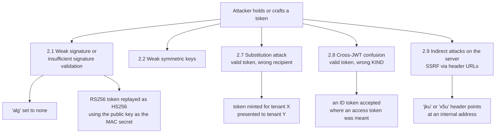
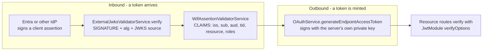

# RFC 8725 Explained - JSON Web Token Best Current Practices

> **What this is.** A plain-language, implementation-focused walkthrough of [RFC 8725](https://www.rfc-editor.org/rfc/rfc8725) (BCP 225, February 2020; Sheffer, Hardt, Jones). The authoritative text is mirrored in-repo at [rfc8725.txt](rfc8725.txt). RFC 8725 **updates RFC 7519** - it does not change the JWT wire format, it changes what a correct *validator* must do with one.

> **Status:** Reference / explainer. Dated 2026-07-30. Every conformance claim below was verified against the code on `feat/wif` at the time of writing, with the exact file and symbol cited. Where a practice is **not** implemented, this doc says so plainly rather than rounding up.

> **One-line takeaway.** A JWT is a bag of claims signed by someone; RFC 8725 is the list of ways a validator can be tricked into believing the wrong bag, and the twelve practices that stop it. The single most important one: **the validator decides the algorithm, never the token.**

> **Why this document exists at all.** This RFC spent a day as a *waiver*. The corpus gate ([sync-rfcs.ps1](../../../scripts/sync-rfcs.ps1) check C3) noticed on 2026-07-29 that RFC 8725 updates RFC 7519 - which this folder mirrors - and was itself absent. It was waived with the honest note "waived on process, NOT on merit", carrying a follow-up to mirror it properly. This doc is that follow-up, and the waiver is now deleted. A gate that produces a written, dated, self-expiring IOU is doing its job; a gate whose waivers quietly become permanent is not.

---

## Table of contents

- [1. Why RFC 8725 exists](#1-why-rfc-8725-exists)
- [2. The threat model in one picture](#2-the-threat-model-in-one-picture)
- [3. The twelve best practices](#3-the-twelve-best-practices)
- [4. Where SCIMServer validates a JWT](#4-where-scimserver-validates-a-jwt)
- [5. Conformance, practice by practice](#5-conformance-practice-by-practice)
- [6. The three honest gaps](#6-the-three-honest-gaps)
- [7. What would silently break conformance](#7-what-would-silently-break-conformance)
- [8. Common misreadings](#8-common-misreadings)
- [9. Related specs](#9-related-specs)

---

## 1. Why RFC 8725 exists

RFC 7519 defines what a JWT **is**. It is largely silent on what a receiver must **check**, and that silence produced a decade of near-identical breaches across every language ecosystem. The famous ones all have the same shape: the token told the validator how to validate it, and the validator believed it.

RFC 8725 is short by RFC standards - twelve practices in Section 3, backed by nine threat classes in Section 2. It is a **BCP**, so it carries `MUST` language despite not being a Standards Track protocol. It updates RFC 7519 in the registry sense: any implementation claiming RFC 7519 conformance today is expected to satisfy this too.

---

## 2. The threat model in one picture

Section 2 lists nine threat classes. Four of them are the ones a SCIM/WIF token path can actually meet; the rest are JWE-specific (encryption composition, ciphertext-length leakage, elliptic-curve encryption inputs) and do not arise here because **SCIMServer neither produces nor consumes encrypted JWTs**.



The unifying lesson: **every one of these is a validator bug, not a cryptography bug.** The signature math was never broken. The validator was talked into using the wrong key, the wrong algorithm, or the wrong ruleset.

---

## 3. The twelve best practices

Section 3 of the RFC, in its own numbering. The right-hand column is whether the practice can even apply to this codebase.

| Section | Practice | Applies here |
|---|---|---|
| 3.1 | Perform Algorithm Verification | **Yes - critical** |
| 3.2 | Use Appropriate Algorithms | **Yes - critical** |
| 3.3 | Validate All Cryptographic Operations | **Yes** |
| 3.4 | Validate Cryptographic Inputs | Library-level (ECDH-ES; no JWE here) |
| 3.5 | Ensure Cryptographic Keys Have Sufficient Entropy | **Yes** |
| 3.6 | Avoid Compression of Encryption Inputs | N/A - no JWE |
| 3.7 | Use UTF-8 | Library-level |
| 3.8 | Validate Issuer and Subject | **Yes - critical** |
| 3.9 | Use and Validate Audience | **Yes - critical** |
| 3.10 | Do Not Trust Received Claims | **Yes - critical** |
| 3.11 | Use Explicit Typing | **Yes - gap, see Section 6** |
| 3.12 | Use Mutually Exclusive Validation Rules for Different Kinds of JWTs | **Yes - satisfied by other means** |

The four marked critical are the ones that, if wrong, turn "we validate tokens" into "we accept tokens".

---

## 4. Where SCIMServer validates a JWT

There are exactly **two inbound JWT-shaped paths** and **one outbound**, and it matters that they are separate: the practices land in different places.



**The split is the design.** `ExternalJwksValidatorService` answers "is this signed by a key I am willing to trust, using an algorithm I chose?" It answers nothing about *who* the token is for. `WifAssertionValidatorService` answers that second question and only runs once the first has passed. RFC 8725 sections 3.1-3.3 and 3.10 live in the first; 3.8, 3.9 and 3.12 live in the second.

**There is exactly one `jose.jwtVerify` call site in the entire production tree.** Verified by grep across `api/src/**/*.ts` excluding specs: [api/src/oauth/external-jwks-validator.service.ts](../../../api/src/oauth/external-jwks-validator.service.ts) line 169. That single-choke-point property is worth more than any individual check, because it means the practices below have exactly one place to be true.

---

## 5. Conformance, practice by practice

### 3.1 Perform Algorithm Verification - SATISFIED

> "Libraries MUST enable the caller to specify a supported set of algorithms and MUST NOT use any other algorithms."

The allowlist is a module-level constant, and it is passed to every verification:

```ts
// api/src/oauth/external-jwks-validator.service.ts
const ALLOWED_ALGS = ['RS256', 'ES256'];

// ...
const keySet = jose.createLocalJWKSet(keys as Parameters<typeof jose.createLocalJWKSet>[0]);
const { payload, protectedHeader } = await jose.jwtVerify(token, keySet, {
  algorithms: ALLOWED_ALGS,
});
```

`alg: none` and `alg: HS256` are both outside the list, so both are rejected before any key is consulted. The **algorithm-confusion attack specifically** - HMAC-signing a token with the server's own published RSA public key as the shared secret - is covered by a named unit test in `api/src/oauth/oauth-asymmetric.spec.ts`.

The outbound side pins too, in [api/src/oauth/oauth.module.ts](../../../api/src/oauth/oauth.module.ts):

```ts
verifyOptions: {
  algorithms: [keys.alg],
  issuer: OAUTH_ISSUER,
},
```

Note that this is a **one-element** allowlist derived from the active signing key, not a list of "algorithms we support". That is stronger than the RFC requires and is the correct reading of the RFC's "each key MUST be used with exactly one algorithm".

### 3.2 Use Appropriate Algorithms - SATISFIED

RS256 and ES256 only, on both sides. `OAUTH_JWT_ALG` selects between them for issuance ([oauth-signing-key.service.ts](../../../api/src/oauth/oauth-signing-key.service.ts)), which is the "cryptographic agility" the RFC asks for: changing algorithm is an env var, not a code change.

Note the RFC's nuance on `none`, which is widely misread: RFC 8725 does **not** ban `alg: none` outright. It says `none` is acceptable when the JWT is protected by other means, and that libraries SHOULD NOT consume it *unless explicitly requested*. SCIMServer never requests it, so it is never consumed. The distinction matters when reading a scanner report that flags "RFC 8725 forbids none" - the RFC does not say that.

### 3.3 Validate All Cryptographic Operations - SATISFIED

`jwtVerify` rejects the whole token on any failure, and the caller does not catch-and-continue: a throw propagates out of `verify()` to the WIF validator, which converts it into a `wif_signature_invalid` decision-trace failure. No nested JWTs are produced or accepted, so the nested-JWT clause is vacuous here.

### 3.4 Validate Cryptographic Inputs - N/A (library-level)

This clause is about ECDH-ES ephemeral public keys and other JWE key-agreement inputs. There is no JWE anywhere in this codebase. For the JWS path, input validation is `jose`'s responsibility and it is a vetted, zero-dependency implementation.

### 3.5 Ensure Cryptographic Keys Have Sufficient Entropy - SATISFIED

The RFC's specific prohibition is human-memorizable passwords used directly as an HMAC key. That failure mode is **structurally impossible** for issued OAuth tokens here: there is no HMAC signing path at all. The signing identity is an RSA or EC key pair, loaded from `OAUTH_JWT_PRIVATE_KEY` or generated by `crypto.generateKeyPairSync` when absent. The header comment on `OAuthSigningKeyService` records that the issuer *previously* signed with a symmetric HS256 secret and was migrated away from it - the migration was for publishability, but it also removed this whole threat class.

### 3.8 Validate Issuer and Subject - SATISFIED

> "the application MUST validate that the cryptographic keys used ... belong to the issuer."

Two halves, and both are present:

**Key-to-issuer binding.** The JWKS URI is not taken from the token. It comes from the *stored trust record* for the endpoint, alongside `expectedIssuer`. The token cannot nominate its own key source, so the binding between "who claims to have signed this" and "which keys I will accept" is established by configuration, not by the attacker.

**Claim comparison.** In [wif-assertion-validator.service.ts](../../../api/src/oauth/wif-assertion-validator.service.ts):

```ts
if (claims.iss !== trust.expectedIssuer) {
  trace.fail('issuer_match', { expected: trust.expectedIssuer, received: String(claims.iss ?? '') });
  this.failTraced('wif_issuer_mismatch', 'issuer mismatch', trust, trace);
}
// ...
if (claims.sub !== trust.expectedSubject) {
  trace.fail('subject_match', { expected: trust.expectedSubject, received: String(claims.sub ?? '') });
```

Exact string equality against a persisted expected value, for both `iss` and `sub`. The RFC asks for the issuer-subject **pair** to be valid; here both are drawn from the same trust record, so validating each against that record validates the pair.

### 3.9 Use and Validate Audience - SATISFIED

```ts
private audienceMatches(aud: string | string[] | undefined, expected: string): boolean {
  if (Array.isArray(aud)) return aud.includes(expected);
  return aud === expected;
}
```

Handles the array form RFC 7519 permits. An absent `aud` is `undefined`, which equals no expected value, so a token with no audience is rejected - which is what the RFC requires ("if the audience value is not present ... it MUST reject the JWT").

Outbound, issued tokens carry a **per-endpoint** audience of the form `<audience>:<endpointId>`. That is more than 3.9 asks for and is what makes 3.12 hold - see below.

### 3.10 Do Not Trust Received Claims - SATISFIED, and this is the strongest part

Two named hazards, `kid` injection and `jku`/`x5u` SSRF:

**`kid`.** It is peeked from the header pre-verification, but only to select which cached JWK to try. It is never interpolated into a query, a path, or a filesystem lookup - it is compared against keys already in a fetched JWKS. There is no injection surface because there is no interpreter downstream of it.

**`jku` / `x5u`.** Verified by grep across the entire API source: **neither header is read anywhere.** Not parsed, not followed, not logged. The SSRF hazard the RFC warns about cannot occur because the mechanism it warns about is absent.

Rather than merely not following token-supplied URLs, the JWKS URI that *is* used - from configuration - is itself put through an allowlist before any socket is opened:

```ts
async verify(token: string, jwksUri: string, egressOverrides?: EgressPolicyOverrides) {
  this.assertJwksUriAllowed(jwksUri);
```

`assertJwksUriAllowed` requires `https:` and an allowlisted hostname (`JWKS_HOST_ALLOWLIST` plus a persisted admin-editable layer). It is the **first statement in the method** - before the cache, before the fetch. Redirects are handled with `redirect: 'manual'` and each hop is re-checked against the same allowlist, which closes the redirect-bypass hole that a naive allowlist leaves open. This is exactly the "matching the URL to a whitelist of allowed locations" the RFC recommends, applied to a stricter target than the RFC contemplated.

### 3.12 Use Mutually Exclusive Validation Rules - SATISFIED (without explicit typing)

The RFC offers six strategies and does not require any particular one. SCIMServer satisfies it with four of the six simultaneously:

| RFC 8725 strategy | How it holds here |
|---|---|
| Different keys per kind | Inbound assertions verify against the **IdP's** JWKS; issued tokens verify against the **server's** key. Neither key can validate the other kind. |
| Different `iss` values | Assertions carry the IdP issuer; issued tokens carry the fixed `OAUTH_ISSUER`. |
| Different `aud` values | Issued tokens are scoped `<audience>:<endpointId>`; an assertion's audience is the IdP-configured one. |
| Different required claims | The WIF path requires `tid` and optionally `roles` / `resource`; the resource path does not. |

An assertion presented to a resource route fails on key **and** issuer **and** audience. Three independent reasons is a comfortable margin.

---

## 6. The three honest gaps

These are genuine, verified by grep, and stated here rather than glossed.

### Gap 1 - Explicit typing (3.11) is not implemented

`typ` is **never enforced anywhere in the production tree.** The only references are `auth-decision-trace.ts` line 170, which sanitizes the JOSE header down to `alg`, `kid`, `typ` for observability, and a type comment in `jwt-decode.util.ts`. There is no `typ === 'JWT'` check and no rejection of an unexpected type.

**Severity: low, but not zero.** 3.11 is `RECOMMENDED`, not `MUST`, and its purpose - preventing cross-JWT confusion - is achieved here by 3.12's four independent mechanisms. The residual risk is the case 3.12 does not cover: a *new* kind of JWT minted later by the same issuer with the same audience. That is a future-shaped risk, which is exactly when the RFC says explicit typing pays off ("Explicit typing is RECOMMENDED for new uses of JWTs").

**Recommendation:** stamp `typ: 'at+jwt'` (RFC 9068) on issued access tokens and enforce it on the resource path. Cheap, and it makes the mutual exclusion explicit instead of emergent.

### Gap 2 - Clock skew tolerance is not configurable

`clockTolerance` appears **nowhere** in the codebase, so `jose`'s default of zero applies. `exp` and `nbf` are enforced exactly.

**Severity: an availability risk, not a security one.** Zero tolerance is the *safe* direction. But a modest IdP clock drift produces a hard `invalid_client` with no operator control, and the reason catalog's own remediation text already tells operators to "check clock skew" - advice they cannot act on from this side. RFC 8725 does not mandate a tolerance either way.

**Recommendation:** an `OAUTH_CLOCK_TOLERANCE_SEC` knob defaulting to `0`, capped at something small like 120s.

### Gap 3 - No replay denylist on `jti`

Issued tokens carry `jti: crypto.randomUUID()`. Inbound assertions have **no** `jti` check - grep confirms `claims.jti` is never read.

**Severity: low, and RFC 8725 does not require it.** Replay of an assertion is bounded by `exp`, and RFC 7523 assertions are short-lived by convention. The `jti` on issued tokens exists as the documented prerequisite for a future denylist. Worth noting: this is a gap against RFC 7523 section 3 (which permits a server to reject reused `jti`), not against RFC 8725.

---

## 7. What would silently break conformance

Each of these is a plausible future edit that would pass every existing test while voiding a practice above. They are listed so a reviewer can recognise them.

| Change | Practice broken | Why nothing would catch it today |
|---|---|---|
| Adding `'HS256'` to `ALLOWED_ALGS` "for a legacy partner" | 3.1, 3.2 | The alg-confusion spec asserts HS256 is rejected, so this one **would** fail a test. Good. |
| Switching `createLocalJWKSet` to `createRemoteJWKSet` | 3.10 | `jose` would fetch the URI **itself**, bypassing `assertJwksUriAllowed` entirely. The SSRF allowlist would still exist, still be tested, and no longer be on the path. This is the highest-risk edit in this file. |
| Taking `jwksUri` from a token claim or header rather than the trust record | 3.8, 3.10 | Nothing asserts the URI's provenance; the allowlist would still pass for any allowlisted host. |
| Adding a second `jwtVerify` call site | 3.1 | A new call site that omits `algorithms` accepts everything `jose` supports, including HS256. Nothing enforces the single-choke-point property. |
| Widening the audience to a constant shared across endpoints | 3.9, 3.12 | Removes one of the three independent barriers to substitution; the remaining two still pass their tests. |

The pattern is the repo's standing R10 lesson in a new domain: **a green test proves its own assertion, not the property you believe it protects.** Four of the five rows above leave every current test green.

---

## 8. Common misreadings

- **"RFC 8725 bans `alg: none`."** It does not. It says libraries SHOULD NOT consume it unless explicitly requested, and explicitly allows it when the JWT is protected by other means. The practical effect here is the same - `none` is rejected - but for the correct reason: it is not on our allowlist.
- **"Checking the signature is enough."** Sections 3.8, 3.9 and 3.12 exist entirely because a **valid** signature on a **real** token is the starting point of substitution and cross-JWT confusion attacks. A perfectly signed token for the wrong tenant is the attack.
- **"`kid` tells you which key to use, so trust it."** `kid` selects a **candidate** from a set you already trust. It must never be the thing that determines *where the set comes from*.
- **"We use a well-known library, so we conform."** RFC 8725's practices are almost all about the **options you pass** and the **claims you compare afterwards**. `jose` with no `algorithms` option is a conforming library used non-conformingly.
- **"It updates RFC 7519, so RFC 7519 is obsolete."** Updates is not obsoletes. RFC 7519 remains the format definition; RFC 8725 adds validator obligations on top. Both are mirrored here and both are current.

---

## 9. Related specs

| Spec | Relationship |
|---|---|
| [RFC 7519](RFC_7519_EXPLAINED.md) | The document this one updates. Format vs. validation obligations. |
| [RFC 7515 / 7518](https://www.rfc-editor.org/rfc/rfc7515) | JWS and JWA - where `alg` values and the signing mechanics are actually defined. Referenced, not mirrored. |
| [RFC 7517](RFC_7517_EXPLAINED.md) | JWK / JWKS - the key set `kid` selects from. |
| [RFC 7523](RFC_7523_EXPLAINED.md) | The `jwt-bearer` assertion profile whose tokens this validation path receives. |
| [RFC 9700](RFC_9700_EXPLAINED.md) | The OAuth-level security BCP. RFC 8725 is its JWT-level counterpart; they are read together. |
| [RFC 7797](https://www.rfc-editor.org/info/rfc7797) | Also updates RFC 7519 (`b64: false`). Waived in the manifest - see [README](README.md#surfaced-by-the-corpus-gate-waived-with-a-reason). |

**In-repo design docs that this analysis touches:** [EXTERNAL_JWKS_VALIDATOR.md](../EXTERNAL_JWKS_VALIDATOR.md) (the five signature guarantees and the G1-G5 egress hardening), [WIF_JWT_BEARER_ASSERTION_FOR_SCIM.md](../WIF_JWT_BEARER_ASSERTION_FOR_SCIM.md) (the trust model and claim checks), [ASYMMETRIC_SIGNING_AND_JWKS.md](../ASYMMETRIC_SIGNING_AND_JWKS.md) (the issuance key), [AUTH_ERROR_DIAGNOSTICS_AND_OBSERVABILITY.md](../AUTH_ERROR_DIAGNOSTICS_AND_OBSERVABILITY.md) (the decision trace every check above writes into).
