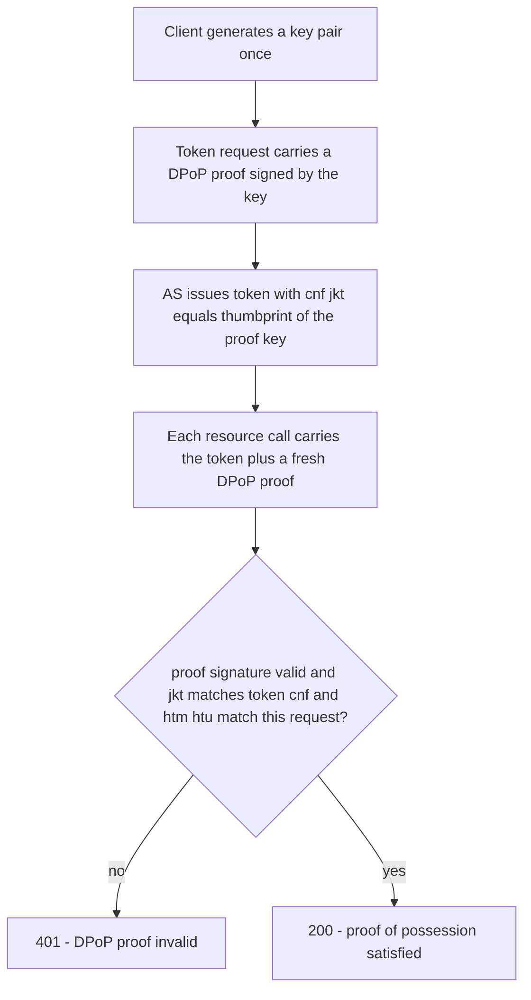

# RFC 9449 Explained - OAuth 2.0 Demonstrating Proof of Possession (DPoP)

> **What this is.** A plain-language, implementation-focused walkthrough of [RFC 9449](https://www.rfc-editor.org/rfc/rfc9449) (Proposed Standard, September 2023; Fett, Campbell, Bradley, Lodderstedt, Jones, Waite). The authoritative text is mirrored in-repo at [rfc9449.txt](rfc9449.txt). It binds an access token to an application-level key, with no PKI required.

> **Status:** Reference / explainer. Dated 2026-06-18. SCIMServer relevance is **Phase Q5 (deferred)** - the application-layer alternative to [mTLS](RFC_8705_EXPLAINED.md) for sender-constrained tokens. No code; analysis only.

> **One-line takeaway.** The client generates a key pair and sends a fresh signed **DPoP proof** JWT (in a `DPoP` header) with every request; the AS binds the issued token to that key's thumbprint (`cnf`/`jkt`), so a stolen token cannot be used without the client's private key.

---

## Table of contents

- [1. Why RFC 9449 exists](#1-why-rfc-9449-exists)
- [2. The DPoP proof JWT](#2-the-dpop-proof-jwt)
- [3. The flow - bind at issuance, prove on every call](#3-the-flow---bind-at-issuance-prove-on-every-call)
- [4. Replay defenses - jti, ath, and the server nonce](#4-replay-defenses---jti-ath-and-the-server-nonce)
- [5. DPoP vs mTLS](#5-dpop-vs-mtls)
- [6. How SCIMServer maps to RFC 9449](#6-how-scimserver-maps-to-rfc-9449)
- [7. Common misreadings and pitfalls](#7-common-misreadings-and-pitfalls)
- [8. Related specs](#8-related-specs)

---

## 1. Why RFC 9449 exists

[mTLS binding](RFC_8705_EXPLAINED.md) needs a certificate and an mTLS-capable transport - heavy for many clients. DPoP achieves the same **sender-constrained token** goal entirely at the application layer: the client proves possession of a key by signing a small JWT per request. No PKI, no cert plumbing, just HTTPS.

---

## 2. The DPoP proof JWT

A DPoP proof is a JWT with `typ: dpop+jwt`, signed by the client's private key, whose **public** key is embedded in the header (`jwk`). Its claims bind the proof to **this exact request**:

| Field | Where | Meaning |
|---|---|---|
| `typ` | header | `dpop+jwt` (distinguishes it from other JWTs) |
| `jwk` | header | the client's **public** key (the verifier needs no prior knowledge of it) |
| `alg` | header | an asymmetric signing alg (e.g. `ES256`) |
| `htm` | payload | the HTTP method of this request (e.g. `POST`) |
| `htu` | payload | the HTTP URI of this request |
| `iat` | payload | issued-at (freshness) |
| `jti` | payload | unique id (replay defense) |
| `ath` | payload | hash of the access token (on resource calls) |
| `nonce` | payload | a server-provided nonce when challenged |

```http
POST /endpoints/42/scim/v2/Users HTTP/1.1
Authorization: DPoP <access-token>
DPoP: <signed dpop proof jwt>
```

Note the scheme is `DPoP`, not `Bearer`, when the token is DPoP-bound.

---

## 3. The flow - bind at issuance, prove on every call



The token's `cnf` claim is `{ "jkt": "<base64url SHA-256 of the proof public key>" }`. On every call the server recomputes the thumbprint of the proof's `jwk` and checks it equals the token's `jkt`.

---

## 4. Replay defenses - jti, ath, and the server nonce

- **`htm` / `htu`** bind a proof to one method+URI, so a captured proof cannot be reused on a different call.
- **`iat` + `jti`** give freshness and single-use; the server tracks recent `jti`s within a short window.
- **`ath`** (access-token hash) binds a resource-call proof to the specific token presented.
- **Server nonce.** The server may reject a proof with `use_dpop_nonce` and supply a `DPoP-Nonce` header; the client repeats the proof including that `nonce`, defeating pre-generated proofs.

---

## 5. DPoP vs mTLS

| | DPoP (RFC 9449) | mTLS ([RFC 8705](RFC_8705_EXPLAINED.md)) |
|---|---|---|
| Binding key | app-generated key in the proof | TLS client certificate |
| Infra | none beyond HTTPS | PKI + mTLS proxy |
| Per-request cost | sign a small JWT each call | TLS handshake reuse |
| Token `cnf` | `jkt` (key thumbprint) | `x5t#S256` (cert thumbprint) |

Both produce sender-constrained tokens; DPoP is lighter to deploy, mTLS fits existing enterprise PKI.

---

## 6. How SCIMServer maps to RFC 9449

| RFC 9449 concept | SCIMServer |
|---|---|
| DPoP proof validation | **Q5 (deferred)** - `dpop` provider behavior |
| `cnf`/`jkt` token binding | on issued tokens when DPoP is in use |
| `DPoP-Nonce` challenge | optional replay hardening |
| current state | **not implemented** ([gap plan Pattern 7](../ISV_AUTH_PATTERNS_AND_SCIMSERVER_GAP_PLAN.md#pattern-7---mtls--dpop-sender-constrained-tokens)); flagged in the Stage X.2 security intake |

---

## 7. Common misreadings and pitfalls

| Pitfall | Reality |
|---|---|
| "DPoP tokens use the `Bearer` scheme." | No - a DPoP-bound token uses the `DPoP` auth scheme, and every call carries a fresh `DPoP` proof header. |
| "One DPoP proof works for many requests." | No - `htm`/`htu`/`jti` bind a proof to a single method+URI and make it single-use. |
| "The server must pre-register the client's key." | No - the public key travels in the proof header (`jwk`); the binding is to the thumbprint, established at issuance. |
| "DPoP replaces client authentication." | No - it constrains the **token**, orthogonal to how the client authenticated to get it. |

---

## 8. Related specs

- [RFC 8705](RFC_8705_EXPLAINED.md) - the transport-layer alternative (mTLS) for sender-constrained tokens.
- [RFC 6750](RFC_6750_EXPLAINED.md) - the bearer model DPoP hardens.
- [RFC 7519](RFC_7519_EXPLAINED.md) / [RFC 7517](RFC_7517_EXPLAINED.md) - the JWT/JWK the proof and `cnf` are built from.
- [RFC 9700](RFC_9700_EXPLAINED.md) - recommends sender-constrained tokens for high-value APIs.
- Mirror: [rfc9449.txt](rfc9449.txt). Architecture: [AUTHENTICATION_ARCHITECTURE.md](../AUTHENTICATION_ARCHITECTURE.md).
