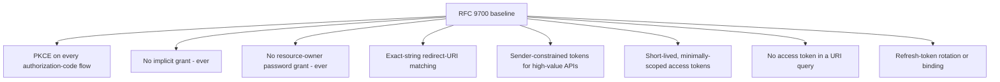

# RFC 9700 Explained - Best Current Practice for OAuth 2.0 Security

> **What this is.** A plain-language, implementation-focused walkthrough of [RFC 9700](https://www.rfc-editor.org/rfc/rfc9700) (Best Current Practice, January 2025; Lodderstedt, Bradley, Labunets, Fett). The authoritative text is mirrored in-repo at [rfc9700.txt](rfc9700.txt). It is the current **security baseline** for OAuth 2.0 - the practical core of what people call "OAuth 2.1".

> **Status:** Reference / explainer. Dated 2026-06-18. This is the standing security yardstick the whole auth design measures against; it justifies several "do not build" and "must do" decisions across [AUTHENTICATION_ARCHITECTURE.md](../AUTHENTICATION_ARCHITECTURE.md) and the gap plan. No code; analysis only.

> **One-line takeaway.** RFC 9700 hardens RFC 6749: no implicit grant, no password grant, PKCE for every authorization-code flow, exact redirect-URI matching, sender-constrained tokens for high-value APIs, short-lived/minimally-scoped tokens, and never tokens in URLs.

---

## Table of contents

- [1. Why RFC 9700 exists](#1-why-rfc-9700-exists)
- [2. The headline recommendations](#2-the-headline-recommendations)
- [3. What it forbids (and why SCIMServer never built it)](#3-what-it-forbids-and-why-scimserver-never-built-it)
- [4. What it requires that SCIMServer already does or plans](#4-what-it-requires-that-scimserver-already-does-or-plans)
- [5. Token theft and the case for sender-constraint](#5-token-theft-and-the-case-for-sender-constraint)
- [6. How SCIMServer maps to RFC 9700](#6-how-scimserver-maps-to-rfc-9700)
- [7. Common misreadings and pitfalls](#7-common-misreadings-and-pitfalls)
- [8. Related specs](#8-related-specs)

---

## 1. Why RFC 9700 exists

RFC 6749 (2012) left several patterns that the following decade proved dangerous - the implicit grant leaking tokens through browser history, the password grant teaching users to hand credentials to apps, loose redirect-URI matching enabling code interception. RFC 9700 collects a decade of hard-won guidance into one Best Current Practice that updates how OAuth 2.0 should be deployed today. It is the security spine of the "OAuth 2.1" consolidation.

---

## 2. The headline recommendations

---

## 3. What it forbids (and why SCIMServer never built it)

| RFC 9700 says | SCIMServer position |
|---|---|
| Do not use the **implicit** grant | never built ([gap plan Pattern table](../ISV_AUTH_PATTERNS_AND_SCIMSERVER_GAP_PLAN.md#3-the-8-auth-patterns-distilled)) |
| Do not use the **resource-owner password** grant | never built; HTTP Basic / username-password is also Entra-deprecated and [provably absent](../AUTHENTICATION_ARCHITECTURE.md#44-verified-greenfield-gaps-what-is-genuinely-absent) |
| Do not put tokens in URLs | SCIMServer accepts only `Authorization: Bearer` ([RFC 6750](RFC_6750_EXPLAINED.md)) |
| Do not use loose/wildcard redirect URIs | only relevant if Q4 (authorization code) ships; it MUST use exact matching + PKCE |

> **This is the standards backing for the "deliberately not designed" list.** SCIMServer's refusal to build implicit, password, and (by extension) the weakest legacy modes is not an omission - it is conformance with RFC 9700.

---

## 4. What it requires that SCIMServer already does or plans

| RFC 9700 requirement | SCIMServer |
|---|---|
| Short-lived access tokens | issued tokens are 1 h today, 1-6 h configurable under WIF |
| Minimal scope | the scope down-scoping overlay (granted = intersection) |
| TLS everywhere | mandated (also by SCIM [RFC 7644 section 2](https://www.rfc-editor.org/rfc/rfc7644)) |
| Exact-string identifier comparison | `iss`/`aud` validated by Simple String Comparison ([WIF section 4.1](../WIF_JWT_BEARER_ASSERTION_FOR_SCIM.md#41-decided---entra-v2-token-format-only-issuer-and-audience)) |
| Pinned signing algorithms | the RS256/ES256 alg allowlist in the security floor |
| PKCE on auth-code flows | enforced **if** Q4 ships ([RFC 7636](RFC_7636_EXPLAINED.md)) |
| Sender-constrained tokens for high-value APIs | DPoP / mTLS deferred to Q5 ([RFC 9449](RFC_9449_EXPLAINED.md) / [RFC 8705](RFC_8705_EXPLAINED.md)) |

---

## 5. Token theft and the case for sender-constraint

RFC 9700 spends significant effort on **token replay**: a bearer token, once stolen, is usable anywhere. Its strongest mitigation is **sender-constrained tokens** (DPoP or mTLS), which bind a token to a key the legitimate client holds. SCIMServer's current bearer model is RFC-9700-conformant for its threat level (short-lived, TLS-only, minimal scope), and the path to sender-constraint is the deferred Q5 work - a deliberate, documented trade-off, not a gap by neglect.

---

## 6. How SCIMServer maps to RFC 9700

| RFC 9700 theme | SCIMServer status |
|---|---|
| forbidden grants (implicit, password) | never built - conformant |
| PKCE for auth-code | conditional on Q4 |
| sender-constrained tokens | deferred to Q5 (DPoP/mTLS) |
| short-lived, minimally-scoped tokens | shipped + extended under WIF |
| exact-string comparison + alg pinning | shipped/proposed in the security floor |
| no tokens in URLs | shipped (header-only) |

> **Standing intake.** The repo's Stage X.2 security best-practices intake treats RFC 9700 as a living checklist - re-read it on each security review and reconcile any new recommendation against this table.

---

## 7. Common misreadings and pitfalls

| Pitfall | Reality |
|---|---|
| "OAuth 2.1 is a new protocol." | It is largely RFC 6749 **minus** the dangerous parts **plus** RFC 9700's hardening - not a new wire protocol. |
| "BCP means optional." | Best Current Practice is the expected baseline; deviating needs a documented justification. |
| "Bearer tokens are forbidden now." | No - they remain valid; sender-constraint is *recommended for high-value APIs*, not universally mandatory. |
| "Implementing WIF satisfies RFC 9700 entirely." | WIF covers the assertion flow; RFC 9700 also governs token lifetime, scope, transport, and (if added) auth-code/redirect handling. |

---

## 8. Related specs

- [RFC 6749](RFC_6749_EXPLAINED.md) - the framework RFC 9700 hardens.
- [RFC 7636](RFC_7636_EXPLAINED.md) - PKCE, near-mandatory under this BCP.
- [RFC 8705](RFC_8705_EXPLAINED.md) / [RFC 9449](RFC_9449_EXPLAINED.md) - the sender-constraint mechanisms it recommends.
- [RFC 6750](RFC_6750_EXPLAINED.md) - the bearer-token usage rules it tightens.
- Mirror: [rfc9700.txt](rfc9700.txt). Architecture: [AUTHENTICATION_ARCHITECTURE.md](../AUTHENTICATION_ARCHITECTURE.md).
