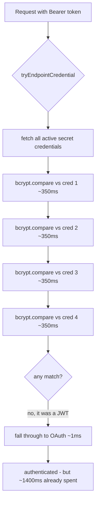
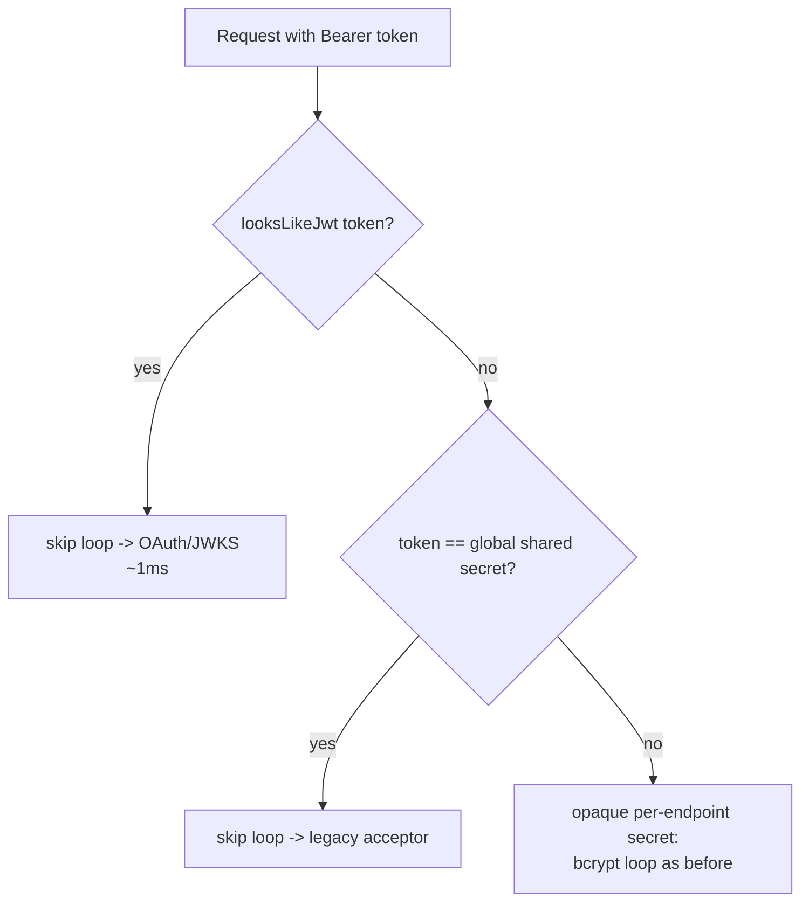

# Dev per-endpoint latency regression - root-cause analysis (X9)

Status: RESOLVED (v0.54.49 primary + v0.54.50 follow-up), proven on dev, regression gate added.

## 1. Symptom

An operator reported that per-endpoint SCIM operations on the **dev** deployment
were running many orders of magnitude slower than the customer-facing prod - "10s
of ms" on prod versus "1000s of ms" on dev - and asked why this was not surfaced
anywhere, and for gates that catch a regression like this both during development
and during the normal running of a deployed instance.

Measured on dev (`scimserver-dev`, v0.54.48) at the time of the report:

| Metric (last 100 requests) | Value |
|---|---|
| min | 0 ms |
| p50 | 1 ms |
| p95 | **1,854 ms** |
| max | **2,821 ms** |
| avg | 472 ms |

Every one of the slow requests was a per-endpoint resource op on a single
endpoint (`e8edd907-...`, which carries real Microsoft Entra provisioning
traffic):

```text
  2821ms GET  /v2/endpoints/e8edd907-.../Users?filter=userName eq "..."   [200]
  2809ms POST /v2/endpoints/e8edd907-.../Users                            [400]
  2743ms GET  /v2/endpoints/e8edd907-.../Groups?...filter=displayName...  [200]
  1854ms POST /endpoints/e8edd907-.../oauth/token                         [201]
  1719ms GET  /v2/endpoints/e8edd907-.../Users?filter=userName eq "..."   [200]
  1448ms POST /admin/endpoints/e8edd907-.../credentials/.../reveal        [200]
```

## 2. What it was NOT (hypotheses ruled out)

The instinct is "dev is on a smaller/cheaper tier" or "the database is slow." Both
were disproved by measurement:

| Hypothesis | Evidence against |
|---|---|
| Dev compute is smaller | Dev and parallel prod (proudbush) are **identical**: 0.5 vCPU / 1 Gi / minReplicas=1 / maxReplicas=1 Azure Container App. |
| Dev database is a smaller tier | Both DBs are **identical**: `Standard_B1ms` Burstable Postgres, 32 GB, v17. |
| The Burstable DB is CPU-throttled | Dev Postgres `cpu_percent` averaged **~10%** over the window - not throttled. |
| Blanket DB / network slowness | The global `POST /scim/oauth/token` was **fast** on dev (~31 ms), and `ServiceProviderConfig` was **fast** (~26 ms). Only per-endpoint resource ops were slow. |
| A code regression in the latest build | A **fresh** endpoint created on the same dev build was **fast** (~30 ms). The slowness was specific to one existing endpoint. |
| Result-set size | A filter returning 0 results (`~1,441 ms`) was as slow as one returning 2 (`~1,426 ms`) - the cost was independent of how much data came back. |

So the cost was **before** the resource query, **data-shaped** (specific to one
endpoint's accumulated state), and **paid only on the per-endpoint auth path**.

## 3. The smoking gun

The dev container console log showed the time being spent inside the auth guard,
BEFORE OAuth validation even began:

```text
DEBUG auth "Per-endpoint credential mismatch, falling back to OAuth/legacy"  durationMs: 1431
DEBUG auth "Attempting OAuth 2.0 token validation"                          durationMs: 1431
DEBUG oauth "Token validation success"                                      durationMs: 1432
INFO  auth "OAuth 2.0 authentication successful"  authType: oauth           durationMs: 1432
```

The whole ~1,431 ms elapsed **before** "Attempting OAuth 2.0 token validation."
The request then authenticated via OAuth in ~1 ms. The time was entirely in the
per-endpoint credential step.

The endpoint's state explained why:

```text
e8edd907 credential count: 10
  bearer:       1 (active: 1)
  oauth_client: 3 (active: 2)
  wif:          6 (active: 6)
```

That is **4 active secret-bearing credentials** (1 bearer + 3 oauth_client; wif
rows carry no secret hash). The endpoint had only 2 users and 1 group, but 3,455
accumulated `RequestLog` rows and a pile of credentials from months of testing.

## 4. Root cause

[SharedSecretGuard.tryEndpointCredential](../../api/src/modules/auth/shared-secret.guard.ts)
authenticates a per-endpoint request by comparing the presented bearer token
against **every** active per-endpoint secret credential using `bcrypt.compare`:

```ts
const compare = await loadBcryptCompare();
for (const cred of credentials) {
  if (cred.credentialType === 'bearer' && !effective.secretTokenBearer) continue;
  if (cred.credentialType === 'oauth_client' && !effective.oauthClientCredentials) continue;
  const isMatch = cred.credentialHash ? await compare(token, cred.credentialHash) : false;
  if (isMatch) { /* accept */ }
}
```

`bcrypt.compare` is **deliberately expensive** - it runs the configured cost
factor (~hundreds of ms per call) precisely so an attacker cannot brute-force a
stolen hash. That is correct and desirable for a real opaque-secret comparison.

The problem is the token that Microsoft Entra (and any OAuth/WIF client) presents
is a **JWT** - a three-segment `eyJ...` value validated by signature against a
JWKS. A JWT can **never** equal a random opaque per-endpoint secret, so
bcrypt-comparing it against each stored hash is **guaranteed-useless work**. For
the dominant Entra OAuth-JWT traffic the guard was paying
`O(active-secret-credentials) x bcrypt` (~4 x 350 ms = ~1,400 ms) on **every
request**, only to fall through to OAuth and authenticate in ~1 ms.

The same wasted loop was paid by a request presenting the operator-configured
**global shared secret** (an opaque, non-JWT token): it too matches no
per-endpoint credential, so it iterated the whole loop before falling through to
the legacy global-secret acceptor.



Why the customer-facing prod (calmsand) looked fast: its endpoints have fewer
accumulated secret credentials, so even the wasted loop was short; the dev
endpoint had simply accreted many credentials over months of testing, which is
what pushed the constant-but-linear cost into the seconds range.

## 5. The fix

Two short-circuits in
[tryEndpointCredential](../../api/src/modules/auth/shared-secret.guard.ts), both
added **before** the credential fetch + bcrypt loop:

1. **v0.54.49 (primary) - skip for JWTs.** If `looksLikeJwt(token)` (a
   three-segment `eyJ...` shape), skip the credential fetch + bcrypt loop and fall
   straight through to OAuth/JWKS validation, which is where a JWT is actually
   verified. A JWT is never an opaque per-endpoint secret.

2. **v0.54.50 (follow-up) - skip for the global shared secret.** If the token
   `safeCompare`-matches the operator-configured global `SCIM_SHARED_SECRET`, skip
   the loop and fall through to the legacy global-secret acceptor (which still
   enforces the per-endpoint `SharedSecretBearerAuthEnabled=false` refusal). A
   per-endpoint credential is an auto-generated random secret, so it can never
   equal the configured global secret.

Genuine per-endpoint opaque bearer/oauth_client secrets are unaffected - they are
still matched exactly as before (they are neither a JWT nor the global secret, so
they proceed into the loop).



## 6. Proof (measured on dev, endpoint e8edd907)

| Auth shape | Before (v0.54.48) | After JWT fix (v0.54.49) | After global-secret fix (v0.54.50) |
|---|---|---|---|
| JWT bearer (OAuth / Entra) | ~1,400-2,800 ms | **38-61 ms** | 45-50 ms |
| Global shared secret (opaque) | ~1,560-1,826 ms | 1,559-1,826 ms (unchanged) | **32-48 ms** |

Both dominant auth shapes dropped roughly **40x**. `POST /Users` returning a 400,
a 0-result filter, and a count=1 list all now complete in tens of ms instead of
~1.4-2.8 s.

## 7. Why this was not surfaced earlier (detection escape)

1. **No latency gate at any stage.** The build/test/deploy pipeline asserted
   correctness (HTTP status, response shape, RFC compliance) but never asserted
   **latency**. A per-request cost that scales with an endpoint's accumulated
   credential count is invisible to a correctness-only suite.
2. **It only manifests with accumulated state.** Every test endpoint is created
   fresh with zero credentials, so the loop was empty and fast in every test and
   on every fresh endpoint. The cost only appears once an endpoint has several
   secret credentials AND receives JWT/opaque-secret traffic - a combination no
   synthetic test reproduced.
3. **The slow path was the fallback path.** The guard did the wasteful work and
   then **succeeded** via OAuth, so there was no error, no failed request, no
   alert - only a silent latency tax.
4. **Runtime slow-request logging existed but had no threshold gate.** The server
   already stamps `durationMs` on every request and log line; nothing was
   asserting a ceiling on it, so the p95 climbed unremarked.

## 8. Standards, norms, and best practices

- **Authentication must be cheap and constant-ish per request.** Password/secret
  hashing (bcrypt/scrypt/argon2) is intentionally slow; you run it **at most
  once** per request against a **single** candidate credential selected by a fast
  lookup key - never in an O(N) loop over every credential. (OWASP Password
  Storage Cheat Sheet; the cost factor is a per-verification budget, not a
  per-request-times-N budget.)
- **Short-circuit on token shape.** A signed JWT and an opaque secret are
  distinguishable by shape (`eyJ...` three-segment vs not) for free, before any
  expensive comparison. Route each token to the one validator that can possibly
  accept it.
- **Do the cheap check first.** A single timing-safe `safeCompare` against the
  global secret is microseconds; it belongs before an O(N) bcrypt loop.
- **Latency is a first-class SLO, gated like correctness.** p50/p95/p99 belong in
  the same pipeline that asserts status codes, with a regression budget.
- **Bound accumulation.** Unbounded growth of per-endpoint credentials (and
  request-log rows) turns an O(N) path into a slow one over time; cap or prune.

## 9. Gates added (so the next one is caught)

### 9.1 Pipeline gate - live-test section `9z-BQ`

[scripts/live-test.ps1](../../scripts/live-test.ps1) now seeds an endpoint with 6
active bearer credentials, then times a JWT-authenticated per-endpoint op (median
of 5 samples after a warmup) and **fails if the median exceeds 800 ms**. With the
fix the median is ~36 ms even with 6 seeded credentials; a regression that
reintroduces the loop would be ~6 x 350 = ~2,100 ms and trip the gate. This runs
against local, Docker, and Azure dev in the standard live-test matrix.

### 9.2 Runtime signal - slow-request logging (already present, now documented)

The server stamps `durationMs` on every request/response log line and emits a
`WARN`-level slow-request entry above the configured threshold. This RCA
documents that signal as the runtime companion to the pipeline gate: a deployed
instance surfaces climbing latency in its own logs, and the admin logs API
(`GET /scim/admin/logs`) exposes `durationMs` per row for a p95 sweep like the one
that opened this investigation.

## 10. Follow-ups (not blocking; tracked)

- **Genuine opaque per-endpoint secrets are still O(N).** A real per-endpoint
  `bearer`/`oauth_client` secret (neither a JWT nor the global secret) still
  iterates the loop. With a handful of credentials this is fine; at scale it would
  benefit from a fast, non-secret **lookup key/prefix** stored alongside each
  credential so the guard selects the single candidate to bcrypt-compare instead
  of comparing all of them.
- **Cap or prune accumulated credentials.** `e8edd907` has 10 credentials and
  3,455 request-log rows from months of testing; stale-credential pruning would
  keep even the opaque-secret path bounded.

## 11. Change log

| Version | Change |
|---|---|
| 0.54.49 | Primary fix: JWT bearers skip the per-endpoint bcrypt loop. Guard unit +1 (38 pass). |
| 0.54.50 | Follow-up: the global shared secret also skips the loop. Guard unit +1 (39 pass). |
| 0.54.51 | This RCA doc + the `9z-BQ` live-test latency gate. |
