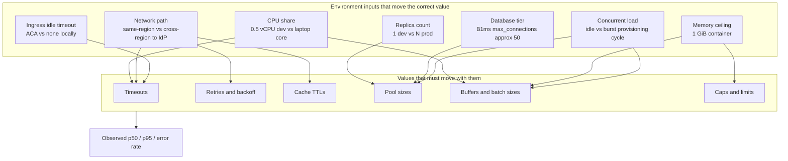
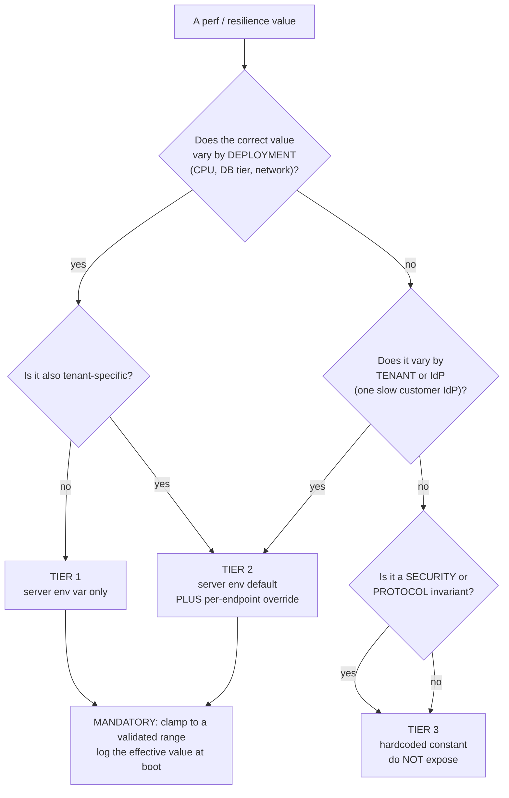
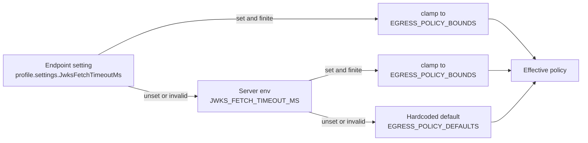
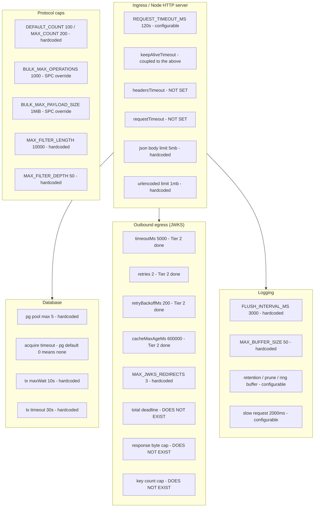
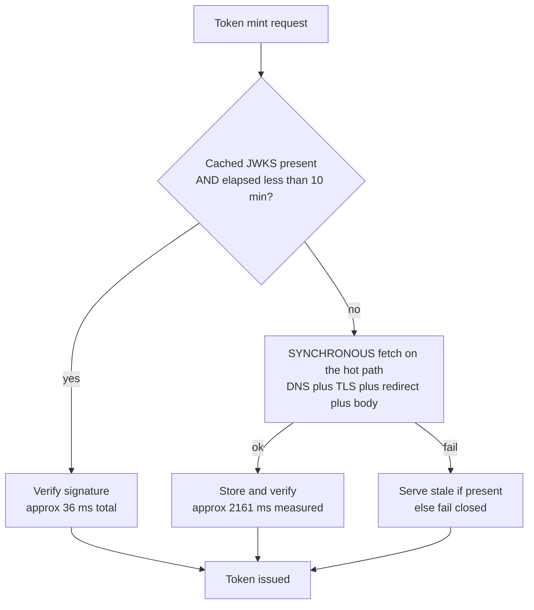
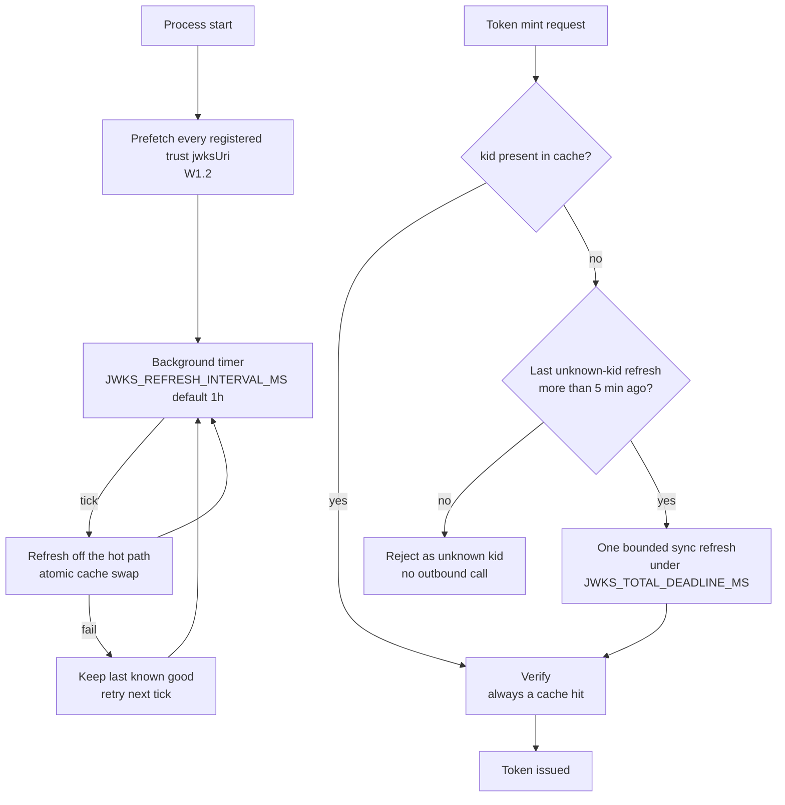
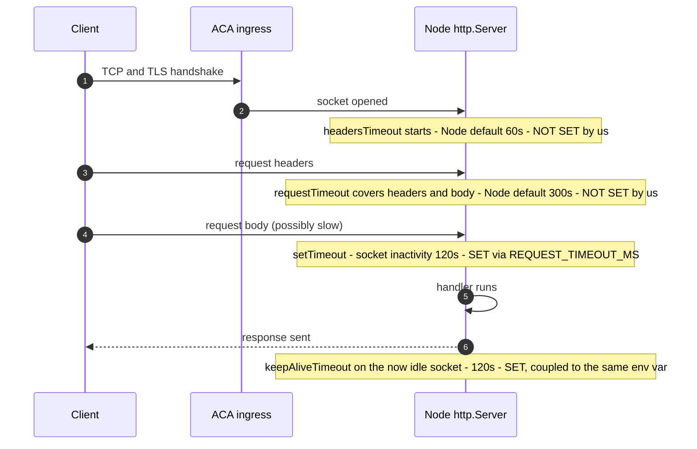
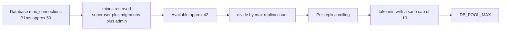
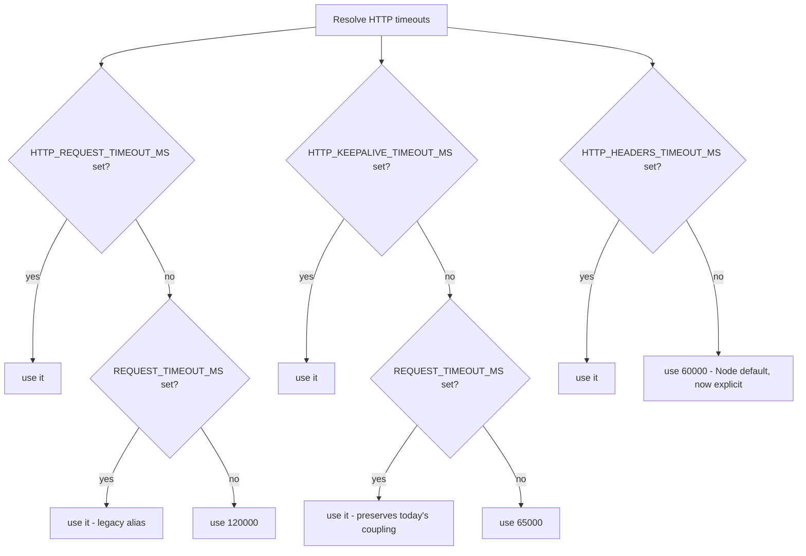
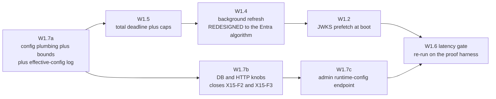

# Runtime tuning and configuration reference - every perf/resilience knob, its recommended value per environment, and the gaps (X15)

Status: ANALYSIS + REFERENCE (source-audited against api v0.54.81 on 2026-07-28).
Companion to the X11 token-mint latency analysis ([WIF_TOKEN_MINT_LATENCY_ANALYSIS.md](WIF_TOKEN_MINT_LATENCY_ANALYSIS.md))
and the X9 resource-plane RCA ([DEV_LATENCY_REGRESSION_RCA.md](DEV_LATENCY_REGRESSION_RCA.md)).
The work items proposed here are sequenced in [auth/AUTH_CONSOLIDATED_DELIVERY_PLAN.md](../auth/AUTH_CONSOLIDATED_DELIVERY_PLAN.md)
(X13, Wave 1) as the new **W1.7**, and they materially change the design of the
already-planned **W1.4** and **W1.5**.

---

## 0. TL;DR

Every latency, timeout, retry, buffer, pool, and cap value in this server is a
function of the environment it runs in: container CPU share, database tier,
network path to the IdP, replica count, and the load at that moment. X11 measured
this concretely (a WIF mint was 2,161 ms cold and 92 ms warm on the same code).
A value that is correct on a developer laptop with a local Postgres is wrong on a
0.5 vCPU Azure Container App talking to a Standard_B1ms database across a region.

This document does four things:

1. **Inventories** every such value in the codebase, with `file:line`, split into
   already-configurable versus hardcoded (Section 3).
2. **Establishes the model** for what should and should not be configurable, and
   the resolution cascade (Section 2).
3. **Recommends a concrete value for every knob, per deployment form factor**
   (Section 7), grounded in the measured baselines and in the vendor guidance
   cited in Section 5.
4. **Names the three findings** the audit produced (Section 4), the largest of
   which is that our JWKS cache default contradicts Microsoft's own published
   guidance by two orders of magnitude.

### The three findings

| # | Severity | Finding | Owner |
|---|---|---|---|
| **X15-F1** | **High** | `JWKS_CACHE_MAX_AGE_MS` defaults to **10 minutes**. Microsoft Entra's published guidance for its own signing keys is **24 hours TTL with a 1 hour background refresh**. We refresh ~144x more often than the IdP asks, and we do it **synchronously on the token-mint hot path**. This is the direct cause of the periodic cold mint X11 measured. | Redesigns **W1.4** |
| **X15-F2** | **Medium** | `REQUEST_TIMEOUT_MS` is applied to `httpServer.setTimeout()` (socket inactivity) and `keepAliveTimeout`, but **`server.requestTimeout` and `server.headersTimeout` are never set**. An operator setting `REQUEST_TIMEOUT_MS=120000` reasonably believes requests are bounded at 120 s. They are not: request duration is bounded by Node's `requestTimeout` default of **300 s**. Also, `keepAliveTimeout` is silently coupled to the request timeout, which is not the same concern. | New **W1.7** |
| **X15-F3** | **Medium** | The Prisma pool is `max: 5` hardcoded, and Prisma v7 uses driver adapters, so the **`pg` pool defaults apply**, including `connectionTimeoutMillis: 0`, which means **no acquire timeout at all**. Under pool exhaustion a request waits forever (bounded only by the 300 s from F2). Prisma v6 had a 10 s `pool_timeout`, so this is a silent regression introduced by the v7 adapter migration. | New **W1.7** |

### The one thing I would push back on

"Make everything configurable" is not the right target. Every knob is also a
support burden and a way to misconfigure yourself into an outage, and an
**unbounded** knob is a denial-of-service vector (an operator who sets
`JWKS_FETCH_RETRIES=1000` has built an amplifier). The model in Section 2 is
three tiers with mandatory clamping, not a flat "everything is an env var".

---

## 1. Why these values are environment-dependent (the grounding)



The X11 measurement is the empirical proof: identical code, identical request,
**2,161 ms cold versus 92 ms warm**, because a cache TTL expired. The current
warm WIF mint on dev, measured by the proof harness at v0.54.81, is a **36 ms
median** (min 31, max 42, 7 samples). Nothing in the code changed between those
two numbers except which side of a configurable TTL boundary the request landed on.

---

## 2. The configurability model

### 2.1 Three tiers, not one



| Tier | Definition | Examples in this codebase |
|---|---|---|
| **Tier 1 - server env** | Varies by deployment form factor only | `DB_POOL_MAX`, `HTTP_HEADERS_TIMEOUT_MS`, `LOG_FLUSH_INTERVAL_MS` |
| **Tier 2 - server env + per-endpoint** | Also varies by the tenant or the IdP behind an endpoint | The four `JWKS_*` egress values (already implemented this way) |
| **Tier 3 - hardcoded** | A security or protocol invariant. Exposing it weakens the contract | Allowed signature algorithms, `MAX_JWKS_REDIRECTS`, filter nesting depth, the WIF 1-6 h TTL window |

### 2.2 The resolution cascade (already implemented for JWKS egress)

This is the pattern to extend, not replace. It lives in
[api/src/oauth/egress-policy.ts](../../api/src/oauth/egress-policy.ts).



Three properties make this pattern safe and worth reusing:

1. **Fall-through on invalid, never throw.** `readNumber()` returns `undefined`
   for empty/non-finite input, so a typo in an env var degrades to the default
   instead of failing startup.
2. **Clamp at every level.** `EGRESS_POLICY_BOUNDS` is applied to the env value
   AND to the endpoint override, so no configuration path can disable a timeout
   or set an unbounded retry count.
3. **The bounds are shared with the validator.** The same min/max drive the
   endpoint-config validator in
   [endpoint-config.interface.ts](../../api/src/modules/endpoint/endpoint-config.interface.ts),
   so a bad value is rejected at write time with a clear message, not silently
   clamped at read time.

### 2.3 Current shape of the endpoint override

```json
{
  "schemas": [
    "urn:ietf:params:scim:schemas:core:2.0:ServiceProviderConfig"
  ],
  "settings": {
    "JwksFetchTimeoutMs": "8000",
    "JwksFetchRetries": "3",
    "JwksFetchRetryBackoffMs": "500",
    "JwksCacheMaxAgeMs": "3600000"
  }
}
```

Numeric endpoint flags accept a string or a number (the admin UI writes strings);
`resolveNumericLimit()` normalizes and clamps both.

---

## 3. Complete inventory (source-audited, api v0.54.81)

### 3.1 Layer map



### 3.2 Already configurable (no change needed)

| Value | Env var | Default | File |
|---|---|---|---|
| JWKS fetch timeout | `JWKS_FETCH_TIMEOUT_MS` | 5000 ms | [egress-policy.ts:40](../../api/src/oauth/egress-policy.ts) |
| JWKS retries | `JWKS_FETCH_RETRIES` | 2 | [egress-policy.ts:41](../../api/src/oauth/egress-policy.ts) |
| JWKS retry backoff | `JWKS_FETCH_RETRY_BACKOFF_MS` | 200 ms | [egress-policy.ts:42](../../api/src/oauth/egress-policy.ts) |
| JWKS cache max age | `JWKS_CACHE_MAX_AGE_MS` | 600000 ms | [egress-policy.ts:43](../../api/src/oauth/egress-policy.ts) |
| JWKS SSRF allowlist | `JWKS_HOST_ALLOWLIST` | empty | [external-jwks-validator.service.ts](../../api/src/oauth/external-jwks-validator.service.ts) |
| Request/socket timeout | `REQUEST_TIMEOUT_MS` | 120000 ms | [main.ts:139](../../api/src/main.ts) |
| Port / prefix / CORS | `PORT`, `API_PREFIX`, `CORS_ORIGIN` | 3000, `scim`, allow-all | [main.ts](../../api/src/main.ts) |
| Log retention | `LOG_RETENTION_DAYS` | 21 days | [logging.service.ts:35](../../api/src/modules/logging/logging.service.ts) |
| Log prune interval | `LOG_PRUNE_INTERVAL_MS` | 3600000 ms | [logging.service.ts:36](../../api/src/modules/logging/logging.service.ts) |
| Log ring buffer | `LOG_RING_BUFFER_SIZE` | 2000 | [scim-logger.service.ts](../../api/src/modules/logging/scim-logger.service.ts) |
| Slow-request threshold | `LOG_SLOW_REQUEST_MS` | 2000 ms | [scim-logger.service.ts](../../api/src/modules/logging/scim-logger.service.ts) |
| Log payload cap | `LOG_MAX_PAYLOAD_SIZE` | 8192 bytes | [log-levels.ts](../../api/src/modules/logging/log-levels.ts) |
| Log file rotation | `LOG_FILE_MAX_SIZE`, `LOG_FILE_MAX_COUNT` | 10 MiB, 3 | [file-log-transport.ts](../../api/src/modules/logging/file-log-transport.ts) |
| Auth decision store | `AUTH_DECISION_STORE_TTL_MS`, `AUTH_DECISION_STORE_MAX` | 30 min, 500 | [auth-decision-record.store.ts](../../api/src/oauth/auth-decision-record.store.ts) |

Plus `LOG_LEVEL`, `LOG_FORMAT`, `LOG_CATEGORY_LEVELS`, `LOG_INCLUDE_PAYLOADS`,
`LOG_INCLUDE_STACKS`, `LOG_AUTO_PRUNE`, `LOG_FILE`, `PERSIST_REQUEST_SECRETS`,
`DATABASE_URL`, `PERSISTENCE_BACKEND`, `NODE_ENV`.

### 3.3 Hardcoded and should be promoted

| Value | Current | File | Proposed tier | Proposed key |
|---|---|---|---|---|
| Prisma pool max | `5` | [prisma.service.ts:26](../../api/src/modules/prisma/prisma.service.ts) | 1 | `DB_POOL_MAX` |
| Pool acquire timeout | none (pg default `0`) | [prisma.service.ts:26](../../api/src/modules/prisma/prisma.service.ts) | 1 | `DB_POOL_ACQUIRE_TIMEOUT_MS` |
| Pool idle timeout | pg default `10000` | same | 1 | `DB_POOL_IDLE_TIMEOUT_MS` |
| Transaction maxWait | `10_000` ms | [prisma-group.repository.ts:273](../../api/src/infrastructure/repositories/prisma/prisma-group.repository.ts) | 1 | `DB_TX_MAX_WAIT_MS` |
| Transaction timeout | `30_000` ms | same | 1 | `DB_TX_TIMEOUT_MS` |
| JSON body limit | `5mb` | [body-parsers.ts:6](../../api/src/bootstrap/body-parsers.ts) | 1 | `HTTP_JSON_BODY_LIMIT` |
| urlencoded limit | `1mb` | [body-parsers.ts:41](../../api/src/bootstrap/body-parsers.ts) | 1 | `HTTP_FORM_BODY_LIMIT` |
| `headersTimeout` | never set (Node 60 s) | [main.ts](../../api/src/main.ts) | 1 | `HTTP_HEADERS_TIMEOUT_MS` |
| `requestTimeout` | never set (Node 300 s) | [main.ts](../../api/src/main.ts) | 1 | `HTTP_REQUEST_TIMEOUT_MS` |
| `keepAliveTimeout` | coupled to `REQUEST_TIMEOUT_MS` | [main.ts:148](../../api/src/main.ts) | 1 | `HTTP_KEEPALIVE_TIMEOUT_MS` |
| Log flush interval | `3_000` ms | [logging.service.ts:48](../../api/src/modules/logging/logging.service.ts) | 1 | `LOG_FLUSH_INTERVAL_MS` |
| Log flush buffer | `50` | [logging.service.ts:49](../../api/src/modules/logging/logging.service.ts) | 1 | `LOG_FLUSH_MAX_BUFFER` |
| Default page size | `100` | [scim-constants.ts:40](../../api/src/modules/scim/common/scim-constants.ts) | 1 | `SCIM_DEFAULT_COUNT` |
| Max page size | `200` | [scim-constants.ts:41](../../api/src/modules/scim/common/scim-constants.ts) | 1 | `SCIM_MAX_COUNT` |
| JWKS background refresh | does not exist | - | 2 | `JWKS_REFRESH_INTERVAL_MS` |
| JWKS unknown-kid rate limit | does not exist | - | 2 | `JWKS_UNKNOWN_KID_MIN_INTERVAL_MS` |
| JWKS hard-stale ceiling | does not exist | - | 2 | `JWKS_STALE_IF_ERROR_MS` |
| JWKS total deadline | does not exist | - | 2 | `JWKS_TOTAL_DEADLINE_MS` |
| JWKS response byte cap | does not exist | - | 1 | `JWKS_MAX_RESPONSE_BYTES` |
| JWKS key count cap | does not exist | - | 1 | `JWKS_MAX_KEYS` |

### 3.4 Keep hardcoded (Tier 3)

| Value | Current | Why it stays fixed |
|---|---|---|
| Allowed signature algorithms | RS256 / ES256 | Making this configurable re-opens the `alg:none` and algorithm-confusion class. A security invariant. |
| `MAX_JWKS_REDIRECTS` | `3` | An SSRF blast-radius control, not a perf knob. Each hop is already re-validated against the allowlist. |
| `MAX_FILTER_DEPTH` | `50` | Stack-overflow protection. A configurable depth is a configurable crash. |
| `MAX_FILTER_LENGTH` | `10000` | Parser DoS protection. Already far above any real Entra filter. |
| WIF issued-token TTL window | 1 h to 6 h | The Entra-compatible window. Widening it is a security decision made per trust via `issuedTokenTtlSec`, already clamped into this window. |
| `BULK_MAX_OPERATIONS` / `BULK_MAX_PAYLOAD_SIZE` | 1000 / 1 MiB | Already overridable **per endpoint** through ServiceProviderConfig, which is the RFC 7644 section 3.7 mechanism. A second env-level knob would be a competing source of truth. |

---

## 4. The findings in detail

### 4.1 X15-F1 - the JWKS cache TTL contradicts Entra's own guidance

Microsoft publishes explicit guidance for consumers of its signing keys
([Signing key rollover in the Microsoft identity platform](https://learn.microsoft.com/en-us/entra/identity-platform/signing-key-rollover)):

> The time-to-live of keys in the cache should be configured to **24 hours**,
> with refreshes happening **every hour**. [...] The keys should be refreshed:
> once on process startup; periodically (recommended every 1 hour) as a
> background job; dynamically if a received token was signed with an unknown key
> [...] **but no more frequently than 5 minutes**.

Our current behaviour, versus that:

| Aspect | Entra guidance | SCIMServer today | Gap |
|---|---|---|---|
| Cache TTL | 24 h | **10 min** | 144x more aggressive |
| Refresh mode | background job | **synchronous, on the mint hot path** | wrong plane |
| Refresh cadence | every 1 h | on expiry only | no proactive refresh |
| Cache granularity | **per `kid`** | per `jwksUri` (whole key set) | coarser |
| Unknown-`kid` refetch | yes, **rate-limited to 5 min** | yes, **no rate limit** | amplification vector |
| On fetch failure | serve last-known-good | serve stale (already correct) | none |

Today (the periodic cold mint X11 measured):



Proposed (the Entra algorithm), which is what W1.4 should build:



**Why the TTL change must not ship alone.** Raising the TTL from 10 min to 24 h
increases the key-rotation blast radius: if the background refresher is broken,
we would now serve a stale key set for up to a day instead of ten minutes.
Therefore the TTL raise and the background refresher must land in the **same
change**, with an overlap-window test that proves a rotated key is picked up.
The unknown-`kid` sync path (rate-limited) is the safety net that makes the long
TTL correct even if a rotation happens between background ticks - which is
exactly why Entra's algorithm pairs the two.

### 4.2 X15-F2 - the HTTP server timeout anatomy is incomplete

Node's `http.Server` has four distinct timeouts. We set one and a half of them.



Reference: [Node.js HTTP documentation](https://nodejs.org/api/http.html). The docs
state that `headersTimeout` and `requestTimeout` "must be set to a non-zero value
(e.g. 120 seconds) to protect against potential Denial-of-Service attacks in case
the server is deployed without a reverse proxy in front."

Three separate problems:

1. **The operator's mental model is wrong.** `REQUEST_TIMEOUT_MS` sets
   `setTimeout()`, which is **socket inactivity**, not request duration. A slow
   client that dribbles a byte every 60 s never trips it. The value that actually
   bounds a request is `server.requestTimeout`, left at Node's 300 s default.
2. **`keepAliveTimeout` is the wrong thing to couple.** Keep-alive duration is a
   function of the **upstream idle timeout**, not of how long a request may take.
   The classic failure is a server whose `keepAliveTimeout` is shorter than the
   load balancer's idle timeout: the LB picks a socket the server is closing at
   that instant and the client sees a 502 or `ECONNRESET`. Our current value is
   long enough to be safe, but only by accident - if someone tunes
   `REQUEST_TIMEOUT_MS` down to 15 s for a fast-fail policy, they silently create
   the keep-alive race.
3. **No `keepAliveTimeoutBuffer`.** Recent Node adds this (default 1000 ms) to
   close the socket slightly before the value it advertised, which measurably
   reduces the `ECONNRESET` race. We do not set it.

### 4.3 X15-F3 - the pool has no acquire timeout

[prisma.service.ts:26](../../api/src/modules/prisma/prisma.service.ts):

```ts
const pool = new pg.Pool({ connectionString: effectiveUrl, max: 5 });
```

Prisma 7 requires a driver adapter, so the pool is a raw `pg.Pool` and **`pg`'s
defaults apply to everything we did not pass**. Per the
[Prisma connection pool documentation](https://www.prisma.io/docs/orm/prisma-client/setup-and-configuration/databases-connections/connection-pool),
the `pg` adapter defaults are `max: 10`, `connectionTimeoutMillis: 0`,
`idleTimeoutMillis: 10000`, `maxLifetimeSeconds: 0`.

`connectionTimeoutMillis: 0` means **wait forever for a connection**. Prisma v6
defaulted `pool_timeout` to 10 seconds, so the v7 adapter migration silently
removed a bound that used to exist. Combined with F2, a pool-exhaustion incident
degrades into requests hanging for up to Node's 300 s `requestTimeout` rather
than failing fast with a clear error.

Sizing also needs to be explicit rather than an unexplained `5`:



---

## 5. Best practices, with sources

### 5.1 Cache the IdP key set the way the IdP asks

Verified source: [Microsoft Entra signing key rollover](https://learn.microsoft.com/en-us/entra/identity-platform/signing-key-rollover).
Key points beyond the TTL numbers already quoted:

- Cache **individual keys by `kid`**, not the key document. Entra publishes
  multiple valid keys simultaneously during a rollover overlap window.
- The cache should be able to hold **10 to 1000 keys** across issuers, so a
  key-count cap must be generous enough not to break multi-IdP deployments.
- **Continue operating on last-known-good** if a refresh fails. We already do
  this (`fetchJwksWithRetry` fail-to-stale), and it is the correct behaviour.
- In a multi-tenant application, discover keys **per tenant**; do not assume one
  global key set.
- Keys roll periodically **and can roll immediately** in an emergency, which is
  what makes the rate-limited unknown-`kid` path mandatory rather than optional.

### 5.2 Bound the total, not just each attempt

Our retry loop uses exponential backoff with jitter, which is correct. What is
missing is a **total deadline**. With `timeoutMs: 5000` and `retries: 2`, the
worst case is 3 attempts of 5 s plus backoff, so a single mint can spend more
than 15 s before failing - and nothing above it is bounding that. The standard
mitigation is a **single cancellable deadline** established at the top of the
operation and propagated into every sub-step, so that "how long may this take"
is answered once, not multiplied. That is the core of the planned **W1.5**, and
it must be configurable because the right budget differs per environment.

Corollary rule: a callee's total deadline must always be **shorter** than the
caller's timeout, otherwise the caller gives up first and the retry work is
wasted. With `HTTP_REQUEST_TIMEOUT_MS` at 120 s, a JWKS deadline of 8 to 15 s is
comfortably inside.

### 5.3 Keep-alive must outlive the upstream idle timeout

Reference: [Node.js HTTP documentation](https://nodejs.org/api/http.html)
(`server.keepAliveTimeout`, `server.keepAliveTimeoutBuffer`, and the
`reusedSocket` `ECONNRESET` retry note). The rule is directional: **server
keep-alive > proxy idle timeout**. If it is the other way around, the proxy
holds a socket the server has already decided to close, and whichever request
lands in that window fails at the transport layer with no application-level trace.
`keepAliveTimeoutBuffer` exists specifically to shave the race window on the
server side.

### 5.4 Pool size is a global budget, not a local choice

Reference: [Prisma connection pool](https://www.prisma.io/docs/orm/prisma-client/setup-and-configuration/databases-connections/connection-pool),
which states that "the pool size cannot exceed what the underlying database can
support". The constraint is `pool_max * max_replicas <= db_max_connections -
reserved`. This means **the pool size must change when the replica ceiling
changes**, which is exactly why it cannot stay a hardcoded `5`. Prisma also
recommends an external pooler (PgBouncer or similar) for serverless and
high-replica topologies, which is the escape hatch if we ever scale past what
the tier supports.

### 5.5 Every cap is also a security control

Response byte caps, key-count caps, body-parser limits, filter length and depth
caps, and pagination ceilings are all simultaneously perf knobs and
resource-exhaustion defenses. Two consequences:

- They must have a **maximum bound**, not just a default, so an operator cannot
  configure the defense away.
- Their defaults should be set from the **observed real payload size with
  headroom**, not from an arbitrary round number. Entra's JWKS document is on the
  order of 10 KB, so a 1 MB cap is 100x headroom and still catches a hostile or
  malfunctioning endpoint.

### 5.6 Make the effective configuration observable

A configurable system without a way to see what took effect is strictly harder
to operate than a hardcoded one. Every tier-1 and tier-2 value must be emitted
once at boot with its source (`env` / `default` / `clamped-from`), so that a
support conversation starts from fact rather than from "what do you have set?".
This is a hard requirement on the implementation, not a nice-to-have.

### 5.7 Source honesty note

The AWS Builders' Library article on timeouts, retries and backoff with jitter is
a widely cited primary source for Section 5.2. It could not be fetched during
this audit (the host returned HTTP 405 to the tool), so the claims in 5.2 are
stated from the general engineering consensus and from what is directly
observable in our own code, **not** attributed to that source. The Microsoft,
Node.js, and Prisma claims above were each fetched and verified.

---

## 6. Typical issues and their mitigations

| # | Issue | Mechanism | Mitigation | Status here |
|---|---|---|---|---|
| 1 | **Periodic cold spike** | Cache TTL expires, next request pays the full fetch synchronously | Background refresh-ahead, so the hot path is always a hit | **Open** - W1.4, redesigned by X15-F1 |
| 2 | **Cold start after deploy** | Module load plus empty cache on the first request | Preload at boot, prefetch known key sets | `jose` preload **done** (W1.1); JWKS prefetch **open** (W1.2) |
| 3 | **Thundering herd** | N concurrent misses cause N identical outbound fetches | Single-flight coalescing on the in-flight promise | **Done** (`inflight` map) |
| 4 | **Retry storm** | Every caller retries a struggling dependency in lockstep | Exponential backoff plus jitter, plus a retry budget | Backoff+jitter **done**; retry budget **open** |
| 5 | **Unbounded worst case** | Per-attempt timeouts multiply across retries and redirects | One cancellable total deadline | **Open** - W1.5 |
| 6 | **Memory exhaustion via a hostile JWKS** | No byte or key-count cap on the response we parse | Byte cap plus key-count cap plus per-key type checks | **Open** - W1.5 |
| 7 | **Pool exhaustion hangs** | `connectionTimeoutMillis: 0` means unbounded wait | Bounded acquire timeout, fail fast with a clear error | **Open** - X15-F3 |
| 8 | **DB connection exhaustion on scale-out** | `pool * replicas` exceeds `max_connections` | Size the pool from the budget formula, re-check on every replica change | **Open** - X15-F3 |
| 9 | **Keep-alive 502 / ECONNRESET race** | Server keep-alive shorter than proxy idle timeout | Server keep-alive strictly greater, plus `keepAliveTimeoutBuffer` | **Latent** - correct today by accident, X15-F2 |
| 10 | **Slow-loris style request** | `setTimeout` is socket inactivity, not request duration | Set `requestTimeout` and `headersTimeout` explicitly | **Open** - X15-F2 |
| 11 | **Unknown-kid amplification** | A flood of tokens with bogus `kid` each triggers an outbound refetch | Rate-limit the sync refresh to once per 5 minutes | **Open** - X15-F1 |
| 12 | **Stale cache after allowlist revocation** | Removing a host from `JWKS_HOST_ALLOWLIST` does not purge its cached keys, because fail-to-stale swallows the SSRF rejection | Purge on allowlist change, or make an SSRF rejection non-stale-eligible | **Open question** - recorded in [auth/EXECUTION_ISSUES_AND_RCA.md](../auth/EXECUTION_ISSUES_AND_RCA.md) section 10.2, owned by W1.4 |
| 13 | **Log buffer loss on crash** | Up to 3 s of buffered rows are lost if the process dies | Shorter interval with a larger batch under load, flush on shutdown | Shutdown flush **done**; tuning **open** |
| 14 | **Over-configuration** | Too many knobs, each a way to misconfigure | Three tiers, mandatory clamps, effective-config logging | Addressed by Section 2 |

---

## 7. Recommended values per environment

Form factors, with their actual characteristics:

| Id | Environment | Shape |
|---|---|---|
| **L** | Local dev (`node api/dist/main.js`, port 6000) | Developer machine, in-memory or local Postgres, no proxy in front |
| **D** | Docker compose (port 8080) | Container plus local Postgres container, no proxy |
| **A-dev** | Azure Container Apps `scimserver-dev` | ~0.5 vCPU, 1 replica, Postgres Flexible Standard_B1ms, ACA ingress in front, same region as Entra |
| **A-prod** | Azure Container Apps prod (calmsand + proudbush) | Real tenant traffic, multi-replica capable, ACA ingress |

### 7.1 Outbound egress (JWKS) - Tier 2

| Key | L | D | A-dev | A-prod | Rationale |
|---|---|---|---|---|---|
| `JWKS_CACHE_MAX_AGE_MS` | `86400000` (24 h) | `86400000` | **`86400000`** | **`86400000`** | Entra's published guidance. Ship **only with** the background refresher (X15-F1). |
| `JWKS_REFRESH_INTERVAL_MS` *(new)* | `3600000` (1 h) | `3600000` | **`3600000`** | **`3600000`** | Entra's recommended background cadence. |
| `JWKS_UNKNOWN_KID_MIN_INTERVAL_MS` *(new)* | `300000` (5 min) | `300000` | **`300000`** | **`300000`** | Entra's explicit rate limit. Closes issue 11. |
| `JWKS_STALE_IF_ERROR_MS` *(new)* | `604800000` (7 d) | `604800000` | **`604800000`** | **`259200000`** (3 d) | How long last-known-good may be served during an IdP outage before failing closed. Shorter in prod to bound the rotation blast radius. |
| `JWKS_FETCH_TIMEOUT_MS` | `5000` | `5000` | **`5000`** | **`3000`** | Prod path to Entra is same-region and predictable, so fail faster. |
| `JWKS_FETCH_RETRIES` | `2` | `2` | **`2`** | **`2`** | Unchanged. Two retries plus jitter covers transient loss. |
| `JWKS_FETCH_RETRY_BACKOFF_MS` | `200` | `200` | **`200`** | **`200`** | Unchanged. |
| `JWKS_TOTAL_DEADLINE_MS` *(new)* | `15000` | `15000` | **`10000`** | **`8000`** | Must be well inside `HTTP_REQUEST_TIMEOUT_MS`. Bounds issue 5. |
| `JWKS_MAX_RESPONSE_BYTES` *(new)* | `1048576` | `1048576` | **`1048576`** | **`1048576`** | Entra's JWKS is ~10 KB. 100x headroom. Bounds issue 6. |
| `JWKS_MAX_KEYS` *(new)* | `100` | `100` | **`100`** | **`100`** | Entra publishes ~6-10 per tenant; Microsoft's own guidance says a cache should hold 10-1000 across issuers, so do not set this tight. |

Note that most of these are identical across environments. That is the correct
outcome: they are driven by the **IdP's** behaviour, not ours. The per-endpoint
tier exists for the case where one customer's IdP is genuinely slower.

### 7.2 HTTP server - Tier 1

| Key | L | D | A-dev | A-prod | Rationale |
|---|---|---|---|---|---|
| `HTTP_REQUEST_TIMEOUT_MS` *(new)* | `120000` | `120000` | **`120000`** | **`120000`** | The real request bound. Explicitly non-zero per the Node DoS note. |
| `HTTP_HEADERS_TIMEOUT_MS` *(new)* | `60000` | `60000` | **`60000`** | **`60000`** | Node's default, but set explicitly so it is visible and cannot drift. |
| `HTTP_KEEPALIVE_TIMEOUT_MS` *(new)* | `65000` | `65000` | **`120000`** | **`120000`** | Locally there is no proxy, so Node's 65 s is fine. Behind ACA ingress it must exceed the ingress idle timeout. Decoupled from the request timeout (X15-F2). |
| `HTTP_KEEPALIVE_TIMEOUT_BUFFER_MS` *(new)* | `1000` | `1000` | **`1000`** | **`1000`** | Node's default; shaves the `ECONNRESET` race window. |
| `HTTP_JSON_BODY_LIMIT` *(new)* | `5mb` | `5mb` | **`5mb`** | **`5mb`** | Unchanged default; exposed so a bulk-heavy tenant can be accommodated without a rebuild. |
| `HTTP_FORM_BODY_LIMIT` *(new)* | `1mb` | `1mb` | **`1mb`** | **`256kb`** | Only OAuth token forms use this. A `client_assertion` JWT is a few KB, so prod can be much tighter. |
| `REQUEST_TIMEOUT_MS` *(existing)* | `120000` | `120000` | `120000` | `120000` | **Retained for backward compatibility** as the fallback for the three new keys when they are unset. See Section 8.3. |

### 7.3 Database - Tier 1

| Key | L | D | A-dev | A-prod | Rationale |
|---|---|---|---|---|---|
| `DB_POOL_MAX` *(new)* | `5` | `5` | **`5`** | **`10`** | `min(10, (max_connections - reserved) / max_replicas)`. B1ms is ~50 connections, so 5 per replica leaves generous headroom at the dev replica ceiling. Re-derive whenever the replica ceiling or DB tier changes. |
| `DB_POOL_ACQUIRE_TIMEOUT_MS` *(new)* | `10000` | `10000` | **`10000`** | **`10000`** | Restores the Prisma v6 `pool_timeout` bound the v7 adapter migration dropped (X15-F3). |
| `DB_POOL_IDLE_TIMEOUT_MS` *(new)* | `10000` | `10000` | **`30000`** | **`30000`** | `pg` default is 10 s. Longer in Azure so a bursty provisioning cycle is not re-establishing TLS to Postgres constantly. |
| `DB_TX_MAX_WAIT_MS` *(new)* | `10000` | `10000` | **`10000`** | **`10000`** | Unchanged default, exposed. |
| `DB_TX_TIMEOUT_MS` *(new)* | `30000` | `30000` | **`30000`** | **`30000`** | Unchanged default, exposed. Must stay inside `HTTP_REQUEST_TIMEOUT_MS`. |

### 7.4 Logging - Tier 1

| Key | L | D | A-dev | A-prod | Rationale |
|---|---|---|---|---|---|
| `LOG_FLUSH_INTERVAL_MS` *(new)* | `3000` | `3000` | **`3000`** | **`1000`** | Shorter in prod bounds crash-loss to 1 s. |
| `LOG_FLUSH_MAX_BUFFER` *(new)* | `50` | `50` | **`50`** | **`200`** | Larger batch under load means fewer round-trips and less pool pressure. |
| `LOG_LEVEL` | `DEBUG` | `INFO` | **`INFO`** | **`INFO`** | Existing key; recorded here so the full picture is in one place. |
| `LOG_INCLUDE_PAYLOADS` | `true` | `true` | **`true`** | **`false`** | PII exposure. Existing key. |
| `LOG_SLOW_REQUEST_MS` | `2000` | `2000` | **`2000`** | **`1000`** | Prod should surface a 1 s request as slow given the measured 36 ms warm mint. |
| `LOG_RETENTION_DAYS` | `7` | `7` | **`21`** | **`21`** | Existing key. |

### 7.5 SCIM protocol caps - Tier 1

| Key | L | D | A-dev | A-prod | Rationale |
|---|---|---|---|---|---|
| `SCIM_DEFAULT_COUNT` *(new)* | `100` | `100` | **`100`** | **`100`** | Unchanged default, exposed. |
| `SCIM_MAX_COUNT` *(new)* | `200` | `200` | **`200`** | **`200`** | Unchanged default, exposed with a hard upper bound of `1000` so it cannot be configured into a memory problem. |

### 7.6 Proposed complete `.env` for A-prod

```jsonc
// Schematic - shown as key/value pairs for readability, deployed as
// Azure Container Apps environment variables, not as a JSON file.
{
  "JWKS_CACHE_MAX_AGE_MS": "86400000",
  "JWKS_REFRESH_INTERVAL_MS": "3600000",
  "JWKS_UNKNOWN_KID_MIN_INTERVAL_MS": "300000",
  "JWKS_STALE_IF_ERROR_MS": "259200000",
  "JWKS_FETCH_TIMEOUT_MS": "3000",
  "JWKS_FETCH_RETRIES": "2",
  "JWKS_FETCH_RETRY_BACKOFF_MS": "200",
  "JWKS_TOTAL_DEADLINE_MS": "8000",
  "JWKS_MAX_RESPONSE_BYTES": "1048576",
  "JWKS_MAX_KEYS": "100",

  "HTTP_REQUEST_TIMEOUT_MS": "120000",
  "HTTP_HEADERS_TIMEOUT_MS": "60000",
  "HTTP_KEEPALIVE_TIMEOUT_MS": "120000",
  "HTTP_KEEPALIVE_TIMEOUT_BUFFER_MS": "1000",
  "HTTP_JSON_BODY_LIMIT": "5mb",
  "HTTP_FORM_BODY_LIMIT": "256kb",

  "DB_POOL_MAX": "10",
  "DB_POOL_ACQUIRE_TIMEOUT_MS": "10000",
  "DB_POOL_IDLE_TIMEOUT_MS": "30000",
  "DB_TX_MAX_WAIT_MS": "10000",
  "DB_TX_TIMEOUT_MS": "30000",

  "LOG_FLUSH_INTERVAL_MS": "1000",
  "LOG_FLUSH_MAX_BUFFER": "200",
  "LOG_LEVEL": "INFO",
  "LOG_INCLUDE_PAYLOADS": "false",
  "LOG_SLOW_REQUEST_MS": "1000",

  "SCIM_DEFAULT_COUNT": "100",
  "SCIM_MAX_COUNT": "200"
}
```

---

## 8. Proposed implementation (W1.7)

### 8.1 Bounds table (the clamp contract)

Every new key gets a bound, following `EGRESS_POLICY_BOUNDS`. Out-of-range values
are clamped, not rejected, and the clamp is logged.

| Key | Min | Max |
|---|---|---|
| `JWKS_REFRESH_INTERVAL_MS` | `60000` (1 min) | `86400000` (24 h) |
| `JWKS_UNKNOWN_KID_MIN_INTERVAL_MS` | `0` | `3600000` (1 h) |
| `JWKS_STALE_IF_ERROR_MS` | `0` | `2592000000` (30 d) |
| `JWKS_TOTAL_DEADLINE_MS` | `1000` | `120000` |
| `JWKS_MAX_RESPONSE_BYTES` | `4096` | `16777216` (16 MiB) |
| `JWKS_MAX_KEYS` | `1` | `1000` |
| `HTTP_REQUEST_TIMEOUT_MS` | `1000` | `600000` |
| `HTTP_HEADERS_TIMEOUT_MS` | `1000` | `600000` |
| `HTTP_KEEPALIVE_TIMEOUT_MS` | `1000` | `600000` |
| `HTTP_KEEPALIVE_TIMEOUT_BUFFER_MS` | `0` | `10000` |
| `DB_POOL_MAX` | `1` | `100` |
| `DB_POOL_ACQUIRE_TIMEOUT_MS` | `100` | `120000` |
| `DB_POOL_IDLE_TIMEOUT_MS` | `1000` | `600000` |
| `DB_TX_MAX_WAIT_MS` | `100` | `120000` |
| `DB_TX_TIMEOUT_MS` | `1000` | `300000` |
| `LOG_FLUSH_INTERVAL_MS` | `100` | `60000` |
| `LOG_FLUSH_MAX_BUFFER` | `1` | `10000` |
| `SCIM_DEFAULT_COUNT` | `1` | `1000` |
| `SCIM_MAX_COUNT` | `1` | `1000` |

Cross-key invariants that must be validated at boot, not just clamped
individually:

- `JWKS_TOTAL_DEADLINE_MS` < `HTTP_REQUEST_TIMEOUT_MS`
- `DB_TX_TIMEOUT_MS` < `HTTP_REQUEST_TIMEOUT_MS`
- `JWKS_REFRESH_INTERVAL_MS` < `JWKS_CACHE_MAX_AGE_MS`
- `SCIM_DEFAULT_COUNT` <= `SCIM_MAX_COUNT`
- `HTTP_KEEPALIVE_TIMEOUT_BUFFER_MS` < `HTTP_KEEPALIVE_TIMEOUT_MS`

A violated invariant logs a `WARN` naming both keys and the derived safe value.
It must not fail startup - a server that refuses to boot on a tuning mistake is
worse than one that boots with a logged correction.

### 8.2 Effective-configuration observability

Two surfaces, both required.

**Boot log line**, one per group, at `INFO`:

```text
[Config] http     requestTimeoutMs=120000(env) headersTimeoutMs=60000(default) keepAliveTimeoutMs=120000(env) keepAliveBufferMs=1000(default)
[Config] database poolMax=10(env) acquireTimeoutMs=10000(default) idleTimeoutMs=30000(env) txMaxWaitMs=10000(default) txTimeoutMs=30000(default)
[Config] jwks     cacheMaxAgeMs=86400000(env) refreshIntervalMs=3600000(default) unknownKidMinIntervalMs=300000(default) totalDeadlineMs=8000(env) fetchTimeoutMs=3000(env) retries=2(default) maxResponseBytes=1048576(default) maxKeys=100(default)
[Config] logging  flushIntervalMs=1000(env) flushMaxBuffer=200(env) level=INFO(env) includePayloads=false(env)
[Config] scim     defaultCount=100(default) maxCount=200(default)
```

**Admin endpoint** `GET /scim/admin/runtime-config`, admin-authenticated, so a
support conversation can start from fact:

```json
{
  "schemas": [
    "urn:scimserver:params:scim:schemas:admin:2.0:RuntimeConfig"
  ],
  "groups": {
    "http": {
      "requestTimeoutMs": {
        "effective": 120000,
        "source": "env",
        "default": 120000,
        "min": 1000,
        "max": 600000,
        "clamped": false
      },
      "headersTimeoutMs": {
        "effective": 60000,
        "source": "default",
        "default": 60000,
        "min": 1000,
        "max": 600000,
        "clamped": false
      }
    },
    "jwks": {
      "cacheMaxAgeMs": {
        "effective": 86400000,
        "source": "env",
        "default": 86400000,
        "min": 0,
        "max": 86400000,
        "clamped": false
      },
      "totalDeadlineMs": {
        "effective": 8000,
        "source": "env",
        "default": 10000,
        "min": 1000,
        "max": 120000,
        "clamped": false
      }
    }
  },
  "invariantWarnings": []
}
```

Response headers, matching the existing admin-surface convention:

```text
HTTP/1.1 200 OK
Content-Type: application/scim+json
Cache-Control: no-store
X-Request-Id: 105256c8-fabf-4448-9201-894434ccd9cf
```

Security note: this response contains **no secrets** by construction. It exposes
only numeric tuning values and their provenance. `DATABASE_URL`,
`OAUTH_CLIENT_SECRET`, `SCIM_SHARED_SECRET`, and `JWKS_HOST_ALLOWLIST` contents
are **not** included. The endpoint sits behind the same admin guard as the rest
of `/scim/admin/*`.

A clamped value looks like this, which is the case an operator most needs to see:

```json
{
  "effective": 60000,
  "source": "env",
  "requested": 900000,
  "default": 5000,
  "min": 100,
  "max": 60000,
  "clamped": true
}
```

### 8.3 Backward compatibility

`REQUEST_TIMEOUT_MS` is already deployed and documented. It must keep working.
The resolution order for the three HTTP timeouts becomes:



This means an existing deployment that only sets `REQUEST_TIMEOUT_MS` sees
**exactly today's behaviour** for the socket and keep-alive timeouts, and gains
an explicit `requestTimeout` and `headersTimeout` where it previously had Node's
implicit defaults. That last part is a behaviour change (300 s implicit becomes
120 s explicit) and must be called out in the CHANGELOG as such.

### 8.4 Delivery sequencing



Rationale for this order:

1. **W1.7a first.** The caps and deadline that W1.5 introduces should be
   configurable from birth, not retrofitted. Landing the plumbing first avoids
   writing the same value twice.
2. **W1.5 before W1.4.** The deadline and caps are the safety envelope inside
   which the new caching behaviour will run. Building the envelope first means
   the riskier cache change never runs unbounded.
3. **W1.4 carries the TTL change.** The 10 min to 24 h raise ships in the same
   commit as the background refresher and the overlap-window test, per 4.1.
4. **W1.7b is independent** of the JWKS stream and can land in parallel. It
   closes two findings that have nothing to do with WIF.

### 8.5 Test obligations per the standing checklist

| Layer | Obligation |
|---|---|
| Unit | Per-key resolution table: unset / valid / invalid / below-min / above-max / legacy-alias, for every new key. Cross-key invariant warnings. |
| Unit | A `pg.Pool` construction test asserting `max`, `connectionTimeoutMillis`, and `idleTimeoutMillis` are all explicitly passed (the F3 regression lock). |
| E2E | `GET /scim/admin/runtime-config` shape, key allowlist (no secret-bearing key may appear), admin-auth required, `Cache-Control: no-store`. |
| E2E | A boot with a deliberately out-of-range env var produces a clamped effective value and a `clamped: true` marker. |
| Live | New `live-test.ps1` section asserting the runtime-config endpoint responds and that every advertised `effective` value sits within its own `min`/`max`. |
| Proof harness | Re-run Stage 8 (warm mint latency) after the W1.4 TTL change and record the new median. |
| Docs | This file plus [ENDPOINT_CONFIG_FLAGS_REFERENCE.md](../ENDPOINT_CONFIG_FLAGS_REFERENCE.md) for any new tier-2 endpoint flag. |

---

## 9. Design and architecture gate disposition

Per the standing Design and Architecture Self-Improvement Gate.

| Criterion | Assessment |
|---|---|
| **SRP** | The proposal adds a config-resolution concern. It must NOT be scattered as `process.env` reads across services (which is the current drift). One small module per group, mirroring `egress-policy.ts`. |
| **Coupling** | Reduced. Today `main.ts`, `prisma.service.ts`, `body-parsers.ts`, and `logging.service.ts` each read env directly. Routing them through group-level resolvers removes duplicate parsing and clamping. |
| **Pattern consistency** | Follows the established `EGRESS_POLICY_DEFAULTS` + `EGRESS_POLICY_BOUNDS` + `resolveServerEgressDefaults` + `mergeEgressPolicy` shape exactly. No new pattern is introduced. |
| **Open/Closed** | Adding the next knob becomes a table entry plus a bounds entry, not a new `process.env` read plus a new clamp. |
| **Simplicity counter-check (YAGNI)** | Two things were **declined**. (a) A per-endpoint override for the DB pool and the HTTP timeouts - those are process-wide by nature, so a per-endpoint tier would be meaningless. (b) A generic configuration DSL or hot-reload mechanism - restart-to-apply is sufficient for a container platform, and hot-reload of a pool size is a genuinely hard problem with no current demand. Tier 2 is applied only where a second real implementation exists (the JWKS values, which already have per-endpoint overrides in production use). |
| **Disposition** | **(b) Scheduled** - as W1.7 in the consolidated delivery plan, sequenced in 8.4. X15-F1 additionally **redesigns the already-scheduled W1.4**. |
| **Promote** | **Applied.** All three findings are one class - *a silent default is not a decision* - which no correctness gate can see, because the code does exactly what it says. Distilled into [ENGINEERING_LESSONS_AND_PATTERNS.md](../strategy/ENGINEERING_LESSONS_AND_PATTERNS.md) as a new **Category G** with four patterns: **PG-1** an environment-dependent value must be a clamped setting with a recorded per-environment recommendation; **PG-2** assert the library default you depend on and the override you pass (the general form of X15-F3); **PG-3** a knob's name must match what it actually bounds (X15-F2); **PG-4** re-check integration partners' *operational* guidance, not just their security advisories (X15-F1). All four are logged in the escape-pattern tracker at 1 sighting each, so none is promoted to a hard rule yet - PG-4 is the closest, since it was a high-severity escape that stayed green through every gate. |

---

## 10. Self-improvement note (R7)

**What did this audit reveal that the gate set does not currently cover?**

Three gaps, all of the same class: **a silent default is not a decision**.

1. No gate detects that a hardcoded literal exists where an environment-dependent
   value belongs. `pool.max = 5` passed every gate for its entire life because
   nothing asserts "this number was chosen for a stated environment".
2. No gate detects a **dependency default drift**. The Prisma v6 to v7 adapter
   migration silently removed the `pool_timeout` bound (X15-F3) and no test
   noticed, because no test asserted the bound existed. The lock proposed in 8.5
   (assert the pool options are explicitly passed) is the general fix: **when you
   depend on a library default, assert it; when you override it, assert the
   override.**
3. No gate detects **guidance drift** - an external vendor publishing a
   recommendation that contradicts our configuration (X15-F1). The existing
   Stage X.2 `securityBestPracticesIntake` prompt covers security-landscape
   drift; it does not cover operational or performance guidance from the IdPs we
   integrate with.

**Disposition:** the patterns are **applied**; the gates they imply are
**scheduled**. This commit is documentation only, so no test or prompt changed.
Concretely:

- All four patterns are recorded in
  [ENGINEERING_LESSONS_AND_PATTERNS.md](../strategy/ENGINEERING_LESSONS_AND_PATTERNS.md)
  Category G with their escape counts, so the next sighting promotes them to hard
  rules on evidence rather than on judgement.
- Gap 1 and 2 become the unit obligations in Section 8.5, landing with W1.7a.
- Gap 3 becomes a proposed amendment to the Stage X.1 `gateStrategySelfAudit`
  prompt: add an "integration-partner operational guidance" intake category
  alongside the existing external-standards intake, so that a vendor's published
  caching, throttling, or retry guidance is re-checked on the same cadence as a
  security advisory. This document is the first evidence that the category is
  needed.

---

## 11. Related documents

| Document | Relationship |
|---|---|
| [WIF_TOKEN_MINT_LATENCY_ANALYSIS.md](WIF_TOKEN_MINT_LATENCY_ANALYSIS.md) | X11 - the measurement that motivated this. This doc supplies the configuration layer its options need. |
| [DEV_LATENCY_REGRESSION_RCA.md](DEV_LATENCY_REGRESSION_RCA.md) | X9 - the resource-plane latency RCA. Different plane, same discipline. |
| [auth/AUTH_CONSOLIDATED_DELIVERY_PLAN.md](../auth/AUTH_CONSOLIDATED_DELIVERY_PLAN.md) | X13 - where W1.4, W1.5, and the new W1.7 are sequenced. |
| [auth/EXTERNAL_JWKS_VALIDATOR.md](../auth/EXTERNAL_JWKS_VALIDATOR.md) | The validator whose cache behaviour X15-F1 changes. |
| [auth/EXECUTION_ISSUES_AND_RCA.md](../auth/EXECUTION_ISSUES_AND_RCA.md) | Section 10.2 holds the open allowlist-revocation cache question (issue 12). |
| [auth/WIF_END_TO_END_PROOF_AND_AUTH_METHOD_REFERENCE.md](../auth/WIF_END_TO_END_PROOF_AND_AUTH_METHOD_REFERENCE.md) | Source of the measured 36 ms warm-mint median used as the tuning baseline. |
| [ENDPOINT_CONFIG_FLAGS_REFERENCE.md](../ENDPOINT_CONFIG_FLAGS_REFERENCE.md) | Where any new tier-2 per-endpoint numeric flag must be documented. The runtime-egress family there is the reference implementation of the tier-2 pattern. |
| [strategy/ENGINEERING_LESSONS_AND_PATTERNS.md](../strategy/ENGINEERING_LESSONS_AND_PATTERNS.md) | Category G holds the four cross-cutting patterns distilled from this audit (PG-1 to PG-4). |
| [CONTEXT_INSTRUCTIONS.md](../CONTEXT_INSTRUCTIONS.md) | Section 4.1 carries the three live traps from this audit as runtime reality notes. |

---

## 12. Change log

| Version | Change |
|---|---|
| 0.54.81 | This reference (X15): complete source-audited inventory of every perf/resilience tunable at api v0.54.81, the three-tier configurability model, three findings (X15-F1 JWKS TTL contradicts Entra's published 24 h / 1 h guidance and refreshes on the hot path; X15-F2 `requestTimeout` and `headersTimeout` never set and keep-alive wrongly coupled to the request timeout; X15-F3 the Prisma v7 adapter migration silently dropped the pool acquire timeout), best practices with fetched vendor sources, a 14-row issue/mitigation matrix, per-environment recommended values for four form factors, and the W1.7 implementation proposal with bounds, cross-key invariants, effective-config observability, and backward compatibility. Analysis only - no code change in this commit. |
