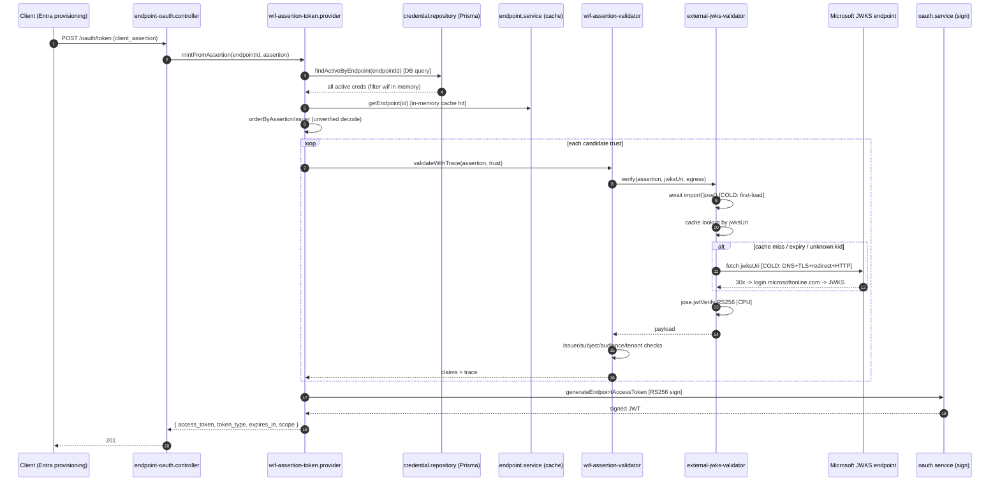
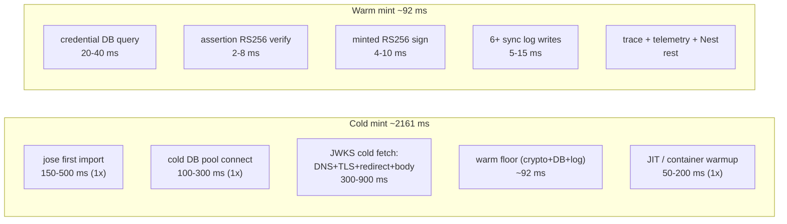
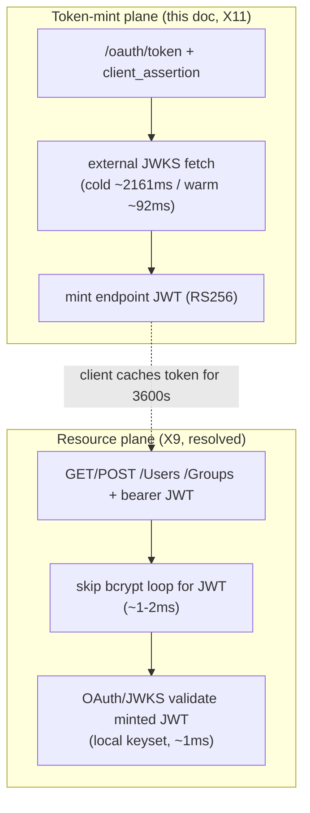

# WIF token-mint latency - deep analysis, options, and recommendations (X11)

Status: ANALYSIS (measured on dev `scimserver-dev` v0.54.58). Companion to the
X9 resource-plane RCA ([perf/DEV_LATENCY_REGRESSION_RCA.md](DEV_LATENCY_REGRESSION_RCA.md))
and the X10 auth-methods comparison ([auth/AUTH_METHODS_STANDARDS_COMPARISON.md](../auth/AUTH_METHODS_STANDARDS_COMPARISON.md)).
These options are sequenced for delivery in [auth/AUTH_CONSOLIDATED_DELIVERY_PLAN.md](../auth/AUTH_CONSOLIDATED_DELIVERY_PLAN.md) (X13, Wave 1).

> **Configuration companion (X15).** Every value this analysis proposes to tune is
> environment-dependent, so the settings surface, the clamp contract, and a
> recommended value per deployment form factor live in
> [RUNTIME_TUNING_AND_CONFIGURATION_REFERENCE.md](RUNTIME_TUNING_AND_CONFIGURATION_REFERENCE.md).
> That audit also found that the 10-minute `JWKS_CACHE_MAX_AGE_MS` default assumed
> by Option A below **contradicts Microsoft's own published guidance** for its
> signing keys (24 h TTL with a 1 h background refresh, per-`kid` caching, and a
> 5-minute rate limit on unknown-`kid` refetch), which changes the shape of the
> recommended fix - see X15 section 4.1.

## 0. TL;DR

A single WIF (Workload Identity Federation) token mint
(`POST /scim/endpoints/:id/oauth/token` with a `client_assertion`) was measured at
**2,161 ms**. The identical mint on a warm process is **92 ms** (measured, dev
logs). The ~2,069 ms gap is **one-time cold cost**, not per-request cost, and it
is dominated by two pre-warmable things:

1. The **cold external JWKS fetch** to Microsoft (DNS + TLS + a
   `login.windows.net` -> `login.microsoftonline.com` redirect hop + HTTP body),
   which happens on the hot path on a cache miss/expiry, and
2. The **first-ever dynamic `import('jose')`** (the crypto library is loaded
   lazily on the hot path, so the first mint after each container start pays the
   full ESM module load).

Neither of these is inherent to minting a token. Both can be moved off the hot
path. With the options in Section 8 the token mint is **tens of ms warm** and the
cold path is eliminated (the first mint after a restart becomes warm because
`jose`, the JWKS keys, and the DB pool are pre-warmed at boot, and a background
refresher keeps the JWKS cache warm so no request ever waits on a synchronous
fetch again).

This is a **different** plane from X9. X9 fixed the **resource** plane (the
bcrypt loop in the auth guard; now ~1-2 ms). This analysis is the **token-mint**
plane (the external JWKS fetch during `/oauth/token`).

## 1. Symptom (the measured request)

```text
POST /scim/endpoints/e8edd907-0dfb-415d-b834-abf0d20eb0e0/oauth/token   201   2161 ms
  correlationId : 105256c8-fabf-4448-9201-894434ccd9cf
  method        : wif
  plane         : token-mint
  outcome       : accept
  checkCount    : 5      (jwks_signature, issuer, subject, audience, tenant)
  selectedTrust : b8ec795d-49e7-4379-8167-3f7ca65be48c
  jwksUri       : https://login.windows.net/9751e42f-78f3-42f4-8b8a-6e73845aceae/discovery/v2.0/keys
  issuer        : https://login.microsoftonline.com/9751e42f-78f3-42f4-8b8a-6e73845aceae/v2.0
  alg / kid     : RS256 / aFkmKVFc-4WV6sXCBvNZkXI505Y
```

The mint succeeded; it was just slow. The endpoint `e8edd907` is the same
real-Entra-traffic endpoint from X9 - it carries 10 credentials (6 of them WIF)
and months of accumulated state.

## 2. Measured baseline (this is what grounds the whole analysis)

Every number below is measured, not estimated. Server-side numbers are the
`durationMs` the server stamps on its own log lines (they exclude client network
RTT). Client-observed numbers include the ~15-20 ms RTT from the measuring host to
Azure `eastus`.

| Measurement | Value | Source |
|---|---|---|
| WIF token mint - **cold** (the reported request) | **2,161 ms** | dev log, correlation `105256c8` (server-side) |
| WIF token mint - **warm** (same endpoint, JWKS cached) | **92 ms** | dev log, requestId `fdbe5348` (server-side) |
| Resource op after X9 fix (`GET /Groups`, bearer JWT) | **1-2 ms** | dev log, requestId `69a91986` (server-side) |
| Global `client_credentials` mint (RS256 sign, no WIF) | 29-42 ms (client), ~**10-15 ms** server-side | 6 samples vs dev |
| Authenticated GET `ServiceProviderConfig` | 20-32 ms (client), ~**5-10 ms** server-side | 5 samples vs dev |
| JWKS fetch to `login.windows.net/.../keys` | **194-227 ms** (warm HTTP, 4 samples) | direct fetch, measuring host |
| JWKS fetch to `login.microsoftonline.com/.../keys` | **59-94 ms** (warm HTTP, 4 samples) | direct fetch, measuring host |

Two facts jump out:

- The **warm** WIF mint is already ~92 ms server-side, versus ~10-15 ms for the
  global mint. WIF adds ~77 ms of warm-path work (credential DB query + assertion
  RS256 verify + minted-token RS256 sign + several synchronous log writes +
  decision trace). That is the "reduce warm to tens of ms" opportunity.
- The `login.windows.net` JWKS host is measurably ~130-160 ms **slower per fetch**
  than the canonical `login.microsoftonline.com` host, because it redirects. The
  trust stored the legacy host, so every cold fetch pays the redirect hop.

## 3. The exact code path (minutest granularity, with file:line)



### 3.1 Per-stage attribution table

Classification key: **DB** = database round-trip, **NET** = external network call,
**CPU** = cryptographic/compute, **CACHE** = in-memory lookup, **1x** = one-time
per process (not per request).

| # | Stage | File:line | Type | Cold | Warm | Pre-cacheable? |
|---|---|---|---|---|---|---|
| 1 | Form parse + WIF dispatch | [endpoint-oauth.controller.ts](../../api/src/modules/scim/controllers/endpoint-oauth.controller.ts) | CPU | <1 ms | <1 ms | n/a |
| 2 | `findActiveByEndpoint` (all active creds) | [prisma-endpoint-credential.repository.ts](../../api/src/infrastructure/repositories/prisma/prisma-endpoint-credential.repository.ts) | DB | 20-60 ms (cold pool: +100-300) | 20-40 ms | **YES** (per-endpoint cache) |
| 3 | Filter to `wif` creds (in memory) | [wif-assertion-token.provider.ts](../../api/src/modules/scim/controllers/wif-assertion-token.provider.ts) | CPU | <1 ms | <1 ms | n/a |
| 4 | `getEndpoint` (profile + egress overrides) | [endpoint.service.ts](../../api/src/modules/endpoint/services/endpoint.service.ts) | CACHE | <1 ms (warm from onModuleInit) | <1 ms | already cached |
| 5 | `orderByAssertionIssuer` (unverified decode) | [wif-assertion-token.provider.ts](../../api/src/modules/scim/controllers/wif-assertion-token.provider.ts) | CPU | <1 ms | <1 ms | n/a |
| 6 | `await import('jose')` | [external-jwks-validator.service.ts:93](../../api/src/oauth/external-jwks-validator.service.ts#L93) | CPU **1x** | **150-500 ms** | ~0 ms | **YES** (eager import at boot) |
| 7 | JWKS cache lookup by URI | [external-jwks-validator.service.ts:263](../../api/src/oauth/external-jwks-validator.service.ts#L263) | CACHE | <1 ms | <1 ms | n/a |
| 8 | JWKS fetch (DNS + TLS + redirect + body) | [external-jwks-validator.service.ts:211](../../api/src/oauth/external-jwks-validator.service.ts#L211) | NET | **300-900 ms** (redirect hop) | 0 ms (cache hit) | **YES** (background refresh + longer TTL) |
| 9 | `jose.jwtVerify` (assertion, RS256) | [external-jwks-validator.service.ts:125](../../api/src/oauth/external-jwks-validator.service.ts#L125) | CPU | 2-8 ms | 2-8 ms | inherent |
| 10 | Claim checks (iss/sub/aud/tid) | [wif-assertion-validator.service.ts](../../api/src/oauth/wif-assertion-validator.service.ts) | CPU | <1 ms | <1 ms | n/a |
| 11 | Mint + RS256 sign endpoint token | [oauth.service.ts:188](../../api/src/oauth/oauth.service.ts#L188) | CPU | 4-10 ms | 4-10 ms | inherent (key preloaded) |
| 12 | Shadow-auth telemetry + decision trace | [wif-assertion-token.provider.ts](../../api/src/modules/scim/controllers/wif-assertion-token.provider.ts) | CPU | 2-5 ms | 2-5 ms | partly (async) |
| 13 | Structured log writes (6+ lines) | [scim-logger.service.ts](../../api/src/modules/logging/scim-logger.service.ts) | CPU | 5-15 ms | 5-15 ms | **YES** (async/batch) |
| 14 | Response assemble + JSON serialize | [endpoint-oauth.controller.ts](../../api/src/modules/scim/controllers/endpoint-oauth.controller.ts) | CPU | <1 ms | <1 ms | n/a |
| | **Total** | | | **~2,161 ms** | **~92 ms** | |

### 3.2 Cold-vs-warm waterfall



The **warm floor** (~92 ms) is present in the cold number too; the cold-only
components (steps 6, 8, plus cold-pool/JIT) are the ~2,069 ms delta. Steps 6 and 8
are the two large, controllable, pre-warmable costs.

## 4. Root cause

The token-mint hot path performs **synchronous, on-demand external work that is
almost always cacheable** and **lazy-loads its crypto library on the request**:

1. **No background JWKS refresh (the dominant cause).** The JWKS cache
   ([external-jwks-validator.service.ts](../../api/src/oauth/external-jwks-validator.service.ts))
   is populated **lazily** - only the request that finds the cache empty or
   expired pays the fetch. The default `JWKS_CACHE_MAX_AGE_MS` is **10 minutes**
   ([egress-policy.ts](../../api/src/oauth/egress-policy.ts) `EGRESS_POLICY_DEFAULTS`).
   So even in steady state, roughly **once every 10 minutes** one unlucky request
   re-pays the full cold fetch. There is no refresh-ahead timer that re-fetches
   before expiry.

2. **`jose` is imported on the hot path (`await import('jose')`,
   [line 93](../../api/src/oauth/external-jwks-validator.service.ts#L93)).**
   Nothing imports `jose` at boot (verified: the only runtime import is the
   dynamic one). The first WIF mint after each container start / scale event
   therefore pays the entire ESM module load, which on a 0.5 vCPU container is
   material.

3. **The stored JWKS URL is the legacy `login.windows.net` host, which
   redirects.** The SSRF-safe fetcher follows redirects manually and re-validates
   each hop ([external-jwks-validator.service.ts:211](../../api/src/oauth/external-jwks-validator.service.ts#L211)),
   so a `login.windows.net -> login.microsoftonline.com` redirect is a second
   DNS + TLS + HTTP round-trip. Measured, that host is ~130-160 ms slower per
   fetch than the canonical host.

4. **The credential set is re-queried from the DB on every mint.**
   `findActiveByEndpoint` loads **all** active credentials for the endpoint and
   filters to `wif` in memory
   ([wif-assertion-token.provider.ts](../../api/src/modules/scim/controllers/wif-assertion-token.provider.ts));
   there is no per-endpoint credential cache. This is a ~20-40 ms warm-path DB tax
   on every mint.

5. **Several structured log lines are written synchronously per mint.** A single
   WIF mint emits 6+ INFO/DEBUG log lines (token generated, shadow decision, WIF
   accepted, auth decision, token issued, HTTP 201). Each is JSON-serialized and
   written on the hot path.

None of 1-5 is a correctness bug. Each is a latency tax that a cache or a boot-time
warm-up removes.

## 5. What can be pre-cached (the operator's explicit question)

| Item | Today | Cacheable? | How |
|---|---|---|---|
| **JWKS signing keys** (per issuer) | Lazy fetch, 10-min TTL, no background refresh | **YES - highest leverage** | Background refresh-ahead + longer TTL + honor `Cache-Control` + stale-while-revalidate |
| **`jose` crypto module** | `await import('jose')` on first mint | **YES** | Eager `import('jose')` in `onModuleInit`, warm a throwaway verify |
| **Per-endpoint trust config** (issuer/subject/audience/tenant/jwksUri) | Loaded from DB per mint (inside credentials) | **YES** | Cache the WIF trust set per endpoint; invalidate on credential change |
| **Active credential set** | `findActiveByEndpoint` DB query per mint | **YES** | Per-endpoint cache (short TTL + explicit invalidate) or `findActiveByEndpointAndType` indexed query |
| **DB connection pool** | Cold on first query after start | **YES** | Warm the pool in `onModuleInit` |
| **Minted-token signing key** | Preloaded at construction (RS256) | Already cached | n/a |
| **Assertion decode (`kid`, issuer)** | Cheap unverified base64 decode | Not worth caching | n/a - it is microseconds |
| **The redirect target** (`login.windows.net` -> `login.microsoftonline.com`) | Re-resolved on every cold fetch | **YES** | Store canonical `jwks_uri` (or cache the resolved URL) |

The unverified assertion decode and the RSA verify/sign are the only inherently
per-request costs, and they are small (single-digit ms). Everything expensive on
the cold path is external I/O or a one-time module load - i.e. cacheable.

## 6. How the industry optimizes this exact problem

The "validate an inbound JWT against a remote JWKS, then mint a local token"
pattern is universal (it is how every OIDC RP and every STS works). The
established best practices, all of which target exactly the cold-fetch problem:

- **Cache signing keys for hours, refresh in the background.** IdP signing keys
  rotate slowly (Microsoft Entra rotates roughly every 6 weeks and publishes an
  overlap window; Google rotates its OAuth certs roughly daily; Okta/Auth0 are
  configurable). The universal client pattern - Microsoft's own
  `Microsoft.IdentityModel` / MSAL, `google-auth-library`, `jwks-rsa` (Auth0),
  Spring Security's `NimbusReactiveJwtDecoder` - caches the JWKS and refreshes it
  on a **timer** and on an **unknown `kid`**, never synchronously on the first
  request after expiry. "Refresh-ahead" (re-fetch at ~50-80% of TTL) keeps the hot
  path a guaranteed cache hit.
- **Honor HTTP caching semantics from the JWKS response.** JWKS endpoints send
  `Cache-Control: max-age=...` (Microsoft and Google both do, typically hours). A
  well-behaved client uses that value instead of a fixed local TTL, so it refreshes
  exactly as often as the IdP intends and no more.
- **Reuse the TLS connection (keep-alive / connection pool).** A warm HTTP/1.1
  keep-alive or HTTP/2 connection to the IdP removes the TLS handshake from every
  subsequent fetch (the ~100-300 ms cold-TLS component).
- **Pre-warm on deploy / gate readiness on key availability.** Fetch the keys at
  startup so the first live request is warm; some systems fail readiness until the
  JWKS is loaded.
- **Circuit-breaker + serve-stale-on-error.** During an IdP outage, serve the last
  good keys (bounded) rather than failing or hanging. (This server already does
  fail-to-stale.)
- **The caller caches the minted token for its full lifetime.** The single biggest
  real-world mitigation: the client (Entra provisioning, in this case) is expected
  to cache the minted access token for its 3,600 s TTL and reuse it. So the mint
  cost is amortized over ~1 hour of resource calls - the 2,161 ms cold mint is paid
  at most ~once per hour per endpoint, not per SCIM operation. This is why the
  resource plane (X9, ~1-2 ms) matters more for aggregate throughput, and why the
  mint path is optimized for **tail** latency, not mean.

Mapping those back to this code:

| Industry practice | Present here? | Gap |
|---|---|---|
| kid-keyed cache + refetch on unknown kid | Yes ([verify()](../../api/src/oauth/external-jwks-validator.service.ts#L81)) | - |
| Single-flight coalescing | Yes ([fetchJwks](../../api/src/oauth/external-jwks-validator.service.ts#L178)) | - |
| Serve-stale-on-error | Yes ([fetchJwksWithRetry](../../api/src/oauth/external-jwks-validator.service.ts#L167)) | - |
| Bounded timeout + retry + jitter | Yes (5 s / 2 / 200 ms) | - |
| SSRF host allowlist + per-redirect re-validation | Yes | - |
| **Background refresh-ahead timer** | **No** | lazy-only; periodic cold every TTL |
| **Honor `Cache-Control` max-age** | **No** | fixed 10-min TTL |
| **HTTP keep-alive / connection reuse** | **Not explicit** | new connection per cold fetch |
| **Eager crypto-lib load at boot** | **No** | `jose` lazy-imported on hot path |
| **Startup JWKS pre-warm** | **No** | first mint after start is cold |
| Client-side minted-token caching | Client responsibility | (document for integrators) |

## 7. Use-case coverage (existing and upcoming)

The optimization must not be Entra-specific. Every supported and planned IdP/flow
reduces to the same shape: **fetch an external JWKS keyed by issuer, verify, mint**.
A per-issuer background-refreshed JWKS cache that honors `Cache-Control` covers all
of them uniformly.

| Use case / IdP | Flow | JWKS source | Notes for the cache design |
|---|---|---|---|
| **Microsoft Entra (1P)** - current | RFC 7523 `client_assertion` (WIF) | `login.microsoftonline.com/<tid>/discovery/v2.0/keys` (canonical) | Store canonical host, not `login.windows.net`; ~6-week rotation |
| **RFC 7523 variations** | `private_key_jwt` (asymmetric) and `client_secret_jwt` (symmetric) | per-issuer `jwks_uri` from OIDC discovery | Asymmetric = JWKS fetch (cache applies); symmetric HS256 uses a shared secret (no fetch) |
| **RFC 8693 token exchange** (upcoming) | `subject_token` + optional `actor_token` -> delegated/impersonated token | issuer `jwks_uri` of the presented token(s) | Same JWKS cache validates inbound tokens; mint path identical |
| **Google Cloud / Workspace** | STS / service-account assertion | `www.googleapis.com/oauth2/v3/certs`, `sts.googleapis.com` | Sends `Cache-Control` (hours); rotates ~daily - honoring max-age is important |
| **SAP SuccessFactors / BTP / IAS** | OIDC assertion | IAS tenant `jwks_uri` from discovery | Standard OIDC; per-issuer cache |
| **Zoom** | OAuth / OIDC | Zoom `jwks_uri` | Standard OIDC; per-issuer cache |
| **AWS (Cognito / STS web-identity)** | OIDC federation (`AssumeRoleWithWebIdentity`) | `cognito-idp.<region>.amazonaws.com/<pool>/.well-known/jwks.json` | JWKS for the OIDC leg; SigV4 request signing is a separate scheme (not JWKS) |
| **Okta / Auth0 / Ping** | OIDC assertion | tenant `jwks_uri` | Configurable rotation; per-issuer cache |

Design implication: cache and background-refresh **by `jwksUri` (issuer)**, not by
endpoint, so N endpoints trusting the same tenant share one warm key set, and a new
IdP is covered automatically the first time a trust for it is registered
(pre-warm can enumerate all registered trust `jwksUri` values at boot and on trust
create).

## 8. Options to reach tens of ms (ranked by leverage)

Each option is independent and additive. Effort is a rough T-shirt size.

| # | Option | Removes | Effort | Expected effect |
|---|---|---|---|---|
| **A** | **Background JWKS refresh-ahead + longer TTL + honor `Cache-Control`** | Periodic cold fetch (step 8) | M | Steady-state hot path is always a cache hit; eliminates the every-10-min cold |
| **B** | **Eager `import('jose')` at `onModuleInit` (+ warm a throwaway verify)** | First-mint module load (step 6) | S | First mint after start no longer pays 150-500 ms |
| **C** | **Startup pre-warm: fetch every registered trust `jwksUri` + warm DB pool** | Cold fetch + cold pool on the first mint (steps 2, 8) | M | First mint after deploy is warm (tens of ms) |
| **D** | **Store canonical `jwks_uri` (drop the `login.windows.net` redirect)** | The redirect hop within step 8 | S | ~130-160 ms off every cold fetch |
| **E** | **Per-endpoint credential/trust cache (short TTL + invalidate on change)** | Per-mint DB query (step 2) | M | ~20-40 ms off the warm path |
| **F** | **`findActiveByEndpointAndType('wif')` + `(endpointId, credentialType, active)` index** | Loading all creds + in-memory filter | S | Bounds the DB query regardless of credential count |
| **G** | **Move per-mint logging + decision-trace off the hot path (async/batch)** | Sync log writes (steps 12-13) | M | ~5-15 ms off the warm path |
| **H** | **Total request deadline + cancellation on the mint** | Unbounded worst-case cold (retry x redirect x timeout ~ up to 10-60 s) | S | Caps tail; with A/C the deadline is never approached |
| **I** | **(Optional) ES256 for the minted token** | RSA sign cost (step 11) | S | A few ms; compatibility change - low priority |

### 8.1 Recommended package (measured-data-driven)

To hit the operator's "tens of ms" target for both cold and warm:

1. **B + C + D** eliminate the cold path: `jose`, the JWKS keys (canonical host),
   and the DB pool are all warm before the first live mint. Expected first-mint
   latency after a restart: **tens of ms** instead of ~2,161 ms.
2. **A** removes the recurring 10-minute periodic cold in steady state (the hot
   path is a guaranteed cache hit; refresh happens on a background timer).
3. **E + G** take the warm path from ~92 ms toward **~30-40 ms** by removing the
   per-mint DB query and the synchronous log writes.
4. **F + H** are cheap robustness that bound the DB query and the worst-case tail.

Target end-state, measured the same way as Section 2:

| Path | Today | After B+C+D | + A | + E+G |
|---|---|---|---|---|
| Cold (first mint after start) | ~2,161 ms | ~30-60 ms | ~30-60 ms | ~30-40 ms |
| Steady-state periodic (TTL expiry) | ~300-900 ms | ~300-900 ms | **~30-40 ms** | ~30-40 ms |
| Warm | ~92 ms | ~92 ms | ~92 ms | **~30-40 ms** |

### 8.2 Sketch: background refresh-ahead (Option A)

Schematic shape only (not literal, illustrative of the timer + refresh-ahead
contract):

```jsonc
// Schematic shape - illustrative pseudocode contract, not literal source
{
  "onModuleInit": [
    "eager import('jose') + warm one verify",           // Option B
    "for each registered trust jwksUri: prefetch()",     // Option C
    "start refresh timer"                                 // Option A
  ],
  "refreshTimerEveryTtlFraction": 0.6,                    // re-fetch at 60% of max-age
  "perUri": {
    "maxAge": "min(JWKS_CACHE_MAX_AGE_MS, response Cache-Control max-age)",
    "onRefresh": "fetch in background; swap cache atomically; keep old on failure",
    "onUnknownKid": "immediate single-flight refetch (already implemented)",
    "onFetchError": "serve stale (already implemented) + retry on next tick"
  },
  "hotPath": "cache lookup only - never a synchronous fetch in steady state"
}
```

## 9. Suggested gate (so a regression is caught, per X9 precedent)

Mirror the X9 `9z-BQ` live-test gate with a **token-mint** variant:

- Seed an endpoint with a WIF trust, warm it once, then time N mints and assert the
  **warm median is under a ceiling** (e.g. 150 ms) and, after the pre-warm options
  land, a **cold-first mint under a ceiling** (e.g. 300 ms). Runs against local,
  Docker, and Azure dev in the standard matrix
  ([scripts/live-test.ps1](../../scripts/live-test.ps1)).
- Keep the existing runtime signal: the server already stamps `durationMs` and
  emits a slow-request `WARN`; a p95 sweep of `GET /scim/admin/logs` filtered to
  `plane=token-mint` surfaces a climbing mint tail on a deployed instance.

## 10. Relationship to the other planes



The minted token is verified on the resource plane against the server's **own**
published keyset (local, in-memory - ~1 ms), which is why X9 resource ops are now
~1-2 ms. The external JWKS fetch is unique to the **mint** plane and is what this
analysis targets.

## 11. References

- X9 resource-plane RCA: [perf/DEV_LATENCY_REGRESSION_RCA.md](DEV_LATENCY_REGRESSION_RCA.md)
- X10 auth-methods comparison: [auth/AUTH_METHODS_STANDARDS_COMPARISON.md](../auth/AUTH_METHODS_STANDARDS_COMPARISON.md)
- JWKS validator: [external-jwks-validator.service.ts](../../api/src/oauth/external-jwks-validator.service.ts)
- Egress policy defaults: [egress-policy.ts](../../api/src/oauth/egress-policy.ts)
- WIF assertion validator: [wif-assertion-validator.service.ts](../../api/src/oauth/wif-assertion-validator.service.ts)
- WIF token provider: [wif-assertion-token.provider.ts](../../api/src/modules/scim/controllers/wif-assertion-token.provider.ts)
- Minted-token signing key: [oauth-signing-key.service.ts](../../api/src/oauth/oauth-signing-key.service.ts)
- RFC 7523 (JWT client assertion), RFC 8693 (token exchange), RFC 7517 (JWKS),
  RFC 7519 (JWT), OWASP JWT / Password Storage cheat sheets.

## 12. Change log

| Version | Change |
|---|---|
| 0.54.59 | This analysis doc (X11): measured cold ~2,161 ms vs warm ~92 ms WIF token mint; root cause = lazy JWKS fetch (no background refresh) + hot-path `jose` import + `login.windows.net` redirect; pre-caching inventory; industry best practices; use-case coverage (RFC 7523/8693, Entra/Google/SAP/Zoom/AWS/Okta); ranked options to reach tens of ms; suggested token-mint latency gate. Analysis only - no code change in this commit. |
