# Phase 1 — Repository Pattern (Ports & Adapters)

> **Status**: ✅ COMPLETED  
> **Difficulty**: 🟢 Low  
> **Risk**: 🟢 Low — additive changes only, no data migration  
> **LOC Impact**: ~600 lines added, ~80 lines changed in services  
> **Test Coverage**: 80 new unit tests (32 user, 38 group, 10 module)

---

## Table of Contents

1. [Overview](#1-overview)
2. [Goals & Motivation](#2-goals--motivation)
3. [Architecture — Before](#3-architecture--before)
4. [Architecture — After](#4-architecture--after)
5. [Dependency Graph](#5-dependency-graph)
6. [File Inventory](#6-file-inventory)
7. [Domain Models](#7-domain-models)
8. [Repository Interfaces](#8-repository-interfaces)
9. [Implementation: Prisma Adapter](#9-implementation-prisma-adapter)
10. [Implementation: In-Memory Adapter](#10-implementation-in-memory-adapter)
11. [Dynamic Module Wiring](#11-dynamic-module-wiring)
12. [Service Refactoring — Before vs After](#12-service-refactoring--before-vs-after)
13. [Request Flow — Before vs After](#13-request-flow--before-vs-after)
14. [Configuration](#14-configuration)
15. [Testing Strategy](#15-testing-strategy)
16. [Deployment Impact](#16-deployment-impact)
17. [Rollback Plan](#17-rollback-plan)
18. [Lessons Learned](#18-lessons-learned)

---

## 1. Overview

Phase 1 introduces the **Repository Pattern** (also known as Ports & Adapters or Hexagonal Architecture) to decouple SCIM business logic from Prisma ORM internals. Services no longer import `PrismaService` directly — instead, they depend on **domain interfaces** injected via NestJS DI tokens.

This is the foundational phase that enables all subsequent phases (PostgreSQL migration, in-memory testing, unified resource table) to proceed without touching business logic.

---

## 2. Goals & Motivation

| Goal | Rationale |
|------|-----------|
| **Decouple persistence** | Services should not know if data comes from SQLite, PostgreSQL, or memory |
| **Enable testability** | In-memory repositories allow fast unit tests without DB setup |
| **Prepare for Phase 3** | PostgreSQL migration only changes repository implementations, not services |
| **Follow SOLID principles** | Dependency Inversion — depend on abstractions, not concretions |
| **Enable PERSISTENCE_BACKEND toggle** | Switch between Prisma and InMemory via environment variable |

---

## 3. Architecture — Before

### Before: Direct Prisma Coupling


**Problems with this approach:**

```typescript
// ❌ BEFORE: Service directly coupled to PrismaService
@Injectable()
export class EndpointScimUsersService {
  constructor(
    private readonly prisma: PrismaService,  // ← Direct Prisma dependency
    private readonly metadata: ScimMetadataService,
    private readonly logger: ScimLogger,
  ) {}

  async createUserForEndpoint(endpointId: string, body: any, baseUrl: string) {
    // Prisma-specific query syntax embedded in business logic
    const existing = await this.prisma.scimUser.findFirst({
      where: {
        endpointId,
        OR: [
          { userNameLower: body.userName?.toLowerCase() },
          { externalId: body.externalId },
        ],
      },
      select: { scimId: true, userName: true, externalId: true },
    });
    
    // Business logic mixed with Prisma types
    const created = await this.prisma.scimUser.create({
      data: {
        scimId: uuid(),
        userName: body.userName,
        userNameLower: body.userName.toLowerCase(),
        // ... more Prisma-specific data shape
        endpoint: { connect: { id: endpointId } },
      },
    });
  }
}
```

**Key issues:**
- `PrismaService` imported in every service
- Prisma query syntax (`findFirst`, `create`, relation `connect`) leaks into business logic
- Prisma-generated types (`Prisma.ScimUserWhereInput`) used throughout services
- Cannot test service without database connection
- Changing DB engine requires rewriting all service code

---

## 4. Architecture — After

### After: Repository Pattern (Ports & Adapters)


**Benefits:**
- Services depend only on **domain interfaces** — zero Prisma imports
- Repository implementations contain all ORM-specific logic
- Swap backends via `PERSISTENCE_BACKEND` env var without code changes
- In-memory adapter enables instant unit tests

---

## 5. Dependency Graph

### Layer Dependency Rules


> **Rule**: Dependencies point inward. Services never import from `infrastructure/`. The DI container (NestJS module system) wires implementations to interfaces at startup.

---

## 6. File Inventory

### New Files Created (10 files)

```
api/src/
├── domain/
│   ├── models/
│   │   ├── user.model.ts              ← UserRecord, UserCreateInput, UserUpdateInput, UserConflictResult
│   │   └── group.model.ts             ← GroupRecord, MemberRecord, GroupWithMembers, GroupCreateInput, ...
│   └── repositories/
│       ├── user.repository.interface.ts   ← IUserRepository (7 methods)
│       ├── group.repository.interface.ts  ← IGroupRepository (9 methods)
│       └── repository.tokens.ts           ← USER_REPOSITORY, GROUP_REPOSITORY tokens
└── infrastructure/
    └── repositories/
        ├── repository.module.ts               ← RepositoryModule.register() — dynamic DI wiring
        ├── prisma/
        │   ├── prisma-user.repository.ts      ← PrismaUserRepository implements IUserRepository
        │   └── prisma-group.repository.ts     ← PrismaGroupRepository implements IGroupRepository
        └── inmemory/
            ├── inmemory-user.repository.ts     ← InMemoryUserRepository implements IUserRepository
            └── inmemory-group.repository.ts    ← InMemoryGroupRepository implements IGroupRepository
```

### Modified Files (3 files)

| File | Change |
|------|--------|
| `endpoint-scim-users.service.ts` | Replaced `PrismaService` with `@Inject(USER_REPOSITORY) userRepo: IUserRepository` |
| `endpoint-scim-groups.service.ts` | Replaced `PrismaService` with `@Inject(GROUP_REPOSITORY)` + `@Inject(USER_REPOSITORY)` |
| `scim.module.ts` (or parent module) | Added `RepositoryModule.register()` import |

### Test Files Created (3 files, 80 tests)

| File | Tests | Coverage |
|------|-------|----------|
| `inmemory-user.repository.spec.ts` | 32 | create, findByScimId, findAll (filtering/sorting/isolation), update, delete, findConflict (case-insensitive), findByScimIds, clear |
| `inmemory-group.repository.spec.ts` | 38 | create, findByScimId, findWithMembers, findAllWithMembers (sorting/filtering/members), update, delete (cascade), findByDisplayName, findByExternalId, addMembers, updateGroupWithMembers, clear |
| `repository.module.spec.ts` | 10 | inmemory backend, case-insensitive env, prisma backend, default-to-prisma, DynamicModule shape |

---

## 7. Domain Models

### UserRecord — Domain Model

```typescript
// api/src/domain/models/user.model.ts
export interface UserRecord {
  id: string;            // Internal storage ID (UUID)
  endpointId: string;    // Tenant/endpoint isolation key
  scimId: string;        // SCIM-visible ID (returned to clients)
  externalId: string | null;
  userName: string;
  userNameLower: string;  // Lowercase for case-insensitive matching
  active: boolean;
  rawPayload: string;    // Full SCIM JSON stored as string
  meta: string | null;   // SCIM meta object (JSON string)
  createdAt: Date;
  updatedAt: Date;
}
```

### GroupRecord with Members — Domain Model

```typescript
// api/src/domain/models/group.model.ts
export interface GroupRecord {
  id: string;
  endpointId: string;
  scimId: string;
  externalId: string | null;
  displayName: string;
  displayNameLower: string;
  rawPayload: string;
  meta: string | null;
  createdAt: Date;
  updatedAt: Date;
}

export interface MemberRecord {
  id: string;
  groupId: string;
  userId: string | null;
  value: string;          // SCIM member value (usually user's scimId)
  type: string | null;    // "User", "Group", etc.
  display: string | null; // Display name for the member
  createdAt: Date;
}

export interface GroupWithMembers extends GroupRecord {
  members: MemberRecord[];
}
```

### Type Relationship Diagram


---

## 8. Repository Interfaces

### IUserRepository — 7 Methods

```typescript
// api/src/domain/repositories/user.repository.interface.ts
export interface IUserRepository {
  create(input: UserCreateInput): Promise<UserRecord>;
  findByScimId(endpointId: string, scimId: string): Promise<UserRecord | null>;
  findAll(
    endpointId: string,
    dbFilter?: Record<string, unknown>,
    orderBy?: { field: string; direction: 'asc' | 'desc' },
  ): Promise<UserRecord[]>;
  update(id: string, data: UserUpdateInput): Promise<UserRecord>;
  delete(id: string): Promise<void>;
  findConflict(
    endpointId: string,
    userName: string,
    externalId?: string,
    excludeScimId?: string,
  ): Promise<UserConflictResult | null>;
  findByScimIds(
    endpointId: string,
    scimIds: string[],
  ): Promise<Array<Pick<UserRecord, 'id' | 'scimId'>>>;
}
```

### IGroupRepository — 9 Methods

```typescript
// api/src/domain/repositories/group.repository.interface.ts
export interface IGroupRepository {
  create(input: GroupCreateInput): Promise<GroupRecord>;
  findByScimId(endpointId: string, scimId: string): Promise<GroupRecord | null>;
  findWithMembers(endpointId: string, scimId: string): Promise<GroupWithMembers | null>;
  findAllWithMembers(
    endpointId: string,
    dbFilter?: Record<string, unknown>,
    orderBy?: { field: string; direction: 'asc' | 'desc' },
  ): Promise<GroupWithMembers[]>;
  update(id: string, data: GroupUpdateInput): Promise<GroupRecord>;
  delete(id: string): Promise<void>;
  findByDisplayName(
    endpointId: string,
    displayNameLower: string,
    excludeScimId?: string,
  ): Promise<{ scimId: string } | null>;
  findByExternalId(
    endpointId: string,
    externalId: string,
    excludeScimId?: string,
  ): Promise<GroupRecord | null>;
  addMembers(groupId: string, members: MemberCreateInput[]): Promise<void>;
  updateGroupWithMembers(
    groupId: string,
    data: GroupUpdateInput,
    members: MemberCreateInput[],
  ): Promise<void>;
}
```

### Method Purpose Matrix

| Method | User Repo | Group Repo | SCIM Operation |
|--------|:---------:|:----------:|----------------|
| `create` | ✅ | ✅ | POST /Users, POST /Groups |
| `findByScimId` | ✅ | ✅ | GET /Users/:id, GET /Groups/:id |
| `findAll` / `findAllWithMembers` | ✅ | ✅ | GET /Users?filter=..., GET /Groups?filter=... |
| `update` | ✅ | ✅ | PUT /Users/:id, PUT /Groups/:id, PATCH |
| `delete` | ✅ | ✅ | DELETE /Users/:id, DELETE /Groups/:id |
| `findConflict` | ✅ | — | Uniqueness check (userName, externalId) |
| `findByScimIds` | ✅ | — | Group member resolution (batch) |
| `findWithMembers` | — | ✅ | GET /Groups/:id (with member list) |
| `findByDisplayName` | — | ✅ | Group displayName uniqueness |
| `findByExternalId` | — | ✅ | Group externalId uniqueness |
| `addMembers` | — | ✅ | PATCH /Groups/:id (Add members) |
| `updateGroupWithMembers` | — | ✅ | PUT /Groups/:id (replace members) |

---

## 9. Implementation: Prisma Adapter

### PrismaUserRepository (key method example)

```typescript
// api/src/infrastructure/repositories/prisma/prisma-user.repository.ts
@Injectable()
export class PrismaUserRepository implements IUserRepository {
  constructor(private readonly prisma: PrismaService) {}

  async create(input: UserCreateInput): Promise<UserRecord> {
    const created = await this.prisma.scimUser.create({
      data: {
        scimId: input.scimId,
        externalId: input.externalId,
        userName: input.userName,
        userNameLower: input.userNameLower,
        active: input.active,
        rawPayload: input.rawPayload,
        meta: input.meta,
        endpoint: { connect: { id: input.endpointId } },
      },
    });
    return created as UserRecord;
  }

  async findConflict(
    endpointId: string,
    userName: string,
    externalId?: string,
    excludeScimId?: string,
  ): Promise<UserConflictResult | null> {
    // All Prisma-specific query building lives HERE, not in services
    const orConditions: Prisma.ScimUserWhereInput[] = [
      { userNameLower: userName.toLowerCase() },
    ];
    if (externalId) orConditions.push({ externalId });

    const filters: Prisma.ScimUserWhereInput[] = [{ endpointId }];
    if (excludeScimId) filters.push({ NOT: { scimId: excludeScimId } });
    filters.push(orConditions.length === 1 ? orConditions[0] : { OR: orConditions });

    const conflict = await this.prisma.scimUser.findFirst({
      where: { AND: filters },
      select: { scimId: true, userName: true, externalId: true },
    });
    return conflict ?? null;
  }
}
```

### PrismaGroupRepository — Transactional Member Update

```typescript
// api/src/infrastructure/repositories/prisma/prisma-group.repository.ts
async updateGroupWithMembers(
  groupId: string,
  data: GroupUpdateInput,
  members: MemberCreateInput[],
): Promise<void> {
  // Prisma $transaction ensures atomicity — contained in infrastructure layer
  await this.prisma.$transaction(
    async (tx: Prisma.TransactionClient) => {
      await tx.scimGroup.update({
        where: { id: groupId },
        data: data as Prisma.ScimGroupUpdateInput,
      });
      await tx.groupMember.deleteMany({ where: { groupId } });
      if (members.length > 0) {
        await tx.groupMember.createMany({
          data: members.map((m) => ({
            groupId,
            userId: m.userId,
            value: m.value,
            type: m.type,
            display: m.display,
            createdAt: new Date(),
          })),
        });
      }
    },
    { maxWait: 10000, timeout: 30000 },
  );
}
```

---

## 10. Implementation: In-Memory Adapter

### InMemoryUserRepository — Map-Based Storage

```typescript
// api/src/infrastructure/repositories/inmemory/inmemory-user.repository.ts
@Injectable()
export class InMemoryUserRepository implements IUserRepository {
  private readonly users: Map<string, UserRecord> = new Map();

  async create(input: UserCreateInput): Promise<UserRecord> {
    const now = new Date();
    const record: UserRecord = {
      id: randomUUID(),        // ← Simulates auto-generated PK
      endpointId: input.endpointId,
      scimId: input.scimId,
      // ... all fields mapped
      createdAt: now,
      updatedAt: now,
    };
    this.users.set(record.id, record);
    return { ...record };       // ← Returns detached copy (mimics DB behavior)
  }

  async findAll(
    endpointId: string,
    dbFilter?: Record<string, unknown>,
    orderBy?: { field: string; direction: 'asc' | 'desc' },
  ): Promise<UserRecord[]> {
    let results = Array.from(this.users.values())
      .filter((u) => u.endpointId === endpointId);  // ← Tenant isolation

    if (dbFilter) {
      for (const [key, value] of Object.entries(dbFilter)) {
        results = results.filter(
          (u) => (u as Record<string, unknown>)[key] === value,
        );
      }
    }

    // Sorting — mimics SQL ORDER BY
    const sortField = orderBy?.field ?? 'createdAt';
    const sortDir = orderBy?.direction ?? 'asc';
    results.sort((a, b) => { /* string comparison */ });

    return results.map((u) => ({ ...u }));  // ← Detached copies
  }

  clear(): void { this.users.clear(); }  // ← Test teardown helper
}
```

### Key In-Memory Design Decisions

| Decision | Rationale |
|----------|-----------|
| Return `{ ...record }` (spread copy) | Prevents callers from mutating internal state — mimics DB isolation |
| `Map<string, Record>` as storage | O(1) lookup by internal ID, O(n) scan for filters (acceptable for testing) |
| `randomUUID()` for IDs | Matches real UUID behavior without DB sequences |
| `clear()` method | Not on interface — only available for test teardowns |
| Case-insensitive userName matching | `userName.toLowerCase()` comparison in `findConflict` |

---

## 11. Dynamic Module Wiring

### RepositoryModule — The Switchboard

```typescript
// api/src/infrastructure/repositories/repository.module.ts
@Module({})
export class RepositoryModule {
  static register(): DynamicModule {
    const backend = (process.env.PERSISTENCE_BACKEND ?? 'prisma').toLowerCase();

    if (backend === 'inmemory') {
      return {
        module: RepositoryModule,
        global: true,            // ← Available to all modules without re-importing
        providers: [
          { provide: USER_REPOSITORY, useClass: InMemoryUserRepository },
          { provide: GROUP_REPOSITORY, useClass: InMemoryGroupRepository },
        ],
        exports: [USER_REPOSITORY, GROUP_REPOSITORY],
      };
    }

    // Default: Prisma (supports SQLite now, PostgreSQL after Phase 3)
    return {
      module: RepositoryModule,
      global: true,
      imports: [PrismaModule],   // ← Only imported when Prisma is selected
      providers: [
        { provide: USER_REPOSITORY, useClass: PrismaUserRepository },
        { provide: GROUP_REPOSITORY, useClass: PrismaGroupRepository },
      ],
      exports: [USER_REPOSITORY, GROUP_REPOSITORY],
    };
  }
}
```

### Injection Token Flow


### DI Token Definitions

```typescript
// api/src/domain/repositories/repository.tokens.ts
export const USER_REPOSITORY = 'USER_REPOSITORY';
export const GROUP_REPOSITORY = 'GROUP_REPOSITORY';
```

---

## 12. Service Refactoring — Before vs After

### Users Service — Constructor

```diff
  // endpoint-scim-users.service.ts
  
  // ❌ BEFORE
- import { PrismaService } from '../../../modules/prisma/prisma.service';
  
  constructor(
-   private readonly prisma: PrismaService,
    private readonly metadata: ScimMetadataService,
    private readonly logger: ScimLogger,
  ) {}

  // ✅ AFTER
+ import { Inject } from '@nestjs/common';
+ import type { IUserRepository } from '../../../domain/repositories/user.repository.interface';
+ import { USER_REPOSITORY } from '../../../domain/repositories/repository.tokens';
  
  constructor(
+   @Inject(USER_REPOSITORY)
+   private readonly userRepo: IUserRepository,
    private readonly metadata: ScimMetadataService,
    private readonly logger: ScimLogger,
  ) {}
```

### Users Service — Query Example

```diff
  // Finding a user by SCIM ID

  // ❌ BEFORE — Prisma-specific query syntax
- const user = await this.prisma.scimUser.findFirst({
-   where: { scimId, endpointId },
- });

  // ✅ AFTER — Clean domain interface call
+ const user = await this.userRepo.findByScimId(endpointId, scimId);
```

### Groups Service — Constructor (Two Repositories)

```diff
  // endpoint-scim-groups.service.ts

  // ❌ BEFORE
- import { PrismaService } from '../../../modules/prisma/prisma.service';
  
  constructor(
-   private readonly prisma: PrismaService,
    private readonly metadata: ScimMetadataService,
    private readonly endpointContext: EndpointContextStorage,
    private readonly logger: ScimLogger,
  ) {}

  // ✅ AFTER — Injects BOTH repositories (needs users for member resolution)
+ import { Inject } from '@nestjs/common';
+ import type { IGroupRepository } from '../../../domain/repositories/group.repository.interface';
+ import type { IUserRepository } from '../../../domain/repositories/user.repository.interface';
+ import { GROUP_REPOSITORY, USER_REPOSITORY } from '../../../domain/repositories/repository.tokens';
  
  constructor(
+   @Inject(GROUP_REPOSITORY)
+   private readonly groupRepo: IGroupRepository,
+   @Inject(USER_REPOSITORY)
+   private readonly userRepo: IUserRepository,
    private readonly metadata: ScimMetadataService,
    private readonly endpointContext: EndpointContextStorage,
    private readonly logger: ScimLogger,
  ) {}
```

### Groups Service — Member Resolution Example

```diff
  // Resolving member SCIM IDs to internal IDs for group creation

  // ❌ BEFORE — Direct Prisma query with relations
- const members = await this.prisma.scimUser.findMany({
-   where: { scimId: { in: memberScimIds }, endpointId },
-   select: { id: true, scimId: true },
- });

  // ✅ AFTER — Repository method encapsulates query
+ const members = await this.userRepo.findByScimIds(endpointId, memberScimIds);
```

---

## 13. Request Flow — Before vs After

### Create User — Before (Direct Prisma)

```mermaid
sequenceDiagram
    participant IDP as Identity Provider
    participant CTRL as UsersController
    participant SVC as UsersService
    participant PRISMA as PrismaService
    participant DB as SQLite

    IDP->>CTRL: POST /Users { userName: "alice" }
    CTRL->>SVC: createUserForEndpoint(endpointId, body, baseUrl)
    
    Note over SVC,PRISMA: ❌ Service knows Prisma query syntax
    SVC->>PRISMA: prisma.scimUser.findFirst({<br/>  where: { endpointId, OR: [<br/>    { userNameLower: 'alice' },<br/>  ]}<br/>})
    PRISMA->>DB: SELECT * FROM ScimUser WHERE ...
    DB-->>PRISMA: null (no conflict)
    
    SVC->>PRISMA: prisma.scimUser.create({<br/>  data: { scimId, userName, ...,<br/>    endpoint: { connect: { id } }<br/>  }<br/>})
    PRISMA->>DB: INSERT INTO ScimUser ...
    DB-->>PRISMA: new row
    
    PRISMA-->>SVC: Prisma ScimUser object
    SVC-->>CTRL: SCIM JSON response
    CTRL-->>IDP: 201 Created
```



### Create User — After (Repository Pattern)

```mermaid
sequenceDiagram
    participant IDP as Identity Provider
    participant CTRL as UsersController
    participant SVC as UsersService
    participant REPO as IUserRepository
    participant IMPL as PrismaUserRepository
    participant DB as SQLite

    IDP->>CTRL: POST /Users { userName: "alice" }
    CTRL->>SVC: createUserForEndpoint(endpointId, body, baseUrl)
    
    Note over SVC,REPO: ✅ Service uses clean interface
    SVC->>REPO: userRepo.findConflict(endpointId, "alice")
    REPO->>IMPL: findConflict(endpointId, "alice")
    IMPL->>DB: SELECT scimId, userName FROM ScimUser WHERE ...
    DB-->>IMPL: null (no conflict)
    IMPL-->>REPO: null
    REPO-->>SVC: null ✅ No conflict
    
    SVC->>REPO: userRepo.create({ endpointId, scimId, userName, ... })
    REPO->>IMPL: create(input)
    IMPL->>DB: INSERT INTO ScimUser ...
    DB-->>IMPL: new row
    IMPL-->>REPO: UserRecord
    REPO-->>SVC: UserRecord
    
    SVC-->>CTRL: SCIM JSON response
    CTRL-->>IDP: 201 Created
```



### Key Difference

| Aspect | Before | After |
|--------|--------|-------|
| Service import | `PrismaService` | `IUserRepository` (interface) |
| Query syntax in service | `prisma.scimUser.findFirst({ where: ... })` | `userRepo.findConflict(endpointId, userName)` |
| ORM types in service | `Prisma.ScimUserWhereInput` | Domain types only |
| Testability | Requires DB connection | Mock `IUserRepository` or use `InMemoryUserRepository` |
| DB engine change | Rewrite service logic | Swap repository implementation |

---

## 14. Configuration

### Environment Variables

| Variable | Values | Default | Description |
|----------|--------|---------|-------------|
| `PERSISTENCE_BACKEND` | `prisma`, `inmemory` | `prisma` | Selects repository implementation |

### Example: Running with In-Memory Backend

```bash
# Windows PowerShell
$env:PERSISTENCE_BACKEND = "inmemory"
npm run start:dev

# Linux/macOS
PERSISTENCE_BACKEND=inmemory npm run start:dev

# Docker
docker run -e PERSISTENCE_BACKEND=inmemory scimserver:latest
```

### Example: Default Prisma Backend (no change needed)

```bash
# Prisma is the default — no env var needed
npm run start:dev

# Or explicitly set
PERSISTENCE_BACKEND=prisma npm run start:dev
```

---

## 15. Testing Strategy

### Test Pyramid for Phase 1


### Test Categories

| Category | Count | Purpose | Speed |
|----------|-------|---------|-------|
| InMemoryUserRepository unit tests | 32 | Verify in-memory adapter correctness | <1s |
| InMemoryGroupRepository unit tests | 38 | Verify group + member handling | <1s |
| RepositoryModule unit tests | 10 | Verify DI wiring & env switching | <1s |
| E2E tests (existing) | 184 | HTTP-level SCIM compliance | ~30s |
| Live integration tests (existing) | 280 | Full-stack against running server | ~60s |

### Sample Test — Conflict Detection

```typescript
// inmemory-user.repository.spec.ts
describe('findConflict', () => {
  it('should detect case-insensitive userName conflicts', async () => {
    await repo.create({
      endpointId: 'ep1',
      scimId: 'user1',
      userName: 'Alice',
      userNameLower: 'alice',
      // ...
    });

    // "ALICE" should conflict with "Alice" (case-insensitive)
    const conflict = await repo.findConflict('ep1', 'ALICE');
    expect(conflict).not.toBeNull();
    expect(conflict!.userName).toBe('Alice');
  });

  it('should exclude specified scimId from conflict check', async () => {
    await repo.create({
      endpointId: 'ep1',
      scimId: 'user1',
      userName: 'Alice',
      userNameLower: 'alice',
      // ...
    });

    // Excluding user1 from conflict check — no conflict
    const conflict = await repo.findConflict('ep1', 'ALICE', undefined, 'user1');
    expect(conflict).toBeNull();
  });
});
```

### Running Tests

```bash
# All unit tests (includes new repository tests)
cd api && npm test

# Only repository tests
cd api && npx jest --testPathPatterns "repositories"

# E2E tests
cd api && npm run test:e2e

# Live tests (requires running server)
cd api && npm run build && node dist/main.js &
pwsh scripts/live-test.ps1 -BaseUrl http://localhost:6000
```

---

## 16. Deployment Impact

| Deployment Mode | Impact | Changes Required |
|-----------------|--------|------------------|
| **Local Dev** | None | No config changes needed |
| **Docker Debug** | None | No Dockerfile/compose changes |
| **Docker Production** | None | No Dockerfile changes |
| **Azure Container Apps** | None | No Bicep/infra changes |

Phase 1 is **purely additive** — new files, modified service constructors, same database schema, same API behavior. Zero deployment artifacts change.

---

## 17. Rollback Plan

| Step | Action | Risk |
|------|--------|------|
| 1 | Revert service files to use `PrismaService` directly | Zero data risk |
| 2 | Remove `RepositoryModule.register()` from module imports | No schema change |
| 3 | Delete `domain/` and `infrastructure/repositories/` directories | No data impact |

**Rollback time**: ~5 minutes (git revert)  
**Data risk**: None — schema unchanged, data unchanged

---

## 18. Lessons Learned

| Lesson | Detail |
|--------|--------|
| **Start with interfaces** | Defining `IUserRepository` and `IGroupRepository` first made implementations straightforward |
| **Domain models mirror Prisma types** | Kept 1:1 mapping to minimize service changes; evolution happens in Phase 2 |
| **Global DI module simplifies imports** | `global: true` on `RepositoryModule` avoids re-importing in every feature module |
| **Detached copies in InMemory** | Returning `{ ...record }` prevents subtle mutation bugs — matches DB isolation |
| **Test the switchboard** | `repository.module.spec.ts` validates that env var actually changes DI bindings |
| **Backward compatibility first** | All 184 E2E + 280 live tests pass without changes — proof of zero regression |

---

## Phase Dependencies


Phase 1 directly unblocks:
- **Phase 2** (Unified Resource Table) — repository implementations absorb table changes
- **Phase 5** (Domain PATCH Engine) — clean domain layer ready for PATCH extraction
- **Phase 10** (/Me Endpoint) — repository pattern enables user lookup by auth context
