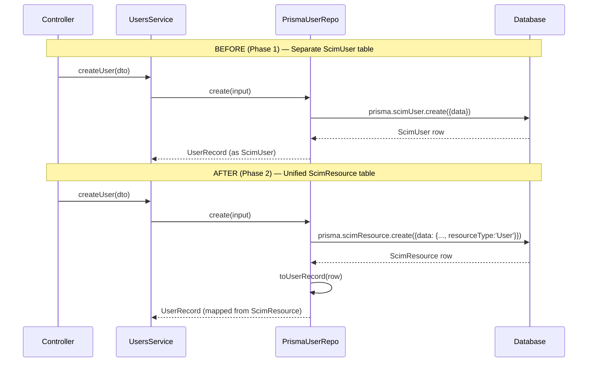

# Phase 2 — Unified `scim_resource` Table

> **Status:** ✅ Complete  
> **Branch:** `feat/customattrflag`  
> **Date:** 2026-02-20  
> **Migration:** `20260220222115_unified_scim_resource`  

---

## Table of Contents

1. [Executive Summary](#executive-summary)
2. [Motivation](#motivation)
3. [Before & After Architecture](#before--after-architecture)
4. [Schema Changes](#schema-changes)
5. [Repository Implementation Changes](#repository-implementation-changes)
6. [Domain Model Stability](#domain-model-stability)
7. [Data Flow](#data-flow)
8. [Data Migration Script](#data-migration-script)
9. [Test Results](#test-results)
10. [Files Changed](#files-changed)
11. [Phase 3 Preview](#phase-3-preview)

---

## Executive Summary

Phase 2 unifies the separate `ScimUser`, `ScimGroup`, and `GroupMember` database tables into a single polymorphic `ScimResource` table with a `ResourceMember` join table. This is an **implementation-only change** at the Prisma repository layer — services, controllers, domain interfaces, and InMemory implementations remain completely unchanged.

### Key Metrics

| Metric | Value |
|--------|-------|
| Unit tests | **784 passed** (24 suites) |
| E2E tests | **184 passed** (15 suites) |
| Live tests (local) | **280 passed** |
| Live tests (Docker) | **280 passed** |
| New Prisma repo tests | **38 tests** (2 new suites) |
| Source files changed | **4** |
| New files created | **5** |

---

## Motivation

### Problems with Separate Tables

```
┌──────────────────────────────────────────────────────────────┐
│                    BEFORE (Phase 1)                          │
├──────────────────────────────────────────────────────────────┤
│                                                              │
│  ScimUser table          ScimGroup table                     │
│  ┌─────────────┐        ┌──────────────┐                     │
│  │ id           │        │ id            │                    │
│  │ endpointId   │        │ endpointId    │                    │
│  │ scimId       │        │ scimId        │  ← 60% identical  │
│  │ externalId   │        │ externalId    │    columns         │
│  │ userName     │        │ displayName   │                    │
│  │ rawPayload   │        │ rawPayload    │                    │
│  │ meta         │        │ meta          │                    │
│  │ createdAt    │        │ createdAt     │                    │
│  │ updatedAt    │        │ updatedAt     │                    │
│  └──────┬──────┘        └──────┬────────┘                    │
│         │                      │                              │
│         └──────┐ ┌─────────────┘                              │
│                ▼ ▼                                            │
│         GroupMember table                                     │
│         ┌──────────────┐                                     │
│         │ groupId (FK) │                                     │
│         │ userId  (FK) │                                     │
│         └──────────────┘                                     │
│                                                              │
│  Issues:                                                     │
│  • Adding new resource type = new model + migration + repo   │
│  • Filter logic duplicated (buildUserFilter/buildGroupFilter)│
│  • PATCH logic duplicated in both services                   │
│  • No unified query across resource types                    │
└──────────────────────────────────────────────────────────────┘
```

### Solution: Polymorphic Unified Table

```
┌──────────────────────────────────────────────────────────────┐
│                      AFTER (Phase 2)                         │
├──────────────────────────────────────────────────────────────┤
│                                                              │
│                  ScimResource table                           │
│         ┌──────────────────────────────┐                     │
│         │ id                           │                     │
│         │ endpointId                   │                     │
│         │ resourceType  ("User"/"Group")│ ← discriminator   │
│         │ scimId                       │                     │
│         │ externalId                   │                     │
│         │ userName      (nullable)     │ ← Users only       │
│         │ userNameLower (nullable)     │                     │
│         │ displayName   (nullable)     │ ← Groups only      │
│         │ displayNameLower (nullable)  │                     │
│         │ active                       │                     │
│         │ rawPayload                   │                     │
│         │ version       (default: 1)   │ ← future Phase 7   │
│         │ meta                         │                     │
│         │ createdAt                    │                     │
│         │ updatedAt                    │                     │
│         └──────────┬───────────────────┘                     │
│                    │                                          │
│           ResourceMember table                                │
│         ┌──────────────────────────────┐                     │
│         │ groupResourceId (FK)         │                     │
│         │ memberResourceId (FK, null)  │                     │
│         │ value                        │                     │
│         │ type                         │                     │
│         │ display                      │                     │
│         └──────────────────────────────┘                     │
│                                                              │
│  Benefits:                                                   │
│  • New resource type = add row with resourceType="Device"    │
│  • Single table for cross-type queries                       │
│  • Foundation for unified ResourceOrchestrator (Phase 5)     │
│  • version column ready for optimistic locking (Phase 7)     │
└──────────────────────────────────────────────────────────────┘
```

---

## Before & After Architecture

### Sequence: Creating a User (Before vs After)



### What Changed vs What Stayed

| Layer | Changed? | Details |
|-------|----------|---------|
| **Controllers** | ❌ No | Same HTTP endpoints, same DTOs |
| **Services** | ❌ No | Same `IUserRepository`/`IGroupRepository` calls |
| **Domain Models** | ❌ No | `UserRecord`, `GroupRecord`, `MemberRecord` unchanged |
| **Repository Interfaces** | ❌ No | Same `IUserRepository`, `IGroupRepository` |
| **Repository Tokens** | ❌ No | Same `USER_REPOSITORY`, `GROUP_REPOSITORY` |
| **InMemory Repos** | ❌ No | Operate on domain models directly |
| **Prisma Schema** | ✅ Yes | Added `ScimResource` + `ResourceMember` models |
| **PrismaUserRepo** | ✅ Yes | Queries `scimResource` with `resourceType:'User'` |
| **PrismaGroupRepo** | ✅ Yes | Queries `scimResource`/`resourceMember` with `resourceType:'Group'` |

---

## Schema Changes

### New Prisma Models

```prisma
model ScimResource {
  id               String   @id @default(cuid())
  endpointId       String
  resourceType     String   // "User" or "Group"
  scimId           String
  externalId       String?
  userName         String?  // Only for Users
  userNameLower    String?  // Only for Users — SQLite case-insensitivity
  displayName      String?  // Only for Groups
  displayNameLower String?  // Only for Groups — SQLite case-insensitivity
  active           Boolean  @default(true)
  rawPayload       String
  version          Int      @default(1)  // Optimistic locking (Phase 7)
  meta             String?
  createdAt        DateTime @default(now())
  updatedAt        DateTime @updatedAt

  endpoint         Endpoint         @relation(...)
  membersAsGroup   ResourceMember[] @relation("GroupMembers")
  membersAsMember  ResourceMember[] @relation("MemberResources")

  @@unique([endpointId, scimId])
  @@unique([endpointId, userNameLower])
  @@unique([endpointId, displayNameLower])
  @@unique([endpointId, resourceType, externalId])
  @@index([endpointId, resourceType])
}

model ResourceMember {
  id               String    @id @default(cuid())
  groupResourceId  String    // FK to ScimResource (the group)
  memberResourceId String?   // FK to ScimResource (the member)
  value            String
  type             String?
  display          String?
  createdAt        DateTime  @default(now())

  group  ScimResource  @relation("GroupMembers", ...)
  member ScimResource? @relation("MemberResources", ...)
}
```

### Unique Constraint Strategy

| Constraint | Purpose | NULL handling |
|------------|---------|---------------|
| `[endpointId, scimId]` | Global SCIM ID uniqueness | scimId is never null |
| `[endpointId, userNameLower]` | Username uniqueness per tenant | Groups have NULL → multiple NULLs allowed |
| `[endpointId, displayNameLower]` | Group name uniqueness per tenant | Users have NULL → multiple NULLs allowed |
| `[endpointId, resourceType, externalId]` | ExternalId uniqueness per type per tenant | Prevents User/Group externalId collision |

---

## Repository Implementation Changes

### PrismaUserRepository — Key Changes

**Before (Phase 1):**
```typescript
// Queries the ScimUser table directly
const user = await this.prisma.scimUser.create({ data: { ... } });
return user as UserRecord;
```

**After (Phase 2):**
```typescript
// Queries the unified ScimResource table with type discriminator
const resource = await this.prisma.scimResource.create({
  data: { ...input, resourceType: 'User', endpoint: { connect: { id: endpointId } } },
});
return toUserRecord(resource);  // Explicit field mapping
```

### Field Mapping Functions

```typescript
/** Maps ScimResource row → UserRecord domain type */
function toUserRecord(resource: Record<string, unknown>): UserRecord {
  return {
    id: resource.id,
    endpointId: resource.endpointId,
    scimId: resource.scimId,
    externalId: resource.externalId ?? null,
    userName: resource.userName,      // From ScimResource.userName
    userNameLower: resource.userNameLower,
    active: resource.active,
    rawPayload: resource.rawPayload,
    meta: resource.meta ?? null,
    createdAt: resource.createdAt,
    updatedAt: resource.updatedAt,
  };
}

/** Maps ResourceMember row → MemberRecord domain type */
function toMemberRecord(member: Record<string, unknown>): MemberRecord {
  return {
    id: member.id,
    groupId: member.groupResourceId,     // Field name mapping
    userId: member.memberResourceId,     // Field name mapping
    value: member.value,
    type: member.type ?? null,
    display: member.display ?? null,
    createdAt: member.createdAt,
  };
}
```

### PrismaGroupRepository — Key Changes

| Operation | Before | After |
|-----------|--------|-------|
| `create` | `prisma.scimGroup.create(...)` | `prisma.scimResource.create({..., resourceType:'Group'})` |
| `findByScimId` | `prisma.scimGroup.findFirst(...)` | `prisma.scimResource.findFirst({where: {..., resourceType:'Group'}})` |
| `findWithMembers` | `include: { members: true }` | `include: { membersAsGroup: true }` |
| `addMembers` | `prisma.groupMember.createMany(...)` | `prisma.resourceMember.createMany(...)` |
| `updateGroupWithMembers` | `tx.scimGroup.update + tx.groupMember.deleteMany` | `tx.scimResource.update + tx.resourceMember.deleteMany({where: {groupResourceId}})` |

---

## Domain Model Stability

The repository pattern from Phase 1 provides complete isolation. The domain models are **unchanged**:

```typescript
// user.model.ts — NO CHANGES
export interface UserRecord {
  id: string; endpointId: string; scimId: string;
  externalId: string | null; userName: string; userNameLower: string;
  active: boolean; rawPayload: string; meta: string | null;
  createdAt: Date; updatedAt: Date;
}

// group.model.ts — NO CHANGES  
export interface GroupRecord { ... }
export interface MemberRecord {
  id: string; groupId: string;  // ← Still "groupId" in domain
  userId: string | null;        // ← Still "userId" in domain
  value: string; type: string | null; display: string | null;
  createdAt: Date;
}
```

The Prisma repos map `groupResourceId` → `groupId` and `memberResourceId` → `userId` internally.

---

## Data Flow

### Query Flow: GET /Users with filter

```
HTTP Request: GET /scim/endpoints/{id}/Users?filter=userName eq "alice"
         │
         ▼
  ┌─ EndpointScimUsersController ─┐
  │  (unchanged)                   │
  └───────────┬───────────────────┘
              │
              ▼
  ┌─ EndpointScimUsersService ────┐
  │  buildUserFilter(filter)       │  → { dbWhere: {userNameLower:'alice'} }
  │  userRepo.findAll(epId, where) │
  │  (unchanged — same interface)  │
  └───────────┬───────────────────┘
              │
              ▼
  ┌─ PrismaUserRepository ────────┐
  │  BEFORE: scimUser.findMany(   │
  │    where: {userNameLower,      │
  │            endpointId})        │
  │                                │
  │  AFTER:  scimResource.findMany│
  │    where: {userNameLower,      │
  │            endpointId,         │
  │            resourceType:'User'}│  ← discriminator added
  │  .map(toUserRecord)            │  ← explicit mapping
  └───────────┬───────────────────┘
              │
              ▼
  ┌─ SQLite Database ──────────────┐
  │  SELECT * FROM ScimResource    │
  │  WHERE endpointId = ?          │
  │    AND resourceType = 'User'   │
  │    AND userNameLower = 'alice'  │
  └────────────────────────────────┘
```

---

## Data Migration Script

A migration script is provided at `scripts/migrate-to-unified-resource.ts` for existing deployments:

```bash
cd api
npx ts-node ../scripts/migrate-to-unified-resource.ts
```

### Behavior

- **Additive only** — does NOT delete data from legacy tables
- **Idempotent** — skips resources already in `scimResource`
- Migrates users first, then groups with members
- Resolves `memberResourceId` by matching `scimId` across endpoints
- Logs progress with counts of migrated/skipped records

### Flow

```
Legacy Tables (read-only)         Unified Tables (write)
┌─────────────┐                   ┌─────────────────┐
│ ScimUser     │ ──copy──────────→│ ScimResource     │
│ (N records)  │  type='User'     │ (N+M resources)  │
└─────────────┘                   └────────┬────────┘
                                           │
┌─────────────┐                   ┌────────▼────────┐
│ ScimGroup    │ ──copy──────────→│ ScimResource     │
│ (M records)  │  type='Group'    │                  │
└──────┬──────┘                   └─────────────────┘
       │
┌──────▼──────┐                   ┌─────────────────┐
│ GroupMember  │ ──copy──────────→│ ResourceMember   │
│ (K records)  │  resolve FK      │ (K records)      │
└─────────────┘                   └─────────────────┘
```

---

## Test Results

### Unit Tests: 784 passed (24 suites)

| Suite | Tests | Status |
|-------|-------|--------|
| **PrismaUserRepository (Phase 2)** | **20** | ✅ NEW |
| **PrismaGroupRepository (Phase 2)** | **18** | ✅ NEW |
| InMemoryUserRepository | 32 | ✅ Unchanged |
| InMemoryGroupRepository | 38 | ✅ Unchanged |
| RepositoryModule | 10 | ✅ Unchanged |
| EndpointScimUsersService | 164 | ✅ Unchanged |
| EndpointScimGroupsService | 157 | ✅ Unchanged |
| ScimFilterParser | 78 | ✅ Unchanged |
| *...17 other suites...* | 267 | ✅ Unchanged |

### E2E Tests: 184 passed (15 suites)

All end-to-end tests pass against the live NestJS application using the unified `ScimResource` table:

- user-lifecycle, group-lifecycle, endpoint-isolation
- advanced-patch, filter-operators, rfc-compliance
- etag-conditional, config-flags, edge-cases
- authentication, discovery-endpoints, admin-version
- attribute-projection, search-endpoint, log-config

### Live Tests: 280 passed (local + Docker)

Full integration tests against both local server and Docker container, covering:
- Endpoint CRUD operations
- User/Group lifecycle (create, read, update, patch, delete)
- Filtering, pagination, sorting
- Multi-member PATCH operations
- Endpoint isolation
- Config flag validation

---

## Files Changed

### Modified Files (4)

| File | Change |
|------|--------|
| `api/prisma/schema.prisma` | Added `ScimResource`, `ResourceMember` models + `Endpoint.resources` relation |
| `api/src/infrastructure/repositories/prisma/prisma-user.repository.ts` | Rewired to `scimResource` with `resourceType:'User'` |
| `api/src/infrastructure/repositories/prisma/prisma-group.repository.ts` | Rewired to `scimResource`/`resourceMember` with `resourceType:'Group'` |

### New Files (5)

| File | Purpose |
|------|---------|
| `api/prisma/migrations/20260220222115_unified_scim_resource/migration.sql` | SQL migration for new tables |
| `api/src/infrastructure/repositories/prisma/prisma-user.repository.spec.ts` | 20 unit tests for Phase 2 user repo |
| `api/src/infrastructure/repositories/prisma/prisma-group.repository.spec.ts` | 18 unit tests for Phase 2 group repo |
| `scripts/migrate-to-unified-resource.ts` | Data migration script for existing deployments |
| `docs/phases/PHASE_02_UNIFIED_RESOURCE_TABLE.md` | This document |

### Unchanged (critical stability)

- All domain models (`user.model.ts`, `group.model.ts`)
- All repository interfaces (`user.repository.interface.ts`, `group.repository.interface.ts`)
- All services (`endpoint-scim-users.service.ts`, `endpoint-scim-groups.service.ts`)
- All controllers
- All InMemory implementations
- All filter logic (`apply-scim-filter.ts`)
- `repository.module.ts`, `repository.tokens.ts`

---

## Phase 3 Preview

The next phase migrates from **SQLite to PostgreSQL**:

- Replace `provider = "sqlite"` with `provider = "postgresql"` in schema
- Remove `userNameLower`/`displayNameLower` columns (use `@db.Citext` instead)
- Convert `rawPayload`/`meta` from `String` to `Json` (JSONB)
- Enable concurrent write support (remove single-writer SQLite limitation)
- Leverage ILIKE for case-insensitive filter pushdown

The unified `ScimResource` table from Phase 2 makes this migration simpler — only one table needs the column type changes instead of two.
