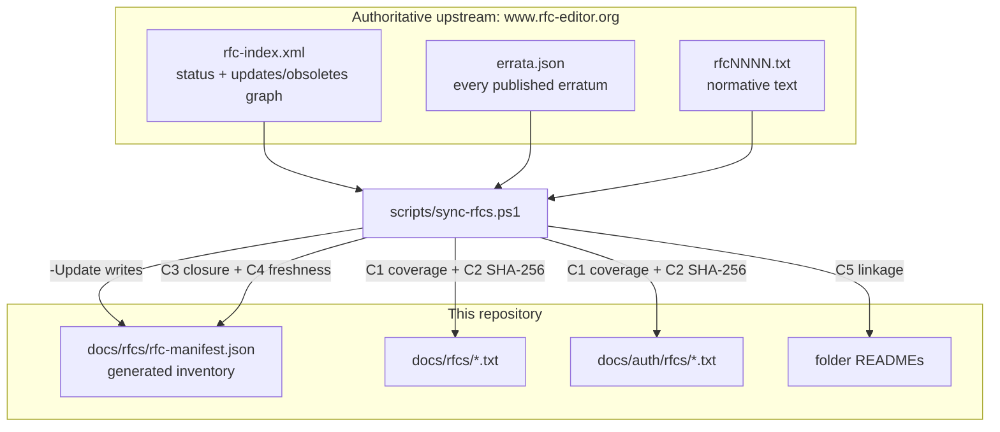

# SCIM RFC Reference Corpus

> **Purpose**: verbatim, byte-verified IETF source texts so normative wording can be cited line-for-line without a network round-trip.
> **Currency**: machine-enforced by [rfc-manifest.json](rfc-manifest.json) + [scripts/sync-rfcs.ps1](../../scripts/sync-rfcs.ps1). See [Keeping this corpus current](#keeping-this-corpus-current).
> **Companion**: OAuth / WIF / OIDC RFCs live under [../auth/rfcs/](../auth/rfcs/README.md). Both folders are governed by the same manifest and the same gate.
> **Used by**: [P5_RFC_SCHEMA_PRESET_COMPLIANCE_AUDIT.md](../P5_RFC_SCHEMA_PRESET_COMPLIANCE_AUDIT.md), [SCIM_SUBATTRIBUTE_TYPE_RULES.md](SCIM_SUBATTRIBUTE_TYPE_RULES.md)

## Files

| File | RFC | Title | Status | Published | Role |
|---|---|---|---|---|---|
| [rfc7642.txt](rfc7642.txt) | [RFC 7642](https://www.rfc-editor.org/info/rfc7642) | SCIM: Definitions, Overview, Concepts, and Requirements | Informational | 2015-09 | Background, use cases, requirements. Not normative for schema. |
| [rfc7643.txt](rfc7643.txt) | [RFC 7643](https://www.rfc-editor.org/info/rfc7643) | SCIM: Core Schema | Proposed Standard | 2015-09 | **The** normative source for data types, the complex / multi-valued model and the sub-attribute nesting rule. |
| [rfc7644.txt](rfc7644.txt) | [RFC 7644](https://www.rfc-editor.org/info/rfc7644) | SCIM: Protocol | Proposed Standard | 2015-09 | PATCH path ABNF, filter grammar, attribute projection, bulk, discovery. |
| [rfc9865.txt](rfc9865.txt) | [RFC 9865](https://www.rfc-editor.org/info/rfc9865) | Cursor-Based Pagination of SCIM Resources | Proposed Standard | 2025-10 | **Updates 7643 + 7644.** Adds the `pagination` complex attribute to `ServiceProviderConfig`. |
| [rfc9967.txt](rfc9967.txt) | [RFC 9967](https://www.rfc-editor.org/info/rfc9967) | SCIM Profile for Security Event Tokens (SETs) | Proposed Standard | 2026-05 | **Updates 7643 + 7644.** Adds the `securityEvents` complex attribute, the `Set-Txn` header and asynchronous requests. |

### Derived documents in this folder

| File | What it is |
|---|---|
| [RFC7643_SCHEMA_EXTRACT.md](RFC7643_SCHEMA_EXTRACT.md) | Canonical JSON lifted out of RFC 7643 section 8.7.1 + section 3.1 + sections 2.2-2.4, for diffing against what the server publishes. |
| [SCIM_SUBATTRIBUTE_TYPE_RULES.md](SCIM_SUBATTRIBUTE_TYPE_RULES.md) | Every allowed and disallowed attribute / sub-attribute shape, with worked JSON for each case, the errata that settle the ambiguities, and the IdP / ISV deviation matrix. |
| [rfc-manifest.json](rfc-manifest.json) | Machine-checked inventory of every mirrored RFC in the repo: status, updates / obsoletes graph, errata counts, SHA-256. Generated, not hand-edited. |

## Key sections for schema and protocol audits

Links point at the exact section anchor on rfc-editor.org.

### RFC 7643 (Core Schema)

| Section | Topic |
|---|---|
| [1.2](https://www.rfc-editor.org/rfc/rfc7643#section-1.2) | Definitions of *simple attribute*, *complex attribute*, *sub-attribute*. The whole nesting model follows from these three sentences. |
| [2.1](https://www.rfc-editor.org/rfc/rfc7643#section-2.1) | Attribute-name ABNF (`ATTRNAME = ALPHA *(nameChar)`). |
| [2.2](https://www.rfc-editor.org/rfc/rfc7643#section-2.2) | Attribute-characteristic defaults (required, caseExact, mutability, returned, uniqueness, type). |
| [2.3](https://www.rfc-editor.org/rfc/rfc7643#section-2.3) | The data-type table (string, boolean, decimal, integer, dateTime, binary, reference, complex). |
| [2.3.2](https://www.rfc-editor.org/rfc/rfc7643#section-2.3.2) | Booleans: "no case sensitivity or uniqueness". |
| [2.3.8](https://www.rfc-editor.org/rfc/rfc7643#section-2.3.8) | **"A complex attribute MUST NOT contain sub-attributes that have sub-attributes (i.e., that are complex)."** |
| [2.4](https://www.rfc-editor.org/rfc/rfc7643#section-2.4) | Multi-valued attributes; the default sub-attribute set (`type`, `primary`, `display`, `value`, `$ref`). |
| [2.5](https://www.rfc-editor.org/rfc/rfc7643#section-2.5) | Unassigned / null / empty-array equivalence. |
| [3.1](https://www.rfc-editor.org/rfc/rfc7643#section-3.1) | Common attributes (`id`, `externalId`, `meta`). NOT part of a schema's `attributes`. |
| [3.3](https://www.rfc-editor.org/rfc/rfc7643#section-3.3) | Schema extensions as JSON containers keyed by URN. The legal way to get an extra nesting level. |
| [4.1](https://www.rfc-editor.org/rfc/rfc7643#section-4.1) / [4.2](https://www.rfc-editor.org/rfc/rfc7643#section-4.2) / [4.3](https://www.rfc-editor.org/rfc/rfc7643#section-4.3) | User, Group, Enterprise User schemas. |
| [5](https://www.rfc-editor.org/rfc/rfc7643#section-5) / [6](https://www.rfc-editor.org/rfc/rfc7643#section-6) | ServiceProviderConfig, ResourceType. |
| [7](https://www.rfc-editor.org/rfc/rfc7643#section-7) | Schema definition: the characteristic keywords, `subAttributes`, and the `Schema`-resource carve-out. |
| [8.7.1](https://www.rfc-editor.org/rfc/rfc7643#section-8.7.1) | Normative JSON for the User / Group / EnterpriseUser schemas. |
| [8.7.2](https://www.rfc-editor.org/rfc/rfc7643#section-8.7.2) | Normative JSON for ServiceProviderConfig / ResourceType / Schema. |

### RFC 7644 (Protocol)

| Section | Topic |
|---|---|
| [3.4.2.2](https://www.rfc-editor.org/rfc/rfc7644#section-3.4.2.2) | Filtering grammar, including `valuePath` and the ban on nesting one inside another. |
| [3.4.2.5](https://www.rfc-editor.org/rfc/rfc7644#section-3.4.2.5) | `attributes` / `excludedAttributes` projection. |
| [3.5.2](https://www.rfc-editor.org/rfc/rfc7644#section-3.5.2) | PATCH, and the `PATH` ABNF whose `*1subAttr` caps addressability at two levels. |
| [3.7](https://www.rfc-editor.org/rfc/rfc7644#section-3.7) | Bulk operations. |
| [3.12](https://www.rfc-editor.org/rfc/rfc7644#section-3.12) | Error response + `scimType` keyword table. |
| [4](https://www.rfc-editor.org/rfc/rfc7644#section-4) | Service-provider discovery (SHALL NOT require authentication). |

### RFC 9865 / RFC 9967 (the two documents that update the core)

| Section | Topic |
|---|---|
| [9865 section 2](https://www.rfc-editor.org/rfc/rfc9865#section-2) | `cursor` / `count` query parameters, `nextCursor` / `previousCursor` response attributes, new `scimType` values (`invalidCursor`, `expiredCursor`, `invalidCount`). |
| [9865 section 4](https://www.rfc-editor.org/rfc/rfc9865#section-4) | The `pagination` complex attribute added to `ServiceProviderConfig`. |
| [9967 section 2.5.1.1](https://www.rfc-editor.org/rfc/rfc9967#section-2.5.1.1) | `Prefer: respond-async` and HTTP 202 handling. |
| [9967 section 3](https://www.rfc-editor.org/rfc/rfc9967#section-3) | The `Set-Txn` response header. |
| [9967 section 4](https://www.rfc-editor.org/rfc/rfc9967#section-4) | The `securityEvents` complex attribute added to `ServiceProviderConfig`, including a multi-valued **simple** sub-attribute (`eventUris`). |

### RFC 7642 (Overview)

Background, use cases and requirements for SCIM. Not normative for schema.

## Errata are NOT in the mirrored text

This is the single most common way to misread a mirrored RFC. `rfc7643.txt` is the text **as published in September 2015**. Sixteen errata against it are now **Verified**, several of them technical and several verified as recently as 2025-10-28. A verified erratum can change what the normative text means without changing a byte of the mirror.

The worked example, and the reason this folder now carries a currency gate at all: [erratum 8415](https://errata.rfc-editor.org/eid8415/) (Verified 2025-10-28) removed `"complex"` from the legal values of `subAttributes.type` in section 8.7.1, closing a decade-old contradiction between section 8.7.1's own schema-of-schemas and the section 2.3.8 prohibition.

Always read the mirror **and** the errata page:

| RFC | Errata (as of the manifest's `lastVerified`) | Page |
|---|---|---|
| RFC 7642 | 1 verified, 2 held | [errata](https://www.rfc-editor.org/errata_search.php?rfc=7642) |
| RFC 7643 | **16 verified**, 7 reported, 12 held, 5 rejected | [errata](https://www.rfc-editor.org/errata_search.php?rfc=7643) |
| RFC 7644 | 5 verified, 7 reported, 6 held | [errata](https://www.rfc-editor.org/errata_search.php?rfc=7644) |
| RFC 9865 | none | [errata](https://www.rfc-editor.org/errata_search.php?rfc=9865) |
| RFC 9967 | none | [errata](https://www.rfc-editor.org/errata_search.php?rfc=9967) |

Those counts are asserted by check **O3** of the gate. When the RFC Editor verifies a new erratum, the gate fails and names it.

## Keeping this corpus current

A mirror is a snapshot, and a snapshot rots in three ways that no correctness gate can see:

1. **A new RFC starts updating one we depend on.** RFC 7643 and 7644 were updated by RFC 9865 (Oct 2025) and RFC 9967 (May 2026). Until 2026-07-29 this folder mirrored neither, and this README claimed only "RFC 7643 was updated by RFC 9865" - already one RFC stale.
2. **An erratum gets verified**, changing meaning without changing the file.
3. **The mirrored file silently diverges** from upstream. A corpus you cannot trust byte-for-byte is worse than none, because it is cited as authoritative.



### The gate

[scripts/sync-rfcs.ps1](../../scripts/sync-rfcs.ps1) runs eight checks. **C1-C5 are offline** and run on every pre-push, so they are deterministic and safe in an air-gapped build. **O1-O3 need the network** and run only with `-Online`, so an offline run reports "not checked" rather than a false "passed".

| Check | Network | What it proves |
|---|---|---|
| **C1** coverage | no | Every `*.txt` on disk is declared in the manifest, and every declared file exists. No stray or ghost mirrors. |
| **C2** integrity | no | On-disk SHA-256 (CRLF-normalised) matches the manifest. Catches edits to a "verbatim" file. |
| **C3** closure | no | Every RFC that **updates or obsoletes** something we mirror is itself mirrored, or carries a `waivers[]` entry with a reason. |
| **C4** freshness | no | `lastVerified` is within 90 days. |
| **C5** README linkage | no | Every mirrored file is named in its folder README. An undocumented mirror is an unfindable mirror. |
| **O1** text drift | yes | Mirrored bytes still match `www.rfc-editor.org`. |
| **O2** metadata drift | yes | Status and the updates / obsoletes graph still match. **This is what discovers a newly published RFC.** |
| **O3** errata drift | yes | Errata counts still match. A new **Verified** erratum fails the gate; other status changes warn. |

**C3 is self-extending.** Nobody has to remember to look for new SCIM RFCs. When the IETF publishes the next document that updates RFC 7643, the next `-Online` run rewrites `updatedBy`, C3 goes red, and the corpus demands the new text with no edit to the script. It applies the same lesson as the repo's infrastructure audits (`scripts/audit-base-images.ps1` and `scripts/audit-deployment-doc.ps1`, on the auth branch): a scanner that only looks for defects cannot see a **currency** problem, so currency needs its own gate.

Proof it works: the very first run flagged four RFCs updating the OAuth mirrors that the corpus had never noticed (8252, 8996, 7797, 8725). They are recorded in `waivers[]` with reasons rather than silently ignored.

### The gate is proven able to fail

A gate that has only ever been seen green is indistinguishable from a gate that cannot go red. [scripts/test-sync-rfcs.ps1](../../scripts/test-sync-rfcs.ps1) is the negative control: it breaks each offline check in turn, asserts the gate exits non-zero **and names the right check**, then restores and re-asserts green. Result as of 2026-07-29:

| Case | Expected check | Exit | Verdict |
|---|---|---|---|
| baseline, unmodified tree | green | 0 | PASS |
| undeclared `.txt` on disk | C1 | 1 | PASS |
| mirrored `.txt` edited | C2 | 1 | PASS |
| updating RFC neither mirrored nor waived | C3 | 1 | PASS |
| newly published updater appears | C3 | 1 | PASS |
| manifest older than the limit | C4 | 1 | PASS |
| mirror missing from folder README | C5 | 1 | PASS |
| restored tree | green | 0 | PASS |

Re-run it whenever `sync-rfcs.ps1` changes:

```powershell
pwsh -NoProfile -File scripts/test-sync-rfcs.ps1
```

### Commands

```powershell
# Offline audit (C1-C5). This is what pre-push runs.
pwsh -NoProfile -File scripts/sync-rfcs.ps1

# Full audit including upstream drift, new updating RFCs and new errata.
pwsh -NoProfile -File scripts/sync-rfcs.ps1 -Online

# Refresh the corpus + manifest from the RFC Editor. The ONLY sanctioned way
# to change rfc-manifest.json.
pwsh -NoProfile -File scripts/sync-rfcs.ps1 -Update
```

Also wired as `npm run rfcs:check`, `npm run rfcs:check:online` and `npm run rfcs:update` from the repo root, and run monthly by [.github/workflows/rfc-currency.yml](../../.github/workflows/rfc-currency.yml).

### When the gate fails

| Failing check | What to do |
|---|---|
| **C2** | Someone edited a mirror. Revert it. Mirrors are verbatim; all commentary belongs in a `*_EXPLAINED.md` or an analysis doc. |
| **C3** | Read the new RFC. If it is load-bearing, add a `mirrors[]` entry and run `-Update`. If not, add a `waivers[]` entry stating **why**, not just that. |
| **O2 "Updated by changed"** | A new RFC now modifies a document this repo relies on. Read it, assess the impact on the affected explainer / analysis docs, then `-Update`. |
| **O3 "Verified" count rose** | Read the new erratum on the linked page. If it changes normative meaning, update the affected doc **in the same commit** as the `-Update`. |
| **C4** | Nothing is wrong yet; nobody has checked in 90 days. Run `-Update`. |

## Provenance

- Retrieved from the official IETF RFC Editor, which is the publisher of record. `datatracker.ietf.org` returns HTTP 403 to automated fetch, so `www.rfc-editor.org` is used throughout.
  - `https://www.rfc-editor.org/rfc/rfc7642.txt`, `rfc7643.txt`, `rfc7644.txt`, `rfc9865.txt`, `rfc9967.txt` for the text
  - `https://www.rfc-editor.org/rfc-index.xml` for status and the updates / obsoletes graph
  - `https://www.rfc-editor.org/errata.json` for errata
- Per-file retrieval dates and SHA-256 digests live in [rfc-manifest.json](rfc-manifest.json).
- **Do not edit the `.txt` files.** They are the authoritative reference and check C2 will fail. Commentary belongs in the derived docs above.
