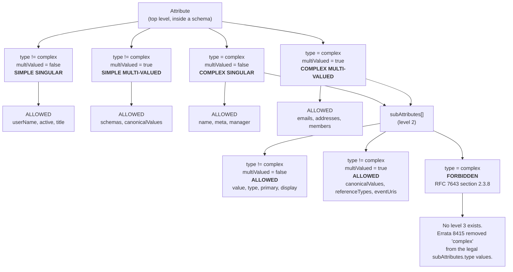
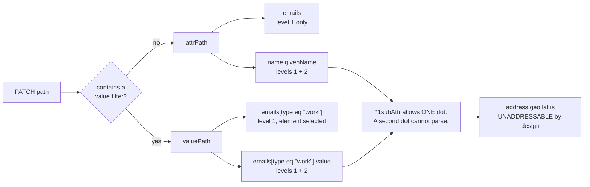
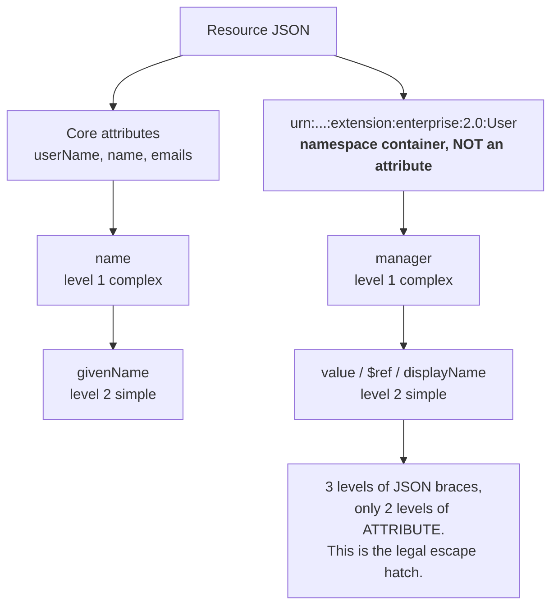
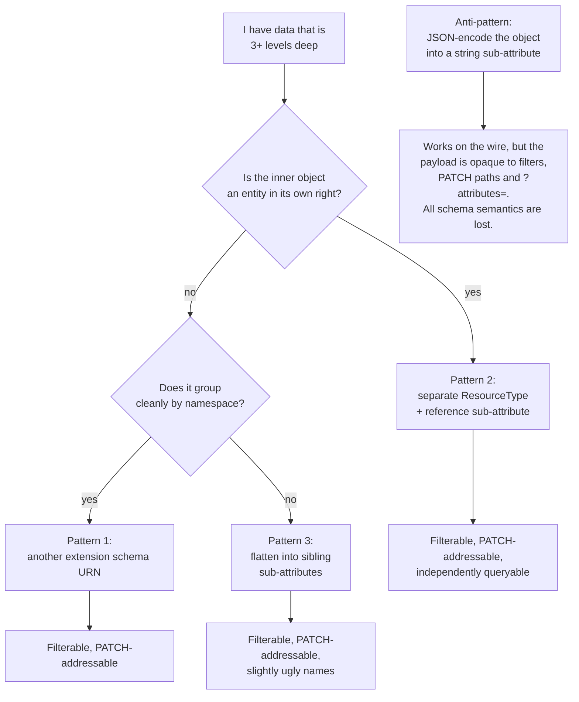

# SCIM Attribute and Sub-Attribute Type Rules

> **Question this answers**: which attribute shapes are legal in SCIM - multi-valued, complex, complex-with-multi-valued, complex-inside-complex - and which are not, at every nesting level.
> **Normative sources**: [RFC 7643](https://www.rfc-editor.org/info/rfc7643) (Core Schema), [RFC 7644](https://www.rfc-editor.org/info/rfc7644) (Protocol), as **updated by** [RFC 9865](https://www.rfc-editor.org/info/rfc9865) (Oct 2025) and [RFC 9967](https://www.rfc-editor.org/info/rfc9967) (May 2026), **plus the verified errata** - see [Errata that settle the ambiguities](#errata-that-settle-the-ambiguities).
> **Mirrors**: [rfc7643.txt](rfc7643.txt), [rfc7644.txt](rfc7644.txt), [rfc9865.txt](rfc9865.txt), [rfc9967.txt](rfc9967.txt). Currency enforced by [rfc-manifest.json](rfc-manifest.json) + [scripts/sync-rfcs.ps1](../../scripts/sync-rfcs.ps1).
> **Status**: reference document. It describes the standard and records what SCIMServer does today. It **does not change server behavior**; the one divergence found is written up in [Where SCIMServer stands today](#where-scimserver-stands-today) as an observation, not a fix.
> **Last verified against upstream**: 2026-07-29.

---

## 1. The short answer

| # | Shape | Level | Legal? | One-line reason |
|---|---|---|---|---|
| 1 | Singular simple (`string`, `boolean`, `decimal`, `integer`, `dateTime`, `binary`, `reference`) | top | **YES** | The base case. |
| 2 | **Multi-valued simple** (array of primitives) | top | **YES** | 7643 [section 2.4](https://www.rfc-editor.org/rfc/rfc7643#section-2.4): elements may be "primitive values". |
| 3 | Singular complex | top | **YES** | e.g. `name`, `meta`, `manager`. |
| 4 | **Multi-valued complex** (array of objects) | top | **YES** | e.g. `emails`, `addresses`, `members`. This is the workhorse of SCIM. |
| 5 | Singular simple | sub | **YES** | The definition of a sub-attribute. |
| 6 | **Multi-valued simple** (array of primitives) | sub | **YES** | 7643 [section 1.2](https://www.rfc-editor.org/rfc/rfc7643#section-1.2): a simple attribute is "singular **or multi-valued**". |
| 7 | Singular complex | sub | **NO** | 7643 [section 2.3.8](https://www.rfc-editor.org/rfc/rfc7643#section-2.3.8) MUST NOT. |
| 8 | Multi-valued complex | sub | **NO** | Same MUST NOT. |
| 9 | Anything at all | sub-sub | **NO** | There is no third level. |

**The rule in one sentence: multi-valuedness is free at both levels; complexity is free only at the first.**

Depth is capped at exactly two: `attribute -> sub-attribute`. Both the schema language and the protocol's path grammar say so, independently.

---

## 2. Where the rule comes from

Three definitions in RFC 7643 [section 1.2](https://www.rfc-editor.org/rfc/rfc7643#section-1.2) do all the work. Quoted verbatim from [rfc7643.txt](rfc7643.txt):

> **Simple Attribute**
>    A singular or multi-valued attribute whose value is a primitive,
>    e.g., "String".  A simple attribute MUST NOT contain
>    sub-attributes.
>
> **Complex Attribute**
>    A singular or multi-valued attribute whose value is a composition
>    of one or more simple attributes; e.g., "addresses" has the
>    sub-attributes "streetAddress", "locality", "postalCode", and
>    "country".
>
> **Sub-Attribute**
>    A simple attribute that is contained within a complex attribute.

Read those together and the whole model falls out:

- A sub-attribute is by definition **simple**, and simple explicitly includes **multi-valued**. So an array-of-primitives sub-attribute is legal.
- A complex attribute is composed of **simple** attributes. So a complex sub-attribute is a contradiction in terms.

RFC 7643 then states it as a hard requirement in [section 2.3.8](https://www.rfc-editor.org/rfc/rfc7643#section-2.3.8):

> A complex attribute MUST NOT contain sub-attributes
> that have sub-attributes (i.e., that are complex).

And [section 2.4](https://www.rfc-editor.org/rfc/rfc7643#section-2.4) defines what a multi-valued attribute's elements may be:

> Multi-valued attributes contain a list of elements using the JSON
> array format defined in Section 5 of [RFC7159].  Elements can be
> either of the following:
>
> o  primitive values, or
>
> o  objects with a set of sub-attributes and values ... in which case
>    they SHALL be considered to be complex attributes.

### The type lattice



---

## 3. The exhaustive combination matrix

Every combination of **level** x **cardinality** x **type**. This is the complete decision table; there are no other cases.

| Level | `multiValued` | `type` | Verdict | Normative citation | Canonical example |
|---|---|---|---|---|---|
| 1 (attribute) | `false` | `string` / `boolean` / `decimal` / `integer` / `dateTime` / `binary` / `reference` | **ALLOWED** | [7643 s2.3](https://www.rfc-editor.org/rfc/rfc7643#section-2.3) | `userName`, `active`, `profileUrl` |
| 1 | `true` | any non-complex | **ALLOWED** | [7643 s2.4](https://www.rfc-editor.org/rfc/rfc7643#section-2.4) first bullet | `schemas` (array of strings) |
| 1 | `false` | `complex` | **ALLOWED** | [7643 s2.3.8](https://www.rfc-editor.org/rfc/rfc7643#section-2.3.8) | `name`, `meta`, `manager`, `patch` |
| 1 | `true` | `complex` | **ALLOWED** | [7643 s2.4](https://www.rfc-editor.org/rfc/rfc7643#section-2.4) second bullet | `emails`, `addresses`, `members`, `authenticationSchemes` |
| 2 (sub-attribute) | `false` | any non-complex | **ALLOWED** | [7643 s1.2](https://www.rfc-editor.org/rfc/rfc7643#section-1.2) | `emails.value`, `name.givenName`, `meta.created` |
| 2 | `true` | any non-complex | **ALLOWED** | [7643 s1.2](https://www.rfc-editor.org/rfc/rfc7643#section-1.2) "singular **or multi-valued**" | `attributes.canonicalValues`, `attributes.referenceTypes`, `securityEvents.eventUris` |
| 2 | `false` | `complex` | **FORBIDDEN** | [7643 s2.3.8](https://www.rfc-editor.org/rfc/rfc7643#section-2.3.8) + [errata 8415](https://errata.rfc-editor.org/eid8415/) | - |
| 2 | `true` | `complex` | **FORBIDDEN** | same | - |
| 3+ | any | any | **UNREACHABLE** | Level 3 can only exist under a level-2 complex, which is forbidden | - |

### Cardinality is orthogonal to complexity

This is the point people most often get backwards, so it is worth its own table. "Can it be an array?" and "can it have sub-fields?" are independent questions with different answers per level.

| | Level 1 attribute | Level 2 sub-attribute |
|---|---|---|
| **Can be multi-valued?** | YES | **YES** |
| **Can be complex?** | YES | **NO** |

So `complex + multiValued` is legal at level 1 (that is `emails`), and `simple + multiValued` is legal at level 2 (that is `referenceTypes`). What is never legal is `complex` at level 2, in either cardinality.

---

## 4. Allowed combinations, with worked JSON

Every schema fragment below is a valid SCIM schema attribute definition, and every instance fragment is a valid resource payload.

### A1. Simple singular attribute

```json
{
  "name": "userName",
  "type": "string",
  "multiValued": false,
  "description": "Unique identifier for the User.",
  "required": true,
  "caseExact": false,
  "mutability": "readWrite",
  "returned": "default",
  "uniqueness": "server"
}
```

Instance:

```json
{
  "userName": "bjensen@example.com"
}
```

### A2. Simple multi-valued attribute (array of primitives)

RFC 7643 [section 2.4](https://www.rfc-editor.org/rfc/rfc7643#section-2.4) explicitly permits elements that are "primitive values". The `schemas` attribute on every resource is exactly this.

```json
{
  "name": "tags",
  "type": "string",
  "multiValued": true,
  "description": "Free-form labels attached to this User.",
  "required": false,
  "caseExact": false,
  "mutability": "readWrite",
  "returned": "default",
  "uniqueness": "none"
}
```

Instance:

```json
{
  "tags": [
    "contractor",
    "emea",
    "night-shift"
  ]
}
```

> **Interop caution.** Legal, but neither Entra ID nor Okta can map into an array of bare primitives. In practice a primitive array is read-mostly. See [IdP and ISV reality](#8-idp-and-isv-reality).

### A3. Complex singular attribute

```json
{
  "name": "name",
  "type": "complex",
  "multiValued": false,
  "description": "The components of the user's real name.",
  "required": false,
  "mutability": "readWrite",
  "returned": "default",
  "subAttributes": [
    {
      "name": "givenName",
      "type": "string",
      "multiValued": false,
      "required": false,
      "caseExact": false,
      "mutability": "readWrite",
      "returned": "default",
      "uniqueness": "none"
    },
    {
      "name": "familyName",
      "type": "string",
      "multiValued": false,
      "required": false,
      "caseExact": false,
      "mutability": "readWrite",
      "returned": "default",
      "uniqueness": "none"
    }
  ]
}
```

Instance:

```json
{
  "name": {
    "givenName": "Barbara",
    "familyName": "Jensen"
  }
}
```

### A4. Complex multi-valued attribute

The single most common shape in SCIM. Note that `emails` is `complex` AND `multiValued`, and every one of its sub-attributes is simple.

```json
{
  "name": "emails",
  "type": "complex",
  "multiValued": true,
  "description": "Email addresses for the user.",
  "required": false,
  "mutability": "readWrite",
  "returned": "default",
  "subAttributes": [
    {
      "name": "value",
      "type": "string",
      "multiValued": false,
      "required": false,
      "caseExact": false,
      "mutability": "readWrite",
      "returned": "default",
      "uniqueness": "none"
    },
    {
      "name": "display",
      "type": "string",
      "multiValued": false,
      "required": false,
      "caseExact": false,
      "mutability": "readWrite",
      "returned": "default",
      "uniqueness": "none"
    },
    {
      "name": "type",
      "type": "string",
      "multiValued": false,
      "required": false,
      "caseExact": false,
      "canonicalValues": [
        "work",
        "home",
        "other"
      ],
      "mutability": "readWrite",
      "returned": "default",
      "uniqueness": "none"
    },
    {
      "name": "primary",
      "type": "boolean",
      "multiValued": false,
      "required": false,
      "mutability": "readWrite",
      "returned": "default"
    }
  ]
}
```

Instance:

```json
{
  "emails": [
    {
      "value": "bjensen@example.com",
      "type": "work",
      "primary": true
    },
    {
      "value": "babs@jensen.org",
      "type": "home"
    }
  ]
}
```

### A5. Multi-valued SIMPLE sub-attribute (the case people wrongly assume is illegal)

A sub-attribute may be an array of primitives. RFC 7643 proves this in its own schema-of-schemas: `attributes.canonicalValues` and `attributes.referenceTypes` are both `multiValued: true` strings living inside the complex `attributes` attribute ([section 8.7.2](https://www.rfc-editor.org/rfc/rfc7643#section-8.7.2)), and [errata 5607](https://errata.rfc-editor.org/eid5607/) (Verified) corrects `referenceTypes` inside `subAttributes` to `multiValued: true`.

```json
{
  "name": "licenses",
  "type": "complex",
  "multiValued": true,
  "description": "License grants held by this User.",
  "required": false,
  "mutability": "readWrite",
  "returned": "default",
  "subAttributes": [
    {
      "name": "value",
      "type": "string",
      "multiValued": false,
      "required": true,
      "caseExact": false,
      "mutability": "readWrite",
      "returned": "default",
      "uniqueness": "none"
    },
    {
      "name": "skus",
      "type": "string",
      "multiValued": true,
      "description": "SKU codes bundled into this license. A multi-valued SIMPLE sub-attribute, which RFC 7643 section 1.2 permits.",
      "required": false,
      "caseExact": true,
      "mutability": "readWrite",
      "returned": "default",
      "uniqueness": "none"
    }
  ]
}
```

Instance:

```json
{
  "urn:example:params:scim:schemas:extension:2.0:User": {
    "licenses": [
      {
        "value": "E5",
        "skus": [
          "EXCHANGE",
          "TEAMS",
          "INTUNE"
        ]
      }
    ]
  }
}
```

### A6. A multi-valued simple sub-attribute in a 2026 RFC

Not a legacy quirk. RFC 9967 [section 4](https://www.rfc-editor.org/rfc/rfc9967#section-4) adds `securityEvents` to `ServiceProviderConfig` with exactly this shape: a complex attribute whose `eventUris` sub-attribute is "a multivalued string".

```json
{
  "schemas": [
    "urn:ietf:params:scim:schemas:core:2.0:ServiceProviderConfig"
  ],
  "securityEvents": {
    "asyncRequest": "request",
    "eventUris": [
      "urn:ietf:params:scim:event:prov:create:full",
      "urn:ietf:params:scim:event:prov:patch:notice",
      "urn:ietf:params:scim:event:prov:delete"
    ]
  }
}
```

### A7. Reference-typed sub-attribute

`reference` is a simple type ([section 2.3.7](https://www.rfc-editor.org/rfc/rfc7643#section-2.3.7)), so `$ref` is a perfectly ordinary sub-attribute. It is how SCIM models a relationship without nesting.

```json
{
  "members": [
    {
      "value": "2819c223-7f76-453a-919d-413861904646",
      "$ref": "https://example.com/v2/Users/2819c223-7f76-453a-919d-413861904646",
      "type": "User",
      "display": "Babs Jensen"
    }
  ]
}
```

### A8. Binary-typed sub-attribute

`binary` is a legal type at both levels. It was missing from the `type` keyword list in the published text and was added by [errata 5606](https://errata.rfc-editor.org/eid5606/) and [errata 8435](https://errata.rfc-editor.org/eid8435/), both Verified.

```json
{
  "x509Certificates": [
    {
      "value": "MIIDQzCCAqygAwIBAgICEAAwDQYJKoZIhvcNAQEFBQAwTjELMAkGA1UEBhMCVVMx",
      "type": "work",
      "primary": true
    }
  ]
}
```

---

## 5. Forbidden combinations, with worked JSON

Each case shows the illegal shape, the citation, and the SCIM error a strict service provider should return per RFC 7644 [section 3.12](https://www.rfc-editor.org/rfc/rfc7644#section-3.12).

### F1. Complex sub-attribute (singular)

The archetypal violation. `address` is complex, and `geo` inside it is complex again.

```jsonc
// SCHEMATIC - this is what NOT to publish. Not valid SCIM.
{
  "name": "address",
  "type": "complex",
  "multiValued": false,
  "subAttributes": [
    { "name": "street", "type": "string", "multiValued": false },
    {
      "name": "geo",
      "type": "complex",              // <-- FORBIDDEN: RFC 7643 section 2.3.8
      "multiValued": false,
      "subAttributes": [
        { "name": "lat", "type": "decimal", "multiValued": false },
        { "name": "lon", "type": "decimal", "multiValued": false }
      ]
    }
  ]
}
```

**Why**: [section 2.3.8](https://www.rfc-editor.org/rfc/rfc7643#section-2.3.8) - "A complex attribute MUST NOT contain sub-attributes that have sub-attributes (i.e., that are complex)." Reinforced by [errata 8415](https://errata.rfc-editor.org/eid8415/), which struck `"complex"` from the legal values of `subAttributes.type`.

**Practical consequence**: `address.geo.lat` is not expressible in the PATCH path grammar, so no client can ever write it. See [section 6](#6-the-protocol-independently-forbids-a-third-level).

### F2. Complex multi-valued sub-attribute

```jsonc
// SCHEMATIC - not valid SCIM.
{
  "name": "employment",
  "type": "complex",
  "multiValued": false,
  "subAttributes": [
    { "name": "employer", "type": "string", "multiValued": false },
    {
      "name": "roles",
      "type": "complex",              // <-- FORBIDDEN, and multiValued makes it worse
      "multiValued": true,
      "subAttributes": [
        { "name": "title", "type": "string", "multiValued": false }
      ]
    }
  ]
}
```

Same prohibition. Multi-valuedness does not rescue it; the problem is `type: "complex"` at level 2.

### F3. A payload that implies a third level

Even against a schema that never declared it, this instance is invalid because `manager` is complex and `value` must be simple:

```json
{
  "urn:ietf:params:scim:schemas:extension:enterprise:2.0:User": {
    "manager": {
      "value": {
        "id": "26118915-6090-4610-87e4-49d8ca9f808d",
        "tenant": "contoso"
      }
    }
  }
}
```

Expected rejection:

```json
{
  "schemas": [
    "urn:ietf:params:scim:api:messages:2.0:Error"
  ],
  "scimType": "invalidValue",
  "detail": "Attribute 'manager.value' must be a string; got an object. A sub-attribute cannot be complex (RFC 7643 section 2.3.8).",
  "status": "400"
}
```

### F4. Sub-attributes on a simple attribute

```jsonc
// SCHEMATIC - not valid SCIM.
{
  "name": "displayName",
  "type": "string",                   // simple ...
  "multiValued": false,
  "subAttributes": [                  // <-- FORBIDDEN: a simple attribute
    { "name": "locale", "type": "string" }   //     MUST NOT contain sub-attributes
  ]
}
```

**Why**: [section 1.2](https://www.rfc-editor.org/rfc/rfc7643#section-1.2) - "A simple attribute MUST NOT contain sub-attributes." Note the asymmetry with `complex`: [section 7](https://www.rfc-editor.org/rfc/rfc7643#section-7) says a complex attribute **SHOULD** have `subAttributes`, so omitting them is merely poor practice, whereas adding them to a simple attribute is a violation.

### F5. Array of arrays

```json
{
  "tags": [
    [
      "a",
      "b"
    ],
    [
      "c"
    ]
  ]
}
```

**Why**: [section 2.4](https://www.rfc-editor.org/rfc/rfc7643#section-2.4) allows exactly two element kinds - primitives or objects-with-sub-attributes. A nested array is neither. There is no `multiValued` depth beyond one either, since `multiValued` is a boolean, not a rank.

### F6. `uniqueness` or `caseExact` on a complex attribute

```jsonc
// SCHEMATIC - characteristic misuse.
{
  "name": "emails",
  "type": "complex",
  "multiValued": true,
  "uniqueness": "server",             // <-- complex attributes have no uniqueness
  "caseExact": true                   // <-- and no case sensitivity
}
```

**Why**: [section 2.3.8](https://www.rfc-editor.org/rfc/rfc7643#section-2.3.8) - "A complex attribute has no uniqueness or case sensitivity." The published text of [section 8.7.1](https://www.rfc-editor.org/rfc/rfc7643#section-8.7.1) contradicted itself here by putting `"uniqueness": "none"` on `name`, `emails` and `addresses`; [errata 6004](https://errata.rfc-editor.org/eid6004/) (Verified) removes it. Uniqueness belongs on the **sub-attribute** (`emails.value`), never on the container.

---

## 6. The protocol independently forbids a third level

Even if a server invented a three-level schema, no client could address it. RFC 7644 [section 3.5.2](https://www.rfc-editor.org/rfc/rfc7644#section-3.5.2) defines the PATCH path grammar:

```text
PATH = attrPath / valuePath [subAttr]
attrPath  = [URI ":"] ATTRNAME *1subAttr
valuePath = attrPath "[" valFilter "]"
subAttr   = "." ATTRNAME
ATTRNAME  = ALPHA *(nameChar)
nameChar  = "$" / "-" / "_" / DIGIT / ALPHA
```

`*1subAttr` means **at most one** `.name` segment. `ATTRNAME` itself cannot contain a dot. So `address.geo.lat` cannot parse, full stop. The same two-level ceiling applies to:

- `?attributes=` / `?excludedAttributes=` projection ([section 3.4.2.5](https://www.rfc-editor.org/rfc/rfc7644#section-3.4.2.5)),
- filters, where a `valuePath` may not be nested inside another `valuePath` ([section 3.4.2.2](https://www.rfc-editor.org/rfc/rfc7644#section-3.4.2.2)).



So the schema rule and the protocol grammar are the same constraint expressed twice, in two documents. That redundancy is the strongest signal that two levels is intentional, not an oversight.

---

## 7. The exceptions, the traps, and the legal escape hatches

### 7.1 The one RFC-sanctioned exception: the `Schema` resource itself

RFC 7643 [section 7](https://www.rfc-editor.org/rfc/rfc7643#section-7) carves itself out:

> Unlike other core resources, the "Schema" resource MAY contain a
> complex object within a sub-attribute, and all attributes are
> REQUIRED unless otherwise specified.

That is why `attributes[].subAttributes[]` exists at all: `attributes` is complex, and `subAttributes` inside it is complex. Without the carve-out, schemas could not be published in SCIM's own format.

This is an explicit, single-purpose exemption for the meta-schema. It is **not** licence for data resources, and [errata 8415](https://errata.rfc-editor.org/eid8415/) confirms that reading by removing `complex` from the values a `subAttributes` entry may declare.

### 7.2 The trap: an extension URN is not an attribute

This payload has three levels of JSON nesting and is completely legal:

```json
{
  "schemas": [
    "urn:ietf:params:scim:schemas:core:2.0:User",
    "urn:ietf:params:scim:schemas:extension:enterprise:2.0:User"
  ],
  "userName": "bjensen@example.com",
  "urn:ietf:params:scim:schemas:extension:enterprise:2.0:User": {
    "manager": {
      "value": "26118915-6090-4610-87e4-49d8ca9f808d",
      "$ref": "../Users/26118915-6090-4610-87e4-49d8ca9f808d",
      "displayName": "John Smith"
    }
  }
}
```

The outer key is a **schema namespace container** ([section 3.3](https://www.rfc-editor.org/rfc/rfc7643#section-3.3)), not an attribute. Counting attributes: `manager` is level 1, `value` is level 2. Nothing is at level 3.



### 7.3 Three legal ways to model deeper data



**Pattern 1 - a second extension schema.** Adds a JSON level via the namespace container while staying at two attribute levels.

```json
{
  "schemas": [
    "urn:ietf:params:scim:schemas:core:2.0:User",
    "urn:example:params:scim:schemas:extension:2.0:UserLocation"
  ],
  "userName": "bjensen@example.com",
  "urn:example:params:scim:schemas:extension:2.0:UserLocation": {
    "building": "HQ-3",
    "geo": {
      "latitude": "47.6062",
      "longitude": "-122.3321"
    }
  }
}
```

**Pattern 2 - a separate ResourceType plus a reference.** The RFC's intended answer for genuinely hierarchical data; this is exactly how `manager` and `members` work.

```json
{
  "schemas": [
    "urn:ietf:params:scim:schemas:core:2.0:User"
  ],
  "userName": "bjensen@example.com",
  "urn:example:params:scim:schemas:extension:2.0:User": {
    "workspace": {
      "value": "8f2c1d64-6b3a-4a0e-9a11-b7e7c0d4b912",
      "$ref": "https://example.com/v2/Workspaces/8f2c1d64-6b3a-4a0e-9a11-b7e7c0d4b912",
      "display": "Building 3, Floor 2"
    }
  }
}
```

**Pattern 3 - flatten.** Ugly names, but every field stays filterable and PATCH-addressable.

```json
{
  "urn:example:params:scim:schemas:extension:2.0:User": {
    "geoLatitude": "47.6062",
    "geoLongitude": "-122.3321"
  }
}
```

---

## 8. IdP and ISV reality

The standard is the ceiling. Every major client sits **below** it, and the failure modes in the field are almost never "someone nested too deep" - they are "someone trimmed the sub-attribute set".

### Microsoft Entra ID

Source: [Tutorial: develop a SCIM endpoint](https://learn.microsoft.com/en-us/entra/identity/app-provisioning/use-scim-to-provision-users-and-groups) (Understand the Microsoft Entra SCIM implementation).

| Behavior | Detail | Relative to RFC |
|---|---|---|
| Complex + multi-valued custom attributes | Supported | Conformant |
| **Breadth ceiling** | "Name/value attributes can be mapped to easily, but flowing data to complex attributes with **three or more subattributes** isn't supported." | **Stricter.** Design custom complex attributes as `{value, type}` or `{value, display}` pairs. |
| **Unique `type`** | "The `type` subattribute values of multivalued complex attributes must be unique." | **Stricter.** [Section 2.4](https://www.rfc-editor.org/rfc/rfc7643#section-2.4) only SHOULD-NOTs repeating the same `(type, value)` pair; Entra forbids two `emails` with `type: "work"` outright. |
| Mapping target grammar | `userName`, `name.givenName`, `emails[type eq "work"].value` | Exactly the RFC 7644 two-level path grammar. Nothing deeper is expressible. |
| Extension attributes | Addressed by fully-qualified flattened name, e.g. `urn:ietf:params:scim:schemas:extension:enterprise:2.0:User:employeeNumber` | Conformant framing |
| Filter operators | `eq` and `and` only | Subset |
| **Deviation** | Docs show `"manager": "123456"` - a bare string where the RFC expects `{"value": ...}` | Non-conformant; servers must tolerate |
| **Deviation** | PATCH `{"op":"Add","path":"manager","value":[{"$ref":...,"value":...}]}` wraps a **singular** complex in an array | Non-conformant; servers must tolerate |
| **Deviation** | `op` values capitalised (`Add` / `Replace` / `Remove`) | [Section 3.5.2](https://www.rfc-editor.org/rfc/rfc7644#section-3.5.2) values are lowercase; must be matched case-insensitively |

### Okta

Source: [Okta and SCIM Version 2.0](https://developer.okta.com/docs/api/openapi/okta-scim/guides/scim-20/).

| Behavior | Detail |
|---|---|
| **No nested object type at all** | Okta app-user profiles support string, number, boolean, integer and arrays of those. A custom **complex** attribute cannot be authored in an Okta app schema. |
| Consequence | Okta emits only the RFC-defined complex attributes (`name.*`, `emails[]`, `groups[]`, `members[]`). Every custom attribute is a flat scalar. |
| Implicit-path PATCH | `{"op":"replace","value":{"active":false}}` with **no** `path`. Legal per [section 3.5.2](https://www.rfc-editor.org/rfc/rfc7644#section-3.5.2) but frequently mishandled by servers. |
| Update verb | PUT for most updates; PATCH only for activate / deactivate / password sync on OIN integrations. |

### Cross-vendor pattern summary

| Behavior | Prevalence | Notes |
|---|---|---|
| Two levels max, honoured | Near-universal | Mostly because the PATCH grammar leaves no choice |
| Complex sub-attributes published in `/Schemas` | Rare, always a bug | Usually a code generator that recursed a domain model. Clients then cannot PATCH those fields. |
| Multi-valued **simple** sub-attributes in custom extensions | Uncommon but legal | Safe per RFC; unmappable by Entra and Okta, so effectively read-only |
| **Trimming** the sub-attribute set (`emails` with only `value` + `type`) | **Very common** | The dominant real-world interop failure. A strict server answers `Unknown sub-attribute 'primary'`. See [OPENTEXT_ISV3_SCHEMA_SOURCE_VS_LIVE.md](../OPENTEXT_ISV3_SCHEMA_SOURCE_VS_LIVE.md). |
| Omitting `subAttributes` on a `complex` attribute | Common | [Section 7](https://www.rfc-editor.org/rfc/rfc7643#section-7) says SHOULD, not MUST, so technically conformant but useless for validation |
| Narrowing `canonicalValues` (e.g. `type` to `[work]`) | Common | Legal; rejects the RFC-suggested `home` / `other` |
| JSON-encoding an object into a string sub-attribute | Occasional workaround | Works, but opaque to filters, PATCH and projection |

---

## 9. Errata that settle the ambiguities

A mirrored `.txt` is the text **as published in 2015**. Errata change what it means without changing a byte. These are the ones that bear on attribute and sub-attribute typing. All links go to the RFC Editor errata system.

| Erratum | Status | Section | What it changes | Why it matters here |
|---|---|---|---|---|
| [8415](https://errata.rfc-editor.org/eid8415/) | **Verified** 2025-10-28 | 8.7.1 | Removes `"complex"` from the `canonicalValues` of `subAttributes.type`; adds `"binary"` | **The decisive one.** The published schema-of-schemas contradicted [section 2.3.8](https://www.rfc-editor.org/rfc/rfc7643#section-2.3.8) and implementers used it to justify nesting. That loophole is now formally closed. |
| [5607](https://errata.rfc-editor.org/eid5607/) | **Verified** | 8.7.2 | `referenceTypes` inside `subAttributes` is `multiValued: true` | Direct normative proof that a **multi-valued simple sub-attribute** is legal. |
| [6004](https://errata.rfc-editor.org/eid6004/) | **Verified** | 8.7.1 | Removes `uniqueness` from the complex `name`, `emails`, `addresses` | Confirms complex attributes have no `uniqueness`; it belongs on the sub-attribute. |
| [5606](https://errata.rfc-editor.org/eid5606/) | **Verified** | 8.7.1 | Adds `binary` to the `type` canonical values | `binary` is legal at both levels. |
| [8435](https://errata.rfc-editor.org/eid8435/) | **Verified** | 7 | Adds `binary` to the prose list of valid `type` values | Same, in the prose. |
| [7522](https://errata.rfc-editor.org/eid7522/) | **Verified** | 8.7.2 | `schemaExtensions` is `multiValued: true` | Complex + multi-valued at level 1. |
| [5368](https://errata.rfc-editor.org/eid5368/) | **Verified** | 8.7.1 | `Group.displayName` is `required: true` | Characteristic correctness; see the Schema-Characteristic Test Rule in the repo instructions. |
| [8472](https://errata.rfc-editor.org/eid8472/) | **Verified** | 8.7.1 | `manager.value` is `caseExact: true` | A sub-attribute's characteristics are independent of its parent's. |
| [8471](https://errata.rfc-editor.org/eid8471/) | **Verified** | 8.7.1 | `groups.$ref` `referenceTypes` is `["Group"]`, not `["User","Group"]` | `referenceTypes` is itself a multi-valued simple sub-attribute of a sub-attribute definition. |
| [6011](https://errata.rfc-editor.org/eid6011/) | Reported | 8.7.1 | `Group.members` should declare a `display` sub-attribute | The published Group schema is missing a sub-attribute its own example uses. |
| [6001](https://errata.rfc-editor.org/eid6001/) | Held | 8.7.1 | `reference`-typed attributes should be `caseExact: true` | [Section 2.3.7](https://www.rfc-editor.org/rfc/rfc7643#section-2.3.7): "A reference is case exact." |
| [8924](https://errata.rfc-editor.org/eid8924/) | Reported | 2.1 | `ATTRNAME` ABNF does not permit the leading `$` that `$ref` uses | The canonical sub-attribute name `$ref` does not match the published name grammar. |

Live counts are asserted by check **O3** of [scripts/sync-rfcs.ps1](../../scripts/sync-rfcs.ps1); a newly Verified erratum fails the gate and names it.

---

## 10. What RFC 9865 and RFC 9967 changed

Both update RFC 7643 and RFC 7644. **Neither relaxes the nesting rule**, and both add attributes that model the two-level pattern.

| RFC | Published | Adds | Shape |
|---|---|---|---|
| [RFC 9865](https://www.rfc-editor.org/rfc/rfc9865#section-4) | 2025-10 | `pagination` on `ServiceProviderConfig` | Complex singular; sub-attributes `cursor` (boolean), `index` (boolean), `defaultPaginationMethod` (string), `defaultPageSize` (integer), `maxPageSize` (integer), `cursorTimeout` (integer). All simple. |
| [RFC 9967](https://www.rfc-editor.org/rfc/rfc9967#section-4) | 2026-05 | `securityEvents` on `ServiceProviderConfig` | Complex singular; sub-attributes `asyncRequest` (string) and `eventUris` (**multi-valued** string). |

RFC 9865 also adds three `scimType` keywords to the RFC 7644 [section 3.12](https://www.rfc-editor.org/rfc/rfc7644#section-3.12) table (`invalidCursor`, `expiredCursor`, `invalidCount`), and RFC 9967 adds the `Set-Txn` response header and `Prefer: respond-async`.

`securityEvents.eventUris` is worth dwelling on: a 2026-vintage Standards Track RFC placing a multi-valued simple sub-attribute inside a complex attribute is the freshest possible confirmation that row 6 of the [combination matrix](#3-the-exhaustive-combination-matrix) is correct.

---

## 11. Conformance checklist

For anyone authoring or reviewing a schema, in either direction.

**Publishing a schema (`/Schemas`)**

- [ ] Every attribute declares `name`, `type`, `multiValued`, `required`.
- [ ] No attribute inside a `subAttributes` array has `type: "complex"`. ([2.3.8](https://www.rfc-editor.org/rfc/rfc7643#section-2.3.8), [errata 8415](https://errata.rfc-editor.org/eid8415/))
- [ ] No attribute inside a `subAttributes` array has its own `subAttributes`.
- [ ] No attribute with a non-`complex` `type` carries `subAttributes`. ([1.2](https://www.rfc-editor.org/rfc/rfc7643#section-1.2))
- [ ] Every `complex` attribute has a non-empty `subAttributes`. ([7](https://www.rfc-editor.org/rfc/rfc7643#section-7), SHOULD)
- [ ] No `complex` attribute carries `uniqueness` or `caseExact`. ([2.3.8](https://www.rfc-editor.org/rfc/rfc7643#section-2.3.8), [errata 6004](https://errata.rfc-editor.org/eid6004/))
- [ ] `referenceTypes` appears only on `type: "reference"` attributes. ([7](https://www.rfc-editor.org/rfc/rfc7643#section-7))
- [ ] `type` keyword is one of `string`, `boolean`, `decimal`, `integer`, `dateTime`, `binary`, `reference`, `complex`. ([errata 8435](https://errata.rfc-editor.org/eid8435/) adds `binary`.)
- [ ] Multi-valued complex attributes define the sub-attributes they actually accept, including `primary` and `display` if clients may send them.
- [ ] Omitted characteristics are read as the [section 2.2](https://www.rfc-editor.org/rfc/rfc7643#section-2.2) defaults, not as "unsupported".

**Consuming a schema**

- [ ] Treat an absent characteristic as its [section 2.2](https://www.rfc-editor.org/rfc/rfc7643#section-2.2) default (`required` false, `caseExact` false, `mutability` readWrite, `returned` default, `uniqueness` none, `multiValued` false, `type` string).
- [ ] Do not assume `emails` has `display` or `primary`; many ISVs trim them.
- [ ] Do not assume canonical `type` values beyond what the schema publishes.
- [ ] Expect at most one `.` in any PATCH path you construct.

---

## 12. Where SCIMServer stands today

**Status: the gap is now closable per endpoint, behind the `RfcCompliantSubAttributes` flag.**

This section originally recorded the divergence below as an observation, with the
correction listed as a proposed follow-up. That follow-up has since shipped. The
flag defaults to `false`, so the behavior described in the observation table is
still what an untouched endpoint does; turning the flag on switches that endpoint
to the RFC behavior this document specifies.

| | Flag OFF (default) | Flag ON |
|---|---|---|
| complex sub-attribute (forbidden by [section 2.3.8](https://www.rfc-editor.org/rfc/rfc7643#section-2.3.8)) | accepted | rejected `400 invalidValue` |
| multi-valued SIMPLE sub-attribute (allowed by [section 1.2](https://www.rfc-editor.org/rfc/rfc7643#section-1.2)) | rejected | accepted, each element type-checked |

See [RFC_COMPLIANT_SUBATTRIBUTES.md](../RFC_COMPLIANT_SUBATTRIBUTES.md) for the
design, the 2x2 interaction with `StrictSchemaValidation`, and the test matrix.
Two details differ from the follow-up originally proposed here, and both were
deliberate:

1. **It is enforced at payload-validation time, not schema-registration time.** A
   schema may still carry a legacy complex sub-attribute declaration; only a
   payload that populates it is refused. That keeps an existing endpoint's
   schema loadable after the flag is turned on.
2. **It is standalone, not gated on `StrictSchemaValidation`.** The two flags
   answer different questions - how carefully do I police this payload, versus
   is this schema shape legal at all - so a lenient endpoint must still be able
   to refuse a shape the RFC forbids.

### The original observation

`SchemaValidator.validateSingleValue` in [api/src/domain/validation/schema-validator.ts](../../api/src/domain/validation/schema-validator.ts) recurses into `subAttributes` with no depth cap:

```ts
// Recursively validate sub-attributes if defined
if (attrDef.subAttributes && attrDef.subAttributes.length > 0) {
  this.validateSubAttributes(
    path,
    value as Record<string, unknown>,
    attrDef.subAttributes,
    options,
    errors,
  );
}
```

`SchemaAttributeDefinition.subAttributes` in [api/src/domain/validation/validation-types.ts](../../api/src/domain/validation/validation-types.ts) is recursively typed, and there is no registration-time guard anywhere in `api/src/`. Consequences:

| Observation | Detail |
|---|---|
| Deep nesting is **accepted** (flag OFF) | An operator can register an endpoint schema with `type: "complex"` inside `subAttributes`; SCIMServer validates payloads against it and publishes it at `/Schemas`. With `RfcCompliantSubAttributes` ON, a payload populating that sub-attribute is refused. |
| The permissive behavior is **locked by a test** | [schema-validator-comprehensive.spec.ts](../../api/src/domain/validation/schema-validator-comprehensive.spec.ts) has a `deeply nested complex sub-attributes` describe block. It remains correct: it exercises the default, flag-off path. |
| Every shipped preset is **conformant** | [scim-schemas.constants.ts](../../api/src/modules/scim/discovery/scim-schemas.constants.ts) and [rfc-baseline.ts](../../api/src/modules/scim/endpoint-profile/rfc-baseline.ts) declare only simple sub-attributes. The gap is reachable only through operator-authored custom schemas, which is why the flag is opt-in. |
| Net | An RFC 7643 [section 2.3.8](https://www.rfc-editor.org/rfc/rfc7643#section-2.3.8) conformance gap that is latent by default and closable per endpoint: a schema SCIMServer happily serves may be one that no Entra or Okta client can PATCH. |

---

## 13. References

**Normative**

- RFC 7643, SCIM Core Schema - [info](https://www.rfc-editor.org/info/rfc7643) / [text](https://www.rfc-editor.org/rfc/rfc7643.txt) / [local mirror](rfc7643.txt)
- RFC 7644, SCIM Protocol - [info](https://www.rfc-editor.org/info/rfc7644) / [text](https://www.rfc-editor.org/rfc/rfc7644.txt) / [local mirror](rfc7644.txt)
- RFC 9865, Cursor-Based Pagination of SCIM Resources - [info](https://www.rfc-editor.org/info/rfc9865) / [local mirror](rfc9865.txt)
- RFC 9967, SCIM Profile for Security Event Tokens - [info](https://www.rfc-editor.org/info/rfc9967) / [local mirror](rfc9967.txt)
- RFC 7642, SCIM Definitions and Requirements - [info](https://www.rfc-editor.org/info/rfc7642) / [local mirror](rfc7642.txt)

**Errata**

- [RFC 7643 errata](https://www.rfc-editor.org/errata_search.php?rfc=7643) - 16 verified
- [RFC 7644 errata](https://www.rfc-editor.org/errata_search.php?rfc=7644) - 5 verified

**Vendor**

- [Microsoft Entra ID: develop a SCIM endpoint](https://learn.microsoft.com/en-us/entra/identity/app-provisioning/use-scim-to-provision-users-and-groups)
- [Okta and SCIM Version 2.0](https://developer.okta.com/docs/api/openapi/okta-scim/guides/scim-20/)

**In this repository**

- [README.md](README.md) - the corpus, its provenance and its currency gate
- [RFC7643_SCHEMA_EXTRACT.md](RFC7643_SCHEMA_EXTRACT.md) - canonical JSON extracted from RFC 7643
- [RFC7643_ATTRIBUTE_CHARACTERISTICS_FULL_AUDIT.md](../RFC7643_ATTRIBUTE_CHARACTERISTICS_FULL_AUDIT.md) - the 11 characteristics across every flow
- [CUSTOM_EXTENSIONS_RFC_GUIDE.md](../CUSTOM_EXTENSIONS_RFC_GUIDE.md) - authoring extension schemas
- [OPENTEXT_ISV3_SCHEMA_SOURCE_VS_LIVE.md](../OPENTEXT_ISV3_SCHEMA_SOURCE_VS_LIVE.md) - a real trimmed-sub-attribute interop failure
- [PATCH_OPERATIONS_COMPLETE_GUIDE.md](../PATCH_OPERATIONS_COMPLETE_GUIDE.md) - the path grammar in practice
