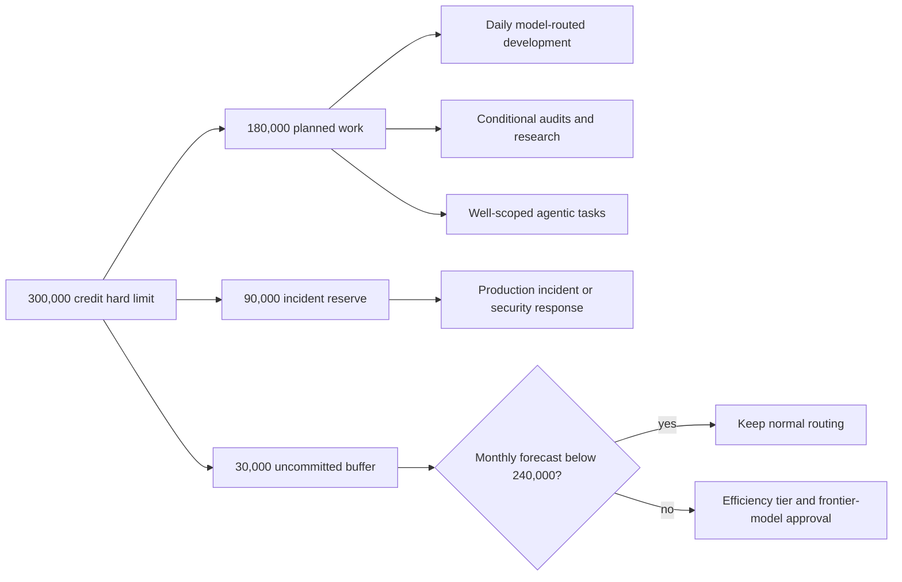
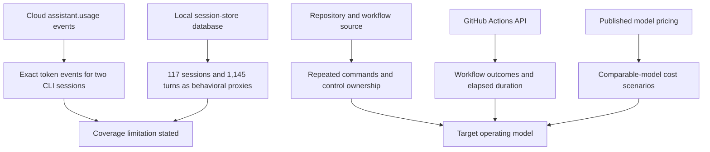
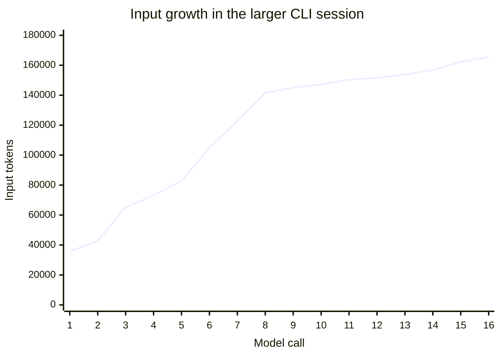
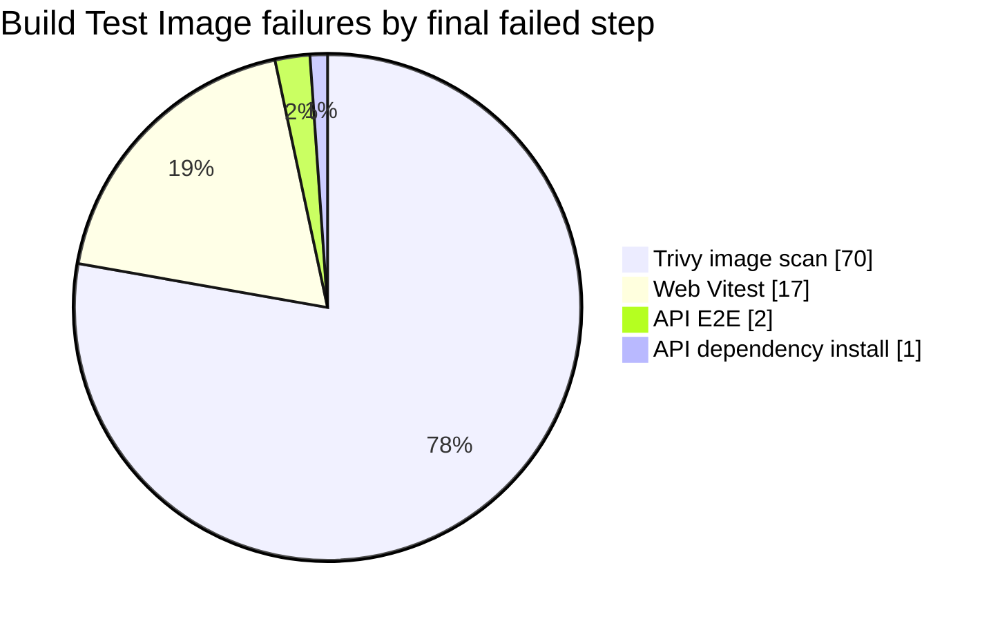
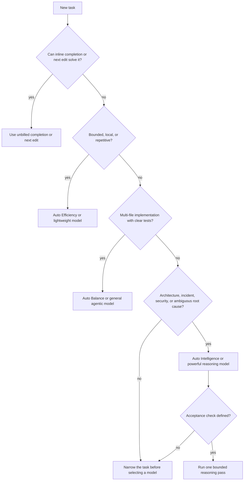
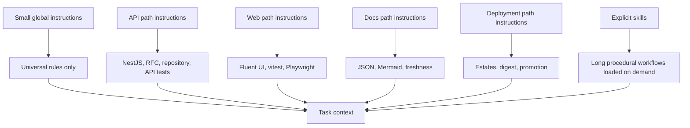
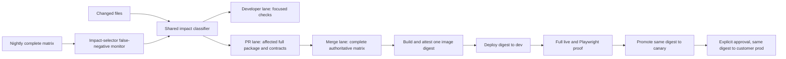
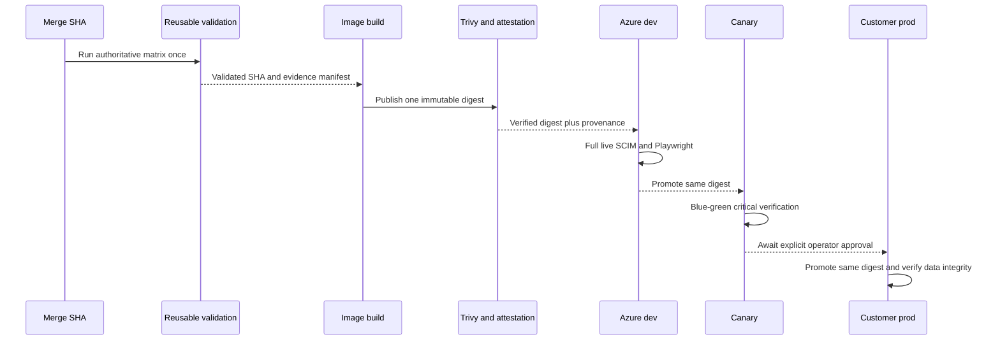
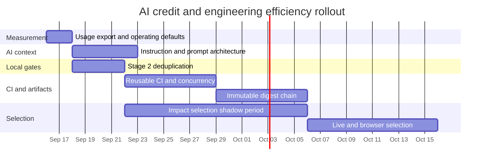

# AI credit and engineering efficiency operating model

> **Status:** Strategy and implementation plan
>
> **Measured:** 2026-09-15
>
> **Repository baseline:** SCIMServer `0.55.22`, commit `43386dbe`
>
> **Budget constraint:** 300,000 GitHub AI credits per calendar month

## Executive decision

SCIMServer should optimize two related but distinct systems:

1. **AI economics:** reduce unnecessary model input, route tasks to the least expensive model that can complete them correctly, and measure credits per accepted outcome.
2. **Engineering economics:** stop rebuilding and retesting the same commit through overlapping wrappers while preserving the test layers that catch different defect classes.

The measured evidence points to five priority actions:

| Priority | Action | Why it is first | Expected result |
|---|---|---|---|
| P0 | Make Auto Efficiency the default and reserve powerful models for explicit escalation | Current prices differ by more than an order of magnitude for the same tokens | Immediate credit reduction with no repository change |
| P0 | Prevent giant log pastes and compact or restart long sessions earlier | Two pasted test logs contributed 75.2 million stored characters; one CLI session grew to 165,583 input tokens per call | Smaller repeated input and better signal-to-noise |
| P0 | Reduce the repository-wide instruction payload and move conditional rules to path-specific files or skills | The global instruction file is 17,811 words and is eligible to accompany unrelated work | Lower baseline context on every applicable request |
| P0 | Remove duplicate Stage 2 executions and add an early vulnerability preflight | A full dev pipeline runs core suites two or three times; 70 image workflows reached the final Trivy step only to fail on one repeated advisory | Faster local and CI feedback without deleting assurance layers |
| P1 | Validate and promote one immutable image digest per commit | Dev still publishes and deploys tags while production resolves digests | One build, one scan, one attestation, one artifact through dev, canary, and production |

The proposed monthly operating target is **180,000 planned credits**, with **90,000 incident reserve** and **30,000 uncommitted buffer**. The 300,000 limit is a hard ceiling, not a consumption target.



## 1. What was measured

### 1.1 Evidence tiers

The analysis keeps four evidence tiers separate. This prevents a local proxy from being presented as a billing fact.

| Tier | Source | What it proves | What it does not prove |
|---|---|---|---|
| A - billed token event | Cloud session `assistant.usage` events | Model, input tokens, output tokens, event count | Complete company usage when cloud coverage is partial; exact historical price for a retired model |
| B - local behavioral proxy | Read-only VS Code session index | Sessions, turns, prompt characters, file references, agent surface, recorded checkpoints | Tokenization, cached-token quantity, dollar cost, credits |
| C - execution fact | Repository source and GitHub Actions API | Commands, duplication, workflow results, failure stage, elapsed duration | Causal credit consumption by an AI model |
| D - scenario | Current published model prices applied to observed tokens | Relative cost sensitivity to model choice and caching | Historical invoice amount or future guaranteed price |



### 1.2 Cloud token facts

The synchronized cloud store currently contains only two billable sessions. Both are Copilot CLI sessions in `AD-IAM-Services-SyncFabric`, not SCIMServer sessions. They are useful as exact examples but are not a complete monthly ledger.

| Metric | Measured value |
|---|---:|
| Sessions with cloud token events | 2 |
| Model | `claude-opus-4.6` |
| Usage events | 24 |
| Input tokens | 2,354,719 |
| Output tokens | 25,822 |
| Total tokens | 2,380,541 |
| Input-to-output ratio | 91.2:1 |
| Largest input event | 165,583 tokens |

Session details:

| Session | Usage events | Input tokens | Output tokens | Largest input event |
|---|---:|---:|---:|---:|
| Implement SafeFly create skill | 16 | 1,901,309 | 22,611 | 165,583 |
| Create SafeFly feature | 8 | 453,410 | 3,211 | 83,597 |

In the larger session, input per call grew from 35,952 to 165,583 tokens in about ten minutes. This is the clearest measured signal: **repeated context dominated generated output**.

If every event had remained at or below 60,000 input tokens, the two sessions would have processed at most 1,326,346 input tokens rather than 2,354,719. That is a **43.7% counterfactual reduction**. This is not a promise that compaction always produces that exact result; it establishes the size of the avoidable-context opportunity.



### 1.3 Local session behavior

The local index covers more activity than the cloud billing-event store:

| Agent or surface | All indexed sessions | Last 90 days | September 1-15 |
|---|---:|---:|---:|
| GitHub Copilot Chat | 74 | 27 | 9 |
| No agent label | 31 | 20 | 0 |
| Copilot CLI | 6 | 6 | 0 in the VS Code local index |
| Panel edit agent | 3 | 3 | 1 |
| Explore subagent | 2 | 0 | 0 |
| Conversation summarizer | 1 | 0 | 0 |

Repository distribution:

| Repository | Sessions | Turns |
|---|---:|---:|
| SCIMServer | 52 | 940 |
| SyncFabric | 30 | 195 |
| AD-UAG-Data | 4 | 10 |
| No repository metadata | 31 | 0 |

Monthly activity:

| Month | Sessions | Turns |
|---|---:|---:|
| 2026-05 | 48 | 435 |
| 2026-06 | 23 | 56 |
| 2026-07 | 24 | 261 |
| 2026-08 | 12 | 284 |
| 2026-09 through September 15 | 10 | 109 before the active-session refresh |

One long-running SCIMServer session now has 242 turns, about 1.41 million stored user-message characters, and 700 file-reference records. All 14 indexed sessions with more than 25 turns have zero recorded checkpoint rows. The current index therefore provides no evidence of successful explicit compaction in those sessions.

### 1.4 Giant payload finding

The largest stored prompt-like payloads were not normal requirements. Two were complete test-log pastes:

| Payload | Characters | Share of oversized human/other characters |
|---|---:|---:|
| Test log 1 | 60,593,547 | 80.3% |
| Test log 2 | 14,602,612 | 19.3% |
| All other human/other messages over 10,000 characters | 300,258 | 0.4% |

Together, the two logs account for 75,196,159 of 75,496,417 characters in human/other messages over 10,000 characters, or **99.6%**.

This yields a precise rule: **never paste a complete test or pipeline log into chat**. Keep it in a file or artifact, then provide the path and the question. Use search, head/tail, a failure parser, or a subagent to return only the discriminating lines.

### 1.5 Repository context footprint

Current automatically or frequently supplied context is large:

| File or set | Bytes | Lines | Words or count |
|---|---:|---:|---:|
| `.github/copilot-instructions.md` | 129,234 | 818 | 17,811 words |
| `Session_starter.md` | 391,139 | 590 | 49,900 words |
| `CHANGELOG.md` | 891,623 | 5,664 | 112,892 words |
| `README.md` | 56,539 | 1,509 | 6,536 words |
| `docs/CONTEXT_INSTRUCTIONS.md` | 30,493 | 452 | 3,336 words |
| 34 `.github/prompts/*.prompt.md` files | 394,889 | 7,126 | 34 files |
| `.github/instructions/` | 0 | 0 | no path-specific files |
| `.github/skills/` | 0 | 0 | no repository skills |
| `.github/agents/` | 0 | 0 | no repository agents |

GitHub documents that repository-wide custom instructions are added to applicable requests. Copilot CLI combines applicable instruction files, while path-specific files are included only when their `applyTo` pattern matches. Therefore, the global 17,811-word file is the first context architecture to change.

Important qualification: eligible context is not necessarily billed as uncached input on every request. The exact effect depends on the product, model, cache hit, and cache-write behavior. The measurable design defect is still valid: every unrelated request must consider a large body of conditional and historical material before reaching task-specific code.

### 1.6 Pipeline and workflow facts

Current orchestration footprint:

| Script | Lines | Main ownership |
|---|---:|---|
| `scripts/pre-push-checks.ps1` | 404 | Push-time static and API validation |
| `scripts/run-all-gates.ps1` | 680 | Stage 0-6 gate walker and prompt registry |
| `scripts/dev-deployment-pipeline.ps1` | 845 | Local validation, build, publish, deploy, live, Playwright |
| `scripts/test-all-modes.ps1` | 238 | API backend matrix and web tests |
| `scripts/live-test.ps1` | 16,026 | Wire-level integration contract |

A normal full dev deployment currently executes approximately:

| Suite | Direct Stage 2 | Inside `test-all-modes.ps1` | Other stage | Approximate total |
|---|---:|---:|---:|---:|
| API unit | 1 | 2 backends | pre-push or CI may have run it already | 3 local matrix executions |
| API E2E | 1 | 2 backends | pre-push or CI may have run in-memory | 3 local matrix executions |
| Web Vitest | 1 | 1 | coverage also executes tests | 2 explicit plus coverage work |
| Web coverage | 1 | 1 | none | 2 |
| Web production build | 1 | 0 | CI image workflow builds again | at least 2 across local and CI |
| Live SCIM | 0 | 0 | Docker and Azure dev | 2 complementary environments |
| Playwright | 0 | 0 | Azure dev | 1 full browser pass |

The Docker and Azure live runs are not automatically duplicates: they cover packaging, Prisma, ingress, environment configuration, and the deployed artifact. The direct Stage 2 runs followed by the full matrix are duplicates.

### 1.7 GitHub Actions facts

For workflow runs created from 2026-08-12 through 2026-09-15:

| Workflow | Runs | Success | Failure | Cancelled | Median elapsed | Total elapsed |
|---|---:|---:|---:|---:|---:|---:|
| Build Test Image | 123 | 33 | 90 | 0 | 6.35 min | 753.27 min |
| CodeQL | 188 | 187 | 1 | 0 | 3.00 min | 552.68 min |
| Dependency pins review | 20 | 20 | 0 | 0 | 0.47 min | 8.97 min |

These are workflow wall-clock durations, not a billing reconstruction of parallel runner-minutes.

Build Test Image failed steps:



The 70 Trivy failures consistently reported `CVE-2026-40345` in `deepmerge-ts` 7.1.5, reached through the Prisma CLI chain, with the advisory fixed in 8.0.0. The final image scan must remain. The waste is allowing a known dependency advisory to reach the final scan after installation, lint, tests, web build, and image build.

None of the inspected workflows currently has a `concurrency` key. Several same-workflow, same-branch runs overlapped. Validation branches should cancel superseded work; production deployment should queue rather than cancel.

### 1.8 Client and document-viewer state

The installed clients meet GitHub's usage-based billing display minimums:

| Client | Measured version | GitHub minimum | Result |
|---|---:|---:|---|
| VS Code | 1.137.0 | 1.120 | PASS |
| Copilot CLI | 1.0.59 | 1.0.48 | PASS |

The Mermaid content gate rendered all 692 repository diagrams in both themes under strict security. The viewer doctor found a separate local environment issue: `bierner.markdown-mermaid@1.32.1` is installed alongside VS Code's built-in Mermaid renderer. Both can inject preview scripts into the same webview, which can produce a blank diagram even when the content renders cleanly. The doctor also reports the built-in package version as `0.0.0`, so its metadata cannot currently prove version parity with the repository's Mermaid 11.15.0 gate.

Remediation is environment-only: uninstall `bierner.markdown-mermaid`, reload VS Code, and rerun `npm run docs:mermaid:doctor`. Do not change diagram content to address this viewer conflict.

## 2. Billing model and cost interpretation

### 2.1 Current GitHub AI credit model

As of 2026-09-15, GitHub states:

- 1 AI credit equals $0.01 USD.
- Input, cached input, cache write, and output tokens can have different prices.
- Prices are quoted per one million tokens.
- Copilot Chat, CLI, cloud agent, Spaces, Spark, and third-party coding agents consume credits.
- Code completions and next-edit suggestions are not billed in AI credits on paid plans.
- Copilot Business and Enterprise included credits are pooled at the billing-entity level.
- There is no automatic fallback to a cheaper model when a user budget is exhausted.
- The monthly pool resets at 00:00:00 UTC on the first day of the month and does not roll over.

For a single interaction:

$$
\text{credits} = 100 \times \left(
\frac{T_i P_i + T_c P_c + T_w P_w + T_o P_o}{1{,}000{,}000}
\right)
$$

where:

- $T_i$ = uncached input tokens
- $T_c$ = cached input tokens
- $T_w$ = cache-write tokens
- $T_o$ = output tokens
- $P_i, P_c, P_w, P_o$ = published dollar prices per one million tokens

The company limit of 300,000 credits is therefore a $3,000 usage ceiling.

### 2.2 Representative current model economics

The table converts current published dollar prices into credits per one million tokens. Availability remains subject to enterprise policy.

| Model | Intended role | Input credits | Cached input credits | Cache-write credits | Output credits |
|---|---|---:|---:|---:|---:|
| MAI-Code-1.1-Flash | Lightweight coding and tool use | 20 | 2 | N/A | 120 |
| GPT-5.6 Luna | Fast repetitive work | 20 | 2 | 25 | 120 |
| GPT-5 mini | General coding and reasoning | 25 | 2.5 | N/A | 200 |
| GPT-5.4 mini | Codebase exploration and agentic search | 75 | 7.5 | N/A | 450 |
| GPT-5.3-Codex | Agentic software development | 175 | 17.5 | N/A | 1,400 |
| GPT-5.6 Terra | Balanced coding and agent work | 200 | 20 | 250 | 1,200 |
| Claude Sonnet 5 | General complex coding | 200 | 20 | 250 | 1,000 |
| GPT-5.6 Sol | Deep reasoning and debugging | 400 | 40 | 500 | 2,000 |
| Claude Opus 5 | Deep reasoning and debugging | 500 | 50 | 625 | 2,500 |
| GPT-6 Astra | Long-horizon autonomous work | 1,000 | 100 | 1,250 | 5,000 |

Long-context tiers can cost more. For example, GPT-5.6 Luna input doubles above its published 200K threshold, and GPT-5.6 Sol input doubles above 272K. The default must therefore be regular context and regular reasoning unless the task demonstrates a need for more.

### 2.3 Same-token scenario

Applying current model prices to the observed 2,354,719 input and 25,822 output tokens illustrates sensitivity. It does **not** price historical Opus 4.6 usage.

| Scenario | Assumption | Approximate credits |
|---|---|---:|
| MAI-Code-1.1-Flash | All input uncached, same token quantities | 50.2 |
| GPT-5 mini | All input uncached, same token quantities | 64.0 |
| Claude Sonnet 5 | All input uncached, same token quantities, no cache write included | 496.8 |
| Claude Opus 5 | All input uncached, same token quantities, no cache write included | 1,241.9 |
| Claude Opus 5 | All input cached, same output, no cache-write charge included | 182.3 |

Model choice changes the uncached scenario by about 24.7 times between MAI-Code-1.1-Flash and Claude Opus 5. Caching narrows the difference, but an oversized context can still create cache-write cost and makes a miss expensive.

## 3. AI operating model

### 3.1 Default task router

Use Auto with the **Efficiency** tier as the default. GitHub currently provides a 10% Auto discount and routes along natural cache boundaries. Do not switch models repeatedly inside one conversation merely to compare answers.



### 3.2 Model policy by work type

| Work type | Default | Escalate when | Do not use by default |
|---|---|---|---|
| Syntax, small utility, formatting, renames, summaries | Inline completion, MAI-Code Flash, Luna, GPT-5 mini, or Auto Efficiency | Focused check fails twice for different reasons | Opus, Sol, Astra, Fable |
| Search, file inventory, doc link audit, test selection | GPT-5.4 mini or Auto Efficiency | Search results are ambiguous across architectural boundaries | Frontier long-horizon model |
| Normal feature, bug fix, test authoring | GPT-5 mini, GPT-5.3-Codex, Terra, Sonnet 5, or Auto Balance | Cross-module reasoning or repeated falsified hypothesis | Astra or Opus for the whole session |
| Architecture and design alternatives | Sol, GPT-5.5, Sonnet, Opus, or Auto Intelligence | Only after a concise evidence pack exists | Extended context before scoping |
| Production incident or security analysis | Powerful reasoning model with one exact timeline and evidence bundle | Legal, privacy, or cross-estate uncertainty needs additional review | Multiple parallel frontier chats on the same raw logs |
| Long autonomous backlog item | Cloud agent, Astra, or Fable only with a small issue and executable acceptance gate | Task cannot fit one bounded issue | A broad epic with no stopping condition |
| Visual UI diagnosis | Multimodal general model plus Playwright screenshot and measured bounds | Cross-browser or accessibility behavior differs | Text-only reasoning without viewing artifacts |

### 3.3 Surface policy

| Surface | Best use | Cost control |
|---|---|---|
| Inline completion and next edit | Predictable code, boilerplate, local transformations | Prefer first because it is not billed in AI credits |
| VS Code Chat | Interactive code changes tied to open files and diagnostics | New thread per task; close irrelevant files; use focused tools |
| Copilot CLI | Terminal, GitHub, MCP, and operational workflows | Run `/context`; use regular context; compact before 60K; exit after the workflow |
| Read-only subagent | Repository research, log classification, source triangulation | Return one summary rather than importing every read into the main context |
| Cloud agent | Independent issue with repository-only scope and CI-verifiable outcome | Remember it consumes both AI credits and GitHub Actions minutes |
| Copilot code review | High-risk or externally reviewed diffs | Trigger once per stable diff, not after every small amendment |

### 3.4 Context controls

#### For Copilot CLI

1. Run `/context` before a substantial task.
2. Use regular context and regular reasoning by default.
3. At 50,000 input tokens, stop adding broad sources and inspect what occupies context.
4. At 60,000 input tokens, run `/compact` unless a near-term operation depends on exact recent wording.
5. At 90,000 input tokens, start `/new` unless the task is an approved long-context exception.
6. Start a new session when changing from research to implementation, from implementation to deployment, or from one repository to another.
7. Use `/instructions` to inspect which instruction files were discovered and disable irrelevant optional files.

#### For VS Code Chat

1. Start a new thread for a new task or workstream.
2. Keep only relevant files open and attach exact files or selections.
3. Delegate broad read-only research and request a concise evidence report.
4. Do not carry deployment logs into a subsequent feature-design conversation.
5. Use the session index monthly to find sessions over 25 turns with no checkpoint or task boundary.

#### Payload rule

Never paste a complete log, transcript, generated API payload collection, or test artifact over 20,000 characters. Put it in a file and ask for a bounded query such as:

```text
Analyze test-results/api-e2e.log.
Return only distinct failing suites, the first causal stack for each,
and whether later failures are cascades. Do not quote passing output.
```

### 3.5 Instruction architecture target

The repository-wide instruction file should contain only universal rules that apply to nearly every task. Target: **1,200-2,000 words**, rather than 17,811.

Proposed structure:

| File | Applies to | Content |
|---|---|---|
| `.github/copilot-instructions.md` | Entire repository | Safety, no destructive Git, core architecture, universal validation routing, links to canonical docs |
| `.github/instructions/api.instructions.md` | `api/**/*.ts`, Prisma and API tests | NestJS, repository parity, RFC contracts, API unit/E2E commands |
| `.github/instructions/web.instructions.md` | `web/**/*` | Fluent UI, Playwright rule, layout measurement, vitest boundaries |
| `.github/instructions/docs.instructions.md` | `**/*.md`, doc scripts | Pretty code blocks, JSON parsing, Mermaid render gate, doc freshness |
| `.github/instructions/deployment.instructions.md` | workflows, Docker, infra, deployment scripts | Estate registry, tenant isolation, digest promotion, prod approvals |
| `.github/instructions/security.instructions.md` | auth, security, workflows, dependency files | Secret handling, auth tests, supply-chain policy, security audits |
| Repository skills | Explicit workflows | Dev deploy, live-section authoring, RCA reconciliation, tenant rollover |

Do not place `@` references to huge historical files in the global CLI instructions. Copilot CLI reads referenced files immediately, which recreates the same context problem under another name.

`Session_starter.md` should become a short current-state handoff with links to archived history. `CHANGELOG.md` remains the historical source; it should be searched, not injected wholesale.



### 3.6 Prompt and audit consolidation

The current 34 prompt files contain useful institutional knowledge, but invoking multiple prompts independently causes each audit to rediscover the diff and repository context.

Target pattern:

1. Mechanical checks run first.
2. One script produces a small evidence manifest: changed paths, risk classes, test results, API-contract changes, dependency changes, and deployment impact.
3. A lightweight model classifies which judgment audits apply.
4. Applicable audits receive the same evidence bundle, not the full repository history.
5. A powerful model is used only for findings that cross an architectural or security boundary.
6. The final audit disposition records `PASS`, `FAIL`, or `WAIVED` with reason. `PENDING` is not release-ready.

| Changed area | Required AI judgment | Usually unnecessary |
|---|---|---|
| Documentation only | Accuracy, source traceability, reader usability | Full security, performance, persistence parity |
| Web component | UI behavior, accessibility, Playwright outcome | RFC audit unless SCIM wire behavior changes |
| SCIM service or controller | Contract, error, RFC, logging | Infrastructure review unless deployment surface changes |
| Auth or credential code | Security, contract, logging, live auth behavior | Broad UI review when no UI changed |
| Prisma or repository | Migration, parity, data integrity, performance | Visual review |
| Workflow, Docker, Azure | Supply chain, artifact identity, deployment safety | Domain-unit test gap audit unless runtime code changed |

## 4. Engineering execution model

### 4.1 Principle: remove repeated execution, not independent evidence

Unit, E2E, backend parity, live HTTP, browser, security scan, and deployment verification have all caught different bugs in this repository. The target model keeps each layer and changes **when** and **how often** it runs.



### 4.2 Three validation lanes

#### Lane A - developer feedback

Target: under five minutes for a normal local edit.

- Typecheck or build the touched package.
- Run tests by exact path or dependency relationship.
- Run the affected live section for any wire-visible behavior.
- Run the affected Playwright spec for a UI behavior.
- Keep Jest and Vitest caches enabled.
- Save full logs to files and print only failures plus summary.

Jest supports `--findRelatedTests`, `--changedSince`, exact paths, projects, and shards. Vitest supports file filters, line filters, names, and tags; its guidance explicitly recommends adding a file path so unrelated test files are not loaded.

#### Lane B - pre-push and pull request

Target: high confidence without repeating the merge lane.

- Always run static safety and structural contract gates.
- Keep current full API unit and in-memory E2E pre-push behavior until impact selection has proven itself in shadow mode.
- Run web build and coverage only when web or shared types changed.
- Run Prisma checks only for Prisma, repository, migration, or persistence-sensitive changes.
- Cancel superseded branch and pull-request runs.
- Run dependency/advisory preflight before expensive tests.

#### Lane C - merge, release, and deployment

- Run one complete authoritative backend and web matrix per merge SHA.
- Build one image from that validated SHA.
- Run the final image scan and create provenance attestation.
- Deploy and promote the digest, not a tag.
- Run full live SCIM and Playwright on Azure dev.
- Run a deployment-critical subset on canary and customer production, plus data/ID integrity.
- Keep a scheduled full estate verification for additional drift detection.

### 4.3 Shared impact matrix

| Changed paths or symbols | Lane A | Lane B | Lane C |
|---|---|---|---|
| Pure API domain/helper | Related unit tests | Full API unit and affected E2E | Full merge matrix |
| Controller, guard, middleware | Related unit plus route-binding test | Full API unit and in-memory E2E | Both backends plus live affected sections |
| Repository or `isInMemoryBackend` branch | Both implementation unit suites | Both backend API modes | Full matrix plus Docker/Prisma live |
| Prisma schema or migration | Migration lint and focused repository tests | Prisma generate, Prisma E2E, migration audit | Image boot and Docker live before Azure |
| Web component/page/route | Related Vitest, web typecheck | Web coverage, build, size, affected Playwright | Full Playwright on dev |
| Visual/layout CSS | Related structural test | Build and measured Playwright bounds | Dev screenshots and operator verification |
| Auth, OAuth, credentials, WIF | Focused auth unit/E2E | Full API matrix and security audit | Live auth sections plus real-IdP proof when relevant |
| Docker, workflow, deploy, infra | Syntax and contract tests | Image build, infra and supply-chain audits | Digest proof, smoke, live, data integrity |
| Docs only | Link, JSON, Mermaid parse | Mermaid render, freshness, content truth | No image or Azure deploy |

### 4.4 Immediate Stage 2 deduplication

Make `test-all-modes.ps1` the single Stage 2 executor in the full dev pipeline:

1. Remove direct Stage 2 API unit, API E2E, Web Vitest, and web coverage calls from `dev-deployment-pipeline.ps1`.
2. Keep API build, lint, web typecheck, web build, and size as static gates.
3. Make matrix output include suite counts, coverage thresholds, backend, duration, and log artifact.
4. Within `test-all-modes.ps1`, remove the standalone Web Vitest pass when the coverage pass already executes the same tests, unless a measured coverage overhead makes the plain run useful for failure diagnosis.
5. Add a contract test that fails if the deployment pipeline calls a Stage 2 command outside the matrix.

This change removes repetition while retaining API unit on both backends, API E2E on both backends, web behavior, and coverage.

### 4.5 One gate registry

Create one machine-readable registry with:

- gate ID and owner
- command
- risk class
- path and symbol triggers
- prerequisites
- environments
- expected evidence artifact
- full versus focused mode
- timeout and concurrency policy
- release-blocking semantics

`pre-push-checks.ps1`, `run-all-gates.ps1`, `test-all-modes.ps1`, and `dev-deployment-pipeline.ps1` should consume this registry rather than repeat commands and baselines.

The registry does not need to contain deployment implementation. It should route to a deployment-owned command. This keeps the registry from becoming a new god-script.

### 4.6 Early failure ordering

Order gates by expected information gained per unit cost:

1. Syntax and configuration parse.
2. Lockfile provenance and dependency advisory preflight.
3. Static build and lint.
4. Focused tests.
5. Full package tests.
6. Cross-backend matrix.
7. Image build.
8. Final image Trivy scan.
9. Deploy.
10. Live and browser validation.

For the repeated `deepmerge-ts` advisory, add a pre-build Trivy filesystem/SBOM or equivalent lockfile-aware scan after dependency installation and before the test matrix. Keep the final image scan because it also detects OS, packaging, and installed-resolution differences.

### 4.7 Build once and promote by digest

Current production promotion already resolves a digest. Extend that invariant to dev and CI.



Target GitHub Actions structure:

1. `validate.yml` with `workflow_call` owns API and web validation.
2. `build-image.yml` calls validation, builds once, scans, attests, and returns the digest.
3. Branch image workflows call the reusable workflow only when runtime packaging requires an image.
4. Release tagging retags the existing digest with `buildx imagetools create`; it does not rebuild source.
5. Deployment accepts a digest and verifies the Container App revision uses it.
6. The application version endpoint remains a useful semantic check but is not artifact identity.

### 4.8 Concurrency and caching

For branch and pull-request validation:

```yaml
concurrency:
  group: ${{ github.workflow }}-${{ github.ref }}
  cancel-in-progress: true
```

For a production estate, queue deployments rather than cancelling a promotion mid-flight:

```yaml
concurrency:
  group: scimserver-customer-prod
  queue: max
```

Caching policy:

- Use `setup-node` npm caches keyed by lockfile.
- Add consistent BuildKit registry caching to all image-building workflows.
- Permit cache writes only from trusted triggers.
- Use restore-only cache access for low-trust workflows.
- Never cache credentials, generated secret material, or mutable deployment state.
- Keep a scheduled no-cache image build to detect hidden environmental dependencies.

### 4.9 Live-test and Playwright evolution

Do not immediately shard `scripts/live-test.ps1`. Its sections share resources, flags, credentials, and cleanup state.

First create a section manifest containing:

- section ID
- capability and risk tags
- changed-path triggers
- prerequisite sections
- resources created and cleaned
- mutating versus non-mutating
- supported environments
- safe parallel group

Then introduce:

- affected-section smoke during development
- full sequential live suite on merge/release and Azure dev
- critical non-destructive subset for canary and customer prod
- full scheduled estate drift verification

For Playwright, shard only tests proven independent and merge blob reports. Keep stateful estate mutations serial. Continue measuring layout outcomes rather than merely checking element presence.

## 5. Monthly credit control plane

### 5.1 Budget allocation

Until the company billing export provides complete surface and model attribution, use this conservative allocation:

| Category | Planned credits | Policy |
|---|---:|---|
| Routine coding and focused debugging | 45,000 | Auto Efficiency or lightweight/general model |
| Test generation, review, and maintenance | 25,000 | Diff-bounded; one review per stable change |
| Research and documentation | 25,000 | Read-only subagent and evidence bundle first |
| Deep architecture, security, and performance | 45,000 | Powerful model only with a written decision question |
| Bounded autonomous agent tasks | 25,000 | Executable acceptance check and repository-only scope |
| Experiments and model comparison | 15,000 | Timeboxed; never on production secrets or giant context |
| **Planned subtotal** | **180,000** | 60% of hard limit |
| Production/security incident reserve | 90,000 | Requires incident or explicit operator release |
| Uncommitted buffer | 30,000 | Protects measurement error and late-month demand |
| **Hard limit** | **300,000** | No routine plan may consume the reserve by default |

### 5.2 Forecast and alerts

$$
\text{forecast} =
\frac{\text{credits used}}{\text{elapsed calendar days}}
\times
\text{days in month}
$$

| Threshold | September amount | Action |
|---|---:|---|
| 25% | 75,000 | Check model mix, largest sessions, and cache ratio |
| 50% | 150,000 | Require Auto Efficiency for routine work |
| 60% planned target | 180,000 | Freeze experiments; review forecast and remaining roadmap |
| 70% | 210,000 | Powerful models require explicit justification |
| 80% | 240,000 | Incident reserve only; split or defer noncritical long tasks |
| 90% | 270,000 | Stop nonincident billable agent work |
| 100% | 300,000 | Company hard stop; there is no automatic cheap-model fallback |

At a 180,000 planned target, average planned burn is about 6,000 credits per calendar day in a 30-day month, or about 8,182 per 22-workday month. Use the monthly forecast rather than forcing each day to match the average.

### 5.3 Required telemetry

Request or enable the enterprise billing export needed to measure:

- date and user
- repository and organization
- product surface
- model
- input, cached input, cache write, and output tokens
- AI credits
- cost center
- code-review Actions minutes

Join it to a small local task ledger:

| Field | Purpose |
|---|---|
| Task or issue ID | Connect cost to an outcome |
| Work type | Coding, review, incident, research, deploy |
| Model policy chosen | Explain routing |
| Accepted result | Separate useful work from retries |
| Rework turns | Detect poor scoping or wrong model |
| Tests and deployment outcome | Connect AI work to engineering quality |

Primary efficiency metric:

$$
\text{AI efficiency} =
\frac{\text{accepted outcomes}}{\text{AI credits}}
$$

Do not optimize token count alone. A cheap response that causes three repair rounds can cost more and reduce quality.

## 6. Metrics and targets

### 6.1 AI metrics

| Metric | 30-day target | Guardrail |
|---|---:|---|
| Auto Efficiency or lightweight share | At least 70% of routine interactions | Do not force lightweight models onto incidents |
| Powerful-model credit share | At most 20% outside incidents | Architecture/security exceptions documented |
| Sessions over 25 turns without task boundary | Reduce by 75% | Long single-purpose sessions may continue with compaction |
| Input/output ratio | Median below 25:1 | Research can exceed it if context is selected and cached |
| Prompts over 20,000 characters | Zero raw log pastes | File path plus bounded query replaces paste |
| Global instruction words | 1,200-2,000 | Universal safety rules must remain |
| Credits per accepted PR or resolved incident | Baseline first, then reduce 20% | Track quality and rework simultaneously |

### 6.2 Engineering metrics

| Metric | Target |
|---|---:|
| Full Stage 2 executions per dev deployment | 1 authoritative matrix |
| Image builds per merge SHA | 1 |
| Digest equality across dev, canary, and prod | 100% |
| Superseded validation runs | Cancelled automatically |
| Known-advisory failures reaching final image scan | 0 after early preflight, while final scan stays enabled |
| `PENDING` audits on a release-ready report | 0; use PASS, FAIL, or WAIVED with reason |
| Full matrix false negatives from impact selection | 0 during shadow period |
| DORA throughput and instability | Track lead time, deploy frequency, failed-deploy recovery, change fail rate, and deployment rework together |

DORA cautions against using one metric as a goal and reports that speed and stability are not opposing outcomes. This plan therefore pairs credit and lead-time reduction with failure, rework, and escape metrics.

## 7. Implementation plan

### Wave 0 - measurement and immediate behavior

**Duration:** 1-2 days

1. Obtain the company AI-credit usage export or dashboard access.
2. Keep VS Code and Copilot CLI above GitHub's billing-display minimums; the measured 1.137.0 and 1.0.59 clients currently pass.
3. Set Auto Efficiency as the normal default.
4. Adopt the 20,000-character payload rule and 50K/60K/90K context thresholds.
5. Start a new chat per task and a new CLI session at each workflow boundary.
6. Record the first weekly model and surface baseline.

**Done when:** current-month credits can be attributed by model and surface, and no raw complete log is pasted during the observation week.

### Wave 1 - instruction and prompt architecture

**Duration:** 3-5 days

1. Inventory each rule in `.github/copilot-instructions.md` as universal, path-specific, workflow-specific, historical, or duplicate.
2. Write characterization checks for critical rules before moving them.
3. Reduce the global file to 1,200-2,000 words.
4. Add API, web, docs, deployment, and security path-specific instruction files.
5. Convert long procedures into explicit repository skills.
6. Reduce `Session_starter.md` to current state and links; preserve history in Git.
7. Use `/instructions` in CLI and reference inspection in VS Code to prove only intended files apply.

**Done when:** critical rules remain discoverable, path-specific tasks receive the right rules, unrelated tasks no longer receive the full 17,811-word payload, and a negative-control task proves conditional instructions do not leak into unrelated paths.

### Wave 2 - local gate deduplication

**Duration:** 2-4 days

1. Make `test-all-modes.ps1` authoritative for Stage 2.
2. Remove direct Stage 2 duplicates from the dev pipeline.
3. Run one web coverage pass rather than plain Vitest plus coverage in the same full matrix.
4. Emit structured duration, count, backend, and result artifacts.
5. Add contract tests that detect duplicate ownership.

**Done when:** one full dev dry run lists each Stage 2 mode exactly once and the complete matrix remains green.

### Wave 3 - CI fail-fast, reuse, and concurrency

**Duration:** 4-7 days

1. Add an early dependency vulnerability preflight.
2. Extract reusable validation with `workflow_call`.
3. Add cancellation for superseded branch and pull-request runs.
4. Queue deployment workflows by estate.
5. Add consistent BuildKit cache with trusted-writer policy.
6. Preserve a scheduled no-cache build.

**Done when:** a negative-control vulnerable lockfile fails before full tests and image build; a superseded branch run cancels; a production deployment queues; the final image scan still runs.

### Wave 4 - immutable artifact chain

**Duration:** 4-7 days

1. Build one image from the validated merge SHA.
2. Scan and attest the digest.
3. Return digest and evidence manifest from the reusable workflow.
4. Deploy that digest to Azure dev.
5. Verify revision image digest, app version, and source SHA.
6. Promote the same digest to canary and customer prod.
7. Retag releases without rebuilding.

**Done when:** an automated equality check proves the same digest at every estate and a negative control rejects a tag-only or mismatched deployment.

### Wave 5 - impact selection in shadow mode

**Duration:** 2 weeks of observation

1. Add a shared changed-path and symbol classifier.
2. Produce the focused test plan but continue running the full merge matrix.
3. Compare every full-suite failure with the focused selection.
4. Expand mappings for any missed dependency.
5. Only shorten pre-push after zero false negatives across the observation period.

**Done when:** every full-suite failure was selected by the classifier for two weeks or at least 30 representative changes, whichever is longer.

### Wave 6 - live and browser selection

**Duration:** 1-2 weeks

1. Create the live-section manifest and dependency graph.
2. Add affected-section execution for development.
3. Classify Playwright tests as independent, stateful, visual, destructive, or production-safe.
4. Shard only independent tests.
5. Keep full sequential Azure dev validation and scheduled full estate validation.

**Done when:** focused runs are demonstrably smaller, full release evidence is unchanged, cleanup remains reliable, and no production-unsafe test enters the customer-prod subset.



## 8. Risk register

| Risk | Failure mode | Mitigation | Proof |
|---|---|---|---|
| Over-aggressive test selection | A changed dependency is not mapped and a defect escapes | Shadow mode plus full merge/nightly matrix | Mutation or known-defect negative controls |
| Instruction split loses a critical rule | Agent omits a security or deployment constraint | Characterization inventory and path negative controls | `/instructions` and reference inspection |
| Lightweight model causes rework | Lower per-token cost but more repair turns | Escalate after two falsified local attempts; measure accepted outcomes | Credits plus rework dashboard |
| Auto chooses an unsuitable model | Quality falls on a specialized task | Use Auto Intelligence or explicit model for documented high-risk classes | Acceptance test and reviewer disposition |
| Early vulnerability scan differs from image scan | Preflight passes while image remains vulnerable | Keep final image Trivy scan authoritative | Negative controls at both stages |
| Cache poisoning | Low-trust workflow writes executable cache content | Trusted writers and read-only low-trust restores | Workflow policy test |
| Digest and semantic version diverge | Correct digest reports wrong app version or vice versa | Verify digest, SHA, and version independently | Deployment evidence manifest |
| Live-test sharding corrupts shared state | Parallel sections race flags or cleanup | Manifest dependencies first; shard only proven independent groups | Repeated clean-state run |
| Budget gaming | Team optimizes credits while quality or lead time worsens | Pair credits with rework, escapes, and DORA metrics | Monthly balanced review |
| Partial billing data misleads decisions | Two cloud sessions are treated as all usage | Label coverage and obtain enterprise export | Coverage ratio shown on dashboard |

## 9. Decisions and non-goals

### Decisions

- Preserve independent assurance layers.
- Remove duplicate ownership and duplicate execution.
- Use Auto Efficiency as the routine default.
- Escalate models by task risk and failed evidence, not preference.
- Use regular context and reasoning by default.
- Treat a full log as an artifact, not a prompt.
- Build once and promote a digest.
- Introduce impact selection only through a shadow period.
- Keep full Azure dev and scheduled estate proof.

### Non-goals

- Do not bypass the corporate npm registry or seven-day quarantine.
- Do not lower Trivy, CodeQL, test coverage, or live-test standards to save time.
- Do not delete the incident reserve to increase routine capacity.
- Do not introduce a policy DSL for model routing or gate selection before a simple table and script prove insufficient.
- Do not use a frontier model merely because the context window is available.
- Do not infer complete company spend from the two synchronized token sessions.

## 10. Source register

### Local measured sources

- [`.github/copilot-instructions.md`](../../.github/copilot-instructions.md)
- [`Session_starter.md`](../../Session_starter.md)
- [`scripts/pre-push-checks.ps1`](../../scripts/pre-push-checks.ps1)
- [`scripts/run-all-gates.ps1`](../../scripts/run-all-gates.ps1)
- [`scripts/dev-deployment-pipeline.ps1`](../../scripts/dev-deployment-pipeline.ps1)
- [`scripts/test-all-modes.ps1`](../../scripts/test-all-modes.ps1)
- [`scripts/live-test.ps1`](../../scripts/live-test.ps1)
- [`.github/workflows/build-test.yml`](../../.github/workflows/build-test.yml)
- [`.github/workflows/build-and-push.yml`](../../.github/workflows/build-and-push.yml)
- [`.github/workflows/publish-ghcr.yml`](../../.github/workflows/publish-ghcr.yml)
- [`docs/strategy/ENGINEERING_LESSONS_AND_PATTERNS.md`](ENGINEERING_LESSONS_AND_PATTERNS.md)

Local session analysis used the read-only VS Code Chronicle index at `session-store.db`. Billing-event analysis used Chronicle cloud `assistant.usage` events. GitHub Actions measurements used the GitHub CLI and Actions API against `pranems/SCIMServer`.

### External current sources

- [GitHub models and pricing](https://docs.github.com/en/copilot/reference/copilot-billing/models-and-pricing) - token categories, current prices, credit conversion, unbilled completions
- [Usage-based billing for organizations and enterprises](https://docs.github.com/en/copilot/concepts/billing/organizations-and-enterprises/usage-based-billing) - pooled credits, budgets, reset, client minimum versions
- [Copilot Auto model selection](https://docs.github.com/en/copilot/concepts/models/auto-model-selection) - Efficiency/Balance/Intelligence tiers, 10% discount, cache-boundary routing
- [Copilot model comparison](https://docs.github.com/en/copilot/reference/ai-models/model-comparison) - recommended models by task
- [Copilot prompt engineering](https://docs.github.com/en/copilot/concepts/prompting/prompt-engineering) - relevant context, task decomposition, fresh threads
- [Copilot CLI context management](https://docs.github.com/en/copilot/concepts/agents/copilot-cli/about-copilot-cli) - `/context`, `/compact`, regular versus extended context and reasoning
- [Copilot CLI custom instructions](https://docs.github.com/en/copilot/how-tos/copilot-cli/customize-copilot/add-custom-instructions) - applicable instruction combination and `/instructions`
- [Repository custom instructions](https://docs.github.com/en/copilot/customizing-copilot/adding-repository-custom-instructions-for-github-copilot) - global and path-specific instruction behavior
- [GitHub reusable workflows](https://docs.github.com/en/actions/sharing-automations/reusing-workflows) - `workflow_call`, outputs, and secret boundaries
- [GitHub workflow concurrency](https://docs.github.com/en/actions/how-tos/write-workflows/choose-when-workflows-run/control-workflow-concurrency) - cancellation and deployment queues
- [GitHub dependency caching](https://docs.github.com/en/actions/using-workflows/caching-dependencies-to-speed-up-workflows) - cache keys and secure access
- [GitHub artifact attestations](https://docs.github.com/en/actions/concepts/security/artifact-attestations) - provenance and reusable workflow guidance
- [Azure Container Apps revisions](https://learn.microsoft.com/en-us/azure/container-apps/revisions) - immutable revisions, labels, and blue-green behavior
- [Azure Container Apps traffic splitting](https://learn.microsoft.com/en-us/azure/container-apps/traffic-splitting) - direct revision validation and traffic movement
- [Jest CLI](https://jestjs.io/docs/cli) - related tests, changed-since selection, projects, caching, and sharding
- [Vitest test filtering](https://vitest.dev/guide/filtering.html) - file, name, line, and tag filtering
- [Playwright sharding](https://playwright.dev/docs/test-sharding) - independent shards and merged reports
- [DORA software delivery performance metrics](https://dora.dev/guides/dora-metrics-four-keys/) - balanced throughput and instability measurement

## 11. Validation record

| Check | Result |
|---|---|
| File-scoped Mermaid grammar | PASS, 9/9 blocks |
| Real Chromium Mermaid render | PASS, 692 repository blocks in both themes under strict security |
| Documentation content truth | PASS, 25 user-facing docs |
| Documentation freshness | PASS, 25 user-facing docs at version 0.55.22 |
| Added-line Unicode dash scan | PASS, no U+2013 or U+2014 |
| Local Markdown links | PASS |
| Markdown fence balance | PASS, 12 opening and 12 closing fences |
| Live SCIM gate against registry-resolved dev | PASS, 1,483/1,483 in 169.2 seconds; cleanup complete |
| Large-file diff shape | PASS, one insertion and zero deletions in both `docs/INDEX.md` and `Session_starter.md` |

The Mermaid viewer doctor still reports the local marketplace/built-in renderer conflict described in Section 1.8. That is an environment warning, not a content-gate failure.

## 12. Self-improvement dispositions

### Test and gate improvement

**Applied in this analysis:** data sources are explicitly tiered, the local session character aggregation was corrected after detecting a turn-to-file Cartesian multiplication, and giant synthetic/terminal payloads were separated from human prompts before drawing conclusions.

**Scheduled:** add machine-checkable controls for duplicate Stage 2 ownership, early advisory failure, one image per SHA, digest equality, instruction applicability, and impact-selector shadow comparison in Waves 1-5.

### Design and architecture disposition

**Accepted for the document-only change:** no runtime class, service, controller, or dependency edge changed. The proposed target reduces orchestrator overlap through one gate registry and one artifact chain. A new generalized policy engine is deliberately rejected until simple data and scripts prove insufficient.
