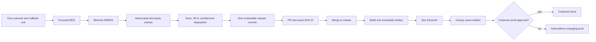
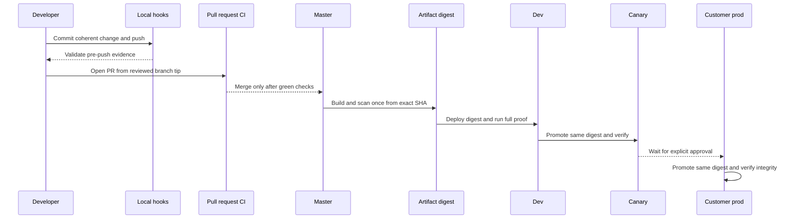

# AI-efficient change delivery process

> **Status:** Active operating process
>
> **Adopted:** 2026-09-16
>
> **Applies to:** planning, implementation, validation, commit, pull request,
> merge, deployment, and AI-session boundaries
>
> **Evidence base:**
> [AI credit and engineering efficiency operating model](AI_CREDIT_AND_ENGINEERING_EFFICIENCY_OPERATING_MODEL_2026-09-15.md),
> commit `df8435251a6c999f867b5ca601cf5dc4921e0f7d`, and the measured v0.55.23
> W3.5 execution in
> [WAVE3_W3_5_IMPLEMENTATION_REPORT.md](../auth/WAVE3_W3_5_IMPLEMENTATION_REPORT.md)

## 1. Decision

SCIMServer keeps every independent assurance layer that has caught a distinct
defect. It removes repeated execution, oversized AI context, and mixed-scope
changes instead of lowering quality gates.

The unit of delivery is one **coherent rollback unit**:

- one behavioral outcome or tightly-coupled defect class;
- its production implementation;
- its unit, E2E, live, and browser evidence where applicable;
- its schema migration when needed;
- its operator and architecture documentation;
- one reviewable versioned release boundary.

W3.5 is the reference example. It contains one runtime outcome - cached,
typed WIF trust selection - plus its additive index, invalidation rules,
security behavior, tests, live assertions, RCA, and release documentation.
RFC 8693 is a separate protocol capability and therefore a separate change.



## 2. Evidence from real work

### 2.1 AI and context evidence

| Signal | Measured result | Operating consequence |
|---|---:|---|
| Exact cloud usage sample | 2,354,719 input vs 25,822 output tokens | Repeated context, not generated output, dominated cost. |
| Input/output ratio | 91.2:1 | Narrow context and end sessions at workflow boundaries. |
| Largest measured model input | 165,583 tokens | Do not use extended context as a substitute for scoping. |
| Two raw test-log payloads | 75.2 million characters | Logs are artifacts; provide a path and bounded question. |
| Current W3.5 session transcript | about 54 MB / 71,866 lines | Continue consolidation in a fresh session; never replay the transcript. |
| Global Copilot instructions | about 129 KB | Split universal and path-specific rules in a separate process-improvement change. |
| `Session_starter.md` | about 396 KB | Keep the top current-state handoff authoritative; historical detail belongs in Git and feature docs. |

### 2.2 Engineering evidence

| Layer | Defect class it caught |
|---|---|
| Focused unit | W3.5 invalidation during an in-flight cache load. |
| Static source gate | HTTP decorator bound to the wrong private helper. |
| API E2E | A dead route that still returned an apparent success status. |
| Both persistence backends | InMemory and Prisma behavioral divergence. |
| Fresh PostgreSQL migration replay | Historical indexes absent from the Prisma schema. |
| Security/design audit | Credential-cap bypass through reactivation; hardcoded operational cache values. |
| Live HTTP suite | Runtime-config group contract drift and deployed wire behavior. |
| Playwright and visual measurement | Focus, navigation, truncation, and layout defects not visible to JSDOM. |

The conclusion is not "run fewer kinds of tests." It is "run each kind once at
the cheapest stage that can prove its unique claim."

## 3. Change sizing and split rules

There is no universal line-count limit. Risk and coupling determine the split.
Use these measured heuristics to identify a likely boundary:

| Signal | Preferred action |
|---|---|
| One runtime outcome, one migration, one release version | Keep as one integrated change. |
| A new protocol plus an optimization/refactor | Split. Each needs an independent rollback and review story. |
| More than one unrelated migration or data transformation | Split unless atomicity is load-bearing and documented. |
| API behavior and unrelated UI/process cleanup | Split. |
| Production behavior plus gate-orchestrator redesign | Split. Validate the behavior with existing gates first. |
| A diff that cannot be summarized in one sentence without "and also" | Split. |
| A reviewer cannot name the rollback result of reverting the commit | Split. |

W3.5 measured about 832 insertions and 120 deletions across runtime, tests,
migration, and release documentation. That is near the upper end of a healthy
single change, but remains cohesive because every file proves or explains the
same cached WIF lookup outcome. W4.1 must not join it.

## 4. Three validation lanes

### Lane A - developer feedback

Goal: falsify the current hypothesis quickly, normally within five minutes.

1. Start from one file, behavior, or failing check.
2. Write the smallest discriminating RED.
3. Implement the smallest GREEN.
4. Immediately rerun the same focused check.
5. Add nearby negative controls for race, expiry, bounds, parity, or failure
   behavior when the risk warrants them.
6. Run touched-package build/lint and the affected live or Playwright spec.
7. Save complete logs to `test-results/`; print only failures and summaries.

Do not run the full repository suite after every edit.

### Lane B - consolidation, pre-push, and pull request

Goal: prove the complete change without repeating the merge lane manually.

1. Freeze scope. No adjacent feature work after consolidation begins.
2. Review `git status`, changed paths, migration SQL, and untracked files.
3. Complete test-completeness, contract, security, RFC, logging,
   documentation, RCA, and design/architecture dispositions.
4. Run the complete applicable matrix once.
5. Stage only after all intended files are identified.
6. Review the staged name/status, stat, and diff check before committing.
7. Commit once the release unit is coherent.
8. Push with `PREPUSH_MODE=Validate`; do not bypass the hook.
9. Open a PR to `master`. CI validates the pushed branch tip.

The current pre-push and pipeline scripts still duplicate some Stage 2 work.
Until the deduplication change lands, avoid manually running the same full suite
immediately before `git push`; let the required pre-push gate own that final run.

### Lane C - merged-master release and deployment

Goal: prove and promote one exact merged artifact.

1. Merge only after branch CI and review are green.
2. Run the authoritative full matrix on the merged SHA.
3. Build and scan one image from merged `master`.
4. Capture its digest, semantic version, and source SHA independently.
5. Deploy that artifact to dev.
6. Run full live SCIM, Playwright when applicable, and data/ID integrity.
7. Promote the same artifact through canary blue/green.
8. Require explicit operator approval before customer prod.
9. Never rebuild between dev, canary, and customer prod.



## 5. Git process

### 5.1 Local checkpoint commits

A local commit is appropriate when all of these are true:

- one coherent outcome is GREEN at its focused layer;
- no known defect remains hidden inside the same slice;
- the staged diff contains only that slice;
- the commit can be reverted without reverting unrelated work;
- the message states the outcome, not the editing activity.

For a multi-step feature, small local commits may preserve diagnostic history.
Before PR, consolidate only when doing so improves review without erasing useful
RED/GREEN or migration history. Never rewrite a pushed commit.

### 5.2 W3.5 execution record

W3.5 followed this process without mixing the process-policy work into the
runtime release:

- feature commit `9479bc1db43465ac36a51e461b38336759869b8b` contained the
  56-file WIF cache/index rollback unit;
- Validate pre-push completed in 776.6 seconds with every executable gate green;
- PR [#155](https://github.com/pranems/SCIMServer/pull/155) reached 8/8 exact-tip
  CI checks green and resolved its one false-positive review thread;
- merge commit `c10f9ea83822a50650c2b2867ceff9eeaa46c545` has the previous
  master and feature commit as its two parents;
- the preserved process-policy files were then reconciled onto the merged tip
  and remained a separate documentation-only commit.

This is the reference sequence for preserving user work while separating a
feature rollback unit from the process lessons learned during delivery.

### 5.3 Merge decision

Do not merge because local tests passed. Merge when the exact pushed tip has:

- all required CI checks green;
- review findings resolved or explicitly waived with reason;
- schema and migration lockstep proven;
- complete release docs and RCA;
- no unrelated path in the PR;
- no newer remote commit that invalidates the evidence.

Use the repository's normal PR merge path. Do not push local `master` directly
for a feature release. After merge, shipping Stage 4.3a verifies that the image
source is contained in `origin/master`.

## 6. Gate ownership and duplicate-work rule

| Evidence | Developer lane | Pre-push / PR | Merge / deploy |
|---|---|---|---|
| Focused unit/E2E | Required while editing | Do not rerun manually just before hook unless files changed | Included in authoritative matrix |
| API full unit + InMemory E2E | Optional during stabilization | Current Fast/Validate hook owns final branch run | Full matrix owns merged run |
| Prisma parity | Focused repository tests | Required for persistence-sensitive change | Full six-mode matrix + Docker live |
| Web Vitest/coverage | Only when web/shared types changed | Current scripts may still run both | One authoritative coverage-bearing pass is the target |
| Migration replay | Required when schema/migration changes | Migration audit and Prisma E2E | Container boot + Docker/Prisma live |
| Live SCIM | Affected section during development | Full local run before release commit when wire-visible | Full dev; critical canary/prod subset |
| Playwright | Affected spec for UI work | Required when `web/` behavior changed | Full dev and deployment-safe canary set |
| Trivy/security | Dependency preflight when manifests change | CI preflight target | Final image scan remains authoritative |

Do not weaken current hooks before impact selection completes a shadow period
with zero false negatives. The deduplication and one-gate-registry work are
separate process changes with their own tests.

## 7. AI model, context, and credit policy

### 7.1 Model routing

| Task | Default | Escalate when |
|---|---|---|
| Formatting, summaries, exact edits, status checks | Inline completion or Auto Efficiency | A focused check fails twice for different reasons. |
| Normal scoped implementation and tests | Auto Balance or general coding model | Reasoning crosses modules or security boundaries. |
| Architecture, security, production incident | Auto Intelligence or powerful reasoning model | Only after a concise evidence packet and acceptance question exist. |
| Broad repository research | Read-only subagent | Return one evidence summary, not every file read. |

Do not switch models repeatedly inside one stable conversation. Model changes
invalidate cache advantages and make cost comparison noisy.

### 7.2 Context and payload controls

- Start a fresh session for each new outcome or workflow phase.
- Treat research, implementation, consolidation/PR, deployment, and the next
  feature as separate session candidates.
- At about 25 turns, ask whether the task boundary has been crossed.
- In CLI, inspect context near 50K tokens, compact near 60K, and start new near
  90K unless an approved operation needs exact recent wording.
- Never paste a complete log or transcript over 20,000 characters. Store it and
  ask for distinct failures, first causal stacks, and cascade classification.
- Do not reread huge `CHANGELOG.md`, `Session_starter.md`, instructions, or
  transcripts wholesale. Read targeted sections or search exact terms.
- Record a discovered issue in the RCA ledger when its RED turns GREEN, not at
  session end.

### 7.3 Fresh-session handoff packet

A handoff must contain only:

1. branch, HEAD, upstream, and dirty status;
2. one-sentence objective and explicit non-goals;
3. completed implementation and evidence counts;
4. unresolved blockers and approval boundaries;
5. exact next command or first discriminating check;
6. links to the feature report, RCA section, plan, and current-state handoff;
7. commands that must **not** be rerun unless relevant files change.

The persistent context is the document and Git state, not the conversation.

## 8. Process-improvement backlog

These changes implement the remaining recommendations from commit `df843525`.
They must not be mixed into W3.5 or W4 protocol work.

| Order | Change | Acceptance evidence |
|---:|---|---|
| 1 | Split global instructions into small universal plus API/web/docs/deploy/security path files and explicit skills. | Applicability characterization and negative controls; unrelated task no longer receives conditional rules. |
| 2 | Make `test-all-modes.ps1` the sole full Stage 2 executor in the dev pipeline; remove duplicate plain Web Vitest when coverage already executes it. | Contract test proves every full Stage 2 mode has one owner. |
| 3 | Add dependency vulnerability preflight before expensive tests and image build. | Vulnerable-lockfile negative control fails before the matrix; final Trivy still runs. |
| 4 | Add workflow concurrency: cancel superseded validation, queue deployments per estate. | Superseded branch run cancels; promotion is queued, never cancelled mid-flight. |
| 5 | Build once from merge SHA, attest one digest, and deploy/promote that digest. | Automated SHA/version/digest equality across dev, canary, and prod. |
| 6 | Run impact selection in shadow mode before shortening pre-push. | Zero false negatives across at least two weeks or 30 representative changes. |
| 7 | Add live-section manifest and shard only proven-independent browser/live groups. | Cleanup remains deterministic; no production-unsafe test enters the prod subset. |

## 9. W3.5 completion record

1. W3.5 was committed, Validate-pushed, reviewed, and merged through PR #155.
2. The merged-master image reports version 0.55.23 and resolves to digest
  `sha256:048ab5d8869819c9cd18b5ddf4d2836f9cad7619bc7cbf2cf8d968fad29062d7`.
3. Dev passed live SCIM 1,484/1,484, Playwright, and endpoint integrity 60 -> 60.
4. A transient shared-PostgreSQL E2E failure passed on focused rerun at
  1,521/1,521; the isolated six-mode matrix was already green.
5. A local Docker port collision was removed without deleting the persistent
  volume; the fresh 0.55.23 image then passed live SCIM 1,484/1,484.
6. Canary revision `scimserver--green-0917-1338` passed live SCIM 1,485/1,485,
  Playwright 205 passed / 4 skipped, and endpoint integrity for 61 endpoints.
7. Canary serves the same digest at 100% traffic; the prior revision remains the
  instant rollback target.
8. Customer prod remains on 0.55.20 and requires explicit operator approval.
9. Bcrypt retirement remains blocked by active legacy rows on canary and
  customer prod.

## 10. Reusable consolidation handoff

A future consolidation handoff should provide only:

```text
Continue <version> <outcome> consolidation on existing branch <branch>.
Do not create or switch branches, add adjacent features, or change runtime scope.

Read the current-focus handoff, feature report, RCA section, and Git refs only.
Reconcile every changed and untracked path. Preserve unrelated user changes.
Use existing evidence unless relevant files changed or the required hook owns
the rerun. Stage only after scope is proven; inspect cached name-status, stat,
and diff check. Push without force under the required pre-push mode. Open a PR
to master and merge only after exact-tip CI and review are green. Deploy only
from merged master, promote one verified artifact, and retain customer-prod
approval boundaries.
```

## 11. Self-improvement disposition

- **Applied:** this document turns the strategy analysis into a single
  executable operating process and records the W3.5 measured boundary.
- **Applied:** `Session_starter.md` and the active context record the completed
  W3.5 merge and rollout instead of retaining an executable stale handoff.
- **Scheduled:** instruction splitting, Stage 2 deduplication, CI concurrency,
  early advisory failure, immutable digest promotion, and impact-selection
  shadowing remain separate process-improvement changes.
- **Accepted:** current hooks stay conservative until the shadow evidence proves
  a narrower pre-push lane has zero false negatives.