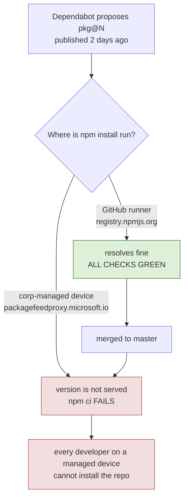

# Dependency PR Merge Register

**Last reviewed:** 2026-09-25
**Owner:** @pranems

Why this file exists: on 2026-07-30 three Dependabot PRs looked perfectly
mergeable - all required checks green, no conflicts after rebase - and merging
any of them would have broken every Microsoft corp-managed developer machine
while leaving CI green. The reason is invisible to every gate this repository
owns, and invisible to Dependabot, so it has to be written down.

Related: [NPM_SUPPLY_CHAIN_QUARANTINE_POLICY.md](NPM_SUPPLY_CHAIN_QUARANTINE_POLICY.md).

---

## 1. The rule this register enforces

> **Do not merge a dependency bump whose target version the corporate npm feed
> proxy does not yet serve.**

Microsoft corp devices resolve npm through `https://packagefeedproxy.microsoft.io/npm/`,
which applies a **7-day minimum release age**. The proxy does not merely warn
about a too-new version - it **does not list it at all**. Measured 2026-07-30:

```text
npm view @types/node versions   ->  newest visible 26.1.1  (22.6 days old)
Dependabot proposes             ->  26.1.2                  (not served)
```

### Why CI cannot catch this

GitHub-hosted runners are not corp-managed devices. They resolve against
`registry.npmjs.org`, where the version exists. So the failure mode is:



A green PR is therefore **not** evidence that a bump is safe to merge here. This
is the same shape as the two escapes already in the pattern catalog: the signal
that was checked and the property that mattered were different things.

### How to check before merging

```powershell
# Is the proposed version actually served here?
$proposed = '26.1.2'
(npm view '@types/node' versions --json | ConvertFrom-Json) -contains $proposed
# False -> still quarantined, DO NOT MERGE
```

Merge only when this returns `True` for **every** package the PR bumps.

---

## 2. Current register

### Merged

| PR | Change | Date | Note |
|---|---|---|---|
| #140 | npm removed from runtime image, `fast-uri` 3.1.4 | 2026-07-30 | Took Trivy 7 findings -> 0 |
| #139 | log-id 500, audit-batch-loss vector, unreachable fallback | 2026-07-30 | Security |
| #138 | GitHub Actions bumps (8) | 2026-07-30 | No npm involvement, so the quarantine does not apply. SHA pinning preserved with `# vX.Y.Z` comments |
| #182 | Hono override pin remediation | 2026-09-25 | Public-runner lockfiles; 12 findings -> 0; both targets older than 7 days |

### Current open dependency work

| PR | Ecosystem | Status |
|---|---|---|
| **#154** | web | **Postponed.** `@fluentui/react-components@9.74.8` was only 4.1 days old on 2026-09-25. `@tanstack/react-query@5.103.2` had no verifiable publish-time response through the managed feed, so its status is unknown rather than clean. Re-check both; do not merge on green public CI alone. |
| **#158** | GitHub Actions | Eligible: no npm quarantine applies. Replaced by a current-master branch that keeps every action SHA-pinned and updates the canonical infrastructure doc in the same change. |

### Closed or replaced

| PR | Disposition |
|---|---|
| **#128** | Closed. Quarantine elapsed, but Node 26 typings are incompatible with the supported Node 24 runtime line. A future change must align typings to Node 24 instead. |
| **#136 / #137** | Closed by Dependabot in August; superseded by later grouped updates. |
| **#152** | Closed by Dependabot as no longer needed after the v0.55.35 security and lockfile refresh. |

---

## 3. Options if a bump is ever urgently needed while quarantined

In priority order. **Note that circumventing the Minimum Release control is not
on this list, and never will be** - it is an explicit violation of Microsoft
security policy (see the quarantine policy doc, Section 2).

1. **Wait.** The window is 7 days. For a routine minor bump this is correct.
2. **Pin the newest version that is already >= 7 days old.** Often gets the fix
   without waiting.
3. **If it is a security fix that cannot wait:** raise it through Global
   Helpdesk (`aka.ms/techweb`) and let the security team decide. Do not
   self-approve an exception.

---

## 4. Review cadence

Re-run the check at every Stage X.2 `securityBestPracticesIntake`, and whenever
Dependabot re-proposes. If a PR sits here longer than ~30 days, the version is
no longer merely quarantined and something else is wrong - investigate rather
than continuing to defer.
