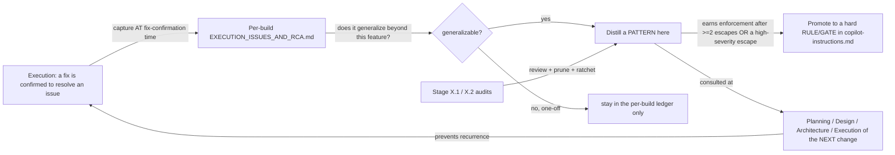
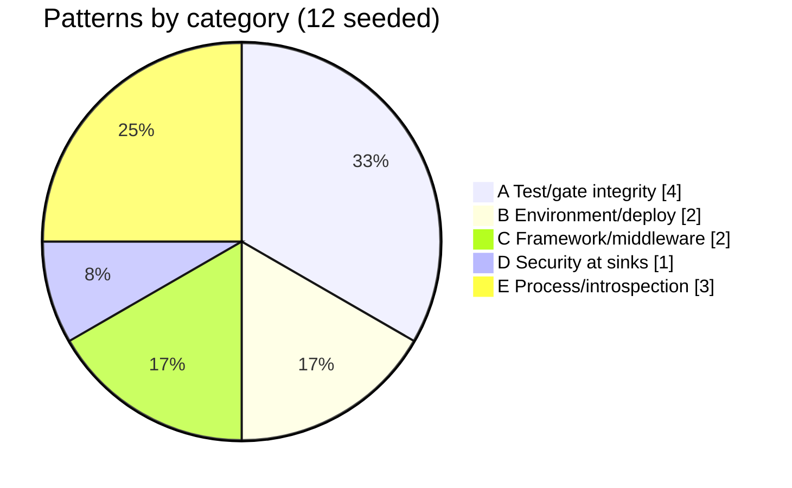

# Engineering lessons and patterns - the self-improving ledger

> **What this is.** The **central, continually-updated** knowledge base of cross-cutting engineering patterns learned from real issues on this codebase. It is a *living* doc: it is **appended to** every time a fix is confirmed to resolve an issue that generalizes, and it is **reviewed and re-pruned** on the Stage X audit cadence. It is the layer between raw per-build issue ledgers and hard standing rules:
>
> ```
> raw issue (per-build EXECUTION_ISSUES_AND_RCA.md)
>     -> distilled PATTERN (this doc)
>         -> hard RULE / GATE (.github/copilot-instructions.md) when it earns enforcement
> ```
>
> **When to consult it.** This doc MUST be read at the **start of planning, design, architecture, and execution** of any non-trivial change - that is the whole point of a central self-learning store. The anti-patterns below are the ones that did NOT show up in prior planning/design/architecture stages and only surfaced during execution from unforeseen combinations of circumstances. Reading them up front is how the next plan avoids re-learning them.
>
> **Norms.** Like every doc in this repo it carries the explanatory tools (Mermaid diagrams, dashboard tables, distribution charts). Keep it that way when you append.

---

## 1. The self-improvement loop (how this doc is fed and used)



The loop only works if three disciplines hold (Section 2). They exist because the **session that produces the fix may undergo context compaction**, and a pattern not written down at the moment of the fix is silently lost.

---

## 2. Maintenance protocol (the three disciplines)

### D1 - Capture at fix-confirmation time, NOT retroactively (compaction-resilience)

The agent's working context is compacted from time to time. Anything learned earlier in a long build - the exact symptom, the failing assertion text, the root-cause mechanism - can be summarized away before the build ends. Therefore:

> **The RCA entry for an issue MUST be written the moment the fix is confirmed to resolve it**, into the per-build `EXECUTION_ISSUES_AND_RCA.md`, while the symptom / RCA / fix / why are still in full fidelity. Do NOT defer all RCA writing to the end of the build - by then the early detail may be compacted and you will reconstruct it imperfectly (or miss it).

A confirmed fix = the gate that was RED is now GREEN *because of this change*. That is the trigger to record the entry.

### D2 - Reconcile against the full session transcript at build end

Even with D1, a long build crosses compaction boundaries. So at the end of a build (before declaring it complete) the agent MUST reconcile the per-build ledger against the **full session transcript** - not just in-context recollection:

- The transcript lives at `…/GitHub.copilot-chat/transcripts/<sessionId>.jsonl` (and a debug log alongside it). A `VSCODE_TARGET_SESSION_LOG` variable points at the session's debug log when present.
- Scan it for issue signals: `error TS`, HTTP error codes (`415`, `422`, `401`), `ECONNRESET`/`ENOENT`/`Cannot find module`, `RED`, `false positive`, `root cause`, `no-op`, `silently`, `drift`, `rebase`, lint-ceiling bumps, parity.
- Every diagnosed problem in the transcript MUST map to a ledger entry. If one does not, add it. Record the reconciliation (method + result) in the ledger's provenance note so a future reader knows the ledger is transcript-verified, not memory-only.

> The first application of D2 (2026-06-19, auth build) found **no missing substantive issue** but did correct an **understated recurrence count** (a lint-ceiling churn the in-context view had pegged at "3+" was actually ~50). That is exactly the fidelity loss D1+D2 exist to catch.

### D3 - Promote, don't just record

When a pattern recurs (>= 2 escapes) or a single escape is high-severity (could have shipped a defect or produced a false-green gate), promote it from "pattern" here to a **hard rule/gate** in [.github/copilot-instructions.md](../../.github/copilot-instructions.md) in the SAME commit chain. A pattern that only ever lives in this doc is advisory; the loop is not closed until the high-value ones become enforced.

### Maintenance triggers

| Trigger | Action |
|---|---|
| A fix is confirmed (D1) | Append the issue to the per-build RCA ledger immediately |
| A build/feature completes (D2) | Reconcile the ledger vs the full transcript; harvest any generalizable pattern into Section 4 here |
| Stage X.1 self-audit (release / monthly / incident) | Review Section 4: prune stale patterns, ratchet baselines, confirm promoted rules still fire |
| Stage X.2 security intake | Feed security-class patterns (Category D) from external-landscape changes |
| An operator-surfaced bug escapes all gates | Add the pattern here AND a rule in copilot-instructions in the same commit ("why didn't a gate catch this?") |

---

## 3. Consult-at-stage matrix

Which pattern categories to actively review at each stage of the next change:

| Stage | Review these categories | Why |
|---|---|---|
| **Planning** | E (process/introspection), B (environment) | Scope the validation matrix + form-factor secrets up front; budget the RCA-capture + transcript-reconcile steps |
| **Design** | C (framework/middleware), A (test integrity) | Decide content-type/error-envelope policy before coding; design testability seams (override hooks, default providers) in |
| **Architecture** | D (security at sinks), C (framework) | Place prototype-pollution guards + alg-pinning at the architectural sink, not per-call; choose where global middleware applies |
| **Execution** | A (gate integrity), B (environment), E (capture timing) | Write structural-signal assertions; smoke-run before batching; capture each RCA at fix-confirmation time |

---

## 4. Pattern catalog

Patterns are grouped by category. Each carries: the **anti-pattern** (the symptom that bit), the **lesson**, what it **became** (the rule/gate, if promoted), and its **origin**.

### 4.1 Category distribution



### Category A - Test-harness and gate integrity (the false-green family)

The most dangerous class: a gate that is GREEN but proves nothing. Every pattern here is a way a test can lie.

| ID | Pattern | Anti-pattern (what bit) | Lesson | Became | Origin |
|---|---|---|---|---|---|
| **PA-1** | Verify the mock is actually wired | `overrideProvider(JWKS_FETCH)` silently no-op'd because the optional token had no default provider; the test hit the live network while looking mocked | Any `@Optional() @Inject(TOKEN)` a test overrides MUST have a default provider registered in its module, or the override is a no-op | Rule: "Optional-DI-token default-provider rule" | auth I-01 |
| **PA-2** | Assert the structural signal, not a substring | A loose `token` regex matched the legitimate `issuedTokenTtlSec` field, failing a correct no-secret response (and would also miss a real nested secret) | Presence/absence-of-key assertions over a serialized payload MUST match the structural key form (`"<key>"`), never a bare substring | Rule: "Structural-key assertion rule" (live-test analog of R1) | auth I-05 |
| **PA-3** | Measure the outcome, not the property | (visual) asserting `getComputedStyle().textOverflow === 'ellipsis'` greenlit a bug where `display` prevented the ellipsis from ever rendering | Assert the achieved result (`scrollWidth > clientWidth`, bounded width), not that a CSS property was set | Rule R1 (visual-layout) | Finding-D 2026-05-29 |
| **PA-4** | A stale/failing gate is a signal to fix the test, not lower the bar | 121 Playwright fails were dismissed as noise; one was a real bug. A vitest layout assertion in JSDOM is a false-positive farm | Delete stale specs; move layout assertions to Playwright; a visual-regression FAIL is "investigate," never "regenerate baselines" | Rules R2, R3; Stage 5.2 hygiene | Finding-C/D |

### Category B - Cross-environment and deployment drift

Values that differ silently across local / Docker / Azure.

| ID | Pattern | Anti-pattern (what bit) | Lesson | Became | Origin |
|---|---|---|---|---|---|
| **PB-1** | Per-environment value table | The live-test runner's default OAuth secret (`changeme-oauth`) is wrong for Docker compose (`devscimclientsecret`); the unqualified run 401'd | Secrets / ports / base URLs differ by form factor; keep a documented table and pass the matching value per target; never assume the default fits all | Rule: "Per-environment auth-value table" | auth I-08 |
| **PB-2** | Probe readiness with a contract endpoint | `/health` 404'd on Docker (assumed path); guessing a health route wastes a cycle | Use a real contract call (token issuance, a discovery GET) as the readiness probe - it proves more than a health ping | (convention) | auth I-09 |

### Category C - Framework and middleware behavior

Global middleware and framework defaults shape contracts in ways the design stage misses.

| ID | Pattern | Anti-pattern (what bit) | Lesson | Became | Origin |
|---|---|---|---|---|---|
| **PC-1** | Global filters/interceptors are contract-shaping | The SCIM exception filter rewrapped the OAuth `{error}` body into `{detail}`; the content-type middleware 415'd a form-urlencoded token POST | A new endpoint under an existing prefix inherits its middleware. Assert the ACTUAL serialized body; decide content-type/error policy explicitly per cross-protocol route | (convention; A3 carve-out) | auth I-03, I-04 |
| **PC-2** | Cross-backend parity is not optional | An InMemory endpoint-create was missing the duplicate-name guard that Prisma had; it escaped for months with no unit lock | Any file with an `isInMemoryBackend` branch MUST be walked through the parity matrix; run both backends | Stage 2.5 + 2.6; `crossBackendParityAudit` | Finding-B 2026-05 |

### Category D - Security at sinks

Place the guard where the dangerous operation happens, structurally.

| ID | Pattern | Anti-pattern (what bit) | Lesson | Became | Origin |
|---|---|---|---|---|---|
| **PD-1** | Defense-in-depth at the write sink | CodeQL flagged `obj[userKey] = value` sinks where `userKey` could be `__proto__` (CWE-1321), even behind an upstream path-guard | Guard the FINAL key at the sink with a single-source `isUnsafeObjectKey`, not only the path upstream; one helper used everywhere beats per-site ad-hoc | (security guard + tests) | auth I-10 |

### Category E - Process and introspection (the meta-patterns)

How the agent learns reliably across compaction boundaries.

| ID | Pattern | Anti-pattern (what bit) | Lesson | Became | Origin |
|---|---|---|---|---|---|
| **PE-1** | Capture RCA at fix-confirmation time | Writing all RCA at build-end after compaction lost fidelity (a ~50x recurrence was misremembered as "3+") | Record each issue's symptom/RCA/fix/why the moment the fix goes RED->GREEN, into the per-build ledger | Discipline D1 (this doc) + RCA-ledger rule | operator 2026-06-19 |
| **PE-2** | Reconcile against the full transcript at build end | In-context recollection alone cannot survive multiple compactions across a long build | Scan the session transcript jsonl for issue signals; map every diagnosed problem to a ledger entry; record provenance | Discipline D2 (this doc) + RCA-ledger rule | operator 2026-06-19 |
| **PE-3** | Smoke-run before batching | Q6 batched ALL live-tests to a checkpoint; a live-only test bug (PA-2) surfaced one stage later than a per-step local-node run would have | Author AND smoke-run each new live section against one live node in the same step, before deferring the rest of the matrix | Rule: "Author-and-smoke-run-before-batch" | auth I-05 escape |

---

## 5. Escape-pattern tracker (promotion candidates)

A pattern earns a hard rule after >= 2 escapes OR one high-severity escape. This table tracks the count so promotion is evidence-based, not vibes.

| Pattern | Escapes so far | Promoted to a rule? |
|---|---|---|
| PA-1 (mock wiring) | 1 (high-sev: false-green) | YES - immediate (high severity) |
| PA-2 (structural assertion) | 1 (high-sev: false-green) | YES - immediate (high severity) |
| PA-3 / PA-4 (visual/stale gates) | 2+ (Finding-C, Finding-D) | YES (R1/R2/R3) |
| PB-1 (env value table) | 1 | YES (convention recorded) |
| PC-1 (contract-shaping middleware) | 2 (I-03, I-04) | convention; revisit if a 3rd escape |
| PC-2 (cross-backend parity) | 1 (high-sev: Finding-B) | YES (Stage 2.5/2.6) |
| PD-1 (sink guard) | 1 (high-sev: security) | YES (guard + tests) |
| PE-1 / PE-2 (capture timing + transcript) | 1 (operator-surfaced) | YES - this doc + RCA rule |
| PE-3 (smoke before batch) | 1 | convention; revisit if a 2nd escape |

---

## 6. How to append (checklist for the next contributor)

When a fix is confirmed and it generalizes:

1. **(D1)** It is already in the per-build `EXECUTION_ISSUES_AND_RCA.md` (you wrote it at fix-confirmation time).
2. Decide the **category** (A-E) and assign the next free ID in that category.
3. Add a row to the Section 4 table: anti-pattern / lesson / became / origin.
4. Update the Section 4.1 pie chart count and the Section 5 escape tracker.
5. If it crossed the promotion bar (D3), add the hard rule to [copilot-instructions.md](../../.github/copilot-instructions.md) in the same commit and set "Became" accordingly.
6. Keep the explanatory-tools norm: if you add a category, refresh the Mermaid charts.

---

## 7. References

- Per-build issue ledger (the raw source): [docs/auth/EXECUTION_ISSUES_AND_RCA.md](../auth/EXECUTION_ISSUES_AND_RCA.md)
- Hard rules + gates (where promoted patterns land): [.github/copilot-instructions.md](../../.github/copilot-instructions.md) - see "Execution Issue RCA Ledger", R1-R9, the Mandatory Quality Gates
- Stage X audits that review this doc: [docs/strategy/SELF_AUDIT_2026-05-16.md](SELF_AUDIT_2026-05-16.md), [docs/strategy/SECURITY_INTAKE_2026-05-17.md](SECURITY_INTAKE_2026-05-17.md)
- Doc index: [docs/INDEX.md](../INDEX.md)
