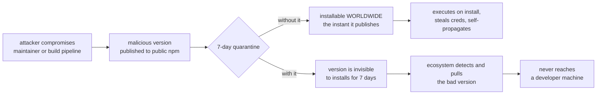
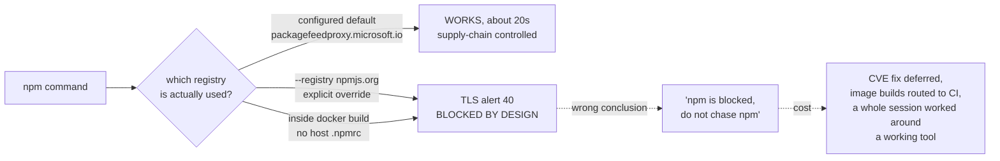
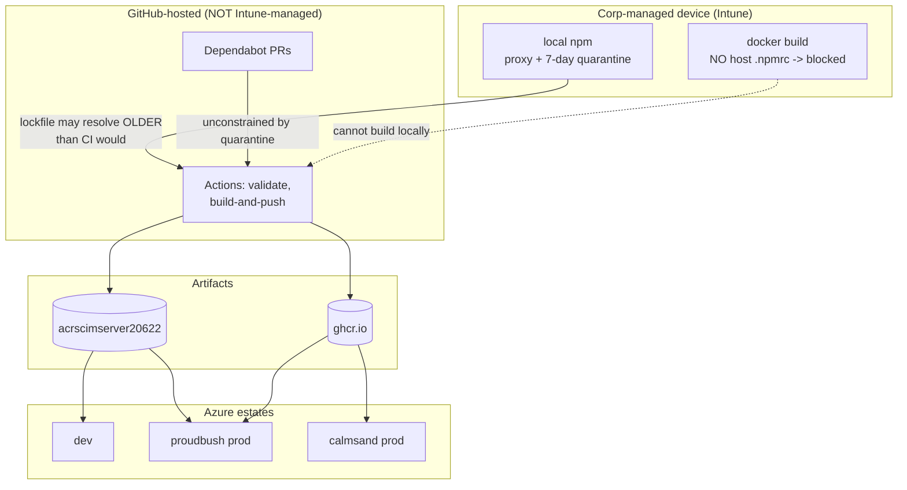

# npm 7-Day Quarantine and Corporate Supply-Chain Controls: Policy, Findings, and What Changes

> **Status:** Binding corporate policy. Not optional, not negotiable, and **not bypassable**.
> **Source:** 1ES / CISO notification to Microsoft engineering, received **2026-07-30**.
> **Scope of this document:** what the policy is, what it does to **every** surface SCIMServer touches (local dev, Docker, GitHub Actions, Dependabot, GHCR/ACR, Azure deployments, our own gates), what we measured, what we got wrong, and the standing rules that now apply.
> **Companion memory:** `/memories/corp-security-policies.md` (cross-workspace) and `/memories/repo/local-env-npm-registry-block.md` (repo-specific).

---

## 0. Provenance, and the limits of this document

Everything here is either **quoted from the notification** or **measured on this machine on 2026-07-30**. Nothing is inferred from the linked documentation, for a reason worth stating plainly:

| Source | Status |
|---|---|
| The 1ES notification email | Available, quoted below |
| `eng.ms/.../secure-supply-chain/central-feed-services-cfs/npm-7-day-quarantine` | **NOT READABLE** - redirects to Microsoft sign-in |
| `eng.ms/.../secure-supply-chain/central-feed-services-cfs/central-feed-services-cfs` | **NOT READABLE** - redirects to Microsoft sign-in |
| Local machine state | Measured, see [Section 3](#3-measured-state-of-a-corp-managed-device) |

**No content has been invented for the two inaccessible pages.** If they specify an exemption workflow, CFS-side configuration, or a rollout timeline, this document does not know it. Anyone with corp access should paste the relevant sections in and extend [Section 9](#9-open-questions-that-need-the-internal-docs).

This matters because the failure mode this repository has been bitten by twice is a **confidently wrong document that terminates an investigation in the wrong place** (see [DEPLOYMENT_INFRASTRUCTURE_AND_FORM_FACTORS.md](../DEPLOYMENT_INFRASTRUCTURE_AND_FORM_FACTORS.md) Section 0.1). A gap marked "unknown" is safe. A gap filled with a plausible guess is not.

---

## 1. The policy, in brief

> "Starting today, we're enabling a 7-day quarantine on new NPM packages on Microsoft Corp devices."

| Aspect | Detail |
|---|---|
| Control | `min-release-age = 7` applied to the **npm client** |
| Delivery | Automatically, via **Intune**. Nothing to enable |
| Behaviour | `npm install` **skips** any package version published less than 7 days ago, and uses the newest version that is at least 7 days old |
| `package-lock.json` | **Unaffected** - pinned versions are already older than 7 days, so `npm ci` is a no-op change |
| Scope | npm installs **outside** a properly configured repo context |
| Also coming | The same 7-day quarantine inside **CFS** (Central Feed Services), for in-repo development, rolling out late June through July |

### Why

Quoting the notification, because the reasoning is the part worth internalising:

> "Supply chain attacks on NPM are no longer rare events. They are automated, fast-moving, and highly scalable... Public NPM offers **no inline blocking**: the moment a version is published, it's live and installable worldwide, malicious or not."

Three cited incidents:

| Date | Incident | Why it matters here |
|---|---|---|
| 2025-09 | `chalk` and `debug` maintainer phished; malicious versions live instantly. Over 2 billion combined weekly downloads, an estimated **third of the npm ecosystem** briefly at risk | Both are deep transitive dependencies of ordinary toolchains. Our `api/` and `web/` trees are exactly the shape that would have been hit |
| ongoing | **Shai-Hulud** self-replicating worm - stole npm, GitHub and cloud credentials, then republished itself through every package its victims could publish | A credential-stealing worm in a build container is not contained by the container. Our CI holds `GITHUB_TOKEN` and GHCR push rights |
| 2026-06 | **Miasma** trojanized dozens of `@redhat-cloud-services` packages by **hijacking their build pipeline** | The compromise was upstream of the registry. Package reputation and download counts would not have saved anyone |

The common thread: these execute **on install** and self-propagate, so a malicious version is increasingly difficult to detect and evict before it spreads. A 7-day hold breaks the chain at its earliest point.



---

## 2. THE HARD RULE: never bypass

> "If you have an urgent business need for a newly published package version... **do not attempt to bypass or work around the NPM Minimum Release control. Circumventing this control is a violation of Microsoft security policy.**"

This is unambiguous, so the operational rule for this repository and for any agent working in it is equally unambiguous.

### Forbidden, without exception

- Setting `min-release-age` to `0` or any lowered value, in any `.npmrc`, env var, or CLI flag
- Passing `--registry` to a public or alternate registry to dodge the control
- Using a proxy, mirror, tunnel, or personal device to obtain a quarantined version
- **Hand-editing `package-lock.json` to inject a quarantined version**
- Recommending, scripting, or documenting any of the above

### The sanctioned paths, in order of preference

1. **Wait** for the version to age past 7 days.
2. **Use the newest version that is already ≥ 7 days old.** Often a patch line already carries the fix - check before assuming you need the newest.
3. **Contact Global Helpdesk** via [aka.ms/techweb](https://aka.ms/techweb) for a genuine urgent business need.

### Check the age before assuming you are blocked

```powershell
npm view <package> time --json
```

Worked example, from the live `fast-uri` remediation this policy was first tested against:

| Version | Published | Age at 2026-07-30 | Under a 7-day quarantine |
|---|---|---|---|
| 3.1.2 (installed, vulnerable) | 2026-05-05 | 86.4 days | n/a |
| 3.1.3 (fixes CVE-2026-13676) | 2026-06-29 | 31.2 days | **installable** |
| 3.1.4 (fixes both CVEs) | 2026-07-19 | 11.4 days | **installable** |

The quarantine was **not** the obstacle. Measuring first avoided a false escalation.

**Postscript, and the reason this example is instructive:** the remediation still could not be completed on this machine - but for a different reason than expected. `fast-uri` reaches the production tree via `@prisma/client -> prisma -> @prisma/dev -> @prisma/streams-local -> ajv -> fast-uri`, so the fix is an `overrides` pin (the repo already uses seven of them). Adding it and regenerating the lockfile worked, and produced a **contaminated entry** - see [Section 5](#5-finding-2-lockfile-generation-is-not-safe-on-a-corp-device). The change was reverted. The lesson is that **"is the version quarantined?" and "can I safely produce the lockfile?" are two separate questions**, and the second one is the harder constraint here.

---

## 3. Measured state of a corp-managed device

Captured 2026-07-30 on the workstation this repository is developed on.

| Check | Command | Result |
|---|---|---|
| npm version | `npm --version` | `11.6.2` |
| Effective registry | `npm config get registry` | **`https://packagefeedproxy.microsoft.io/npm/`** |
| Where it is set | `npm config ls` | **global** `C:\Program Files\nodejs\etc\npmrc` **and** user `~/.npmrc` |
| Additional feed creds | `npm config ls` | `pkgs.dev.azure.com/msazure/one/_packaging/one_PublicPackages` |
| `min-release-age` | `npm config get min-release-age` | `undefined` |
| npm through the proxy | `npm view fast-uri version` | **works**, ~17-25 s |
| `npm audit` through the proxy | `npm audit --json` | **works**, 19.7 s |
| Public registry, direct | `npm view tar --registry https://registry.npmjs.org` | **blocked**, `SSL alert number 40` |

Two conclusions:

1. **The registry redirect is already live**; the client-side `min-release-age` key is **not yet present** on this device at npm 11.6.2. Treat that as *rollout in progress*, not as *absent* - re-check rather than assume.
2. **Direct public-registry access is blocked by design.** That is the supply-chain control functioning, not a broken machine.

---

## 4. Finding 1: we misdiagnosed this, and it was expensive

This repository's memory and two committed documents asserted:

> "the npm registry is BLOCKED on this machine, do not chase npm"

**That conclusion was wrong.** The diagnosis was produced by running:

```powershell
npm view tar version --registry https://registry.npmjs.org
```

which **explicitly overrode the corporate registry**, hit the deliberately blocked public endpoint, and concluded npm was broken. npm works fine through the configured proxy.



### The generalizable lesson

> **When a network call fails, check which endpoint was actually contacted before concluding the network is blocked.**

`npm config get registry` first. This is the supply-chain instance of a pattern this repo already knows: [PA-5](ENGINEERING_LESSONS_AND_PATTERNS.md) (enumerate every provider of a role before blaming content) and the 2026-07-29 wrong-Dockerfile escape (verify against the artifact that actually ships).

### What remains true

`docker build` genuinely does fail on `npm ci`, because **containers do not inherit the host `~/.npmrc`**. The workaround of building images in CI was correct - only the stated reason was wrong.

---

## 5. Finding 2: lockfile generation is NOT safe on a corp device

This one is new, was not in the notification, and is the most dangerous practical consequence. It is **measured, not theoretical** - the check below caught it on its first real use, within an hour of being written.

**Every `resolved` URL in our lockfiles points at the public registry, and every `integrity` is sha512:**

| Lockfile | `resolved` host | `integrity` | Count |
|---|---|---|---|
| `api/package-lock.json` | `registry.npmjs.org` | `sha512` | 725 |

### What actually happened

Attempting the `fast-uri` CVE remediation (add an `overrides` pin, then `npm install --package-lock-only`) produced exactly one changed entry, and it was contaminated **two ways**:

```jsonc
// Schematic shape of the regenerated entry - DO NOT COMMIT
"node_modules/fast-uri": {
  "version": "3.1.4",
  "resolved": "https://ms-feed-12.pkgs.visualstudio.com/1es-public/_packaging/npm-public/npm/registry/fast-uri/-/fast-uri-3.1.4.tgz",
  "integrity": "sha1-Oz2vnOaPQflW3wtQUTLAz86ex68="
}
```

| Problem | Detail | Severity |
|---|---|---|
| **Internal endpoint leaked** | `ms-feed-12.pkgs.visualstudio.com` (and `ms-feed-25` from `npm view`) published in a public repo and in every image built from it | **High** |
| **Integrity DOWNGRADED** | `sha1` instead of `sha512`. The corporate feed reports only a legacy `shasum` and **no `integrity` field at all** (`npm view fast-uri@3.1.4 dist` returns `shasum` + `tarball`, nothing else). A lockfile is a supply-chain control; weakening its hash to satisfy a supply-chain policy is self-defeating | **High** |
| **CI breaks** | GitHub-hosted runners cannot reach the internal feed, so `npm ci` fails for everyone | **High** |

### Why it cannot simply be "fixed up" locally

Rewriting the URL back to `registry.npmjs.org` is not sufficient, because the **correct sha512 is unobtainable from this machine** - the public registry is egress-blocked, and the corporate feed does not serve one. Hand-writing an integrity hash would be fabricating a security-relevant value, which is never acceptable.

### Standing rule

> **npm RESOLUTION works locally; npm LOCKFILE GENERATION does not.**
> Regenerate lockfiles **in CI** or on a non-corp-managed machine. If a lockfile is ever regenerated locally, it MUST be checked before staging, and a contaminated entry MUST be reverted rather than patched.

```powershell
# MUST return only registry.npmjs.org
Select-String -Path api/package-lock.json,web/package-lock.json -Pattern '"resolved":\s*"([^"]+)"' -AllMatches |
  ForEach-Object { $_.Matches } |
  ForEach-Object { ([uri]$_.Groups[1].Value).Host } |
  Sort-Object -Unique

# MUST return only sha512
Select-String -Path api/package-lock.json,web/package-lock.json -Pattern '"integrity":\s*"(sha\d+)' -AllMatches |
  ForEach-Object { $_.Matches } | ForEach-Object { $_.Groups[1].Value } | Sort-Object -Unique
```

Note this is **not** a bypass question. The version selection is unaffected; the problem is purely that the corporate feed describes artifacts differently from the public registry. Reverting a contaminated lockfile keeps us **more** secure, not less.

---

## 6. Impact across everything SCIMServer does



### Surface-by-surface

| Surface | Affected? | What changes |
|---|---|---|
| `npm ci` (all contexts) | **No** | Lockfile pins are already > 7 days old |
| `npm install` / `npm update` / `npm audit fix` locally | **Yes** | May resolve to an **older** version than an unmanaged machine would |
| Lockfile reproducibility local vs CI | **Yes** | A lockfile generated locally can differ from one generated on a GitHub runner. **Expected, not a bug.** Do not "fix" it by bypassing |
| Lockfile `resolved` URLs | **Yes - hazard** | See [Section 5](#5-finding-2-the-lockfile-contamination-hazard) |
| `docker build` locally | **Yes** | Fails at `npm ci`. Build in CI, or run the CI image via `docker-compose.ci-image.yml` |
| GitHub Actions (`validate`, `build-and-push`) | **No** | Runners are not Intune-managed |
| Dependabot | **No** | Runs on GitHub infrastructure |
| GHCR / ACR images | **No** | Built in CI from a lockfile, `npm ci` only |
| Azure Container Apps (dev, proudbush, calmsand) | **No** | Run a prebuilt image; no npm at runtime, and after PR #140 no npm **in** the image at all |
| Standalone Windows package | **Indirect** | Built from the same lockfile |
| **CVE remediation speed** | **Yes** | A fix published < 7 days ago is unusable until it ages. Check `npm view <pkg> time --json` and prefer an older fixed version |

### Our own gates

| Gate | Effect |
|---|---|
| Stage 3b.5 `dependencyCveSweep` | **Runnable locally after all** - `npm audit` works through the proxy. Measured on `api/`: 11 vulnerabilities (0 critical, 4 high, 5 moderate). Its lockfile-regeneration instructions needed fixing, see [Section 7](#7-what-changes-going-forward) |
| Stage 6.1 lockfile regeneration | The documented `docker run node:24-alpine ... npm ci && npm install` recipe **cannot work on a corp device** and has been corrected |
| Stage 4.1/4.2 Docker gates | Already routed through the CI image |
| Stage X.2 `securityBestPracticesIntake` | This policy belongs to **Category 3, supply chain**, and is now a standing item there |

---

## 7. What changes going forward

Standing rules, effective now.

| # | Rule |
|---|---|
| **N1** | **Never bypass** the Minimum Release control. See [Section 2](#2-the-hard-rule-never-bypass). This outranks any deadline, gate, or convenience |
| **N2** | Before concluding "npm is broken" or "the registry is blocked", run `npm config get registry` and test the **configured** endpoint. Never diagnose with `--registry` pointed elsewhere |
| **N3** | **Do not generate lockfiles on a corp device.** Regenerate in CI or on an unmanaged machine. If one is generated locally anyway, run BOTH checks in [Section 5](#5-finding-2-lockfile-generation-is-not-safe-on-a-corp-device) before staging, and **revert** a contaminated entry rather than patching it |
| **N4** | Do **not** bake the corporate registry into any `Dockerfile`, `docker-compose*.yml`, or committed `.npmrc`. It is an internal endpoint and these artifacts are public |
| **N5** | Never hand-write an `integrity` hash. If the correct sha512 is unobtainable, the change does not ship from this machine |
| **N6** | When remediating a CVE, check the fix version's publish age first. Prefer the oldest version that clears the CVE, not the newest available |
| **N7** | Treat a local-vs-CI lockfile difference as **expected**, and resolve it by regenerating in CI - never by lowering the control |
| **N8** | Do not fabricate the contents of the internal 1ES docs. If a specific answer is needed, ask the operator to paste it |

---

## 8. How to check back on this

| What | How | Cadence |
|---|---|---|
| Is the quarantine enforced client-side yet? | `npm config get min-release-age` - `undefined` today, expect a value as rollout completes | Quarterly, or on any surprising install |
| Is the registry still the corporate proxy? | `npm config get registry` | Same |
| Has CFS-side quarantine landed? | Watch for install behaviour changes in CI/CFS contexts | Same |
| Are our lockfiles clean? | The `resolved`-host command in [Section 5](#5-finding-2-the-lockfile-contamination-hazard) | Every lockfile change |
| Has the policy itself changed? | The two `eng.ms` pages (needs corp auth) | Quarterly, and on any new 1ES notification |

Recorded in agent memory at `/memories/corp-security-policies.md` with today's measurements as the baseline, so a future session compares against fact rather than assumption.

---

## 9. Open questions that need the internal docs

Unanswered because the source pages are not readable from here. **Not guessed at.**

1. Is there a formal **exemption** mechanism beyond Global Helpdesk, and what is its SLA?
2. Does the CFS-side quarantine use the same 7-day window, and does it apply to **restore** as well as install?
3. Does the control apply to `npm ci` in any circumstance, or only to resolution? Our reading is resolution-only, based on the notification's statement that lockfile pins are unaffected.
4. Are **transitive** dependencies subject to the same window? Assumed yes, since resolution is resolution.
5. Is there a corporate-approved way to regenerate a lockfile that yields **public** `resolved` URLs?
6. What is the expected behaviour for **GitHub-hosted CI**, which is outside Intune? Is a separate CFS control expected there?

---

## 10. Design and architecture gate disposition

| Check | Finding | Disposition |
|---|---|---|
| SRP | This document records policy and impact. It does not duplicate the deployment topology owned by [DEPLOYMENT_INFRASTRUCTURE_AND_FORM_FACTORS.md](../DEPLOYMENT_INFRASTRUCTURE_AND_FORM_FACTORS.md) or the CVE workflow owned by the `dependencyCveSweep` prompt; it cross-links them | **accepted** |
| Coupling | The never-bypass rule is stated once here and referenced from the Security Gate Map and agent memory, rather than restated in each | **applied** |
| Pattern consistency | Follows the existing "measured, never remembered" and "record the gap rather than guess" conventions of the deployment doc | **accepted** |
| Open/Closed | A future control (CFS quarantine, a new registry) extends [Section 6](#6-impact-across-everything-scimserver-does) rather than rewriting the rules | **accepted** |
| YAGNI counter-check | No gate script was written for this. The lockfile-URL check is a one-line command in the standing rules; automating it before a second sighting would be speculative. **Revisit if a contaminated lockfile is ever staged** | **applied** |
| Self-improvement (R7) | The misdiagnosis in [Section 4](#4-finding-1-we-misdiagnosed-this-and-it-was-expensive) generalizes beyond npm and is promoted to the patterns ledger | **applied** |
