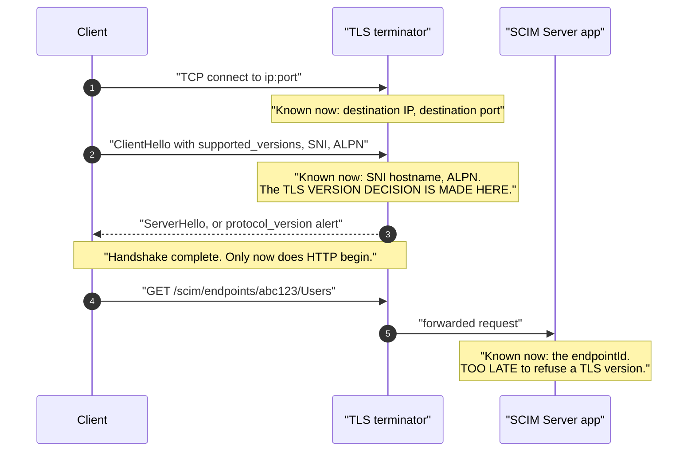
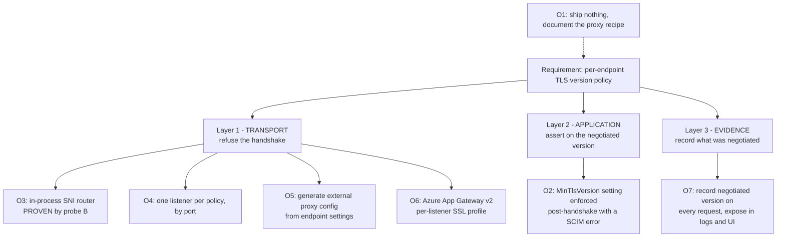
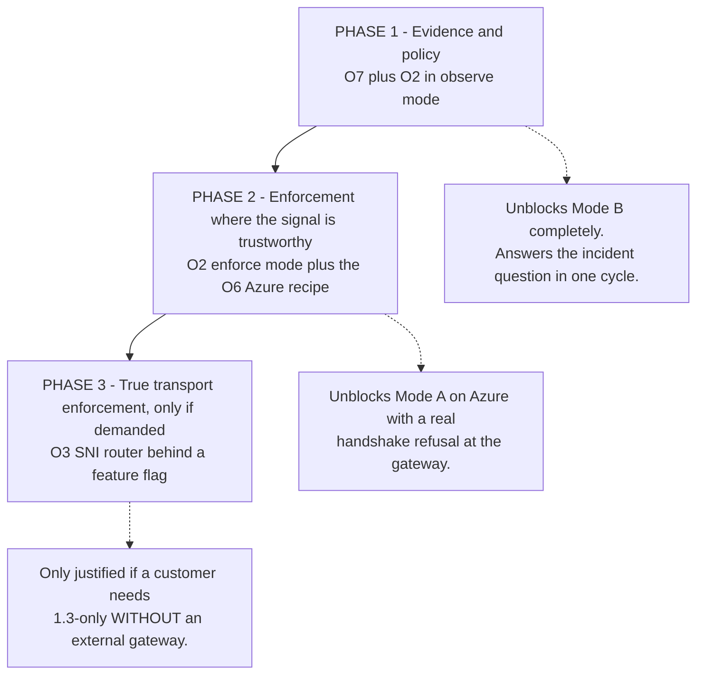

# Per-Endpoint TLS Version Policy: Feasibility, Options, and Recommendation

**Status:** **CLOSED - no production code changed, and none is planned.** The operator confirmed on 2026-07-30 that the TLS-1.3-only ask was **incident only**, which closes every phase below. Full disposition per option in [Section 11.1](#111-answered-2026-07-30---q1-incident-only). This document is retained as the **decision record**, not as a plan.
**Why this is on `master` even though nothing shipped:** the durable value is the **"why not"**. The layer analysis in [Section 3](#3-the-fundamental-constraint) answers "can endpoint X be made TLS-1.3-only?" permanently, for any future asker; [Section 4](#4-measured-evidence-not-assumption) records a **silent-no-op API** that would otherwise be rediscovered the hard way; and [Section 7](#7-the-security-trap-in-o2-and-how-to-avoid-it) documents a property of the code **as it ships today**, independent of TLS policy. Deleting this on closure would guarantee the question is re-litigated from zero.
**Originally authored on:** `feat/per-endpoint-tls-policy` (worktree `SCIMServer-tls-policy`), based on `origin/master` at `e4e5488a`. Cherry-picked to `master` as `d2b5cfb4` with the probe; the branch's TLS 1.3 standalone stack (`docker/tls13/`) was deliberately **not** brought along - it is a form-factor harness, not a design record, and stays on that branch.
**Last verified:** 2026-07-30 - the probe was re-run on `master` and reproduces both findings (mechanism A silently does not enforce; mechanism B rejects at the handshake), with both negative controls passing.
**Evidence artifact:** [scripts/tls-sni-policy-probe.mjs](../../scripts/tls-sni-policy-probe.mjs) - run it with `node scripts/tls-sni-policy-probe.mjs`.

---

## 1. Origin

A prospective user asked whether a SCIM endpoint created through SCIM Server can be made to support **TLS 1.3 only, not TLS 1.2**, in order to work a customer incident. The follow-up question from the operator is the design question this document answers:

> Can TLS version be a **per-endpoint setting**?

The requirement covers both investigation modes discussed earlier, and any combination of them:

| Mode | Goal | Server must |
|---|---|---|
| A | Reproduce the customer's TLS-1.3-only server | REFUSE a TLS 1.2 handshake |
| B | Measure what the provisioning client actually negotiates | ACCEPT both and RECORD which was chosen |

A single design has to serve both, which means the answer cannot be one global switch. It has to be per-endpoint, and it has to produce evidence.

---

## 2. Answer in one paragraph

**Yes, but only if the endpoint is addressable at the transport layer, and "per-endpoint" has to be split into two honestly-named capabilities.** TLS version is negotiated before any HTTP exists, so the URL path that identifies an endpoint today is invisible at handshake time. Real handshake-level refusal therefore requires binding an endpoint to something visible in the ClientHello: an SNI hostname, a port, or an IP. Everything else an application can do happens after the handshake has already succeeded, which is a policy assertion, not a transport restriction. Both are worth building, they compose, and the measured evidence below shows exactly which implementation of the transport half actually works.

---

## 3. The fundamental constraint

Endpoints are addressed today by **path**: `/scim/endpoints/{endpointId}/Users`, resolved in [api/src/modules/scim/controllers/endpoint-scim-users.controller.ts](../../api/src/modules/scim/controllers/endpoint-scim-users.controller.ts). The path is HTTP. TLS version is settled several steps earlier.



The identifiers available at each moment, and whether an endpoint can be keyed on them:

| Identifier | Available at | Usable to select a TLS policy? | Endpoint keyed on it today? |
|---|---|---|---|
| Destination IP | TCP connect | Yes | No |
| Destination port | TCP connect | Yes | No |
| SNI hostname | ClientHello | Yes | No |
| ALPN protocol | ClientHello | Technically yes, semantically wrong | No |
| **URL path** | **after handshake** | **No** | **Yes, this is the current model** |
| Bearer token or endpoint credential | after handshake | No | Yes |

This table is the whole design problem in one view. The single field that identifies an endpoint today is the one field that arrives too late.

---

## 4. Measured evidence, not assumption

Two plausible in-process implementations exist. Rather than reason about OpenSSL semantics, both were measured with [scripts/tls-sni-policy-probe.mjs](../../scripts/tls-sni-policy-probe.mjs), each carrying a negative control so the probe proves itself before its output is believed.

**Certificate validation stays ON throughout.** The probe generates a throwaway self-signed certificate and passes it back as an explicit trust anchor (`ca: [cert]`) rather than setting `rejectUnauthorized: false`. That matters twice over: the disabled-validation form is a real anti-pattern (CodeQL `js/disabling-certificate-validation`, CWE-295/297), and it is also a **weaker measurement** - it leaves open the possibility that a handshake "succeeded" while the certificate was unacceptable. Pinning the one certificate we generated isolates the TLS **version** decision, which is the only variable under test.

Reproduce:

```powershell
node scripts/tls-sni-policy-probe.mjs
```

Result on `node v24.13.0` / `openssl 3.5.4`:

| Mechanism | Scenario | Expected if it works | Observed | Verdict |
|---|---|---|---|---|
| A: one `tls.Server` + `addContext(host, ctx)` | permissive host, client max TLS 1.2 | accept at 1.2 | accepted TLSv1.2 | CONTROL OK |
| A | strict host whose context sets `minVersion: TLSv1.3`, client max TLS 1.2 | reject | **accepted TLSv1.2** | **per-SNI `minVersion` IGNORED** |
| A | strict host, client max TLS 1.3 | accept at 1.3 | accepted TLSv1.3 | OK |
| B: SNI router + one `tls.Server` per policy | permissive host, client max TLS 1.2 | accept at 1.2 | accepted TLSv1.2 | CONTROL OK |
| B | strict host routed to the 1.3-only listener, client max TLS 1.2 | reject | **rejected `ERR_SSL_TLSV1_ALERT_PROTOCOL_VERSION`** | **ENFORCED AT HANDSHAKE** |
| B | strict host, client max TLS 1.3 | accept at 1.3 | accepted TLSv1.3 | OK |

**Two findings that change the design.**

1. **Mechanism A silently does not work.** Setting `minVersion` on a per-SNI `SecureContext` is accepted by the API, throws no error, logs nothing, and has no effect. The protocol bounds are fixed on the connection before the SNI callback runs. Anyone implementing per-endpoint TLS the obvious way would ship a switch that appears to work and enforces nothing. This is precisely the "CSS applied but layout not achieved" failure class the repo's R1 rule exists for, transplanted to the transport layer, and it is why this probe is committed rather than discarded.
2. **Mechanism B does work**, producing a genuine `protocol_version` alert. A per-endpoint TLS 1.3-only endpoint is achievable in-process, with no external proxy, provided endpoints can carry a hostname.

The same limitation constrains the external-proxy option. nginx documents that for `ssl_protocols`, "if the directive is specified on the server level, the value from the default server can be used" ([ngx_http_ssl_module](https://nginx.org/en/docs/http/ngx_http_ssl_module.html)). Per-`server_name` TLS version is therefore not reliable in nginx either; separate listening sockets are required. Caddy and Application Gateway do not share this constraint.

---

## 5. Option catalogue



### O1. Ship nothing, document the proxy recipe

Status quo plus a documented nginx or Caddy configuration.

- Cost: near zero. Value: unblocks the immediate incident.
- Fails the actual ask: nothing is per-endpoint, and the operator must hand-maintain proxy config per customer.

### O2. `MinTlsVersion` as an endpoint setting, enforced at the application layer

Add a per-endpoint setting. After the handshake, read the negotiated version and reject with a SCIM error if it is below the endpoint's floor.

- Fits the existing 27-flag registry and the 10-cell completeness matrix exactly, so the implementation shape is already known.
- Works with today's path addressing. No hostname, no DNS, no certificate work.
- Serves Mode B immediately, and gives Mode A an unambiguous, well-diagnosed rejection.
- **Honest limitation: the TLS 1.2 handshake still completes.** This is a policy control, not a transport control. It must never be described as "TLS 1.3 only".
- **Depends on a trustworthy signal.** See section 7, which is the real risk in this option.

### O3. In-process SNI router with one TLS listener per policy

Give an endpoint an optional hostname binding. A thin router peeks the ClientHello, extracts SNI, and hands the socket to a `tls.Server` built for that policy. Proven working by probe B.

- Genuine handshake refusal. This is what a security reviewer means by "TLS 1.3 only".
- No external proxy dependency, so it works in the standalone and Docker form factors that have no terminator today.
- Costs: certificate provisioning (a wildcard makes this tractable), DNS, a new hostname concept on the endpoint model, and the app taking on TLS termination it currently delegates.
- **Does not work on Azure Container Apps**, whose ingress terminates TLS before the app ever sees a socket.

### O4. One listener per policy, addressed by port

Same as O3 but keyed on port rather than SNI, so no certificate-per-host or DNS work.

- Simplest true enforcement. `:8443` is 1.3-only, `:8444` is 1.2+1.3.
- Ugly for a customer-facing URL, and Container Apps HTTP ingress does not expose extra ports with the HTTP feature set.
- Useful as the local and Docker test rig even if it never ships as a customer-facing shape.

### O5. Generate external proxy config from endpoint settings

Keep the declared policy in the endpoint record, and emit a ready-to-run nginx or Caddy fragment.

- Turns the endpoint setting into the single source of truth without the app terminating TLS.
- The declared policy and the deployed reality can drift, which is exactly the class of silent staleness the deployment-doc gate was just built to prevent. Would need its own drift check.

### O6. Azure Application Gateway v2 in front of Container Apps

Confirmed available from Microsoft documentation:

- A **custom TLS policy can set `MinProtocolVersion` to `TLSv1_3`**, and the 2022 or CustomV2 policies supporting TLS 1.3 require the v2 SKU ([TLS policy overview](https://learn.microsoft.com/en-us/azure/application-gateway/application-gateway-ssl-policy-overview)).
- **SSL Profiles are listener-specific**, so different hostnames on the same gateway can carry different TLS policies. This is per-endpoint TLS policy, natively, in Azure.
- The server variable **`ssl_connection_protocol`** holds "the protocol of an established TLS connection" and can be injected into a request header by a rewrite rule ([rewrite HTTP headers](https://learn.microsoft.com/en-us/azure/application-gateway/rewrite-http-headers-url)).

That last point is the one that unlocks O2 on Azure: Container Apps ingress does not tell the app which TLS version was negotiated, but an Application Gateway in front of it can. Caveat from the same documentation: 2022 or CustomV2 policies and older policies **cannot co-exist on one gateway**.

### O7. Record and expose the negotiated version

Independent of any enforcement: capture the negotiated protocol on every request and surface it in the request log, the decision trace, and the connection-info panel.

- Small, safe, and it is the entire deliverable for Mode B.
- Makes any later enforcement verifiable rather than assumed.
- Has standalone value beyond this incident: it answers "what does this client actually negotiate" for every integration, permanently.

---

## 6. Comparison

| Option | True handshake refusal | Per-endpoint | Works on Container Apps | Works standalone or Docker | New infra needed | Relative effort |
|---|---|---|---|---|---|---|
| O1 documentation only | Yes, by the operator | No | No | Yes | Proxy | Trivial |
| O2 app-layer setting | **No** | **Yes** | Only with a version header | Yes | None | Small |
| O3 SNI router | **Yes** | **Yes** | **No** | Yes | Certs plus DNS | Large |
| O4 port per policy | **Yes** | Coarse | No | Yes | Certs | Medium |
| O5 config generator | Yes, at the proxy | Yes | With a proxy | Yes | Proxy | Medium |
| O6 Application Gateway | **Yes** | **Yes** | **Yes** | N/A | App Gateway | Medium, mostly infra |
| O7 observability | N/A | Yes | Only with a version header | Yes | None | Small |

---

## 7. The security trap in O2, and how to avoid it

O2 needs to know the negotiated TLS version. The app terminates nothing, so the value has to arrive in a header, and **a header is attacker-controlled unless it is proven otherwise**.

[api/src/main.ts](../../api/src/main.ts) currently sets `app.set('trust proxy', true)`, meaning every forwarded header from any source is trusted. That is tolerable for building a base URL. It is **not** tolerable as the basis of a security decision: any client could send `X-Forwarded-TLS-Version: TLSv1.3` and walk straight through a 1.3-only endpoint over TLS 1.2, turning a compliance control into decoration.

```mermaid
flowchart LR
    A["Negotiated version needed"] --> B{"Does the app<br/>terminate TLS itself?"}
    B -->|Yes| C["socket.getProtocol&#40;&#41;<br/>AUTHORITATIVE"]
    B -->|No| D{"Is there a proven<br/>trusted terminator?"}
    D -->|No| E["NO TRUSTWORTHY SIGNAL.<br/>Fail closed or disable the control.<br/>Never trust a raw header."]
    D -->|Yes| F["Header from that terminator only,<br/>peer IP checked against an allowlist"]
    F --> G["Treated as authoritative"]
```



Required guard rails if O2 is built:

1. The header name and the trusted terminator are **explicit configuration**, defaulting to off. No implicit trust.
2. The header is honoured only when the immediate peer address matches a configured allowlist. `trust proxy: true` must not be the gate.
3. With no trustworthy signal, the endpoint's TLS control reports itself **unavailable**, and the endpoint states that plainly rather than reporting a false green. A control that cannot be evaluated must never look like a control that passed.
4. The setting is named for what it does. Something like `MinTlsVersionPolicy` with a companion `TlsPolicyEnforcement` of `observe` or `enforce`, never a bare label implying transport-level exclusivity.

---

## 8. Recommendation

> **SUPERSEDED 2026-07-30 by the answer to Q1 - see [Section 11.1](#111-answered-2026-07-30---q1-incident-only).** The ask was incident only, so **no phase below was built**. O1 (documented proxy recipe) resolved the incident; O3 is dropped permanently rather than deferred, because its gate ("a customer needs 1.3-only WITHOUT a gateway") can no longer open. The phased plan is retained unchanged as the starting point if the question ever returns as a product capability - the sequencing and its reasoning are the reusable part.

Build it in three phases, smallest and most certain first. Each phase is independently useful and independently shippable.



### Phase 1: record the truth, declare the intent

- Capture the negotiated TLS version per request from `socket.getProtocol()` when the app terminates TLS, or from a **configured, allowlisted** terminator header otherwise. Record `unknown` when neither applies, and never guess.
- Surface it in the request log, the decision trace, and connection-info.
- Add the per-endpoint setting in **observe mode only**: it records a would-block decision and returns success. This mirrors the shadow-first approach already used for the W2.5 mint-plane enablement, which is an established pattern here rather than a new invention.
- Live-test section asserting the recorded version matches what the client actually negotiated, not merely that the field exists.

Phase 1 alone fully answers Mode B and would have resolved the original question in a single cycle.

### Phase 2: enforce where the signal is real

- Flip the setting to support `enforce`, rejecting sub-floor requests with a SCIM error carrying `scimType`, the negotiated version, the configured floor, and the signal source.
- Refuse to enforce when the signal source is untrusted. Report the control as unavailable instead.
- Document the O6 Application Gateway recipe as the supported way to get **genuine** TLS 1.3-only in front of an Azure deployment, with `ssl_connection_protocol` injected so Phase 1 and Phase 2 have an authoritative signal.

### Phase 3: only on demand

Implement O3 behind a flag, reusing the router already proven by probe B, if and only if a customer needs handshake-level refusal without an external gateway. **Do not build this speculatively.** It brings certificates, DNS, and TLS termination into a codebase that has deliberately delegated all three, and O6 already covers the Azure case that matters today.

### What to tell the original requester now

The incident does not have to wait for any of this. The self-hosted proxy recipe already discussed reproduces a TLS-1.3-only endpoint today, and Phase 1 would make the measurement half a first-class product feature.

---

## 9. Non-goals

Recorded explicitly so scope does not drift:

- No per-endpoint **cipher suite** selection. Version is the ask; ciphers are a much larger surface with no stated requirement.
- No mutual TLS or client-certificate policy in this work.
- No TLS policy on **outbound** connections, for example the JWKS fetch in [api/src/oauth/external-jwks-validator.service.ts](../../api/src/oauth/external-jwks-validator.service.ts). That is a separate axis and needs its own requirement before it is touched.
- No TLS policy DSL. A small enum of floors is sufficient and a policy language is speculative generality.

---

## 10. Design and architecture gate disposition

Per the standing gate in [.github/copilot-instructions.md](../../.github/copilot-instructions.md):

| Check | Finding | Disposition |
|---|---|---|
| SRP | Phase 1 adds recording plus one setting. Version capture belongs in its own small transport-context helper, not inside the auth guard or the controller. | **applied** in the design: capture is specified as a separate concern from enforcement |
| Coupling | Enforcement must not depend directly on a header name. It depends on a "negotiated version provider" with two implementations, direct socket and trusted terminator. | **applied** in the design: two real implementations exist, so the seam is justified |
| Pattern consistency | Follows the existing endpoint-setting registry, the 10-cell matrix, the SCIM error and decision-trace shape, and the shadow-first rollout already used by W2.5. | **accepted**, no drift |
| Open/Closed | A future third signal source, such as PROXY protocol, would extend the provider rather than edit enforcement. | **accepted** |
| YAGNI counter-check | O3 has exactly one hypothetical consumer today, so it is deferred to Phase 3 rather than built. The version-provider seam has two real implementations, so it stays. | **applied**: Phase 3 explicitly gated on real demand |
| Self-improvement (R7) | Probe mechanism A revealed a **silent-no-op API**: a TLS setting that is accepted, never errors, and does nothing. No existing gate covers "transport-layer setting applied but not in effect". | **applied**: the probe is committed with negative controls, so any future implementation has a ready falsification test. **scheduled**: if Phase 2 or 3 is built, add a live-test assertion that a sub-floor client is actually refused, never merely that the setting persisted. Persisted-setting assertions are the R10 presence-not-correctness trap. |

---

## 11. Open questions for the operator

### 11.1 ANSWERED, 2026-07-30 - Q1: incident only

> **Q1. Is the near-term need the customer incident only, or a product capability for future customers?**
>
> **Operator answer (2026-07-30): the TLS-1.3-only ask was INCIDENT ONLY.**

That answer closes this work. It is recorded here rather than in a chat log because the whole point of keeping this document is to stop the question being re-litigated from zero.

**Disposition of every option, given "incident only":**

| Option | Disposition |
|---|---|
| O1 documentation only | **This is the answer.** The self-hosted proxy recipe reproduces a TLS-1.3-only endpoint today and unblocked the incident. Nothing further ships. |
| O2 app-layer `MinTlsVersion` setting | **Not built.** It exists to serve a product capability nobody has asked for, and section 7 shows it cannot be trusted on Azure without an Application Gateway supplying an authoritative signal. |
| O3 in-process SNI router | **Dropped permanently**, not merely deferred. Phase 3 was already gated on "a customer needs 1.3-only WITHOUT an external gateway"; with no product capability in scope, that gate can never open. Building it would bring certificates, DNS and TLS termination into a codebase that deliberately delegates all three. |
| O4 port per policy | **Not built.** Its only remaining value was as a local test rig for O3. |
| O5 proxy-config generator | **Not built.** It exists to keep a per-endpoint setting in sync with a proxy; there is no per-endpoint setting. |
| O6 Application Gateway | **Not provisioned.** Kept as the documented supported answer IF the question returns as a product ask. |
| O7 record the negotiated version | **Not built**, though it was the cheapest and most independently useful item. See below. |

**What is deliberately kept despite the closure:**

1. **This document**, as the durable "why not". Section 3 answers "can endpoint X be made TLS-1.3-only?" permanently.
2. **[scripts/tls-sni-policy-probe.mjs](../../scripts/tls-sni-policy-probe.mjs)**, because the silent-no-op it records (mechanism A) is a trap independent of whether we ever build this. Anyone reaching for the obvious implementation has a ready falsification test.
3. **The section 7 security finding**, which is a property of the code as it ships today and has nothing to do with TLS policy. It is now a standing rule in the [Cross-Cutting Security Gate Map](../../.github/copilot-instructions.md).

**What is NOT kept:** the branch's TLS 1.3 standalone stack (`docker/tls13/`) stays on `feat/per-endpoint-tls-policy` and is not merged. It is a form-factor harness, not a design record, and an incident-only answer does not justify carrying a second Docker stack on `master`. If a TLS-1.3-only question recurs, recover it from that branch rather than rebuilding it.

**The one item worth reconsidering on its own merits (O7).** Recording the negotiated TLS version per request was never really about this incident - it answers "what does this client actually negotiate?" for **every** integration, permanently, and costs nothing. It is being dropped with the rest only because it has no requester today. If an integration question ever needs that data, reopen O7 alone; it does not depend on any other option here. Note the section 7 caveat still applies: on Azure the app terminates nothing, so without an Application Gateway injecting `ssl_connection_protocol` the honest recorded value is `unknown`, and it must be recorded as `unknown` rather than guessed.

### 11.2 Remaining questions - moot unless Q1 is revisited

These were only ever conditional on Q1 being answered "product capability". They are retained so a future reopening starts from the right questions rather than from scratch.

2. If it becomes a product capability, is an **Application Gateway** acceptable in front of the Azure deployments? If yes, O6 plus Phase 1 and 2 is by far the best value and Phase 3 can be dropped permanently.
3. Would endpoints ever be allowed **their own hostname**? That is the prerequisite for O3, and it has value well beyond TLS.
4. Should the observe-mode default be **on for every endpoint**, so the negotiated version is always recorded? Recommended yes, since the data is useful for every integration and costs nothing.
