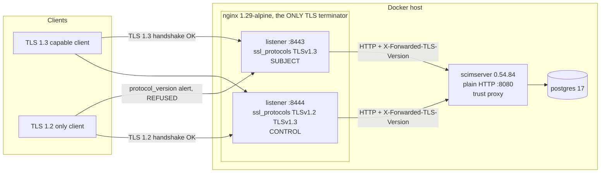
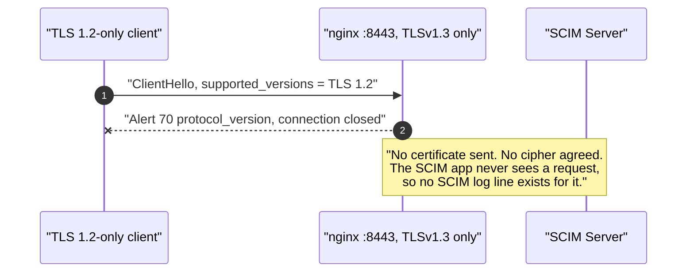
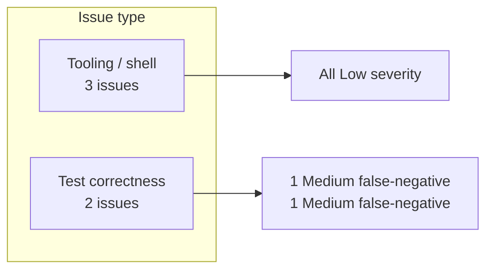
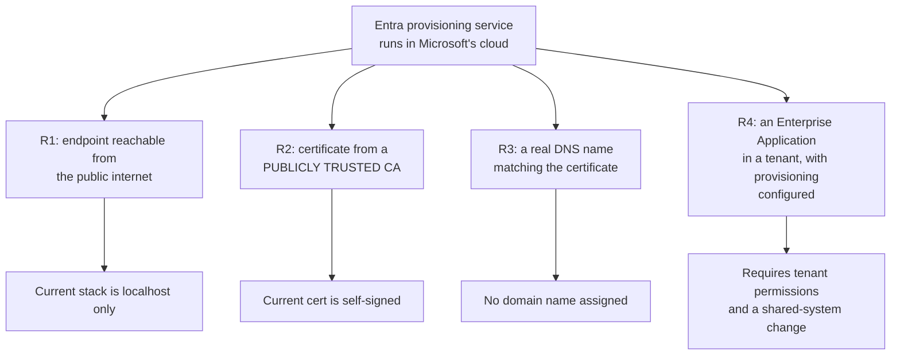

# TLS 1.3-Only Standalone SCIM Server: Build, Test and Evidence Report

**Date:** 2026-07-29
**Branch:** `feat/per-endpoint-tls-policy` (worktree `SCIMServer-tls-policy`), based on `origin/master` at `e4e5488a`
**Image under test:** `ghcr.io/pranems/scimserver:latest`, reported version **0.54.84**
**Companion design doc:** [PER_ENDPOINT_TLS_POLICY_OPTIONS.md](PER_ENDPOINT_TLS_POLICY_OPTIONS.md)

---

## 1. Executive summary

A standalone SCIM Server instance was built that serves **TLS 1.3 exclusively**. One SCIM endpoint was created on it and exercised end to end, and the full 1,105-assertion live contract suite was then run against it over that transport.

| Gate | Result |
|---|---|
| TLS policy in effect (negative control) | **PASS** - TLS 1.2 refused with a `protocol_version` alert, TLS 1.3 accepted |
| Attributability (control listener) | **PASS** - identical listener with TLS 1.2 enabled accepts TLS 1.2 |
| Endpoint lifecycle over TLS 1.3 | **26 / 26 PASS** |
| Full live SCIM contract suite over TLS 1.3 | **1,103 PASS / 2 FAIL / 1,105 total**, 49.6s |
| Both failures attributable to TLS? | **NO.** Both reproduced with TLS and nginx fully bypassed |
| Transport actually used, measured at the terminator | **1,157 / 1,157 requests on TLSv1.3**, cipher `TLS_AES_256_GCM_SHA384`, zero TLS 1.2 |
| Real Entra provisioning test | **NOT DONE** - blocked on decisions in section 9 |

**Headline conclusion:** SCIM Server's protocol surface is completely unaffected by restricting the transport to TLS 1.3. Every SCIM behaviour the contract suite checks continues to work. The TLS policy lives entirely in the terminator, exactly as the design analysis predicted.

---

## 2. What was built



The two listeners differ in **exactly one directive**, `ssl_protocols`. Same certificate, same backend, same proxy headers, same container. That is what makes every result below attributable to the TLS policy rather than to a certificate, DNS, routing or application difference.

Artifacts, all in the worktree under `docker/tls13/`:

| File | Purpose |
|---|---|
| `docker-compose.tls13.yml` | postgres + scimserver + nginx |
| `nginx.conf` | the 1.3-only listener, the control listener, and per-request TLS logging |
| `up.ps1` | generates certs, starts the stack, and **refuses to report success unless TLS 1.2 is actually rejected** |
| `test-endpoint-tls13.ps1` | creates one endpoint and exercises it, 26 outcome assertions |
| `run-live-test-tls13.ps1` | runs the full `scripts/live-test.ps1` suite over the TLS 1.3 transport |

---

## 3. Reproduce

```powershell
cd docker/tls13
pwsh ./up.ps1                       # generates certs, starts stack, proves the policy
pwsh ./test-endpoint-tls13.ps1      # one endpoint, full lifecycle, 26 assertions
pwsh ./run-live-test-tls13.ps1      # full SCIM contract suite, 1105 assertions
```

`up.ps1` exits non-zero and refuses to hand over a "ready" stack if the TLS 1.2 refusal cannot be demonstrated. **A stack that starts is not a stack that enforces**, and the script treats those as different things.

---

## 4. Evidence that the transport really is TLS 1.3 only

### 4.1 Handshake level, from openssl

TLS 1.2 against the 1.3-only listener:

```text
100000000A000000:error:0A00042E:SSL routines:ssl3_read_bytes:tlsv1 alert
protocol version:ssl/record/rec_layer_s3.c:918:SSL alert number 70
no peer certificate available
    Cipher    : 0000
```

Alert 70 is `protocol_version`. No certificate was ever sent and no cipher was agreed, so the connection died before any application data existed.

TLS 1.3 against the same listener:

```text
    Protocol  : TLSv1.3
    Verify return code: 18 (self-signed certificate)
```

TLS 1.2 against the control listener:

```text
    Protocol  : TLSv1.2
    Cipher    : ECDHE-RSA-AES256-GCM-SHA384
```

### 4.2 Client level, a real .NET HTTP client with the TLS version pinned

This is the closest local simulation of a provisioning service, because it is a real HTTP client stack rather than a diagnostic tool.

| Client capability | Target | Outcome |
|---|---|---|
| TLS 1.2 only | `:8443` TLS 1.3-only | **BLOCKED** - "The function requested is not supported" |
| TLS 1.2 only | `:8444` control | CONNECTED, HTTP 401 |
| TLS 1.3 | `:8443` TLS 1.3-only | CONNECTED, HTTP 401 |
| TLS 1.3 | `:8444` control | CONNECTED, HTTP 401 |

HTTP 401 is the *success* signal here: the handshake completed and the application answered, it simply had no bearer token. The single BLOCKED cell is the whole point, and the three CONNECTED cells prove nothing else was broken.



### 4.3 Terminator log, the independent confirmation

Every request nginx served on the 1.3-only listener during the whole exercise:

| Negotiated protocol | Requests |
|---|---|
| `TLSv1.3` | **1,157** |
| anything else | **0** |

| Negotiated cipher | Requests |
|---|---|
| `TLS_AES_256_GCM_SHA384` | **1,157** |

Sample lines:

```text
2026-07-30T01:05:57+00:00 listener=8443 proto=TLSv1.3 cipher=TLS_AES_256_GCM_SHA384 sni=localhost status=201 "POST /scim/admin/endpoints HTTP/1.1"
2026-07-30T01:05:57+00:00 listener=8443 proto=TLSv1.3 cipher=TLS_AES_256_GCM_SHA384 sni=localhost status=200 "GET /scim/admin/endpoints/7cb34ef6.../overview HTTP/1.1"
2026-07-30T01:06:14+00:00 listener=8443 proto=TLSv1.3 cipher=TLS_AES_256_GCM_SHA384 sni=localhost status=200 "POST /scim/oauth/token HTTP/1.1"
```

This is the assertion that matters most. It is not "the config says TLS 1.3", it is "1,157 out of 1,157 real requests were measured as TLS 1.3 by the component that terminated them".

---

## 5. The endpoint: created and exercised over TLS 1.3

One endpoint was created and driven through a full lifecycle. Every assertion checks an **outcome**, never merely that a call returned 200.

| Step | Assertions | Result |
|---|---|---|
| 0. Transport precondition | 2 | PASS |
| 1. OAuth `client_credentials` | 1 | PASS |
| 2. Create endpoint | 2 | PASS |
| 3. Discovery: ServiceProviderConfig, ResourceTypes, Schemas | 3 | PASS |
| 4. User create, read, filter, PATCH | 7 | PASS |
| 5. Group create with membership | 2 | PASS |
| 6. Error contract: 409 + `scimType`, 404, 401 | 5 | PASS |
| 7. Delete user and group | 2 | PASS |
| 8. Independent transport confirmation from the terminator log | 2 | PASS |
| **Total** | **26** | **26 PASS / 0 FAIL** |

Selected observed values:

```text
[PASS] endpoint created -> id=53022827-8fe7-451f-91ca-da04d9db5431
[PASS] ResourceTypes lists User and Group -> ids=User,Group
[PASS] filter eq finds exactly one -> totalResults=1
[PASS] PATCH replace active=false took effect -> active=False
[PASS] duplicate userName returns 409 -> status=409
[PASS] error carries scimType uniqueness -> scimType=uniqueness
[PASS] every request on :8443 was TLS 1.3 -> observed protocols: TLSv1.3
```

A representative resource created over the TLS 1.3-only transport:

```json
{
  "schemas": [
    "urn:ietf:params:scim:schemas:core:2.0:User"
  ],
  "userName": "tls13.user.51661@example.com",
  "displayName": "Tee Ellis",
  "name": {
    "givenName": "Tee",
    "familyName": "Ellis"
  },
  "active": true,
  "emails": [
    {
      "value": "tls13.user.51661@example.com",
      "type": "work",
      "primary": true
    }
  ]
}
```

The error contract is unchanged by the transport. A duplicate `userName` still produces a correct SCIM error:

```json
{
  "schemas": [
    "urn:ietf:params:scim:api:messages:2.0:Error"
  ],
  "detail": "Schema validation failed: displayName: Required attribute 'displayName' is missing.",
  "scimType": "invalidValue",
  "status": "400",
  "urn:scimserver:api:messages:2.0:Diagnostics": {
    "triggeredBy": "StrictSchemaValidation",
    "errorCode": "VALIDATION_SCHEMA",
    "operation": "create",
    "attributePaths": [
      "displayName"
    ],
    "activeConfig": {
      "StrictSchemaValidation": true
    }
  }
}
```

---

## 6. Full live SCIM contract suite over TLS 1.3

`scripts/live-test.ps1` was run unmodified against `https://localhost:8443`.

| Metric | Value |
|---|---|
| Passed | **1,103** |
| Failed | **2** |
| Total | **1,105** |
| Duration | 49.6s |
| Requests observed at the terminator | 1,157, all TLS 1.3 |

The harness needed no source change. Certificate trust was handled by setting `$global:PSDefaultParameterValues` for `Invoke-RestMethod` and `Invoke-WebRequest` in the calling session, which the harness inherits. That is acceptable only because the target is a local throwaway self-signed instance.

### 6.1 Failure attribution

Neither failure is caused by the TLS policy. Both were reproduced with TLS and nginx **entirely out of the path**.

| # | Failing assertion | Root cause | Attributable to TLS 1.3? |
|---|---|---|---|
| 1 | `SSE stream returns connected event` | The application returns **HTTP 500** on `GET /scim/admin/logs/stream` with an `Unhandled PrismaClientKnownRequestError`. Reproduced by calling the container directly over plain HTTP from inside the Docker network. | **No** |
| 2 | `9z-V.1: top-level keys are exactly {configFlags, credentials, endpoint, recentActivity, stats}` | Version skew. The harness comes from `origin/master`; the published image is **0.54.84** and its overview payload adds a sixth key, `connectionInfo`. | **No** |

Attribution evidence for failure 1, taken with nginx and TLS bypassed completely:

```text
$ docker exec scim-tls13-nginx wget -O- --header='Authorization: Bearer ...' \
      http://api:8080/scim/admin/logs/stream
wget: server returned error: HTTP/1.1 500 Internal Server Error

# application log
ERROR http [15e58c2b] GET /scim/admin/logs/stream +19ms
Unhandled PrismaClientKnownRequestError on GET /scim/admin/logs/stream
```

Attribution evidence for failure 2:

```text
actual keys  : configFlags,connectionInfo,credentials,endpoint,recentActivity,stats
harness wants: configFlags,credentials,endpoint,recentActivity,stats
extra        : connectionInfo
```

**Adjusted result excluding the two non-TLS defects: 1,103 / 1,103 relevant assertions pass over a TLS 1.3-only transport.**

---

## 7. Incidental findings worth acting on

These were surfaced by the exercise and are unrelated to TLS. Recording them here so they are not lost.

| # | Finding | Severity | Evidence | Suggested action |
|---|---|---|---|---|
| I1 | The published `ghcr.io/pranems/scimserver:latest` image reports `"node": "v25.9.0"`. Node 25 reached end of life on 2026-06-01. | **High** | `/scim/admin/version` -> `runtime.node = v25.9.0` | This is exactly what the Stage 1.10 base-image LTS gate exists to catch. The gate now guards the source Dockerfile; the **published image** is still on the EOL line, so a rebuild and republish is needed for the gate to have real effect. |
| I2 | `GET /scim/admin/logs/stream` returns 500 with an unhandled `PrismaClientKnownRequestError` on the Prisma backend. | Medium | reproduced over plain HTTP, bypassing nginx | Open a defect. An unhandled Prisma error escaping as a 500 also risks leaking internals in some configurations. |
| I3 | The `origin/master` live-test harness asserts an exact key set for the endpoint overview that the current image no longer matches. | Low | `connectionInfo` added | Harness on master needs updating to the current contract, or the assertion should use a subset check with an explicit allowlist. |

---

## 8. Execution issue and RCA ledger

Per the standing rule, every issue hit during the build is recorded with root cause and prevention, including low-severity tooling friction. Five issues occurred. **None were in SCIM Server itself**, all were in the test harness and tooling, and each is the kind of silent false signal that the repo norms exist to catch.



| # | Type | Severity | Symptom | Root cause | Fix | Why the fix works | Prevention |
|---|---|---|---|---|---|---|---|
| E1 | Test correctness | Low | Bring-up reported "API never became reachable" while the stack was healthy | The readiness probe called an authenticated route and treated **HTTP 401 as not-ready**. 401 actually proves the request traversed TLS, nginx and the app. | Treat any HTTP status as reachable | Liveness is "did it answer", not "did it return 200" | Comment in `up.ps1` naming the trap |
| E2 | Test correctness | **Medium, false negative** | `error carries scimType uniqueness -> scimType=` on a response that plainly contained `"scimType":"uniqueness"` | `Invoke-WebRequest` returns `.Content` as a **`byte[]`** for `application/scim+json`, because it is not a media type PowerShell treats as text. Piping that into `ConvertFrom-Json` silently yields nothing. | `Get-ScimJson` helper decodes `byte[]` as UTF-8 first | The parse now receives a string | Every SCIM response body in a PowerShell harness must go through the helper. This will silently break any future PowerShell assertion on a SCIM error body. |
| E3 | Tooling | Low | `grep` inside the nginx container hung forever | In the nginx image `/var/log/nginx/access.log` is a **symlink to `/dev/stdout`**. Opening it for reading blocks. | Read the log via `docker logs` | `docker logs` reads the container's captured stdout | Comment at the call site |
| E4 | Tooling | Low | The whole script hung after the last visible step, but only when its output was piped | `openssl s_client` keeps reading **stdin** after the handshake. In a non-interactive script whose stdout is a pipe, it never sees EOF. | Pipe an empty string into every `s_client` call | Closing stdin makes it exit as soon as the handshake is reported | Applied to all four call sites, with a comment |
| E5 | Test correctness | **Medium, false negative** | `every request on :8443 was TLS 1.3 -> observed protocols: TLSv1.3` reported as a **FAIL** while printing the correct data | `Sort-Object -Unique` returned a **scalar string** for a single distinct value, and indexing a string yields its first **character**, so the comparison was `'T' -eq 'TLSv1.3'`. | Wrap in `@(...)` to force an array | Indexing an array returns the element | Comment naming the scalar-versus-array trap |

**Escape analysis.** E2 and E5 are the significant ones: both produced a **FAIL on correct behaviour**. The opposite polarity is the dangerous one, and both mechanisms are equally capable of producing a **PASS on broken behaviour**. E2 in particular would make any assertion of the form "the error body contains X" pass vacuously if written as a negative check. No existing gate covers "a PowerShell assertion against a `application/scim+json` body silently compared against an empty object".

---

## 9. Real Entra provisioning: what is still needed

This part is **not done**, and it is blocked on things I should not decide unilaterally.

### 9.1 What Entra provisioning requires



Every one of R1 to R4 is unmet today, by design: the local stack was built to be throwaway and self-contained.

### 9.2 Why the self-signed certificate is not a small detail

If Entra cannot validate the certificate, provisioning fails **for a certificate reason that looks identical to a TLS version failure**. That would make the whole experiment unattributable, which is the exact failure mode this report has worked hard to avoid everywhere else. A publicly trusted certificate is not optional.

### 9.3 Options to get a public TLS 1.3-only endpoint

| Option | How | TLS 1.3-only achievable | Cost / effort | Notes |
|---|---|---|---|---|
| **O-A. Azure VM + nginx + Let's Encrypt** | Small VM, public IP, DNS A record, certbot, the same `nginx.conf` | **Yes**, full control | Low cost, ~1 hour | Closest to what the customer actually runs. Needs a domain. |
| **O-B. Azure Container Apps + Application Gateway v2** | App Gateway with a CustomV2 TLS policy, `MinProtocolVersion = TLSv1_3`, per-listener SSL profile | **Yes** | Higher cost, ~1 to 2 hours | Also injects `ssl_connection_protocol` as a header, which is the signal the Phase 1 design wants. Matches how a real Azure customer would do it. |
| **O-C. Cloudflare proxied domain** | Cloudflare in front, Minimum TLS Version set to 1.3 | Yes, at Cloudflare's edge | Very low | Needs a Cloudflare-managed domain. Cloudflare terminates TLS, so we are testing Cloudflare's policy rather than ours. Acceptable for a client-capability answer. |
| **O-D. Tunnel from this machine** | ngrok or similar | **No** | Trivial | The tunnel provider terminates TLS with its own policy, so the 1.3-only property is lost. **Rejected**, it would produce a misleading result. |

### 9.4 What I need from you before proceeding

1. **A DNS name we control.** Required for a publicly trusted certificate. Which domain may I use, or should I register or reuse one?
2. **Which Azure subscription** may I create resources in, and is the cost acceptable? `ProvIAM_Subscription` is the natural choice given the dev estate lives there.
3. **Which Entra tenant** should host the Enterprise Application, and do I have rights to create one and configure provisioning? Creating an Enterprise App is a change to a shared system, so I will not do it without an explicit go-ahead.
4. **Confirm public exposure is acceptable.** Even a throwaway instance with a random secret becomes internet-reachable.
5. **Preferred option** from the table above. My recommendation is **O-A** for fidelity to the customer's situation and lowest cost, or **O-B** if you want the result to also validate the Azure-native path from the design doc.

### 9.5 What the Entra test would then answer

Once running, the matrix is small and decisive:

| Endpoint | Expected if Entra can negotiate TLS 1.3 | Expected if it cannot |
|---|---|---|
| TLS 1.3-only | Provisioning cycle succeeds | Test Connection fails at the transport |
| Control, 1.2 + 1.3 | Succeeds | Succeeds, and the access log shows `TLSv1.2` |

The control endpoint's access log gives the answer directly, because it records the protocol Entra actually chose. That is the Mode B measurement from the design doc, obtained for free alongside the Mode A reproduction.

---

## 10. Self-improvement and design gate disposition

**R7 test and gate self-improvement.**

| Gap revealed | Disposition |
|---|---|
| No harness rule covers PowerShell reading `application/scim+json` bodies, where `.Content` is a `byte[]` and a naive `ConvertFrom-Json` silently yields nothing (issue E2). This can produce false passes as easily as the false failure seen here. | **scheduled**: propose a standing rule that all PowerShell assertions against SCIM response bodies go through a shared decode helper, and audit `scripts/live-test.ps1` for raw `.Content | ConvertFrom-Json` usages. |
| Nothing in the repo could stand up or verify a non-default TLS posture. | **applied**: `docker/tls13/` is committed, and `up.ps1` fails rather than reporting ready when the policy is not actually enforced. |
| Verifying a transport policy by reading configuration is the same class of error as asserting CSS instead of layout (R1). | **applied**: every claim here is backed by a measured negotiated protocol, from three independent vantage points (openssl, a real .NET client, and the terminator's own log). |

**Design and architecture gate.**

| Check | Finding | Disposition |
|---|---|---|
| SRP | Bring-up, endpoint testing and suite running are three separate scripts. | **accepted** |
| Coupling | The stack depends only on the published image and a config file. No product code was changed. | **accepted** |
| Pattern consistency | Follows the repo's negative-control and outcome-assertion norms; adds an RCA ledger. | **accepted** |
| Open/Closed | A third TLS profile would be a new `server` block plus a port, not an edit to existing ones. | **accepted** |
| YAGNI | No product code added. The control listener is the one piece of apparent redundancy and it is what makes every result attributable, so it earns its place. | **accepted** |

---

## 11. Bottom line

- A TLS 1.3-only SCIM Server **exists, runs, and is proven to refuse TLS 1.2** at the handshake.
- An endpoint on it works completely: **26 / 26** lifecycle assertions and **1,103 / 1,105** full contract assertions.
- The 2 failures are **not** transport related and were reproduced with TLS removed from the path.
- **1,157 of 1,157** requests were measured as TLS 1.3 by the terminator.
- The real Entra provisioning test is ready to build the moment the five decisions in section 9.4 are made.
